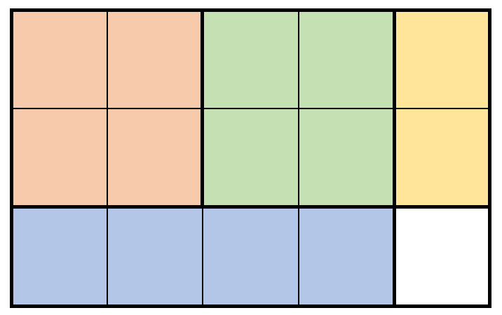
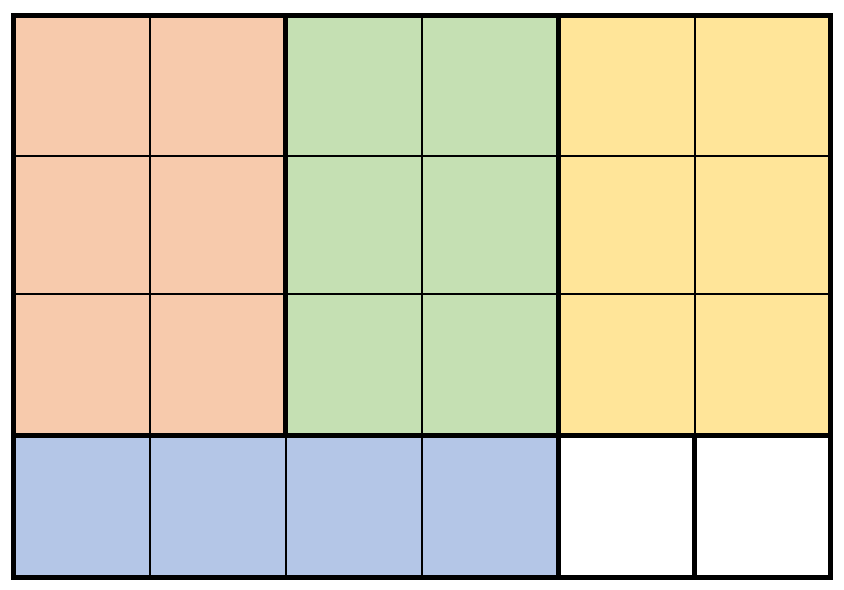

## 🆚295-5/28

### 6078. 重排字符形成目标字符串✔

给你两个下标从 **0** 开始的字符串 `s` 和 `target` 。你可以从 `s` 取出一些字符并将其重排，得到若干新的字符串。

从 `s` 中取出字符并重新排列，返回可以形成 `target` 的 **最大** 副本数。

**示例 1：**

```
输入：s = "ilovecodingonleetcode", target = "code"
输出：2
解释：
对于 "code" 的第 1 个副本，选取下标为 4 、5 、6 和 7 的字符。
对于 "code" 的第 2 个副本，选取下标为 17 、18 、19 和 20 的字符。
形成的字符串分别是 "ecod" 和 "code" ，都可以重排为 "code" 。
可以形成最多 2 个 "code" 的副本，所以返回 2 。
```

**示例 2：**

```
输入：s = "abcba", target = "abc"
输出：1
解释：
选取下标为 0 、1 和 2 的字符，可以形成 "abc" 的 1 个副本。 
可以形成最多 1 个 "abc" 的副本，所以返回 1 。
注意，尽管下标 3 和 4 分别有额外的 'a' 和 'b' ，但不能重用下标 2 处的 'c' ，所以无法形成 "abc" 的第 2 个副本。
```

**示例 3：**

```
输入：s = "abbaccaddaeea", target = "aaaaa"
输出：1
解释：
选取下标为 0 、3 、6 、9 和 12 的字符，可以形成 "aaaaa" 的 1 个副本。
可以形成最多 1 个 "aaaaa" 的副本，所以返回 1 。
```

```java
class Solution {
    public int rearrangeCharacters(String s, String target) {
        if(target.length()>s.length()){
            return 0;
        }
    HashMap<Character,Integer> map = new HashMap<>();
        for(int i =0;i<s.length();i++){
            char c = s.charAt(i);
            if(!map.containsKey(c)){
                map.put(c,1);
            }else{
                map.put(c,map.get(c)+1);
            }
        }
        int sum = 0;
        while(true){
            for(int j = 0;j<target.length();j++){
                char d = target.charAt(j);
                if(map.getOrDefault(d,0)>=1){
                    map.put(d, map.get(d)-1);
                }else{
                    return sum;
                }
            }
            sum++;
        }
    }
}
```

### 6079. 价格减免✔

**句子** 是由若干个单词组成的字符串，单词之间用单个空格分隔，其中每个单词可以包含数字、小写字母、和美元符号 `'$'` 。如果单词的形式为美元符号后跟着一个非负实数，那么这个单词就表示一个价格。

- 例如 `"$100"`、`"$23"` 和 `"$6.75"` 表示价格，而 `"100"`、`"$"` 和 `"2$3"` 不是。

**注意：**本题输入中的价格均为整数。

给你一个字符串 `sentence` 和一个整数 `discount` 。对于每个表示价格的单词，都在价格的基础上减免 `discount%` ，并 **更新** 该单词到句子中。所有更新后的价格应该表示为一个 **恰好保留小数点后两位** 的数字。

返回表示修改后句子的字符串。

**示例 1：**

```
输入：sentence = "there are $1 $2 and 5$ candies in the shop", discount = 50
输出："there are $0.50 $1.00 and 5$ candies in the shop"
解释：
表示价格的单词是 "$1" 和 "$2" 。 
- "$1" 减免 50% 为 "$0.50" ，所以 "$1" 替换为 "$0.50" 。
- "$2" 减免 50% 为 "$1" ，所以 "$1" 替换为 "$1.00" 。
```

**示例 2：**

```
输入：sentence = "1 2 $3 4 $5 $6 7 8$ $9 $10$", discount = 100
输出："1 2 $0.00 4 $0.00 $0.00 7 8$ $0.00 $10$"
解释：
任何价格减免 100% 都会得到 0 。
表示价格的单词分别是 "$3"、"$5"、"$6" 和 "$9"。
每个单词都替换为 "$0.00"。
```

 

```java
class Solution {
   public String discountPrices(String sentence, int discount) {
        StringBuilder sb = new StringBuilder();
        String[] arr = sentence.split(" ");
        boolean flag = false;
        for(int i = 0;i<arr.length;i++){
            flag = false;
            if(arr[i].charAt(0)=='$'&&arr[i].length()>1){
                for(int k = 1;k<arr[i].length();k++){
                    if(arr[i].charAt(k)>'9'||arr[i].charAt(k)<'0'){
                        flag = true;
                        break;
                    }
                }
                if(flag) {sb.append(arr[i]).append(" ");continue;}
                double num = Double.valueOf(arr[i].substring(1));
                num = num*(100-discount)/100;
                arr[i] = "$"+String.format("%.2f",num);
            }
            sb.append(arr[i]).append(" ");
        }
        return sb.substring(0,sb.length()-1);
    }
}
```


### 2289. 使数组按非递减顺序排列🟥🟥

> 给你一个下标从 **0** 开始的整数数组 `nums` 。在一步操作中，移除所有满足 `nums[i - 1] > nums[i]` 的 `nums[i]` ，其中 `0 < i < nums.length` 。
>
> 重复执行步骤，直到 `nums` 变为 **非递减** 数组，返回所需执行的操作数。
>
> **示例 1：**
>
> ```
> 输入：nums = [5,3,4,4,7,3,6,11,8,5,11]
> 输出：3
> 解释：执行下述几个步骤：
> - 步骤 1 ：[5,3,4,4,7,3,6,11,8,5,11] 变为 [5,4,4,7,6,11,11]
> - 步骤 2 ：[5,4,4,7,6,11,11] 变为 [5,4,7,11,11]
> - 步骤 3 ：[5,4,7,11,11] 变为 [5,7,11,11]
> [5,7,11,11] 是一个非递减数组，因此，返回 3 。
> ```
>
> **示例 2：**
>
> ```
> 输入：nums = [4,5,7,7,13]
> 输出：0
> 解释：nums 已经是一个非递减数组，因此，返回 0 。
> ```
>

```java
public int totalSteps(int[] nums){
    ArrayDeque<Integer> stack = new ArrayDeque<>();
    int[] dp = new int[nums.length];
    int res = 0;
    for(int i = 0;i<nums.length;i++){
        int p = 0;
        while(!stack.isEmpty()&&nums[stack.peek()]<=nums[i]){
            p = Math.max(p,dp[stack.peek()]);
            stack.pop();
        }
        if(!stack.isEmpty()){
            dp[i] = p+1;
            res = Math.max(res,dp[i]);
        }
        stack.push(i);
    }
    return res;
}
```


```c
官方解法给的是用链表模拟，但复杂度并不是O(N)，考虑这样一组数据：N+1, 1, 2, 3, 4, ..., N，数组循环遍历复杂度显然是O(N^2)，用链表严格意义的复杂度为O(k*N)，k为需要的操作数，也就是题目的答案，答案值越高，其复杂度越高，这个解法能通过，其实是数据比较弱，或者说随机状态下表现已经足够。

下面讨论O(N)的解法，数组的终态是一个非递减数组，哪 些数被留下是确定的，剩下其他所有的数都会被删掉。
我们用S[i]代表第i个数被删掉所需要的操作数，显然被留下的数S[i] == 0，因为不需要删除。
如何求S[i]:
1. 假设第i个数，大于或等于左侧所有的数，那么显然S[i] == 0
2. 否则，找到i左侧最近一个下标k，使得nums[k] >= nums[i]，则 S[i] = Max(S[k+1], S[k+2], ..., S[i-1]) + 1
第1点很容易了解，论证下第2点，先说下限，因为k到i之间的数，全部小于nums[i]，所以要删除第i个数，那么k到i之间的数必须被删掉才可进行，而且删掉之后，还要追加一步删掉第i个数，所以S[i] >= Max(S[k+1], S[k+2], ..., S[i-1]) + 1，再讨论上限，k要么一直留下，要么被左侧更大的数吸收掉，也就是经过Max(S[k+1], S[k+2], ..., S[i-1])步之后，nums[i]左侧的数>=nums[k]，故S[i] <= Max(S[k+1], S[k+2], ..., S[i-1]) + 1，得证

处理逻辑：
维护一个单调递减栈，

第i个数大于等于左侧所有数时(栈被弹空)，S[i] <- 0，
否则(第i个数需要删除)，找到左侧第一个>=nums[i]的数(栈顶), S[i] <- Max({S[j]|j为被i弹出 的栈下标}) + 1
最后，Max{S[i] | i = 1->n }为最终答案

作者：feifei-2
链接：https://leetcode.cn/problems/steps-to-make-array-non-decreasing/solution/by-feifei-2-xmap/
来源：力扣（LeetCode）
著作权归作者所有。商业转载请联系作者获得授权，非商业转载请注明出处。
```

```java
var ans = 0;
var st = new ArrayDeque<int[]>();
for(var num:nums){
    var maxT =0;
    while(!st.isEmpty()&&st.peek()[0]<=num){
        maxT = Math.max(maxT,st.pop()[1]);
    }
    maxT = st.isEmpty()?0:maxT+1;
    anx = Math.max(ans,maxT);
    st.push(new int[]{num,maxT});
}
return ans;
```


|            | 存储方式       |
| :--------- | -------------- |
| Stack      | 长度为10的数组 |
| ArrayDeque | 长度为16的数组 |
| LinkedList | 链表           |

| 线程安全   |            |
| :--------- | ---------- |
| Stack      | 线程同步   |
| ArrayDeque | 线程不同步 |
| LinkedList | 线程不同步 |

性能选项

   通常情况下，不推荐使用Vector以及其子类Stack

1.需要线程同步
  使用Collections工具类中synchronizedXxx()将线程不同步的ArrayDeque以及LinkedList转换成线程同步。

2.频繁的插入、删除操作：LinkedList

3.频繁的随机访问操作：ArrayDeque

4.未知的初始数据量：LinkedList

感觉上，只要底层是数组的就比底层是链表的随机访问效率高，插入删除效率低


### 2290. 到达角落需要移除障碍物的最小数目🔁🔁🟥🟥🟥

给你一个下标从 **0** 开始的二维整数数组 `grid` ，数组大小为 `m x n` 。每个单元格都是两个值之一：

- `0` 表示一个 **空** 单元格，
- `1` 表示一个可以移除的 **障碍物** 。

你可以向上、下、左、右移动，从一个空单元格移动到另一个空单元格。

现在你需要从左上角 `(0, 0)` 移动到右下角 `(m - 1, n - 1)` ，返回需要移除的障碍物的 **最小** 数目。

**示例 1**


```
输入：grid = [[0,1,1],[1,1,0],[1,1,0]]
输出：2
解释：可以移除位于 (0, 1) 和 (0, 2) 的障碍物来创建从 (0, 0) 到 (2, 2) 的路径。
可以证明我们至少需要移除两个障碍物，所以返回 2 。
注意，可能存在其他方式来移除 2 个障碍物，创建出可行的路径。
```


```
输入：grid = [[0,1,0,0,0],[0,1,0,1,0],[0,0,0,1,0]]
输出：0
解释：不移除任何障碍物就能从 (0, 0) 到 (2, 4) ，所以返回 0 。
```

0-1BFS：一定能找到最短路径

且将最短路保留，删掉其他路，得到一颗最短路径树。层数就是距离

0-1中的 0  表示在同一层（深度不变），1 表示下一层

这样0 加入队列头部，1加入队列尾部

```java
// 0-1BFS
class Solution {
    final static int[][] dirs ={{-1,0},{1,0},{0,1},{0,-1}};
    public int minimumObstacles(int[][] grid) {
        int m = grid.length;
        int n = grid[0].length;
        int[][] dis =  new int[m][n];
        for(int i = 0;i<m;i++){
            Arrays.fill(dis[i],Integer.MAX_VALUE);
        }
        dis[0][0] = 0;
        ArrayDeque<int[]> q = new ArrayDeque<>();
        q.addFirst(new int[]{0,0});
        while(!q.isEmpty()){
            int[] p = q.pollFirst();
            int x = p[0],y = p[1];
            for(int[] d :dirs){
                int nx = x+d[0];
                int ny = y+d[1];
                if(nx>=0&&nx<m&&ny>=0&&ny<n){
                    int g = grid[nx][ny];
                    if(dis[x][y]+g<dis[nx][ny]){
                        dis[nx][ny] = dis[x][y]+g;
                        if(g==0) q.addFirst(new int[]{nx,ny});
                        else q.addLast(new int[]{nx,ny});
                    }
                }
            }
        }
        return dis[m-1][n-1];
    }
}
```

```java
// PriorityQueue
class Solution {
    int[][] grids = new int[][]{{1, 0}, {-1, 0}, {0, 1}, {0, -1}};
    public int minimumObstacles(int[][] grid) {
        int M = grid.length, N = grid[0].length;
        int[][] dp = new int[M][N];
        boolean[][] vis = new boolean[M][N];
        //按照队列中的坐标，在dp中的升序排列，这样计算的一定是最小的值
        Queue<int[]> queue = new PriorityQueue<int[]>((a,b) -> dp[a[0]][a[1]]-dp[b[0]][b[1]]);
        queue.offer(new int[]{0, 0});
        while (!queue.isEmpty()) {
            int[] poll = queue.poll();
            int x = poll[0], y = poll[1];
            for (int[] ints : grids) {
                int nx = x + ints[0], ny = y + ints[1];
                if(nx < 0 || ny < 0 || nx >= M || ny >= N || vis[nx][ny]) continue;
                vis[nx][ny] = true;
                //当前点的值等于上一个过来点的值 + 当前点的值
                dp[nx][ny] = dp[x][y] + grid[nx][ny];
                queue.offer(new int[]{nx, ny});
            }
        }
        return dp[M - 1][N - 1];
    }
}

作者：moonstruck
链接：https://leetcode.cn/problems/minimum-obstacle-removal-to-reach-corner/solution/java-by-moonstruck-24zh/
来源：力扣（LeetCode）
著作权归作者所有。商业转载请联系作者获得授权，非商业转载请注明出处。
```

## ♈115-5/31

### 957. N 天后的牢房🔁🟥🟥

8 间牢房排成一排，每间牢房不是有人住就是空着。

每天，无论牢房是被占用或空置，都会根据以下规则进行更改：

- 如果一间牢房的两个相邻的房间都被占用或都是空的，那么该牢房就会被占用。
- 否则，它就会被空置。

（请注意，由于监狱中的牢房排成一行，所以行中的第一个和最后一个房间无法有两个相邻的房间。）

我们用以下方式描述监狱的当前状态：如果第 `i` 间牢房被占用，则 `cell[i]==1`，否则 `cell[i]==0`。

根据监狱的初始状态，在 `N` 天后返回监狱的状况（和上述 N 种变化）。

**示例 1：**

```
输入：cells = [0,1,0,1,1,0,0,1], N = 7
输出：[0,0,1,1,0,0,0,0]
解释：
下表概述了监狱每天的状况：
Day 0: [0, 1, 0, 1, 1, 0, 0, 1]
Day 1: [0, 1, 1, 0, 0, 0, 0, 0]
Day 2: [0, 0, 0, 0, 1, 1, 1, 0]
Day 3: [0, 1, 1, 0, 0, 1, 0, 0]
Day 4: [0, 0, 0, 0, 0, 1, 0, 0]
Day 5: [0, 1, 1, 1, 0, 1, 0, 0]
Day 6: [0, 0, 1, 0, 1, 1, 0, 0]
Day 7: [0, 0, 1, 1, 0, 0, 0, 0]
```

**示例 2：**

```
输入：cells = [1,0,0,1,0,0,1,0], N = 1000000000
输出：[0,0,1,1,1,1,1,0]
```

 

```java
//????????
Map<String,Integer> map = new HashMap<>();
public int[] prisonAfterNDays(int[] cells, int n){
    while(n>0){
        int[] flag = new int[8];
        map.put(Arrays.toString(cells),n);
        n--;
        for(int i = 1;i<7;i++){
            flag[i] = cells[i-1]==cells[i+1] ? 1 :0;
        }
        cells = flag;
        if(map.containsKey(Arrays.toString(cells))){//第一次出现循环后
            n = n %(map.get(Arrays.toString(cells))-n);
        }
    }
    return cells;
}
```

### 958. 二叉树的完全性检验🔁🟥🟥

给定一个二叉树的 `root` ，确定它是否是一个 *完全二叉树* 。

在一个 **完全二叉树** 中，除了最后一个关卡外，所有关卡都是完全被填满的，并且最后一个关卡中的所有节点都是尽可能靠左的。它可以包含 `1` 到 `2h` 节点之间的最后一级 `h` 。

```java
//层序遍历，遇到第一个叶子后标记，如果后面还遇到了非叶子就返回
class Solution {
    public boolean isCompleteTree(TreeNode root) {
        Deque<TreeNode> q = new LinkedList<>();
        q.offer(root);
        while(!q.isEmpty()){
            TreeNode cur = q.poll();
            if(cur==null){
                while(!q.isEmpty()){
                    TreeNode next = q.poll();
                    if(next!=null) return false;
                }
                return true;
            }
            q.add(cur.left);
            q.add(cur.right);
        }
        return true;
    }
}
```


```java
////////////
public boolean isCompleteTree(TreeNode root) {
    LinkedList<TreeNode> list = new LinkedList<>();
    TreeNode cur;
    list.addLast(root);
    while(cur=list.removeFirst())!=null){
        list.addLast(cur.left);
        list.addLast(cur.right);
    }
    while(!list.isEmpty()){
        if(list.removeLast()!=null){
            return false;
        }
    }
    return true;
}
```


### 959. 由斜杠划分区域

在由 `1 x 1` 方格组成的 `n x n` 网格 `grid` 中，每个 `1 x 1` 方块由 `'/'`、`'\'` 或空格构成。这些字符会将方块划分为一些共边的区域。

给定网格 `grid` 表示为一个字符串数组，返回 *区域的数量* 。

请注意，反斜杠字符是转义的，因此 `'\'` 用 `'\\'` 表示。


```
输入：grid = [" /","/ "]
输出：2
```

**示例 2：**


```
输入：grid = [" /","  "]
输出：1
```

**示例 3：**


```
输入：grid = ["/\\","\\/"]
输出：5
解释：回想一下，因为 \ 字符是转义的，所以 "/\\" 表示 /\，而 "\\/" 表示 \/。
```

### 960. 删列造序 III

给定由 `n` 个小写字母字符串组成的数组 `strs` ，其中每个字符串长度相等。

选取一个删除索引序列，对于 `strs` 中的每个字符串，删除对应每个索引处的字符。

比如，有 `strs = ["abcdef","uvwxyz"]` ，删除索引序列 `{0, 2, 3}` ，删除后为 `["bef", "vyz"]` 。

假设，我们选择了一组删除索引 `answer` ，那么在执行删除操作之后，最终得到的数组的行中的 **每个元素** 都是按**字典序**排列的（即 `(strs[0][0] <= strs[0][1] <= ... <= strs[0][strs[0].length - 1])` 和 `(strs[1][0] <= strs[1][1] <= ... <= strs[1][strs[1].length - 1])` ，依此类推）。

请返回 *`answer.length` 的最小可能值* 。

**示例 1：**

```
输入：strs = ["babca","bbazb"]
输出：3
解释：
删除 0、1 和 4 这三列后，最终得到的数组是 A = ["bc", "az"]。
这两行是分别按字典序排列的（即，A[0][0] <= A[0][1] 且 A[1][0] <= A[1][1]）。
注意，A[0] > A[1] —— 数组 A 不一定是按字典序排列的。
```

**示例 2：**

```
输入：strs = ["edcba"]
输出：4
解释：如果删除的列少于 4 列，则剩下的行都不会按字典序排列。
```

**示例 3：**

```
输入：strs = ["ghi","def","abc"]
输出：0
解释：所有行都已按字典序排列。
```

## 🆚296-6/5

### 6090. 极大极小游戏✔

> 给你一个下标从 **0** 开始的整数数组 `nums` ，其长度是 `2` 的幂。
>
> 对 `nums` 执行下述算法：
>
> 1. 设 `n` 等于 `nums` 的长度，如果 `n == 1` ，**终止** 算法过程。否则，**创建** 一个新的整数数组 `newNums` ，新数组长度为 `n / 2` ，下标从 **0** 开始。
> 2. 对于满足 `0 <= i < n / 2` 的每个 **偶数** 下标 `i` ，将 `newNums[i]` **赋值** 为 `min(nums[2 * i], nums[2 * i + 1])` 。
> 3. 对于满足 `0 <= i < n / 2` 的每个 **奇数** 下标 `i` ，将 `newNums[i]` **赋值** 为 `max(nums[2 * i], nums[2 * i + 1])` 。
> 4. 用 `newNums` 替换 `nums` 。
> 5. 从步骤 1 开始 **重复** 整个过程。
>
> 执行算法后，返回 `nums` 中剩下的那个数字。
>
> ```java
> class Solution {
>     public int minMaxGame(int[] nums) {
>             int[] ans = bt(nums);
>             return ans[0];
>         }
> 
>         public int[] bt(int[]  nums){
>             if(nums.length==1){
>                 return nums;
>             }
>             int[] temp = new int[nums.length/2];
>             int count = 0;
>             for(int i = 0;i<nums.length;i+=2){
>                 if(count%2==0){
>                     temp[i/2]=Math.min(nums[i],nums[i+1]);
>                     count++;
>                 }else{
>                     temp[i/2]=Math.max(nums[i],nums[i+1]);
>                     count++;
>                 }
>             }
>             return bt(temp);
>         }
> }
> ```

### 6091. 划分数组使最大差为 K✔

> 给你一个整数数组 `nums` 和一个整数 `k` 。你可以将 `nums` 划分成一个或多个 **子序列** ，使 `nums` 中的每个元素都 **恰好** 出现在一个子序列中。
>
> 在满足每个子序列中最大值和最小值之间的差值最多为 `k` 的前提下，返回需要划分的 **最少** 子序列数目。
>
> **子序列** 本质是一个序列，可以通过删除另一个序列中的某些元素（或者不删除）但不改变剩下元素的顺序得到。
>
>  
>
> **示例 1：**
>
> ```
> 输入：nums = [3,6,1,2,5], k = 2
> 输出：2
> 解释：
> 可以将 nums 划分为两个子序列 [3,1,2] 和 [6,5] 。
> 第一个子序列中最大值和最小值的差值是 3 - 1 = 2 。
> 第二个子序列中最大值和最小值的差值是 6 - 5 = 1 。
> 由于创建了两个子序列，返回 2 。可以证明需要划分的最少子序列数目就是 2 。
> ```
>
> **示例 2：**
>
> ```
> 输入：nums = [1,2,3], k = 1
> 输出：2
> 解释：
> 可以将 nums 划分为两个子序列 [1,2] 和 [3] 。
> 第一个子序列中最大值和最小值的差值是 2 - 1 = 1 。
> 第二个子序列中最大值和最小值的差值是 3 - 3 = 0 。
> 由于创建了两个子序列，返回 2 。注意，另一种最优解法是将 nums 划分成子序列 [1] 和 [2,3] 。
> ```
>
> **示例 3：**
>
> ```
> 输入：nums = [2,2,4,5], k = 0
> 输出：3
> 解释：
> 可以将 nums 划分为三个子序列 [2,2]、[4] 和 [5] 。
> 第一个子序列中最大值和最小值的差值是 2 - 2 = 0 。
> 第二个子序列中最大值和最小值的差值是 4 - 4 = 0 。
> 第三个子序列中最大值和最小值的差值是 5 - 5 = 0 。
> 由于创建了三个子序列，返回 3 。可以证明需要划分的最少子序列数目就是 3 。
> ```
>
> 
>
> ```java
> class Solution {
>     public int partitionArray(int[] nums, int k) {
>             Arrays.sort(nums);
>             int lastNum = nums[0];
>             int sum = 1;
>             for(int i = 0;i<nums.length;i++){
>                 if(nums[i]<=lastNum+k){
>                     continue;
>                 }else{
>                     sum++;
>                     lastNum=nums[i];
>                 }
>             }
>             return sum;
>     }
> }
> ```

### 6092. 替换数组中的元素🔁

> 给你一个下标从 **0** 开始的数组 `nums` ，它包含 `n` 个 **互不相同** 的正整数。请你对这个数组执行 `m` 个操作，在第 `i` 个操作中，你需要将数字 `operations[i][0]` 替换成 `operations[i][1]` 。
>
> 题目保证在第 `i` 个操作中：
>
> - `operations[i][0]` 在 `nums` 中存在。
> - `operations[i][1]` 在 `nums` 中不存在。
>
> 请你返回执行完所有操作后的数组。
>
>  **示例 1：**
>
> ```
>输入：nums = [1,2,4,6], operations = [[1,3],[4,7],[6,1]]
> 输出：[3,2,7,1]
> 解释：我们对 nums 执行以下操作：
> - 将数字 1 替换为 3 。nums 变为 [3,2,4,6] 。
> - 将数字 4 替换为 7 。nums 变为 [3,2,7,6] 。
> - 将数字 6 替换为 1 。nums 变为 [3,2,7,1] 。
> 返回最终数组 [3,2,7,1] 。
> ```
> 
> **示例 2：**
>
> ```
>输入：nums = [1,2], operations = [[1,3],[2,1],[3,2]]
> 输出：[2,1]
> 解释：我们对 nums 执行以下操作：
> - 将数字 1 替换为 3 。nums 变为 [3,2] 。
> - 将数字 2 替换为 1 。nums 变为 [3,1] 。
> - 将数字 3 替换为 2 。nums 变为 [2,1] 。
> 返回最终数组 [2,1] 。
> ```
> 
> **提示：**
>
> - `n == nums.length`
>- `m == operations.length`
> - `1 <= n, m <= 105`
> - `nums` 中所有数字 **互不相同** 。
> - `operations[i].length == 2`
> - `1 <= nums[i], operations[i][0], operations[i][1] <= 106`
> - 在执行第 `i` 个操作时，`operations[i][0]` 在 `nums` 中存在。
> - 在执行第 `i` 个操作时，`operations[i][1]` 在 `nums` 中不存在。

```java
class Solution {
    public int[] arrayChange(int[] nums, int[][] operations) {
        Map<Integer,Integer> map = new HashMap<>();
        for(int i = 0;i<nums.length;i++){
            map.put(nums[i],i);
        }
        for(int i = 0;i<operations.length;i++){
            if(map.containsKey(operations[i][0])){
                int temp = map.get(operations[i][0]);
                nums[temp]=operations[i][1];
                map.put(nums[temp],temp);
            }
        }
        return nums;
    }
}
```

### 6093. 设计一个文本编辑器🟥

> 请你设计一个带光标的文本编辑器，它可以实现以下功能：
>
> - **添加：**在光标所在处添加文本。
> - **删除：**在光标所在处删除文本（模拟键盘的删除键）。
> - **移动：**将光标往左或者往右移动。
>
> 当删除文本时，只有光标左边的字符会被删除。光标会留在文本内，也就是说任意时候 `0 <= cursor.position <= currentText.length` 都成立。
>
> 请你实现 `TextEditor` 类：
>
> - `TextEditor()` 用空文本初始化对象。
> - `void addText(string text)` 将 `text` 添加到光标所在位置。添加完后光标在 `text` 的右边。
> - `int deleteText(int k)` 删除光标左边 `k` 个字符。返回实际删除的字符数目。
> - `string cursorLeft(int k)` 将光标向左移动 `k` 次。返回移动后光标左边 `min(10, len)` 个字符，其中 `len` 是光标左边的字符数目。
> - `string cursorRight(int k)` 将光标向右移动 `k` 次。返回移动后光标左边 `min(10, len)` 个字符，其中 `len` 是光标左边的字符数目。
>
>  
>
> **示例 1：**
>
> ```
> 输入：
> ["TextEditor", "addText", "deleteText", "addText", "cursorRight", "cursorLeft", "deleteText", "cursorLeft", "cursorRight"]
> [[], ["leetcode"], [4], ["practice"], [3], [8], [10], [2], [6]]
> 输出：
> [null, null, 4, null, "etpractice", "leet", 4, "", "practi"]
> 
> 解释：
> TextEditor textEditor = new TextEditor(); // 当前 text 为 "|" 。（'|' 字符表示光标）
> textEditor.addText("leetcode"); // 当前文本为 "leetcode|" 。
> textEditor.deleteText(4); // 返回 4
>                           // 当前文本为 "leet|" 。
>                           // 删除了 4 个字符。
> textEditor.addText("practice"); // 当前文本为 "leetpractice|" 。
> textEditor.cursorRight(3); // 返回 "etpractice"
>                            // 当前文本为 "leetpractice|". 
>                            // 光标无法移动到文本以外，所以无法移动。
>                            // "etpractice" 是光标左边的 10 个字符。
> textEditor.cursorLeft(8); // 返回 "leet"
>                           // 当前文本为 "leet|practice" 。
>                           // "leet" 是光标左边的 min(10, 4) = 4 个字符。
> textEditor.deleteText(10); // 返回 4
>                            // 当前文本为 "|practice" 。
>                            // 只有 4 个字符被删除了。
> textEditor.cursorLeft(2); // 返回 ""
>                           // 当前文本为 "|practice" 。
>                           // 光标无法移动到文本以外，所以无法移动。
>                           // "" 是光标左边的 min(10, 0) = 0 个字符。
> textEditor.cursorRight(6); // 返回 "practi"
>                            // 当前文本为 "practi|ce" 。
>                            // "practi" 是光标左边的 min(10, 6) = 6 个字符。
> ```
>
> **提示：**
>
> - `1 <= text.length, k <= 40`
> - `text` 只含有小写英文字母。
> - 调用 `addText` ，`deleteText` ，`cursorLeft` 和 `cursorRight` 的 **总** 次数不超过 `2 * 104` 次。

```java
class TextEditor {
    
     private StringBuilder sb;

            public TextEditor() {
                sb = new StringBuilder("|");

            }

            public void addText(String text) {
                int i = sb.lastIndexOf("|");
                sb.deleteCharAt(i).append(text).append("|");
            }

            public int deleteText(int k) {
                int i = sb.lastIndexOf("|");
                sb.delete(i-k,i);
                return k;
            }

            public String cursorLeft(int k) {
                int i = sb.lastIndexOf("|");
                StringBuilder temp = new StringBuilder();
                temp = sb.delete(i-k,i);
                sb.append(temp);
                String s;
                if((i=sb.lastIndexOf("|"))>10){
                     s = sb.substring(i-11,i-1);
                }else {
                    s = sb.substring(0,i);
                }
                return s;
            }

            public String cursorRight(int k) {
                int i = sb.lastIndexOf("|");
                if(i+k>sb.length()){
                    i = (i+k)%sb.length()+1;
                    return cursorLeft(i);
                }
                StringBuilder temp = new StringBuilder();
                temp = new StringBuilder(sb.substring(i, i + k));
                StringBuilder end = new StringBuilder();
                end =new StringBuilder(sb.substring(i+k,sb.length()));
                sb.append(temp).append("|").append(end);
                String s;
                if((i=sb.lastIndexOf("|"))>10){
                    s = sb.substring(i-10,i);
                }else {
                    s = sb.substring(0,i);
                }
                return s;
            }
}

/**
 * Your TextEditor object will be instantiated and called as such:
 * TextEditor obj = new TextEditor();
 * obj.addText(text);
 * int param_2 = obj.deleteText(k);
 * String param_3 = obj.cursorLeft(k);
 * String param_4 = obj.cursorRight(k);
 */
```

## ♈250-6/8

### 1945

```java
class Solution {
    public int canBeTypedWords(String text, String brokenLetters) {
		Set<String>
    }
}
```

### 1937.扣分后的最大得分🟥

> 给你一个 m x n 的整数矩阵 points （下标从 0 开始）。一开始你的得分为 0 ，你想最大化从矩阵中得到的分数。
>
> 你的得分方式为：每一行 中选取一个格子，选中坐标为 (r, c) 的格子会给你的总得分 增加 `points[r][c]` 。
>
> 然而，相邻行之间被选中的格子如果隔得太远，你会失去一些得分。对于相邻行 r 和 r + 1 （其中 0 <= r < m - 1），选中坐标为 (r, c1) 和 (r + 1, c2) 的格子，你的总得分 减少 abs(c1 - c2) 。
>
> 请你返回你能得到的 最大 得分。
>
> abs(x) 定义为：
>
> 如果 x >= 0 ，那么值为 x 。
> 如果 x < 0 ，那么值为 -x 。

```java
class Solution {
    public long maxPoints(int[][] points) {
        int m = points.length;
        int n = points[0].length;
        long[] dp = new long[n];//长度为列数
        for (int i = 0; i < m; i++) {
            long[] cur = new long[n + 1];//当前行的数组
            long lmax = 0;
            for (int j = 0; j < n; j++) {
                lmax = Math.max(lmax - 1, dp[j]);
                cur[j] = lmax;
            }
            long rmax = 0;
            for (int j = n - 1; j >= 0; j--) {
                rmax = Math.max(rmax - 1, dp[j]);
                cur[j] = Math.max(cur[j], rmax);
            }//左右遍历一遍
            for (int j = 0; j < n; j++) {
                dp[j] = cur[j] + points[i][j];
            }
        }
        long ans = 0;
        for (int j = 0; j < n; j++) {
            ans = Math.max(ans, dp[j]);
        }
        return ans;
    }
}
```

## ♈222-6/9

### 1710. 卡车上的最大单元数✔

> 请你将一些箱子装在 **一辆卡车** 上。给你一个二维数组 `boxTypes` ，其中 `boxTypes[i] = [numberOfBoxesi, numberOfUnitsPerBoxi]` ：
>
> - `numberOfBoxesi` 是类型 `i` 的箱子的数量。
> - `numberOfUnitsPerBoxi` 是类型 `i` 每个箱子可以装载的单元数量。
>
> 整数 `truckSize` 表示卡车上可以装载 **箱子** 的 **最大数量** 。只要箱子数量不超过 `truckSize` ，你就可以选择任意箱子装到卡车上。
>
> 返回卡车可以装载 **单元** 的 **最大** 总数*。*
>
>  **示例 1：**
>
> ```
>输入：boxTypes = [[1,3],[2,2],[3,1]], truckSize = 4
> 输出：8
> 解释：箱子的情况如下：
> - 1 个第一类的箱子，里面含 3 个单元。
> - 2 个第二类的箱子，每个里面含 2 个单元。
> - 3 个第三类的箱子，每个里面含 1 个单元。
> 可以选择第一类和第二类的所有箱子，以及第三类的一个箱子。
> 单元总数 = (1 * 3) + (2 * 2) + (1 * 1) = 8
> ```
> 
> **示例 2：**
>
> ```
>输入：boxTypes = [[5,10],[2,5],[4,7],[3,9]], truckSize = 10
> 输出：91
> ```
> 
> 
>
>  ```java
>class Solution1{
>         public int maximumUnits(int[][] boxTypes, int truckSize) {
>             //根据boxTypes[][1]排序
>             Arrays.sort(boxTypes, new Comparator<int[]>() {
>                 @Override
>                 public int compare(int[] o1, int[] o2) {
>                     return o2[1]-o1[1];//降序
>                 }
>             });
>             int count = 0;
>             int sum = 0;
>             for(int[] box :boxTypes){
>                 if(truckSize-count>=box[0]){
>                     sum +=box[0]*box[1];
>                     count+=box[0];
>                 }else if(truckSize-count<box[0]){
>                     sum += box[1]*(truckSize-count);
>                     break;
>                 }
>             }
>             return sum;
>         }
>     }
>  ```
> 
> 

### 1711. 大餐计数🔁🔁🔁

> **大餐** 是指 **恰好包含两道不同餐品** 的一餐，其美味程度之和等于 2 的幂。
>
> 你可以搭配 **任意** 两道餐品做一顿大餐。
>
> 给你一个整数数组 `deliciousness` ，其中 `deliciousness[i]` 是第 `i` 道餐品的美味程度，返回你可以用数组中的餐品做出的不同 **大餐** 的数量。结果需要对 `109 + 7` 取余。
>
> 注意，只要餐品下标不同，就可以认为是不同的餐品，即便它们的美味程度相同。
>
>  **示例 1：**
>
> ```
>输入：deliciousness = [1,3,5,7,9]
> 输出：4
> 解释：大餐的美味程度组合为 (1,3) 、(1,7) 、(3,5) 和 (7,9) 。
> 它们各自的美味程度之和分别为 4 、8 、8 和 16 ，都是 2 的幂。
> ```
> 
> **示例 2：**
>
> ```
>输入：deliciousness = [1,1,1,3,3,3,7]
> 输出：15
> 解释：大餐的美味程度组合为 3 种 (1,1) ，9 种 (1,3) ，和 3 种 (1,7)。
> ```

 ```java
 class Solution {
     public int countPairs(int[] deliciousness) {
             int count = 0;
             for(int i = 0;i<deliciousness.length-1;i++){
                 for(int j = i+1;j<deliciousness.length;j++){
                     long num =deliciousness[i]+deliciousness[j];
                     if(isMe(num)){
                         count++;
                     }
                 }
             }
             return count;
         }
 
         //如何判断是2 的幂
         public boolean isMe(long num){
             if(num<2){
                 return false;
             }
             for(int i = 2;i<num;i*=2){
                 if(num%i!=0){
                     return false;
                 }
             }
             return true;
         }
 }//////////////////////////////错误
 ```

 \## 解题思路:

```markdown
1. 根据题目要求, 比较容易想到的方式是暴力解法, 双层遍历, 求和后根据是否是2的幂的判断做累加;
2. 此种方式进行是否是2的幂的判断条件, 有两种方式:
  a. 因为原数组中每个元素值deliciousness[i] <= 2^20, 则两数之和最大为2^21, 故可以将所有可能的幂和(共21种)放入集合中, 利用list.contains(sum)判断当前元素和sum是否为2 的幂;
  b. 利用位运算来判断: 当sum>0 && sum&(sum-1) == 0时, sum为2的幂;
3. 以上方式的时间复杂度为O(n²), 原数组规模最大为10^5, 则双层遍历后, 遍历的规模为10^10, 提交后会超出时间显示;
4. 仔细观察题目的限制条件, 因为满足题目要求的两数之和的总数量有限(21个), 那么单次遍历数组, 在当前遍历中查找是否有与当前元素的和在21个幂数中的元素(可以利用哈希表, 缓存原数组存在的所有元素及其数量);
5. 如果有满足与当前元素的和在21个幂数中他条件, 如果另一个数与当前数不同, 那么可以累积满足条件的组合数即为(当前元素值的个数) * (幂数-当前元素值的元素的个数);
6. 如果另一个数与当前数相同, 那么可以累积的满足条件的组合数为: (当前元素的个数-1) * (当前元素的个数);
7. 用以上方式累积计算出的结果, 每种满足条件的组合方式都被计算了两次, 所以累积和/2即为最终结果(不要忘记对1e9+7取余).
8. 此种方式的世间复杂度为: O(n*log2^21)
```

\## 提交代码:

```java
class Solution {
    int mod = (int)1e9+7;
    int max = 1<<22;

    public int countPairs(int[] deliciousness) {
        //哈希表
        long ans = 0;
        Map<Integer, Integer> map = new HashMap<>();
        for(Integer d : deliciousness){
            map.put(d, map.getOrDefault(d, 0) +1); //统计原数组的每个元素值的个数
        }
        //单次遍历所有的元素值种类
        for(int d : map.keySet()){
            for(int i = 1; i < max; i<<=1){ //遍历所有的幂和的情况
                int t = i - d;
                if(map.containsKey(t)){ //可以在原数组中找到可以组成指定幂和的元素
                    if(d == t){ 
                        //原数组元素刚好为指定幂和的一半, 则累计总数的时候, 只能当前元素与其他元素组合, 所以需要用 map.get(t) * (map.get(t)-1)
                        ans += (map.get(d)-1) * 1L * map.get(d);    //此处要注意, 要先*1L, 将int转换为long之后再相乘, 否则会造成数据丢失
                    }else{
                        ans += map.get(t) *1L * map.get(d);
                    }
                }
            }
        }
        ans >>= 1;    //因为累加的时候, 每种组合方式都计算了两遍, 所以需要/2;
        return (int) (ans % mod);
    }
}
```

### 1712. 将数组分成三个子数组的方案数🟥

> 我们称一个分割整数数组的方案是 **好的** ，当它满足：
>
> - 数组被分成三个 **非空** 连续子数组，从左至右分别命名为 `left` ， `mid` ， `right` 。
> - `left` 中元素和小于等于 `mid` 中元素和，`mid` 中元素和小于等于 `right` 中元素和。
>
> 给你一个 **非负** 整数数组 `nums` ，请你返回 **好的** 分割 `nums` 方案数目。由于答案可能会很大，请你将结果对 `109 + 7` 取余后返回。
>
> 
>
> **示例 1：**
>
> ```
> 输入：nums = [1,1,1]
> 输出：1
> 解释：唯一一种好的分割方案是将 nums 分成 [1] [1] [1] 。
> ```
>
> **示例 2：**
>
> ```
> 输入：nums = [1,2,2,2,5,0]
> 输出：3
> 解释：nums 总共有 3 种好的分割方案：
> [1] [2] [2,2,5,0]
> [1] [2,2] [2,5,0]
> [1,2] [2,2] [5,0]
> ```
>
> **示例 3：**
>
> ```
> 输入：nums = [3,2,1]
> 输出：0
> 解释：没有好的分割方案。
> ```
>

```java
//采用前缀和，思路错
class Solution {
     public int waysToSplit(int[] nums) {
            //前缀和
            float[] prefix = new float[nums.length];
            int sum = 0;
            for(int i = 0;i<nums.length;i++){
                sum+=nums[i];
                prefix[i] = sum;
            }
            //寻找
            int last = nums.length-1;
            int count = 0;
            float second = prefix[last]/2;
            for(int i = last-1;i>0;i--){
                if(prefix[i]<=second){
                    for(int j = i-1;j>=0;j--){
                        if(prefix[j]<=prefix[i]/2){
                            count++;
                        }
                    }
                }
            }
            return count;
        }
}
```

**解法**：前缀和数组`preSum`, `preSum[i]` 表示：前i个元素的和, 如`preSum[5]` 表示前5项元素和，即下标为0-4元素的和。

记左侧元素和为left, 中间部分元素和为mid, 右侧元素和为 right

- 若 `preSum[l] - preSum[i] < preSum[i]`，即`left > mid` 则让 `l`右移，中间元素个数增加， 找到满足 `left <= mid`的最小取值

- 若 `preSum[r] - preSum[i] <= preSum[n] - preSum[r]`，即`mid <= right`，让`r`右移，刚好 `mid > right`停止
- `[l, r)`即为满足条件的区间，个数为 `r - l`

循环中`i`为左侧元素的个数，`l` 为 左侧元素个数 + 中间元素个数 ， `l+1 ~ n` 即为右侧元素个数，注意是元素个数，不是下标。

```c++
//c++
class Solution {
public:
    int waysToSplit(vector<int>& nums) {
        int n = nums.size(), ans = 0, mod = 1e9 + 7;
        vector<int> preSum(n + 1);  // 存放前缀和
        for (int i = 1; i <= n; i++) preSum[i] = preSum[i - 1] + nums[i - 1];
        for (int i = 1, l = 0, r = 0; i <= n - 2; i++) {	 // i为left测的元素个数
            l = max(i + 1, l);
            while (l < n && preSum[l] - preSum[i] < preSum[i]) l++;
            r = max(l, r);
            while (r < n && preSum[r] - preSum[i] <= preSum[n] - preSum[r]) r++;
            ans = (ans + r - l) % mod;
        }
        return ans;
    }
};
```

```java
class Solution {
     public int waysToSplit(int[] nums) {
         int n = nums.length;
         int ans = 0;
         int mod = 1000000007;
         int[] preSum = new int[n+1];
         for(int i = 1;i<=n;i++){
             preSum[i] = preSum[i-1]+nums[i-1];
         }
         for(int i=1,l=0,r=0;i<=n-2;i++){
             l = Math.max(i+1,l);
             while(l<n && preSum[l]-preSum[i]<preSum[i]) l++;
             r = Math.max(l,r);
             while(r<n && preSum[r]-preSum[i]<=preSum[n]-preSum[r]) r++;
             ans = (ans+r-l)%mod;
         }
         return ans;
     }
}
```

## 🆚297-6/12

### 2305.公平分发饼干🟥🟥

> 给你一个整数数组 cookies ，其中 cookies[i] 表示在第 i 个零食包中的饼干数量。另给你一个整数 k 表示等待分发零食包的孩子数量，所有 零食包都需要分发。在同一个零食包中的所有饼干都必须分发给同一个孩子，不能分开。
>
> 分发的 不公平程度 定义为单个孩子在分发过程中能够获得饼干的最大总数。
>
> 返回所有分发的最小不公平程度。
>
>  示例 1：
>
> ```
>输入：cookies = [8,15,10,20,8], k = 2
> 输出：31
> 解释：一种最优方案是 [8,15,8] 和 [10,20] 。
> 
> - 第 1 个孩子分到 [8,15,8] ，总计 8 + 15 + 8 = 31 块饼干。
> - 第 2 个孩子分到 [10,20] ，总计 10 + 20 = 30 块饼干。
>   分发的不公平程度为 max(31,30) = 31 。
>   可以证明不存在不公平程度小于 31 的分发方案。
> ```
> 
> 示例 2：
>
> ```
>输入：cookies = [6,1,3,2,2,4,1,2], k = 3
> 输出：7
> 解释：一种最优方案是 [6,1]、[3,2,2] 和 [4,1,2] 。
> 
> - 第 1 个孩子分到 [6,1] ，总计 6 + 1 = 7 块饼干。 
> - 第 2 个孩子分到 [3,2,2] ，总计 3 + 2 + 2 = 7 块饼干。
> - 第 3 个孩子分到 [4,1,2] ，总计 4 + 1 + 2 = 7 块饼干。
>   分发的不公平程度为 max(7,7,7) = 7 。
>   可以证明不存在不公平程度小于 7 的分发方案。
> ```

一个技巧+三个剪枝方法：

技巧：一开始对数组进行排序，先发放饼干较多的包，这样可以减少平均回溯深度。

剪枝1：如果剩余的饼干包不够还没有拿到饼干的小朋友分了，直接返回。

剪枝2：如果当前状态下某位小朋友的饼干数量比当前的答案还多，显然继续回溯下去也无法成为最优答案，直接返回。

剪枝3：第一个零食包不管给哪个小朋友，所开启的回溯树都一样，所以首个饼干包只要给第一个小朋友就行了，这样的回溯树只有一个根节点（一个回溯树），否则有k个回溯树。

```java
//回溯核心
public void backtrack(int[] bucket,int start){
    if(start<0){
        //结束
    }
    for(int i = 0;i<k;i++){
        bucket[i] +=cookies[start];
        backtrack(bucket,start-1);
        bucket[i] -=cookies[start];
    }
}
```

```java
class Solution {    
    int ans = Integer.MAX_VALUE;
    int[] cookies;
    int n;
    int k;
    public int distributeCookies(int[] cookies, int k) {       
        //技巧：先发饼干较多的包，这样让回溯过程更快。下面的回溯代码是从最后一个饼干包开始发所以这里是从小到大排序
        Arrays.sort(cookies);    
        this.cookies = cookies;
        n = cookies.length;
        this.k = k;
        //启动回溯
        backtrack(new int[k], n-1);//n-1表示从最后一个饼干开始发
        return ans;
    }
    
    //bucket数组存放k个小朋友每个人当前的饼干数量，start为下一个要分发的饼干包下标
    public void backtrack(int[] bucket, int start){
        //饼干发完了，统计哪个小朋友获得的饼干最多，更新答案。
        if (start < 0){
            int curAns = Integer.MIN_VALUE;
            for (int count : bucket){
                curAns = Math.max(curAns, count);
            }
            ans = Math.min(ans, curAns);
            return;
        }
        //剪枝1：如果剩余的饼干包不够空手的小朋友分了，直接返回。
        int zeroCount = 0;
        for (int count : bucket){
            if (count == 0) zeroCount++;
        }
        if (zeroCount > start + 1) return;
        //剪枝2：如果某位小朋友的饼干数量比当前的答案还多，显然继续回溯下去也无法成为最优答案，直接返回。
        for (int i = 0; i < k; i++){
            if (bucket[i] > ans) return;
        }
        for (int i = 0; i < k; i++){
            //剪枝3：第一个零食包不管给哪个小朋友，所开启的回溯树都一样，只要给一个小朋友就行了，这样的回溯树一下子就少了很多。
            if (start == n - 1 && i > 0) return;
            //标准回溯代码
            bucket[i] += cookies[start];
            backtrack(bucket, start - 1);
            bucket[i] -= cookies[start];
        }
        return;
    }
}

```

#### 1723.同类题

> 给你一个整数数组 jobs ，其中 jobs[i] 是完成第 i 项工作要花费的时间。
>
> 请你将这些工作分配给 k 位工人。所有工作都应该分配给工人，且每项工作只能分配给一位工人。工人的 工作时间 是完成分配给他们的所有工作花费时间的总和。请你设计一套最佳的工作分配方案，使工人的 最大工作时间 得以 最小化 。
>
> 返回分配方案中尽可能 最小 的 最大工作时间 。
>
> 示例 1：
>
> ```
> 输入：jobs = [3,2,3], k = 3
> 输出：3
> 解释：给每位工人分配一项工作，最大工作时间是 3 。
> ```
>
> 示例 2：
>
> ```
> 输入：jobs = [1,2,4,7,8], k = 2
> 输出：11
> 解释：按下述方式分配工作：
> 1 号工人：1、2、8（工作时间 = 1 + 2 + 8 = 11）
> 2 号工人：4、7（工作时间 = 4 + 7 = 11）
> 最大工作时间是 11 。
> ```

## ♈298-6/19

### 2310. 个位数字为 K 的整数之和🟥🟥

> 给你两个整数 `num` 和 `k` ，考虑具有以下属性的正整数多重集：
>
> - 每个整数个位数字都是 `k` 。
> - 所有整数之和是 `num` 。
>
> 返回该多重集的最小大小，如果不存在这样的多重集，返回 `-1` 。
>
> 注意：
>
> - 多重集与集合类似，但多重集可以包含多个同一整数，空多重集的和为 `0` 。
> - **个位数字** 是数字最右边的数位。
>
> **示例 1：**
>
> ```
> 输入：num = 58, k = 9------
> 输出：2
> 解释：
> 多重集 [9,49] 满足题目条件，和为 58 且每个整数的个位数字是 9 。
> 另一个满足条件的多重集是 [19,39] 。
> 可以证明 2 是满足题目条件的多重集的最小长度。
> ```
>
> **示例 2：**
>
> ```
> 输入：num = 37, k = 2
> 输出：-1
> 解释：个位数字为 2 的整数无法相加得到 37 。
> ```
>
> **示例 3：**
>
> ```
> 输入：num = 0, k = 7
> 输出：0
> 解释：空多重集的和为 0 。
> ```

```java
/*	每个数都可以表示为  k+多倍10的倍数
	这样满足 num = nk+ 多倍10的倍数
	则枚举到num-nk = 10的倍数
*/
class Solution {
    public int minimumNumbers(int num, int k) {
    if(num==0){
       	return 0;
    }
    for(int i = 1;i<=10;i++){
        if(((num-i*k)%10==0)&&(num-k*i)>=0){
            return i;
        }
    }
    return -1;
    }
}
```

### 2311. 小于等于 K 的最长二进制子序列🟥

> 给你一个二进制字符串 `s` 和一个正整数 `k` 。
>
> 请你返回 `s` 的 **最长** 子序列，且该子序列对应的 **二进制** 数字小于等于 `k` 。
>
> 注意：
>
> - 子序列可以有 **前导 0** 。
> - 空字符串视为 `0` 。
> - **子序列** 是指从一个字符串中删除零个或者多个字符后，不改变顺序得到的剩余字符序列。
>
> **示例 1：**
>
> ```
> 输入：s = "1001010", k = 5
> 输出：5
> 解释：s 中小于等于 5 的最长子序列是 "00010" ，对应的十进制数字是 2 。
> 注意 "00100" 和 "00101" 也是可行的最长子序列，十进制分别对应 4 和 5 。
> 最长子序列的长度为 5 ，所以返回 5 。
> ```
>
> **示例 2：**
>
> ```
> 输入：s = "00101001", k = 1
> 输出：6
> 解释："000001" 是 s 中小于等于 1 的最长子序列，对应的十进制数字是 1 。
> 最长子序列的长度为 6 ，所以返回 6 。
> ```

```java
//贪心策略：先选择所有的0，再逐个选择低位的1
int res = 0;
for(char c:s.toCharArray()){
    if(c=='0') res++;
}
long w = 1,ans = 0;
for(int i =s.length()-1;i>=0;i--,w<<=1){
    if(s.charAt(i)=='1') ans +=w;
    if(ans>k) return res;
    if(s.charAt(i)=='1') ++res;
    if(w>2e9) return res;
}
return res;
```

### 2312. 卖木头块🟥

> 给你两个整数 m 和 n ，分别表示一块矩形木块的高和宽。同时给你一个二维整数数组 prices ，其中 prices[i] = [hi, wi, pricei] 表示你可以以 pricei 元的价格卖一块高为 hi 宽为 wi 的矩形木块。
>
> 每一次操作中，你必须按下述方式之一执行切割操作，以得到两块更小的矩形木块：
>
> 沿垂直方向按高度 完全 切割木块，或
> 沿水平方向按宽度 完全 切割木块
> 在将一块木块切成若干小木块后，你可以根据 prices 卖木块。你可以卖多块同样尺寸的木块。你不需要将所有小木块都卖出去。你 不能 旋转切好后木块的高和宽。
>
> 请你返回切割一块大小为 m x n 的木块后，能得到的 最多 钱数。
>
> 注意你可以切割木块任意次。
>
> 示例 1：
>
> 
>
> ```
> - 输入：m = 3, n = 5, prices = [[1,4,2],[2,2,7],[2,1,3]]
>   输出：19
>   解释：上图展示了一个可行的方案。包括：
> - - 2 块 2 x 2 的小木块，售出 2 * 7 = 14 元。
>   - 1 块 2 x 1 的小木块，售出 1 * 3 = 3 元。
>   - 1 块 1 x 4 的小木块，售出 1 * 2 = 2 元。
>     总共售出 14 + 3 + 2 = 19 元。
>     19 元是最多能得到的钱数。
> ```
>
> 示例 2：
>
> 
>
> ```
> 输入：m = 4, n = 6, prices = [[3,2,10],[1,4,2],[4,1,3]]
> 输出：32
> 解释：上图展示了一个可行的方案。包括：
> 
> - 3 块 3 x 2 的小木块，售出 3 * 10 = 30 元。
> - 1 块 1 x 4 的小木块，售出 1 * 2 = 2 元。
>   总共售出 30 + 2 = 32 元。
>   32 元是最多能得到的钱数。
>   注意我们不能旋转 1 x 4 的木块来得到 4 x 1 的木块。
> ```

```java
class Solution {
    public long sellingWood(int m, int n, int[][] prices) {
        //记录一个i-j大小的木块能卖出的最大价值
        long[][] priceRecord = new long[m+1][n+1];
        //先初始化一些方案的值，（整块卖出不一定是最大价值）
        for(int i =0;i<prices.length;i++){
            priceRecord[prices[i][0]][prices[i][1]] = prices[i][2];
        }
        for(int i = 1;i<m;i++){
            for(int j = 1;j<=n;j++){
                //当前的i-j大小的块
                //尝试水平切分，分成上下两块
                for(int k = 1;k<=i;k++){
                    priceRecord[i][j] = Math.max(priceRecord[i][j]+
                    priceRecord[k][j]+priceRecord[i-k][j]);
                }
                //尝试垂直
                for(int k = 1;k<=j;k++){
                    priceRecord[i][j] = Math.max(priceRecord[i][j],priceRecord[i][k]  
                    +priceRecord[i][j-k]);
                }
                //此时得到i-j的一个最优方案，
            }
        }
        return priceRecord[m][n];
    }
}
```

## 🆚299-6/26

### [2320. 统计放置房子的方式数🟥🟥](https://leetcode.cn/problems/count-number-of-ways-to-place-houses/)

> 一条街道上共有 `n * 2` 个 **地块** ，街道的两侧各有 `n` 个地块。每一边的地块都按从 `1` 到 `n` 编号。每个地块上都可以放置一所房子。
>
> 现要求街道同一侧不能存在两所房子相邻的情况，请你计算并返回放置房屋的方式数目。由于答案可能很大，需要对 `109 + 7` 取余后再返回。
>
> 注意，如果一所房子放置在这条街某一侧上的第 `i` 个地块，不影响在另一侧的第 `i` 个地块放置房子。
>
>  
>
> **示例 1：**
>
> ```
> 输入：n = 1
> 输出：4
> 解释：
> 可能的放置方式：
> 1. 所有地块都不放置房子。
> 2. 一所房子放在街道的某一侧。
> 3. 一所房子放在街道的另一侧。
> 4. 放置两所房子，街道两侧各放置一所。
> ```
>
> **示例 2：**
>
> 
>
> ```
> 输入：n = 2
> 输出：9
> 解释：如上图所示，共有 9 种可能的放置方式。
> ```

```java
class Solution {
    public int countHousePlacements(int n) {
        long[][] dp = new long[n + 1][4]; //n是街道的长度，每个都有四种放法
        //当街道长度为1时，4种放法都可以放都置为1
        dp[1][0] = 1; //两侧都不放
        dp[1][1] = 1; //放一侧
        dp[1][2] = 1; //放另一侧
        dp[1][3] = 1; //两侧都放
        long mod = 1000000007;
        for(int i = 2; i <= n; i++){ //根据摆放规则递推
            dp[i][0] = (dp[i-1][0] + dp[i-1][1] + dp[i-1][2] + dp[i-1][3]) % mod;//两侧都不放，则上一个可放可不放
            dp[i][1] = (dp[i-1][0] + dp[i-1][2]) % mod;
            dp[i][2] = (dp[i-1][0] + dp[i-1][1]) % mod;
            dp[i][3] = (dp[i-1][0]) % mod;
        }
        return (int) ((dp[n][0] + dp[n][1] + dp[n][2] + dp[n][3]) % mod);
    }
}
```

```灵神课堂笔记
- 计数问题可以考虑DP
    - 两行，每行内不相邻，但不影响另一行，因此可以两行独立考虑，结果是一行方案数的平方
    - 定义 f[i]，为前 i 个地板放房子的方案数
        - 第 i 个地板，放：那么 i-1不能放，f[i]=f[i-2]
        - 第 i 个地板，不放：那么 i-1可放可不放，f[i]=f[i-1]
    - 因此 f[i] = f[i-1] + f[i-2]，即斐波那契数列问题
MOD = 10 ** 9 + 7
class Solution:
    def countHousePlacements(self, n: int) -> int:
        if n == 1: return 4
        a, b, f = 1, 2, 3
        for i in range(3, n + 1):
            a = b
            b = f
            f = a + b
        return f * f % MOD
```

### [2321. 拼接数组的最大分数](https://leetcode.cn/problems/maximum-score-of-spliced-array/)🟥🟥

> 给你两个下标从 **0** 开始的整数数组 `nums1` 和 `nums2` ，长度都是 `n` 。
>
> 你可以选择两个整数 `left` 和 `right` ，其中 `0 <= left <= right < n` ，接着 **交换** 两个子数组 `nums1[left...right]` 和 `nums2[left...right]` 。
>
> - 例如，设 `nums1 = [1,2,3,4,5]` 和 `nums2 = [11,12,13,14,15]` ，整数选择 `left = 1` 和 `right = 2`，那么 `nums1` 会变为 `[1,***12\*,\*13\***,4,5]` 而 `nums2` 会变为 `[11,***2,3***,14,15]` 。
>
> 你可以选择执行上述操作 **一次** 或不执行任何操作。
>
> 数组的 **分数** 取 `sum(nums1)` 和 `sum(nums2)` 中的最大值，其中 `sum(arr)` 是数组 `arr` 中所有元素之和。
>
> 返回 **可能的最大分数** 。
>
> **子数组** 是数组中连续的一个元素序列。`arr[left...right]` 表示子数组包含 `nums` 中下标 `left` 和 `right` 之间的元素**（含** 下标 `left` 和 `right` 对应元素**）**。
>
> **示例 1：**
>
> ```
> 输入：nums1 = [60,60,60], nums2 = [10,90,10]
> 输出：210
> 解释：选择 left = 1 和 right = 1 ，得到 nums1 = [60,90,60] 和 nums2 = [10,60,10] 。
> 分数为 max(sum(nums1), sum(nums2)) = max(210, 80) = 210 。
> ```
>
> **示例 2：**
>
> ```
> 输入：nums1 = [20,40,20,70,30], nums2 = [50,20,50,40,20]
> 输出：220
> 解释：选择 left = 3 和 right = 4 ，得到 nums1 = [20,40,20,40,20] 和 nums2 = [50,20,50,70,30] 。
> 分数为 max(sum(nums1), sum(nums2)) = max(140, 220) = 220 。
> ```
>
> **示例 3：**
>
> ```
> 输入：nums1 = [7,11,13], nums2 = [1,1,1]
> 输出：31
> 解释：选择不交换任何子数组。
> 分数为 max(sum(nums1), sum(nums2)) = max(31, 3) = 31 。
> ```
>
>  

```java
class Solution {
    public int maximumsSplicedArray(int[] nums1, int[] nums2) {
        //计算最大增益值，然后把两个增益值加给数组
        int len = nums1.length;
        int sum1 = 0;
        int sum2 = 0;
        int[] arr1 = new int[len];
        int[] arr2 = new int[len];
        //计算增益值
        for(int i = 0;i<len;i++){
            sum1 += nums1[i];
            sum2 += nums2[i];
            arr2[i] = nums1[i] - nums2[i];//2对 1 的增益值
            arr1[i] = nums2[i] - nums1[i];
        }
        //求arr1 和2的最大连续子数组和
        int res1 = getMax(arr1), res2 = getMax(arr2);
        return Math.max(res1+sum1,res2+sum2);
    }

    public int getMax(int[] arr){
        int count = 0;
        int result = Integer.MIN_VALUE;
        for(int i = 0;i<arr.length;i++){
            count+=arr[i];
            if(count>result){
                result = count;
            }
            if(count<=0){
                count=0;
            }
        }
        return result;
    }
}
```

## 浙江

### 黑白棋游戏

> 现有一个黑白棋游戏，初始时给出一排棋子，记作数组 `chess`，其中白色棋子记作 `0`，黑色棋子记作 `1`。用户可以每次交换 **任意位置** 的两颗棋子的位置。
>
> 为了使得所有黑色棋子相连，请返回最少需要交换多少次。
>
>  
>
> **示例 1:**
>
> ```
> 输入: chess = [1,0,1,0,1,0]
> 输出: 1
> 解释: 
> 有四种可能的方法可以把所有的 1 组合在一起：
> [1,1,1,0,0,0]，交换 1 次；
> [0,1,1,1,0,0]，交换 2 次；
> [0,0,1,1,1,0]，交换 1 次；
> [0,0,0,1,1,1]，交换 2 次。
> 所以最少的交换次数为 1。
> ```
>
> **示例 2:**
>
> ```
> 输入：chess = [0,0,0,1,0]
> 输出：0
> 解释： 
> 由于数组中只有一个 1，所以不需要交换。
> ```
>
> **示例 3:**
>
> ```
> 输入：chess = [1,1,0,1,0,1,0,0,1,0,1]
> 输出：2
> 解释：
> 最佳方案为 [1,1,1,1,1,1,0,0,0,0,0]，
> 因此返回最少交换 2 次
> ```

```java
class Solution {
    public int minSwaps(int[] chess) {
        int windowSize = 0;
        for (int num : chess)
            windowSize += num;//记录黑棋的数量
        int windowCount = 0;//当前长度
        int length = chess.length;
        for (int i = 0; i < windowSize; i++)
            windowCount += chess[i];//在黑棋数量下窗口区间，这里有多少个已有黑棋
        int minimumSwaps = windowSize - windowCount;//最小交换次数就是两数之差。
        for (int i = windowSize; i < length; i++) {
            int prev = chess[i - windowSize], curr = chess[i];
            windowCount -= prev;
            windowCount += curr;
            minimumSwaps = Math.min(minimumSwaps, windowSize - windowCount);
        }
        return minimumSwaps;
    }
}
```

## ♈309

### 6168. 恰好移动 k 步到达某一位置的方法数目

> 给你两个 **正** 整数 `startPos` 和 `endPos` 。最初，你站在 **无限** 数轴上位置 `startPos` 处。在一步移动中，你可以向左或者向右移动一个位置。
>
> 给你一个正整数 `k` ，返回从 `startPos` 出发、**恰好** 移动 `k` 步并到达 `endPos` 的 **不同** 方法数目。由于答案可能会很大，返回对 `109 + 7` **取余** 的结果。
>
> 如果所执行移动的顺序不完全相同，则认为两种方法不同。
>
> **注意：**数轴包含负整数**。** 
>
> **示例 1：**
>
> ```
> 输入：startPos = 1, endPos = 2, k = 3
> 输出：3
> 解释：存在 3 种从 1 到 2 且恰好移动 3 步的方法：
> - 1 -> 2 -> 3 -> 2.
> - 1 -> 2 -> 1 -> 2.
> - 1 -> 0 -> 1 -> 2.
> 可以证明不存在其他方法，所以返回 3 。
> ```
>
> **示例 2：**
>
> ```
> 输入：startPos = 2, endPos = 5, k = 10
> 输出：0
> 解释：不存在从 2 到 5 且恰好移动 10 步的方法。
> ```
>
>  **提示：**
>
> - `1 <= startPos, endPos, k <= 1000`

```java
//记忆化递归 ，dp
class Solution {
    long[][] dp = new long [3030][3030];
    public int numberOfWays(int startPos, int endPos, int k) {
        for(int i = 0 ; i < 3030 ; i ++){
            Arrays.fill(dp[i],-1);
        }
        return (int)dfs(startPos + 1000 , endPos + 1000 , k , 0)%1000000007;
    }
    long dfs(int curpos , int endpos ,int k , int curstep){
        if(curstep > k){
            return 0;
        }
        if(dp[curpos][curstep] != -1){//记录已近走过的，相当于缓存
            return dp[curpos][curstep];
        }
        if(curpos == endpos && curstep == k){//能走完一遍的，路径+1
            return 1;
        }
        dp[curpos][curstep] = 0;//先遍历到这里就0
        dp[curpos][curstep] += dfs(curpos + 1 , endpos , k , curstep + 1);
        dp[curpos][curstep] %= 1000000007;
        dp[curpos][curstep] += dfs(curpos - 1 , endpos , k , curstep + 1);
        dp[curpos][curstep] %= 1000000007;
        //System.out.println(dp[curpos][curstep]);
        return dp[curpos][curstep]%1000000007;
    }
}
```

```java
class Solution {
    int mod = 1000000007;
    long[][] dp = new long[3015][3015];

    public int numberOfWays(int startPos, int endPos, int k) {
        for(int i = 0;i<3015;i++){
            Arrays.fill(dp[i],-1);
        }
        return (int)dfs(startPos+1000,endPos+1000,k,0)%mod;
    }

    public long dfs(int cp,int ep,int k, int curk){
        //多个剪枝条件
        if(curk>k){return 0;}
        if(dp[cp][curk]!=-1){ return dp[cp][curk];}
        if(cp==ep&&k==curk) {return 1;}
        dp[cp][curk] = 0;
        dp[cp][curk] += dfs(cp+1,ep,k,curk+1)%mod;
        dp[cp][curk] += dfs(cp-1,ep,k,curk+1)%mod;
        return dp[cp][curk]%mod;
    }
}
```

### 6169. 最长优雅子数组

> 给你一个由 **正** 整数组成的数组 `nums` 。
>
> 如果 `nums` 的子数组中位于 **不同** 位置的每对元素按位 **与（AND）**运算的结果等于 `0` ，则称该子数组为 **优雅** 子数组。
>
> 返回 **最长** 的优雅子数组的长度。
>
> **子数组** 是数组中的一个 **连续** 部分。
>
> **注意：**长度为 `1` 的子数组始终视作优雅子数组。
>
> **示例 1：**
>
> ```
> 输入：nums = [1,3,8,48,10]
> 输出：3
> 解释：最长的优雅子数组是 [3,8,48] 。子数组满足题目条件：
> - 3 AND 8 = 0
> - 3 AND 48 = 0
> - 8 AND 48 = 0
> 可以证明不存在更长的优雅子数组，所以返回 3 。
> ```
>
> **示例 2：**
>
> ```
> 输入：nums = [3,1,5,11,13]
> 输出：1
> 解释：最长的优雅子数组长度为 1 ，任何长度为 1 的子数组都满足题目条件。
> ```
>
>  

```java
//解法1：
class Solution {
    public int longestNiceSubarray(int[] nums) {
        int n = nums.length;
        Queue<Integer> queue = new LinkedList<>();
        int maxLen = 1;
        int x = 0;
        for(int i =0;i<n;i++){
            while(!queue.isEmpty()&&(x&nums[i]!=0)){
                x ^= nums[queue.poll()];
            }
            queue.offer(i);
            x |= nums[i];
            maxLen = Math.max(maxLen,queue.size());
        }
        return maxLen;
    }
}
//解法2：
class Solution {
    public int longestNiceSubarray(int[] nums) {
        int[] dp = new int [nums.length];
        int pre = 0;
        int i = 0 ;//首坐标
        int j = -1;//尾坐标
        while(j ++ < nums.length - 1){
            while((pre & nums[j]) != 0 && i != j){
                pre -= nums[i];
                i ++;
            }
            pre += nums[j];
            if(j == i){
                dp[j] = 1;
            }else{
                dp[j] = j - i + 1;
            }
        }
        int ret = 0;
        for(int l = 0 ; l < nums.length ; l ++){
            ret = Math.max(ret , dp[l]);
        }
        return ret;
    }
}
```

### 2402. 会议室 III

> 给你一个整数 `n` ，共有编号从 `0` 到 `n - 1` 的 `n` 个会议室。
>
> 给你一个二维整数数组 `meetings` ，其中 `meetings[i] = [starti, endi]` 表示一场会议将会在 **半闭** 时间区间 `[starti, endi)` 举办。所有 `starti` 的值 **互不相同** 。
>
> 会议将会按以下方式分配给会议室：
>
> 1. 每场会议都会在未占用且编号 **最小** 的会议室举办。
> 2. 如果没有可用的会议室，会议将会延期，直到存在空闲的会议室。延期会议的持续时间和原会议持续时间 **相同** 。
> 3. 当会议室处于未占用状态时，将会优先提供给原 **开始** 时间更早的会议。
>
> 返回举办最多次会议的房间 **编号** 。如果存在多个房间满足此条件，则返回编号 **最小** 的房间。
>
> **半闭区间** `[a, b)` 是 `a` 和 `b` 之间的区间，**包括** `a` 但 **不包括** `b` 。
>
> **示例 1：**
>
> ```
> 输入：n = 2, meetings = [[0,10],[1,5],[2,7],[3,4]]
> 输出：0
> 解释：
> - 在时间 0 ，两个会议室都未占用，第一场会议在会议室 0 举办。
> - 在时间 1 ，只有会议室 1 未占用，第二场会议在会议室 1 举办。
> - 在时间 2 ，两个会议室都被占用，第三场会议延期举办。
> - 在时间 3 ，两个会议室都被占用，第四场会议延期举办。
> - 在时间 5 ，会议室 1 的会议结束。第三场会议在会议室 1 举办，时间周期为 [5,10) 。
> - 在时间 10 ，两个会议室的会议都结束。第四场会议在会议室 0 举办，时间周期为 [10,11) 。
> 会议室 0 和会议室 1 都举办了 2 场会议，所以返回 0 。 
> ```
>
> **示例 2：**
>
> ```
> 输入：n = 3, meetings = [[1,20],[2,10],[3,5],[4,9],[6,8]]
> 输出：1
> 解释：
> - 在时间 1 ，所有三个会议室都未占用，第一场会议在会议室 0 举办。
> - 在时间 2 ，会议室 1 和 2 未占用，第二场会议在会议室 1 举办。
> - 在时间 3 ，只有会议室 2 未占用，第三场会议在会议室 2 举办。
> - 在时间 4 ，所有三个会议室都被占用，第四场会议延期举办。 
> - 在时间 5 ，会议室 2 的会议结束。第四场会议在会议室 2 举办，时间周期为 [5,10) 。
> - 在时间 6 ，所有三个会议室都被占用，第五场会议延期举办。 
> - 在时间 10 ，会议室 1 和 2 的会议结束。第五场会议在会议室 1 举办，时间周期为 [10,12) 。 
> 会议室 1 和会议室 2 都举办了 2 场会议，所以返回 1 。 
> ```

```java
//解法
class Solution {
    public int mostBooked(int n, int[][] meetings) {
        long[] cnt = new long[n];
        int[] dp = new int[n];
        Arrays.fill(cnt , -1);
        Arrays.sort(meetings, new Comparator<int[]>() {
            @Override
            public int compare(int[] o1, int[] o2) {
                return o1[0] - o2[0];
            }
        });
        int ret = 0;
        int index = -1;
        for(int i = 0 ; i < meetings.length ; i ++){
            int start = meetings[i][0];
            int end = meetings[i][1];
            boolean f = true;
            for(int j = 0 ; j < n ; j ++){
                if(start >= cnt[j]){
                    cnt[j] = end;
                    dp[j] += 1;
                    f = false;
                    break;
                }
            }
            if(f){
                int idx = -1;
                Long endlast = Long.MAX_VALUE;
                for(int j = 0 ; j < n ; j ++){
                    if(cnt[j] < endlast){
                        idx = j;
                        endlast = cnt[j];
                    }
                }
                dp[idx] += 1;
                cnt[idx] += end - start;
            }
        }
        for(int i = 0 ; i < n ; i ++){
            if(dp[i] > ret){
                ret = dp[i];
                index = i;
            }
        }
        return index;
    }
}
```

## 🆚310

### 6178. 将区间分为最少组数🟥

> 给你一个二维整数数组 `intervals` ，其中 `intervals[i] = [lefti, righti]` 表示 **闭** 区间 `[lefti, righti]` 。
>
> 你需要将 `intervals` 划分为一个或者多个区间 **组** ，每个区间 **只** 属于一个组，且同一个组中任意两个区间 **不相交** 。
>
> 请你返回 **最少** 需要划分成多少个组。
>
> 如果两个区间覆盖的范围有重叠（即至少有一个公共数字），那么我们称这两个区间是 **相交** 的。比方说区间 `[1, 5]` 和 `[5, 8]` 相交。
>
>  
>
> **示例 1：**
>
> ```
> 输入：intervals = [[5,10],[6,8],[1,5],[2,3],[1,10]]
> 输出：3
> 解释：我们可以将区间划分为如下的区间组：
> - 第 1 组：[1, 5] ，[6, 8] 。
> - 第 2 组：[2, 3] ，[5, 10] 。
> - 第 3 组：[1, 10] 。
> 可以证明无法将区间划分为少于 3 个组。
> ```
>
> **示例 2：**
>
> ```
> 输入：intervals = [[1,3],[5,6],[8,10],[11,13]]
> 输出：1
> 解释：所有区间互不相交，所以我们可以把它们全部放在一个组内。
> ```
>

```java
//差分数组！！！！！
class Solution {
    public int minGroups(int[][] intervals) {
        int MAX = 1000005;
        int[] diff = new int[MAX];
        for(int interval[] :intervals){
            int start = interval[0];
            int end = interval[1];
            diff[start]++;
            diff[end+1]--;
        }
        int max  = 0;
        int currentSum = 0;
        for(int i = 0;i<MAX;i++){
            currentSum +=diff[i];
            max = Math.max(max,currentSum);
        }
        return max;
    }
}
```

```java
//TreeMap
class Solution {
    public int minGroups(int[][] intervals) {
        Arrays.sort(intervals, (x, y) -> x[1] != y[1] ? x[1] - y[1] : x[0] - y[0]);
        TreeMap<Integer, Integer> group = new TreeMap<>();
        for (int[] interval : intervals) {
            Integer get = group.floorKey(interval[0] - 1);
            if (get == null)
                group.put(interval[1], group.getOrDefault(interval[1], 0) + 1);
            else {
                group.put(get, group.get(get) - 1);
                if (group.get(get) == 0)
                    group.remove(get);
                group.put(interval[1], group.getOrDefault(interval[1], 0) + 1);
            }
        }
        int count = 0;
        for (int key : group.keySet())
            count += group.get(key);
        return count;
    }
}
```


### 6206. 最长递增子序列 II

> 给你一个整数数组 `nums` 和一个整数 `k` 。
>
> 找到 `nums` 中满足以下要求的最长子序列：
>
> - 子序列 **严格递增**
> - 子序列中相邻元素的差值 **不超过** `k` 。
>
> 请你返回满足上述要求的 **最长子序列** 的长度。
>
> **子序列** 是从一个数组中删除部分元素后，剩余元素不改变顺序得到的数组。
