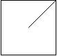

## 🆚295-5/28

### 6078. 重排字符形成目标字符串✔

给你两个下标从 **0** 开始的字符串 `s` 和 `target` 。你可以从 `s` 取出一些字符并将其重排，得到若干新的字符串。

从 `s` 中取出字符并重新排列，返回可以形成 `target` 的 **最大** 副本数。

**示例 1：**

```
输入：s = "ilovecodingonleetcode", target = "code"
输出：2
解释：
对于 "code" 的第 1 个副本，选取下标为 4 、5 、6 和 7 的字符。
对于 "code" 的第 2 个副本，选取下标为 17 、18 、19 和 20 的字符。
形成的字符串分别是 "ecod" 和 "code" ，都可以重排为 "code" 。
可以形成最多 2 个 "code" 的副本，所以返回 2 。
```

**示例 2：**

```
输入：s = "abcba", target = "abc"
输出：1
解释：
选取下标为 0 、1 和 2 的字符，可以形成 "abc" 的 1 个副本。 
可以形成最多 1 个 "abc" 的副本，所以返回 1 。
注意，尽管下标 3 和 4 分别有额外的 'a' 和 'b' ，但不能重用下标 2 处的 'c' ，所以无法形成 "abc" 的第 2 个副本。
```

**示例 3：**

```
输入：s = "abbaccaddaeea", target = "aaaaa"
输出：1
解释：
选取下标为 0 、3 、6 、9 和 12 的字符，可以形成 "aaaaa" 的 1 个副本。
可以形成最多 1 个 "aaaaa" 的副本，所以返回 1 。
```

```java
class Solution {
    public int rearrangeCharacters(String s, String target) {
        if(target.length()>s.length()){
            return 0;
        }
    HashMap<Character,Integer> map = new HashMap<>();
        for(int i =0;i<s.length();i++){
            char c = s.charAt(i);
            if(!map.containsKey(c)){
                map.put(c,1);
            }else{
                map.put(c,map.get(c)+1);
            }
        }
        int sum = 0;
        while(true){
            for(int j = 0;j<target.length();j++){
                char d = target.charAt(j);
                if(map.getOrDefault(d,0)>=1){
                    map.put(d, map.get(d)-1);
                }else{
                    return sum;
                }
            }
            sum++;
        }
    }
}
```

### 6079. 价格减免✔

**句子** 是由若干个单词组成的字符串，单词之间用单个空格分隔，其中每个单词可以包含数字、小写字母、和美元符号 `'$'` 。如果单词的形式为美元符号后跟着一个非负实数，那么这个单词就表示一个价格。

- 例如 `"$100"`、`"$23"` 和 `"$6.75"` 表示价格，而 `"100"`、`"$"` 和 `"2$3"` 不是。

**注意：**本题输入中的价格均为整数。

给你一个字符串 `sentence` 和一个整数 `discount` 。对于每个表示价格的单词，都在价格的基础上减免 `discount%` ，并 **更新** 该单词到句子中。所有更新后的价格应该表示为一个 **恰好保留小数点后两位** 的数字。

返回表示修改后句子的字符串。

**示例 1：**

```
输入：sentence = "there are $1 $2 and 5$ candies in the shop", discount = 50
输出："there are $0.50 $1.00 and 5$ candies in the shop"
解释：
表示价格的单词是 "$1" 和 "$2" 。 
- "$1" 减免 50% 为 "$0.50" ，所以 "$1" 替换为 "$0.50" 。
- "$2" 减免 50% 为 "$1" ，所以 "$1" 替换为 "$1.00" 。
```

**示例 2：**

```
输入：sentence = "1 2 $3 4 $5 $6 7 8$ $9 $10$", discount = 100
输出："1 2 $0.00 4 $0.00 $0.00 7 8$ $0.00 $10$"
解释：
任何价格减免 100% 都会得到 0 。
表示价格的单词分别是 "$3"、"$5"、"$6" 和 "$9"。
每个单词都替换为 "$0.00"。
```

 

```java
class Solution {
   public String discountPrices(String sentence, int discount) {
        StringBuilder sb = new StringBuilder();
        String[] arr = sentence.split(" ");
        boolean flag = false;
        for(int i = 0;i<arr.length;i++){
            flag = false;
            if(arr[i].charAt(0)=='$'&&arr[i].length()>1){
                for(int k = 1;k<arr[i].length();k++){
                    if(arr[i].charAt(k)>'9'||arr[i].charAt(k)<'0'){
                        flag = true;
                        break;
                    }
                }
                if(flag) {sb.append(arr[i]).append(" ");continue;}
                double num = Double.valueOf(arr[i].substring(1));
                num = num*(100-discount)/100;
                arr[i] = "$"+String.format("%.2f",num);
            }
            sb.append(arr[i]).append(" ");
        }
        return sb.substring(0,sb.length()-1);
    }
}
```


### 6080. 使数组按非递减顺序排列

给你一个下标从 **0** 开始的整数数组 `nums` 。在一步操作中，移除所有满足 `nums[i - 1] > nums[i]` 的 `nums[i]` ，其中 `0 < i < nums.length` 。

重复执行步骤，直到 `nums` 变为 **非递减** 数组，返回所需执行的操作数。

**示例 1：**

```
输入：nums = [5,3,4,4,7,3,6,11,8,5,11]
输出：3
解释：执行下述几个步骤：
- 步骤 1 ：[5,3,4,4,7,3,6,11,8,5,11] 变为 [5,4,4,7,6,11,11]
- 步骤 2 ：[5,4,4,7,6,11,11] 变为 [5,4,7,11,11]
- 步骤 3 ：[5,4,7,11,11] 变为 [5,7,11,11]
[5,7,11,11] 是一个非递减数组，因此，返回 3 。
```

**示例 2：**

```
输入：nums = [4,5,7,7,13]
输出：0
解释：nums 已经是一个非递减数组，因此，返回 0 。
```

 

### 6081. 到达角落需要移除障碍物的最小数目🔁🟥

给你一个下标从 **0** 开始的二维整数数组 `grid` ，数组大小为 `m x n` 。每个单元格都是两个值之一：

- `0` 表示一个 **空** 单元格，
- `1` 表示一个可以移除的 **障碍物** 。

你可以向上、下、左、右移动，从一个空单元格移动到另一个空单元格。

现在你需要从左上角 `(0, 0)` 移动到右下角 `(m - 1, n - 1)` ，返回需要移除的障碍物的 **最小** 数目。

**示例 1**


```
输入：grid = [[0,1,1],[1,1,0],[1,1,0]]
输出：2
解释：可以移除位于 (0, 1) 和 (0, 2) 的障碍物来创建从 (0, 0) 到 (2, 2) 的路径。
可以证明我们至少需要移除两个障碍物，所以返回 2 。
注意，可能存在其他方式来移除 2 个障碍物，创建出可行的路径。
```


```
输入：grid = [[0,1,0,0,0],[0,1,0,1,0],[0,0,0,1,0]]
输出：0
解释：不移除任何障碍物就能从 (0, 0) 到 (2, 4) ，所以返回 0 。
```

0-1BFS：一定能找到最短路径

且将最短路保留，删掉其他路，得到一颗最短路径树。层数就是距离

0-1中的 0  表示在同一层（深度不变），1 表示下一层

这样0 加入队列头部，1加入队列尾部

```java
// 0-1BFS
class Solution{
    final static int[][] dirs = {{-1,0},{1,0},{0,-1},{0,1}};
    public int minmumObstacles(int[][] grid){
        int m =grid.length, n= grid[0].length;
        var dis = new int[m][n];
        for(var i =0;i<m;i++) {
            Arrays.fill(dis[i],Integer.MAX_VALUE);
        }
        dis[0][0]= 0;
        var q = new ArrayDeque<int[]>();
        q.addFirst(new int[]{0,0});//起始节点
        while(!q.isEmpty()){//使用队列存图遍历的路径，就不是DP
            var p = q.pollFirst();		// 取队头：层数最小的
            int x = p[0],y = p[1];		//当前节点的x，y
            for(var d : dirs){			//四个方向遍历
                int nx = x+d[0],ny = y+d[1];
                if(0 <= nx && nx < m && 0 <= ny && ny < n){//没有越界
                	var g = grid[nx][ny];//四个方向上的障碍
                    if(dis[x][y] + g < dis[nx][ny]){	//即使走有障碍的路也更短
                        dis[nx][ny] = dis[x][y] + g;	//当前取更短的路径
                        if(g==0) q.addFirst(new int[]{nx,ny});//同一层，加队头
                        else q.addLast(new int[]{nx,ny});// 下一层，加对尾
                    }
                }
            }
        }
        return dis[m-1][n-1];
    }
}
```

```java
// PriorityQueue
class Solution {
    int[][] grids = new int[][]{{1, 0}, {-1, 0}, {0, 1}, {0, -1}};
    public int minimumObstacles(int[][] grid) {
        int M = grid.length, N = grid[0].length;
        int[][] dp = new int[M][N];
        boolean[][] vis = new boolean[M][N];
        //按照队列中的坐标，在dp中的升序排列，这样计算的一定是最小的值
        Queue<int[]> queue = new PriorityQueue<int[]>((a,b) -> dp[a[0]][a[1]]-dp[b[0]][b[1]]);
        queue.offer(new int[]{0, 0});
        while (!queue.isEmpty()) {
            int[] poll = queue.poll();
            int x = poll[0], y = poll[1];
            for (int[] ints : grids) {
                int nx = x + ints[0], ny = y + ints[1];
                if(nx < 0 || ny < 0 || nx >= M || ny >= N || vis[nx][ny]) continue;
                vis[nx][ny] = true;
                //当前点的值等于上一个过来点的值 + 当前点的值
                dp[nx][ny] = dp[x][y] + grid[nx][ny];
                queue.offer(new int[]{nx, ny});
            }
        }
        return dp[M - 1][N - 1];
    }
}

作者：moonstruck
链接：https://leetcode.cn/problems/minimum-obstacle-removal-to-reach-corner/solution/java-by-moonstruck-24zh/
来源：力扣（LeetCode）
著作权归作者所有。商业转载请联系作者获得授权，非商业转载请注明出处。
```

## ♈115-5/31

### 957. N 天后的牢房🔁🟥🟥

8 间牢房排成一排，每间牢房不是有人住就是空着。

每天，无论牢房是被占用或空置，都会根据以下规则进行更改：

- 如果一间牢房的两个相邻的房间都被占用或都是空的，那么该牢房就会被占用。
- 否则，它就会被空置。

（请注意，由于监狱中的牢房排成一行，所以行中的第一个和最后一个房间无法有两个相邻的房间。）

我们用以下方式描述监狱的当前状态：如果第 `i` 间牢房被占用，则 `cell[i]==1`，否则 `cell[i]==0`。

根据监狱的初始状态，在 `N` 天后返回监狱的状况（和上述 N 种变化）。

**示例 1：**

```
输入：cells = [0,1,0,1,1,0,0,1], N = 7
输出：[0,0,1,1,0,0,0,0]
解释：
下表概述了监狱每天的状况：
Day 0: [0, 1, 0, 1, 1, 0, 0, 1]
Day 1: [0, 1, 1, 0, 0, 0, 0, 0]
Day 2: [0, 0, 0, 0, 1, 1, 1, 0]
Day 3: [0, 1, 1, 0, 0, 1, 0, 0]
Day 4: [0, 0, 0, 0, 0, 1, 0, 0]
Day 5: [0, 1, 1, 1, 0, 1, 0, 0]
Day 6: [0, 0, 1, 0, 1, 1, 0, 0]
Day 7: [0, 0, 1, 1, 0, 0, 0, 0]
```

**示例 2：**

```
输入：cells = [1,0,0,1,0,0,1,0], N = 1000000000
输出：[0,0,1,1,1,1,1,0]
```

 

```java
//????????
Map<String,Integer> map = new HashMap<>();
public int[] prisonAfterNDays(int[] cells, int n){
    while(n>0){
        int[] flag = new int[8];
        map.put(Arrays.toString(cells),n);
        n--;
        for(int i = 1;i<7;i++){
            flag[i] = cells[i-1]==cells[i+1] ? 1 :0;
        }
        cells = flag;
        if(map.containsKey(Arrays.toString(cells))){//第一次出现循环后
            n = n %(map.get(Arrays.toString(cells))-n);
        }
    }
    return cells;
}
```

### 958. 二叉树的完全性检验🔁🟥🟥

给定一个二叉树的 `root` ，确定它是否是一个 *完全二叉树* 。

在一个 **完全二叉树** 中，除了最后一个关卡外，所有关卡都是完全被填满的，并且最后一个关卡中的所有节点都是尽可能靠左的。它可以包含 `1` 到 `2h` 节点之间的最后一级 `h` 。

```java
//层序遍历，遇到第一个叶子后标记，如果后面还遇到了非叶子就返回
class Solution {
    public boolean isCompleteTree(TreeNode root) {
        Deque<TreeNode> q = new LinkedList<>();
        q.offer(root);
        while(!q.isEmpty()){
            TreeNode cur = q.poll();
            if(cur==null){
                while(!q.isEmpty()){
                    TreeNode next = q.poll();
                    if(next!=null) return false;
                }
                return true;
            }
            q.add(cur.left);
            q.add(cur.right);
        }
        return true;
    }
}
```


```java
////////////
public boolean isCompleteTree(TreeNode root) {
    LinkedList<TreeNode> list = new LinkedList<>();
    TreeNode cur;
    list.addLast(root);
    while(cur=list.removeFirst())!=null){
        list.addLast(cur.left);
        list.addLast(cur.right);
    }
    while(!list.isEmpty()){
        if(list.removeLast()!=null){
            return false;
        }
    }
    return true;
}
```


### 959. 由斜杠划分区域

在由 `1 x 1` 方格组成的 `n x n` 网格 `grid` 中，每个 `1 x 1` 方块由 `'/'`、`'\'` 或空格构成。这些字符会将方块划分为一些共边的区域。

给定网格 `grid` 表示为一个字符串数组，返回 *区域的数量* 。

请注意，反斜杠字符是转义的，因此 `'\'` 用 `'\\'` 表示。


```
输入：grid = [" /","/ "]
输出：2
```

**示例 2：**



```
输入：grid = [" /","  "]
输出：1
```

**示例 3：**


```
输入：grid = ["/\\","\\/"]
输出：5
解释：回想一下，因为 \ 字符是转义的，所以 "/\\" 表示 /\，而 "\\/" 表示 \/。
```

### 960. 删列造序 III

给定由 `n` 个小写字母字符串组成的数组 `strs` ，其中每个字符串长度相等。

选取一个删除索引序列，对于 `strs` 中的每个字符串，删除对应每个索引处的字符。

比如，有 `strs = ["abcdef","uvwxyz"]` ，删除索引序列 `{0, 2, 3}` ，删除后为 `["bef", "vyz"]` 。

假设，我们选择了一组删除索引 `answer` ，那么在执行删除操作之后，最终得到的数组的行中的 **每个元素** 都是按**字典序**排列的（即 `(strs[0][0] <= strs[0][1] <= ... <= strs[0][strs[0].length - 1])` 和 `(strs[1][0] <= strs[1][1] <= ... <= strs[1][strs[1].length - 1])` ，依此类推）。

请返回 *`answer.length` 的最小可能值* 。

**示例 1：**

```
输入：strs = ["babca","bbazb"]
输出：3
解释：
删除 0、1 和 4 这三列后，最终得到的数组是 A = ["bc", "az"]。
这两行是分别按字典序排列的（即，A[0][0] <= A[0][1] 且 A[1][0] <= A[1][1]）。
注意，A[0] > A[1] —— 数组 A 不一定是按字典序排列的。
```

**示例 2：**

```
输入：strs = ["edcba"]
输出：4
解释：如果删除的列少于 4 列，则剩下的行都不会按字典序排列。
```

**示例 3：**

```
输入：strs = ["ghi","def","abc"]
输出：0
解释：所有行都已按字典序排列。
```

## 🆚296-6-5

### 6090. 极大极小游戏✔

> 给你一个下标从 **0** 开始的整数数组 `nums` ，其长度是 `2` 的幂。
>
> 对 `nums` 执行下述算法：
>
> 1. 设 `n` 等于 `nums` 的长度，如果 `n == 1` ，**终止** 算法过程。否则，**创建** 一个新的整数数组 `newNums` ，新数组长度为 `n / 2` ，下标从 **0** 开始。
> 2. 对于满足 `0 <= i < n / 2` 的每个 **偶数** 下标 `i` ，将 `newNums[i]` **赋值** 为 `min(nums[2 * i], nums[2 * i + 1])` 。
> 3. 对于满足 `0 <= i < n / 2` 的每个 **奇数** 下标 `i` ，将 `newNums[i]` **赋值** 为 `max(nums[2 * i], nums[2 * i + 1])` 。
> 4. 用 `newNums` 替换 `nums` 。
> 5. 从步骤 1 开始 **重复** 整个过程。
>
> 执行算法后，返回 `nums` 中剩下的那个数字。
>
> ```java
> class Solution {
>     public int minMaxGame(int[] nums) {
>             int[] ans = bt(nums);
>             return ans[0];
>         }
> 
>         public int[] bt(int[]  nums){
>             if(nums.length==1){
>                 return nums;
>             }
>             int[] temp = new int[nums.length/2];
>             int count = 0;
>             for(int i = 0;i<nums.length;i+=2){
>                 if(count%2==0){
>                     temp[i/2]=Math.min(nums[i],nums[i+1]);
>                     count++;
>                 }else{
>                     temp[i/2]=Math.max(nums[i],nums[i+1]);
>                     count++;
>                 }
>             }
>             return bt(temp);
>         }
> }
> ```

### 6091. 划分数组使最大差为 K✔

> 给你一个整数数组 `nums` 和一个整数 `k` 。你可以将 `nums` 划分成一个或多个 **子序列** ，使 `nums` 中的每个元素都 **恰好** 出现在一个子序列中。
>
> 在满足每个子序列中最大值和最小值之间的差值最多为 `k` 的前提下，返回需要划分的 **最少** 子序列数目。
>
> **子序列** 本质是一个序列，可以通过删除另一个序列中的某些元素（或者不删除）但不改变剩下元素的顺序得到。
>
>  
>
> **示例 1：**
>
> ```
> 输入：nums = [3,6,1,2,5], k = 2
> 输出：2
> 解释：
> 可以将 nums 划分为两个子序列 [3,1,2] 和 [6,5] 。
> 第一个子序列中最大值和最小值的差值是 3 - 1 = 2 。
> 第二个子序列中最大值和最小值的差值是 6 - 5 = 1 。
> 由于创建了两个子序列，返回 2 。可以证明需要划分的最少子序列数目就是 2 。
> ```
>
> **示例 2：**
>
> ```
> 输入：nums = [1,2,3], k = 1
> 输出：2
> 解释：
> 可以将 nums 划分为两个子序列 [1,2] 和 [3] 。
> 第一个子序列中最大值和最小值的差值是 2 - 1 = 1 。
> 第二个子序列中最大值和最小值的差值是 3 - 3 = 0 。
> 由于创建了两个子序列，返回 2 。注意，另一种最优解法是将 nums 划分成子序列 [1] 和 [2,3] 。
> ```
>
> **示例 3：**
>
> ```
> 输入：nums = [2,2,4,5], k = 0
> 输出：3
> 解释：
> 可以将 nums 划分为三个子序列 [2,2]、[4] 和 [5] 。
> 第一个子序列中最大值和最小值的差值是 2 - 2 = 0 。
> 第二个子序列中最大值和最小值的差值是 4 - 4 = 0 。
> 第三个子序列中最大值和最小值的差值是 5 - 5 = 0 。
> 由于创建了三个子序列，返回 3 。可以证明需要划分的最少子序列数目就是 3 。
> ```
>
> 
>
> ```java
> class Solution {
>     public int partitionArray(int[] nums, int k) {
>             Arrays.sort(nums);
>             int lastNum = nums[0];
>             int sum = 1;
>             for(int i = 0;i<nums.length;i++){
>                 if(nums[i]<=lastNum+k){
>                     continue;
>                 }else{
>                     sum++;
>                     lastNum=nums[i];
>                 }
>             }
>             return sum;
>     }
> }
> ```

### 6092. 替换数组中的元素🔁

> 给你一个下标从 **0** 开始的数组 `nums` ，它包含 `n` 个 **互不相同** 的正整数。请你对这个数组执行 `m` 个操作，在第 `i` 个操作中，你需要将数字 `operations[i][0]` 替换成 `operations[i][1]` 。
>
> 题目保证在第 `i` 个操作中：
>
> - `operations[i][0]` 在 `nums` 中存在。
> - `operations[i][1]` 在 `nums` 中不存在。
>
> 请你返回执行完所有操作后的数组。
>
>  **示例 1：**
>
> ```
>输入：nums = [1,2,4,6], operations = [[1,3],[4,7],[6,1]]
> 输出：[3,2,7,1]
> 解释：我们对 nums 执行以下操作：
> - 将数字 1 替换为 3 。nums 变为 [3,2,4,6] 。
> - 将数字 4 替换为 7 。nums 变为 [3,2,7,6] 。
> - 将数字 6 替换为 1 。nums 变为 [3,2,7,1] 。
> 返回最终数组 [3,2,7,1] 。
> ```
> 
> **示例 2：**
>
> ```
>输入：nums = [1,2], operations = [[1,3],[2,1],[3,2]]
> 输出：[2,1]
> 解释：我们对 nums 执行以下操作：
> - 将数字 1 替换为 3 。nums 变为 [3,2] 。
> - 将数字 2 替换为 1 。nums 变为 [3,1] 。
> - 将数字 3 替换为 2 。nums 变为 [2,1] 。
> 返回最终数组 [2,1] 。
> ```
> 
> **提示：**
>
> - `n == nums.length`
>- `m == operations.length`
> - `1 <= n, m <= 105`
> - `nums` 中所有数字 **互不相同** 。
> - `operations[i].length == 2`
> - `1 <= nums[i], operations[i][0], operations[i][1] <= 106`
> - 在执行第 `i` 个操作时，`operations[i][0]` 在 `nums` 中存在。
> - 在执行第 `i` 个操作时，`operations[i][1]` 在 `nums` 中不存在。

```java
class Solution {
    public int[] arrayChange(int[] nums, int[][] operations) {
        Map<Integer,Integer> map = new HashMap<>();
        for(int i = 0;i<nums.length;i++){
            map.put(nums[i],i);
        }
        for(int i = 0;i<operations.length;i++){
            if(map.containsKey(operations[i][0])){
                int temp = map.get(operations[i][0]);
                nums[temp]=operations[i][1];
                map.put(nums[temp],temp);
            }
        }
        return nums;
    }
}
```

### 6093. 设计一个文本编辑器🟥

> 请你设计一个带光标的文本编辑器，它可以实现以下功能：
>
> - **添加：**在光标所在处添加文本。
> - **删除：**在光标所在处删除文本（模拟键盘的删除键）。
> - **移动：**将光标往左或者往右移动。
>
> 当删除文本时，只有光标左边的字符会被删除。光标会留在文本内，也就是说任意时候 `0 <= cursor.position <= currentText.length` 都成立。
>
> 请你实现 `TextEditor` 类：
>
> - `TextEditor()` 用空文本初始化对象。
> - `void addText(string text)` 将 `text` 添加到光标所在位置。添加完后光标在 `text` 的右边。
> - `int deleteText(int k)` 删除光标左边 `k` 个字符。返回实际删除的字符数目。
> - `string cursorLeft(int k)` 将光标向左移动 `k` 次。返回移动后光标左边 `min(10, len)` 个字符，其中 `len` 是光标左边的字符数目。
> - `string cursorRight(int k)` 将光标向右移动 `k` 次。返回移动后光标左边 `min(10, len)` 个字符，其中 `len` 是光标左边的字符数目。
>
>  
>
> **示例 1：**
>
> ```
> 输入：
> ["TextEditor", "addText", "deleteText", "addText", "cursorRight", "cursorLeft", "deleteText", "cursorLeft", "cursorRight"]
> [[], ["leetcode"], [4], ["practice"], [3], [8], [10], [2], [6]]
> 输出：
> [null, null, 4, null, "etpractice", "leet", 4, "", "practi"]
> 
> 解释：
> TextEditor textEditor = new TextEditor(); // 当前 text 为 "|" 。（'|' 字符表示光标）
> textEditor.addText("leetcode"); // 当前文本为 "leetcode|" 。
> textEditor.deleteText(4); // 返回 4
>                           // 当前文本为 "leet|" 。
>                           // 删除了 4 个字符。
> textEditor.addText("practice"); // 当前文本为 "leetpractice|" 。
> textEditor.cursorRight(3); // 返回 "etpractice"
>                            // 当前文本为 "leetpractice|". 
>                            // 光标无法移动到文本以外，所以无法移动。
>                            // "etpractice" 是光标左边的 10 个字符。
> textEditor.cursorLeft(8); // 返回 "leet"
>                           // 当前文本为 "leet|practice" 。
>                           // "leet" 是光标左边的 min(10, 4) = 4 个字符。
> textEditor.deleteText(10); // 返回 4
>                            // 当前文本为 "|practice" 。
>                            // 只有 4 个字符被删除了。
> textEditor.cursorLeft(2); // 返回 ""
>                           // 当前文本为 "|practice" 。
>                           // 光标无法移动到文本以外，所以无法移动。
>                           // "" 是光标左边的 min(10, 0) = 0 个字符。
> textEditor.cursorRight(6); // 返回 "practi"
>                            // 当前文本为 "practi|ce" 。
>                            // "practi" 是光标左边的 min(10, 6) = 6 个字符。
> ```
>
> **提示：**
>
> - `1 <= text.length, k <= 40`
> - `text` 只含有小写英文字母。
> - 调用 `addText` ，`deleteText` ，`cursorLeft` 和 `cursorRight` 的 **总** 次数不超过 `2 * 104` 次。

```java
class TextEditor {
    
     private StringBuilder sb;

            public TextEditor() {
                sb = new StringBuilder("|");

            }

            public void addText(String text) {
                int i = sb.lastIndexOf("|");
                sb.deleteCharAt(i).append(text).append("|");
            }

            public int deleteText(int k) {
                int i = sb.lastIndexOf("|");
                sb.delete(i-k,i);
                return k;
            }

            public String cursorLeft(int k) {
                int i = sb.lastIndexOf("|");
                StringBuilder temp = new StringBuilder();
                temp = sb.delete(i-k,i);
                sb.append(temp);
                String s;
                if((i=sb.lastIndexOf("|"))>10){
                     s = sb.substring(i-11,i-1);
                }else {
                    s = sb.substring(0,i);
                }
                return s;
            }

            public String cursorRight(int k) {
                int i = sb.lastIndexOf("|");
                if(i+k>sb.length()){
                    i = (i+k)%sb.length()+1;
                    return cursorLeft(i);
                }
                StringBuilder temp = new StringBuilder();
                temp = new StringBuilder(sb.substring(i, i + k));
                StringBuilder end = new StringBuilder();
                end =new StringBuilder(sb.substring(i+k,sb.length()));
                sb.append(temp).append("|").append(end);
                String s;
                if((i=sb.lastIndexOf("|"))>10){
                    s = sb.substring(i-10,i);
                }else {
                    s = sb.substring(0,i);
                }
                return s;
            }
}

/**
 * Your TextEditor object will be instantiated and called as such:
 * TextEditor obj = new TextEditor();
 * obj.addText(text);
 * int param_2 = obj.deleteText(k);
 * String param_3 = obj.cursorLeft(k);
 * String param_4 = obj.cursorRight(k);
 */
```

