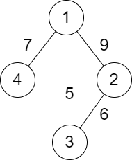
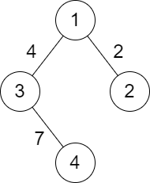
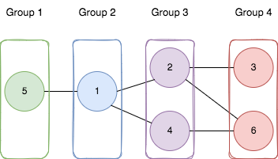
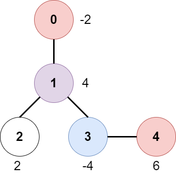

🔁🟥🟩

## 🆚320

### [6243. 到达首都的最少油耗](https://leetcode.cn/problems/minimum-fuel-cost-to-report-to-the-capital/)🟥

> 给你一棵 `n` 个节点的树（一个无向、连通、无环图），每个节点表示一个城市，编号从 `0` 到 `n - 1` ，且恰好有 `n - 1` 条路。`0` 是首都。给你一个二维整数数组 `roads` ，其中 `roads[i] = [ai, bi]` ，表示城市 `ai` 和 `bi` 之间有一条 **双向路** 。
>
> 每个城市里有一个代表，他们都要去首都参加一个会议。
>
> 每座城市里有一辆车。给你一个整数 `seats` 表示每辆车里面座位的数目。
>
> 城市里的代表可以选择乘坐所在城市的车，或者乘坐其他城市的车。相邻城市之间一辆车的油耗是一升汽油。
>
> 请你返回到达首都最少需要多少升汽油。
>
> **示例 1：**
>
> 
>
> ```
> 输入：roads = [[0,1],[0,2],[0,3]], seats = 5
> 输出：3
> 解释：
> - 代表 1 直接到达首都，消耗 1 升汽油。
> - 代表 2 直接到达首都，消耗 1 升汽油。
> - 代表 3 直接到达首都，消耗 1 升汽油。
> 最少消耗 3 升汽油。
> ```
>
> **示例 2：**
>
> 
>
> ```
> 输入：roads = [[3,1],[3,2],[1,0],[0,4],[0,5],[4,6]], seats = 2
> 输出：7
> 解释：
> - 代表 2 到达城市 3 ，消耗 1 升汽油。
> - 代表 2 和代表 3 一起到达城市 1 ，消耗 1 升汽油。
> - 代表 2 和代表 3 一起到达首都，消耗 1 升汽油。
> - 代表 1 直接到达首都，消耗 1 升汽油。
> - 代表 5 直接到达首都，消耗 1 升汽油。
> - 代表 6 到达城市 4 ，消耗 1 升汽油。
> - 代表 4 和代表 6 一起到达首都，消耗 1 升汽油。
> 最少消耗 7 升汽油。
> ```

```java
class Solution {
    List<Integer>[] edges = new List[100010];
    long ret = 0;
    public long minimumFuelCost(int[][] roads, int seats) {
        for(int i = 0 ; i < 100010 ; i ++){
            edges[i] = new ArrayList<>();
        }
        for(int i = 0 ; i < roads.length ; i ++){
            edges[roads[i][0]].add(roads[i][1]);
            edges[roads[i][1]].add(roads[i][0]);
        }
        for(int i = 0 ; i < edges[0].size() ; i++){
            dfs(edges[0].get(i) ,0,seats);//起始位置：0号，遍历0连接的节点DFS，即1和4
        }
        
        return ret;
    }
    int dfs(int cur , int fa ,int seat){
        int all = 1;
        for(int i = 0 ; i < edges[cur].size() ; i ++){
            if(edges[cur].get(i) == fa) continue;
            all += dfs(edges[cur].get(i) , cur , seat);//子树的个数
        }
        ret = ret +(all + seat - 1) / seat;
        return all;
    }
}
```

其他方法：拆分成以0为根节点的树


```java
class Solution {
    long ans = 0;
    public long minimumFuelCost(int[][] roads, int seats) {
        int n = roads.length + 1;
        List<List<Integer>> map = new ArrayList<>();
        for (int i = 0; i < n; i++) {
            map.add(new ArrayList<>());
        }
        for (int i = 0; i < roads.length; i++) {
            map.get(roads[i][0]).add(roads[i][1]);
            map.get(roads[i][1]).add(roads[i][0]);
        }
        dfs(map,0,-1,seats);
        return ans;
    }

    public int dfs(List<List<Integer>> map,int cur,int father,int seats){
        int size = 1;
        for (int node : map.get(cur)){
            if (node != father){
                size += dfs(map,node,cur,seats);
            }
        }
        if (cur != 0) ans+=(int)Math.ceil((double) size/seats);
        return size;
    }
}
```

```java
long ans;
    public long minimumFuelCost(int[][] roads, int seats) {
        ans = 0;
        int n = roads.length + 1;
        List<Integer>[] graph = new List[n];
        for (int i = 0; i < n; i++) {
            graph[i] = new ArrayList<>();
        }
        for (int[] road : roads) {
            graph[road[0]].add(road[1]);
            graph[road[1]].add(road[0]);
        }
        BiFunction<Integer, Integer, Integer> function = new BiFunction<Integer, Integer, Integer>() {
            @Override
            public Integer apply(Integer x, Integer fa) {
                int ret = 1;
                for (int c : graph[x]) {
                    if (c != fa) {
                        ret += apply(c, x);
                    }
                }
                if (x != 0) {
                    ans += (ret + seats - 1) / seats;
                }
                return ret;
            }
        };
        function.apply(0, -1);
        return ans;
    }
```

```java
class Solution {
    List<Integer>[] g;
    long res;
    int seats;
    public long minimumFuelCost(int[][] roads, int seats) {
        if(roads.length==0){
            return 0L;
        }
        int num=0;
        this.seats=seats;
        for(int i=0;i<roads.length;i++){
            for(int j=0;j<2;j++){
                num=Math.max(num, roads[i][j]);
            }
        }

        g=new List[num+1];
        for(int i=0;i<roads.length;i++){
            if(g[roads[i][0]]==null){
                g[roads[i][0]]=new ArrayList<>();
            }
            if(g[roads[i][1]]==null){
                g[roads[i][1]]=new ArrayList<>();
            }
            g[roads[i][0]].add(roads[i][1]);
            g[roads[i][1]].add(roads[i][0]);
        }

        dfs(0,-1);
        return res;
    }

    public long dfs(int i, int fa){
        List<Integer> ch=g[i];
        long subres=1L;
        for(int j=0;j<ch.size();j++){
            if(ch.get(j)!=fa){
                subres += dfs(ch.get(j), i);
            }
        }
        if(i!=0){
            res+=(long)Math.ceil(((double)subres)/seats);
        }
        return subres;
    }

}
```

### [2478. 完美分割的方案数](https://leetcode.cn/problems/number-of-beautiful-partitions/)

> 给你一个字符串 `s` ，每个字符是数字 `'1'` 到 `'9'` ，再给你两个整数 `k` 和 `minLength` 。
>
> 如果对 `s` 的分割满足以下条件，那么我们认为它是一个 **完美** 分割：
>
> - `s` 被分成 `k` 段互不相交的子字符串。
> - 每个子字符串长度都 **至少** 为 `minLength` 。
> - 每个子字符串的第一个字符都是一个 **质数** 数字，最后一个字符都是一个 **非质数** 数字。质数数字为 `'2'` ，`'3'` ，`'5'` 和 `'7'` ，剩下的都是非质数数字。
>
> 请你返回 `s` 的 **完美** 分割数目。由于答案可能很大，请返回答案对 `109 + 7` **取余** 后的结果。
>
> 一个 **子字符串** 是字符串中一段连续字符串序列。
>
> **示例 1：**
>
> ```
> 输入：s = "23542185131", k = 3, minLength = 2
> 输出：3
> 解释：存在 3 种完美分割方案：
> "2354 | 218 | 5131"
> "2354 | 21851 | 31"
> "2354218 | 51 | 31"
> ```
>
> **示例 2：**
>
> ```
> 输入：s = "23542185131", k = 3, minLength = 3
> 输出：1
> 解释：存在一种完美分割方案："2354 | 218 | 5131" 。
> ```
>
> **示例 3：**
>
> ```
> 输入：s = "3312958", k = 3, minLength = 1
> 输出：1
> 解释：存在一种完美分割方案："331 | 29 | 58" 。
> ```

## ♈双92

### 2484. 统计回文子序列数目🟥

> 给你数字字符串 `s` ，请你返回 `s` 中长度为 `5` 的 **回文子序列** 数目。由于答案可能很大，请你将答案对 `109 + 7` **取余** 后返回。
>
> **提示：**
>
> - 如果一个字符串从前往后和从后往前读相同，那么它是 **回文字符串** 。
> - 子序列是一个字符串中删除若干个字符后，不改变字符顺序，剩余字符构成的字符串。
>
> **示例 1：**
>
> ```
> 输入：s = "103301"
> 输出：2
> 解释：
> 总共有 6 长度为 5 的子序列："10330" ，"10331" ，"10301" ，"10301" ，"13301" ，"03301" 。
> 它们中有两个（都是 "10301"）是回文的。
> ```
>
> **示例 2：**
>
> ```
> 输入：s = "0000000"
> 输出：21
> 解释：所有 21 个长度为 5 的子序列都是 "00000" ，都是回文的。
> ```
>
> **示例 3：**
>
> ```
> 输入：s = "9999900000"
> 输出：2
> 解释：仅有的两个回文子序列是 "99999" 和 "00000" 。
> ```

```java
//最简单理解
class Solution {
    public int countPalindromes(String s) {
        int ans = 0;
        //长度为5 的回文串，只要考虑前三个字母，然后前三字母枚举0--9，共有10^3种、
        //枚举后找在s中的数量，原题 115.不同子序列
        for (char a = '0'; a <= '9'; ++a) {
            for (char b = '0'; b <= '9'; ++b) {
                for (char c = '0'; c <= '9'; ++c) {
                    String t = new String(new char[]{a, b, c, b, a});
                    ans += dp2(s, t);
                    ans %= 1000000007;
                }
            }
        }
        return ans;
    }
    // 原版DP
   /*
   	dp[i][j] 由 dp[i-1][?] 递推得来，考虑dp[i-1][j-1],dp[i-1][j] 与 dp[i][j] 关系
   		如果 s[i] 和 t[j] 不相等，则s[i-1] 和 s[i]  是一样。 dp[i][j] = dp[i-1][j]
   		如果 s[i] 和 t[j] 相等 :
   			假设s_i中所有t_j子序列中，包含s[i]的有a个，不包含的有b个，
   			s_i中包含 s[i]的子序列个数相当于s_i中t_j-1的个数，不包含s[i] 的情况和上面一样
   			dp[i][j] = dp[i-1][j-1] +dp[i-1][j]
   */
    
    //讲下个人理解：这题可以看作一个01背包问题 s串是物品，t串是背包。sl是s串的长度，tl是t串的长度。那么题目可以转成从s串中任选tl个字符可以拼成t串的组合个数。 我们定义dp[i][j] 为从s串中的前i字符中任选j个字符可以拼成t串前j个字符表示的子串的组合数。 那么按照背包问题的步骤对s串的第i个字符我们有两种选择： 1.不选择第i个字符，那么dp[i][j] = dp[i - 1][j] 2.选择第i个字符，那么当s[i] == t[j]的情况下dp[i][j] = dp[i - 1][j - 1] 综合两种情况可以得到 dp[i][j] = dp[i - 1][j] + dp[i - 1][j - 1](s[i] == t[j]) 边界条件dp[i][0] = 1, 即为 j == 1 && s[i] == t[j] 
    static int dp1(String s, String t) {
        int n = s.length(), m = t.length();
        int[][] f = new int[n + 1][m + 1];//dp[i][j] 表示s前i字符中t前j字符子序列个数
        f[0][0] = 1;
        for (int i = 1; i <= n; ++i) {
            f[i][0] = 1; //s_i 中 j_0 的个数，定义为1
            for (int j = 1; j <= m; ++j) {
                f[i][j] = f[i - 1][j];
                if (s.charAt(i - 1) == t.charAt(j - 1)) {
                    f[i][j] += f[i - 1][j - 1];
                    f[i][j] %= 1000000007;
                }
            }
        }
        return f[n][m];
    }
    // 空间优化版DP
    static int dp2(String s, String t) {
        int n = s.length(), m = t.length();
        int[] f = new int[m + 1];
        f[0] = 1;
        for (int i = 1; i <= n; ++i) {
            for (int j = m; j >= 1; --j) {
                if (s.charAt(i - 1) == t.charAt(j - 1)) {
                    f[j] += f[j - 1];
                    f[j] %= 1000000007;
                }
            }
        }
        return f[m];
    }
}
```


```java
class Solution {
    private static final long MOD = (long) 1e9 + 7;

    public int countPalindromes(String S) {
        var s = S.toCharArray();
        int[] pre = new int[10], suf = new int[10];
        int[][] pre2 = new int[10][10], suf2 = new int[10][10];
        for (var i = s.length - 1; i >= 0; --i) {
            var d = s[i] - '0';
            for (var j = 0; j < 10; ++j)
                suf2[d][j] += suf[j];
            ++suf[d];
        }

        var ans = 0L;
        for (var d : s) {
            d -= '0';
            --suf[d];
            for (var j = 0; j < 10; ++j)
                suf2[d][j] -= suf[j]; // 撤销
            for (var j = 0; j < 10; ++j)
                for (var k = 0; k < 10; ++k)
                    ans += (long) pre2[j][k] * suf2[j][k]; // 枚举所有字符组合
            for (var j = 0; j < 10; ++j)
                pre2[d][j] += pre[j];
            ++pre[d];
        }
        return (int) (ans % MOD);
    }
}

作者：endlesscheng
链接：https://leetcode.cn/problems/count-palindromic-subsequences/solution/qian-hou-zhui-fen-jie-o100-chang-shu-kon-51cv/
来源：力扣（LeetCode）
著作权归作者所有。商业转载请联系作者获得授权，非商业转载请注明出处。
```

```java
class Solution {
    public int countPalindromes(String s) {
        char[] chars=s.toCharArray();
        long[] pre=new long[10],suf=new long[10];
        long[][] prePre=new long[10][10],sufSuf=new long[10][10];
        for(int i=s.length()-1;i>=0;i--){
            int num=s.charAt(i)-'0';
            for(int j=0;j<10;j++){
                sufSuf[num][j]+=suf[j];
            }
            suf[num]++;
        }
        long res=0;
        for(int i=0;i<s.length();i++){
            int num=s.charAt(i)-'0';
            suf[num]--;
            for(int j=0;j<10;j++){
                sufSuf[num][j]-=suf[j];
            }
            for(int j=0;j<10;j++){
                for(int k=0;k<10;k++){
                    res+=prePre[j][k]*sufSuf[j][k];
                }
            }
            for(int j=0;j<10;j++){
                prePre[num][j]+=pre[j];
            }
            pre[num]++;
        }
        return (int)(res%1_000_000_007);
    }
}
```

```java
//转 long
class Solution {
    int mod = (int) 1e9 + 7;

    public int countPalindromes(String s) {
        char[] cs = s.toCharArray();
        int n = cs.length;
        long ans = 0L;
        int[][] cntP = new int[n + 1][10], cntPos = new int[n + 1][10];
        for (int i = 1; i <= n; i++) {
            System.arraycopy(cntP[i - 1], 0, cntP[i], 0, 10);
            cntP[i][cs[i - 1] - '0']++;
        }
        for (int i = n - 2; i >= 0; i--) {
            System.arraycopy(cntPos[i + 1], 0, cntPos[i], 0, 10);
            cntPos[i][cs[i + 1] - '0']++;
        }
        int[][][] cnt1 = new int[n][10][10], cnt2 = new int[n][10][10];
        for (int i = 1; i < n; i++) {
            for (int j = 0; j < 10; j++) System.arraycopy(cnt1[i - 1][j], 0, cnt1[i][j], 0, 10);
            for (int j = 0; j < 10; j++) {
                cnt1[i][j][cs[i] - '0'] = (cnt1[i][j][cs[i] - '0'] + cntP[i][j]) % mod;
            }
        }
        for (int i = n - 2; i >= 0; i--) {
            for (int j = 0; j < 10; j++) System.arraycopy(cnt2[i + 1][j], 0, cnt2[i][j], 0, 10);
            for (int j = 0; j < 10; j++) {
                cnt2[i][cs[i] - '0'][j] = (cnt2[i][cs[i] - '0'][j] + cntPos[i][j]) % mod; 
            }
        }
        for (int i = 1; i < n - 1; i++) {
            for (int j = 0; j < 10; j++) {
                for (int k = 0; k < 10; k++) {
                    ans = (ans + ((long)cnt1[i - 1][j][k] * cnt2[i + 1][k][j])) % mod;
                }
            }
        }
        return (int) (ans % mod);
    }
}
```

#### 1930

#### 115

## ♈321

### [2487. 从链表中移除节点🟥](https://leetcode.cn/problems/remove-nodes-from-linked-list/)

> 给你一个链表的头节点 `head` 。
>
> 对于列表中的每个节点 `node` ，如果其右侧存在一个具有 **严格更大** 值的节点，则移除 `node` 。
>
> 返回修改后链表的头节点 `head` 。
>
>  
>
> **示例 1：**
>
> 
>
> ```
> 输入：head = [5,2,13,3,8]
> 输出：[13,8]
> 解释：需要移除的节点是 5 ，2 和 3 。
> - 节点 13 在节点 5 右侧。
> - 节点 13 在节点 2 右侧。
> - 节点 8 在节点 3 右侧。
> ```
>
> **示例 2：**
>
> ```
> 输入：head = [1,1,1,1]
> 输出：[1,1,1,1]
> 解释：每个节点的值都是 1 ，所以没有需要移除的节点。
> ```

```java
/**
 * Definition for singly-linked list.
 * public class ListNode {
 *     int val;
 *     ListNode next;
 *     ListNode() {}
 *     ListNode(int val) { this.val = val; }
 *     ListNode(int val, ListNode next) { this.val = val; this.next = next; }
 * }
 */
class Solution {
    public ListNode removeNodes(ListNode head) {
        if(head.next==null){
            return head;
        }

        ListNode temp = removeNodes(head.next);

        if(temp.val>head.val){
            return temp;
        }
        head.next = temp;
        return head;
    }
}
```

### [2488. 统计中位数为 K 的子数组](https://leetcode.cn/problems/count-subarrays-with-median-k/)

> 给你一个长度为 `n` 的数组 `nums` ，该数组由从 `1` 到 `n` 的 **不同** 整数组成。另给你一个正整数 `k` 。
>
> 统计并返回 `num` 中的 **中位数** 等于 `k` 的非空子数组的数目。
>
> **注意：**
>
> - 数组的中位数是按 递增顺序排列后位于中间的那个元素，如果数组长度为偶数，则中位数是位于中间靠左的那个元素。
>     - 例如，`[2,3,1,4]` 的中位数是 `2` ，`[8,4,3,5,1]` 的中位数是 `4` 。
> - 子数组是数组中的一个连续部分。
>
>  **示例 1：**
>
> ```
> 输入：nums = [3,2,1,4,5], k = 4
> 输出：3
> 解释：中位数等于 4 的子数组有：[4]、[4,5] 和 [1,4,5] 。
> ```
>
> **示例 2：**
>
> ```
> 输入：nums = [2,3,1], k = 3
> 输出：1
> 解释：[3] 是唯一一个中位数等于 3 的子数组。
> ```


## 🆚322

### 6255. 两个城市间路径的最小分数

> 给你一个正整数 `n` ，表示总共有 `n` 个城市，城市从 `1` 到 `n` 编号。给你一个二维数组 `roads` ，其中 `roads[i] = [ai, bi, distancei]` 表示城市 `ai` 和 `bi` 之间有一条 **双向** 道路，道路距离为 `distancei` 。城市构成的图不一定是连通的。
>
> 两个城市之间一条路径的 **分数** 定义为这条路径中道路的 **最小** 距离。
>
> 城市 `1` 和城市 `n` 之间的所有路径的 **最小** 分数。
>
> **注意：**
>
> - 一条路径指的是两个城市之间的道路序列。
> - 一条路径可以 **多次** 包含同一条道路，你也可以沿着路径多次到达城市 `1` 和城市 `n` 。
> - 测试数据保证城市 `1` 和城市`n` 之间 **至少** 有一条路径。
>
> **示例 1：**
>
> 
>
> ```
> 输入：n = 4, roads = [[1,2,9],[2,3,6],[2,4,5],[1,4,7]]
> 输出：5
> 解释：城市 1 到城市 4 的路径中，分数最小的一条为：1 -> 2 -> 4 。这条路径的分数是 min(9,5) = 5 。
> 不存在分数更小的路径。
> ```
>
> **示例 2：**
>
> 
>
> ```
> 输入：n = 4, roads = [[1,2,2],[1,3,4],[3,4,7]]
> 输出：2
> 解释：城市 1 到城市 4 分数最小的路径是：1 -> 2 -> 1 -> 3 -> 4 。这条路径的分数是 min(2,2,4,7) = 2 。
> ```
>
> **提示：**
>
> - `2 <= n <= 105`
> - `1 <= roads.length <= 105`
> - `roads[i].length == 3`
> - `1 <= ai, bi <= n`
> - `ai != bi`
> - `1 <= distancei <= 104`
> - 不会有重复的边。
> - 城市 `1` 和城市 `n` 之间至少有一条路径。

```java
//解答：DFS
class Solution {
    int min = Integer.MAX_VALUE;
    public int minScore(int n, int[][] roads) {
        List<List<int [] >> g= new ArrayList<>();
        for(int i=0;i<n;i++){
            g.add(new ArrayList<>());
        }
        for(int[]e: roads){
            int x = e[0]-1;
            int y = e[1]-1;
            int weight =  e[2];
            g.get(x).add(new int[]{y,weight});
            g.get(y).add(new int[]{x,weight});
        }
        int [] visit = new int [n];
        dfs(g,0,visit);
        return min;
    }
    public void  dfs(List<List<int []>> g,int start, int [] visit   ){
        if(visit[start]!=0 ){
            return ;
        }
        visit[start] = 1;
        for(int [] next :g.get(start)){
            if(min > next[1]){
                min = next[1];
            }
            dfs(g,next[0],visit);
        }
        visit[start] = -1;
    }
}
```


```java
//TLE 裸并查集
class Solution {
     public int minScore(int n, int[][] roads) {
            int ans = Integer.MAX_VALUE;
            UnionFind uf = new UnionFind(n+1);
            for(int[] road:roads){
                uf.union(road[0],road[1]);
            }
            for(int[] road:roads){
                if(uf.connected(1,road[0])){
                    ans = Math.min(ans,road[2]);
                }
                if(uf.connected(1,road[1])){
                    ans = Math.min(ans,road[2]);
                }
            }
            return ans;
        }

         class UnionFind {
            private int[] id;
            private int count;

            public UnionFind(int N) {
                count = N;
                id = new int[N];
                for(int i = 0; i < N; i++) id[i] = i;
            }
            public int getCount() {
                return count;
            }
            public boolean connected(int p, int q) {
                return find(p) == find(q);
            }
            public int find(int p) {
                return id[p];
            }
            public void union(int p, int q){
                int pRoot = find(p);
                int qRoot = find(q);
                if(pRoot == qRoot) return;
                for(int i = 0; i < id.length; i++)
                    if(id[i] == pRoot)  id[i] = qRoot;
                count--;
            }
        }
    }
```

```java
class Solution {
    public int minScore(int n, int[][] roads) {
            int ans = Integer.MAX_VALUE;
            UnionFind uf = new UnionFind(n+1);
            for(int[] road:roads){
                uf.union(road[0],road[1]);
            }
            for(int[] road:roads){
                if(uf.connected(1,road[0])){
                    ans = Math.min(ans,road[2]);
                }
                if(uf.connected(1,road[1])){
                    ans = Math.min(ans,road[2]);
                }
            }
            return ans;
        }
         class UnionFind {
                 private int[] id;
                 private int count;
                 private int[] sz;
                 public UnionFind(int N) {
                     count = N;
                     id = new int[N];
                     sz = new int[N];
                     for(int i = 0; i < N; i++) {
                         id[i] = i;
                         sz[i] = 1;
                     }
                 }
                 public boolean connected(int p, int q) {
                     return find(p) == find(q);
                 }
                 public int find(int p) {
                     while(p != id[p]) p = id[p];
                     return p;
                 }
                 public void union(int p, int q){
                     int pRoot = find(p);
                     int qRoot = find(q);
                     if(pRoot == qRoot) return;
                     if(sz[pRoot] < sz[qRoot]) { id[pRoot] = qRoot; sz[qRoot] += sz[pRoot]; }
                     else                      { id[qRoot] = pRoot; sz[pRoot] += sz[qRoot]; }
                     count--;
             }
    }
}
```

#### 并查集

### [6256. 将节点分成尽可能多的组](https://leetcode.cn/problems/divide-nodes-into-the-maximum-number-of-groups/)

> 给你一个正整数 `n` ，表示一个 **无向** 图中的节点数目，节点编号从 `1` 到 `n` 。
>
> 同时给你一个二维整数数组 `edges` ，其中 `edges[i] = [ai, bi]` 表示节点 `ai` 和 `bi` 之间有一条 **双向** 边。注意给定的图可能是不连通的。
>
> 请你将图划分为 `m` 个组（编号从 **1** 开始），满足以下要求：
>
> - 图中每个节点都只属于一个组。
> - 图中每条边连接的两个点 `[ai, bi]` ，如果 `ai` 属于编号为 `x` 的组，`bi` 属于编号为 `y` 的组，那么 `|y - x| = 1` 。
>
> 请你返回最多可以将节点分为多少个组（也就是最大的 `m` ）。如果没办法在给定条件下分组，请你返回 `-1` 。
>
> **示例 1：**
>
> 
>
> ```
> 输入：n = 6, edges = [[1,2],[1,4],[1,5],[2,6],[2,3],[4,6]]
> 输出：4
> 解释：如上图所示，
> - 节点 5 在第一个组。
> - 节点 1 在第二个组。
> - 节点 2 和节点 4 在第三个组。
> - 节点 3 和节点 6 在第四个组。
> 所有边都满足题目要求。
> 如果我们创建第五个组，将第三个组或者第四个组中任何一个节点放到第五个组，至少有一条边连接的两个节点所属的组编号不符合题目要求。
> ```
>
> **示例 2：**
>
> ```
> 输入：n = 3, edges = [[1,2],[2,3],[3,1]]
> 输出：-1
> 解释：如果我们将节点 1 放入第一个组，节点 2 放入第二个组，节点 3 放入第三个组，前两条边满足题目要求，但第三条边不满足题目要求。
> 没有任何符合题目要求的分组方式。
> ```
>
> **提示：**
>
> - `1 <= n <= 500`
> - `1 <= edges.length <= 104`
> - `edges[i].length == 2`
> - `1 <= ai, bi <= n`
> - `ai != bi`
> - 两个点之间至多只有一条边。


## ♈双91

### 2467. 树上最大得分和路径

> 一个 `n` 个节点的无向树，节点编号为 `0` 到 `n - 1` ，树的根结点是 `0` 号节点。给你一个长度为 `n - 1` 的二维整数数组 `edges` ，其中 `edges[i] = [ai, bi]` ，表示节点 `ai` 和 `bi` 在树中有一条边。
>
> 在每一个节点 `i` 处有一扇门。同时给你一个都是偶数的数组 `amount` ，其中 `amount[i]` 表示：
>
> - 如果 `amount[i]` 的值是负数，那么它表示打开节点 `i` 处门扣除的分数。
> - 如果 `amount[i]` 的值是正数，那么它表示打开节点 `i` 处门加上的分数。
>
> 游戏按照如下规则进行：
>
> - 一开始，Alice 在节点 `0` 处，Bob 在节点 `bob` 处。
>
> - 每一秒钟，Alice 和 Bob **分别** 移动到相邻的节点。Alice 朝着某个 **叶子结点** 移动，Bob 朝着节点 `0` 移动。
>
> - 对于他们之间路径上的
>
>          每一个
>    
>      节点，Alice 和 Bob 要么打开门并扣分，要么打开门并加分。注意：
>    
>     - 如果门 **已经打开** （被另一个人打开），不会有额外加分也不会扣分。
>    - 如果 Alice 和 Bob **同时** 到达一个节点，他们会共享这个节点的加分或者扣分。换言之，如果打开这扇门扣 `c` 分，那么 Alice 和 Bob 分别扣 `c / 2` 分。如果这扇门的加分为 `c` ，那么他们分别加 `c / 2` 分。
> 
> - 如果 Alice 到达了一个叶子结点，她会停止移动。类似的，如果 Bob 到达了节点 `0` ，他也会停止移动。注意这些事件互相 **独立** ，不会影响另一方移动。
>
> 请你返回 Alice 朝最优叶子结点移动的 **最大** 净得分。
>
> **示例 1：**
>
> 
>
> ```
>输入：edges = [[0,1],[1,2],[1,3],[3,4]], bob = 3, amount = [-2,4,2,-4,6]
> 输出：6
> 解释：
> 上图展示了输入给出的一棵树。游戏进行如下：
> - Alice 一开始在节点 0 处，Bob 在节点 3 处。他们分别打开所在节点的门。
>   Alice 得分为 -2 。
> - Alice 和 Bob 都移动到节点 1 。
>   因为他们同时到达这个节点，他们一起打开门并平分得分。
>   Alice 的得分变为 -2 + (4 / 2) = 0 。
> - Alice 移动到节点 3 。因为 Bob 已经打开了这扇门，Alice 得分不变。
>   Bob 移动到节点 0 ，并停止移动。
> - Alice 移动到节点 4 并打开这个节点的门，她得分变为 0 + 6 = 6 。
> 现在，Alice 和 Bob 都不能进行任何移动了，所以游戏结束。
> Alice 无法得到更高分数。
> ```

 

.预存储双向边。
2.dfs从0出发，当到达b ob节点时标记找到路径，返回时存储沿路节点。
[1]防止重复：存储上次到达节点s，本次k前往目的地节点t==s则跳过。
3.bfs同时模拟Alice从0出发，Bob从bob出发。/
[1]防止重复：记忆数组v记录所有Alice之前到达过的节点，遇到则跳过。
[2]Alice当前处于叶子节点(非根节点0)，根据规则停止移动，并加入计算最大得分。
[3]Alice当前处于非叶子节点(或根节点0)，移动时会打开当前节点和目的地节点两扇门。可以先存储当前节点开门得分，下次移动时只叠加目的地节点开门得分。
[4]哈希集合h存储Bob当前所在节点和之前已经去过的所有节点，同时变量y存储Bob下一个目的地节点，若Alice目的地节点x存在于h中则不改变分数，若x==y则得到打开相同目的地门一半的分数，若不存在于h也不等于y，则叠加目的地门全部分数。

```java
class Solution {
    int n,b,max;
    boolean f;
    int[] a,c;
    Queue<Integer> p;
    List<Integer>[] d;
    public int mostProfitablePath(int[][] edges, int bob, int[] amount) {
        f=false;
        max=Integer.MIN_VALUE;
        n=amount.length;//n个结点
        b=bob;//bob是bob起始位置结点
        a=amount;
        c=new int[n];
        d=new List[n];
        p=new ArrayDeque<>();
        for(int i=0;i<n;i++){
            d[i]=new ArrayList<>();
        }
        for(int[] e:edges){
            d[e[0]].add(e[1]);
            d[e[1]].add(e[0]);//无向图通过[ArrayDeque]存储
        }
        dfs(0,0);//从 0出发，找到bob的结点返回————》得到了从bob到达0的完整路径
        p.offer(0);
        bfs();
        return max;
    }
    public void dfs(int k,int s){//s 是父结点，判断跳过
        for(int t:d[k]){
            if(t==s)continue;
            dfs(t,k);
            if(t==b||f){//直到找到bob的位置
                f=true;
                p.offer(t);//就将这个点（最开始是bob的）存入queue中
                break;//跳出的是本次递归，然后沿路径返回回去，这样冲bob到0的路径都存入queue中
            }
        }
    }
    public void bfs(){
        Set<Integer> h=new HashSet<>();
        boolean[] v=new boolean[n];//visited数组
        Queue<int[]> q=new ArrayDeque<>();
        q.offer(new int[]{0,a[0]});
        v[0]=true;
        int y=p.poll();
        h.add(y);
        while(!q.isEmpty()){
            int size=q.size();
            if(!p.isEmpty()){
                y=p.poll();
            }
            while(size!=0){
                int[] x=q.poll();
                if(x[0]!=0&&d[x[0]].size()==1){
                    max=Math.max(max,x[1]);
                }else{
                    for(int t:d[x[0]]){
                        if(v[t])continue;
                        v[t]=true;
                        int z=x[1];
                        if(!h.contains(t)){
                            if(y==t){
                                z+=a[t]/2;
                            }else{
                                z+=a[t];
                            }
                        }
                        q.offer(new int[]{t,z});
                    }
                }
                size--;
            }
            h.add(y);
        }
    }
}

作者：zhy-
链接：https://leetcode.cn/problems/most-profitable-path-in-a-tree/solution/java-by-zhy-pmmwn/
来源：力扣（LeetCode）
著作权归作者所有。商业转载请联系作者获得授权，非商业转载请注明出处。
```


### 2468. 根据限制分割消息

> 给你一个字符串 `message` 和一个正整数 `limit` 。
>
> 你需要根据 `limit` 将 `message` **分割** 成一个或多个 **部分** 。每个部分的结尾都是 `"<a/b>"` ，其中 `"b"` 用分割出来的总数 **替换**， `"a"` 用当前部分所在的编号 **替换** ，编号从 `1` 到 `b` 依次编号。除此以外，除了最后一部分长度 **小于等于** `limit` 以外，其他每一部分（包括结尾部分）的长度都应该 **等于** `limit` 。
>
> 你需要确保分割后的结果数组，删掉每部分的结尾并 **按顺序** 连起来后，能够得到 `message` 。同时，结果数组越短越好。
>
> 请你返回 `message` 分割后得到的结果数组。如果无法按要求分割 `message` ，返回一个空数组。
>
> **示例 1：**
>
> ```
> 输入：message = "this is really a very awesome message", limit = 9
> 输出：["thi<1/14>","s i<2/14>","s r<3/14>","eal<4/14>","ly <5/14>","a v<6/14>","ery<7/14>"," aw<8/14>","eso<9/14>","me<10/14>"," m<11/14>","es<12/14>","sa<13/14>","ge<14/14>"]
> 解释：
> 前面 9 个部分分别从 message 中得到 3 个字符。
> 接下来的 5 个部分分别从 message 中得到 2 个字符。
> 这个例子中，包含最后一个部分在内，每个部分的长度都为 9 。
> 可以证明没有办法分割成少于 14 个部分。
> ```
>
> **示例 2：**
>
> ```
> 输入：message = "short message", limit = 15
> 输出：["short mess<1/2>","age<2/2>"]
> 解释：
> 在给定限制下，字符串可以分成两个部分：
> - 第一个部分包含 10 个字符，长度为 15 。
> - 第二个部分包含 3 个字符，长度为 8 。
> ```
>
>  


## 327

### [6284. 使字符串总不同字符的数目相等](https://leetcode.cn/problems/make-number-of-distinct-characters-equal/)

> 给你两个下标从 **0** 开始的字符串 `word1` 和 `word2` 。
>
> 一次 **移动** 由以下两个步骤组成：
>
> - 选中两个下标 `i` 和 `j` ，分别满足 `0 <= i < word1.length` 和 `0 <= j < word2.length` ，
> - 交换 `word1[i]` 和 `word2[j]` 。
>
> 如果可以通过 **恰好一次** 移动，使 `word1` 和 `word2` 中不同字符的数目相等，则返回 `true` ；否则，返回 `false` 。
>
> **示例 1：**
>
> ```
> 输入：word1 = "ac", word2 = "b"
> 输出：false
> 解释：交换任何一组下标都会导致第一个字符串中有 2 个不同的字符，而在第二个字符串中只有 1 个不同字符。
> ```
>
> **示例 2：**
>
> ```
> 输入：word1 = "abcc", word2 = "aab"
> 输出：true
> 解释：交换第一个字符串的下标 2 和第二个字符串的下标 0 。之后得到 word1 = "abac" 和 word2 = "cab" ，各有 3 个不同字符。
> ```

```java
class Solution {
    public boolean isItPossible(String word1, String word2) {
        int[] num1 = new int[26];
        int[] num2 = new int[26];
        int count1 = 0, count2 = 0;
        for (int i = 0; i < word1.length(); i++) {
            int index = word1.charAt(i) - 'a';
            num1[index]++;
            if (num1[index] == 1) count1++;
        }
        for (int i = 0; i < word2.length(); i++) {
            int index = word2.charAt(i) - 'a';
            num2[index]++;
            if (num2[index] == 1) count2++;
        }
        for (int i = 0; i < 26; i++) {
            if (num1[i] == 0) continue;
            for (int j = 0; j < 26; j++) {
                if (num2[j] == 0) continue;
                int cnt1 = count1, cnt2 = count2;
                if (i == j) {
                    if (cnt1 == cnt2) return true; 
                    continue;
                }
                if (1 == num1[i]) cnt1--;
                if (0 == num1[j]) cnt1++;
                if (1 == num2[j]) cnt2--;
                if (0 == num2[i]) cnt2++;
                if (cnt1 == cnt2) {
                    return true;
                }
            }
        }
        return false;
    }
}
```


## 328

### [6293. 统计好子数组的数目](https://leetcode.cn/problems/count-the-number-of-good-subarrays/)

> 给你一个整数数组 `nums` 和一个整数 `k` ，请你返回 `nums` 中 **好** 子数组的数目。
>
> 一个子数组 `arr` 如果有 **至少** `k` 对下标 `(i, j)` 满足 `i < j` 且 `arr[i] == arr[j]` ，那么称它是一个 **好** 子数组。
>
> **子数组** 是原数组中一段连续 **非空** 的元素序列。
>
>  **示例 1：**
>
> ```
> 输入：nums = [1,1,1,1,1], k = 10
> 输出：1
> 解释：唯一的好子数组是这个数组本身。
> ```
>
> **示例 2：**
>
> ```
> 输入：nums = [3,1,4,3,2,2,4], k = 2
> 输出：4
> 解释：总共有 4 个不同的好子数组：
> - [3,1,4,3,2,2] 有 2 对。
> - [3,1,4,3,2,2,4] 有 3 对。
> - [1,4,3,2,2,4] 有 2 对。
> - [4,3,2,2,4] 有 2 对。
> ```

```java
//滑动窗口
class Solution {
    public long countGood(int[] nums, int k) {
        int len = nums.length;
        long res = 0;
        Map<Integer, Integer> map = new HashMap<>();
        int l = 0, r = 0, cnt = 0;
        // 扩展右边界，计数多map[nums[r]]组
        while (r < len) {
            cnt += map.getOrDefault(nums[r], 0);
            map.put(nums[r], map.getOrDefault(nums[r], 0) + 1);
            r++;
            // 如果满足条件，则从[l,r]至[l,len]的均符合条件，答案加上len - r + 1
            // 同时尝试收缩左边界，计数少map[nums[l]]组，
            while (cnt >= k) {
                res += len - r + 1;//从当前开始一直到结束的数组都有效
                map.put(nums[l], map.getOrDefault(nums[l], 0) - 1);//收缩过程//每收缩一次都能重新加进去，直到条件不足
                cnt -= map.get(nums[l]);
                l++;
            }
        }
        return res;
    }
}
```

