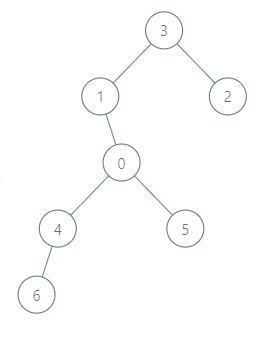
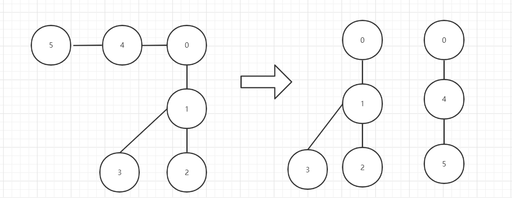

🔁🟥🟩

## 🆚320

### [6243. 到达首都的最少油耗](https://leetcode.cn/problems/minimum-fuel-cost-to-report-to-the-capital/)🟥

> 给你一棵 `n` 个节点的树（一个无向、连通、无环图），每个节点表示一个城市，编号从 `0` 到 `n - 1` ，且恰好有 `n - 1` 条路。`0` 是首都。给你一个二维整数数组 `roads` ，其中 `roads[i] = [ai, bi]` ，表示城市 `ai` 和 `bi` 之间有一条 **双向路** 。
>
> 每个城市里有一个代表，他们都要去首都参加一个会议。
>
> 每座城市里有一辆车。给你一个整数 `seats` 表示每辆车里面座位的数目。
>
> 城市里的代表可以选择乘坐所在城市的车，或者乘坐其他城市的车。相邻城市之间一辆车的油耗是一升汽油。
>
> 请你返回到达首都最少需要多少升汽油。
>
> **示例 1：**
>
> 
>
> ```
> 输入：roads = [[0,1],[0,2],[0,3]], seats = 5
> 输出：3
> 解释：
> - 代表 1 直接到达首都，消耗 1 升汽油。
> - 代表 2 直接到达首都，消耗 1 升汽油。
> - 代表 3 直接到达首都，消耗 1 升汽油。
> 最少消耗 3 升汽油。
> ```
>
> **示例 2：**
>
> 
>
> ```
> 输入：roads = [[3,1],[3,2],[1,0],[0,4],[0,5],[4,6]], seats = 2
> 输出：7
> 解释：
> - 代表 2 到达城市 3 ，消耗 1 升汽油。
> - 代表 2 和代表 3 一起到达城市 1 ，消耗 1 升汽油。
> - 代表 2 和代表 3 一起到达首都，消耗 1 升汽油。
> - 代表 1 直接到达首都，消耗 1 升汽油。
> - 代表 5 直接到达首都，消耗 1 升汽油。
> - 代表 6 到达城市 4 ，消耗 1 升汽油。
> - 代表 4 和代表 6 一起到达首都，消耗 1 升汽油。
> 最少消耗 7 升汽油。
> ```

```java
class Solution {
    List<Integer>[] edges = new List[100010];
    long ret = 0;
    public long minimumFuelCost(int[][] roads, int seats) {
        for(int i = 0 ; i < 100010 ; i ++){
            edges[i] = new ArrayList<>();
        }
        for(int i = 0 ; i < roads.length ; i ++){
            edges[roads[i][0]].add(roads[i][1]);
            edges[roads[i][1]].add(roads[i][0]);
        }
        for(int i = 0 ; i < edges[0].size() ; i++){
            dfs(edges[0].get(i) ,0,seats);//起始位置：0号，遍历0连接的节点DFS，即1和4
        }
        
        return ret;
    }
    int dfs(int cur , int fa ,int seat){
        int all = 1;
        for(int i = 0 ; i < edges[cur].size() ; i ++){
            if(edges[cur].get(i) == fa) continue;
            all += dfs(edges[cur].get(i) , cur , seat);//子树的个数
        }
        ret = ret +(all + seat - 1) / seat;
        return all;
    }
}
```

其他方法：拆分成以0为根节点的树



```java
class Solution {
    long ans = 0;
    public long minimumFuelCost(int[][] roads, int seats) {
        int n = roads.length + 1;
        List<List<Integer>> map = new ArrayList<>();
        for (int i = 0; i < n; i++) {
            map.add(new ArrayList<>());
        }
        for (int i = 0; i < roads.length; i++) {
            map.get(roads[i][0]).add(roads[i][1]);
            map.get(roads[i][1]).add(roads[i][0]);
        }
        dfs(map,0,-1,seats);
        return ans;
    }

    public int dfs(List<List<Integer>> map,int cur,int father,int seats){
        int size = 1;
        for (int node : map.get(cur)){
            if (node != father){
                size += dfs(map,node,cur,seats);
            }
        }
        if (cur != 0) ans+=(int)Math.ceil((double) size/seats);
        return size;
    }
}
```

```java
long ans;
    public long minimumFuelCost(int[][] roads, int seats) {
        ans = 0;
        int n = roads.length + 1;
        List<Integer>[] graph = new List[n];
        for (int i = 0; i < n; i++) {
            graph[i] = new ArrayList<>();
        }
        for (int[] road : roads) {
            graph[road[0]].add(road[1]);
            graph[road[1]].add(road[0]);
        }
        BiFunction<Integer, Integer, Integer> function = new BiFunction<Integer, Integer, Integer>() {
            @Override
            public Integer apply(Integer x, Integer fa) {
                int ret = 1;
                for (int c : graph[x]) {
                    if (c != fa) {
                        ret += apply(c, x);
                    }
                }
                if (x != 0) {
                    ans += (ret + seats - 1) / seats;
                }
                return ret;
            }
        };
        function.apply(0, -1);
        return ans;
    }
```

```java
class Solution {
    List<Integer>[] g;
    long res;
    int seats;
    public long minimumFuelCost(int[][] roads, int seats) {
        if(roads.length==0){
            return 0L;
        }
        int num=0;
        this.seats=seats;
        for(int i=0;i<roads.length;i++){
            for(int j=0;j<2;j++){
                num=Math.max(num, roads[i][j]);
            }
        }

        g=new List[num+1];
        for(int i=0;i<roads.length;i++){
            if(g[roads[i][0]]==null){
                g[roads[i][0]]=new ArrayList<>();
            }
            if(g[roads[i][1]]==null){
                g[roads[i][1]]=new ArrayList<>();
            }
            g[roads[i][0]].add(roads[i][1]);
            g[roads[i][1]].add(roads[i][0]);
        }

        dfs(0,-1);
        return res;
    }

    public long dfs(int i, int fa){
        List<Integer> ch=g[i];
        long subres=1L;
        for(int j=0;j<ch.size();j++){
            if(ch.get(j)!=fa){
                subres += dfs(ch.get(j), i);
            }
        }
        if(i!=0){
            res+=(long)Math.ceil(((double)subres)/seats);
        }
        return subres;
    }

}
```

### [2478. 完美分割的方案数](https://leetcode.cn/problems/number-of-beautiful-partitions/)

> 给你一个字符串 `s` ，每个字符是数字 `'1'` 到 `'9'` ，再给你两个整数 `k` 和 `minLength` 。
>
> 如果对 `s` 的分割满足以下条件，那么我们认为它是一个 **完美** 分割：
>
> - `s` 被分成 `k` 段互不相交的子字符串。
> - 每个子字符串长度都 **至少** 为 `minLength` 。
> - 每个子字符串的第一个字符都是一个 **质数** 数字，最后一个字符都是一个 **非质数** 数字。质数数字为 `'2'` ，`'3'` ，`'5'` 和 `'7'` ，剩下的都是非质数数字。
>
> 请你返回 `s` 的 **完美** 分割数目。由于答案可能很大，请返回答案对 `109 + 7` **取余** 后的结果。
>
> 一个 **子字符串** 是字符串中一段连续字符串序列。
>
> **示例 1：**
>
> ```
> 输入：s = "23542185131", k = 3, minLength = 2
> 输出：3
> 解释：存在 3 种完美分割方案：
> "2354 | 218 | 5131"
> "2354 | 21851 | 31"
> "2354218 | 51 | 31"
> ```
>
> **示例 2：**
>
> ```
> 输入：s = "23542185131", k = 3, minLength = 3
> 输出：1
> 解释：存在一种完美分割方案："2354 | 218 | 5131" 。
> ```
>
> **示例 3：**
>
> ```
> 输入：s = "3312958", k = 3, minLength = 1
> 输出：1
> 解释：存在一种完美分割方案："331 | 29 | 58" 。
> ```

## ♈双92

### 2484. 统计回文子序列数目🟥

> 给你数字字符串 `s` ，请你返回 `s` 中长度为 `5` 的 **回文子序列** 数目。由于答案可能很大，请你将答案对 `109 + 7` **取余** 后返回。
>
> **提示：**
>
> - 如果一个字符串从前往后和从后往前读相同，那么它是 **回文字符串** 。
> - 子序列是一个字符串中删除若干个字符后，不改变字符顺序，剩余字符构成的字符串。
>
> **示例 1：**
>
> ```
> 输入：s = "103301"
> 输出：2
> 解释：
> 总共有 6 长度为 5 的子序列："10330" ，"10331" ，"10301" ，"10301" ，"13301" ，"03301" 。
> 它们中有两个（都是 "10301"）是回文的。
> ```
>
> **示例 2：**
>
> ```
> 输入：s = "0000000"
> 输出：21
> 解释：所有 21 个长度为 5 的子序列都是 "00000" ，都是回文的。
> ```
>
> **示例 3：**
>
> ```
> 输入：s = "9999900000"
> 输出：2
> 解释：仅有的两个回文子序列是 "99999" 和 "00000" 。
> ```

```java
//最简单理解
class Solution {
    public int countPalindromes(String s) {
        int ans = 0;
        //长度为5 的回文串，只要考虑前三个字母，然后前三字母枚举0--9，共有10^3种、
        //枚举后找在s中的数量，原题 115.不同子序列
        for (char a = '0'; a <= '9'; ++a) {
            for (char b = '0'; b <= '9'; ++b) {
                for (char c = '0'; c <= '9'; ++c) {
                    String t = new String(new char[]{a, b, c, b, a});
                    ans += dp2(s, t);
                    ans %= 1000000007;
                }
            }
        }
        return ans;
    }
    // 原版DP
   /*
   	dp[i][j] 由 dp[i-1][?] 递推得来，考虑dp[i-1][j-1],dp[i-1][j] 与 dp[i][j] 关系
   		如果 s[i] 和 t[j] 不相等，则s[i-1] 和 s[i]  是一样。 dp[i][j] = dp[i-1][j]
   		如果 s[i] 和 t[j] 相等 :
   			假设s_i中所有t_j子序列中，包含s[i]的有a个，不包含的有b个，
   			s_i中包含 s[i]的子序列个数相当于s_i中t_j-1的个数，不包含s[i] 的情况和上面一样
   			dp[i][j] = dp[i-1][j-1] +dp[i-1][j]
   */
    
    //讲下个人理解：这题可以看作一个01背包问题 s串是物品，t串是背包。sl是s串的长度，tl是t串的长度。那么题目可以转成从s串中任选tl个字符可以拼成t串的组合个数。 我们定义dp[i][j] 为从s串中的前i字符中任选j个字符可以拼成t串前j个字符表示的子串的组合数。 那么按照背包问题的步骤对s串的第i个字符我们有两种选择： 1.不选择第i个字符，那么dp[i][j] = dp[i - 1][j] 2.选择第i个字符，那么当s[i] == t[j]的情况下dp[i][j] = dp[i - 1][j - 1] 综合两种情况可以得到 dp[i][j] = dp[i - 1][j] + dp[i - 1][j - 1](s[i] == t[j]) 边界条件dp[i][0] = 1, 即为 j == 1 && s[i] == t[j] 
    static int dp1(String s, String t) {
        int n = s.length(), m = t.length();
        int[][] f = new int[n + 1][m + 1];//dp[i][j] 表示s前i字符中t前j字符子序列个数
        f[0][0] = 1;
        for (int i = 1; i <= n; ++i) {
            f[i][0] = 1; //s_i 中 j_0 的个数，定义为1
            for (int j = 1; j <= m; ++j) {
                f[i][j] = f[i - 1][j];
                if (s.charAt(i - 1) == t.charAt(j - 1)) {
                    f[i][j] += f[i - 1][j - 1];
                    f[i][j] %= 1000000007;
                }
            }
        }
        return f[n][m];
    }
    // 空间优化版DP
    static int dp2(String s, String t) {
        int n = s.length(), m = t.length();
        int[] f = new int[m + 1];
        f[0] = 1;
        for (int i = 1; i <= n; ++i) {
            for (int j = m; j >= 1; --j) {
                if (s.charAt(i - 1) == t.charAt(j - 1)) {
                    f[j] += f[j - 1];
                    f[j] %= 1000000007;
                }
            }
        }
        return f[m];
    }
}
```


```java
class Solution {
    private static final long MOD = (long) 1e9 + 7;

    public int countPalindromes(String S) {
        var s = S.toCharArray();
        int[] pre = new int[10], suf = new int[10];
        int[][] pre2 = new int[10][10], suf2 = new int[10][10];
        for (var i = s.length - 1; i >= 0; --i) {
            var d = s[i] - '0';
            for (var j = 0; j < 10; ++j)
                suf2[d][j] += suf[j];
            ++suf[d];
        }

        var ans = 0L;
        for (var d : s) {
            d -= '0';
            --suf[d];
            for (var j = 0; j < 10; ++j)
                suf2[d][j] -= suf[j]; // 撤销
            for (var j = 0; j < 10; ++j)
                for (var k = 0; k < 10; ++k)
                    ans += (long) pre2[j][k] * suf2[j][k]; // 枚举所有字符组合
            for (var j = 0; j < 10; ++j)
                pre2[d][j] += pre[j];
            ++pre[d];
        }
        return (int) (ans % MOD);
    }
}

作者：endlesscheng
链接：https://leetcode.cn/problems/count-palindromic-subsequences/solution/qian-hou-zhui-fen-jie-o100-chang-shu-kon-51cv/
来源：力扣（LeetCode）
著作权归作者所有。商业转载请联系作者获得授权，非商业转载请注明出处。
```

```java
class Solution {
    public int countPalindromes(String s) {
        char[] chars=s.toCharArray();
        long[] pre=new long[10],suf=new long[10];
        long[][] prePre=new long[10][10],sufSuf=new long[10][10];
        for(int i=s.length()-1;i>=0;i--){
            int num=s.charAt(i)-'0';
            for(int j=0;j<10;j++){
                sufSuf[num][j]+=suf[j];
            }
            suf[num]++;
        }
        long res=0;
        for(int i=0;i<s.length();i++){
            int num=s.charAt(i)-'0';
            suf[num]--;
            for(int j=0;j<10;j++){
                sufSuf[num][j]-=suf[j];
            }
            for(int j=0;j<10;j++){
                for(int k=0;k<10;k++){
                    res+=prePre[j][k]*sufSuf[j][k];
                }
            }
            for(int j=0;j<10;j++){
                prePre[num][j]+=pre[j];
            }
            pre[num]++;
        }
        return (int)(res%1_000_000_007);
    }
}
```

```java
//转 long
class Solution {
    int mod = (int) 1e9 + 7;

    public int countPalindromes(String s) {
        char[] cs = s.toCharArray();
        int n = cs.length;
        long ans = 0L;
        int[][] cntP = new int[n + 1][10], cntPos = new int[n + 1][10];
        for (int i = 1; i <= n; i++) {
            System.arraycopy(cntP[i - 1], 0, cntP[i], 0, 10);
            cntP[i][cs[i - 1] - '0']++;
        }
        for (int i = n - 2; i >= 0; i--) {
            System.arraycopy(cntPos[i + 1], 0, cntPos[i], 0, 10);
            cntPos[i][cs[i + 1] - '0']++;
        }
        int[][][] cnt1 = new int[n][10][10], cnt2 = new int[n][10][10];
        for (int i = 1; i < n; i++) {
            for (int j = 0; j < 10; j++) System.arraycopy(cnt1[i - 1][j], 0, cnt1[i][j], 0, 10);
            for (int j = 0; j < 10; j++) {
                cnt1[i][j][cs[i] - '0'] = (cnt1[i][j][cs[i] - '0'] + cntP[i][j]) % mod;
            }
        }
        for (int i = n - 2; i >= 0; i--) {
            for (int j = 0; j < 10; j++) System.arraycopy(cnt2[i + 1][j], 0, cnt2[i][j], 0, 10);
            for (int j = 0; j < 10; j++) {
                cnt2[i][cs[i] - '0'][j] = (cnt2[i][cs[i] - '0'][j] + cntPos[i][j]) % mod; 
            }
        }
        for (int i = 1; i < n - 1; i++) {
            for (int j = 0; j < 10; j++) {
                for (int k = 0; k < 10; k++) {
                    ans = (ans + ((long)cnt1[i - 1][j][k] * cnt2[i + 1][k][j])) % mod;
                }
            }
        }
        return (int) (ans % mod);
    }
}
```

#### 1930

#### 115

## 321

### [2487. 从链表中移除节点🟥](https://leetcode.cn/problems/remove-nodes-from-linked-list/)

> 给你一个链表的头节点 `head` 。
>
> 对于列表中的每个节点 `node` ，如果其右侧存在一个具有 **严格更大** 值的节点，则移除 `node` 。
>
> 返回修改后链表的头节点 `head` 。
>
>  
>
> **示例 1：**
>
> 
>
> ```
> 输入：head = [5,2,13,3,8]
> 输出：[13,8]
> 解释：需要移除的节点是 5 ，2 和 3 。
> - 节点 13 在节点 5 右侧。
> - 节点 13 在节点 2 右侧。
> - 节点 8 在节点 3 右侧。
> ```
>
> **示例 2：**
>
> ```
> 输入：head = [1,1,1,1]
> 输出：[1,1,1,1]
> 解释：每个节点的值都是 1 ，所以没有需要移除的节点。
> ```

```java
/**
 * Definition for singly-linked list.
 * public class ListNode {
 *     int val;
 *     ListNode next;
 *     ListNode() {}
 *     ListNode(int val) { this.val = val; }
 *     ListNode(int val, ListNode next) { this.val = val; this.next = next; }
 * }
 */
class Solution {
    public ListNode removeNodes(ListNode head) {
        if(head.next==null){
            return head;
        }

        ListNode temp = removeNodes(head.next);

        if(temp.val>head.val){
            return temp;
        }
        head.next = temp;
        return head;
    }
}
```

### [2488. 统计中位数为 K 的子数组](https://leetcode.cn/problems/count-subarrays-with-median-k/)

> 给你一个长度为 `n` 的数组 `nums` ，该数组由从 `1` 到 `n` 的 **不同** 整数组成。另给你一个正整数 `k` 。
>
> 统计并返回 `num` 中的 **中位数** 等于 `k` 的非空子数组的数目。
>
> **注意：**
>
> - 数组的中位数是按 递增顺序排列后位于中间的那个元素，如果数组长度为偶数，则中位数是位于中间靠左的那个元素。
>     - 例如，`[2,3,1,4]` 的中位数是 `2` ，`[8,4,3,5,1]` 的中位数是 `4` 。
> - 子数组是数组中的一个连续部分。
>
>  **示例 1：**
>
> ```
> 输入：nums = [3,2,1,4,5], k = 4
> 输出：3
> 解释：中位数等于 4 的子数组有：[4]、[4,5] 和 [1,4,5] 。
> ```
>
> **示例 2：**
>
> ```
> 输入：nums = [2,3,1], k = 3
> 输出：1
> 解释：[3] 是唯一一个中位数等于 3 的子数组。
> ```

