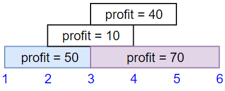

# 每日

### 5.27面试题17.11单词距离💫

> 有个内含单词的超大文本文件，给定任意两个不同的单词，找出在这个文件中这两个单词的最短距离(相隔单词数)。如果寻找过程在这个文件中会重复多次，而每次寻找的单词不同，你能对此优化吗?
>
> 示例：
>
> ```
> 输入：words = ["I","am","a","student","from","a","university","in","a","city"], word1 = "a", word2 = "student"
> 输出：1
> ```
>
> 提示：`words.length <= 100000`

```java
//他人解法：前缀树
class Solution {
    Trie root;

    public int findClosest(String[] words, String word1, String word2) {
        root = new Trie();
        for (int i = 0; i < words.length; i++) {
            addString(words[i], i);
        }
        List<Integer> list1 = searchIndex(word1);
        List<Integer> list2 = searchIndex(word2);
        if (list1 == null || list2 == null) return -1;
        int minDistance = Integer.MAX_VALUE;
        int p = 0;
        for (Integer index : list2) {
            while (p + 1 < list1.size() && Math.abs(index - list1.get(p)) > Math.abs(index - list1.get(p + 1)))
                p++;
            minDistance = Math.min(minDistance, Math.abs(index - list1.get(p)));
        }
        return minDistance;
    }

    private List<Integer> searchIndex(String str) {
        Trie cur = root;
        for (int i = 0; i < str.length(); i++) {
            int ch = str.charAt(i);
            if (cur.children[ch] == null) return null;
            cur = cur.children[ch];
        }
        return cur.indexList;
    }

    private void addString(String str, int index) {
        Trie cur = root;
        for (int i = 0; i < str.length(); i++) {
            int ch = str.charAt(i);
            if (cur.children[ch] == null)
                cur.children[ch] = new Trie();
            cur = cur.children[ch];
        }
        cur.indexList.add(index);
    }

    class Trie {
        Trie[] children;
        List<Integer> indexList;

        public Trie() {
            this.children = new Trie[128];
            this.indexList = new ArrayList<>();
        }
    }
}
```

### 5.28/1021.删除最外层括号✅

> 有效括号字符串为空 ""、"(" + A + ")" 或 A + B ，其中 A 和 B 都是有效的括号字符串，+ 代表字符串的连接。
>
> 例如，""，"()"，"(())()" 和 "(()(()))" 都是有效的括号字符串。
> 如果有效字符串 s 非空，且不存在将其拆分为 s = A + B 的方法，我们称其为原语（primitive），其中 A 和 B 都是非空有效括号字符串。
>
> 给出一个非空有效字符串 s，考虑将其进行原语化分解，使得：s = P_1 + P_2 + ... + P_k，其中 P_i 是有效括号字符串原语。
>
> 对 s 进行原语化分解，删除分解中每个原语字符串的最外层括号，返回 s 。
>
> 示例 1：
>
> ```
> 输入：s = "(()())(())"
> 输出："()()()"
> 解释：
> 输入字符串为 "(()())(())"，原语化分解得到 "(()())" + "(())"，
> 删除每个部分中的最外层括号后得到 "()()" + "()" = "()()()"。
> ```
>
> 示例 2：
>
> ```
> 输入：s = "(()())(())(()(()))"
> 输出："()()()()(())"
> 解释：
> 输入字符串为 "(()())(())(()(()))"，原语化分解得到 "(()())" + "(())" + "(()(()))"，
> 删除每个部分中的最外层括号后得到 "()()" + "()" + "()(())" = "()()()()(())"。
> ```
>
> 示例 3：
>
> ```
> 输入：s = "()()"
> 输出：""
> 解释：
> 输入字符串为 "()()"，原语化分解得到 "()" + "()"，
> 删除每个部分中的最外层括号后得到 "" + "" = ""。
> ```

```java
//效率不怎么高
class Solution {
    public String removeOuterParentheses(String s) {
        //栈和队列一起完成
        Deque<Character> stack = new LinkedList<>();
        Deque<Character> deque = new LinkedList<>();
        StringBuilder sb = new StringBuilder();
        for(int i = 0;i<s.length();i++){
            if(s.charAt(i)=='('){
                stack.addLast(s.charAt(i));
                deque.addLast(s.charAt(i));
            }else if(s.charAt(i)==')'){
                stack.pollLast();
                deque.addLast(')');
                if(stack.isEmpty()){//栈空：表示当前原语结束，收集结果
                    deque.pollLast();
                    deque.pollFirst();
                    while(!deque.isEmpty()){ 
                        sb.append(deque.pollFirst());
                    }
                }
            }
        }
        return new String(sb);
    }
}
```

### 5.29/468.验证IP地址🔁🔁🔴🔁

> 给定一个字符串 queryIP。如果是有效的 IPv4 地址，返回 "IPv4" ；如果是有效的 IPv6 地址，返回 "IPv6" ；如果不是上述类型的 IP 地址，返回 "Neither" 。
>
> 有效的IPv4地址 是 `“x1.x2.x3.x4”` 形式的IP地址。 其中 0 <= xi <= 255 且 xi 不能包含 前导零。例如: `“192.168.1.1”` 、 `“192.168.1.0”` 为有效IPv4地址， `“192.168.01.1”` 为无效IPv4地址; `“192.168.1.00”` 、 “192.168@1.1” 为无效IPv4地址。
>
> 一个有效的IPv6地址 是一个格式为`“x1:x2:x3:x4:x5:x6:x7:x8”` 的IP地址，其中:
>
> `1 <= xi.length <= 4`
> xi 是一个 十六进制字符串 ，可以包含数字、小写英文字母( 'a' 到 'f' )和大写英文字母( 'A' 到 'F' )。
> 在 xi 中允许前导零。
> 例如 `"2001:0db8:85a3:0000:0000:8a2e:0370:7334"` 和 `"2001:db8:85a3:0:0:8A2E:0370:7334"` 是有效的 IPv6 地址，而 `"2001:0db8:85a3::8A2E:037j:7334"` 和 `"02001:0db8:85a3:0000:0000:8a2e:0370:7334"` 是无效的 IPv6 地址。
>
> 示例 1：
>
> ```
> 输入：queryIP = "172.16.254.1"
> 输出："IPv4"
> 解释：有效的 IPv4 地址，返回 "IPv4"
> ```
>
> 示例 2：
>
> ```
> 输入：queryIP = "2001:0db8:85a3:0:0:8A2E:0370:7334"
> 输出："IPv6"
> 解释：有效的 IPv6 地址，返回 "IPv6"
> ```
>
> 示例 3：
>
> ```
> 输入：queryIP = "256.256.256.256"
> 输出："Neither"
> 解释：既不是 IPv4 地址，又不是 IPv6 地址
> ```

```java
//正则
class Solution {
    public String validIPAddress(String IP) {
        if (IP == null) {
            return "Neither";
        }
        String regex0 = "(\\d|[1-9]\\d|1\\d\\d|2[0-4]\\d|25[0-5])";
        String regexIPv4 = regex0 + "(\\." + regex0 + "){3}";//双引号是是字符串的，与表达式无关
        String regex1 = "([\\da-fA-F]{1,4})";
        String regexIPv6 = regex1 + "(:" + regex1 + "){7}";
        
        String result = "Neither";
        if (IP.matches(regexIPv4)) {
            result = "IPv4";
        } else if (IP.matches(regexIPv6)) {
            result = "IPv6";
        }
        return result;
    }
}
```

```
\\d   		数字 0-9
[1-9]\\d  		10-99
1\\d\\d			100-199
2[0-4]\\d   	200-249	
d|25[0-5] 		250-255
[]    		内的任意字符
\\da-fA-F    \\d 数字    a-f   A-F  的集合
{1,4}        至少出现1-4次
```


### 5.30/1022.从根到叶的二进制数之和🔴🔴

> **给出一棵二叉树，其上每个结点的值都是 0 或 1 。每一条从根到叶的路径都代表一个从最高有效位开始的二进制数。
>
> 例如，如果路径为 0 -> 1 -> 1 -> 0 -> 1，那么它表示二进制数 01101，也就是 13 。
> 对树上的每一片叶子，我们都要找出从根到该叶子的路径所表示的数字。
>
> 返回这些数字之和。题目数据保证答案是一个 32 位 整数。
>
> 
>
> ```
> 输入：root = [1,0,1,0,1,0,1]
> 输出：22
> 解释：(100) + (101) + (110) + (111) = 4 + 5 + 6 + 7 = 22
> ```
>
> **示例 2：**
>
> ```
> 输入：root = [0]
> 输出：0
> ```

```java
class Solution {
    public int sumRootToLeaf(TreeNode root) {
        if(root==null) return 0;
        return backreacking(root,0);
    }
    public int backreacking(TreeNode root,int num){
        int sum = 0;
        num = (num<<1) + root.val;
        if(root.right==null&root.left==null) return num;
        if(root.right!=null) sum+=backreacking(root.right,num);
        if(root.left!=null) sum += backreacking(root.left,num);
        return sum;
    }
}
```

### 5.31剑指 Offer II 114. 外星文字典💫

> 现有一种使用英语字母的外星文语言，这门语言的字母顺序与英语顺序不同。
>
> 给定一个字符串列表 `words` ，作为这门语言的词典，`words` 中的字符串已经 按这门新语言的字母顺序进行了排序 。
>
> 请你根据该词典还原出此语言中已知的字母顺序，并 按字母递增顺序 排列。若不存在合法字母顺序，返回 "" 。若存在多种可能的合法字母顺序，返回其中 任意一种 顺序即可。
>
> 字符串 s 字典顺序小于 字符串 t 有两种情况：
>
> 在第一个不同字母处，如果 s 中的字母在这门外星语言的字母顺序中位于 t 中字母之前，那么 s 的字典顺序小于 t 。
> 如果前面 min(s.length, t.length) 字母都相同，那么 s.length < t.length 时，s 的字典顺序也小于 t 。
>
>
> 示例 1：
>
> ```
> 输入：words = ["wrt","wrf","er","ett","rftt"]
> 输出："wertf"
> ```
>
> 示例 2：
>
> ```
> 输入：words = ["z","x"]
> 输出："zx"
> ```
>
> 示例 3：
>
> ```
> 输入：words = ["z","x","z"]
> 输出：""
> 解释：不存在合法字母顺序，因此返回 "" 。
> ```

```java
嗯，这个题在收藏夹里面躺了快一年都没有解决，今天是时候拿出来做一下了🙃🙃🙃，，感觉是一道非常经典的拓扑排序的题，代码会比较长但是很容易理解
思路：
    1、先标记所有出现过的字母，没出现过的字母不要在答案中出现；
    2、正向建图（存储某个字母的儿子）：用list存储，反向建图，用set存储；
    3、把所有出现过的点（字母）并且没有父节点的（入度为0）点先拿出来组成字母表前缀，这些是字母表中最可能的最靠前的字母们；
    4、BFS取出每一个字母，同时把它从相应儿子的set中删除，假如此时set已经空，这说明这个点的祖先你们全都遍历过了，而且也加到字母表里面了，那么这个字母也能够假如字母表；
    5、此时遍历所有set，假如还有不空的，说明拓扑排序存在环，则不存再答案；
    6、对于有些出现了的，但是还没有跟其他字母存在先后关系的字母，也要拼在字母表后边，既然出现了，也不可以落下呀，
    注意陷阱:1、建图不要重复加入边，出错案例：["ac","ab","zc","zb"] 2、后者不能是前者的真前缀，出错案例：["abc","ab"]
/*
@可爱抱抱呀
执行用时：2 ms, 在所有 Java 提交中击败了99.12%的用户
内存消耗：39.5 MB, 在所有 Java 提交中击败了79.59%的用户
2022年5月30日 15:52
*/
class Solution {
    public String alienOrder(String[] words) {
        boolean has[]=new boolean[26];//记录字母是否出现过
        char c[][]=new char[words.length][];
        for(int i=0;i<c.length;i++){
            c[i]=words[i].toCharArray();
            for(int j=0;j<c[i].length;j++){has[c[i][j]-'a']=true;}
        }
        List<Integer> son[]=new List[26];
        Set<Integer> father[]=new Set[26];
        for(int i=0;i<26;i++){
            son[i]=new ArrayList<>();
            father[i]=new HashSet<>();
        }
        //以下正反建图：
        for(int i=1;i<c.length;i++){
            int p=0;
            while(p<Math.min(c[i-1].length,c[i].length)&&c[i-1][p]==c[i][p]){p++;}
            if(p==c[i].length&&p<c[i-1].length){return "";}//后者为前者的真前缀，报警了啊
            if(p<c[i].length&&p<c[i-1].length){
                //此时遇到的首个不同字母，有关字母表顺序，主注意去重
                if(father[c[i][p]-'a'].add(c[i-1][p]-'a')){son[c[i-1][p]-'a'].add(c[i][p]-'a');}
            }
        }
        Queue<Integer> q=new LinkedList<>();
        StringBuilder ans=new StringBuilder();
        //先把没有父节点的字母收集起来，这些是字母中的前排
        for(int i=0;i<26;i++){
            if(has[i]&&father[i].size()==0){
                ans.append((char)(i+'a'));
                has[i]=false;
                q.add(i);
            }
        }
        //下边开始BFS：
        while(q.size()>0){
            int a=q.poll();
            for(int i=0;i<son[a].size();i++){
                int b=son[a].get(i);
                father[b].remove(a);
                if(father[b].size()==0){
                    ans.append((char)(b+'a'));
                    has[b]=false;
                    q.add(b);
                }
            }
        }
        //下边开始检查有无set不是空的，有的话说明存在环，顺便把无顺序关系的字母加进来
        for(int i=0;i<26;i++){
            if(father[i].size()>0){return "";}
            if(has[i]){ans.append((char)(i+'a'));}
        }
        return ans.toString();
    }
}
```

### 6.1/473. 火柴拼正方形💫

> 你将得到一个整数数组 matchsticks ，其中 matchsticks[i] 是第 i 个火柴棒的长度。你要用 所有的火柴棍 拼成一个正方形。你 不能折断 任何一根火柴棒，但你可以把它们连在一起，而且每根火柴棒必须 使用一次 。
>
> 如果你能使这个正方形，则返回 true ，否则返回 false 。
>
> 输入: matchsticks = [1,1,2,2,2]
> 输出: true
> 解释: 能拼成一个边长为2的正方形，每边两根火柴。
> 示例 2:
>
> 输入: matchsticks = [3,3,3,3,4]
> 输出: false
> 解释: 不能用所有火柴拼成一个正方形。

```java
//回溯
/*
	1、计算总长度，不是4的倍数则返回，，，单边长度len也可得出
	2、降序排序数组
	3、创建数组，存放4条边
	4、回溯：
		1、结束条件：所有火柴取完
		2、以四条边为遍历
		edges[i]+=matchsticks[index];
		if(edges]i<len && dfs(index+1)) retrun true;//遍历到底时才会满足条件
		edges[i]-=edges[i]+=matchsticks[index];
*/
class Solution{
    public boolean makeSquare(int[] matchsticks){
        int totalLen = Arrays.stream(matchsticks).sum();//使用流处理
        if(totalLen%4!=0){
            return false;
        }
        Arrays.sort(matchsticks,Collections.reverseOrder());
       int[] edges = new int[4];
        return dfs(0,matchsticks,edges,totalLen/4);
    }
    
    public boolean dfs(int index,int[] matchstaicks,int[] edges,int len ){
        if(index==matchstick.length){
            return true;
        }
        for(int i = 0;i<edges.length;i++){
            edges[i] += matchsticks[index];
            if(edges[i]<=len && dfs(index+1,matchsticks.edges.int len)){
                return true;
            }
            edges[i] -=matchsticks[index];
        }
        return false;
    }
}
```

```java
//状态压缩+DP
class Solution {
    public boolean makesquare(int[] matchsticks) {
        int totalLen = Arrays.stream(matchsticks).sum();
        if (totalLen % 4 != 0) {
            return false;
        }
        int len = totalLen / 4, n = matchsticks.length;
        int[] dp = new int[1 << n];
        Arrays.fill(dp, -1);
        dp[0] = 0;
        for (int s = 1; s < (1 << n); s++) {
            for (int k = 0; k < n; k++) {
                if ((s & (1 << k)) == 0) {
                    continue;
                }
                int s1 = s & ~(1 << k);
                if (dp[s1] >= 0 && dp[s1] + matchsticks[k] <= len) {
                    dp[s] = (dp[s1] + matchsticks[k]) % len;
                    break;
                }
            }
        }
        return dp[(1 << n) - 1] == 0;
    }
}
```

##### Arrays.stream


##### Arrays.sort  和 Collections.sort

Arrays.sort针对对象，，可以是String，int，类数组

Collections.sort针对集合（List），实际上是调用Arrays.sort

```java
// 逆序排序 ，传入 Collections.reverseOrder()
Integer[] a ={2,51,3,4,7,1,4,10,234};
Arrays.sort(a, Collections.reverseOrder());
//选择排序区间
int[] a={5,3,1,6,8,9,3};
Arrays.sort(a,0,3);//  [0,3)
```

```java
int a=1,b=7,c=4,d=5;
List<Integer> list=new ArrayList<Integer>();
list.add(a);list.add(b);list.add(c);list.add(d);
Comparator cmp=new MyComparator();
Collections.sort(list,cmp);		//需要传入list， 和Comparator接口实现类
public static class MyComparator implements Comparator<Integer>
{
	public int compare(Integer arg0, Integer arg1) {
		if(arg0<arg1)
			return 1;
		else if(arg0>arg1)
			return -1;
		else
			return 0;
	}
}

```

##### 将数组转为ArrayList

1. String[] 类型的数组转为List

  ```java
  String[] array= {"aa", "bb", "cc"};
  ArrayList<String> arrayList = new ArrayList(Arrays.asList(array));
  ```


  2.int [] 类型的数组转为List
  错误做法:
  普通整型数组 arr ：int[] arr = {1,2,3};
  错误做法：Arrays.asList(arr)

正确做法

```java
int[] array = {1, 2, 3};
List<Integer> list1 = Arrays.stream(array).boxed().collect(Collectors.toList());
// Arrays.stream(arr) 可以替换成IntStream.of(arr)。
// 1.使用Arrays.stream将int[]转换成IntStream。
// 2.使用IntStream中的boxed()装箱。将IntStream转换成Stream<Integer>。
// 3.使用Stream的collect()，将Stream<T>转换成List<T>，因此正是List<Integer>。
```


### 6.4/929.独特的电子邮件地址🔁✅

> 每个 有效电子邮件地址 都由一个 本地名 和一个 域名 组成，以 '@' 符号分隔。除小写字母之外，电子邮件地址还可以含有一个或多个 '.' 或 '+' 。
>
> 例如，在 alice@leetcode.com中， alice 是 本地名 ，而 leetcode.com 是 域名 。
> 如果在电子邮件地址的 本地名 部分中的某些字符之间添加句点（'.'），则发往那里的邮件将会转发到本地名中没有点的同一地址。请注意，此规则 不适用于域名 。
>
> 例如，"alice.z@leetcode.com” 和 “alicez@leetcode.com” 会转发到同一电子邮件地址。
> 如果在 本地名 中添加加号（'+'），则会忽略第一个加号后面的所有内容。这允许过滤某些电子邮件。同样，此规则 不适用于域名 。
>
> 例如 m.y+name@email.com 将转发到 my@email.com。
> 可以同时使用这两个规则。
>
> 给你一个字符串数组 emails，我们会向每个 emails[i] 发送一封电子邮件。返回实际收到邮件的不同地址数目。
>
>  
>
> 示例 1：
>
> ```
> 输入：emails = ["test.email+alex@leetcode.com","test.e.mail+bob.cathy@leetcode.com","testemail+david@lee.tcode.com"]
> 输出：2
> 解释：实际收到邮件的是 "testemail@leetcode.com" 和 "testemail@lee.tcode.com"。
> ```
>
> 示例 2：
>
> ```
> 输入：emails = ["a@leetcode.com","b@leetcode.com","c@leetcode.com"]
> 输出：3
> ```

```java
class Solution {
    public int numUniqueEmails(String[] emails) {
        Set<String> set = new HashSet<>();
        for(String s:emails){
            String[] arr = s.split("@");//只需对arr[0] 做处理就行
            StringBuilder sb = new StringBuilder();
            for(int i = 0;i<arr[0].length();i++){
                if(arr[0].charAt(i)=='.'){
                    continue;
                }
                if(arr[0].charAt(i)=='+'){
                    break;
                }else{
                    sb.append(arr[0].charAt(i));
                }
            }
            String news = new String(sb);
            set.add(news+"@"+arr[1]);
        }
        return set.size();
    }
}
```

### 6.5/478. 在圆内随机生成点🔁

> 给定圆的半径和圆心的位置，实现函数 randPoint ，在圆中产生均匀随机点。
>
> 实现 Solution 类:
>
> Solution(double radius, double x_center, double y_center) 用圆的半径 radius 和圆心的位置 (x_center, y_center) 初始化对象
> randPoint() 返回圆内的一个随机点。圆周上的一点被认为在圆内。答案作为数组返回 [x, y] 。
>
>
> 示例 1：
>
> ```
> 输入: 
> ["Solution","randPoint","randPoint","randPoint"]
> [[1.0, 0.0, 0.0], [], [], []]
> 输出: [null, [-0.02493, -0.38077], [0.82314, 0.38945], [0.36572, 0.17248]]
> 解释:
> Solution solution = new Solution(1.0, 0.0, 0.0);
> solution.randPoint ();//返回[-0.02493，-0.38077]
> solution.randPoint ();//返回[0.82314,0.38945]
> solution.randPoint ();//返回[0.36572,0.17248]
> ```

半径随机0-1 不能均匀分布

```java
class Solution {
    private double radius;
    private double x_center;
    private double y_center;
    private double pi = Math.PI;
    public Solution(double radius, double x_center, double y_center) {
        this.radius = radius;
        this.x_center = x_center;
        this.y_center = y_center;
    }
    
    public double[] randPoint() {
        double q1 = Math.random();//弧度因子
        double q2 = Math.random();//半径因子
        
        double x = x_center+Math.sqrt(radius*radius)*q2*Math.cos(2*pi*q1);
        double y = y_center+Math.sqrt(radius*radius)*q2*Math.sin(2*pi*q1);
        return new double[]{x,y};
    }
}

/**
 * Your Solution object will be instantiated and called as such:
 * Solution obj = new Solution(radius, x_center, y_center);
 * double[] param_1 = obj.randPoint();
 */
```

采用拒绝采用法

```java
class Solution {
    Random random = new Random();//注意random对象
    double radius;
    double x_center ;
    double y_center ;
    public Solution(double radius, double x_center, double y_center) {
        this.radius = radius;
        this.x_center = x_center ;
        this.y_center = y_center ;
    }
    
    public double[] randPoint() {
        while(true){
            double randomX = random.nextDouble() * (radius * 2) - radius ;
            double randomY = random.nextDouble() * (radius * 2) - radius;
            if (randomX * randomX + randomY * randomY <= radius * radius)
                return new double[]{randomX + x_center , randomY + y_center};
        }
    }
}
```

### 6.7/875 爱吃香蕉的珂珂🔴

> 珂珂喜欢吃香蕉。这里有 n 堆香蕉，第 i 堆中有 piles[i] 根香蕉。警卫已经离开了，将在 h 小时后回来。
>
> 珂珂可以决定她吃香蕉的速度 k （单位：根/小时）。每个小时，她将会选择一堆香蕉，从中吃掉 k 根。如果这堆香蕉少于 k 根，她将吃掉这堆的所有香蕉，然后这一小时内不会再吃更多的香蕉。  
>
> 珂珂喜欢慢慢吃，但仍然想在警卫回来前吃掉所有的香蕉。
>
> 返回她可以在 h 小时内吃掉所有香蕉的最小速度 k（k 为整数）。
>
> 示例 1：
>
> ```
> 输入：piles = [3,6,7,11], h = 8
> 输出：4
> ```
>
> 示例 2：
>
> ```
> 输入：piles = [30,11,23,4,20], h = 5
> 输出：30
> ```
>
> 示例 3：
>
> ```
> 输入：piles = [30,11,23,4,20], h = 6
> 输出：23
> ```

```java
 public int midEatingSpeed(int[] piles, int h){
     int low = 1;
     int high =0;
     for(int pile:piles){
         high = Math.max(high,pile);//找出最大值
     }
     int res = high;
     while(low<high){
         int speed = (high-low)/2+low;//中点
         long time = getTime(piles,speed);//获取当前速度的时间
         if(time<=h){//如果时间更短了， 说明速度太快了，要缩短high
             res=speed;
             high = speed;
         }else{
             low = speed+1;
         }
     }
     return res;
 }

public long getTime(int[] plies,int speed){//计算当前速度下所需要的时间
    long time= 0;
    for(int pile :piles){
        int curTime = (pile+speed-1)/speed;
        time += cuurTime;
    }
    return time;
}
```

### 6.8/1037.有效的回旋镖🔁

> 给定一个数组 points ，其中 points[i] = [xi, yi] 表示 X-Y 平面上的一个点，如果这些点构成一个 回旋镖 则返回 true 。
>
> 回旋镖 定义为一组三个点，这些点 各不相同 且 不在一条直线上 。
>
>  
>
> 示例 1：
>
> ```
> 输入：points = [[1,1],[2,3],[3,2]]
> 输出：true
> ```
>
> 示例 2：
>
> ```
> 输入：points = [[1,1],[2,2],[3,3]]
> 输出：false
> ```

```java
//因为求斜率会有÷0情况，因此采用十字相乘法
```

### 6.9/非重叠矩形中的随机点🔴

> 给定一个由非重叠的轴对齐矩形的数组 rects ，其中 rects[i] = [ai, bi, xi, yi] 表示 (ai, bi) 是第 i 个矩形的左下角点，(xi, yi) 是第 i 个矩形的右上角角点。设计一个算法来随机挑选一个被某一矩形覆盖的整数点。矩形周长上的点也算做是被矩形覆盖。所有满足要求的点必须等概率被返回。
>
> 在一个给定的矩形覆盖的空间内任何整数点都有可能被返回。
>
> 请注意 ，整数点是具有整数坐标的点。
>
> 实现 Solution 类:
>
> Solution(int[][] rects) 用给定的矩形数组 rects 初始化对象。
> int[] pick() 返回一个随机的整数点 [u, v] 在给定的矩形所覆盖的空间内。
>
> ```
> 输入: 
> ["Solution", "pick", "pick", "pick", "pick", "pick"]
> [[[[-2, -2, 1, 1], [2, 2, 4, 6]]], [], [], [], [], []]
> 输出: 
> [null, [1, -2], [1, -1], [-1, -2], [-2, -2], [0, 0]]
> 
> 解释：
> Solution solution = new Solution([[-2, -2, 1, 1], [2, 2, 4, 6]]);
> solution.pick(); // 返回 [1, -2]
> solution.pick(); // 返回 [1, -1]
> solution.pick(); // 返回 [-1, -2]
> solution.pick(); // 返回 [-2, -2]
> solution.pick(); // 返回 [0, 0]
> ```

```java
class Solution {
    Random rand;
    List<Integer> arr;
    int[][] rects;//矩阵属性

    public Solution(int[][] rects) {
        rand = new Random();
        arr = new ArrayList<Integer>();
        arr.add(0);
        this.rects = rects;
        for (int[] rect : rects) {
            int a = rect[0], b = rect[1], x = rect[2], y = rect[3];
            arr.add(arr.get(arr.size() - 1) + (x - a + 1) * (y - b + 1));//表示该矩形内点的个数
        }
    }

    public int[] pick() {
        int k = rand.nextInt(arr.get(arr.size() - 1));//从总个数中随机取出一个
        int rectIndex = binarySearch(arr, k + 1) - 1;//找到这个随机数对应的矩阵
        k -= arr.get(rectIndex);//减去该矩阵的起始点，得到在这个矩阵中的序号
        int[] rect = rects[rectIndex];//取出改矩阵
        int a = rect[0], b = rect[1], y = rect[3];
        int col = y - b + 1;
        int da = k / col;
        int db = k - col * da;
        return new int[]{a + da, b + db};
    }

    private int binarySearch(List<Integer> arr, int target) {
        int low = 0, high = arr.size() - 1;
        while (low <= high) {
            int mid = (high - low) / 2 + low;
            int num = arr.get(mid);
            if (num == target) {
                return mid;
            } else if (num > target) {
                high = mid - 1;
            } else {
                low = mid + 1;
            }
        }
        return low;
    }
}
```

### 6.11/926. 将字符串翻转到单调递增🔴🔁🔴

> 如果一个二进制字符串，是以一些 0（可能没有 0）后面跟着一些 1（也可能没有 1）的形式组成的，那么该字符串是 单调递增 的。
>
> 给你一个二进制字符串 s，你可以将任何 0 翻转为 1 或者将 1 翻转为 0 。
>
> 返回使 s 单调递增的最小翻转次数。
>
>  
>
> 示例 1：
>
> 输入：s = "00110"
> 输出：1
> 解释：翻转最后一位得到 00111.
> 示例 2：
>
> 输入：s = "010110"
> 输出：2
> 解释：翻转得到 011111，或者是 000111。
> 示例 3：
>
> 输入：s = "00011000"
> 输出：2
> 解释：翻转得到 00000000。

```java
//错误思路
    class Solution {
    public int minFlipsMonoIncr(String s) {
 		int[] pre = new int[s.length()+1];
        int[] post = new int[s.length()+1];
        int indexOf1 = s.length();
        int indexOf0 = -1;
        for(int i = 1;i<=s.length();i++){
            if(s.charAt(i-1)=='0'){
                indexOf0 = Math.max(i-1,indexOf0);
                pre[i] =pre[i-1];
            }else{
                pre[i] = pre[i-1]+1;
            }
        }
        for(int j = s.length();j>0;j--){
            if(s.charAt(j-1)=='1'){
                indexOf1 = Math.min(indexOf1,j-1);
                post[j-1]=post[j];
            }else{
                post[j-1] = post[j]+1;
            }
        }
        if(indexOf0==-1||indexOf1==s.length()){
            return 0;
        }
        int ans1 = post[indexOf1];
        int ans0 = pre[indexOf0];
        return Math.min(ans1,ans0);
    }
}
```

```java
//DP不理解
class Solution {
    public int minFlipsMonoIncr(String s) {
        int m = s.length();
        int[][] dp = new int[m + 1][2];
        for(int i = 1; i <= m; i++){
            if(s.charAt(i - 1) == '0'){
                dp[i][0] = dp[i - 1][0];//为0   保持上一位全0状态
                dp[i][1] = Math.min(dp[i - 1][0], dp[i - 1][1]) + 1;//0变1 ，
            }else{
                dp[i][0] = dp[i - 1][0] + 1;//变为0，上一位全0态—+1
                dp[i][1] = Math.min(dp[i - 1][0], dp[i - 1][1]);
            }
        }
        return Math.min(dp[m][0], dp[m][1]);
    }
}
```

```java
//状态保留DP*******************************
/*
	记录两个变量，一个记录当前1的个数
	当前为0时，答案有两种：
		前面的 1 都改为0；
		将当前这个0改成 1， res+1
*/
class Solution {
    public int minFlipsMonoIncr(String s) {
        char[] cs = s.toCharArray();
        int n = s.length();
        int res = 0, curOneCnt = 0;//记录当前1 的个数
        for (int i = 0; i < n; i ++ ) {
            if (cs[i] == '1') {
                curOneCnt ++ ;
            } else {
                res = Math.min(res + 1, curOneCnt);	//当前为0，答案就是（改为1：）
                							//（改为0： 之前的1改为0）
            }
        }
        return res;
    }
}
```

### 6.14/498.对角线遍历🔁🔴

> 给你一个大小为 m x n 的矩阵 mat ，请以对角线遍历的顺序，用一个数组返回这个矩阵中的所有元素。
>
> 示例 1：
>
> 
>
> ```
> 输入：mat = [[1,2,3],[4,5,6],[7,8,9]]
> 输出：[1,2,4,7,5,3,6,8,9]
> ```
>
> 示例 2：
>
> ```
> 输入：mat = [[1,2],[3,4]]
> 输出：[1,2,3,4]
> ```

```java
//碰到四条边的情况+正常的两种路线=6种路线
public int[] findDiagonalOrder(int[][] matrix){
    if(matrix == null||matrix.length==0){
        return new int[]{};
    }
    int r = 0,c = 0;
    int row = matrix.length, col = matrix[0].length;
    int res = new int[row*col];
    for(int i = 0;i<res.length;i++){
        res[i]= matrix[r][c];
        if((r+c)%2==0){//偶数为向上遍历，奇数为向下遍历
            if(c==col-1){
                r++;//往下移动一格准备向下遍历
            }else if(r==0){
                c++;//往右移动一格准备向下遍历
            }else{
                r--;c++;
            }else{
                if(r==row-1){
                    c++;//往右移动一格准备向上遍历
                }else if(c==0){
                    r++;//往下移动一格准备向上遍历
                }else{
                    r++;c--;
                }
            }
        }
        return res;
    }
}
```

### 6.16/532.数组中的k-diff数对🔴🔁

> 给定一个整数数组和一个整数 k，你需要在数组里找到 不同的 k-diff 数对，并返回不同的 k-diff 数对 的数目。
>
> 这里将 k-diff 数对定义为一个整数对 (nums[i], nums[j])，并满足下述全部条件：
>
> `0 <= i < j < nums.length`
> `|nums[i] - nums[j]| == k`
> 注意，`|val|` 表示 val 的绝对值。
>
> 示例 1：
>
> ```
> 输入：nums = [3, 1, 4, 1, 5], k = 2
> 输出：2
> 解释：数组中有两个 2-diff 数对, (1, 3) 和 (3, 5)。
> 尽管数组中有两个1，但我们只应返回不同的数对的数量。
> ```
>
> 示例 2：
>
> ```
> 输入：nums = [1, 2, 3, 4, 5], k = 1
> 输出：4
> 解释：数组中有四个 1-diff 数对, (1, 2), (2, 3), (3, 4) 和 (4, 5)。
> ```
>
> 示例 3：
>
> ```
> 输入：nums = [1, 3, 1, 5, 4], k = 0
> 输出：1
> 解释：数组中只有一个 0-diff 数对，(1, 1)。
> ```

```java
//两数之和的方法
class Solution {
    public int findPairs(int[] nums, int k) {
        Map<Integer,Integer> map = new HashMap<>();
        int count = 0;
        if(k<0) return 0;
        for(int i =0;i<nums.length;i++){
            map.put(nums[i],map.getOrDefault(nums[i],0)+1);
        }
        for(int i :map.keySet()){
            if(k==0){
                if(map.get(i)>1){//k=0时，需要有两个以上才能一对
                    count++;
                }
            }else if(map.containsKey(i+k)){//遍历找i+k 的就不用找 i-k 的情况了
                count++;
            }
        }
        return count;
    }
}
```


### 6.19/508.出现次数最多的子树元素和🔴

> 给你一个二叉树的根结点 root ，请返回出现次数最多的子树元素和。如果有多个元素出现的次数相同，返回所有出现次数最多的子树元素和（不限顺序）。
>
> 一个结点的 「子树元素和」 定义为以该结点为根的二叉树上所有结点的元素之和（包括结点本身）。
>

```java
class Solution {
    private int max = 0;
    public int[] findFrequentTreeSum(TreeNode root) {
        if(root==null) return new int[0];
        Map<Integer,Integer> map = new HashMap<>();
        helper(root,map);//计算所有节点的答案并存入map
        //求出map中value最大值对应的key
        List<Integer> res = new LinkedList<>();
        for(int i :map.keySet()){
            if(map.get(i)==max){
                res.add(i);
            }
        }
        int[] resAns = new int[res.size()];
        for(int i = 0;i<res.size();i++){
            resAns[i] = res.get(i);
        }
        return resAns;
    }

    private int helper(TreeNode root, Map<Integer,Integer> map){
        if(root==null) return 0;//返回条件：当前为空
        //求出当前节点为根的元素和
        int left = helper(root.left,map);//逐渐向下递归
        int right = helper(root.right,map);
        int val = left+right+root.val;//本节点的值，就是左右孩子和该节点值之和
        map.put(val,map.getOrDefault(val,0)+1);
        max = Math.max(max,map.get(val));
        return val;
    }
}
```

### 6.27/[522. 最长特殊序列 II](https://leetcode.cn/problems/longest-uncommon-subsequence-ii/)

> 给定字符串列表 `strs` ，返回其中 **最长的特殊序列** 。如果最长特殊序列不存在，返回 `-1` 。
>
> **特殊序列** 定义如下：该序列为某字符串 **独有的子序列（即不能是其他字符串的子序列）**。
>
>  `s` 的 **子序列**可以通过删去字符串 `s` 中的某些字符实现。
>
> - 例如，`"abc"` 是 `"aebdc"` 的子序列，因为您可以删除`"aebdc"`中的下划线字符来得到 `"abc"` 。`"aebdc"`的子序列还包括`"aebdc"`、 `"aeb"` 和 "" (空字符串)。
>
> **示例 1：**
>
> ```
> 输入: strs = ["aba","cdc","eae"]
> 输出: 3
> ```
>
> **示例 2:**
>
> ```
> 输入: strs = ["aaa","aaa","aa"]
> 输出: -1
> ```

```java
class Solution {
    public int findLUSlength(String[] strs) {
        int N = strs.length;
        int ans = -1;
        boolean flag = true;
        for(int i= 0;i<N;i++){
            for(int j =0;j<N;j++){
                if(i!=j && isSubstr(strs[i],strs[j])){
                    flag = false;
                    break;
                }
            }
            if(flag) ans = Math.max(ans,strs[i].length());
            flag = true;
        }
        return ans;
    }

    private boolean isSubstr(String str1, String str2){
        int index1 = 0;
        int index2 = 0;
        while(index1<str1.length() && index2<str2.length()){
            if(str1.charAt(index1)==str2.charAt(index2)) index1++;
            index2++;
        }
        return index1 ==str1.length();
    }
}
```

### 6.29/[535. TinyURL 的加密与解密🔴](https://leetcode.cn/problems/encode-and-decode-tinyurl/)

> TinyURL 是一种 URL 简化服务， 比如：当你输入一个 URL `https://leetcode.com/problems/design-tinyurl` 时，它将返回一个简化的URL `http://tinyurl.com/4e9iAk` 。请你设计一个类来加密与解密 TinyURL 。
>
> 加密和解密算法如何设计和运作是没有限制的，你只需要保证一个 URL 可以被加密成一个 TinyURL ，并且这个 TinyURL 可以用解密方法恢复成原本的 URL 。
>
> 实现 `Solution` 类：
>
> - `Solution()` 初始化 TinyURL 系统对象。
> - `String encode(String longUrl)` 返回 `longUrl` 对应的 TinyURL 。
> - `String decode(String shortUrl)` 返回 `shortUrl` 原本的 URL 。题目数据保证给定的 `shortUrl` 是由同一个系统对象加密的。
>
> **示例：**
>
> ```
> 输入：url = "https://leetcode.com/problems/design-tinyurl"
> 输出："https://leetcode.com/problems/design-tinyurl"
> 
> 解释：
> Solution obj = new Solution();
> string tiny = obj.encode(url); // 返回加密后得到的 TinyURL 。
> string ans = obj.decode(tiny); // 返回解密后得到的原本的 URL 。
> ```

```java
//hash函数计算
public class Codec {
    static final int K1 = 1117;
    static final int K2 = 1000000007;
    private Map<Integer, String> dataBase = new HashMap<Integer, String>();
    private Map<String, Integer> urlToKey = new HashMap<String, Integer>();

    public String encode(String longUrl) {
        if (urlToKey.containsKey(longUrl)) {
            return "http://tinyurl.com/" + urlToKey.get(longUrl);
        }
        int key = 0;
        long base = 1;
        for (int i = 0; i < longUrl.length(); i++) {
            char c = longUrl.charAt(i);
            key = (int) ((key + (long) c * base) % K2);
            base = (base * K1) % K2;
        }
        while (dataBase.containsKey(key)) {
            key = (key + 1) % K2;
        }
        dataBase.put(key, longUrl);
        urlToKey.put(longUrl, key);
        return "http://tinyurl.com/" + key;
    }

    public String decode(String shortUrl) {
        int p = shortUrl.lastIndexOf('/') + 1;
        int key = Integer.parseInt(shortUrl.substring(p));
        return dataBase.get(key);
    }
}

作者：LeetCode-Solution
链接：https://leetcode.cn/problems/encode-and-decode-tinyurl/solution/tinyurl-de-jia-mi-yu-jie-mi-by-leetcode-ty5yp/
来源：力扣（LeetCode）
著作权归作者所有。商业转载请联系作者获得授权，非商业转载请注明出处。
```

### 7.7/648单词替换

> 在英语中，我们有一个叫做 词根(root) 的概念，可以词根后面添加其他一些词组成另一个较长的单词——我们称这个词为 继承词(successor)。例如，词根an，跟随着单词 other(其他)，可以形成新的单词 another(另一个)。
>
> 现在，给定一个由许多词根组成的词典 dictionary 和一个用空格分隔单词形成的句子 sentence。你需要将句子中的所有继承词用词根替换掉。如果继承词有许多可以形成它的词根，则用最短的词根替换它。
>
> 你需要输出替换之后的句子。
>
>  
>
> 示例 1：
>
> ```
> 输入：dictionary = ["cat","bat","rat"], sentence = "the cattle was rattled by the battery"
> 输出："the cat was rat by the bat"
> ```
>
> 示例 2：
>
> ```
> 输入：dictionary = ["a","b","c"], sentence = "aadsfasf absbs bbab cadsfafs"
> 输出："a a b c"
> ```

```java
class Solution {
    public String replaceWords(List<String> dictionary, String sentence) {
        Set<String> dictionarySet = new HashSet<String>();
        for (String root : dictionary) {
            dictionarySet.add(root);
        }
        String[] words = sentence.split(" ");
        for (int i = 0; i < words.length; i++) {
            String word = words[i];
            for (int j = 0; j < word.length(); j++) {
                if (dictionarySet.contains(word.substring(0, 1 + j))) {
                    words[i] = word.substring(0, 1 + j);
                    break;
                }
            }
        }
        return String.join(" ", words);
    }
}
```

```java
//字典树
class Solution {
      //Trie
        Class Trie{
            Map<Character, Trie> children;
            public Trie(){
                children = new HashMap<Charater,Trie>();
            }
        }
    //方法
    public String replaceWords(List<String> dictionary, String sentence) {
        Trie trie = new Trie();
        for(String word : dictionary){
            Trie cur = trie;
            for(int i  = 0;i<word.length();i++){
                char c = word.charAt(i);
                cur.children.putIfAbsent(c,new Trie());
                cur = cur.children.get(c);
            }
            cur.children.put('#',new Trie());
        }
    }
}
```

### 8.30/最大二叉树 II

> **最大树** 定义：一棵树，并满足：其中每个节点的值都大于其子树中的任何其他值。
>
> 给你最大树的根节点 `root` 和一个整数 `val` 。
>
> 就像 [之前的问题](https://leetcode.cn/problems/maximum-binary-tree/) 那样，给定的树是利用 `Construct(a)` 例程从列表 `a`（`root = Construct(a)`）递归地构建的：
>
> - 如果 `a` 为空，返回 `null` 。
> - 否则，令 `a[i]` 作为 `a` 的最大元素。创建一个值为 `a[i]` 的根节点 `root` 。
> - `root` 的左子树将被构建为 `Construct([a[0], a[1], ..., a[i - 1]])` 。
> - `root` 的右子树将被构建为 `Construct([a[i + 1], a[i + 2], ..., a[a.length - 1]])` 。
> - 返回 `root` 。
>
> 请注意，题目没有直接给出 `a` ，只是给出一个根节点 `root = Construct(a)` 。
>
> 假设 `b` 是 `a` 的副本，并在末尾附加值 `val`。题目数据保证 `b` 中的值互不相同。
>
> 返回 `Construct(b)` 。

```java
/**
 * Definition for a binary tree node.
 * public class TreeNode {
 *     int val;
 *     TreeNode left;
 *     TreeNode right;
 *     TreeNode() {}
 *     TreeNode(int val) { this.val = val; }
 *     TreeNode(int val, TreeNode left, TreeNode right) {
 *         this.val = val;
 *         this.left = left;
 *         this.right = right;
 *     }
 * }
 */
class Solution {
    public TreeNode insertIntoMaxTree(TreeNode root, int val) {
        TreeNode parent = null;
        TreeNode cur = root;
        while(cur!=null){
            if(val>cur.val){
                if(parent==null){//已经比根节点大
                    return new TreeNode(val,root,null);
                }
                TreeNode node = new TreeNode(val,cur,null);
                parent.right = node;
                return root;
            }else{//向右子树遍历寻找
                parent = cur;
                cur = cur.right;
            }
        }
        parent.right = new TreeNode(val);
        return root;
    }
}
```

### 9.2 /687. 最长同值路径

> 给定一个二叉树的 `root` ，返回 *最长的路径的长度* ，这个路径中的 *每个节点具有相同值* 。 这条路径可以经过也可以不经过根节点。
>
> **两个节点之间的路径长度** 由它们之间的边数表示。

### 9.7 1592. 重新排列单词间的空格

> 给你一个字符串 `text` ，该字符串由若干被空格包围的单词组成。每个单词由一个或者多个小写英文字母组成，并且两个单词之间至少存在一个空格。题目测试用例保证 `text` **至少包含一个单词** 。
>
> 请你重新排列空格，使每对相邻单词之间的空格数目都 **相等** ，并尽可能 **最大化** 该数目。如果不能重新平均分配所有空格，请 **将多余的空格放置在字符串末尾** ，这也意味着返回的字符串应当与原 `text` 字符串的长度相等。
>
> 返回 **重新排列空格后的字符串** 。
>
> **示例 1：**
>
> ```
> 输入：text = "  this   is  a sentence "
> 输出："this   is   a   sentence"
> 解释：总共有 9 个空格和 4 个单词。可以将 9 个空格平均分配到相邻单词之间，相邻单词间空格数为：9 / (4-1) = 3 个。
> ```
>
> **示例 2：**
>
> ```
> 输入：text = " practice   makes   perfect"
> 输出："practice   makes   perfect "
> 解释：总共有 7 个空格和 3 个单词。7 / (3-1) = 3 个空格加上 1 个多余的空格。多余的空格需要放在字符串的末尾。
> ```
>
> **示例 3：**
>
> ```
> 输入：text = "hello   world"
> 输出："hello   world"
> ```
>
> **示例 4：**
>
> ```
> 输入：text = "  walks  udp package   into  bar a"
> 输出："walks  udp  package  into  bar  a "
> ```
>
> **示例 5：**
>
> ```
> 输入：text = "a"
> 输出："a"
> ```

```java
class Solution {
    public String reorderSpaces(String text) {
        int length = text.length();//先记录总长，这就是之后的总长
        String[] words = text.trim().split("\\s+");//表示不定长空格
        int cntSpace = length;
        for (String word : words) {
            cntSpace -= word.length();
        }
        StringBuilder sb = new StringBuilder();
        if (words.length == 1) {
            sb.append(words[0]);
            for (int i = 0; i < cntSpace; i++) {
                sb.append(' ');
            }
            return sb.toString();
        }
        int perSpace = cntSpace / (words.length - 1);
        int restSpace = cntSpace % (words.length - 1);
        for (int i = 0; i < words.length; i++) {
            if (i > 0) {
                for (int j = 0; j < perSpace; j++) {
                    sb.append(' ');
                }
            }
            sb.append(words[i]);
        }
        for (int i = 0; i < restSpace; i++) {
            sb.append(' ');
        }
        return sb.toString();
    }
}
```

### 9.12/[857. 雇佣 K 名工人的最低成本🔴](https://leetcode.cn/problems/minimum-cost-to-hire-k-workers/)

> 难度2260
> 有 `n` 名工人。 给定两个数组 `quality` 和 `wage` ，其中，`quality[i]` 表示第 `i` 名工人的工作质量，其最低期望工资为 `wage[i]` 。
>
> 现在我们想雇佣 `k` 名工人组成一个*工资组。*在雇佣 一组 `k` 名工人时，我们必须按照下述规则向他们支付工资：
>
> 1. 对工资组中的每名工人，应当按其工作质量与同组其他工人的工作质量的比例来支付工资。
> 2. 工资组中的每名工人至少应当得到他们的最低期望工资。l
>
> 给定整数 `k` ，返回 *组成满足上述条件的付费群体所需的最小金额* 。在实际答案的 `10^-5` 以内的答案将被接受。。
>
>  **示例 1：**
>
> ```
> 输入： quality = [10,20,5], wage = [70,50,30], k = 2
> 输出： 105.00000
> 解释： 我们向 0 号工人支付 70，向 2 号工人支付 35。
> ```
>
> **示例 2：**
>
> ```
> 输入： quality = [3,1,10,10,1], wage = [4,8,2,2,7], k = 3
> 输出： 30.66667
> 解释： 我们向 0 号工人支付 4，向 2 号和 3 号分别支付 13.33333。
> ```
>
>  **提示：**
>
> - `n == quality.length == wage.length`
> - `1 <= k <= n <= 104`
> - `1 <= quality[i], wage[i] <= 104`


> ```java
> class Solution {
>     public double mincostToHireWorkers(int[] quality, int[] wage, int k) {
>         int n = wage.length;
>         Integer[] h = new Integer[n];
>         for(int i=0;i<n;i++){
>             h[i]=i;
>         }
>         //性价比按从小到大排列
>         Arrays.sort(h, (a,b)->{//h中存的依然是0，1，2...，但是排序方式已经改变
>             return wage[a]*quality[b]-wage[b]*quality[a];
>         });
>         //定义优先队列  大根堆
>         PriorityQueue<Integer> queue = new PriorityQueue<Integer>((a,b)->b-a);
>         double res = 1e9;
>         double totalc = 0;
>         int totalq = 0;//总quality
>         for(int i=0;i<k-1;i++){
>             totalq += quality[h[i]];
>             queue.offer(quality[h[i]]);//将quality存入大根堆
>         }
>         for(int i=k-1;i<n;i++){
>             int id = h[i];
>             totalq += quality[id];
>             queue.offer(quality[id]);
>             totalc = (double)totalq * (double)wage[id]/quality[id];
>             res = Math.min(res,totalc);
>             totalq -= queue.poll();
>         }
>         return res;
>     }
> }
> ```

```java
class Solution {
     public double mincostToHireWorkers(int[] quality, int[] wage, int k) {
        List<Pair<Integer , Integer>> person = new ArrayList<>();
        for(int i = 0 ; i < quality.length ; i ++){
            person.add(new Pair<>(wage[i],quality[i]));
        }
        person.sort(new Comparator<Pair<Integer, Integer>>() {
            @Override
            public int compare(Pair<Integer, Integer> o1, Pair<Integer, Integer> o2) {
                Double a1 = o1.getKey() * 1.0 / o1.getValue() ;
                Double a2 = o2.getKey() * 1.0 / o2.getValue() ;
                return a1.compareTo(a2);
            }
        });
        Queue<Integer> q = new PriorityQueue<>(new Comparator<Integer>() {
            @Override
            public int compare(Integer o1, Integer o2) {
                return o2.compareTo(o1);
            }
        });
        double ret = 1 << 30;
        int sum = 0;
        for(int i = 0 ; i < person.size() ; i ++){
            double w = person.get(i).getKey() * 1.0 / person.get(i).getValue() ;
            sum += person.get(i).getValue();
            q.add(person.get(i).getValue());
            while(q.size() > k){
                sum -= q.poll();
            }
            if(q.size() == k){
                ret = Math.min(ret , sum * w);
            }
        }
        return ret;
    }
}
```

### 9.20/[698. 划分为k个相等的子集🔁](https://leetcode.cn/problems/partition-to-k-equal-sum-subsets/)🔴

> 给定一个整数数组 `nums` 和一个正整数 `k`，找出是否有可能把这个数组分成 `k` 个非空子集，其总和都相等。
>
>  **示例 1：**
>
> ```
> 输入： nums = [4, 3, 2, 3, 5, 2, 1], k = 4
> 输出： True
> 说明： 有可能将其分成 4 个子集（5），（1,4），（2,3），（2,3）等于总和。
> ```
>
> **示例 2:**
>
> ```
> 输入: nums = [1,2,3,4], k = 3
> 输出: false
> ```
>
>  

```java
//回溯,使用桶
class Solution {
    public boolean canPartitionKSubsets(int[] nums, int k) {
        Arrays.sort(nums);
        int sum = 0;
        for(int n:nums){
            sum+=n;
        }
        if(sum%k!=0){
            return false;
        }
        sum = sum/k;
        //参考学习
        if(nums[nums.length-1]>sum){
            return false;
        }
        //建立长度为k的桶
        int[] arr = new int[k];
        Arrays.fill(arr,sum);
        //从数组最后开始递归
        return help(nums,nums.length-1,arr,k);
        
    }

    boolean help(int[] nums,int cur,int[] arr,int k){
        //遍历到了 -1 就结束
        if(cur==-1){
            return true;
        }
        for(int i =0;i<k;i++){
            //剪枝：表示还能放得下
            //要么最后一个数刚好装下，要么装了最后一个数后桶还能装下最小一个数
            if(arr[i]==nums[cur]||(cur>0&&arr[i]-nums[cur]>=nums[0])){
                arr[i] -= nums[cur];//当前的数放在第i个桶
                //递归放下一个
                if(help(nums,cur-1,arr,k)){
                    return true;
                }
                //如果不该放这个数，则拿回
                arr[i] +=nums[cur];
            }
        }
        return false;
    }
}
```

```java
//状态压缩dp

```

### 9.28[面试题 17.09. 第 k 个数](https://leetcode.cn/problems/get-kth-magic-number-lcci/)🔁

> 有些数的素因子只有 3，5，7，请设计一个算法找出第 k 个数。注意，不是必须有这些素因子，而是必须不包含其他的素因子。例如，前几个数按顺序应该是 1，3，5，7，9，15，21。
>
> **示例 1:**
>
> ```
> 输入: k = 5
> 
> 输出: 9
> ```

```java
//用PriorityQueue存，然后不停求数，取一个放三个
class Solution {
    public int getKthMagicNumber(int k) {
        int[] factors = {3, 5, 7};
        Set<Long> seen = new HashSet<Long>();//已经存在的
        PriorityQueue<Long> heap = new PriorityQueue<Long>();
        seen.add(1L);
        heap.offer(1L);//小顶堆
        int magic = 0;
        for (int i = 0; i < k; i++) {//出一个，进3个
            long curr = heap.poll();
            magic = (int) curr;
            for (int factor : factors) {
                long next = curr * factor;
                if (seen.add(next)) {
                    heap.offer(next);
                }
            }
        }
        return magic;
    }
}
```

```java
//DP
class Solution {
    public int getKthMagicNumber(int k) {
        int[] dp = new int[k + 1];
        dp[1] = 1;
        int p3 = 1, p5 = 1, p7 = 1;
        for (int i = 2; i <= k; i++) {
            int num3 = dp[p3] * 3, num5 = dp[p5] * 5, num7 = dp[p7] * 7;
            dp[i] = Math.min(Math.min(num3, num5), num7);
            //只有选中的才要++
            if (dp[i] == num3) {
                p3++;
            }
            if (dp[i] == num5) {
                p5++;
            }
            if (dp[i] == num7) {
                p7++;
            }
        }
        return dp[k];
    }
}
```

### [9.29/面试题 01.09. 字符串轮转](https://leetcode.cn/problems/string-rotation-lcci/)

> 字符串轮转。给定两个字符串`s1`和`s2`，请编写代码检查`s2`是否为`s1`旋转而成（比如，`waterbottle`是`erbottlewat`旋转后的字符串）。
>
> **示例1:**
>
> ```
>  输入：s1 = "waterbottle", s2 = "erbottlewat"
>  输出：True
> ```
>
> **示例2:**
>
> ```
>  输入：s1 = "aa", s2 = "aba"
>  输出：False
> ```

```java
//最简洁
public boolean isFlipedString(String s1, String s2) {
    if (s1.length()!=s2.length()) return false;
	String ss = s2+s2;
	return ss.contains(s1);    
    }
```

```java
//字符串哈希,手动实现hash
class Solution {
    static int N = 200010, P = 13131;
    static int[] h = new int[N], p = new int[N];
    public boolean isFlipedString(String s1, String s2) {
        if (s1.length() != s2.length()) return false;
        int n = s1.length();
        for (int i = 1; i <= n; i++) h[i] = h[i - 1] * P + s2.charAt(i - 1);
        int t = h[n]; // s2 hash
        s1 = s1 + s1;
        p[0] = 1;
        for (int i = 1; i <= 2 * n; i++) {
            h[i] = h[i - 1] * P + s1.charAt(i - 1);
            p[i] = p[i - 1] * P;
        }
        for (int i = 1; i + n - 1 <= 2 * n; i++) {
            int j = i + n - 1, cur = h[j] - h[i - 1] * p[j - i + 1];
            if (cur == t) return true;
        }
        return false;
    }
}
```

```java
//模拟
class Solution {
    public boolean isFlipedString(String s1, String s2) {
        int m = s1.length(), n = s2.length();
        if (m != n) {
            return false;
        }
        if (n == 0) {
            return true;
        }
        for (int i = 0; i < n; i++) {//外侧i从0 到n
            boolean flag = true;//每更新一个i就是重新检查
            for (int j = 0; j < n; j++) {// 内层 j从0到n
                if (s1.charAt((i + j) % n) != s2.charAt(j)) {
                    flag = false;
                    break;
                }
            }
            if (flag) {
                return true;
            }
        }
        return false;
    }
}
```

### [10.8/870. 优势洗牌🔁🔁](https://leetcode.cn/problems/advantage-shuffle/)

> 给定两个大小相等的数组 `nums1` 和 `nums2`，`nums1` 相对于 `nums` 的*优势*可以用满足 `nums1[i] > nums2[i]` 的索引 `i` 的数目来描述。
>
> 返回 nums1 的**任意**排列，使其相对于 `nums2` 的优势最大化。
>
> **示例 1：**
>
> ```
> 输入：nums1 = [2,7,11,15], nums2 = [1,10,4,11]
> 输出：[2,11,7,15]
> ```
>
> **示例 2：**
>
> ```
> 输入：nums1 = [12,24,8,32], nums2 = [13,25,32,11]
> 输出：[24,32,8,12]
> ```

```
采用int[][2] 来将nums2存，按照降序
nums1 升序
通过左右指针指向nums1来判断最大最小值在哪个区间，然后从nums2从大到小满足
```

```java
//贪心：
//让nums1最大的与nums2最大的比较，但如果不满足则让nums1的去匹配
class Solution {
    public int[] advantageCount(int[] nums1, int[] nums2) {
        int n = nums1.length;
        int[][] index = new int[n][2];
        for(int i=0;i<n;i++){//记住nums2的下标
            index[i][0] = nums2[i];
            index[i][1] = i;
        }
        Arrays.sort(nums1);//nums1升序
        Arrays.sort(index,(a,b)->b[0]-a[0]);//nums2降序
        int left = 0,right= n-1;
        for(int i = 0;i<n;i++){
            if(nums1[right]>index[i][0]){
                nums2[index[i][1]] =  nums1[right];
                right--;
            }else{
                nums2[index[i][1]] = nums1[left];
                left++;
            }
        }
        return nums2;
    }
}
```

### 10.9、[856. 括号的分数🔁🔁](https://leetcode.cn/problems/score-of-parentheses/)

> 给定一个平衡括号字符串 `S`，按下述规则计算该字符串的分数：
>
> - `()` 得 1 分。
> - `AB` 得 `A + B` 分，其中 A 和 B 是平衡括号字符串。
> - `(A)` 得 `2 * A` 分，其中 A 是平衡括号字符串。
>
>  **示例 1：**
>
> ```
> 输入： "()"
> 输出： 1
> ```
>
> **示例 2：**
>
> ```
> 输入： "(())"
> 输出： 2
> ```
>
> **示例 3：**
>
> ```
> 输入： "()()"
> 输出： 2
> ```
>
> **示例 4：**
>
> ```
> 输入： "(()(()))"
> 输出： 6
> ```

```java
//绝
class Solution {
    public int scoreOfParentheses(String S) {
        int length=S.length();
        int sum=0;
        int n=0;
        for(int i=0;i<length;i++)
        {
            if(S.charAt(i)=='(')
            {
                if(n==0)
                {
                    n=1;
                }
                else
                {
                    n=n<<1;
                }
            }
            else if(S.charAt(i)==')')
            {
                 if(S.charAt(i-1)=='(')
                {
                     sum+=n;
                }
                n=n>>1;
            }
        }
        return sum;
    }
}
```

```java
//分治
class Solution {
    public int scoreOfParentheses(String s) {
        if (s.length() == 2) {
            return 1;
        }
        int bal = 0, n = s.length(), len = 0;
        for (int i = 0; i < n; i++) {
            bal += (s.charAt(i) == '(' ? 1 : -1);
            if (bal == 0) {
                len = i + 1;
                break;
            }
        }
        if (len == n) {
            return 2 * scoreOfParentheses(s.substring(1, n - 1));
        } else {
            return scoreOfParentheses(s.substring(0, len)) + scoreOfParentheses(s.substring(len));
        }
    }
}
```

```java
//栈
class Solution {
    public int scoreOfParentheses(String s) { 
        Deque<Integer> st = new ArrayDeque<Integer>();
        st.push(0);
        for (int i = 0; i < s.length(); i++) {
            if (s.charAt(i) == '(') {
                st.push(0);
            } else {
                int v = st.pop();
                int top = st.pop() + Math.max(2 * v, 1);
                st.push(top);
            }
        }
        return st.peek();
    }
}
```

### 10.10/[801. 使序列递增的最小交换次数](https://leetcode.cn/problems/minimum-swaps-to-make-sequences-increasing/)

> 我们有两个长度相等且不为空的整型数组 `nums1` 和 `nums2` 。在一次操作中，我们可以交换 `nums1[i]` 和 `nums2[i]`的元素。
>
> - 例如，如果 `nums1 = [1,2,3,8]` ， `nums2 =[5,6,7,4]` ，你可以交换 `i = 3` 处的元素，得到 `nums1 =[1,2,3,4]` 和 `nums2 =[5,6,7,8]` 。
>
> 返回 *使 `nums1` 和 `nums2` **严格递增** 所需操作的最小次数* 。
>
> 数组 `arr` **严格递增** 且 `arr[0] < arr[1] < arr[2] < ... < arr[arr.length - 1]` 。
>
> **注意：**
>
> - 用例保证可以实现操作。
>
> **示例 1:**
>
> ```
> 输入: nums1 = [1,3,5,4], nums2 = [1,2,3,7]
> 输出: 1
> 解释: 
> 交换 A[3] 和 B[3] 后，两个数组如下:
> A = [1, 3, 5, 7] ， B = [1, 2, 3, 4]
> 两个数组均为严格递增的。
> ```
>
> **示例 2:**
>
> ```
> 输入: nums1 = [0,3,5,8,9], nums2 = [2,1,4,6,9]
> 输出: 1
> ```

```java
/**
     * 解题思路：
     * 其实这道题并没有想象中那么难，只是因为题目对的描述有一些地方不到位，导致在求解过程中不能正确理解题意，做不出来。
     * 题目说到，我们*只可以交换两个数组同一个索引位置i*，最终要使得两个数组都呈现递增，随后题目说到假设输入总是有效的
     * 这句话的意思是说，题目的输入总是至少存在一种方法可以使两个数组变成递增数组，不存在如下的数组：
     *
     *  A :  4 3
     *  B :  1 2
     *
     *  上述的输入无论怎么样尝试，按照题目的方法是没办法将其转化成一个两个递增数组的，既然题目说了输入都是有效的那必然是不存在
     *  上面的输入的。
     *
     *  A: a1,a2,a3,a4...an
     *  B: b1.b2.b3,b4...bn
     *
     *  其实我们可以根据上面的描述知道，对于任意一个位置i，必然有A[i] > A[i-1] || A[i] > B[i-1]
     *  可以简单证明一下 如果i位置有A[i] <= A[i-1] && A[i] <= B[i-1]由于我们只能在同一个索引两个数组
     *  对应位置进行交换，那么可以看出A[i] <= A[i-1] && A[i] <= B[i-1]时，无论怎么换在i位置都不能满足
     *  形成递增数组的要求，所以我们之前的假设成立。同理上面的公式对于B也成立，即B[i] > B[i-1] || B[i] > A[i-1]。
     *
     *  组合A,B的情况，合乎题意的无外乎两种 1. A[i] > A[i-1] && B[i] > B[i-1] 2. B[i] > A[i-1] && A[i] > B[i-1]
     *  对于A[i] > A[i-1] && B[i] > A[i-1] 和 A[i] > B[i-1] && B[i] > B[i-1]  都是一个问题 拿第一个举例，
     *  对于B[i-1]的情况我们无从知晓，这就导致了，没法确定一定在交换后可以形成递增序列，而题目又说输入一定是有效的
     *  那无外乎A[i]>A[i-1]>B[i-1] 或者 A[i] > B[i-1] > A[i-1] 而这又退化成了我们列举的两种情况，综上只需要讨论
     *  我们列举的两种情况即可。
     *
     *  对于某个索引i，如果满足A[i] > A[i-1] && B[i] > B[i-1] 就认为在i位置时，是满足递增的要求的。
     *  对于某个索引i，如果满足A[i] > B[i-1] && B[i] > A[i-1] 就认为需要进行交换才可以满足递增的要求。
     *
     *  在考虑时，每一次我们都只需要考虑当前位置是否可以和他的前面一个位置构成严格递增，针对每一个位置如此考虑最终我们会得到一个
     *  整个数组都是严格递增。
     *
     *  在考虑每一个位置时，需要计算当前位置进行交换使当前位置达到递增的代价和不交换达到递增的代价和不交换使当前位置达到递增的代价。
     *
     *  我们在某个位置上可能的序列有两种针对A[i] > A[i - 1] && B[i] > B[i - 1]这种序列
     *  在该位置i上不交换的使得两数组递增的代价为：dp[0][i] = Math.min(dp[0][i], dp[0][i-1])，因为保持就好不用动就已经满足了递增要求
     *  在该位置上交换使得数组递增的代价为dp[1][i] = Math.min(dp[1][i], dp[1][i-1] + 1)，那么需要一起动这样才能保持递增的要求。
     *
     *  对于i位置序列为A[i] > B[i-1] && B[i] > A[i-1]时
     *  如果该位置不交换，使得两数组递增的代价为（思路就是i不换，就让i-1换，换完自然就满足两数组都递增了）dp[0][i] = Math.min(dp[0][i], dp[1][i-1]);
     *  对于i位置交换，使得两数组递增的代价为（思路就是i换，那么i-1就不要动，换完就满足了两数组都递增）：dp[1][i] = Math.min(dp[1][i], dp[0][i-1] + 1)
     *
     *  我们可以看到对于每一个位置都有两种方法使其呈现递增，那么最终的结果就是两者中的最小值。
     */
    public int minSwap(int[] A, int[] B) {
        int len = A.length;
        int[][] dp = new int[2][len];
        for (int inner[] : dp) {
            Arrays.fill(inner, Integer.MAX_VALUE);
        }
        //0 donate A[i-1] not swap 1 donate A[i-1] has swapped
        dp[0][0] = 0;
        dp[1][0] = 1;
        for (int i = 1; i < A.length; i++) {
            if (A[i] > A[i - 1] && B[i] > B[i - 1]) {
                dp[0][i] = Math.min(dp[0][i], dp[0][i-1]);
                dp[1][i] = Math.min(dp[1][i], dp[1][i-1] + 1);
            }

            if(A[i] > B[i-1] && B[i] > A[i-1]){
                dp[0][i] = Math.min(dp[0][i], dp[1][i-1]);
                dp[1][i] = Math.min(dp[1][i], dp[0][i-1] + 1);
            }

        }
        return Math.min(dp[0][len - 1], dp[1][len - 1]);
    }
```

### 10.12/[769. 最多能完成排序的块](https://leetcode.cn/problems/max-chunks-to-make-sorted/)✅

> 给定一个长度为 `n` 的整数数组 `arr` ，它表示在 `[0, n - 1]` 范围内的整数的排列。
>
> 我们将 `arr` 分割成若干 **块** (即分区)，并对每个块单独排序。将它们连接起来后，使得连接的结果和按升序排序后的原数组相同。
>
> 返回数组能分成的最多块数量。
>
>  
>
> **示例 1:**
>
> ```
> 输入: arr = [4,3,2,1,0]
> 输出: 1
> 解释:
> 将数组分成2块或者更多块，都无法得到所需的结果。
> 例如，分成 [4, 3], [2, 1, 0] 的结果是 [3, 4, 0, 1, 2]，这不是有序的数组。
> ```
>
> **示例 2:**
>
> ```
> 输入: arr = [1,0,2,3,4]
> 输出: 4
> 解释:
> 我们可以把它分成两块，例如 [1, 0], [2, 3, 4]。
> 然而，分成 [1, 0], [2], [3], [4] 可以得到最多的块数。
> ```


```java
public int maxChunksToSorted(int[] arr) {
            //遍历一遍，每次都要到当前数字的索引位置，
           int res = 0;
           int max = -1;
           for(int i = 0;i<arr.length;i++){
               max = Math.max(max,arr[i]);
               if(max==i) res++;
           }
           return res;
        }
```


### 10.16/[886. 可能的二分法](https://leetcode.cn/problems/possible-bipartition/)

> 给定一组 `n` 人（编号为 `1, 2, ..., n`）， 我们想把每个人分进**任意**大小的两组。每个人都可能不喜欢其他人，那么他们不应该属于同一组。
>
> 给定整数 `n` 和数组 `dislikes` ，其中 `dislikes[i] = [ai, bi]` ，表示不允许将编号为 `ai` 和 `bi`的人归入同一组。当可以用这种方法将所有人分进两组时，返回 `true`；否则返回 `false`。 
>
> **示例 1：**
>
> ```
> 输入：n = 4, dislikes = [[1,2],[1,3],[2,4]]
> 输出：true
> 解释：group1 [1,4], group2 [2,3]
> ```
>
> **示例 2：**
>
> ```
> 输入：n = 3, dislikes = [[1,2],[1,3],[2,3]]
> 输出：false
> ```
>
> **示例 3：**
>
> ```
> 输入：n = 5, dislikes = [[1,2],[2,3],[3,4],[4,5],[1,5]]
> 输出：false
> ```

##### 并查集

模板；

n 表示节点数
p 存储每个点的父节点，初始时每个点的父节点都是自己
size 只有当节点是祖宗节点时才有意义，表示祖宗节点所在集合中，点的数量
find(x) 函数用于查找 xx 所在集合的祖宗节点
union(a, b) 函数用于合并 aa 和 bb 所在的集合

```java
int[] p = new int[n];//存储父节点
int[] size = new int[n];
for (int i = 0; i < n; ++i) {//初始化过程
    p[i] = i;
    size[i] = 1;
}

int find(int x) {
    if (p[x] != x) {
        // 路径压缩
        p[x] = find(p[x]);
    }
    return p[x];
}

void union(int a, int b) {
    int pa = find(a), pb = find(b);
    if (pa == pb) {
        return;
    }
    p[pa] = pb;
    size[pb] += size[pa];
}
```

​		对于本题，我们遍历每一个人，他与他不喜欢的人不应该在同一个集合中，如果在同一个集合中，就产生了冲突，直接返回 false。如果没有冲突，那么就将他所有不喜欢的人合并到同一个集合中。

遍历结束，说明没有冲突，返回 true

```java
class Solution{
    private int[] p;//存父节点
    public boolean possibleBiparttion(int n ,int[][] dislikes){
        p =  new int[n];
        List<Integer>[] g = new List[n];
        for(int i = 0;i<n;i++){
            p[i] = i;
            g[i] = new ArrayList<>();
        }
        for(var e:dislikes){
            int a = e[0]-1,b=e[1]-1;//因为是从1开始的
            g[a].add(b);
            g[b].add(a);
        }
        
        for(int i = 0;i<n;i++){
            for(int j:g[i]){
                if(find(i)==find(j)){
                    return false;
                }
                p[find(j)] = find(g[i].get(0));
            }
        }
        return true;
    }
    
    
    private int find(int x){
        if(p[x]!=x){
            p[x] = find(p[x]);
        }
        return p[x];
    }
}
```

### 10/19、[779. 第K个语法符号](https://leetcode.cn/problems/k-th-symbol-in-grammar/)

> 我们构建了一个包含 `n` 行( **索引从 1 开始** )的表。首先在第一行我们写上一个 `0`。接下来的每一行，将前一行中的`0`替换为`01`，`1`替换为`10`。
>
> - 例如，对于 `n = 3` ，第 `1` 行是 `0` ，第 `2` 行是 `01` ，第3行是 `0110` 。
>
> 给定行数 `n` 和序数 `k`，返回第 `n` 行中第 `k` 个字符。（ `k` **从索引 1 开始**）
> **示例 1:**
>
> ```
> 输入: n = 1, k = 1
> 输出: 0
> 解释: 第一行：0
> ```
>
> **示例 2:**
>
> ```
> 输入: n = 2, k = 1
> 输出: 0
> 解释: 
> 第一行: 0 
> 第二行: 01
> ```
>
> **示例 3:**
>
> ```
> 输入: n = 2, k = 2
> 输出: 1
> 解释:
> 第一行: 0
> 第二行: 01
> ```

```c++
/*
可以看出，某一个位置是1还是0，只取决于它的父亲以及它是left还是right。假如是左孩子，就与父亲相同；否则与父亲相反。所以，我们要判断某一个位置，就要先求它的父亲，然后根据位置判断是否取反即可。
可以采用递归：如果是第一层，直接返回0，否则求它的父亲。(n,k)的父亲的位置，就是(n-1,(k+1)/2)，第二个参数代表k/2向上取整。而某个位置是左孩子还是右孩子，可以判断k是否为奇数，如果是奇数，就是左孩子，那就应该与父亲相同，否则相反。这可以通过异或实现。如果是奇数，k%2==1，否则k%2==0，而0异或一个数不改变值，所以我们将k%2取反再与父亲异或即可。*/
class Solution {
public:
    int kthGrammar(int n, int k) {
        if (n == 1) return 0;
        int ret = kthGrammar(n - 1, (k + 1)/2);
        if (ret == 0) {
            return k % 2 ? 0 : 1;
        } else {
            return k % 2 ? 1 : 0;
        }
    }
};
```

### 10/21 [901. 股票价格跨度](https://leetcode.cn/problems/online-stock-span/)🔴🔴🔁

> 编写一个 `StockSpanner` 类，它收集某些股票的每日报价，并返回该股票当日价格的跨度。
>
> 今天股票价格的跨度被定义为股票价格小于或等于今天价格的最大连续日数（从今天开始往回数，包括今天）。
>
> 例如，如果未来7天股票的价格是 `[100, 80, 60, 70, 60, 75, 85]`，那么股票跨度将是 `[1, 1, 1, 2, 1, 4, 6]`。
>
> **示例：**
>
> ```
> 输入：["StockSpanner","next","next","next","next","next","next","next"], [[],[100],[80],[60],[70],[60],[75],[85]]
> 输出：[null,1,1,1,2,1,4,6]
> 解释：
> 首先，初始化 S = StockSpanner()，然后：
> S.next(100) 被调用并返回 1，
> S.next(80) 被调用并返回 1，
> S.next(60) 被调用并返回 1，
> S.next(70) 被调用并返回 2，
> S.next(60) 被调用并返回 1，
> S.next(75) 被调用并返回 4，
> S.next(85) 被调用并返回 6。
> 
> 注意 (例如) S.next(75) 返回 4，因为截至今天的最后 4 个价格
> (包括今天的价格 75) 小于或等于今天的价格。
> ```

##### 单调栈

```java
class StockSpanner {
    Deque<int[]> stack;//单调栈存 int[2]，{序号，价格}
    int idx;

    public StockSpanner() {
        stack = new ArrayDeque<int[]>();
        stack.push(new int[]{-1, Integer.MAX_VALUE});
        idx = -1;
    }

    public int next(int price) {
        idx++;
        while (price >= stack.peek()[1]) {
            stack.pop();//当前价格大于栈顶，则栈顶取出
        }
        int ret = idx - stack.peek()[0];
        stack.push(new int[]{idx, price});
        return ret;
    }
}
```

### 10/22 [1235. 规划兼职工作🔴](https://leetcode.cn/problems/maximum-profit-in-job-scheduling/)

> 你打算利用空闲时间来做兼职工作赚些零花钱。
>
> 这里有 `n` 份兼职工作，每份工作预计从 `startTime[i]` 开始到 `endTime[i]` 结束，报酬为 `profit[i]`。
>
> 给你一份兼职工作表，包含开始时间 `startTime`，结束时间 `endTime` 和预计报酬 `profit` 三个数组，请你计算并返回可以获得的最大报酬。
>
> 注意，时间上出现重叠的 2 份工作不能同时进行。
>
> 如果你选择的工作在时间 `X` 结束，那么你可以立刻进行在时间 `X` 开始的下一份工作。
>
>  **示例 1：**
>
> ****
>
> ```
> 输入：startTime = [1,2,3,3], endTime = [3,4,5,6], profit = [50,10,40,70]
> 输出：120
> 解释：
> 我们选出第 1 份和第 4 份工作， 
> 时间范围是 [1-3]+[3-6]，共获得报酬 120 = 50 + 70。
> ```

按结束时间从小到大排序， dp[i] 表示前i份工作可以获得的最大报酬

dp[i] = max( dp[i-1], dp[k]+profit[i-1])

```java
//dp+二分查找
class Solution {
    public int jobScheduling(int[] startTime, int[] endTime, int[] profit) {
        int n = startTime.length;
        int[][] jobs = new int[n][];
        for (int i = 0; i < n; i++) {
            jobs[i] = new int[]{startTime[i], endTime[i], profit[i]};
        }
        Arrays.sort(jobs, (a, b) -> a[1] - b[1]);
        int[] dp = new int[n + 1];
        for (int i = 1; i <= n; i++) {
            int k = binarySearch(jobs, i - 1, jobs[i - 1][0]);//[0] startTime   寻找比当前开始时间更早的结束时间
            dp[i] = Math.max(dp[i - 1], dp[k] + jobs[i - 1][2]);
        }
        return dp[n];
    }
//先二分找小于等于第i-1份工作开始时间的工作计为k，然后因为dp的索引比工作索引多1，所以更好的写法为：dp[k + 1] + jobs[i - 1][2]; 但是官方的解答里面，这个k直接就是求的第一个大于等于第i-1份工作开始时间的索引，所以就不需要+1的操作了。
    public int binarySearch(int[][] jobs, int right, int target) {
        int left = 0;
        while (left < right) {
            int mid = left + (right - left) / 2;
            if (jobs[mid][1] > target) {
                right = mid;
            } else {
                left = mid + 1;
            }
        }
        return left;
    }
}
```

```java
class Solution {
    public int jobScheduling(int[] startTime, int[] endTime, int[] profit) {
        int n=startTime.length;
        int jobs[][]=new int[n][];
        for(int i=0;i<n;i++){jobs[i]=new int[]{startTime[i],endTime[i],profit[i]};}
        Arrays.sort(jobs,(a,b)->a[0]-b[0]);
        int ans[]=new int[n];//ans[i]表示的是最晚从jobs[i][0]开始兼职可以最多得到多少钱
        for(int i=n-1;i>=0;i--){
            if(jobs[i][1]<=jobs[n-1][0]){
                int l=i+1,r=n-1;
                while(l<r){
                    int mid=(l+r)>>1;
                    if(jobs[mid][0]>=jobs[i][1]){r=mid;}
                    else{l=mid+1;}
                    if(l==r-1){
                        if(jobs[l][0]>=jobs[i][1]){r=l;}
                        break;
                    }
                }
                ans[i]=jobs[i][2]+ans[r];
            }
            else{ans[i]=jobs[i][2];}//只能做一份工作
            if(i<n-1){ans[i]=Math.max(ans[i],ans[i+1]);}
        }
        return ans[0];
    }
}
```

### 10.25/[934. 最短的桥🔴](https://leetcode.cn/problems/shortest-bridge/)

> 给你一个大小为 `n x n` 的二元矩阵 `grid` ，其中 `1` 表示陆地，`0` 表示水域。
>
> **岛** 是由四面相连的 `1` 形成的一个最大组，即不会与非组内的任何其他 `1` 相连。`grid` 中 **恰好存在两座岛** 。
>
> 你可以将任意数量的 `0` 变为 `1` ，以使两座岛连接起来，变成 **一座岛** 。
>
> 返回必须翻转的 `0` 的最小数目。
>
> **示例 1：**
>
> ```
> 输入：grid = [[0,1],[1,0]]
> 输出：1
> ```
>
> **示例 2：**
>
> ```
> 输入：grid = [[0,1,0],[0,0,0],[0,0,1]]
> 输出：2
> ```
>
> **示例 3：**
>
> ```
> 输入：grid = [[1,1,1,1,1],[1,0,0,0,1],[1,0,1,0,1],[1,0,0,0,1],[1,1,1,1,1]]
> 输出：1
> ```

```java
//因此，我们可以先通过 DFS 将其中一个岛屿的所有点找出来，放到一个队列 q 中。然后通过 BFS 一层层向外扩展，直至碰到另一个岛屿，此时将当前扩展的层数作为答案返回即可。 DFS 和 BFS 搜索的过程中，我们直接将已经访问过的点标记为 2，这样就不会重复访问。时间复杂度 O(n²)，空间复杂度 O(n²)。其中 n 为矩阵的行数或列数。
class Solution {
    private int[] dirs = {-1, 0, 1, 0, -1};
    private Deque<int[]> q = new ArrayDeque<>();
    private int[][] grid;
    private int n;

    public int shortestBridge(int[][] grid) {
        this.grid = grid;
        n = grid.length;
        for (int i = 0, x = 1; i < n && x == 1; ++i) {
            for (int j = 0; j < n; ++j) {
                if (grid[i][j] == 1) {
                    dfs(i, j);//深度优先把 连续的1 变为 2
                    x = 0;
                    break;//只需要寻找一座岛就行
                }
            }
        }
        int ans = 0;
        while (true) {
            for (int i = q.size(); i > 0; --i) {
                var p = q.pollFirst();//从所有编号为2 的岛取出
                for (int k = 0; k < 4; ++k) {
                    int x = p[0] + dirs[k], y = p[1] + dirs[k + 1];//遍历4个方向
                    if (x >= 0 && x < n && y >= 0 && y < n) {//保证范围
                        if (grid[x][y] == 1) {//找到1了，就返回结果
                            return ans;
                        }
                        if (grid[x][y] == 0) {
                            grid[x][y] = 2;
                            q.offer(new int[] {x, y});
                        }
                    }
                }
            }
            ++ans;
        }
    }

    private void dfs(int i, int j) {
        grid[i][j] = 2;
        q.offer(new int[] {i, j});
        for (int k = 0; k < 4; ++k) {
            int x = i + dirs[k], y = j + dirs[k + 1];//遍历4个方向
            if (x >= 0 && x < n && y >= 0 && y < n && grid[x][y] == 1) {
                dfs(x, y);
            }
        }
    }
}
```


# 计划

### 542.01矩阵🔴🔴

> 给定一个由 0 和 1 组成的矩阵 mat ，请输出一个大小相同的矩阵，其中每一个格子是 mat 中对应位置元素到最近的 0 的距离。
>
> 两个相邻元素间的距离为 1 。
>

```java
//BFS
/*
	将所有0加入队列头，作为第一层
	初始化：将原来的1位置赋为最大值
	遍历：
		
*/
class Solution {
    public int[][] updateMatrix(int[][] mat) {
        int[][] dirs = {{0,1},{0,-1},{1,0},{-1,0}};
        Deque<int[]> q = new LinkedList<>();
        int m = mat.length;
        int n = mat[0].length;
        for(int i = 0;i<m;i++){
            for(int j = 0;j<n;j++){
                if(mat[i][j]==0){
                    q.addFirst(new int[]{i,j});
                }else{
                    mat[i][j] = m+n;
                }
            }
        }
        while(!q.isEmpty()){
            int[] dot = q.pollFirst();//x,y 是当前队列头元素
            int x = dot[0];
            int y = dot[1];
            for(int[] v :dirs){
                int nx = x+v[0];
                int ny = y+v[1];
                if(nx>=0&&nx<m&&ny>=0&&ny<n){
                    if(mat[x][y]+1<mat[nx][ny]){//当前对头元素+1<边上的位置，说明边上的位置能更快到达，更新
                        mat[nx][ny] = mat[x][y]+1;
                        q.addLast(new int[]{nx,ny});//将更新过的点加入队中，看它能影响它周边哪些点
                    }
                }
            }
        }
        return mat;
    }
}
```

### 994.腐烂的橘子🔴🔴

> 在给定的 m x n 网格 grid 中，每个单元格可以有以下三个值之一：
>
> 值 0 代表空单元格；
> 值 1 代表新鲜橘子；
> 值 2 代表腐烂的橘子。
> 每分钟，腐烂的橘子 周围 4 个方向上相邻 的新鲜橘子都会腐烂。
>
> 返回 直到单元格中没有新鲜橘子为止所必须经过的最小分钟数。如果不可能，返回 -1 。
>
> ```
> 输入：grid = [[2,1,1],[1,1,0],[0,1,1]]
> 输出：4
> ```
>
> 示例 2：
>
> ```
> 输入：grid = [[2,1,1],[0,1,1],[1,0,1]]
> 输出：-1
> 解释：左下角的橘子（第 2 行， 第 0 列）永远不会腐烂，因为腐烂只会发生在 4 个正向上。
> ```
>
> 示例 3：
>
> ```
> 输入：grid = [[0,2]]
> 输出：0
> 解释：因为 0 分钟时已
> ```

- 一开始，我们找出所有腐烂的橘子，将它们放入队列，作为第 0 层的结点。

- 然后进行 BFS 遍历，每个结点的相邻结点可能是上、下、左、右四个方向的结点，注意判断结点位于网格边界的特殊情况。
- 由于可能存在无法被污染的橘子，我们需要记录新鲜橘子的数量。在 BFS 中，每遍历到一个橘子（污染了一个橘子），就将新鲜橘子的数量减一。如果 BFS 结束后这个数量仍未减为零，说明存在无法被污染的橘子。

```java
class Solution {
    public int orangesRotting(int[][] grid) {
        //要记录当前剩余新鲜橘子数，如果执行完后不为0则返回-1
        //开始先将所有的腐烂橘子加入队
        //每一轮计算当前的队列的数，队列为空时计算时间
        //遍历时将由好变坏的橘子入队
        Deque<int[]> queue = new LinkedList<>();
        int count = 0;
        int m = grid.length;
        int n = grid[0].length;
        for(int i = 0;i<m;i++){
            for(int j = 0;j<n;j++){
                if(grid[i][j]==1){
                    count++;
                }else if(grid[i][j]==2){
                    queue.add(new int[]{i,j});
                }
            }
        }
        int rount = 0;
        int[][] dirs = {{0,1},{0,-1},{1,0},{-1,0}};
        while(count>0&&!queue.isEmpty()){
            rount++;
            int len = queue.size();
            for(int i =0;i<len;i++){
                int[] orange = queue.poll();
                int x = orange[0];
                int y = orange[1];
                for(int[] d: dirs){
                    int nx = x+d[0];
                    int ny = y+d[1];
                    if(nx>=0&&nx<m&&ny>=0&&ny<n){
                        if(grid[nx][ny]==1){
                            grid[nx][ny] = 2;
                            queue.addLast(new int[]{nx,ny});
                            count--;
                        }
                    }
                }
            }
        }
        if(count>0){
            return -1;
        }
        return rount;
    }
}
```

### 1588.所有奇数长度子数组和🔁🔴🔴🔁

> 给你一个正整数数组 arr ，请你计算所有可能的奇数长度子数组的和。
>
> 子数组 定义为原数组中的一个连续子序列。
>
> 请你返回 arr 中 所有奇数长度子数组的和 。
>
>  
>
> 示例 1：
>
> ```
> 输入：arr = [1,4,2,5,3]
> 输出：58
> 解释：所有奇数长度子数组和它们的和为：
> [1] = 1
> [4] = 4
> [2] = 2
> [5] = 5
> [3] = 3
> [1,4,2] = 7
> [4,2,5] = 11
> [2,5,3] = 10
> [1,4,2,5,3] = 15
> 我们将所有值求和得到 1 + 4 + 2 + 5 + 3 + 7 + 11 + 10 + 15 = 58
> ```
>
> 示例 2：
>
> ```
> 输入：arr = [1,2]
> 输出：3
> 解释：总共只有 2 个长度为奇数的子数组，[1] 和 [2]。它们的和为 3 。
> ```
>
> 示例 3：
>
> ```
> 输入：arr = [10,11,12]
> 输出：66
> ```

```java
//前缀和
class Solution {
     public int sumOddLengthSubarrays(int[] arr) {
        int n = arr.length;
        int[] prefix = new int[n + 1];
        for (int i = 0; i < n; i++) {
            prefix[i + 1] = prefix[i] + arr[i];
        }
        int res = 0;
        for (int i = 0; i < n; i++) {
            for (int j = i; j >= 0; j -= 2) {
                res += prefix[i + 1] - prefix[j];
            }
        }
        return res;
    }
}
```

### 1356. 根据数字二进制下 1 的数目排序🔁🔴

> 给你一个整数数组 `arr` 。请你将数组中的元素按照其二进制表示中数字 **1** 的数目升序排序。
>
> 如果存在多个数字二进制中 **1** 的数目相同，则必须将它们按照数值大小升序排列。
>
> 请你返回排序后的数组。
>
>  
>
> **示例 1：**
>
> ```
> 输入：arr = [0,1,2,3,4,5,6,7,8]
> 输出：[0,1,2,4,8,3,5,6,7]
> 解释：[0] 是唯一一个有 0 个 1 的数。
> [1,2,4,8] 都有 1 个 1 。
> [3,5,6] 有 2 个 1 。
> [7] 有 3 个 1 。
> 按照 1 的个数排序得到的结果数组为 [0,1,2,4,8,3,5,6,7]
> ```
>
> **示例 2：**
>
> ```
> 输入：arr = [1024,512,256,128,64,32,16,8,4,2,1]
> 输出：[1,2,4,8,16,32,64,128,256,512,1024]
> 解释：数组中所有整数二进制下都只有 1 个 1 ，所以你需要按照数值大小将它们排序。
> ```

```java
class Solution {
    private int cntInt(int val){
        int count = 0;
        while(val > 0) {
            val = val & (val - 1);//不停消去最低位的1
            count ++;
        }
        return count;
    }

    public int[] sortByBits(int[] arr) {
      return Arrays.stream(arr).boxed()
            .sorted(new Comparator<Integer>(){
                @Override
                public int compare(Integer o1, Integer o2) {
                    int cnt1 = cntInt(o1);
                    int cnt2 = cntInt(o2);
                    return (cnt1 == cnt2) ? Integer.compare(o1, o2) : Integer.compare(cnt1, cnt2);
                }
            })
            .mapToInt(Integer::intValue)
            .toArray();
    }
}
```

```java
//稍微好理解的
class Solution {
    public int[] sortByBits(int[] arr) {
        int[][] arrnew = new int[arr.length][2];
        for (int i = 0; i < arrnew.length; i++) {
            arrnew[i][0] = arr[i];
            arrnew[i][1] = countOne(arr[i]);
        }
        Arrays.sort(arrnew, (o1, o2) -> o1[1] == o2[1] ? o1[0] - o2[0] : o1[1] - o2[1]);
        for (int i = 0; i < arr.length; i++) {
            arr[i] = arrnew[i][0];
        }
        return arr;
    }

    public int countOne(int num) {
        int count = 0;
        while (num != 0) {
            count += (num & 1);
            num >>= 1;
        }
        return count;
    }
}
```

### 226. 翻转二叉树🔁

给你一棵二叉树的根节点 `root` ，翻转这棵二叉树，并返回其根节点。

```java
利用前序遍历
class Solution {
        // 先序遍历--从顶向下交换
        public TreeNode invertTree(TreeNode root) {
            if (root == null) return null;
            // 保存右子树
            TreeNode rightTree = root.right;
            // 交换左右子树的位置
            root.right = invertTree(root.left);
            root.left = invertTree(rightTree);
            return root;
        }
    }

利用中序遍历
class Solution {
    public TreeNode invertTree(TreeNode root) {
            if (root == null) return null;
            invertTree(root.left); // 递归找到左节点
            TreeNode rightNode= root.right; // 保存右节点
            root.right = root.left;
            root.left = rightNode;
            // 递归找到右节点 继续交换 : 因为此时左右节点已经交换了,所以此时的右节点为root.left
            invertTree(root.left); 
    }
}

利用后序遍历
 class Solution {
        public TreeNode invertTree(TreeNode root) {
            // 后序遍历-- 从下向上交换
            if (root == null) return null;
            TreeNode leftNode = invertTree(root.left);
            TreeNode rightNode = invertTree(root.right);
            root.right = leftNode;
            root.left = rightNode;
            return root;
        }
    }

利用层次遍历
   class Solution {
        public TreeNode invertTree(TreeNode root) {
            // 层次遍历--直接左右交换即可
            if (root == null) return null;
            Queue<TreeNode> queue = new LinkedList<>();//层序遍历都需要队列
            queue.offer(root);
            while (!queue.isEmpty()){
                TreeNode node = queue.poll();
                TreeNode rightTree = node.right;
                node.right = node.left;
                node.left = rightTree;
                if (node.left != null){
                    queue.offer(node.left);
                }
                if (node.right != null){
                    queue.offer(node.right);
                }
            }
            return root;
        }
    }
```

### 191. 位1的个数

> 编写一个函数，输入是一个无符号整数（以二进制串的形式），返回其二进制表达式中数字位数为 '1' 的个数（也被称为[汉明重量](https://baike.baidu.com/item/汉明重量)）。

```java
//Java内置方法 String str = Integer.toBinaryString(num);
//通过与每一位作运算计算
int count = 0;
while(n>0){
    if(n&1) count++;
}
//计算最低位的1
int count = 0;
while(n>0){
    n = n&(n-1);
    count++;
}
//从最低位逐位检查
int count = 0;
while(n>0){
    if(n&1){
        count++;
    }
    n>>=1; 
}
```

### 720. 词典中最长的单词🔁🔴🔴

> 给出一个字符串数组 `words` 组成的一本英语词典。返回 `words` 中最长的一个单词，该单词是由 `words` 词典中其他单词逐步添加一个字母组成。
>
> 若其中有多个可行的答案，则返回答案中字典序最小的单词。若无答案，则返回空字符串。
>
> **示例 1：**
>
> ```
>输入：words = ["w","wo","wor","worl", "world"]
> 输出："world"
> 解释： 单词"world"可由"w", "wo", "wor", 和 "worl"逐步添加一个字母组成。
> ```
> 
> **示例 2：**
>
> ```
>输入：words = ["a", "banana", "app", "appl", "ap", "apply", "apple"]
> 输出："apple"
> 解释："apply" 和 "apple" 都能由词典中的单词组成。但是 "apple" 的字典序小于 "apply" 
> ```

```java
//排序（按长度），逐个检查放入map中，如果存在（短一个字母的）就存进去。
class Solution {
    public String longestWord(String[] words) {
    Arrays.sort(words);//通过sort就能按长度和字典序排好了！不要后续考虑
    Set<String> set = new HashSet<>();
    String res = "";
    for (String s : words) {
        //如果单词只有一个字母，那一定是共有的
        if (s.length() == 1 || set.contains(s.substring(0, s.length() - 1))) {
            res = s.length() > res.length() ? s : res;//res是当前最长的答案
            set.add(s);
        }
    }
    return res;
    }
}
```

### 784. 字母大小写全排列🔴

> 难度中等391收藏分享切换为英文接收动态反馈
>
> 给定一个字符串 `s` ，通过将字符串 `s` 中的每个字母转变大小写，我们可以获得一个新的字符串。
>
> 返回 *所有可能得到的字符串集合* 。以 **任意顺序** 返回输出。
>
> **示例 1：**
>
> ```
> 输入：s = "a1b2"
> 输出：["a1b2", "a1B2", "A1b2", "A1B2"]
> ```
>
> **示例 2:**
>
> ```
> 输入: s = "3z4"
> 输出: ["3z4","3Z4"]
> ```
>
>  

```java
class Solution {
    List<String> res = new ArrayList<>();
    int dis = 'A'-'a';
    public List<String> letterCasePermutation(String s) {
        if(s.length()==0){return res;}
        char[] cs = s.toCharArray();
        bt(cs,0);
        return res;
    }
    public void bt(char[] cs,int index){
        res.add(String.valueOf(cs));
        for(int i = index;i<cs.length;i++){
            if(cs[i]>='0'&&cs[i]<='9'){
                continue;
            }else if(cs[i]>='a'&&cs[i]<='z'){
                cs[i] = (char)(cs[i]+dis);
                bt(cs,i+1);
                cs[i] = (char)(cs[i]-dis);
            }else{
                cs[i] = (char)(cs[i]-dis);
                bt(cs,i+1);
                cs[i] = (char)(cs[i]+dis);
            }
        }
    }
} 
```

### 653. 两数之和 IV - 输入 BST🔴🔴

给定一个二叉搜索树 `root` 和一个目标结果 `k`，如果 BST 中存在两个元素且它们的和等于给定的目标结果，则返回 `true`。

```java
class Solution {
    Set<Integer> set = new HashSet<Integer>();

    public boolean findTarget(TreeNode root, int k) {
        if (root == null) {
            return false;
        }
        if (set.contains(k - root.val)) {
            return true;
        }
        set.add(root.val);
        return findTarget(root.left, k) || findTarget(root.right, k);
    }
}
```

### 剑指 Offer 26. 树的子结构🔴🔴

> 输入两棵二叉树A和B，判断B是不是A的子结构。(约定空树不是任意一个树的子结构)
>
> B是A的子结构， 即 A中有出现和B相同的结构和节点值。
>
> 例如:
> 给定的树 A:
>
> `   3  / \  4  5 / \ 1  2`
> 给定的树 B：
>
> `  4  / 1`
> 返回 true，因为 B 与 A 的一个子树拥有相同的结构和节点值。
>
> **示例 1：**
>
> ```
> 输入：A = [1,2,3], B = [3,1]
> 输出：false
> ```
>
> **示例 2：**
>
> ```
> 输入：A = [3,4,5,1,2], B = [4,1]
> 输出：true
> ```

```java
//递归
class Solution {
    public boolean isSubStructure(TreeNode A, TreeNode B) {
        if(B==null) return false;
        return search(A,B);
    }
    private boolean compare(TreeNode A,TreeNode B){
        if(B==null) return true;
        if(A==null) return false;//这两行顺序不能错
        return A.val==B.val &&compare(A.left,B.left)&&compare(A.right,B.right);
    }

    private boolean search(TreeNode A,TreeNode B){
        //先序遍历到A中B根节点位置
        if(A==null) return false;
        if(A.val==B.val&&compare(A,B)) return true;
        return search(A.left,B)||search(A.right,B);
    }
}
```

### [剑指 Offer II 048. 序列化与反序列化二叉树](https://leetcode.cn/problems/h54YBf/)

> 序列化是将一个数据结构或者对象转换为连续的比特位的操作，进而可以将转换后的数据存储在一个文件或者内存中，同时也可以通过网络传输到另一个计算机环境，采取相反方式重构得到原数据。
>
> 请设计一个算法来实现二叉树的序列化与反序列化。这里不限定你的序列 / 反序列化算法执行逻辑，只需要保证一个二叉树可以被序列化为一个字符串并且将这个字符串反序列化为原始的树结构。

```java
//官方解法，bfs+先序遍历
public class Codec {
    public String serialize(TreeNode root) {
        return rserialize(root, "");
    }
  
    public TreeNode deserialize(String data) {
        String[] dataArray = data.split(",");
        List<String> dataList = new LinkedList<String>(Arrays.asList(dataArray));
        return rdeserialize(dataList);
    }

    public String rserialize(TreeNode root, String str) {
        if (root == null) {
            str += "None,";
        } else {
            str += str.valueOf(root.val) + ",";
            str = rserialize(root.left, str);
            str = rserialize(root.right, str);
        }
        return str;
    }
  
    public TreeNode rdeserialize(List<String> dataList) {
        if (dataList.get(0).equals("None")) {
            dataList.remove(0);
            return null;
        }
  
        TreeNode root = new TreeNode(Integer.valueOf(dataList.get(0)));
        dataList.remove(0);
        root.left = rdeserialize(dataList);
        root.right = rdeserialize(dataList);
    
        return root;
    }
}
```

```java
//StringJoiner 方法+bfs
import java.util.StringJoiner;
public class Codec {
    public String serialize(TreeNode root) {
        if(root == null) return "";
        Queue<TreeNode> q = new ArrayDeque<>();
        StringJoiner sj = new StringJoiner(",");//StringJoiner 接受三个参数，间隔符，开头串，结尾串，这里定义了分割符
        q.add(root);
        sj.add(Integer.toString(root.val));
        while(!q.isEmpty()){
            TreeNode head = q.remove();
            if(head.left != null){
                q.add(head.left);
                sj.add(Integer.toString(head.left.val));
            }
            else sj.add("null");
            if(head.right != null){
                q.add(head.right);
                sj.add(Integer.toString(head.right.val));
            }
            else sj.add("null");
        }
        return sj.toString();
    }
    public TreeNode deserialize(String data) {
        if(data.length() == 0) return null; // 特判：data == ""
        String[] nodes = data.split(",");
        Queue<TreeNode> q = new ArrayDeque<>();
        TreeNode root = new TreeNode(Integer.parseInt(nodes[0]));
        q.add(root);
        int idx = 1, n = nodes.length;
        while(idx < n){ // 不必以!q.isEmpty()作为判断条件
            TreeNode head = q.remove();
            if(!nodes[idx].equals("null")){
                TreeNode left = new TreeNode(Integer.parseInt(nodes[idx])); 
                head.left = left; // left挂接到head
                q.add(left);
            } 
            idx++;
            if(idx < n && !nodes[idx].equals("null")){
                TreeNode right = new TreeNode(Integer.parseInt(nodes[idx])); 
                head.right = right; // right挂接到head
                q.add(right);
            } 
            idx++;
        }
        return root;
    }
}
```

