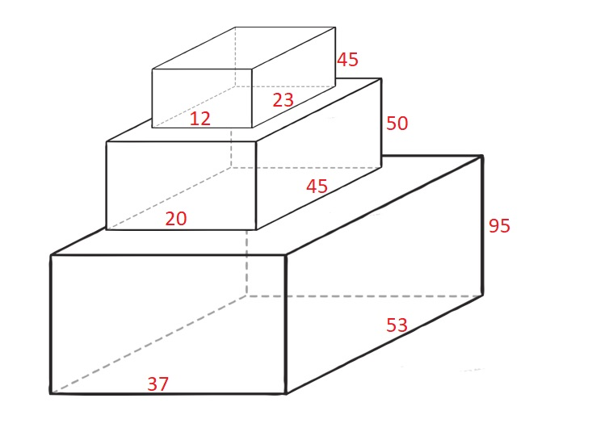

🔴🔁✅

### 11/12 [790. 多米诺和托米诺平铺](https://leetcode.cn/problems/domino-and-tromino-tiling/)🔴

> 有两种形状的瓷砖：一种是 `2 x 1` 的多米诺形，另一种是形如 "L" 的托米诺形。两种形状都可以旋转。
>
> 
>
> 给定整数 n ，返回可以平铺 `2 x n` 的面板的方法的数量。**返回对** `109 + 7` **取模** 的值。
>
> 平铺指的是每个正方形都必须有瓷砖覆盖。两个平铺不同，当且仅当面板上有四个方向上的相邻单元中的两个，使得恰好有一个平铺有一个瓷砖占据两个正方形。
>
> **示例 1:**
>
> 
>
> ```
> 输入: n = 3
> 输出: 5
> 解释: 五种不同的方法如上所示。
> ```
>
> **示例 2:**
>
> ```
> 输入: n = 1
> 输出: 1
> ```

### [805. 数组的均值分割](https://leetcode.cn/problems/split-array-with-same-average/)🔴

> 给定你一个整数数组 `nums`
>
> 我们要将 `nums` 数组中的每个元素移动到 `A` 数组 或者 `B` 数组中，使得 `A` 数组和 `B` 数组不为空，并且 `average(A) == average(B)` 。
>
> 如果可以完成则返回`true` ， 否则返回 `false` 。
>
> **注意：**对于数组 `arr` ,  `average(arr)` 是 `arr` 的所有元素除以 `arr` 长度的和。
>
> **示例 1:**
>
> ```
> 输入: nums = [1,2,3,4,5,6,7,8]
> 输出: true
> 解释: 我们可以将数组分割为 [1,4,5,8] 和 [2,3,6,7], 他们的平均值都是4.5。
> ```
>
> **示例 2:**
>
> ```
> 输入: nums = [3,1]
> 输出: false
> ```


### 11.15/[1710. 卡车上的最大单元数🔁✅](https://leetcode.cn/problems/maximum-units-on-a-truck/)

> 请你将一些箱子装在 **一辆卡车** 上。给你一个二维数组 `boxTypes` ，其中 `boxTypes[i] = [numberOfBoxesi, numberOfUnitsPerBoxi]` ：
>
> - `numberOfBoxesi` 是类型 `i` 的箱子的数量。
> - `numberOfUnitsPerBoxi` 是类型 `i` 每个箱子可以装载的单元数量。
>
> 整数 `truckSize` 表示卡车上可以装载 **箱子** 的 **最大数量** 。只要箱子数量不超过 `truckSize` ，你就可以选择任意箱子装到卡车上。
>
> 返回卡车可以装载 **单元** 的 **最大** 总数*。*
>
>  **示例 1：**
>
> ```
>输入：boxTypes = [[1,3],[2,2],[3,1]], truckSize = 4
> 输出：8
> 解释：箱子的情况如下：
> - 1 个第一类的箱子，里面含 3 个单元。
> - 2 个第二类的箱子，每个里面含 2 个单元。
> - 3 个第三类的箱子，每个里面含 1 个单元。
> 可以选择第一类和第二类的所有箱子，以及第三类的一个箱子。
> 单元总数 = (1 * 3) + (2 * 2) + (1 * 1) = 8
> ```

计数排序：很好的方法！

```java
class Solution {
    public int maximumUnits(int[][] boxTypes, int truckSize) {
        int count = 0;
		int[] ans = new int[1001];
		for (int[] is : boxTypes) {
			ans[is[1]] += is[0];
		}
		for (int i = ans.length - 1; i > 0; i--) {
			if (ans[i] != 0) {
				if (truckSize > ans[i]) {
					count += ans[i] * i;
					truckSize -= ans[i];
				} else {
					return count + truckSize * i;
				}
			}
		}
		return count;
    }
}
```

### 11.16/[775. 全局倒置与局部倒置🔴](https://leetcode.cn/problems/global-and-local-inversions/)

> 给你一个长度为 `n` 的整数数组 `nums` ，表示由范围 `[0, n - 1]` 内所有整数组成的一个排列。
>
> **全局倒置** 的数目等于满足下述条件不同下标对 `(i, j)` 的数目：
>
> - `0 <= i < j < n`
> - `nums[i] > nums[j]`
>
> **局部倒置** 的数目等于满足下述条件的下标 `i` 的数目：
>
> - `0 <= i < n - 1`
> - `nums[i] > nums[i + 1]`
>
> 当数组 `nums` 中 **全局倒置** 的数量等于 **局部倒置** 的数量时，返回 `true` ；否则，返回 `false` 。
>
> **示例 1：**
>
> ```
> 输入：nums = [1,0,2]
> 输出：true
> 解释：有 1 个全局倒置，和 1 个局部倒置。
> ```
>
> **示例 2：**
>
> ```
> 输入：nums = [1,2,0]
> 输出：false
> 解释：有 2 个全局倒置，和 1 个局部倒置。
> ```

```java
//维护后缀最小值
class Solution {
    public boolean isIdealPermutation(int[] nums) {
        int n = nums.length, minSuff = nums[n - 1];
        for (int i = n - 3; i >= 0; i--) {
            if (nums[i] > minSuff) {
                return false;
            }
            minSuff = Math.min(minSuff, nums[i + 1]);
        }
        return true;
    }
}
```


### [315. 计算右侧小于当前元素的个数](https://leetcode.cn/problems/count-of-smaller-numbers-after-self/)

> 给你一个整数数组 `nums` ，按要求返回一个新数组 `counts` 。数组 `counts` 有该性质： `counts[i]` 的值是 `nums[i]` 右侧小于 `nums[i]` 的元素的数量。
>
> **示例 1：**
>
> ```
> 输入：nums = [5,2,6,1]
> 输出：[2,1,1,0] 
> 解释：
> 5 的右侧有 2 个更小的元素 (2 和 1)
> 2 的右侧仅有 1 个更小的元素 (1)
> 6 的右侧有 1 个更小的元素 (1)
> 1 的右侧有 0 个更小的元素
> ```
>
> **示例 2：**
>
> ```
> 输入：nums = [-1]
> 输出：[0]
> ```
>
> **示例 3：**
>
> ```
> 输入：nums = [-1,-1]
> 输出：[0,0]
> ```

#### 二分法

#### 归并排序

#### 树状数组

[算法学习笔记(2) : 树状数组 - 知乎 (zhihu.com)](https://zhuanlan.zhihu.com/p/93795692)

​	BIT(Binary Index Tree)

#### 线段树

#### 二叉搜索树

### [11.17/792. 匹配子序列的单词数](https://leetcode.cn/problems/number-of-matching-subsequences/)

> 给定字符串 `s` 和字符串数组 `words`, 返回 *`words[i]` 中是`s`的子序列的单词个数* 。
>
> 字符串的 **子序列** 是从原始字符串中生成的新字符串，可以从中删去一些字符(可以是none)，而不改变其余字符的相对顺序。
>
> - 例如， `“ace”` 是 `“abcde”` 的子序列。
>
> **示例 1:**
>
> ```
> 输入: s = "abcde", words = ["a","bb","acd","ace"]
> 输出: 3
> 解释: 有三个是 s 的子序列的单词: "a", "acd", "ace"。
> ```
>
> **Example 2:**
>
> ```
> 输入: s = "dsahjpjauf", words = ["ahjpjau","ja","ahbwzgqnuk","tnmlanowax"]
> 输出: 2
> ```

二分 

```java
public int numMatchSubseq(String s,String[] words){
    List<Integer> pos[] = new List[26];//存26个字母的列表数组，每个下标存ArrayList
    char c[] = s.toCharArray();
    for(int i = 0;i<26;i++){
        pos[i] =new ArrayList<>();
        pos[i].add(-1);
    }
    for(int i = 0;i<c.length;i++){
        pos[c[i]-'a'].add(i);//每个字母出现的位置
    }
    int ans = words.length;
    for(int i =0;i<words.length;i++){
        int pre = -1;
        for(char ch:words[i].toCharArray()){5
            int next = nextPos(pos,pre,ch-'a');
            if(next==-1){
                ans--;break;
            }
            pre = next;
        }
    }
    return ans;
}

//二分查找
int nextPos(List<Integer> pos[],int idx ,int ch){
    if(pos[ch].get(pos[ch].size()-1)<=idx){return -1;}
        int l=0,r=pos[ch].size()-1;
        while(l<r){
            int mid=(l+r)>>1;
            if(pos[ch].get(mid)>idx){r=mid;}
            else{l=mid+1;}
            if(l==r-1){
                if(pos[ch].get(l)>idx){r=l;}
                break;
            }
        }
        return pos[ch].get(r);
}
```

```java
//next数组
class Solution {
    public int numMatchingSubseq(String s, String[] words) {
        char c[]=s.toCharArray();
        int next[][]=new int[c.length+1][26];
        int pos[]=new int[26];//每个字母第一次出现的位置，匹配符合贪心
        Arrays.fill(pos,-1);
        for(int i=0;i<=c.length;i++){Arrays.fill(next[i],-1);}
        for(int i=c.length-1;i>=0;i--){//倒叙
            pos[c[i]-'a']=i;
            for(int j=0;j<26;j++){next[i][j]=pos[j];}            
        }
        int ans=words.length;
        for(int i=0;i<words.length;i++){
            int pre=0;
            char c1[]=words[i].toCharArray();
            for(int j=0;j<c1.length;j++){
                pre=next[pre][c1[j]-'a'];
                if(pre<0){
                    ans--;
                    break;
                }
                pre++;
            }
        }
        return ans;
    }
}
```

### 392.判断子序列

DP做法:

预处理t中每一个字符下一次出现的位置

```java
int n = s.length(), m = t.length();
int[][] f = new int[m+1][26];
for(int i = 0;i<26;i++){
    f[m][i] = m;//初始化：第一次出现的位置为末尾
}


```

### [799. 香槟塔🔴](https://leetcode.cn/problems/champagne-tower/)

> 我们把玻璃杯摆成金字塔的形状，其中 **第一层** 有 `1` 个玻璃杯， **第二层** 有 `2` 个，依次类推到第 100 层，每个玻璃杯 (250ml) 将盛有香槟。
>
> 从顶层的第一个玻璃杯开始倾倒一些香槟，当顶层的杯子满了，任何溢出的香槟都会立刻等流量的流向左右两侧的玻璃杯。当左右两边的杯子也满了，就会等流量的流向它们左右两边的杯子，依次类推。（当最底层的玻璃杯满了，香槟会流到地板上）
>
> 例如，在倾倒一杯香槟后，最顶层的玻璃杯满了。倾倒了两杯香槟后，第二层的两个玻璃杯各自盛放一半的香槟。在倒三杯香槟后，第二层的香槟满了 - 此时总共有三个满的玻璃杯。在倒第四杯后，第三层中间的玻璃杯盛放了一半的香槟，他两边的玻璃杯各自盛放了四分之一的香槟，如下图所示。
>
> 
>
> 现在当倾倒了非负整数杯香槟后，返回第 `i` 行 `j` 个玻璃杯所盛放的香槟占玻璃杯容积的比例（ `i` 和 `j` 都从0开始）。
>
> ```
> 示例 1:
> 输入: poured(倾倒香槟总杯数) = 1, query_glass(杯子的位置数) = 1, query_row(行数) = 1
> 输出: 0.00000
> 解释: 我们在顶层（下标是（0，0））倒了一杯香槟后，没有溢出，因此所有在顶层以下的玻璃杯都是空的。
> 
> 示例 2:
> 输入: poured(倾倒香槟总杯数) = 2, query_glass(杯子的位置数) = 1, query_row(行数) = 1
> 输出: 0.50000
> 解释: 我们在顶层（下标是（0，0）倒了两杯香槟后，有一杯量的香槟将从顶层溢出，位于（1，0）的玻璃杯和（1，1）的玻璃杯平分了这一杯香槟，所以每个玻璃杯有一半的香槟。
> ```
>
> **示例 3:**
>
> ```
> 输入: poured = 100000009, query_row = 33, query_glass = 17
> 输出: 1.00000
> ```

模拟：将所有一次性倒入第一杯

```java
public double champagneTower(int poured, int query_row, int query_glass) {
    double[] row = {poured};//将所有一次性倒入第一杯
    for(int i= 1;i<=query_row;i++){
        double[] nextRow = new double[i+1];
        for(int j = 0;j<i;j++){
            double volume = row[j];
            if(volume>1){
                nextRow[j] +=(volume-1)/2;
                nextRow[j+1] += (volume-1)/2;
            }
        }
        row = nextRow;
    }
    return Math.min(1,row[query_glass]);
}
```

### [878. 第 N 个神奇数字🔁](https://leetcode.cn/problems/nth-magical-number/)

> 一个正整数如果能被 `a` 或 `b` 整除，那么它是神奇的。
>
> 给定三个整数 `n` , `a` , `b` ，返回第 `n` 个神奇的数字。因为答案可能很大，所以返回答案 **对** `109 + 7` **取模** 后的值。
>
> **示例 1：**
>
> ```
> 输入：n = 1, a = 2, b = 3
> 输出：2
> ```
>
> **示例 2：**
>
> ```
> 输入：n = 4, a = 2, b = 3
> 输出：6
> ```

```java
class Solution {
    public int nthMagicalNumber(int n, int a, int b) {
        // a、b有倍数关系，可直接O(1)内返回。
        if(a % b == 0)return nthMagicalNumber(n, b);
        if(b % a == 0)return nthMagicalNumber(n, a);

        //求a和b的最小公倍数p
        int p = a, i = 1;
        while(p * i % b != 0)i++;
        p = p * i;

        //二分查找，直到某个数之前恰好有n个神奇数字。
        long l = 1, r = (long)n * Math.min(a, b);
        while(l <= r){
            long m = l + (r - l)/2;
            // 求m之前的神奇数字的个数：a的倍数的数量，加上b的倍数的数量，再减去a和b的公倍数的数量
            if( m / a + m / b - m / p >= n)r = --m;
            else l = ++m;
        }
        
        return (int)(l%1000000007);
    }

    public int nthMagicalNumber(int n, int a) {
        return (int)((long)n * a % 1000000007);
    }
}
```

### [795. 区间子数组个数🔴🔴🔴🔴](https://leetcode.cn/problems/number-of-subarrays-with-bounded-maximum/)✅

> 给你一个整数数组 `nums` 和两个整数：`left` 及 `right` 。找出 `nums` 中连续、非空且其中最大元素在范围 `[left, right]` 内的子数组，并返回满足条件的子数组的个数。
>
> 生成的测试用例保证结果符合 **32-bit** 整数范围。
>
> **示例 1：**
>
> ```
> 输入：nums = [2,1,4,3], left = 2, right = 3
> 输出：3
> 解释：满足条件的三个子数组：[2], [2, 1], [3]
> ```
>
> **示例 2：**
>
> ```
> 输入：nums = [2,9,2,5,6], left = 2, right = 8
> 输出：7
> ```
>
> **提示：**
>
> - `1 <= nums.length <= 105`
> - `0 <= nums[i] <= 109`
> - `0 <= left <= right <= 109`

```java
class Solution {
    public int numSubarrayBoundedMax(int[] A, int L, int R) {
        // 最大元素满足大于等于L小于等于R的子数组个数 = 最大元素小于等于R的子数组个数 - 最大元素小于L的子数组个数
        return numSubarrayBoundedMax(A, R) - numSubarrayBoundedMax(A, L - 1);
    }

    private int numSubarrayBoundedMax(int[] A, int Max) {
        int res = 0;
        int numSubarry = 0;
        for (int num : A) {
            if (num <= Max) {
                numSubarry++;
                res += numSubarry;
            } else {
                numSubarry = 0;
            }
        }
        return res;
    }
}
```

```c++
class Solution {
public:
    int numSubarrayBoundedMax(vector<int>& A, int L, int R) {
        int j = -1, temp = 0, ans = 0;
        for(int i = 0; i < A.size(); i++) {
            if(A[i] > R)
                j = i;
            if(A[i] >= L)
                temp = i - j;
            ans += temp;
        }
        return ans;
    }
};
```

### [809. 情感丰富的文字](https://leetcode.cn/problems/expressive-words/)

> 有时候人们会用重复写一些字母来表示额外的感受，比如 `"hello" -> "heeellooo"`, `"hi" -> "hiii"`。我们将相邻字母都相同的一串字符定义为相同字母组，例如："h", "eee", "ll", "ooo"。
>
> 对于一个给定的字符串 S ，如果另一个单词能够通过将一些字母组扩张从而使其和 S 相同，我们将这个单词定义为可扩张的（stretchy）。扩张操作定义如下：选择一个字母组（包含字母 `c` ），然后往其中添加相同的字母 `c` 使其长度达到 3 或以上。
>
> 例如，以 "hello" 为例，我们可以对字母组 "o" 扩张得到 "hellooo"，但是无法以同样的方法得到 "helloo" 因为字母组 "oo" 长度小于 3。此外，我们可以进行另一种扩张 "ll" -> "lllll" 以获得 "helllllooo"。如果 `s = "helllllooo"`，那么查询词 "hello" 是可扩张的，因为可以对它执行这两种扩张操作使得 `query = "hello" -> "hellooo" -> "helllllooo" = s`。
>
> 输入一组查询单词，输出其中可扩张的单词数量。
>
> **示例：**
>
> ```
> 输入： 
> s = "heeellooo"
> words = ["hello", "hi", "helo"]
> 输出：1
> 解释：
> 我们能通过扩张 "hello" 的 "e" 和 "o" 来得到 "heeellooo"。
> 我们不能通过扩张 "helo" 来得到 "heeellooo" 因为 "ll" 的长度小于 3 。
> ```

```java
class Solution {
    public int expressiveWords(String s, String[] words) {
        int ans = 0;
        char[] arr1 = s.toCharArray();
        for (String word : words) ans += ok(arr1, word.toCharArray()) ? 1 : 0;
        return ans;
    }
    boolean ok(char[] arr1, char[] arr2) {  
        int p1 = 0, p2 = 0;
        while (p1 < arr1.length && p2 < arr2.length) { 
            int cnt1 = 0, cnt2 = 0;
            char c = arr1[p1];
            while (p1 < arr1.length && arr1[p1] == c) {p1++; cnt1++;}
            while (p2 < arr2.length && arr2[p2] == c) {p2++; cnt2++;} 
            if (cnt1 < cnt2 || (cnt1 > cnt2 && cnt1 < 3)) return false; 
        }
        return p1 == arr1.length && p2 == arr2.length;
    }
}
```

### [813. 最大平均值和的分组](https://leetcode.cn/problems/largest-sum-of-averages/)🔴

> 给定数组 `nums` 和一个整数 `k` 。我们将给定的数组 `nums` 分成 **最多** `k` 个相邻的非空子数组 。 **分数** 由每个子数组内的平均值的总和构成。
>
> 注意我们必须使用 `nums` 数组中的每一个数进行分组，并且分数不一定需要是整数。
>
> 返回我们所能得到的最大 **分数** 是多少。答案误差在 `10-6` 内被视为是正确的。
>
> **示例 1:**
>
> ```
> 输入: nums = [9,1,2,3,9], k = 3
> 输出: 20.00000
> 解释: 
> nums 的最优分组是[9], [1, 2, 3], [9]. 得到的分数是 9 + (1 + 2 + 3) / 3 + 9 = 20. 
> 我们也可以把 nums 分成[9, 1], [2], [3, 9]. 
> 这样的分组得到的分数为 5 + 2 + 6 = 13, 但不是最大值.
> ```
>
> **示例 2:**
>
> ```
> 输入: nums = [1,2,3,4,5,6,7], k = 4
> 输出: 20.50000
> ```

```java
class Solution {
    double negInf=-1e7;
    public double largestSumOfAverages(int[] nums, int k) {
        int n = nums.length;
        double[][] dp = new double[n+1][k+1];// dp[i][j] 表示前i项分成j组的最大平均和
        for(int i = 1;i<=n;i++){
            ans[i][0] = negInf;
            for(int j = 1;j<=k;j++){
                for(int p =0;p<i;p++){
                    double sum = 0;
                    for(int w =p;w<i;w++){// 计算 从p到i的子数组和
                        sum+=nums[w];
                    }
                    // ans[p][j-1]+sum/(i-p)表示： 0-p 分成j-1个组 + p-i一个组的平均值和
                    ans[i][j] = Math.max(ans[i][j],ans[p][j-1]+sum/(i-p));
                }
            }
        }
        return ans[n][k];
    }
}
```

前缀和优化：


```java
class Solution {
    public double largestSumOfAverages(int[] nums, int k) {
        int n = nums.length;
        double[] prefix = new double[n + 1];
        for (int i = 0; i < n; i++) {
            prefix[i + 1] = prefix[i] + nums[i];
        }
        double[][] dp = new double[n + 1][k + 1];
        for (int i = 1; i <= n; i++) {
            dp[i][1] = prefix[i] / i;
        }
        for (int j = 2; j <= k; j++) {
            for (int i = j; i <= n; i++) {
                for (int x = j - 1; x < i; x++) {  //这里x 从1 开始也行，耗时50%， 优化后87%
                    dp[i][j] = Math.max(dp[i][j], dp[x][j - 1] + (prefix[i] - prefix[x]) / (i - x));
                }
            }
        }
        return dp[n][k];
    }
}
```

### [895. 最大频率栈🔁](https://leetcode.cn/problems/maximum-frequency-stack/)✅

> 设计一个类似堆栈的数据结构，将元素推入堆栈，并从堆栈中弹出**出现频率**最高的元素。
>
> 实现 `FreqStack` 类:
>
> - `FreqStack()` 构造一个空的堆栈。
> - `void push(int val)` 将一个整数 `val` 压入栈顶。
> - int pop() 删除并返回堆栈中出现频率最高的元素。
>     - 如果出现频率最高的元素不只一个，则移除并返回最接近栈顶的元素。
>
> **示例 1：**
>
> ```
> 输入：
> ["FreqStack","push","push","push","push","push","push","pop","pop","pop","pop"],
> [[],[5],[7],[5],[7],[4],[5],[],[],[],[]]
> 输出：[null,null,null,null,null,null,null,5,7,5,4]
> 解释：
> FreqStack = new FreqStack();
> freqStack.push (5);//堆栈为 [5]
> freqStack.push (7);//堆栈是 [5,7]
> freqStack.push (5);//堆栈是 [5,7,5]
> freqStack.push (7);//堆栈是 [5,7,5,7]
> freqStack.push (4);//堆栈是 [5,7,5,7,4]
> freqStack.push (5);//堆栈是 [5,7,5,7,4,5]
> freqStack.pop ();//返回 5 ，因为 5 出现频率最高。堆栈变成 [5,7,5,7,4]。
> freqStack.pop ();//返回 7 ，因为 5 和 7 出现频率最高，但7最接近顶部。堆栈变成 [5,7,5,4]。
> freqStack.pop ();//返回 5 ，因为 5 出现频率最高。堆栈变成 [5,7,4]。
> freqStack.pop ();//返回 4 ，因为 4, 5 和 7 出现频率最高，但 4 是最接近顶部的。堆栈变成 [5,7]。
> ```
>
> **提示：**
>
> - `0 <= val <= 109`
> - `push` 和 `pop` 的操作数不大于 `2 * 104`。
> - 输入保证在调用 `pop` 之前堆栈中至少有一个元素。

```java
class FreqStack {
    private Map<Integer, Integer> freq; //记录每个元素出现次数
    private Map<Integer, Deque<Integer>> group; // 每个频率都有一个栈
    private int maxFreq;

    public FreqStack() {
        freq = new HashMap<Integer, Integer>();
        group = new HashMap<Integer, Deque<Integer>>();
        maxFreq = 0;
    }

    public void push(int val) {
        freq.put(val, freq.getOrDefault(val, 0) + 1);
        group.putIfAbsent(freq.get(val), new ArrayDeque<Integer>());
        group.get(freq.get(val)).push(val);
        maxFreq = Math.max(maxFreq, freq.get(val));
    }

    public int pop() {
        int val = group.get(maxFreq).peek();
        freq.put(val, freq.get(val) - 1);
        group.get(maxFreq).pop();
        if (group.get(maxFreq).isEmpty()) {
            maxFreq--;
        }
        return val;
    }
}
```

### [962. 最大宽度坡🔁](https://leetcode.cn/problems/maximum-width-ramp/)

> 给定一个整数数组 `A`，*坡*是元组 `(i, j)`，其中 `i < j` 且 `A[i] <= A[j]`。这样的坡的宽度为 `j - i`。
>
> 找出 `A` 中的坡的最大宽度，如果不存在，返回 0 。
>
> **示例 1：**
>
> ```
> 输入：[6,0,8,2,1,5]
> 输出：4
> 解释：
> 最大宽度的坡为 (i, j) = (1, 5): A[1] = 0 且 A[5] = 5.
> ```
>
> **示例 2：**
>
> ```
> 输入：[9,8,1,0,1,9,4,0,4,1]
> 输出：7
> 解释：
> 最大宽度的坡为 (i, j) = (2, 9): A[2] = 1 且 A[9] = 1.
> ```

```java
//单调栈
class Solution {
    public int maxWidthRamp(int[] A) {
        int n = A.length;
        int maxWidth = 0;
        Stack<Integer> stack = new Stack<>();
        for (int i=0;i<n;i++) {
            if (stack.isEmpty() || A[stack.peek()] > A[i]) {
                stack.push(i);
            }
        }
        for (int i=n-1;i>=0;i--) {
            while (!stack.isEmpty() && A[stack.peek()] <= A[i]) {
                int pos = stack.pop();
                maxWidth = Math.max(maxWidth, i - pos);
            }
        }
        return maxWidth;
    }
}

```

方法二：二分检索候选位置
思路

按照降序考虑 i ， 我们希望找到一个最大的 j 满足 A[j] >= A[i]（如果存在的话）。

因此，候选的 j 应该是降序的：如果存在 j1 < j2 并且 A[j1] <= A[j2] ，那么我们一定会选择 j2。

算法

我们使用列表记录这些候选的 j。举一个例子，当 A = [0,8,2,7,5]，对于 i = 0 的候选列表应该是 candidates = [(v=5, j=4), (v=7, j=3), (v=8, j=1)]。我们要时刻维护候选列表 candidates 按照索引值降序，对应值升序。

现在，我们可以使用二分检索的办法找到最大的索引 j 满足 A[j] >= A[i]：也就是列表中第一个满足 v >= A[i] 的那一项。

```java
import java.awt.Point;

class Solution {
    public int maxWidthRamp(int[] A) {
        int N = A.length;

        int ans = 0;
        List<Point> candidates = new ArrayList();
        candidates.add(new Point(A[N-1], N-1));

        // candidates: i's decreasing, by increasing value of A[i]
        for (int i = N-2; i >= 0; --i) {
            // Find largest j in candidates with A[j] >= A[i]
            int lo = 0, hi = candidates.size();
            while (lo < hi) {
                int mi = lo + (hi - lo) / 2;
                if (candidates.get(mi).x < A[i])
                    lo = mi + 1;
                else
                    hi = mi;
            }

            if (lo < candidates.size()) {
                int j = candidates.get(lo).y;
                ans = Math.max(ans, j - i);
            } else {
                candidates.add(new Point(A[i], i));
            }
        }
        return ans;
    }
}
```

### [1774. 最接近目标价格的甜点成本🔁](https://leetcode.cn/problems/closest-dessert-cost/)

> 你打算做甜点，现在需要购买配料。目前共有 `n` 种冰激凌基料和 `m` 种配料可供选购。而制作甜点需要遵循以下几条规则：
>
> - 必须选择 **一种** 冰激凌基料。
> - 可以添加 **一种或多种** 配料，也可以不添加任何配料。
> - 每种类型的配料 **最多两份** 。
>
> 给你以下三个输入：
>
> - `baseCosts` ，一个长度为 `n` 的整数数组，其中每个 `baseCosts[i]` 表示第 `i` 种冰激凌基料的价格。
> - `toppingCosts`，一个长度为 `m` 的整数数组，其中每个 `toppingCosts[i]` 表示 **一份** 第 `i` 种冰激凌配料的价格。
> - `target` ，一个整数，表示你制作甜点的目标价格。
>
> 你希望自己做的甜点总成本尽可能接近目标价格 `target` 。
>
> 返回最接近 `target` 的甜点成本。如果有多种方案，返回 **成本相对较低** 的一种。
>
> **示例 1：**
>
> ```
> 输入：baseCosts = [1,7], toppingCosts = [3,4], target = 10
> 输出：10
> 解释：考虑下面的方案组合（所有下标均从 0 开始）：
> - 选择 1 号基料：成本 7
> - 选择 1 份 0 号配料：成本 1 x 3 = 3
> - 选择 0 份 1 号配料：成本 0 x 4 = 0
> 总成本：7 + 3 + 0 = 10 。
> ```
>
> **示例 2：**
>
> ```
> 输入：baseCosts = [2,3], toppingCosts = [4,5,100], target = 18
> 输出：17
> 解释：考虑下面的方案组合（所有下标均从 0 开始）：
> - 选择 1 号基料：成本 3
> - 选择 1 份 0 号配料：成本 1 x 4 = 4
> - 选择 2 份 1 号配料：成本 2 x 5 = 10
> - 选择 0 份 2 号配料：成本 0 x 100 = 0
> 总成本：3 + 4 + 10 + 0 = 17 。不存在总成本为 18 的甜点制作方案。
> ```
>
> **示例 3：**
>
> ```
> 输入：baseCosts = [3,10], toppingCosts = [2,5], target = 9
> 输出：8
> 解释：可以制作总成本为 8 和 10 的甜点。返回 8 ，因为这是成本更低的方案。
> ```
>
> **示例 4：**
>
> ```
> 输入：baseCosts = [10], toppingCosts = [1], target = 1
> 输出：10
> 解释：注意，你可以选择不添加任何配料，但你必须选择一种基料。
> ```

```java
//回溯dfs
class Solution{
    int res;
    public int closestCost(int[] baseCosts,int[] toppingCosts,int target){
        res = Arrays.stream(baseCosts).min().getAsInt();//初始化res为base最小值
        for(int b:baseCosts){
            dfs(toppingCosts,0,b,target);//针对每个base求一次： b作为基准cost
        }
        return res;
    }
    
    public void dfs(int[] toppingCosts,int p,int curCost,int target){
        //结束条件：当前误差比答案误差大
        if(Math.abs(res-target)<(curCost-target)){
            return ;
        }else if(Math.abs(res-target)>=Math.abs(curCost-target)){
            if(Math.abs(res-target)>Math.abs(curCost-target)){
                res = curCost;
            }else{
                res= Math.min(res,curCost);
            }
        }
        if(p == toppingCost.length){//遍历完成
            return ;
        }
        
        dfs(toppingCost,p+1,curCost+toppingCost[p]*2,target); //最多两份配料      
        dfs(toppingCost,p+1,curCost+toppingCost[p],target); 
        dfs(toppingCost,p+1,curCost,target); 
    }
}
```

```java
//DP
class Solution {
    public int closestCost(int[] baseCosts, int[] toppingCosts, int target) {
        int x = Arrays.stream(baseCosts).min().getAsInt();
        if (x >= target) {
            return x;
        }
        boolean[] can = new boolean[target + 1];
        int res = 2 * target - x;
        for (int b : baseCosts) {
            if (b <= target) {
                can[b] = true;
            } else {
                res = Math.min(res, b);
            }
        }
        for (int t : toppingCosts) {
            for (int count = 0; count < 2; ++count) {
                for (int i = target; i > 0; --i) {
                    if (can[i] && i + t > target) {
                        res = Math.min(res, i + t);
                    }
                    if (i - t > 0) {
                        can[i] = can[i] | can[i - t];
                    }
                }
            }
        }
        for (int i = 0; i <= res - target; ++i) {
            if (can[target - i]) {
                return target - i;
            }
        }
        return res;
    }
}
```

```java
/**
     * 方法二：动态规划
     *
     * 冰淇淋基料最小值为min
     * 从方法一中已经知道，对于 大于 upper=2*target-min的方案，其与target的差值一定大于min与target的差值，可以直接废弃
     *
     * 那么我们可以通过 动态规划来判断是否存在成本在 [min, upper-1] 间的方案
     * 如果存在，从中选择 与target 差值最小的方案即可。
     *
     * base：
     *      因为基料必须选，所以初始时遍历 baseCosts，如果 baseCosts[i] < upper，让 dp[baseCosts[i]] = true
     * 接下来是在基料的基础上选择配料
     * 这里参考0-1背包的写法，假如辅料i的代价为x，在选择辅料i之前dp数组[a1,a2,a3]位置为true
     * 那么选择完辅料i后，dp[a1,a2,a3,a1+x,a2+x,a3+x,a1+2x,a2+2x,a3+2x]为true
     *
     * 也就是说对于辅料i的代价x
     *      遍历dp数组，对于 dp[i] = true，更新 dp[i + x] 为true， dp[i + 2x] 为 true
     * 对下一个辅料进行同样过程
     *
     * 【细节一】：
     *      dp数组必须倒序遍历
     *          对于每个辅料，假如顺序遍历dp
     *          dp[0]=true，更新dp[0+2x]=true， dp[0+x]=true
     *          那么当遍历到dp[x]时，又会更新dp[x+2x]为true，dp[x+x]=true，，？？？这相当于使用了3份辅料i，肯定不对，
     *          因此每次都需要倒序遍历dp
     * 【细节二】
     *      必须在 dp[i] 为 true 的情况下，更新 dp[i + x] 和 dp[i + 2x] 为true
     *      因为 只有方案i存在，那么方案i+x才会存在
     * 【细节三】
     *      因为我们只需要考虑成本在 [min, upper-1] 间的方案，因此对于此范围外的方案一律不用考虑
     * @param baseCosts
     * @param toppingCosts
     * @param target
     * @return
     */
    public int closestCost2(int[] baseCosts, int[] toppingCosts, int target) {
        // 冰淇淋基料的最小值min，
        int min = Arrays.stream(baseCosts).min().getAsInt();
        // 其他任何方案成本只会比min更大，与target的插值更大，此时直接返回min
        if (min >= target) {
            return min;
        }
        // 只需要考虑成本在 [min, upper-1] 间的方案是否存在
        int upper = 2 * target - min;
        boolean[] dp = new boolean[upper];
        // base，基料必选
        for (int baseCost : baseCosts) {
            // 不考虑区间外的方案
            if (baseCost < upper) {
                dp[baseCost] = true;
            }
        }
        // dp迭代，在基料的基础上选择辅料
        for (int toppingCost : toppingCosts) {
            // 倒序遍历dp
            for (int j = upper - 1; j >= min; --j) {
                // 每种辅料可以1份或两份，更新对应的dp为true，区间外不予考虑
                if (dp[j] && (j + toppingCost < upper)) {
                    dp[j + toppingCost] = true;
                }
                if (dp[j] && (j + 2 * toppingCost < upper)) {
                    dp[j + 2 * toppingCost] = true;
                }
            }
        }
        // 在 [min, upper-1]所有存在的方案种找出与target最接近的方案
        int ans = min;
        for (int i = min + 1; i < upper; ++i) {
            if (dp[i]) {
                // 更接近
                if (Math.abs(i - target) < Math.abs(ans - target)) {
                    ans = i;
                // 同样接近，选择更小成本
                } else if (Math.abs(i - target) == Math.abs(ans - target)) {
                    ans = Math.min(ans, i);
                }
            }
        }
        return ans;
    }
```

### [1687. 从仓库到码头运输箱子](https://leetcode.cn/problems/delivering-boxes-from-storage-to-ports/)

> 你有一辆货运卡车，你需要用这一辆车把一些箱子从仓库运送到码头。这辆卡车每次运输有 **箱子数目的限制** 和 **总重量的限制** 。
>
> 给你一个箱子数组 `boxes` 和三个整数 `portsCount`, `maxBoxes` 和 `maxWeight` ，其中 `boxes[i] = [portsi, weighti]` 。
>
> - `portsi` 表示第 `i` 个箱子需要送达的码头， `weightsi` 是第 `i` 个箱子的重量。
> - `portsCount` 是码头的数目。
> - `maxBoxes` 和 `maxWeight` 分别是卡车每趟运输箱子数目和重量的限制。
>
> 箱子需要按照 **数组顺序** 运输，同时每次运输需要遵循以下步骤：
>
> - 卡车从 `boxes` 队列中按顺序取出若干个箱子，但不能违反 `maxBoxes` 和 `maxWeight` 限制。
> - 对于在卡车上的箱子，我们需要 **按顺序** 处理它们，卡车会通过 **一趟行程** 将最前面的箱子送到目的地码头并卸货。如果卡车已经在对应的码头，那么不需要 **额外行程** ，箱子也会立马被卸货。
> - 卡车上所有箱子都被卸货后，卡车需要 **一趟行程** 回到仓库，从箱子队列里再取出一些箱子。
>
> 卡车在将所有箱子运输并卸货后，最后必须回到仓库。
>
> 请你返回将所有箱子送到相应码头的 **最少行程** 次数。
>
> **示例 1：**
>
> ```
> 输入：boxes = [[1,1],[2,1],[1,1]], portsCount = 2, maxBoxes = 3, maxWeight = 3
> 输出：4
> 解释：最优策略如下：
> - 卡车将所有箱子装上车，到达码头 1 ，然后去码头 2 ，然后再回到码头 1 ，最后回到仓库，总共需要 4 趟行程。
> 所以总行程数为 4 。
> 注意到第一个和第三个箱子不能同时被卸货，因为箱子需要按顺序处理（也就是第二个箱子需要先被送到码头 2 ，然后才能处理第三个箱子）。
> ```
>
> **示例 2：**
>
> ```
> 输入：boxes = [[1,2],[3,3],[3,1],[3,1],[2,4]], portsCount = 3, maxBoxes = 3, maxWeight = 6
> 输出：6
> 解释：最优策略如下：
> - 卡车首先运输第一个箱子，到达码头 1 ，然后回到仓库，总共 2 趟行程。
> - 卡车运输第二、第三、第四个箱子，到达码头 3 ，然后回到仓库，总共 2 趟行程。
> - 卡车运输第五个箱子，到达码头 3 ，回到仓库，总共 2 趟行程。
> 总行程数为 2 + 2 + 2 = 6 。
> ```
>
> **示例 3：**
>
> ```
> 输入：boxes = [[1,4],[1,2],[2,1],[2,1],[3,2],[3,4]], portsCount = 3, maxBoxes = 6, maxWeight = 7
> 输出：6
> 解释：最优策略如下：
> - 卡车运输第一和第二个箱子，到达码头 1 ，然后回到仓库，总共 2 趟行程。
> - 卡车运输第三和第四个箱子，到达码头 2 ，然后回到仓库，总共 2 趟行程。
> - 卡车运输第五和第六个箱子，到达码头 3 ，然后回到仓库，总共 2 趟行程。
> 总行程数为 2 + 2 + 2 = 6 。
> ```
>
> **示例 4：**
>
> ```
> 输入：boxes = [[2,4],[2,5],[3,1],[3,2],[3,7],[3,1],[4,4],[1,3],[5,2]], portsCount = 5, maxBoxes = 5, maxWeight = 7
> 输出：14
> 解释：最优策略如下：
> - 卡车运输第一个箱子，到达码头 2 ，然后回到仓库，总共 2 趟行程。
> - 卡车运输第二个箱子，到达码头 2 ，然后回到仓库，总共 2 趟行程。
> - 卡车运输第三和第四个箱子，到达码头 3 ，然后回到仓库，总共 2 趟行程。
> - 卡车运输第五个箱子，到达码头 3 ，然后回到仓库，总共 2 趟行程。
> - 卡车运输第六和第七个箱子，到达码头 3 ，然后去码头 4 ，然后回到仓库，总共 3 趟行程。
> - 卡车运输第八和第九个箱子，到达码头 1 ，然后去码头 5 ，然后回到仓库，总共 3 趟行程。
> 总行程数为 2 + 2 + 2 + 2 + 3 + 3 = 14 。
> ```
>
> **提示：**
>
> - `1 <= boxes.length <= 105`
> - `1 <= portsCount, maxBoxes, maxWeight <= 105`
> - `1 <= portsi <= portsCount`
> - `1 <= weightsi <= maxWeight`


### [1805. 字符串中不同整数的数目](https://leetcode.cn/problems/number-of-different-integers-in-a-string/)

> 给你一个字符串 `word` ，该字符串由数字和小写英文字母组成。
>
> 请你用空格替换每个不是数字的字符。例如，`"a123bc34d8ef34"` 将会变成 `" 123 34 8 34"` 。注意，剩下的这些整数为（相邻彼此至少有一个空格隔开）：`"123"`、`"34"`、`"8"` 和 `"34"` 。
>
> 返回对 `word` 完成替换后形成的 **不同** 整数的数目。
>
> 只有当两个整数的 **不含前导零** 的十进制表示不同， 才认为这两个整数也不同。
>
> **示例 1：**
>
> ```
> 输入：word = "a123bc34d8ef34"
> 输出：3
> 解释：不同的整数有 "123"、"34" 和 "8" 。注意，"34" 只计数一次。
> ```

```Java
class Solution {
    public int numDifferentIntegers(String word) {
        return Arrays.stream(word.replaceAll("[^0-9]", " ").trim().split("\\s+"))
            .filter(s -> !s.isEmpty())
            .map(s -> s.replaceFirst("\\b0+", ""))
            .collect(Collectors.toSet())
            .size();
    }
}
```


### [1775. 通过最少操作次数使数组的和相等](https://leetcode.cn/problems/equal-sum-arrays-with-minimum-number-of-operations/)

> 给你两个长度可能不等的整数数组 `nums1` 和 `nums2` 。两个数组中的所有值都在 `1` 到 `6` 之间（包含 `1` 和 `6`）。
>
> 每次操作中，你可以选择 **任意** 数组中的任意一个整数，将它变成 `1` 到 `6` 之间 **任意** 的值（包含 `1` 和 `6`）。
>
> 请你返回使 `nums1` 中所有数的和与 `nums2` 中所有数的和相等的最少操作次数。如果无法使两个数组的和相等，请返回 `-1` 。
>
> **示例 1：**
>
> ```
> 输入：nums1 = [1,2,3,4,5,6], nums2 = [1,1,2,2,2,2]
> 输出：3
> 解释：你可以通过 3 次操作使 nums1 中所有数的和与 nums2 中所有数的和相等。以下数组下标都从 0 开始。
> - 将 nums2[0] 变为 6 。 nums1 = [1,2,3,4,5,6], nums2 = [6,1,2,2,2,2] 。
> - 将 nums1[5] 变为 1 。 nums1 = [1,2,3,4,5,1], nums2 = [6,1,2,2,2,2] 。
> - 将 nums1[2] 变为 2 。 nums1 = [1,2,2,4,5,1], nums2 = [6,1,2,2,2,2] 。
> ```
>
> **示例 2：**
>
> ```
> 输入：nums1 = [1,1,1,1,1,1,1], nums2 = [6]
> 输出：-1
> 解释：没有办法减少 nums1 的和或者增加 nums2 的和使二者相等。
> ```
>
> **示例 3：**
>
> ```
> 输入：nums1 = [6,6], nums2 = [1]
> 输出：3
> 解释：你可以通过 3 次操作使 nums1 中所有数的和与 nums2 中所有数的和相等。以下数组下标都从 0 开始。
> - 将 nums1[0] 变为 2 。 nums1 = [2,6], nums2 = [1] 。
> - 将 nums1[1] 变为 2 。 nums1 = [2,2], nums2 = [1] 。
> - 将 nums2[0] 变为 4 。 nums1 = [2,2], nums2 = [4] 。
> ```


### [1780. 判断一个数字是否可以表示成三的幂的和](https://leetcode.cn/problems/check-if-number-is-a-sum-of-powers-of-three/)🔁

> 给你一个整数 `n` ，如果你可以将 `n` 表示成若干个不同的三的幂之和，请你返回 `true` ，否则请返回 `false` 。
>
> 对于一个整数 `y` ，如果存在整数 `x` 满足 `y == 3^x` ，我们称这个整数 `y` 是三的幂。
>
> **示例 1：**
>
> ```
> 输入：n = 12
> 输出：true
> 解释：12 = 3^1 + 3^2
> ```
>
> **示例 2：**
>
> ```
> 输入：n = 91
> 输出：true
> 解释：91 = 3^0 + 3^2 + 3^4
> ```
>
> **示例 3：**
>
> ```
> 输入：n = 21
> 输出：false
> ```

```java
//转换为三进制后，只有0和1没有2（这是要注意的点）
class Solution {
    public boolean checkPowersOfThree(int n) {
        while (n > 0) {
            if (n % 3 == 2) {
                return false;
            }
            n /= 3;
        }
        return true;
    }
}
```


### [354. 俄罗斯套娃信封问题](https://leetcode.cn/problems/russian-doll-envelopes/)

> 给你一个二维整数数组 `envelopes` ，其中 `envelopes[i] = [wi, hi]` ，表示第 `i` 个信封的宽度和高度。
>
> 当另一个信封的宽度和高度都比这个信封大的时候，这个信封就可以放进另一个信封里，如同俄罗斯套娃一样。
>
> 请计算 **最多能有多少个** 信封能组成一组“俄罗斯套娃”信封（即可以把一个信封放到另一个信封里面）。
>
> **注意**：不允许旋转信封。
>
> **示例 1：**
>
> ```
> 输入：envelopes = [[5,4],[6,4],[6,7],[2,3]]
> 输出：3
> 解释：最多信封的个数为 3, 组合为: [2,3] => [5,4] => [6,7]。
> ```
>
> **示例 2：**
>
> ```
> 输入：envelopes = [[1,1],[1,1],[1,1]]
> 输出：1
> ```

先学会300.最长递增子序列的O(N^2)和O(NlogN)的解法 

#### [300. 最长递增子序列🔴](https://leetcode.cn/problems/longest-increasing-subsequence/)

> 给你一个整数数组 `nums` ，找到其中最长严格递增子序列的长度。
>
> **子序列** 是由数组派生而来的序列，删除（或不删除）数组中的元素而不改变其余元素的顺序。例如，`[3,6,2,7]` 是数组 `[0,3,1,6,2,2,7]` 的子序列。
>
> **示例 1：**
>
> ```
> 输入：nums = [10,9,2,5,3,7,101,18]
> 输出：4
> 解释：最长递增子序列是 [2,3,7,101]，因此长度为 4 。
> ```
>
> **示例 2：**
>
> ```
> 输入：nums = [0,1,0,3,2,3]
> 输出：4
> ```
>
> **示例 3：**
>
> ```
> 输入：nums = [7,7,7,7,7,7,7]
> 输出：1
> ```

```java
//Dp解法：双重循环遍历，dp[j] = Math.max(dp[j],dp[i]+1);，然后再取dp中最大值。
```

```java
//二分查找
class Solution {
    public int lengthOfLIS(int[] nums) {
        /**
        dp[i]: 所有长度为i+1的递增子序列中, 最小的那个序列尾数.
        由定义知dp数组必然是一个递增数组, 可以用 maxL 来表示最长递增子序列的长度. 
        对数组进行迭代, 依次判断每个数num将其插入dp数组相应的位置:
        1. num > dp[maxL], 表示num比所有已知递增序列的尾数都大, 将num添加入dp
           数组尾部, 并将最长递增序列长度maxL加1
        2. dp[i-1] < num <= dp[i], 只更新相应的dp[i]
        **/
        int maxL = 0;
        int[] dp = new int[nums.length];
        for(int num : nums) {
            // 二分法查找, 也可以调用库函数如binary_search
            int lo = 0, hi = maxL;
            while(lo < hi) {
                int mid = lo+(hi-lo)/2;
                if(dp[mid] < num)
                    lo = mid+1;
                else
                    hi = mid;
            }
            dp[lo] = num;
            if(lo == maxL)
                maxL++;
        }
        return maxL;
    }
}
```


### [1691. 堆叠长方体的最大高度](https://leetcode.cn/problems/maximum-height-by-stacking-cuboids/)

> 给你 `n` 个长方体 `cuboids` ，其中第 `i` 个长方体的长宽高表示为 `cuboids[i] = [widthi, lengthi, heighti]`（**下标从 0 开始**）。请你从 `cuboids` 选出一个 **子集** ，并将它们堆叠起来。
>
> 如果 `widthi <= widthj` 且 `lengthi <= lengthj` 且 `heighti <= heightj` ，你就可以将长方体 `i` 堆叠在长方体 `j` 上。你可以通过旋转把长方体的长宽高重新排列，以将它放在另一个长方体上。
>
> 返回 **堆叠长方体** `cuboids` 可以得到的 **最大高度** 。
>
> **示例 1：**
>
> ****
>
> ```
> 输入：cuboids = [[50,45,20],[95,37,53],[45,23,12]]
> 输出：190
> 解释：
> 第 1 个长方体放在底部，53x37 的一面朝下，高度为 95 。
> 第 0 个长方体放在中间，45x20 的一面朝下，高度为 50 。
> 第 2 个长方体放在上面，23x12 的一面朝下，高度为 45 。
> 总高度是 95 + 50 + 45 = 190 。
> ```
>
> **示例 2：**
>
> ```
> 输入：cuboids = [[38,25,45],[76,35,3]]
> 输出：76
> 解释：
> 无法将任何长方体放在另一个上面。
> 选择第 1 个长方体然后旋转它，使 35x3 的一面朝下，其高度为 76 。
> ```
>
> **示例 3：**
>
> ```
> 输入：cuboids = [[7,11,17],[7,17,11],[11,7,17],[11,17,7],[17,7,11],[17,11,7]]
> 输出：102
> 解释：
> 重新排列长方体后，可以看到所有长方体的尺寸都相同。
> 你可以把 11x7 的一面朝下，这样它们的高度就是 17 。
> 堆叠长方体的最大高度为 6 * 17 = 102 。
> ```


```java
//1832给你一个仅由小写英文字母组成的字符串 sentence ，请你判断 sentence 是否为 全字母句 。如果是，返回 true ；否则，返回 false 。

class Solution {
    public boolean checkIfPangram(String sentence) {
        int bits = 0;
        for (char s: sentence.toCharArray()){
            bits |= (1<<(s-'a'));
        }
        return bits==0x3ffffff; //26个1
    }
}
```

### [1697. 检查边长度限制的路径是否存在](https://leetcode.cn/problems/checking-existence-of-edge-length-limited-paths/)

> 给你一个 `n` 个点组成的无向图边集 `edgeList` ，其中 `edgeList[i] = [ui, vi, disi]` 表示点 `ui` 和点 `vi` 之间有一条长度为 `disi` 的边。请注意，两个点之间可能有 **超过一条边** 。
>
> 给你一个查询数组`queries` ，其中 `queries[j] = [pj, qj, limitj]` ，你的任务是对于每个查询 `queries[j]` ，判断是否存在从 `pj` 到 `qj` 的路径，且这条路径上的每一条边都 **严格小于** `limitj` 。
>
> 请你返回一个 **布尔数组** `answer` ，其中 `answer.length == queries.length` ，当 `queries[j]` 的查询结果为 `true` 时， `answer` 第 `j` 个值为 `true` ，否则为 `false` 。
>
> **示例 1：**
>
> 
>
> ```
> 输入：n = 3, edgeList = [[0,1,2],[1,2,4],[2,0,8],[1,0,16]], queries = [[0,1,2],[0,2,5]]
> 输出：[false,true]
> 解释：上图为给定的输入数据。注意到 0 和 1 之间有两条重边，分别为 2 和 16 。
> 对于第一个查询，0 和 1 之间没有小于 2 的边，所以我们返回 false 。
> 对于第二个查询，有一条路径（0 -> 1 -> 2）两条边都小于 5 ，所以这个查询我们返回 true 。
> ```
>
> **示例 2：**
>
> 
>
> ```
> 输入：n = 5, edgeList = [[0,1,10],[1,2,5],[2,3,9],[3,4,13]], queries = [[0,4,14],[1,4,13]]
> 输出：[true,false]
> 解释：上图为给定数据。
> ```


### [1764. 通过连接另一个数组的子数组得到一个数组](https://leetcode.cn/problems/form-array-by-concatenating-subarrays-of-another-array/)

> 给你一个长度为 `n` 的二维整数数组 `groups` ，同时给你一个整数数组 `nums` 。
>
> 你是否可以从 `nums` 中选出 `n` 个 **不相交** 的子数组，使得第 `i` 个子数组与 `groups[i]` （下标从 **0** 开始）完全相同，且如果 `i > 0` ，那么第 `(i-1)` 个子数组在 `nums` 中出现的位置在第 `i` 个子数组前面。（也就是说，这些子数组在 `nums` 中出现的顺序需要与 `groups` 顺序相同）
>
> 如果你可以找出这样的 `n` 个子数组，请你返回 `true` ，否则返回 `false` 。
>
> 如果不存在下标为 `k` 的元素 `nums[k]` 属于不止一个子数组，就称这些子数组是 **不相交** 的。子数组指的是原数组中连续元素组成的一个序列。
>
> **示例 1：**
>
> ```
> 输入：groups = [[1,-1,-1],[3,-2,0]], nums = [1,-1,0,1,-1,-1,3,-2,0]
> 输出：true
> 解释：你可以分别在 nums 中选出第 0 个子数组 [1,-1,0,1,-1,-1,3,-2,0] 和第 1 个子数组 [1,-1,0,1,-1,-1,3,-2,0] 。
> 这两个子数组是不相交的，因为它们没有任何共同的元素。
> ```
>
> **示例 2：**
>
> ```
> 输入：groups = [[10,-2],[1,2,3,4]], nums = [1,2,3,4,10,-2]
> 输出：false
> 解释：选择子数组 [1,2,3,4,10,-2] 和 [1,2,3,4,10,-2] 是不正确的，因为它们出现的顺序与 groups 中顺序不同。
> [10,-2] 必须出现在 [1,2,3,4] 之前。
> ```
>
> **示例 3：**
>
> ```
> 输入：groups = [[1,2,3],[3,4]], nums = [7,7,1,2,3,4,7,7]
> 输出：false
> 解释：选择子数组 [7,7,1,2,3,4,7,7] 和 [7,7,1,2,3,4,7,7] 是不正确的，因为它们不是不相交子数组。
> 它们有一个共同的元素 nums[4] （下标从 0 开始）。
> ```


### [1760. 袋子里最少数目的球](https://leetcode.cn/problems/minimum-limit-of-balls-in-a-bag/)

> 难度中等181收藏分享切换为英文接收动态反馈
>
> 给你一个整数数组 `nums` ，其中 `nums[i]` 表示第 `i` 个袋子里球的数目。同时给你一个整数 `maxOperations` 。
>
> 你可以进行如下操作至多 `maxOperations` 次：
>
> - 选择任意一个袋子，并将袋子里的球分到 2 个新的袋子中，每个袋子里都有正整数 个球。
>     - 比方说，一个袋子里有 `5` 个球，你可以把它们分到两个新袋子里，分别有 `1` 个和 `4` 个球，或者分别有 `2` 个和 `3` 个球。
>
> 你的开销是单个袋子里球数目的 **最大值** ，你想要 **最小化** 开销。
>
> 请你返回进行上述操作后的最小开销。
>
> **示例 1：**
>
> ```
> 输入：nums = [9], maxOperations = 2
> 输出：3
> 解释：
> - 将装有 9 个球的袋子分成装有 6 个和 3 个球的袋子。[9] -> [6,3] 。
> - 将装有 6 个球的袋子分成装有 3 个和 3 个球的袋子。[6,3] -> [3,3,3] 。
> 装有最多球的袋子里装有 3 个球，所以开销为 3 并返回 3 。
> ```
>
> **示例 2：**
>
> ```
> 输入：nums = [2,4,8,2], maxOperations = 4
> 输出：2
> 解释：
> - 将装有 8 个球的袋子分成装有 4 个和 4 个球的袋子。[2,4,8,2] -> [2,4,4,4,2] 。
> - 将装有 4 个球的袋子分成装有 2 个和 2 个球的袋子。[2,4,4,4,2] -> [2,2,2,4,4,2] 。
> - 将装有 4 个球的袋子分成装有 2 个和 2 个球的袋子。[2,2,2,4,4,2] -> [2,2,2,2,2,4,2] 。
> - 将装有 4 个球的袋子分成装有 2 个和 2 个球的袋子。[2,2,2,2,2,4,2] -> [2,2,2,2,2,2,2,2] 。
> 装有最多球的袋子里装有 2 个球，所以开销为 2 并返回 2 。
> ```
>
> **示例 3：**
>
> ```
> 输入：nums = [7,17], maxOperations = 2
> 输出：7
> ```

```java
//二分
class Solution {
    public int minimumSize(int[] nums, int maxOperations) {
        int left = 1, right = Arrays.stream(nums).max().getAsInt();
        int ans = 0;
        while (left <= right) {
            int y = (left + right) / 2;
            long ops = 0;
            for (int x : nums) {
                ops += (x - 1) / y;
            }
            if (ops <= maxOperations) {
                ans = y;
                right = y - 1;
            } else {
                left = y + 1;
            }
        }
        return ans;
    }
}
```

### [1604. 警告一小时内使用相同员工卡大于等于三次的人](https://leetcode.cn/problems/alert-using-same-key-card-three-or-more-times-in-a-one-hour-period/)

> 力扣公司的员工都使用员工卡来开办公室的门。每当一个员工使用一次他的员工卡，安保系统会记录下员工的名字和使用时间。如果一个员工在一小时时间内使用员工卡的次数大于等于三次，这个系统会自动发布一个 **警告** 。
>
> 给你字符串数组 `keyName` 和 `keyTime` ，其中 `[keyName[i], keyTime[i]]` 对应一个人的名字和他在 **某一天** 内使用员工卡的时间。
>
> 使用时间的格式是 **24小时制** ，形如 **"HH:MM"** ，比方说 `"23:51"` 和 `"09:49"` 。
>
> 请你返回去重后的收到系统警告的员工名字，将它们按 **字典序****升序** 排序后返回。
>
> 请注意 `"10:00"` - `"11:00"` 视为一个小时时间范围内，而 `"23:51"` - `"00:10"` 不被视为一小时内，因为系统记录的是某一天内的使用情况。
>
>  
>
> **示例 1：**
>
> ```
> 输入：keyName = ["daniel","daniel","daniel","luis","luis","luis","luis"], keyTime = ["10:00","10:40","11:00","09:00","11:00","13:00","15:00"]
> 输出：["daniel"]
> 解释："daniel" 在一小时内使用了 3 次员工卡（"10:00"，"10:40"，"11:00"）。
> ```

```java
class Solution {
    public List<String> alertNames(String[] keyName, String[] keyTime) {
       HashMap<String, List<String>> map = new HashMap<>();
       int n = keyName.length;
       for(int i = 0;i<n;i++){
           List<String> timeList = map.getOrDefault(keyName[i],new LinkedList<>());
           timeList.add(keyTime[i]);
           map.put(keyName[i],timeList);
       }
       List<String> ans = new LinkedList<>();
       //取出map的键值对
       for(Map.Entry<String,List<String>> entry:map.entrySet()){
           String name = entry.getKey();
           List<String> timeList = entry.getValue();
           //对时间 List 排序
           timeList.sort((o1,o2)->o1.compareTo(o2));
           //滑动窗口 
           for(int i = 2;i<timeList.size();i++){
               long t1 = convertTimeToLong(timeList.get(i));
               long t2 = convertTimeToLong(timeList.get(i-2));
               if(t1-t2<=60){
                   ans.add(name);break;
               }
           }
       }
       ans.sort((o1,o2)->o1.compareTo(o2));
       return ans;
    }
    public long convertTimeToLong(String time){
        String[] t = time.split(":");
        return Long.parseLong(t[0])*60+Long.parseLong(t[1]);
    }
}
```

