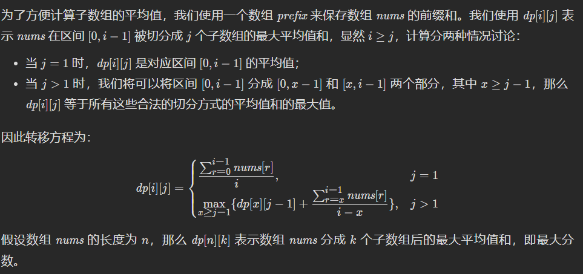

🔴🔁✅

### 11/12 [790. 多米诺和托米诺平铺](https://leetcode.cn/problems/domino-and-tromino-tiling/)🔴

> 有两种形状的瓷砖：一种是 `2 x 1` 的多米诺形，另一种是形如 "L" 的托米诺形。两种形状都可以旋转。
>
> 
>
> 给定整数 n ，返回可以平铺 `2 x n` 的面板的方法的数量。**返回对** `109 + 7` **取模** 的值。
>
> 平铺指的是每个正方形都必须有瓷砖覆盖。两个平铺不同，当且仅当面板上有四个方向上的相邻单元中的两个，使得恰好有一个平铺有一个瓷砖占据两个正方形。
>
> **示例 1:**
>
> 
>
> ```
> 输入: n = 3
> 输出: 5
> 解释: 五种不同的方法如上所示。
> ```
>
> **示例 2:**
>
> ```
> 输入: n = 1
> 输出: 1
> ```

### [805. 数组的均值分割](https://leetcode.cn/problems/split-array-with-same-average/)🔴

> 给定你一个整数数组 `nums`
>
> 我们要将 `nums` 数组中的每个元素移动到 `A` 数组 或者 `B` 数组中，使得 `A` 数组和 `B` 数组不为空，并且 `average(A) == average(B)` 。
>
> 如果可以完成则返回`true` ， 否则返回 `false` 。
>
> **注意：**对于数组 `arr` ,  `average(arr)` 是 `arr` 的所有元素除以 `arr` 长度的和。
>
> **示例 1:**
>
> ```
> 输入: nums = [1,2,3,4,5,6,7,8]
> 输出: true
> 解释: 我们可以将数组分割为 [1,4,5,8] 和 [2,3,6,7], 他们的平均值都是4.5。
> ```
>
> **示例 2:**
>
> ```
> 输入: nums = [3,1]
> 输出: false
> ```

### 11.15/[1710. 卡车上的最大单元数🔁](https://leetcode.cn/problems/maximum-units-on-a-truck/)

> 请你将一些箱子装在 **一辆卡车** 上。给你一个二维数组 `boxTypes` ，其中 `boxTypes[i] = [numberOfBoxesi, numberOfUnitsPerBoxi]` ：
>
> - `numberOfBoxesi` 是类型 `i` 的箱子的数量。
> - `numberOfUnitsPerBoxi` 是类型 `i` 每个箱子可以装载的单元数量。
>
> 整数 `truckSize` 表示卡车上可以装载 **箱子** 的 **最大数量** 。只要箱子数量不超过 `truckSize` ，你就可以选择任意箱子装到卡车上。
>
> 返回卡车可以装载 **单元** 的 **最大** 总数*。*
>
>  
>
> **示例 1：**
>
> ```
> 输入：boxTypes = [[1,3],[2,2],[3,1]], truckSize = 4
> 输出：8
> 解释：箱子的情况如下：
> - 1 个第一类的箱子，里面含 3 个单元。
> - 2 个第二类的箱子，每个里面含 2 个单元。
> - 3 个第三类的箱子，每个里面含 1 个单元。
> 可以选择第一类和第二类的所有箱子，以及第三类的一个箱子。
> 单元总数 = (1 * 3) + (2 * 2) + (1 * 1) = 8
> ```

计数排序：很好的方法！

```java
class Solution {
    public int maximumUnits(int[][] boxTypes, int truckSize) {
        int count = 0;
		int[] ans = new int[1001];
		for (int[] is : boxTypes) {
			ans[is[1]] += is[0];
		}
		for (int i = ans.length - 1; i > 0; i--) {
			if (ans[i] != 0) {
				if (truckSize > ans[i]) {
					count += ans[i] * i;
					truckSize -= ans[i];
				} else {
					return count + truckSize * i;
				}
			}
		}
		return count;
    }
}
```

### 11.16/[775. 全局倒置与局部倒置🔴](https://leetcode.cn/problems/global-and-local-inversions/)

> 给你一个长度为 `n` 的整数数组 `nums` ，表示由范围 `[0, n - 1]` 内所有整数组成的一个排列。
>
> **全局倒置** 的数目等于满足下述条件不同下标对 `(i, j)` 的数目：
>
> - `0 <= i < j < n`
> - `nums[i] > nums[j]`
>
> **局部倒置** 的数目等于满足下述条件的下标 `i` 的数目：
>
> - `0 <= i < n - 1`
> - `nums[i] > nums[i + 1]`
>
> 当数组 `nums` 中 **全局倒置** 的数量等于 **局部倒置** 的数量时，返回 `true` ；否则，返回 `false` 。
>
> **示例 1：**
>
> ```
> 输入：nums = [1,0,2]
> 输出：true
> 解释：有 1 个全局倒置，和 1 个局部倒置。
> ```
>
> **示例 2：**
>
> ```
> 输入：nums = [1,2,0]
> 输出：false
> 解释：有 2 个全局倒置，和 1 个局部倒置。
> ```

```java
//维护后缀最小值
class Solution {
    public boolean isIdealPermutation(int[] nums) {
        int n = nums.length, minSuff = nums[n - 1];
        for (int i = n - 3; i >= 0; i--) {
            if (nums[i] > minSuff) {
                return false;
            }
            minSuff = Math.min(minSuff, nums[i + 1]);
        }
        return true;
    }
}
```


### [315. 计算右侧小于当前元素的个数](https://leetcode.cn/problems/count-of-smaller-numbers-after-self/)

> 给你一个整数数组 `nums` ，按要求返回一个新数组 `counts` 。数组 `counts` 有该性质： `counts[i]` 的值是 `nums[i]` 右侧小于 `nums[i]` 的元素的数量。
>
> **示例 1：**
>
> ```
> 输入：nums = [5,2,6,1]
> 输出：[2,1,1,0] 
> 解释：
> 5 的右侧有 2 个更小的元素 (2 和 1)
> 2 的右侧仅有 1 个更小的元素 (1)
> 6 的右侧有 1 个更小的元素 (1)
> 1 的右侧有 0 个更小的元素
> ```
>
> **示例 2：**
>
> ```
> 输入：nums = [-1]
> 输出：[0]
> ```
>
> **示例 3：**
>
> ```
> 输入：nums = [-1,-1]
> 输出：[0,0]
> ```

#### 二分法

#### 归并排序

#### 树状数组

[算法学习笔记(2) : 树状数组 - 知乎 (zhihu.com)](https://zhuanlan.zhihu.com/p/93795692)

​	BIT(Binary Index Tree)

#### 线段树

#### 二叉搜索树

### [11.17/792. 匹配子序列的单词数](https://leetcode.cn/problems/number-of-matching-subsequences/)

> 给定字符串 `s` 和字符串数组 `words`, 返回 *`words[i]` 中是`s`的子序列的单词个数* 。
>
> 字符串的 **子序列** 是从原始字符串中生成的新字符串，可以从中删去一些字符(可以是none)，而不改变其余字符的相对顺序。
>
> - 例如， `“ace”` 是 `“abcde”` 的子序列。
>
> **示例 1:**
>
> ```
> 输入: s = "abcde", words = ["a","bb","acd","ace"]
> 输出: 3
> 解释: 有三个是 s 的子序列的单词: "a", "acd", "ace"。
> ```
>
> **Example 2:**
>
> ```
> 输入: s = "dsahjpjauf", words = ["ahjpjau","ja","ahbwzgqnuk","tnmlanowax"]
> 输出: 2
> ```

二分 

```java
public int numMatchSubseq(String s,String[] words){
    List<Integer> pos[] = new List[26];//存26个字母的列表数组，每个下标存ArrayList
    char c[] = s.toCharArray();
    for(int i = 0;i<26;i++){
        pos[i] =new ArrayList<>();
        pos[i].add(-1);
    }
    for(int i = 0;i<c.length;i++){
        pos[c[i]-'a'].add(i);//每个字母出现的位置
    }
    int ans = words.length;
    for(int i =0;i<words.length;i++){
        int pre = -1;
        for(char ch:words[i].toCharArray()){5
            int next = nextPos(pos,pre,ch-'a');
            if(next==-1){
                ans--;break;
            }
            pre = next;
        }
    }
    return ans;
}

//二分查找
int nextPos(List<Integer> pos[],int idx ,int ch){
    if(pos[ch].get(pos[ch].size()-1)<=idx){return -1;}
        int l=0,r=pos[ch].size()-1;
        while(l<r){
            int mid=(l+r)>>1;
            if(pos[ch].get(mid)>idx){r=mid;}
            else{l=mid+1;}
            if(l==r-1){
                if(pos[ch].get(l)>idx){r=l;}
                break;
            }
        }
        return pos[ch].get(r);
}
```

```java
//next数组
class Solution {
    public int numMatchingSubseq(String s, String[] words) {
        char c[]=s.toCharArray();
        int next[][]=new int[c.length+1][26];
        int pos[]=new int[26];//每个字母第一次出现的位置，匹配符合贪心
        Arrays.fill(pos,-1);
        for(int i=0;i<=c.length;i++){Arrays.fill(next[i],-1);}
        for(int i=c.length-1;i>=0;i--){//倒叙
            pos[c[i]-'a']=i;
            for(int j=0;j<26;j++){next[i][j]=pos[j];}            
        }
        int ans=words.length;
        for(int i=0;i<words.length;i++){
            int pre=0;
            char c1[]=words[i].toCharArray();
            for(int j=0;j<c1.length;j++){
                pre=next[pre][c1[j]-'a'];
                if(pre<0){
                    ans--;
                    break;
                }
                pre++;
            }
        }
        return ans;
    }
}
```

### 392.判断子序列

DP做法:

预处理t中每一个字符下一次出现的位置

```java
int n = s.length(), m = t.length();
int[][] f = new int[m+1][26];
for(int i = 0;i<26;i++){
    f[m][i] = m;//初始化：第一次出现的位置为末尾
}


```

### [799. 香槟塔🔴](https://leetcode.cn/problems/champagne-tower/)

> 我们把玻璃杯摆成金字塔的形状，其中 **第一层** 有 `1` 个玻璃杯， **第二层** 有 `2` 个，依次类推到第 100 层，每个玻璃杯 (250ml) 将盛有香槟。
>
> 从顶层的第一个玻璃杯开始倾倒一些香槟，当顶层的杯子满了，任何溢出的香槟都会立刻等流量的流向左右两侧的玻璃杯。当左右两边的杯子也满了，就会等流量的流向它们左右两边的杯子，依次类推。（当最底层的玻璃杯满了，香槟会流到地板上）
>
> 例如，在倾倒一杯香槟后，最顶层的玻璃杯满了。倾倒了两杯香槟后，第二层的两个玻璃杯各自盛放一半的香槟。在倒三杯香槟后，第二层的香槟满了 - 此时总共有三个满的玻璃杯。在倒第四杯后，第三层中间的玻璃杯盛放了一半的香槟，他两边的玻璃杯各自盛放了四分之一的香槟，如下图所示。
>
> 
>
> 现在当倾倒了非负整数杯香槟后，返回第 `i` 行 `j` 个玻璃杯所盛放的香槟占玻璃杯容积的比例（ `i` 和 `j` 都从0开始）。
>
> ```
> 示例 1:
> 输入: poured(倾倒香槟总杯数) = 1, query_glass(杯子的位置数) = 1, query_row(行数) = 1
> 输出: 0.00000
> 解释: 我们在顶层（下标是（0，0））倒了一杯香槟后，没有溢出，因此所有在顶层以下的玻璃杯都是空的。
> 
> 示例 2:
> 输入: poured(倾倒香槟总杯数) = 2, query_glass(杯子的位置数) = 1, query_row(行数) = 1
> 输出: 0.50000
> 解释: 我们在顶层（下标是（0，0）倒了两杯香槟后，有一杯量的香槟将从顶层溢出，位于（1，0）的玻璃杯和（1，1）的玻璃杯平分了这一杯香槟，所以每个玻璃杯有一半的香槟。
> ```
>
> **示例 3:**
>
> ```
> 输入: poured = 100000009, query_row = 33, query_glass = 17
> 输出: 1.00000
> ```

模拟：将所有一次性倒入第一杯

```java
public double champagneTower(int poured, int query_row, int query_glass) {
    double[] row = {poured};//将所有一次性倒入第一杯
    for(int i= 1;i<=query_row;i++){
        double[] nextRow = new double[i+1];
        for(int j = 0;j<i;j++){
            double volume = row[j];
            if(volume>1){
                nextRow[j] +=(volume-1)/2;
                nextRow[j+1] += (volume-1)/2;
            }
        }
        row = nextRow;
    }
    return Math.min(1,row[query_glass]);
}
```

### [878. 第 N 个神奇数字🔁](https://leetcode.cn/problems/nth-magical-number/)

> 一个正整数如果能被 `a` 或 `b` 整除，那么它是神奇的。
>
> 给定三个整数 `n` , `a` , `b` ，返回第 `n` 个神奇的数字。因为答案可能很大，所以返回答案 **对** `109 + 7` **取模** 后的值。
>
> **示例 1：**
>
> ```
> 输入：n = 1, a = 2, b = 3
> 输出：2
> ```
>
> **示例 2：**
>
> ```
> 输入：n = 4, a = 2, b = 3
> 输出：6
> ```

```java
class Solution {
    public int nthMagicalNumber(int n, int a, int b) {
        // a、b有倍数关系，可直接O(1)内返回。
        if(a % b == 0)return nthMagicalNumber(n, b);
        if(b % a == 0)return nthMagicalNumber(n, a);

        //求a和b的最小公倍数p
        int p = a, i = 1;
        while(p * i % b != 0)i++;
        p = p * i;

        //二分查找，直到某个数之前恰好有n个神奇数字。
        long l = 1, r = (long)n * Math.min(a, b);
        while(l <= r){
            long m = l + (r - l)/2;
            // 求m之前的神奇数字的个数：a的倍数的数量，加上b的倍数的数量，再减去a和b的公倍数的数量
            if( m / a + m / b - m / p >= n)r = --m;
            else l = ++m;
        }
        
        return (int)(l%1000000007);
    }

    public int nthMagicalNumber(int n, int a) {
        return (int)((long)n * a % 1000000007);
    }
}
```

### [795. 区间子数组个数🔴🔴🔴🔴](https://leetcode.cn/problems/number-of-subarrays-with-bounded-maximum/)✅

> 给你一个整数数组 `nums` 和两个整数：`left` 及 `right` 。找出 `nums` 中连续、非空且其中最大元素在范围 `[left, right]` 内的子数组，并返回满足条件的子数组的个数。
>
> 生成的测试用例保证结果符合 **32-bit** 整数范围。
>
> **示例 1：**
>
> ```
> 输入：nums = [2,1,4,3], left = 2, right = 3
> 输出：3
> 解释：满足条件的三个子数组：[2], [2, 1], [3]
> ```
>
> **示例 2：**
>
> ```
> 输入：nums = [2,9,2,5,6], left = 2, right = 8
> 输出：7
> ```
>
> **提示：**
>
> - `1 <= nums.length <= 105`
> - `0 <= nums[i] <= 109`
> - `0 <= left <= right <= 109`

```java
class Solution {
    public int numSubarrayBoundedMax(int[] A, int L, int R) {
        // 最大元素满足大于等于L小于等于R的子数组个数 = 最大元素小于等于R的子数组个数 - 最大元素小于L的子数组个数
        return numSubarrayBoundedMax(A, R) - numSubarrayBoundedMax(A, L - 1);
    }

    private int numSubarrayBoundedMax(int[] A, int Max) {
        int res = 0;
        int numSubarry = 0;
        for (int num : A) {
            if (num <= Max) {
                numSubarry++;
                res += numSubarry;
            } else {
                numSubarry = 0;
            }
        }
        return res;
    }
}
```

```c++
class Solution {
public:
    int numSubarrayBoundedMax(vector<int>& A, int L, int R) {
        int j = -1, temp = 0, ans = 0;
        for(int i = 0; i < A.size(); i++) {
            if(A[i] > R)
                j = i;
            if(A[i] >= L)
                temp = i - j;
            ans += temp;
        }
        return ans;
    }
};
```

### [809. 情感丰富的文字](https://leetcode.cn/problems/expressive-words/)

> 有时候人们会用重复写一些字母来表示额外的感受，比如 `"hello" -> "heeellooo"`, `"hi" -> "hiii"`。我们将相邻字母都相同的一串字符定义为相同字母组，例如："h", "eee", "ll", "ooo"。
>
> 对于一个给定的字符串 S ，如果另一个单词能够通过将一些字母组扩张从而使其和 S 相同，我们将这个单词定义为可扩张的（stretchy）。扩张操作定义如下：选择一个字母组（包含字母 `c` ），然后往其中添加相同的字母 `c` 使其长度达到 3 或以上。
>
> 例如，以 "hello" 为例，我们可以对字母组 "o" 扩张得到 "hellooo"，但是无法以同样的方法得到 "helloo" 因为字母组 "oo" 长度小于 3。此外，我们可以进行另一种扩张 "ll" -> "lllll" 以获得 "helllllooo"。如果 `s = "helllllooo"`，那么查询词 "hello" 是可扩张的，因为可以对它执行这两种扩张操作使得 `query = "hello" -> "hellooo" -> "helllllooo" = s`。
>
> 输入一组查询单词，输出其中可扩张的单词数量。
>
> **示例：**
>
> ```
> 输入： 
> s = "heeellooo"
> words = ["hello", "hi", "helo"]
> 输出：1
> 解释：
> 我们能通过扩张 "hello" 的 "e" 和 "o" 来得到 "heeellooo"。
> 我们不能通过扩张 "helo" 来得到 "heeellooo" 因为 "ll" 的长度小于 3 。
> ```

```java
class Solution {
    public int expressiveWords(String s, String[] words) {
        int ans = 0;
        char[] arr1 = s.toCharArray();
        for (String word : words) ans += ok(arr1, word.toCharArray()) ? 1 : 0;
        return ans;
    }
    boolean ok(char[] arr1, char[] arr2) {  
        int p1 = 0, p2 = 0;
        while (p1 < arr1.length && p2 < arr2.length) { 
            int cnt1 = 0, cnt2 = 0;
            char c = arr1[p1];
            while (p1 < arr1.length && arr1[p1] == c) {p1++; cnt1++;}
            while (p2 < arr2.length && arr2[p2] == c) {p2++; cnt2++;} 
            if (cnt1 < cnt2 || (cnt1 > cnt2 && cnt1 < 3)) return false; 
        }
        return p1 == arr1.length && p2 == arr2.length;
    }
}
```

### [813. 最大平均值和的分组](https://leetcode.cn/problems/largest-sum-of-averages/)

> 给定数组 `nums` 和一个整数 `k` 。我们将给定的数组 `nums` 分成 **最多** `k` 个相邻的非空子数组 。 **分数** 由每个子数组内的平均值的总和构成。
>
> 注意我们必须使用 `nums` 数组中的每一个数进行分组，并且分数不一定需要是整数。
>
> 返回我们所能得到的最大 **分数** 是多少。答案误差在 `10-6` 内被视为是正确的。
>
> **示例 1:**
>
> ```
> 输入: nums = [9,1,2,3,9], k = 3
> 输出: 20.00000
> 解释: 
> nums 的最优分组是[9], [1, 2, 3], [9]. 得到的分数是 9 + (1 + 2 + 3) / 3 + 9 = 20. 
> 我们也可以把 nums 分成[9, 1], [2], [3, 9]. 
> 这样的分组得到的分数为 5 + 2 + 6 = 13, 但不是最大值.
> ```
>
> **示例 2:**
>
> ```
> 输入: nums = [1,2,3,4,5,6,7], k = 4
> 输出: 20.50000
> ```

```java
class Solution {
    double negInf=-1e7;
    public double largestSumOfAverages(int[] nums, int k) {
        int n = nums.length;
        double[][] dp = new double[n+1][k+1];// dp[i][j] 表示前i项分成j组的最大平均和
        for(int i = 1;i<=n;i++){
            ans[i][0] = negInf;
            for(int j = 1;j<=k;j++){
                for(int p =0;p<i;p++){
                    double sum = 0;
                    for(int w =p;w<i;w++){// 计算 从p到i的子数组和
                        sum+=nums[w];
                    }
                    // ans[p][j-1]+sum/(i-p)表示： 0-p 分成j-1个组 + p-i一个组的平均值和
                    ans[i][j] = Math.max(ans[i][j],ans[p][j-1]+sum/(i-p));
                }
            }
        }
        return ans[n][k];
    }
}
```

前缀和优化：



```java
class Solution {
    public double largestSumOfAverages(int[] nums, int k) {
        int n = nums.length;
        double[] prefix = new double[n + 1];
        for (int i = 0; i < n; i++) {
            prefix[i + 1] = prefix[i] + nums[i];
        }
        double[][] dp = new double[n + 1][k + 1];
        for (int i = 1; i <= n; i++) {
            dp[i][1] = prefix[i] / i;
        }
        for (int j = 2; j <= k; j++) {
            for (int i = j; i <= n; i++) {
                for (int x = j - 1; x < i; x++) {  //这里x 从1 开始也行，耗时50%， 优化后87%
                    dp[i][j] = Math.max(dp[i][j], dp[x][j - 1] + (prefix[i] - prefix[x]) / (i - x));
                }
            }
        }
        return dp[n][k];
    }
}
```

### [895. 最大频率栈🔁](https://leetcode.cn/problems/maximum-frequency-stack/)

> 设计一个类似堆栈的数据结构，将元素推入堆栈，并从堆栈中弹出**出现频率**最高的元素。
>
> 实现 `FreqStack` 类:
>
> - `FreqStack()` 构造一个空的堆栈。
> - `void push(int val)` 将一个整数 `val` 压入栈顶。
> - int pop() 删除并返回堆栈中出现频率最高的元素。
>     - 如果出现频率最高的元素不只一个，则移除并返回最接近栈顶的元素。
>
> **示例 1：**
>
> ```
> 输入：
> ["FreqStack","push","push","push","push","push","push","pop","pop","pop","pop"],
> [[],[5],[7],[5],[7],[4],[5],[],[],[],[]]
> 输出：[null,null,null,null,null,null,null,5,7,5,4]
> 解释：
> FreqStack = new FreqStack();
> freqStack.push (5);//堆栈为 [5]
> freqStack.push (7);//堆栈是 [5,7]
> freqStack.push (5);//堆栈是 [5,7,5]
> freqStack.push (7);//堆栈是 [5,7,5,7]
> freqStack.push (4);//堆栈是 [5,7,5,7,4]
> freqStack.push (5);//堆栈是 [5,7,5,7,4,5]
> freqStack.pop ();//返回 5 ，因为 5 出现频率最高。堆栈变成 [5,7,5,7,4]。
> freqStack.pop ();//返回 7 ，因为 5 和 7 出现频率最高，但7最接近顶部。堆栈变成 [5,7,5,4]。
> freqStack.pop ();//返回 5 ，因为 5 出现频率最高。堆栈变成 [5,7,4]。
> freqStack.pop ();//返回 4 ，因为 4, 5 和 7 出现频率最高，但 4 是最接近顶部的。堆栈变成 [5,7]。
> ```
>
> **提示：**
>
> - `0 <= val <= 109`
> - `push` 和 `pop` 的操作数不大于 `2 * 104`。
> - 输入保证在调用 `pop` 之前堆栈中至少有一个元素。

```java
class FreqStack {
    private Map<Integer, Integer> freq; //记录每个元素出现次数
    private Map<Integer, Deque<Integer>> group; // 每个频率都有一个栈
    private int maxFreq;

    public FreqStack() {
        freq = new HashMap<Integer, Integer>();
        group = new HashMap<Integer, Deque<Integer>>();
        maxFreq = 0;
    }

    public void push(int val) {
        freq.put(val, freq.getOrDefault(val, 0) + 1);
        group.putIfAbsent(freq.get(val), new ArrayDeque<Integer>());
        group.get(freq.get(val)).push(val);
        maxFreq = Math.max(maxFreq, freq.get(val));
    }

    public int pop() {
        int val = group.get(maxFreq).peek();
        freq.put(val, freq.get(val) - 1);
        group.get(maxFreq).pop();
        if (group.get(maxFreq).isEmpty()) {
            maxFreq--;
        }
        return val;
    }
}
```

### [962. 最大宽度坡](https://leetcode.cn/problems/maximum-width-ramp/)

> 给定一个整数数组 `A`，*坡*是元组 `(i, j)`，其中 `i < j` 且 `A[i] <= A[j]`。这样的坡的宽度为 `j - i`。
>
> 找出 `A` 中的坡的最大宽度，如果不存在，返回 0 。
>
> **示例 1：**
>
> ```
> 输入：[6,0,8,2,1,5]
> 输出：4
> 解释：
> 最大宽度的坡为 (i, j) = (1, 5): A[1] = 0 且 A[5] = 5.
> ```
>
> **示例 2：**
>
> ```
> 输入：[9,8,1,0,1,9,4,0,4,1]
> 输出：7
> 解释：
> 最大宽度的坡为 (i, j) = (2, 9): A[2] = 1 且 A[9] = 1.
> ```

```java
//单调栈
class Solution {
    public int maxWidthRamp(int[] A) {
        int n = A.length;
        int maxWidth = 0;
        Stack<Integer> stack = new Stack<>();
        for (int i=0;i<n;i++) {
            if (stack.isEmpty() || A[stack.peek()] > A[i]) {
                stack.push(i);
            }
        }
        for (int i=n-1;i>=0;i--) {
            while (!stack.isEmpty() && A[stack.peek()] <= A[i]) {
                int pos = stack.pop();
                maxWidth = Math.max(maxWidth, i - pos);
            }
        }
        return maxWidth;
    }
}

```

方法二：二分检索候选位置
思路

按照降序考虑 i ， 我们希望找到一个最大的 j 满足 A[j] >= A[i]（如果存在的话）。

因此，候选的 j 应该是降序的：如果存在 j1 < j2 并且 A[j1] <= A[j2] ，那么我们一定会选择 j2。

算法

我们使用列表记录这些候选的 j。举一个例子，当 A = [0,8,2,7,5]，对于 i = 0 的候选列表应该是 candidates = [(v=5, j=4), (v=7, j=3), (v=8, j=1)]。我们要时刻维护候选列表 candidates 按照索引值降序，对应值升序。

现在，我们可以使用二分检索的办法找到最大的索引 j 满足 A[j] >= A[i]：也就是列表中第一个满足 v >= A[i] 的那一项。

```java
import java.awt.Point;

class Solution {
    public int maxWidthRamp(int[] A) {
        int N = A.length;

        int ans = 0;
        List<Point> candidates = new ArrayList();
        candidates.add(new Point(A[N-1], N-1));

        // candidates: i's decreasing, by increasing value of A[i]
        for (int i = N-2; i >= 0; --i) {
            // Find largest j in candidates with A[j] >= A[i]
            int lo = 0, hi = candidates.size();
            while (lo < hi) {
                int mi = lo + (hi - lo) / 2;
                if (candidates.get(mi).x < A[i])
                    lo = mi + 1;
                else
                    hi = mi;
            }

            if (lo < candidates.size()) {
                int j = candidates.get(lo).y;
                ans = Math.max(ans, j - i);
            } else {
                candidates.add(new Point(A[i], i));
            }
        }
        return ans;
    }
}
```

