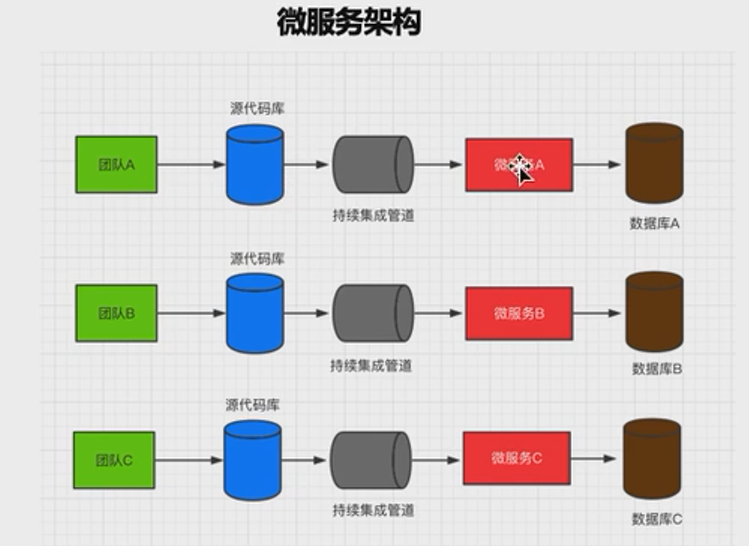
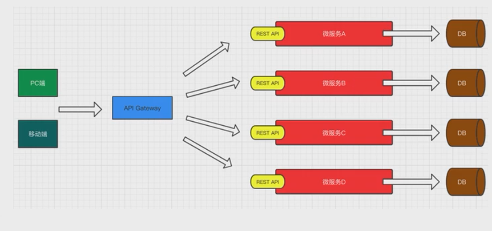
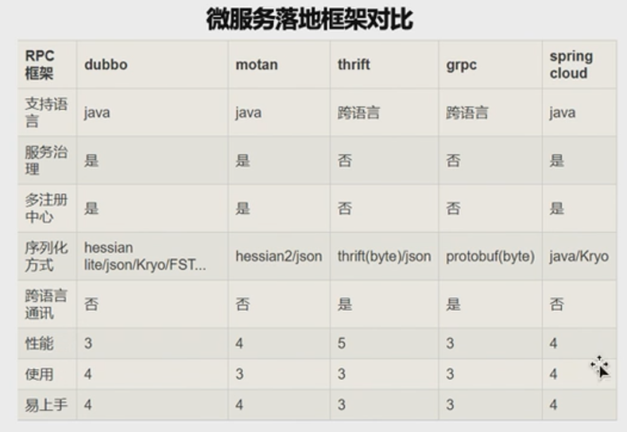
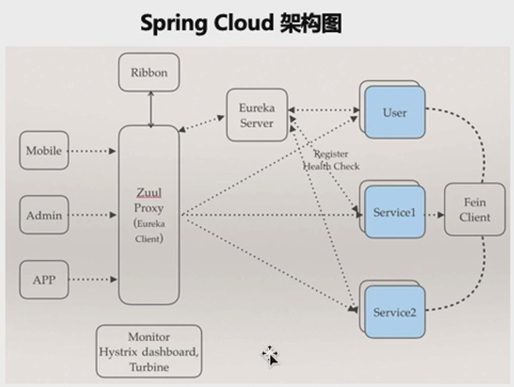

## 一、微服务概述

**一、什么是微服务**

​     微服务是一种架构风格，是一种架构设计方式，一个大型复杂软件应用由一个或多个微服务组成。系统中的各个微服务可被独立部署，各个微服务之间是松耦合的。每个微服务仅关注于完成一件任务并很好地完成该任务。在所有情况下，每个任务代表着一个小的业务能力。

**二、为什么需要微服务**

  传统开发模式下，绝大多数的 web 应用都是单体架构的风格来进行构建，这就使得所有的接口，业务逻辑层，数据持久层全部都被打包在一个 web 应用中，并且布置在一台服务器上，使得不同的模块之前也高耦合在一起，这种开发模式使得多团队协作开发的开发成本极高。

**三、单体应用存在的问题**

  \* 随着业务的发展，开发变得越来越复杂
  \* 对某单一功能进行修改时，需要对整个系统进行打包部署
  \* 多个团队同时对数据进行操作管理，容易产生安全漏洞
  \* 各模块都使用相对统一的技术进行开发，各个模块很难根据实际情况选择更加合适的技术框架，系统的延展性比较低。
  \* 模块间耦合度高，新人上手比较费时

  ***分布式、集群\***

  集群：一台服务器无法负荷高并发的数据访问，需要设置更多的服务器一起分担压力。从物理层面解决高并发的问题，例如春运期间火车站多开购票窗口等。

  分布式：将一个大型的项目架构拆分为若干个微服务来协同完成。从软件设计层面解决问题，例如将购票分为统计出发地与目的地，查询是否有票，统一购买票等步骤，分别由不同的人来完成这些小的工作，最后将所有的工作结果进行整合，实现更大的需求。
微服务架构：



**四、微服务的优点**

1.  各个服务的开发、测试、部署都是相互<u>独立</u>的。可以针对某一个特定的服务进行更多的操作，比如负载均衡等。

2.  当有一个新的需求加入时，传统项目需要结合各方面考虑影响等，微服务就不存在这样的问题，省事省力又省心。

3.  使用微服务将项目拆分后，只需要保证对外接口的正常运行，大大降低了各个模块之间的<u>耦合性</u>，极大的提高开发效率。

   

**五、微服务的弊端**

1.   微服务的拆分基于业务，不能随心所欲的拆分，所以如何拆分，对于项目架构来说是非常重要且极具挑战的任务。
2.  涉及到服务之间的调用时，常常需要和另外一个服务的提供方进行沟通，若是两个完全不同的公司或者部门，沟通成本比较大；某服务的对外接口要进行修改，也需要与其他服务调用方进行沟通。
3.  由于各个服务相互独立，数据也是独立，当多个服务的接口进行操作时，如何保证**数据的一致性**是一个难点。数据统一性是微服务里面的一个难题。

**六、为什么选择 Spring Cloud**



​       虽然微服务也有很多缺点，但是瑕不掩瑜，总体来讲，微服务还是实现分布式架构的一个非常好的方式。是当下非常热点的技术，也是未来技术发展的趋势。当下较为常见的微服务框架是 Spring Cloud 和 dubbo（ali），motan，thrift，grpc（google rpc）。那我们为什么选择 Spring Cloud 呢，原因如下：

  1.Spring Cloud 是完全基于 Spring Boot，服务调用是基于 REST API  ，整合了各种成熟的产品和架构，同时基于 Spring Boot 也使得整体的开发、配置、部署都非常的方便。

  2.Spring 系列的产品具备功能齐全、简单好用、性能优美、文档规范等优点。

七、**Spring Cloud 的整体架构**



**八、Spring Cloud 的核心组件**

  Spring Cloud 包含多个组件，主要是**服务治理** Eureka、**服务通信** Ribbon、**服务通信** Feign、**服务网关** Zuul、**服务容错** Hystrix、**服务配置** Config、**服务监控** Actuator、**服务跟踪** Zipkin 等 8 大组件。 Spring Cloud 的学习主要就是学习这些组件的使用以及这些组件之间的整合。


**九、服务如何治理**

  服务治理的核心由三部分组成：服务提供者、服务消费者、注册中心

  服务注册：分布式系统架构中，没个微服务在启动时，会将自己的信息存储在注册中心。

  服务发现：服务消费者从注册中心获取服务提供者的信息，通过这些信息调用服务提供者的服务。、

  那么 Spring Cloud 的服务治理则采用 Eureka 来实现，具体是怎么操作的，让我们期待[《我的 Spring Cloud（二）：Eureka Server 注册中心》](https://my.oschina.net/qq785482254/blog/3187900)

## [（二）：Eureka Server 注册中心](https://my.oschina.net/qq785482254/blog/3187900)

**一、Eureka 是什么**

  Eureka 是 Netflix 开源的基于 REST 的服务治理方案，Spring Cloud 集成了 Eureka，提供服务治理和服务发现功能，可以和基于 Spring Boot 搭建的微服务应用轻松完成整合。

**二、Spring Cloud Eureka 的组成**

  \1. Eureka Server，注册中心

  \2. Eureka Client，所有要进行注册的微服务通过 Eureka Client 连接到 Eureka Server，完成注册

**三、实战！快速搭建注册中心**

  \1. 创建一个父工程，pom.xml 配置如下

```xml
<parent>
  	<groupId>org.springframework.boot</groupId>
  	<artifactId>spring-boot-starter-parent</artifactId>
  	<version>2.0.7.RELEASE</version>
  </parent>
  
  <dependencies>
  	<dependency>
  		<groupId>org.springframework.boot</groupId>
  		<artifactId>spring-boot-starter-web</artifactId>
  	</dependency>
  </dependencies>
  
  <dependencyManagement>
  	<dependencies>
  		<dependency>
  			<groupId>org.springframework.cloud</groupId>
  			<artifactId>spring-cloud-dependencies</artifactId>
  			<version>Finchley.SR2</version>
  			<type>pom</type>
  			<scope>import</scope>
  		</dependency>
  	</dependencies>
  </dependencyManagement>
```

\2. 在父工程下创建一个子工程 Module，pom.xml 配置如下

```xml
<dependency>
    <groupId>org.springframework.cloud</groupId>
    <artifactId>spring-cloud-starter-netflix-eureka-server</artifactId>
    <version>2.0.2.RELEASE</version>
</dependency>
```

\3. 在子工程下创建 application.yml，添加 Eureka 相关的配置如下

```
server:
  # 当前Eureka Server服务端口
  port: 8761
eureka:
  client:
    # 是否将当前的Eureka Server服务作为客户端进行注册
    register-with-eureka: false
    # 是否获取其他Eureka Server服务的数据
    fetch-registry: false
    
    service-url:
      # 注册中心的访问地址
      defaultZone: http://localhost:8761/eureka/
```

属性说明

  \* server.port：当前 Eureka Server 服务端口

  \* eureka.client.register-with-eureka：是否将当前的 Eureka Server 服务作为客户端进行注册

  \* eureka.client.fetch-registry：是否获取其他 Eureka Server 服务的数据

  \* eureka.client.service-url.defaultZone：注册中心的访问地址

\4. 创建启动类

```java
package com.frr;

import org.springframework.boot.SpringApplication;
import org.springframework.boot.autoconfigure.SpringBootApplication;
import org.springframework.cloud.netflix.eureka.server.EnableEurekaServer;

@SpringBootApplication
@EnableEurekaServer
public class EurekServerApplication {
	public static void main(String[] args) throws Exception {
		SpringApplication.run(EurekServerApplication.class, args);
	}

}
```

注解说明

  \* @SpringBootApplication：声明该类是 Spring Boot 服务的入口

  *@EnableEurekaServer：声明该类是一个 Eureka Server 微服务，提供服务注册和服务发现的功能，即注册中心

\5. 启动成功后的界面


**四、总结**

  \1. 新建父工程，在 pom 文件中加入公用的依赖

  \2. 在父工程中创建一个子工程 Module，在 Module 的 pom 文件中添加自己需要的组件依赖

  \3. 在 Spring Boot 里面添加它的端口和 Eureka 相关的配置

  \4. 最后创建启动类，在启动类添加注解，让当前这个工程成为一个 Eureka Server

## [（三）：Eureka Client 服务提供者](https://my.oschina.net/qq785482254/blog/3190603)

一、创建一个子工程并引入配置如下：

```xml
    <dependency>
    	<groupId>org.springframework.cloud</groupId>
    	<artifactId>spring-cloud-starter-netflix-eureka-client</artifactId>
    	<version>2.0.2.RELEASE</version>
    </dependency>
```

二、创建 application.yml，添加相关配置如下：

```
server:
  port: 8010
spring:
  application:
    name: provider
eureka:
  client:
    service-url:
      defaultZone: http://localhost:8761/eureka/
  instance:
    prefer-ip-address:  true
```

属性说明

  \* spring.application.name ： 当前服务注册在 Eureka Server 上的名称。

  \* eureka.client.service-url.defaultZone ： 注册中⼼的访问地址。  

  \* eureka.instance.prefer-ip-address ： 是否将当前服务的 IP 注册到 Eureka Server。

三、创建启动类，代码如下

```java
package com.frr;

import org.springframework.boot.SpringApplication;
import org.springframework.boot.autoconfigure.SpringBootApplication;

@SpringBootApplication
public class EurekaClientApplication {
	public static void main(String[] args) throws Exception {
		SpringApplication.run(EurekaClientApplication.class, args);
	}

}
```

四、启动注册中心，然后再启动刚刚写的服务提供者，访问注册中心的地址可看到以下界面，多出了刚刚注册成功的 provider 服务


五、实战！模拟学生的增删改查

  \1. 创建 student 实体类如下：

```java
package com.frr.entity;
import lombok.AllArgsConstructor;
import lombok.Data;
import lombok.NoArgsConstructor;

@Data //生成Getter,Setter,equals,canEqual,hasCode,toString等方法
@AllArgsConstructor //添加一个构造函数，该构造函数含有所有已声明字段属性参数
@NoArgsConstructor //创建一个无参构造函数
public class Student {
	private long id;
	private String name;
	private int age;
}
```

注解说明

  *[@Data](https://my.oschina.net/difrik)  生成 Getter,Setter,equals,canEqual,hasCode,toString 等方法

  *@AllArgsConstructor  添加一个构造函数，该构造函数含有所有已声明字段属性参数

  *@NoArgsConstructor  创建一个无参构造函数

  \2. 创建接口，代码如下：

```java
package com.frr.repository;

import java.util.Collection;

import com.frr.entity.Student;

public interface StudentRepository {
	public Collection<Student> findAll();
	public Student findById(long id);
	public void saveOrUpdate(Student s);
	public void deleteById(long id);
}
```

  \3. 创建实现类，采用静态代码块实现数据初始化，代码如下：

```java
package com.frr.repository.impl;

import java.util.Collection;
import java.util.HashMap;
import java.util.Map;
import org.springframework.stereotype.Repository;
import com.frr.entity.Student;
import com.frr.repository.StudentRepository;

@Repository
public class StudentRepositoryImpl implements StudentRepository{
	
	private static Map<Long,Student> studentMap;

	static {
		studentMap = new HashMap<>();
		studentMap.put(1L, new Student(1L, "张三", 11));
		studentMap.put(2L, new Student(1L, "李四", 11));
		studentMap.put(3L, new Student(1L, "王五", 11));
	}
	
	@Override
	public Collection<Student> findAll() {
		return studentMap.values();
	}

	@Override
	public Student findById(long id) {
		return studentMap.get(id);
	}

	@Override
	public void saveOrUpdate(Student s) {
		studentMap.put(s.getId(), s);
	}

	@Override
	public void deleteById(long id) {
		studentMap.remove(id);
	}

}
```

  \4. 创建 controller，代码如下：

```java
package com.frr.controller;

import java.util.Collection;

import org.springframework.beans.factory.annotation.Autowired;
import org.springframework.web.bind.annotation.DeleteMapping;
import org.springframework.web.bind.annotation.GetMapping;
import org.springframework.web.bind.annotation.PathVariable;
import org.springframework.web.bind.annotation.PostMapping;
import org.springframework.web.bind.annotation.PutMapping;
import org.springframework.web.bind.annotation.RequestBody;
import org.springframework.web.bind.annotation.RequestMapping;
import org.springframework.web.bind.annotation.RestController;

import com.frr.entity.Student;
import com.frr.repository.StudentRepository;

@RestController //在Spring中@RestController的作用等同于@Controller + @ResponseBody。
@RequestMapping("/student")
public class StudentHandler {
	@Autowired
	private StudentRepository studentRepository;
	
	@GetMapping("/findAll")
	public Collection<Student> findAll(){
		return studentRepository.findAll();
	}
	
	@GetMapping("/findById/{id}")
	public Student findById(@PathVariable("id") long id) {
		return studentRepository.findById(id);
	}
	
	@PostMapping("/save")
	public void save(@RequestBody Student s) {
		studentRepository.saveOrUpdate(s);
	}
	
	@PutMapping("/Update")
	public void Update(@RequestBody Student s) {
		studentRepository.saveOrUpdate(s);
	}
	
	@DeleteMapping("/deleteById/{id}")
	public void deleteById(@PathVariable("id") long id) {
		studentRepository.deleteById(id);
	}
}
```

  \5. 重新启动上文创建的启动类

  \6. 使用 Postman 工具测试各个方法，数据一致表示成功！


六、总结

  一个非常基础的微服务架构就搭建完成了，搭建过程简单明了，就是在原本 spring boot 的基础上添加了 spring cloud 的一些依赖，和 eureka 的一些相关的配置。所以总结起来，还是以 spring boot 为基础，spring cloud 可以让它拥有各种各样组件的功能。那么服务消费者如何调用服务提供者的接口的呢，让我们期待下一篇 

## [（四）：RestTemplate 的使用](https://my.oschina.net/qq785482254/blog/3193306)

 上一篇我们已经学会了如何创建一个服务提供者，那么这一篇我们来创建一个服务消费者，实现思路是先通过 Spring boot 搭建一个微服务应用，再通过 Eureka Client 把它注册到注册中心 Eureka Server，成为一个服务消费者。那么服务消费者如何调用服务提供者的接口呢，那么我们首先要来介绍一个组件 RestTemplate 的使用。

一、什么是 RestTemplate

   RestTemplate 是 Spring 框架提供的基于 REST 的服务组件，底层是对 HTTP 请求及响应进⾏了封装， 提供了很多访问 RETS 服务的⽅法，可以简化代码开发。

二、如何使用 RestTemplate

  \1. 创建一个 maven 工程作为子服务

```xml
<dependency>
    <groupId>org.springframework.cloud</groupId>
    <artifactId>spring-cloud-starter-netflix-eureka-client</artifactId>
    <version>2.0.2.RELEASE</version>
</dependency>
```

  \2. 创建 application.yml，代码如下

```
server:
  port: 8080
spring:
  application:
    name: consumer
eureka:
  client:
    service-url:
      defaultZone: http://localhost:8761/eureka/
  instance:
    prefer-ip-address: true
```

  \2. 创建与服务提供者相同的实体类，代码如下

```java
package com.frr.entity;
import lombok.AllArgsConstructor;
import lombok.Data;
import lombok.NoArgsConstructor;

@Data //生成Getter,Setter,equals,canEqual,hasCode,toString等方法
@AllArgsConstructor //添加一个构造函数，该构造函数含有所有已声明字段属性参数
@NoArgsConstructor //创建一个无参构造函数
public class Student {
	private long id;
	private String name;
	private int age;
}
```

  \3. 创建 controller，并且在方法中调用服务提供者的接口，代码如下

```java
package com.frr.controller;

import java.util.Collection;

import org.springframework.beans.factory.annotation.Autowired;
import org.springframework.web.bind.annotation.DeleteMapping;
import org.springframework.web.bind.annotation.GetMapping;
import org.springframework.web.bind.annotation.PathVariable;
import org.springframework.web.bind.annotation.PostMapping;
import org.springframework.web.bind.annotation.PutMapping;
import org.springframework.web.bind.annotation.RequestBody;
import org.springframework.web.bind.annotation.RequestMapping;
import org.springframework.web.bind.annotation.RestController;
import org.springframework.web.client.RestTemplate;

import com.frr.entity.Student;

@RestController
@RequestMapping("/consumer")
public class RestTemplateController {
	
	@Autowired
	private RestTemplate restTemplate;
	
	@GetMapping("/findAll")
	@SuppressWarnings("unchecked")
	public Collection<Student> findAll(){
		return restTemplate.getForEntity("http://localhost:8010/student/findAll", Collection.class).getBody();
	}
	
	@SuppressWarnings("unchecked")
	@GetMapping("/findAll2")
	public Collection<Student> findAll2(){
		return restTemplate.getForObject("http://localhost:8010/student/findAll",Collection.class);
	}
	
	@GetMapping("/findById/{id}")
	public Student findById(@PathVariable("id") long id){
		return	restTemplate.getForEntity("http://localhost:8010/student/findById/{id}",Student.class,id).getBody();
	}
	
	@GetMapping("/findById2/{id}")
	public Student findById2(@PathVariable("id") long id){
		return	restTemplate.getForObject("http://localhost:8010/student/findById/{id}",Student.class,id);
	}
	
	@PostMapping("/save")
	public void save(@RequestBody Student student){
		restTemplate.postForEntity("http://localhost:8010/student/save",student,null).getBody();
	}
	
	@PostMapping("/save2")
	public void save2(@RequestBody Student student){
		restTemplate.postForObject("http://localhost:8010/student/save",student,null);
	}
		
	@PutMapping("/update")
	public void update(@RequestBody Student student){
		restTemplate.put("http://localhost:8010/student/update",student);
	}
	
	@DeleteMapping("/deleteById/{id}")
	public void deleteById(@PathVariable("id") long id){
		restTemplate.delete("http://localhost:8010/student/deleteById/{id}",id);
	}
	
}
```

  \4. 创建启动类，需要注意的是，需要在启动类里将 RestTemplate 的实例进行注入的，这里采用 @Bean 的方式，代码如下

```java
package com.frr;

import org.springframework.boot.SpringApplication;
import org.springframework.boot.autoconfigure.SpringBootApplication;
import org.springframework.context.annotation.Bean;
import org.springframework.web.client.RestTemplate;

@SpringBootApplication
public class RestTemplateApplication {
	public static void main(String[] args) throws Exception {
		SpringApplication.run(RestTemplateApplication.class, args);
	}
	
	@Bean
	public RestTemplate restTemplate(){
		return new RestTemplate();
	}
}
```

\5. 依次启动注册中心、服务提供者、服务消费者，利用 Postman 工具测试，不同的请求可获得相同的数据返回

  \* 8010 服务提供者 findAll 接口返回数据如下


  \* 8080 服务消费者 findAll 接口返回数据如下


  \* 结论：数据返回一致，服务消费者成功调用服务提供者的接口！

\6. 总结

  服务提供者和服务消费者从代码的层面来看，是没有太大区别的，他们本身都是 Spring boot 的工程，我们在此基础上，通过 Spring Cloud 的一些组件，让他们拥有了不同的身份。服务提供者提供了对外访问的接口，服务消费者也提供了对外访问的接口，只不过接口内部是在调用其他服务的接口，所以从某种意义上讲，服务消费者也是一个服务提供者，其他服务也可以掉用服务消费者的服务。因此，服务之间没有绝对的提供者与消费者，它们之间是可以相互调用的！

## [（五）：Zuul 服务网关](https://my.oschina.net/qq785482254/blog/3196568)

一、什么是 Zuul 服务网关

  Zuul 是 Netflix 提供的⼀个开源的 API ⽹关服务器，是客户端和⽹站后端所有请求的中间层，对外开放 ⼀个 API，将所有请求导⼊统⼀的⼊⼝，屏蔽了服务端的具体实现逻辑，Zuul 可以实现反向代理的功 能，在⽹关内部实现动态路由、身份认证、IP 过滤、数据监控等。Zuul 也是 Spring Cloud 集成的组件，通过它来实现服务网关。

二、Zuul 的功能列表

  \1. 身份认证与安全：识别每个资源的验证要求，并拒绝那些与要求不符合的请求。

  \2. 审查与监控：在边缘位置追踪有意义的数据和统计结果，从而带来精确的生产视图。

  \3. 动态路由：动态的将请求路由到不同的后端集群。

  \4. 压力测试：逐渐增加指向集群的流量，以了解性能。

  \5. 负载分配：为每一种负载类型分配对应容量，并弃用超出限定值的请求。

  \6. 静态响应处理：在边缘位置直接建立部分响应，从而避免其转发到内部集群。

  \7. 多区域弹性：跨越 AWS Region 进行请求路由，旨在实现 ELB（Elastic Load Balancing）使用的多样化，以及让系统的便越更贴近系统的使用者。

三、实战！

\1. 创建 maven 工程，pom.xml 配置如下：

```xml
    <dependency>
		 <groupId>org.springframework.cloud</groupId>
		 <artifactId>spring-cloud-starter-netflix-eureka-client</artifactId>
		 <version>2.0.2.RELEASE</version>
	 </dependency>
	 
	 <dependency>
		 <groupId>org.springframework.cloud</groupId>
		 <artifactId>spring-cloud-starter-netflix-zuul</artifactId>
		 <version>2.0.2.RELEASE</version>
	 </dependency>
```

\2. 创建配置文件 application.yml 配置如下：

```
server:
  port: 8030
spring:
  application:
    name: gateway
eureka:
  client:
    service-url:
      defaultZone: http://localhost:8761/eureka/
zuul:
  routes:
    provider: /p/**
```

属性说明

  \* zuul.routes.provider： 给服务提供者 provider 设置映射，可以不需要再记住服务提供者的端口

\3. 创建启动类，代码如下：

```java
package com.zing;

import org.springframework.boot.SpringApplication;
import org.springframework.boot.autoconfigure.EnableAutoConfiguration;
import org.springframework.cloud.netflix.zuul.EnableZuulProxy;

@EnableZuulProxy
@EnableAutoConfiguration
public class ZuulApplication {
	public static void main(String[] args) throws Exception {
		SpringApplication.run(ZuulApplication.class, args);
	}

}
```

注解说明

  \* @EnableZuulProxy ： 包含了 @EnableZuulServer ，设置该类是⽹关的启动类。

  \* @EnableAutoConfiguration ：可以帮助 Spring Boot 应⽤将所有符合条件的 @Configuration 配置加载到当前 Spring Boot 创建并使⽤的 IOC 容器中。

四、Zuul 的负载均衡

  \1. 修改服务提供者的 controller 层代码，具体如下：

```java
package com.zing.controller;

import java.util.Collection;

import org.springframework.beans.factory.annotation.Autowired;
import org.springframework.beans.factory.annotation.Value;
import org.springframework.web.bind.annotation.DeleteMapping;
import org.springframework.web.bind.annotation.GetMapping;
import org.springframework.web.bind.annotation.PathVariable;
import org.springframework.web.bind.annotation.PostMapping;
import org.springframework.web.bind.annotation.PutMapping;
import org.springframework.web.bind.annotation.RequestBody;
import org.springframework.web.bind.annotation.RequestMapping;
import org.springframework.web.bind.annotation.RestController;

import com.zing.entity.Student;
import com.zing.repository.StudentRepository;


@RestController //在Spring中@RestController的作用等同于@Controller + @ResponseBody。
@RequestMapping("/student")
public class StudentHandler {
	@Autowired
	private StudentRepository studentRepository;
	
	@Value("${server.port}")
	private String port;
	
	@GetMapping("/findAll")
	public Collection<Student> findAll(){
		return studentRepository.findAll();
	}
	
	@GetMapping("/findById/{id}")
	public Student findById(@PathVariable("id") long id) {
		return studentRepository.findById(id);
	}
	
	@PostMapping("/save")
	public void save(@RequestBody Student s) {
		studentRepository.saveOrUpdate(s);
	}
	
	@PutMapping("/Update")
	public void Update(@RequestBody Student s) {
		studentRepository.saveOrUpdate(s);
	}
	
	@DeleteMapping("/deleteById/{id}")
	public void deleteById(@PathVariable("id") long id) {
		studentRepository.deleteById(id);
	}
	
	@GetMapping("/index")
	public String index() {
		return "当前端口：" + this.port;
	}
	
}
```

  注解说明

  \* @Value ("${server.port}")：获取当前项目 application.yml 配置文件中的 server.port 属性值。

  \2. 首先启动注册中心，然后启动服务提供者，修改端口为 8011 后，再建一个启动类再次启动，我们就可以在注册中心看到两个 prider 服务，如图：


\3. 启动 zuul 的启动类，我们可以访问 http://localhost:8030/p/student/index 查看调用服务的端口，我们不断的刷新，可以看到端口是交替出现的：


五、总结

  zuul 服务网关是微服务架构中不可或缺的的部分。通过服务网关统一向外系统提供 REST API 的过程中，除了具备服务路由、负载均衡之外，它还具备了权限控制等功能。 它还可以和 Ribbon 搭配使用，那么 Ribbon 又是如何使用呢， 让我们期待下一篇 

## [（六）：Ribbon 负载均衡](https://my.oschina.net/qq785482254/blog/3216645)

一、使用背景

  前面的学习中，我们已经使用 RestTemplate 来实现了服务消费者对服务提供者的调用，如果在某个具体的业务场景下，对某个服务的调用量突然大幅提升，这个时候就需要对该服务实现负载均衡以满足对高并发的访问情况。在大型的分布式项目中，负载均衡是必备的，那么就可以采用 Ribbon 来实现。

二、什么是 Ribbon

  Ribbon 是 Sping Cloud 的一个组件，Spring Cloud Ribbon 是一个负载均衡的解决方案，Ribbon 是 Netflix 发布的负载均衡器，Spring 对其进行了集成，Spring Cloud Ribbon 是基于 Netflix Ribbon 实现的，是一个用于对 HTTP 请求进行控制的负载均衡客户端。Spring Cloud Ribbon 也是要结合 Eureka Server 来使用的，因为也要在注册中心进行注册。在注册中心对 Ribbon 进行注册之后，Ribbon 就可以基于某种负载均衡算法，如轮询、随机、加权轮询、加权随机等自动帮助服务消费者调用接口，开发者也可以根据具体需求自定义 Ribbon 负载均衡算法。实际开发中，Spring Cloud Eureka 来使用，Eureka Server 提供所有可以调用的服务提供者列表，Ribbon 基于特定的负载均衡算法从这些服务提供者中选择要调用的具体实例。示例图如下：


三、实战，快速搭建 Ribbon 实例

  \1. 创建 Module，pom.xml 添加 Eureka client 依赖，将其注册到注册中心，添加代码如下：

```xml
    <dependency>
    	<groupId>org.springframework.cloud</groupId>
    	<artifactId>spring-cloud-starter-netflix-eureka-client</artifactId>
    	<version>2.0.2.RELEASE</version>
    </dependency>
```

  \2. 创建配置文件 application.yml，配置信息如下：

```
server:
  port: 8040
spring:
  application:
    name: ribbon
eureka:
  client:
    service-url:
      defaultZone: http://localhost:8761/eureka
  instance:
    prefer-ip-address: true
```

  属性说明

​    \* spring.application.name ： 当前服务注册在 Eureka Server 上的名称。

​    \* eureka.client.service-url.defaultZone ： 注册中⼼的访问地址。  

​    \* eureka.instance.prefer-ip-address ： 是否将当前服务的 IP 注册到 Eureka Server。  3. 创建启动类

  \3. 创建启动类，代码如下：

```java
package com.zing;

import org.springframework.boot.SpringApplication;
import org.springframework.boot.autoconfigure.SpringBootApplication;
import org.springframework.cloud.client.loadbalancer.LoadBalanced;
import org.springframework.context.annotation.Bean;
import org.springframework.web.client.RestTemplate;

@SpringBootApplication
public class RibbonApplication {
	public static void main(String[] args) throws Exception {
		SpringApplication.run(RibbonApplication.class, args);
	}
	
	@Bean
	@LoadBalanced
	public RestTemplate restTemplate() {
		return new RestTemplate();
	}

}
```

  注解说明：

​    \* @Bean：通过 @Bean 注解将实例注入到 IOC 容器中。实际上 @SpringBootApplication 相当于使用 @Configuration、@EnableAutoConfiguration 和 @ComponentScan 的默认属性，而 @Bean 是一个方法级别的注解，主要用在 @Configuration 注解的类里，@Configuration 相当于 xml 文件中的 beans 标签，@Bean 相当于 bean 标签。

​    \* @LoadBalanced：声明一个基于 Ribbon 的负载均衡。标注此注解后，RestTemplate 就具有了客户端负载均衡的能力。

  4.Controller 层代码实现如下：

```java
package com.zing.controller;

import java.util.Collection;

import org.springframework.beans.factory.annotation.Autowired;
import org.springframework.web.bind.annotation.GetMapping;
import org.springframework.web.bind.annotation.RequestMapping;
import org.springframework.web.bind.annotation.RestController;
import org.springframework.web.client.RestTemplate;

import com.zing.entity.Student;

@RestController
@RequestMapping("/ribbon")
public class RibbonHandler {
	
	@Autowired
	private RestTemplate restTemplate;
	
	@GetMapping("/findAll")
	public Collection<Student> findAll(){
		return restTemplate.getForObject("http://provider/student/findAll", Collection.class);
	}
	
	@GetMapping("/index")
	public String index() {
		return restTemplate.getForObject("http://provider/student/index", String.class);
	}
	
}
```

  \5. 测试接口

​    (1) 启动注册中心，然后分别启动两个 provider 实例。打开注册中心可看到如下信息：


​    (2) 启动 Ribbon，可看到注册中心有 RIBBON 的一个实例，如下：


​    (3) 测试 index 接口，可看到端口交替出现，结果如下：


四、总结

  此次代码采用 Ribbon+RestTemplate 的方式来实现服务调用的负载均衡，客户端默认采用轮询的方式调用服务提供者，是两个 provider 实例交替进行响应。但是这种开发方式是可以被简化的，在实际的开发中有更加便捷的方式，可以同样实现这样一个功能，请期待我的下一篇

## [（七）：Feign 声明式接口调用](https://my.oschina.net/qq785482254/blog/3216671)

一、什么是 Feign

  Feign 也是去实现负载均衡，但是它的使用要比 Ribbon 更加简化，它实际上是基于 Ribbon 进行了封装，让我们可以通过调用接口的方式实现负载均衡。Feign 和 Ribbon 都是由 Netflix 提供的，Feign 是一个声明式、模板化的 Web Service 客户端，它简化了开发者编写 Web 服务客户端的操作，开发者可以通过简单的接口和注解来调用 HTTP API，使得开发变得更加简化、快捷。Spring Cloud Feign 也是基于 Netflix Feign 的二次开发，它整合了 Ribbon 和 Hystrix，具有可插拔、基于注解、负载均衡、服务熔断等一系列的便捷功能，也就是说我们在实际开发中可以用 Feign 来取代 Ribbon。

  相比较于 Ribbon+RestTemplate 的方式，Feign 大大简化了代码的开发，Feign 支持多种注解，包括 Feign 注解、JAX-RS 注解、Spring MVC 注解等，Spring Cloud 对 Feign 进行了优化，整合了 Ribbon 和 Eureka，从而让 Feign 使用更加方便。

二、Ribbon 和 Feign 的区别

  Ribbon 是一个通用的 HTTP 客户端工具，Feign 是基于 Ribbon 实现的。

三、Feign 的优点

  1.Feign 是一个声明式的 Web Service 客户端。

  \2. 支持 Feign 注解、Spring MVC 注解、JAX-RS 注解

  3.Feign 是基于 Ribbon 实现，使用起来更加方便

  4.Feign 集成了 Hystrix，具备服务熔断的功能

四、实战！

  \1. 创建 Module, 配置 pom.xml 如下：

```xml
    <dependency>
    	<groupId>org.springframework.cloud</groupId>
    	<artifactId>spring-cloud-starter-netflix-eureka-client</artifactId>
    	<version>2.0.2.RELEASE</version>
    </dependency>
    
    <dependency>
    	<groupId>org.springframework.cloud</groupId>
    	<artifactId>spring-cloud-starter-openfeign</artifactId>
    	<version>2.0.2.RELEASE</version>
    </dependency>
```

  \2. 创建配置文件 application.yml，配置如下：

```
server:
  port: 8050
spring:
  application:
    name: feign
eureka:
  client:
    service-url:
      defaultZone: http://localhost:8761/eureka
  instance:
    prefer-ip-address: true
```

  \3. 创建启动类，代码如下：

```java
package com.zing;

import org.springframework.boot.SpringApplication;
import org.springframework.boot.autoconfigure.SpringBootApplication;
import org.springframework.cloud.openfeign.EnableFeignClients;

@SpringBootApplication
@EnableFeignClients
public class FeignApplication {
	public static void main(String[] args) throws Exception {
		SpringApplication.run(FeignApplication.class, args);
	}

}
```

  注解说明：

​    \* @EnableFeignClients：声明其为 Feign 客户端

  \4. 创建声明式接口，代码如下：

```java
package com.zing.feign;

import java.util.Collection;

import org.springframework.cloud.openfeign.FeignClient;
import org.springframework.web.bind.annotation.GetMapping;

import com.zing.entity.Student;

@FeignClient(value = "provider")
public interface IFeignService {
	
	@GetMapping("/student/findAll")
	public Collection<Student> findAll();
	
	@GetMapping("/student/index")
	public String index();
}
```

  5.Handler 代码如下：

```java
package com.zing.controller;

import java.util.Collection;

import org.springframework.beans.factory.annotation.Autowired;
import org.springframework.web.bind.annotation.GetMapping;
import org.springframework.web.bind.annotation.RequestMapping;
import org.springframework.web.bind.annotation.RestController;

import com.zing.entity.Student;
import com.zing.feign.IFeignService;

@RestController
@RequestMapping("/feign")
public class FeignHandler {

	@Autowired
	private IFeignService feignservice;
	
	@GetMapping("/findAll")
	public Collection<Student> findAll(){
		return feignservice.findAll();
	}
	
	@GetMapping("/index")
	public String index() {
		return feignservice.index();
	}
	
}
```

  \6. 测试 feign 的负载均衡功能

​    (1) 分别启动注册中心，两个不同端口的服务提供者，feign，注册中心页面如下：


​    (2) 多次访问 [http://localhost:8050/feign/index](https://www.oschina.net/action/GoToLink?url=http%3A%2F%2Flocalhost%3A8050%2Ffeign%2Findex) ，我们可以看到两个端口地址交替出现，证明 Feign 实现了负载均衡。如下图：


  \7. 测试 Feign 的熔断机制

​    (1) 我们先停掉所有的服务提供者，只保留注册中心和 Feign 的服务，打开注册中心如下图：


​    (2) 再次访问 [http://localhost:8050/feign/index](https://www.oschina.net/action/GoToLink?url=http%3A%2F%2Flocalhost%3A8050%2Ffeign%2Findex) 可看到如下图的内容：


​    (3) 为了不直接暴露错误信息，我们需要添加服务熔断机制，修改 application.yml 如下：

```
server:
  port: 8050
spring:
  application:
    name: feign
eureka:
  client:
    service-url:
      defaultZone: http://localhost:8761/eureka
  instance:
    prefer-ip-address: true
feign:
  hystrix:
    enabled: true
```

​    配置说明：

​      \* feign.hystrix.enable：是否开启熔断机制，默认 false。

​    (4) 创建 IFeignService 的实现类 FeignServiceImpl，在里面定义容错处理机制，通过 @Component 注解将 FeignServiceImpl 实例注入到 IOC 容器中，代码如下：

```java
package com.zing.feign.impl;

import java.util.Collection;

import org.springframework.stereotype.Component;

import com.zing.entity.Student;
import com.zing.feign.IFeignService;

@Component
public class FeignServiceImpl implements IFeignService{

	@Override
	public Collection<Student> findAll() {
		return null;
	}

	@Override
	public String index() {
		return "服务器维护中。。。";
	}

}
```

​    (5) 在 IFeignService 接口定义处定义 @FeignClient 的 fallback 属性来做降级处理，设置映射，映射到 FeignServiceImpl 中去。修改 IFeignService 后代码如下：

```java
package com.zing.feign;

import java.util.Collection;

import org.springframework.cloud.openfeign.FeignClient;
import org.springframework.web.bind.annotation.GetMapping;

import com.zing.entity.Student;
import com.zing.feign.impl.FeignServiceImpl;

@FeignClient(value = "provider",fallback = FeignServiceImpl.class)
public interface IFeignService {
	
	@GetMapping("/student/findAll")
	public Collection<Student> findAll();
	
	@GetMapping("/student/index")
	public String index();
}
```

​    (6) 重复 (1)、(2) 步，出现以下界面，证明服务熔断机制起效。如图：


五、总结

  我们在本次的代码中，采用 Feign 实现了负载均衡和服务熔断。了解了 Feign 的配置以及使用的基本原理，那么我们再来仔细学习下 Hystix 容错机制。让我们期待下一篇