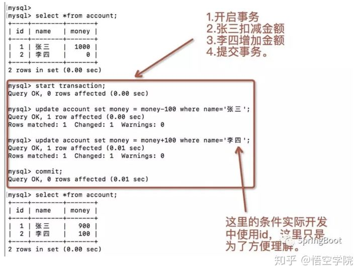

牛客上没找到面经，我自己来一份。背了点面试题就上了。结果被精准打击。落泪... 

  自我介绍，问实习和项目的技术框架 

###   从数据库开始，mysql事务特性，隔离级别，read uncommited 、


**一、事务的四大特性**

###### **1.1** **原子性（Atomicity）**

[原子性](https://so.csdn.net/so/search?q=原子性&spm=1001.2101.3001.7020)是指事务是一个不可分割的工作单位，事务中的操作要么全部成功，要么全部失败。比如在同一个事务中的SQL语句，要么全部执行成功，要么全部执行失败。

 

```sql
begin transaction;


    update account set money = money-100 where name = '张三';


    update account set money = money+100 where name = '李四';


commit transaction;
```

###### **1.2** **一致性（Consistency）**

官网上事务一致性的概念是：事务必须使数据库从一个一致性状态变换到另外一个一致性状态。

换一种方式理解就是：事务按照预期生效，数据的状态是预期的状态。

举例说明：张三向李四转100元，转账前和转账后的数据是正确的状态，这就叫一致性，如果出现张三转出100元，李四账号没有增加100元这就出现了数据错误，就没有达到一致性。

###### **1.3** **隔离性（Isolation）**

事务的隔离性是多个用户并发访问数据库时，数据库为每一个用户开启的事务，不能被其他事务的操作数据所干扰，多个并发事务之间要相互隔离。

###### **1.4** **持久性（Durability）**

持久性是指一个事务一旦被提交，它对数据库中数据的改变就是永久性的，接下来即使数据库发生故障也不应该对其有任何影响。

例如我们在使用JDBC操作数据库时，在提交事务方法后，提示用户事务操作完成，当我们程序执行完成直到看到提示后，就可以认定事务以及正确提交，即使这时候数据库出现了问题，也必须要将我们的事务完全执行完成，否则就会造成我们看到提示事务处理完毕，但是数据库因为故障而没有执行事务的重大错误。

**二、数据库ACID的体现**

**2.1** **原子性**

原子性说的是数据要么一起成功，要么一起失败，那么就有两种情况：事务提交（commit）和事务回滚（rollback）。

我们先看下事务正常提交的情况，下面我们在数据库模拟张三给李四转账成功的场景：



 

 

 

我们手动提交(commit)数据库事务之后，张三给李四转账100元的这个业务操作算是真正成功了，张三账户中少了100，李四账户中多了100。

接下来看下事务不正常的情况下：


 

 

事务回滚之后，对于张三和李四的金额的操作都失败了，这就确保了事务的原子性。

**2.2** **一致性**

一致性主要说明的是事务的前后，数据库中的数据的状态要确保一致。

事务提交成功，那么张三账户上的余额是900元，李四账户上的余额是100元。

事务提交失败，那么张三和李四的账户的金额不变。

这说明现在在数据库的事务的控制下，确保了数据的一致性。

**2.3** **隔离性**

隔离性的体现，多个并发事务之间是隔离的。

张三给李四转账，如果事务没有提交的话，那么在另外一个session中并不能查看另外一个session未提交的数据。


 

**2.4** **持久性**

持久性的体现就是数据一旦commit之后，那么对于数据的改变就是永久的。我们commit之后，张三的账户就永久减少了100元，李四的账户就永久增加了100元。

**三、JDBC ACID的体现**

我们使用JDBC连接MYSQL数据库的代码：

```java
public class App {
    public static void main(String[] args) throws ClassNotFoundException, SQLException 
        /*

         * 1/ 注册JDBC驱动； 
         * 2/ 获取连接； 
         * 3/ 开启事务
         * 4/ 创建SQL语句; 
         * 5/ 执行SQL语句; 
         * 6/ 提交事务
         * 7/ 关闭连接.
         * 
         */
        // 1/ 注册JDBC驱动；

        Class.forName("com.mysql.cj.jdbc.Driver");
        String url = "jdbc:mysql://127.0.0.1:3306/tx_demo";
        String user = "root";
        String password = "root";
        // 2/ 获取连接；
        Connection conn = DriverManager.getConnection(url, user, password);
        // 3/ 开启事务
        conn.setAutoCommit(false);
        // 4/ 创建SQL语句; 注意：实际使用account的主键，这里主要是为了方便理解。
        String sql = "update account set money = money-100 where name = ?";
        PreparedStatement ps = conn.prepareStatement(sql);
        ps.setString(1,"张三");
        // 5/ 执行SQL语句; 
        int rs = ps.executeUpdate();
        if(rs>0) {
            System.out.println("张三-扣减成功");
        }
        // 给李四增加金额
        sql = "update account set money = money+100 where name = ?";
        ps = conn.prepareStatement(sql);
        ps.setString(1,"李四");
       rs = ps.executeUpdate();
        if(rs>0) {
            System.out.println("李四-增加成功");
        }
        // 6/ 提交事务,更标准的写法应该拦截异常，有异常的情况下rollback();
       conn.commit();
        // 7/ 关闭连接.
        ps.close();
        conn.close();
    }
}
```

*说明：*

如果代码正常运行的话，那么张三会扣减金额，李四会增加金额，这就确保的原子性；

一旦数据保存到数据库之后，数据就永久被改变了，这就是持久性；

事务前后，数据的状态也是我们所期望的状态，这就保证了数据的一致性；

如果在事务未commit的话，那么在另外一个线程发起查询请求的话，那么并不能查看到最近的数据（这里未进行编码），这就是隔离性。


###   数据库用过事务吗，用过锁吗（都没用过，完虐）转账操作怎么加锁 

表级锁：
分类一：读锁

```
lock table  student read;
```

#读锁
可执行：

```
select*from student;
```

等待解锁：当前不能执行insert，update，delete操作

```
unlock tables;#解锁
```

解锁后才可以执行insert 操作，update，delete

当我们执行锁表，使用read 读锁，则，在解锁之前，student表都只能读取，即只能执行select操作，插入操作insert 都处于等待解锁的状态。只能读，不能写。

分类二：写锁

```
lock table balance write; #写锁
```

```
insert into balance(`user_id`,`money`)values(7,77);
select * from `balance`;
#unlock TABLES; 
#insert into balance(`user_id`,`money`)values(6,44);
```

注意这里并没有解锁，但是成功插入了。
但是这是在一个mysql回话中插入的，如果是新的会话insert into语句还是会处于等待状态，等待这个表解锁。并且新的回话中也select语句也是如此。
意思是：如果是写锁没有解锁，新的 会话 读写 都处于被锁状态。
行级锁

myisam和innodb都支持表级锁。
行级锁只有innodb支持，也是mysql中的最小粒度锁，也是真正的事务锁。
共享锁

行级锁分为：共享锁和排它锁

**#共享锁**

```
select xxx lock in share mode;
```

这样就打开了共享锁，凡是select取出来的行数据只有该回话可以修改，直到commit之后其他回话才能修改，但是过程当中其他会话可以读取。

行锁是索引级别的，并不是记录级别的

```
start TRANSACTION;#开启事务

select * from `balance` where user_id=3 lock in share mode;

#commit;提交事务
```

在新的会话中，可以读取，但不能修改：

#另一个会话中

```
select * from `balance` where user_id=3;#可以读取

update balance set money=99 where user_id=3;#等待状态
```


这条语句是修改是user_id=3的条件，那么user_id=4的条件下能否修改？
发现也不能修改，这是为啥？
因为行锁是索引级别的，并不是记录级别的，我们的数据表user_id字段不是索引字段。

所以这告诉我们：在设置行级锁的时候，where条件里的字段应该是索引字段。

排它锁

```
select xxx for upadte;
```


打开了排它锁，其他会话依然不能修改数据。但是可以普通的读取。
如果另外一个会话也想加锁，则会冲突。


##   spring boot的注解

使用注解的优势：

     1.采用纯java代码，不在需要配置繁杂的xml文件
    
     2.在配置中也可享受面向对象带来的好处
    
     3.类型安全对重构可以提供良好的支持
    
     4.减少复杂配置文件的同时亦能享受到springIoC容器提供的功能

 


一、注解详解（配备了完善的释义）------(可采用ctrl+F 来进行搜索哦~~~~)

`@SpringBootApplication`：申明让spring boot自动给程序进行必要的配置，这个配置等同于：

`@Configuration` ，`@EnableAutoConfiguration` 和 `@ComponentScan` 三个配置。

`@ResponseBody`：表示该方法的返回结果直接写入HTTP response body中，一般在异步获取数据时使用，用于构建RESTful的api。在使用@RequestMapping后，返回值通常解析为跳转路径，加上@esponsebody后返回结果不会被解析为跳转路径，而是直接写入HTTP response body中。比如异步获取json数据，加上@Responsebody后，会直接返回json数据。该注解一般会配合@RequestMapping一起使用。

`@Controller`：用于定义控制器类，在spring项目中由控制器负责将用户发来的URL请求转发到对应的服务接口（service层），一般这个注解在类中，通常方法需要配合注解@RequestMapping。

`@RestController`：用于标注控制层组件(如struts中的action)，@ResponseBody和@Controller的合集。

`@RequestMapping`：提供路由信息，负责URL到Controller中的具体函数的映射。

`@EnableAutoConfiguration`：SpringBoot自动配置（auto-configuration）：尝试根据你添加的jar依赖自动配置你的Spring应用。例如，如果你的classpath下存在HSQLDB，并且你没有手动配置任何数据库连接beans，那么我们将自动配置一个内存型（in-memory）数据库”。你可以将@EnableAutoConfiguration或者@SpringBootApplication注解添加到一个@Configuration类上来选择自动配置。如果发现应用了你不想要的特定自动配置类，你可以使用@EnableAutoConfiguration注解的排除属性来禁用它们。

`@ComponentScan`：表示将该类自动发现扫描组件。个人理解相当于，如果扫描到有@Component、@Controller、@Service等这些注解的类，并注册为Bean，可以自动收集所有的Spring组件，包括@Configuration类。我们经常使用@ComponentScan注解搜索beans，并结合@Autowired注解导入。可以自动收集所有的Spring组件，包括@Configuration类。我们经常使用@ComponentScan注解搜索beans，并结合@Autowired注解导入。如果没有配置的话，Spring Boot会扫描启动类所在包下以及子包下的使用了@Service,@Repository等注解的类。

`@Configuration`：相当于传统的xml配置文件，如果有些第三方库需要用到xml文件，建议仍然通过@Configuration类作为项目的配置主类——可以使用@ImportResource注解加载xml配置文件。

@Import：用来导入其他配置类。

@ImportResource：用来加载xml配置文件。

`@Autowired`：自动导入依赖的bean

`@Service`：一般用于修饰service层的组件

@Repository：使用@Repository注解可以确保DAO或者repositories提供异常转译，这个注解修饰的DAO或者repositories类会被ComponetScan发现并配置，同时也不需要为它们提供XML配置项。

@Bean：用@Bean标注方法等价于XML中配置的bean。

@Value：注入Spring boot application.properties配置的属性的值。示例代码：

@Inject：等价于默认的@Autowired，只是没有required属性；

@Component：泛指组件，当组件不好归类的时候，我们可以使用这个注解进行标注。

@Bean:相当于XML中的,放在方法的上面，而不是类，意思是产生一个bean,并交给spring管理。

@AutoWired：自动导入依赖的bean。byType方式。把配置好的Bean拿来用，完成属性、方法的组装，它可以对类成员变量、方法及构造函数进行标注，完成自动装配的工作。当加上（required=false）时，就算找不到bean也不报错。

@Qualifier：当有多个同一类型的Bean时，可以用@Qualifier(“name”)来指定。与@Autowired配合使用。@Qualifier限定描述符除了能根据名字进行注入，但能进行更细粒度的控制如何选择候选者，具体使用方式如下：

@Resource(name=”name”,type=”type”)：没有括号内内容的话，默认byName。与@Autowired干类似的事。

二、注解列表如下

@SpringBootApplication：包含了@ComponentScan、@Configuration和@EnableAutoConfiguration注解。其中

@ComponentScan：让spring Boot扫描到Configuration类并把它加入到程序上下文。

@Configuration ：等同于spring的XML配置文件；使用Java代码可以检查类型安全。

@EnableAutoConfiguration ：自动配置。

@ComponentScan ：组件扫描，可自动发现和装配一些Bean。

@Component可配合CommandLineRunner使用，在程序启动后执行一些基础任务。

@RestController：注解是@Controller和@ResponseBody的合集,表示这是个控制器bean,并且是将函数的返回值直 接填入HTTP响应体中,是REST风格的控制器。

@Autowired：自动导入。

@PathVariable：获取参数。

@JsonBackReference：解决嵌套外链问题。

@RepositoryRestResourcepublic：配合spring-boot-starter-data-rest使用。

三、JPA注解

@Entity：@Table(name=”“)：表明这是一个实体类。一般用于jpa这两个注解一般一块使用，但是如果表名和实体类名相同的话，@Table可以省略

@MappedSuperClass:用在确定是父类的entity上。父类的属性子类可以继承。

@NoRepositoryBean:一般用作父类的repository，有这个注解，spring不会去实例化该repository。

@Column：如果字段名与列名相同，则可以省略。

@Id：表示该属性为主键。

@GeneratedValue(strategy = GenerationType.SEQUENCE,generator = “repair_seq”)：表示主键生成策略是sequence（可以为Auto、IDENTITY、native等，Auto表示可在多个数据库间切换），指定sequence的名字是repair_seq。

@SequenceGeneretor(name = “repair_seq”, sequenceName = “seq_repair”, allocationSize = 1)：name为sequence的名称，以便使用，sequenceName为数据库的sequence名称，两个名称可以一致。

@Transient：表示该属性并非一个到数据库表的字段的映射,ORM框架将忽略该属性。如果一个属性并非数据库表的字段映射,就务必将其标示为@Transient,否则,ORM框架默认其注解为@Basic。@Basic(fetch=FetchType.LAZY)：标记可以指定实体属性的加载方式

@JsonIgnore：作用是json序列化时将Java bean中的一些属性忽略掉,序列化和反序列化都受影响。

@JoinColumn（name=”loginId”）:一对一：本表中指向另一个表的外键。一对多：另一个表指向本表的外键。

@OneToOne、@OneToMany、@ManyToOne：对应hibernate配置文件中的一对一，一对多，多对一。

四、springMVC相关注解

@RequestMapping：@RequestMapping(“/path”)表示该控制器处理所有“/path”的UR L请求。RequestMapping是一个用来处理请求地址映射的注解，可用于类或方法上。
用于类上，表示类中的所有响应请求的方法都是以该地址作为父路径。该注解有六个属性：
params:指定request中必须包含某些参数值是，才让该方法处理。
headers:指定request中必须包含某些指定的header值，才能让该方法处理请求。
value:指定请求的实际地址，指定的地址可以是URI Template 模式
method:指定请求的method类型， GET、POST、PUT、DELETE等
consumes:指定处理请求的提交内容类型（Content-Type），如application/json,text/html;
produces:指定返回的内容类型，仅当request请求头中的(Accept)类型中包含该指定类型才返回

@RequestParam：用在方法的参数前面。
@RequestParam
String a =request.getParameter(“a”)。

@PathVariable:路径变量。如

参数与大括号里的名字一样要相同。

五、全局异常处理

@ControllerAdvice：包含@Component。可以被扫描到。统一处理异常。

@ExceptionHandler（Exception.class）：用在方法上面表示遇到这个异常就执行以下方法。


##   spring bean 


##   servlet生命周期，tomcat,什么时候进行init,什么时候销毁 


- Servlet 初始化后调用 **init ()** 方法。
- Servlet 调用 **service()** 方法来处理客户端的请求。
- Servlet 销毁前调用 **destroy()** 方法。
- 最后，Servlet 是由 JVM 的垃圾回收器进行垃圾回收的。


##   spring mvc 前端总控制器叫什么，又深入问了一点不记得了 


[DispatcherServlet详解 - 简书 (jianshu.com)](https://www.jianshu.com/p/9b7883c6a1a0)


##   首先是concurrenthashmap，结构 

##   头插法尾插法 

##   用过java.utl.current包下面什么 

##   新生代算法，新生代和老年代的比例，怎么调整新生代的比例。jvm中哪里会发生内存溢出 

