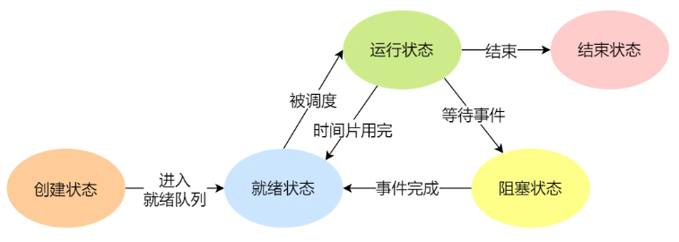

## 华资软件


#### StringBuffer StringBuilder联系

```
如果要操作*少量*的数据用 = String
*单线程*操作字符串缓冲区 下操作大量数据 = StringBuilder
*多线程*操作字符串缓冲区 下操作大量数据 = StringBuffer
```


#### SpringBoot特点

四大特性：

starter，自动化配置，Spring Boot CLI与Groovy的高效配合，Spring Boot Actuator
<font color="Pink">Spring Boot是为了简化Spring应用的创建、运行、调试、部署等而出现的，使用它可以做到专注于Spring应用的开发，而无需过多关注XML的配置。提供了一堆依赖。习惯大于约定。</font>

（1）快速开发spring应用的**框架**
（2）**内嵌**tomcat和jetty容器，不需要单独安装容器，jar包直接发布一个web应用
（3）简化maven配置，parent这种方式，一站式引入需要的各种依赖
（4）基于注解的**零配置思想**
（5）和各种流行框架，spring web mvc，mybatis，spring cloud无缝整合

#### 基本数据类型？占几个字节

| 关键字  | 字节 | 范围         |
| ------- | ---- | ------------ |
| byte    | 1    | -128~127     |
| short   | 2    | -32768~32767 |
| int     | 4    |              |
| long    | 8    |              |
| float   | 4    |              |
| double  | 8    |              |
| char    | 2    |              |
| boolean | 1    |              |


#### 项目中用到String场景


#### 线程和进程

1.线程进程是**资源**（包括内存、打开的文件等）分配的单位，线程是 CPU **调度**的单位；
2.进程拥有一个完整的资源平台，而线程只独享必不可少的资源，如寄存器和栈；
3.线程同样具有就绪、阻塞、执行三种基本状态，同样具有状态之间的转换关系；|
4.线程能减少并发执行的时间和空间开销；



进程通信方式：

1.管道：速度慢，容量有限，只有父子进程能通讯   

2.FIFO：任何进程间都能通讯，但速度慢   

3.消息队列：容量受到系统限制，且要注意第一次读的时候，要考虑上一次没有读完数据的问题   

4.信号量：不能传递复杂消息，只能用来同步   

5.共享内存区：能够很容易控制容量，速度快，但要保持同步，比如一个进程在写的时候，另一个进程要注意读写的问题，相当于线程中的线程安全，当然，共享内存区同样可以用作线程间通讯，不过没这个必要，线程间本来就已经共享了同一进程内的一块内存


#### 线程状态？怎么切换？

```
NEW:新创建
Runnable：start()方法
Running：获得了CPU时间片
Boocking：wait（）方法 sleep()，jpin()方法
Dead：run() main() 方法结束后，或者出现异常
```


#### 多线程，线程池？项目中怎么用到多线程？


ExecutorService

核心参数：初始化大小，最大线程数，核心线程数


 

#### 索引？优缺点？什么情况下不用索引

索引：对数据库表中一列或多列值排序的存储结构

优点：加快数据检索速度，加快表和表之间连接，使用分组和排序子句检索时，减少时间
缺点：占用物理空间，需要动态维护

不适合：不经常查询的数据就没必要
			经常更新的表
			唯一性差的字段
			数据表过大（5w），字段过长的（字符长40+），比如text ,image这种数据
​			查询使用了like 且，%在like左边
​			where 中有or的话InnoDB不用（所以用UNION替换OR会更好）
​			in /not in 会使用全表查询
索引失效：

​				使用左模糊，左右模糊匹配

​				对索引使用函数

​				对索引表达式计算

​				对索引作隐式类型转换

#### 三范式

| 范式 | 条件                                                         |
| ---- | ------------------------------------------------------------ |
| 1NF  | 所有属性（数据项）不可再分：**原子性**                       |
| 2NF  | 每一个非主属性**完全函数依赖于**候选码（多个候选码选一个为主码） |
| 3NF  | 非主属性不能传递依赖于码，也不能部分依赖于码                 |
| BCNF | 没有任何属性完全函数依赖于非码的任何一组属性                 |


#### 行锁和表锁哪个开销大

行锁

- **表级锁：** MySQL 中锁 **粒度最大** ，对当前操作的整张表加锁，加锁的开销小，加锁快，不会出现死锁，（因为要么一次性获取全部的锁，要么等待）。其锁定粒度最大，触发锁冲突的概率高，并发度低。
- **行级锁：** MySQL 中锁 **粒度最小** ，只针对当前操作的行进行加锁，加锁的开销大，加锁慢，会出现死锁。 行级锁能大大减少数据库操作的冲突。其锁粒度最小，触发锁冲突的概率低、并发度高。

#### 百万查询数据如何优化

尽量使用索引，而不是全表扫描
使用Enum而不是varchar

#### springBoot配置文件？yml？

采用两种全局配置：

application.properties

application.yml

除了默认的properties文件，SpringBoot还提供另外一种配置文件yml，这种文件提供一种更加简洁的方式编写配置信息。

yml是YAML（YAML Ain‘t Markup Language）语言的文件，是一种标记语言，以**数据为中心**，比json、xml等更适合做配置文件，有想法的可以去网上搜搜资料学习下。

参考语法规范：

官方参考: [http://www.yaml.org](http://www.yaml.org/)

yml学习参考：https://www.yiibai.com/yaml/yaml_syntax_primitives.html

#### springboot自动装配

#### 项目中用到的注解

```java
@SpringBootApplication//核心的注解，用在SpringBoot的主类上，标识这是一个 SpringBoot应用，用来开启SpringBoot的能力
@Configuration //用于定义配置类，可替换xml配置文件
@EnableAutoConfiguration//允许 Spring Boot 自动配置注解，开启这个注解之后，Spring Boot 就能根据当前类路径下的包或者类来配置 Spring Bean。
@ComponentScan//组件扫描，可自动发现和装配一些Bean。
@Bean 
@Component//是一个元注解，意思是可以注解其他类注解，如@Controller @Service @Repository。带此注解的类被看作组件，当使用基于注解的配置和类路径扫描的时候，这些类就会被实例化。
@Controller //控制器（注入服务）
@Service//服务（注入dao）
@Repository //dao（实现dao访问）
@RestController//注解是@Controller和@ResponseBody的合集,表示这是个控制器bean,并且是将函数的返回值直 接填入HTTP响应体中,是REST风格的控制器。
@Import// 用来导入其他配置类.
@ImportResource//和@Import类似，区别就是@ImportResource导入的是配置文件
@RequestBody//接受json格式的数据
@ResponseBody //返回json格式的数据
@RequestMapping //URL到Controller中的具体函数的映射。
@Autowired //自动导入依赖的注解，默认按照类型
@Resource // 自动导入依赖的注解，默认按照名称
@PathVariable//将url中占位符参数{x}绑定到类的方法形参上。


```


#### get和post

GET 的语义是**请求获取指定的资源**。GET 方法是安全、幂等、可被缓存的。

POST 的语义是**根据请求负荷（报文主体）对指定的资源做出处理**，具体的处理方式视资源类型而不同。POST 不安全，不幂等，（大部分实现）不可缓存。

#### HashTree 和 HashTable区别

`TreeMap`实现SortMap接口，能够把它保存的记录根据键排序,默认是按键值的升序排序，也可以指定排序的比较器，当用Iterator 遍历TreeMap时，得到的记录是排过序的。

#### Redis的使用，持久化？

AOF日志：记录写操作命令

RDB持久化

#### 如何优化SQL语句

依然是注意索引失效问题，避免全表扫描

#### 接口和抽象类，重写和重载


#### http和https

1. HTTP 是超文本传输协议，信息是明文传输，存在安全风险的问题。HTTPS 则解决 HTTP 不安全的缺陷，在 TCP 和 HTTP 网络层之间加入了 SSL/TLS 安全协议，使得报文能够加密传输。
2. HTTP 连接建立相对简单， TCP 三次握手之后便可进行 HTTP 的报文传输。而 HTTPS 在 TCP 三次握手之后，还需进行 SSL/TLS 的握手过程，才可进入加密报文传输。
3. HTTP 的端口号是 80，HTTPS 的端口号是 443。
4. HTTPS 协议需要向 CA（证书权威机构）申请数字证书，来保证服务器的身份是可信的。

#### 负载均衡？nginx


#### ==和equals

== 基本数据类型：值内容

== 引用数据类型：地址

equals：地址

重写后：值内容（常用的类已经重写过了）

#### 字符串的操作类

String，StringBuilder，StringBuffer


#### MyISAM  和InnoDB 区别

|                                       | **MyISAM**                                                   | **InnoDB**                                                   |
| ------------------------------------- | ------------------------------------------------------------ | ------------------------------------------------------------ |
| **构成上的区别：**                    | 每个MyISAM在磁盘上存储成三个文件。第一个文件的名字以表的名字开始，扩展名指出文件类型。   .frm文件存储表定义。   数据文件的扩展名为.MYD (MYData)。   索引文件的扩展名是.MYI (MYIndex)。 | 基于磁盘的资源是InnoDB表空间数据文件和它的日志文件，InnoDB 表的大小只受限于操作系统文件的大小，一般为 2GB |
| **事务处理上方面**:                   | MyISAM类型的表强调的是性能，其执行数度比InnoDB类型更快，但是不提供事务支持 | InnoDB提供事务支持事务，外部键（foreign key）等高级数据库功能 |
| **SELECT  UPDATE,INSERT**，Delete操作 | 如果执行大量的SELECT，MyISAM是更好的选择                     | **1.**如果你的数据执行大量的**INSERT****或****UPDATE**，出于性能方面的考虑，应该使用InnoDB表   **2.DELETE  FROM table**时，InnoDB不会重新建立表，而是一行一行的删除。   **3.LOAD  TABLE FROM MASTER**操作对InnoDB是不起作用的，解决方法是首先把InnoDB表改成MyISAM表，导入数据后再改成InnoDB表，但是对于使用的额外的InnoDB特性（例如外键）的表不适用 |
| **对AUTO_INCREMENT的操作**            | 每表一个AUTO_INCREMEN列的内部处理。   **MyISAM****为****INSERT****和****UPDATE****操作自动更新这一列**。这使得AUTO_INCREMENT列更快（至少10%）。在序列顶的值被删除之后就不能再利用。(当AUTO_INCREMENT列被定义为多列索引的最后一列，可以出现重使用从序列顶部删除的值的情况）。   AUTO_INCREMENT值可用ALTER TABLE或myisamch来重置   对于AUTO_INCREMENT类型的字段，InnoDB中必须包含只有该字段的索引，但是在MyISAM表中，可以和其他字段一起建立联合索引   更好和更快的auto_increment处理 | 如果你为一个表指定AUTO_INCREMENT列，在数据词典里的InnoDB表句柄包含一个名为自动增长计数器的计数器，它被用在为该列赋新值。   自动增长计数器仅被存储在主内存中，而不是存在磁盘上   关于该计算器的算法实现，请参考   **AUTO_INCREMENT****列在****InnoDB****里如何工作** |
| **表的具体行数**                      | select count(*) from table,MyISAM只要简单的读出保存好的行数，注意的是，当count(*)语句包含  where条件时，两种表的操作是一样的 | InnoDB 中不保存表的具体行数，也就是说，执行select count(*) from table时，InnoDB要扫描一遍整个表来计算有多少行 |
| **锁**                                | 表锁                                                         | 提供行锁(locking on row level)，提供与 Oracle 类型一致的不加锁读取(non-locking read in   SELECTs)，另外，InnoDB表的行锁也不是绝对的，如果在执行一个SQL语句时MySQL不能确定要扫描的范围，InnoDB表同样会锁全表， 例如update table set num=1 where name like "%aaa%" |

#### servlet生命周期

- Servlet 初始化后调用 **init ()** 方法。
- Servlet 调用 **service()** 方法来处理客户端的请求。
- Servlet 销毁前调用 **destroy()** 方法。
- 最后，Servlet 是由 JVM 的垃圾回收器进行垃圾回收的。

#### mybatis一级二级缓存

一级缓存又被称为 SqlSession 级别的缓存，二级缓存又被称为表级缓存。

> SqlSession 是SqlSessionFactory会话工厂创建出来的一个会话的对象，这个SqlSession对象用于执行具体的SQL语句并返回给用户请求的结果。
>
> SqlSession级别的缓存是什么意思？SqlSession级别的缓存表示的就是每当执行一条SQL语句后，默认就会把该SQL语句缓存起来，也被称为会话缓存

一级缓存是基于 PerpetualCache（MyBatis自带）的 HashMap 本地缓存，作用范围为 session 域内。当 session flush（刷新）或者 close（关闭）之后，该 session 中所有的 cache（缓存）就会被清空。

在参数和 SQL 完全一样的情况下，我们使用同一个 SqlSession 对象调用同一个 mapper 的方法，往往只执行一次 SQL。因为使用 SqlSession 第一次查询后，MyBatis 会将其放在缓存中，再次查询时，如果没有刷新，并且缓存没有超时的情况下，SqlSession 会取出当前缓存的数据，而不会再次发送 SQL 到数据库。

二级缓存是全局缓存，作用域超出 session 范围之外，可以被所有 SqlSession 共享。

一级缓存缓存的是 SQL 语句，二级缓存缓存的是结果对象

#### bean作用域

