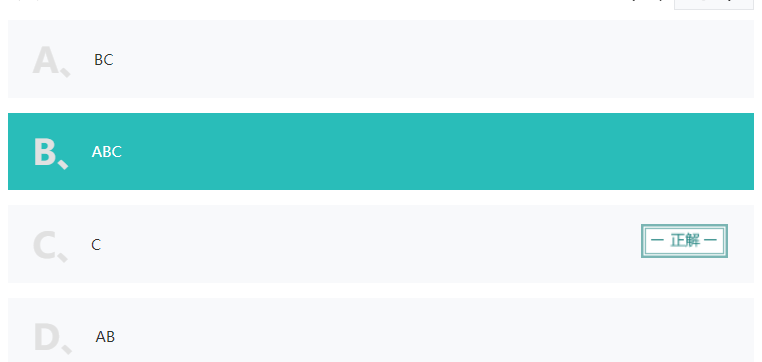
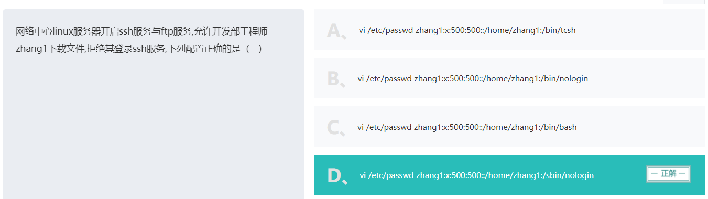
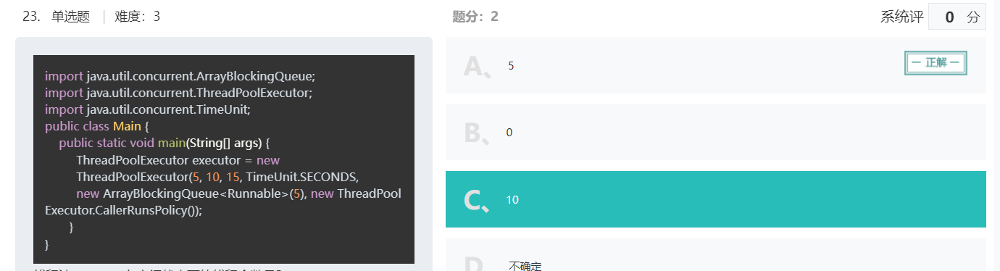
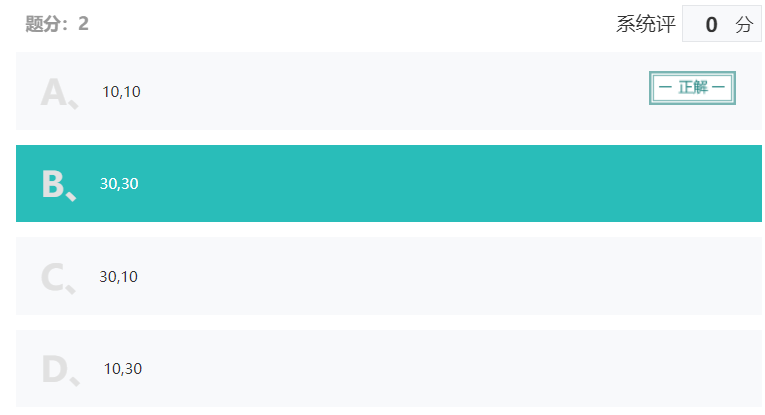
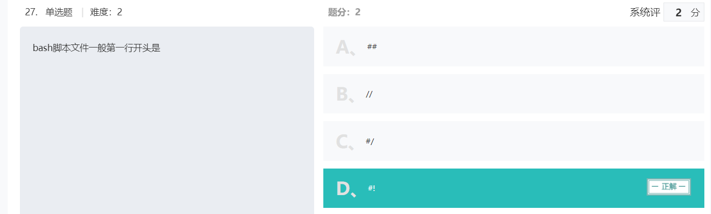
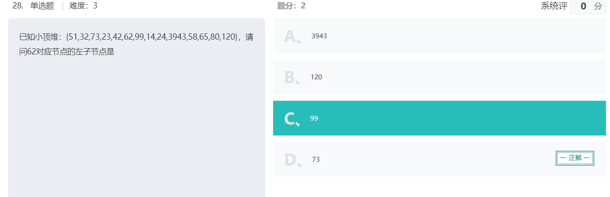

### 1.腾讯微信

背景
学历：
双非一本，软件工程大四在读

项目：
一个分布式的商城管理后台，简单的分布式系统
一个Spring cloud (nacos + gateway) + security + netty实现的分布式聊天室

实习：
2021.4 - 2021.8 腾讯IEG

更新：
add: 1.23 hr面
add: 1.24 已oc，准备沟通
add: 1.26 已offer，准备上班

一面（一个半小时）：
算法（一个小时）：

🎯topK，分别写出范围小、范围大、范围超大（说思路）的情况。
答： 分别是计数、快选、分治
🎯超大数计算，两个长度>100的数字进行加减法, 要考虑负数。
答：很简单，处理好进位借位就行
基础：（半个小时，时间比较短，感觉因为wxg用的是C++, 而我用的是Java，所以问的不多）

🎯堆和栈的区别是什么，哪一个需要程序员控制？

```
 1. 栈区（stack）: 由编译器自动分配释放，存放函数的参数值，局部变量的值等。
 2. 堆区（heap）: 一般由程序员分配释放， 若程序员不释放，程序结束时可能由OS回收。
 
 堆和栈中的存储内容
       1. 栈：在函数调用时，第一个进栈的是主函数中后的下一条指令（函数调用语句的下一条可执行语句）的地址，然后是函数的各个参数，在大多数的C编译器中，参数是由右往左入栈的，然后是函数中的局部变量。注意静态变量是不入栈的。当本次函数调用结束后，局部变量先出栈，然后是参数，最后栈顶指针指向最开始存的地址，也就是主函数中的下一条指令，程序由该点继续运行。
       2. 堆：一般是在堆的头部用一个字节存放堆的大小。堆中的具体内容有程序员安排。
```

🎯Java加锁有几种方式？
解答：[ Java 多线程加锁的方式总结及对比](https://blog.csdn.net/u010842515/article/details/67634813)

```
一.Java多线程可以通过：
	1. synchronized关键字
	2. Java.util.concurrent包中的lock接口和ReentrantLock实现类
	这两种方式实现加锁。
```

🎯不同进程中malloc函数返回的值会是相同的吗？（会，因为有虚拟内存）
🎯栈和队列在操作系统中有哪些应用场景？（递归和调度）
🎯Java的GC，新和老分别是什么算法？为什么？

```
1、需要GC的内存区域

jvm 中，程序计数器、虚拟机栈、本地方法栈都是随线程而生随线程而灭，栈帧随着方法的进入和退出做入栈和出栈操作，实现了自动的内存清理，因此，我们的内存垃圾回收主要集中于 java 堆和方法区中，在程序运行期间，这部分内存的分配和使用都是动态的。
```

🎯TCP和UDP的区别是什么？应用场景是什么？

```
从6个方面：
1、需要连接
2、一对一，多对多
3、可靠
4、拥塞、流量控制
5、首部开销
6、TCP流式传输
7、分片不同：TCP在传输层，MSS
			UDP在IP层，MTU
```

🎯你觉得微信聊天中哪些功能是UDP哪些是TCP？

```
聊天TCP
视频UDP
```

反问：

工作地点？（广州）
能给我一些建议吗？（对于一个知识点要深入挖掘）
二面（一个小时）：
算法（40分钟）：

剑指offer原题 1-n中出现了几次1
答：裂开来，虽然是剑指offer原题但是我没做过，现场推导了一个O(n)的数学法。面试官问有没有更好的方法，我说不会了，再推下去这面试就太久了
基础：（20分钟，我觉得时间短的原因同一面）

🎯Java里HashMap长度为什么是2的幂次？

```
- 使数据分布均匀，减少碰撞
- 当length为2的n次方时，h&(length - 1) 就相当于对length取模，而且在速度、效率上比直接取模要快得多
```

🎯HashMap如果不给长度，第一次初始化是在什么时候？

```
（put方法里）
```

🎯如果让你设计一个线程池，你会考虑什么东西？

```
完整的线程池需要具备：
	1、任务队列，用于缓存提交的任务
	2、线程数量管理：初始线程数量init，扩充最大数量max， 空闲时维护的核心数量core
	3、任务拒绝策略：拒绝策略和通知
	4、线程工厂：个性化定制线程
	5、QueueSize：存放提交的Runnable，且需要防止内存溢出
	6、Keepedalive：参数自动维护的时间间隔
```

🎯为什么要做一个聊天室？
🎯NIO的buffer区是双向的吗？
🎯你为什么用nacos，为什么不用eureka？为什么用gateway不用zuul？你怎么思考的？
反问：
没有反问环节，问完最后一个问题面试官说：总体不错，算你通过了。
然后就说要去开会了，直接退出了会议。
虽然没有反问环节但是我一点不介意是怎么回事？（狗头）

---------------------------------------面委分割线---------------------------------------.

面完二面大概一个小时，HR小哥哥打电话约面委，直接告诉我接下来会有两场面委，并且一次约了两场的时间
很慌，因为之前听说过面委的可怕，从收到面委邮件就开始紧张

有朋友问什么是面委？
面委全称面试委员会，是微信特有的一个面试轮次。面试官都是超级大佬（最低也是总监），且面试过程都是黑盒，面试者不知道面试官是谁（比如跨部门的大佬），面试官也只能看到你的简历和面试的岗位。面委会对面试者的能力进行再次考核，以便进行定岗定级。

一轮面委
基础：

实习做了什么？遇到过什么难点？是怎么解决的？
你遇到问题是更喜欢自己找答案还是去问别人？（先自己找答案，实在不行再去问。这样可以告诉别人我做了什么）
🎯为什么用协程不用线程？（因为协程更轻量级）

```
协程，又称微线程，纤程。英文名Coroutine。一句话说明什么是线程：协程是一种用户态的轻量级线程。


协程拥有自己的寄存器上下文和栈。协程调度切换时，将寄存器上下文和栈保存到其他地方，在切回来的时候，恢复先前保存的寄存器上下文和栈。因此：
协程能保留上一次调用时的状态（即所有局部状态的一个特定组合），每次过程重入时，就相当于进入上一次调用的状态，换种说法：进入上一次离开时所处逻辑流的位置。


协程的好处：

无需线程上下文切换的开销
无需原子操作锁定及同步的开销
方便切换控制流，简化编程模型
高并发+高扩展性+低成本：一个CPU支持上万的协程都不是问题。所以很适合用于高并发处理。


缺点：

无法利用多核资源：协程的本质是个单线程,它不能同时将 单个CPU 的多个核用上,协程需要和进程配合才能运行在多CPU上.当然我们日常所编写的绝大部分应用都没有这个必要，除非是cpu密集型应用。
进行阻塞（Blocking）操作（如IO时）会阻塞掉整个程序
最佳实践
线程和协程推荐在IO密集型的任务(比如网络调用)中使用，而在CPU密集型的任务中，表现较差。
对于CPU密集型的任务，则需要多个进程，绕开GIL的限制，利用所有可用的CPU核心，提高效率。
所以大并发下的最佳实践就是多进程+协程，既充分利用多核，又充分发挥协程的高效率，可获得极高的性能。
顺便一提，非常流行的一个爬虫框架Scrapy就是用到异步框架Twisted来进行任务的调度，这也是Scrapy框架高性能的原因之一。
```

🎯如果你的机器都跑不满，进程和线程和协程又有什么区别？
🎯线程一定比协程更好吗？
🎯http和https的区别？
🎯https数字证书交换的过程详细说一下？（这里说的有点乱，但是大佬说问题不大）
🎯TCP的accept()函数发生在第几次握手？（大坑我超，直接说是三次握手之后，大佬笑了一下说没坑到我）

```
客户端 connect 成功返回是在第二次握手，服务端 accept 成功返回是在三次握手成功之后
```

🎯进程调度有哪些算法？（按照批处理、实时、交互式区分了一下）

```
先来先服务
短作业优先
高响应比优先
时间片轮转
最高优先级
多级反馈队列
```

🎯那在Linux里调度用了什么算法？（都不是，用的完全公平调度程序CFS）

```
目前Linux支持三种进程调度策略，分别是SCHED_FIFO 、 SCHED_RR和SCHED_NORMAL；而Linux支持两种类型的进程，实时进程和普通进程。实时进程可以采用SCHED_FIFO 和SCHED_RR调度策略；普通进程则采用SCHED_NORMAL调度策略。从Linux2.6.23内核版本开始普通进程（采用调度策略SCHED_NORMAL的进程）采用了绝对公平调度算法，不再跟踪进程的睡眠时间，也不区分是否为交互式进程，它将所有的进程都统一对待，这就是完全公平的含义。
```

🎯11.1. 哦？介绍一下CFS？

```
cfs定义了一种新调度模型，它给cfs_rq（cfs的run queue）中的每一个进程都设置一个虚拟时钟-virtual runtime(vruntime)。如果一个进程得以执行，随着执行时间的不断增长，其vruntime也将不断增大，没有得到执行的进程vruntime将保持不变。
而调度器将会选择最小的vruntime那个进程来执行。这就是所谓的“完全公平”。不同优先级的进程其vruntime增长速度不同，优先级高的进程vruntime增长得慢，所以它可能得到更多的运行机会。
```

🎯Linux里进程通信有几种方式？（我刚说：可以分为消息传递模型和共享内存模型，大佬打断说ok了不错不错）

```
管道、共享内存、消息队列
https://blog.csdn.net/qq_44443986/article/details/115065540
```

🎯进程同步有几种方式？

```
进程同步的四种方法

1、临界区（Critical Section）:通过对多线程的串行化来访问公共资源或一段代码，速度快，适合控制数据访问。
优点：保证在某一时刻只有一个线程能访问数据的简便办法
缺点：虽然临界区同步速度很快，但却只能用来同步本进程内的线程，而不可用来同步多个进程中的线程。

2、互斥量（Mutex）:为协调共同对一个共享资源的单独访问而设计的。
	互斥量跟临界区很相似，比临界区复杂，互斥对象只有一个，只有拥有互斥对象的线程才具有访问资源的权限。
	优点：使用互斥不仅仅能够在同一应用程序不同线程中实现资源的安全共享，而且可以在不同应用程序的线程之间实现对资源的安全共享。
	缺点：①互斥量是可以命名的，也就是说它可以跨越进程使用，所以创建互斥量需要的资源更多，所以如果只为了在进程内部是用的话使用临界区会带来速度上的优势并能够减少资源占用量。因为互斥量是跨进程的互斥量一旦被创建，就可以通过名字打开它。
②通过互斥量可以指定资源被独占的方式使用，但如果有下面一种情况通过互斥量就无法处理，比如现在一位用户购买了一份三个并发访问许可的数据库系统，可以根据用户购买的访问许可数量来决定有多少个线程/进程能同时进行数据库操作，这时候如果利用互斥量就没有办法完成这个要求，信号量对象可以说是一种资源计数器。

 

3、信号量（Semaphore）:为控制一个具有有限数量用户资源而设计。它允许多个线程在同一时刻访问同一资源，但是需要限制在同一时刻访问此资源的最大线程数目。互斥量是信号量的一种特殊情况，当信号量的最大资源数=1就是互斥量了。
	优点：适用于对Socket（套接字）程序中线程的同步。（例如，网络上的HTTP服务器要对同一时间内访问同一页面的用户数加以限制，只有不大于设定的最大用户数目的线程能够进行访问，而其他的访问企图则被挂起，只有在有用户退出对此页面的访问后才有可能进入。）
	缺点：①信号量机制必须有公共内存，不能用于分布式操作系统，这是它最大的弱点；
②信号量机制功能强大，但使用时对信号量的操作分散， 而且难以控制，读写和维护都很困难，加重了程序员的编码负担；
③核心操作P-V分散在各用户程序的代码中，不易控制和管理，一旦错误，后果严重，且不易发现和纠正。


4、事件（Event）: 用来通知线程有一些事件已发生，从而启动后继任务的开始。
优点：事件对象通过通知操作的方式来保持线程的同步，并且可以实现不同进程中的线程同步操作。
缺点：

总结：
①临界区不是内核对象，只能用于进程内部的线程同步，是用户方式的同步。互斥、信号量是内核对象可以用于不同进程之间的线程同步（跨进程同步）。
②互斥其实是信号量的一种特殊形式。互斥可以保证在某一时刻只有一个线程可以拥有临界资源。信号量可以保证在某一时刻有指定数目的线程可以拥有临界资源。
```

🎯介绍一下管程？

```
所谓管程：指的是管理共享变量以及对共享变量的操作过程，让它们支持并发。翻译为 Java 就是管理类的成员变量和成员方法，让这个类是线程安全的。

是一种程序结构，结构内的多个子程序（对象或模块）形成的多个工作线程互斥访问共享资源。这些共享资源一般是硬件设备或一群变量。管程实现了在一个时间点，最多只有一个线程在执行管程的某个子程序。与那些通过修改数据结构实现互斥访问的并发程序设计相比，管程实现很大程度上简化了程序设计。 管程提供了一种机制，线程可以临时放弃互斥访问，等待某些条件得到满足后，重新获得执行权恢复它的互斥访问。
```

🎯CAS的原理是什么？（TSL指令，最终会在CPU上会执行LOCK CMPXCHG指令）
算法：

🎯给你一个数组, 把他变成大顶堆/小顶堆

反问：

以您的角度，我需要补充什么样的知识？（继续保持挖掘深度的热情，看得出你也比较有想法，要明白一切靠自己）
二轮面委
没有基础面试
算法

给一个二维数组, arr[i][j]代表点i -> 点j的距离，从0号点开始出发，遍历每一个点最后回到0号点，每个点只能经过一次，输出最短路径和路径的权值和
答：经典问题了，最后用哈密顿图解决，不过感觉dij也能做，有兴趣小伙伴可以研究一下。(但是处理输出处理了很久= =)
某城市有两种颜色的出租车：蓝色和绿色（市场占有比例为15∶85）。一辆出租车夜间肇事后逃逸，但还好当时有一位目击证人，这位目击者认定肇事的出租车是蓝色的。但是，他“目击的可信度”如何呢？公安人员在相同环境下对该目击者进行“蓝绿”测试得到：80%的情况下识别正确，20%的情况不正确。请问可以算出在有目击证人情况下肇事车辆是蓝色的概率为多少？
答：经典贝叶斯公式，注意识别正确有两种可能，分别是正确识别蓝车和错误识别绿车，最终答案41%
rand5()实现rand3()
rand5()实现rand7()
闲聊环节：

家住哪？（广州）
平时花在写代码上的时间多吗？（平均每天一道算法题，外加一下午写项目，如果下午没写完晚上还会写，写完了就打游戏）
反问环节

您对我有什么建议？（我觉得你很不错，不论是数学还是算法都做的很快，继续保持学习，加油）
HR面
自我介绍
实习期间有什么亮点
实习的时候为什么没有留下
实习最大的收获是什么
大一的时候去找老师做项目是自己主动去的吗？
为什么大一就想去做项目了？
在简历上你提到带了一个团队，能说说是为什么要带这个团队吗？初衷是什么？
你觉得自己的优点和缺点是什么？
家是住在哪里？
有打算过毕业之前来实习吗？
手上有其他的offer吗？
反问：

如果我想去实习，我需要做一些什么准备？
1.24更新，已oc，准备沟通
1.26更新，offer到了，定好了入职时间，开始踏入社会第一步
感谢
至此我的大学算是结束了一半了，很多感悟吧，8月份实习结束的时候就已经打算冲WXG了，但是这几个月一直碰壁，面了挂、挂了捞、捞了再挂。
拒了所有其他公司的面试，只面字节阿里和腾讯
10-11月份是我心态最崩盘的一段时间，早上不想起床，起床了只想打CSGO，没有任何动力，甚至觉得自己已经烂了（那时候硬是从刚接触csgo打到5e 1800）
在这段时间我非常感谢我的几个hxd @Doctorwu @charleschanv @hug-6... 一直在给我画饼微信有多好, 我也算是遵守约定在微信见面了
以及比我强多了但却一直抬我以至于让我真觉得自己很行的几位师(da)弟(lao): @korokseeds @Camille_Ferros @bao-ling-zhi-zi
还有在我连续四次三面挂差点remake的时候在我身边鼓励我的女朋友。虽然她不是这个专业的，但是愿意去了解包容我，给了我坚定的信心，让我感觉不是一个人在战斗
也非常感谢我实习四个月里不断指点我的mentor和leader，他们是我迈入社会的第一位指路人
还要感谢leetcode社区，在这里遇到了很有趣的大家，以及不那么有趣的周赛

作者：十二岁才读书
链接：https://leetcode-cn.com/circle/discuss/ON7r4A/
来源：力扣（LeetCode）
著作权归作者所有。商业转载请联系作者获得授权，非商业转载请注明出处。


### 2、面试学习建议

面试技巧

最近在给应届小伙伴们改简历，项目非常的相似，倒不是哪里培训出来的，而是大家学习都是来自哪些个视频。主要有：秒杀，商城。十个简历有九个写这两个。大家的学习路线也是惊人的相似。jvm 调优，spring 源码剖析，spring cloud 全家桶，微服务，分布式。整一个面试八股文，靠各种背诵常见考题度过面试季。

作为一个经历过无数次面试的面试官，咱们从一个面试官的心里来剖析一下面试官想了解到的东西。

项目面试

项目是面试官直通应聘者的途径，面试官通过项目，打开话茬，精准的了解应聘者的能力。优质的项目，是可以产出点东西的。比如说，一个可以玩的游戏，一个可以访问的网站，甚至自己的博客，这些项目都可以建立在真实的环境中，不是纸上谈兵，因而有了吸引力。

尽可能去实习。实习中的项目是最真实可信的，也是可以了解应聘者应对工作的能力。但实习也有要注意的，如果你实习了半年，但面试表现出来的是你对实习的工作了解得不够深入，会被认为潜力不行。

基础面试

对于一个应届生，除非简历上的经历足够亮眼，否则一视同仁。收上来的简历十个有九个是秒杀项目，这有什么好问的，一看就知道是网上自己看视频的。这时候面试官怎么去判断面前这个人是他想要的人呢？这么多人总要比个高低吧。于是面试题库出现了。

考察基础：每个领域的题库随机问一问，可以了解这个人的技术宽度和深度
考察潜力：看看最近你在学什么，学习速度是否足够快
牢记这两点，这就是大家需要去针对攻破的。

如何证明自己的潜力，请大家发挥一下自己的语文功底和创造力，使劲的吹你对这个工作多么热情和渴望，为了这个岗位你最近一段时间学到了多少东西。单位时间学的东西越多，说明潜力越大。这就证明了潜力。面试就是一个推销自己的过程，说自己多好多好，用各种理由来说明企业招你进去是英明的，每说自己的一个优势，必须想办法举证，口说无凭。我收到很多简历上面说自己学习能力强，十个有九个是这么说的，但没有证明的例子。这一块需要用上面的方法提前准备一下。

至于你编的故事是否会被采信，面试官会对你的故事中进行深度提问，以证明你的故事是真的。比如说，你说这个月对 redis 进行深入了解，那么面试官为了证明你说的话是真的，会围绕着 redis 提出 n 多的问题证明。这也是个面试小技巧，编故事，让自己最熟悉最不怕被问的领域暴露出来，让面试官来面。

如何证明自己的基础，这个没办法，工作经历少的人多多少少都会遇到。就是题库，使劲背。面试官也头疼，几百个应聘者要挑出几个拔尖的，只能靠题库来问。

学习建议

我很反对迎合面试的学习的。秒杀这种项目，虽然也能学到东西，但终究是纸上谈兵，没有那个环境，了解的就不会太深入。好的项目，自己本身就是使用者，自己出需求自己实现，然后给自己用，这样可以让项目真正的被使用。

如果没有真实项目，我建议抱团。几个人合伙做一个对自己有用的小产品或者小工具。一来可以让简历与众不同，二来可以在最真实的运行环境中实践。

项目举几个例子：

小游戏集合，类似于贪吃蛇，猜数字，2048，数独等等，偏前端，发布后还可以跟小伙伴一起玩，可以做评分排名等等，想象空间挺大
自建博客，简单的博客特别容易，建张表，把文章丢进去，后端根据路由取文章到前端渲染就完成了。博客想象空间也很大，可以用爬虫实现简单的头条，可以做新文章推送，可以做评论，可以做文章推荐，可以做关键字和谐等等。
自建聊天室，聊天室是 socket 通信的，会学到 netty ，消息队列，这些知识点。聊天室再扩展下去，可以做群聊，做联系人列表，做文件传输，做内网穿透等等，有兴趣可以山寨个微信出来。
至于那些什么微服务，分布式，可以学概念，但没必要非要动手，这些没有真实的场景动手了也没用。从自己最容易理解最容易实践的部分开始，一边实践一边学习，有了项目经验就会理解先贤们提出微服务、分布式的背景，那时候再学习这些方案，会事半功倍。

### 3.清北机械硕士

**个人背景**
top2纯纯的机械硕士，在校时很摸，20毕业后去国企呆了一年半，感受到了机械的辣鸡，遂转码。前后学了接近一年。项目方面抄了个y总的django课（没人问），实习无。

**面试汇总**
总共历时接近三周，前期投了一些练手公司，基本略去。由于是在职，因此全部约的工作日晚上或者周末面试，都很方便。忘记了不少东西，实际东西比这多一些，求谅解~

美的 一面 （offer）
商汤 二面（offer）
字节跳动 三面（offer）
腾讯WXG 二面（GG）
佳期投资 三面（offer）
美的(一面)
面的是虚拟人AI算法岗，总共就一面

**八股**
🎯说一说多态

```
一个对象变量可以指示多种类型，一个行为有多种表现形式
三个必要条件：继承、重写、父类引用指向子类对象
运行时自动选择哪种方法，称为动态绑定
```

🎯重载和重写的区别？以及分别的实现？

```

```

🎯static修饰符的作用
🎯说一说内存泄露以及常见解决方式
🎯说一说智能指针的底层原理以及常见类型和作用？
🎯虚函数实现方式，构造和析构分别是否可以是虚函数？
🎯引用和指针的区别
🎯size of 指针和引用分别返回什么
算法
🎯循环删除链表中和为0的连续节点，直到没有满足条件的节点，节点个数小于1000个。
🎯跳跃游戏V
🎯AI算法方面，说一说kmeans聚类（没学不会）
商汤科技（二面）
岗位是自动驾驶，应该是偏搜索算法，共两面

**一面**
**八股**
C++三大特性？以及分别解释一下
说一说函数重写?
构造函数能不能是虚函数？为什么？
析构函数能不能虚函数？为什么?
如果有虚函数是不是一个类对应一张虚函数表？
🎯什么是深拷贝浅拷贝?
说一说自己常用的stl和底层实现?
🎯线程的同步方式？
**算法**
偏实际应用的题，自动驾驶中，由于物体的运动，连续拍摄的图片中物体位置可能发生变化，如何判断两个物体是否是同一物体?（像素群对比？）
如果对于两张图片，已经给定一些物品的可能的相似度，如何确定对应关系？（二分图最大权匹配或最大费用最大流）
给两个矩形上下左右四条边的位置，求交并比（相交面积除相并面积）？
**二面**
聊天
商汤的工作介绍
自己的工作介绍，是否不可替代？
常用排序算法特点及实现方式
**算法**
🎯数组求次大及最大值（线性扫描）
🎯topK算法 （快速选择or堆排）

字节跳动（三面）

抖音国际化用户增长后端开发

2轮技术面 + 1轮hr面

**一面**
**八股**
🎯IO多路复用？追问select/poll/epoll区别
🎯进程间通讯方式？追问管道、命名管道、消息队列间的区别？共享内存为什么快？
🎯MySQL数据库如何优化？
🎯内存泄露是啥?避免方法是什么？
智能指针？追问shared_ptr存在什么安全性问题？如何解决,原理是什么？
🎯说一说websocket协议？
🎯如何实现一个聊天室系统？当用户量特别大的时候怎么办？
🎯说一说了解Redis的哪些知识?
🎯Redis为什么是单线程，有何优势？
**算法**

缺失的第一个正数(O(N)O(N)时间，O(1)O(1)空间)
给一个矩阵，每次可以向上下左右四个方向走，求最长上升路径。
**二面**
**八股**
这里问了一些网络框架，没用过So也没记住

**算法**
实现具有push pop 和 max 操作的栈，要求O(1)
实现反转函数，www.bytedance.com 变为 com.bytedance.www这样子
**Hr面**
主要关注点在为啥转码跳槽，对未来的规划等

腾讯（二面）

面的是WXG后端开发，二面寄寄，体验不太好，面试官都是迟到还中途溜

**一面**
**八股**
🎯了解哪些常用分布式框架？
C++面向对象的含义？
🎯MySQL底层数据结构?有什么优点?
🎯TCP为什么握手只要3次挥手却要4次？
🎯Linux中内存溢出如何调试?
**算法**
🎯A = 1， B = 2， AA = 27， AB = 28，实现将字符串转化为对应整数的函数，当越界时返回-1
🎯给一个旋转递增数组，求最小值，可能是 5 4 1 2 3 这样子，要求复杂度尽可能低（二分）
🎯打印将数字串一些拆分成小于1122的数的所有方案（记忆化搜索）
🎯给一个二叉搜索树，找从大到小的第四个数，（第四大的数），要求不能全部弄到数组里返回。（逆序的中序遍历）

🎯LRU 缓存
🎯LFU 缓存
场景设计
🎯设想一个情况，xx在看腾讯视频，然后程序被杀掉or断电，或者刚刚在用手机看，直接登录到电脑上续看，智能的从之前看的地方续看呢？（亿级用户背景下）
二面
八股
忘了一些，因为非常工程，所以有些名词没太听过记不住

thrift背后实现
nginx背后实现
**算法**
某个直播平台计划开发一个高热直播间监控系统，具体需求是：

可以管理所有直播，新开播就要加入到系统里面，直播结束就要从系统去掉
直播间热度是会不断变化（例如不断有人加入、点赞、送礼物、退出等因素），热度出现变化时往高热系统更新这个直播当前热度值（高频,时间复杂度希望尽量低）
运营人员日常巡查希望可以在任何时刻都知道当前热度最高的100个直播间（低频）
工行有30万个员工，其工卡号码分别是1~30万，在接下来的某天他们将举行年会，需要抽出10万个员工发奖品。

我们有一个随机数生成函数rand()能够生成(0~65535]的整数，请写一个公平的抽奖程序，输出这10万个员工的工卡号码。
进阶：30万抽 任意N个员工？
对于一棵满二叉排序树深度为K，节点数为 2^K - 12 
K
 −1 ；节点值为 1至 2^K-12 
K
 −1。给出K和任意三个节点的值，输出包含该三个节点的最小子树的根节点值

佳期投资
保密

**总结**
由于个人原因，总的来说八股方面问的比较少，算法偏多一些。另外面试官们都比较关心我毕业后选择去某国企以及后来转码的原因，还有对未来的规划。

最终综合考虑下选择了佳期投资。
广告模块：

佳期有赞助力扣春季战队赛，有内推名额，大家冲冲冲！求100个扣友来佳期carry我（工程经验巨拉的菜鸡）
刷题过程中，之前都是瞎刷一通，加入宫水三叶裙667574089后显著提高，里面氛围好，大佬云集，帮助极大，建议立马加群(5毛
残酷群对本人提升也极大，残酷群规，同样是大佬云集，群主人美心善，欢迎去撩~

作者：Misaka Mikoto
链接：https://leetcode-cn.com/circle/discuss/mL0gxC/
来源：力扣（LeetCode）
著作权归作者所有。商业转载请联系作者获得授权，非商业转载请注明出处。


### 4.三本学生

专业：软件工程（大数据方向，坑人不浅）

求职岗位：Java后端

**写简历**

简历我分了几个模块：个人信息、教育经历、专业技能、项目经历、证书、作品

**3月**

3月份开学，我开始写简历，大概花了1个多星期的时间，但是不太会写，最开始还有些语句不通顺、关键词大小写不合适的小问题，当时为了凑字数，也把一些课程写进去了，然后就直接投递了腾讯提前批，大概3月底就有了面试，当时面试问了我11个问题左右吧，我只答出了1,2个，而且回答得很少，简历上写的专业技能，被问到也不会，当时是电话面试的，10分钟就挂了，还问了学校是否三本、班级排名以及简历上写的 “综合奖学金” 是怎么样的，因为不够自信，在回答的时候简单地带过了。

面试结束后，意识到自己的基础还是很薄弱的，当时连 “接口和抽象类的区别” 都不太清楚，完全就是裸面。面试结束后，记录了面试的问题，也没有去回顾。然后开始去学 "Java虚拟机"，很快又有了腾讯的另一个部门的约面，因为上次挂了，被其他部门捞起来了，所以还是一面，当时问 Java基础较多，刚好问到 ”垃圾回收算法“，于是我就把刚看书记下来的内容完完整整的背了一遍，大概7分钟吧，说得我口干舌燥的，但是问到操作系统和网络的知识，我也答不出来，面试的当天晚上，发现已经挂了。

开学的时候，用 "hexo" 搭建了一个个人博客，然后就很疯狂地更新博客，一天更新 2~4 篇博客，大部分都是抄书的，写了60+篇后，感觉作用不大，花费了很多时间，也记不住就放弃更新了。

**4月**

4月份腾讯的一个部门又捞我了，这次面试，我只能回答20~30%，算法题也没做出来，当时回答不出来就用微笑来化解尴尬，不过还是很尴尬，估计是这3次都留下了不好的面评，比如 “基础不扎实”，之后再没有腾讯的面试机会了，如果没有准备好，不要拿心仪的公司练手，否则可能和我一样，留下了糟糕的面评。建议先面试大概率不会去的公司，先积累的面试经验，查漏补缺。

然后又面试了蚂蚁，是电话面试，主要是问项目，但是因为我项目经历写了一些不是自己做的功能，而又不熟悉，所以被问到后答得很糟糕，16分钟后，面试官就不问问题了，然后问我有什么想问的吗，于是我就和他请教了3个问题，一个是对我的建议，还有简历有什么需要修改的，还有一个问题我忘记了，他都给我说了很多，非常感谢他。

接着又面试了阿里，电话面试+手写单例模式，共一小时，单例模式我之前疫情的时候在家学过，但是没复习，写不完整，也有些地方错误了，在反问环节，我请教了2个问题，一个是对我这次面试的评价，另一个是问企业更看重什么知识模块，比如数据结构、算法等，然后老师和我说不能这样问，因为面试的过程自己应该是知道表现如何的，问评价就有点不自知的感觉了，而第二个问题，难道企业不看重你就不学了吗。我觉得有些道理，所以之后的面试反问环节，我通常会问在面试过程中没有回答上来的问题，也不知道是否正确，也有的面试官会让我私下自己去查，也有的面试官会给我大致的介绍一下。

经过这几次面试，我意识到自己的基础还是太差了，到处都是坑，所以决定不再继续春招，开始为秋招做准备。

这个时候是4月中旬。

**个人情况**

我当时的情况我觉得是这样的：

**Java**：基础语法忘记了很多，连接口和抽象类的区别都不太清楚。反射、注解、网络编程、IO流都忘记了。

**数据结构**：树和图的概念都不太记得了，B树、B+树、红黑树、AVL树是什么也不知道。

**算法**：知道怎么算时间、空间复杂度，只能写出数组、链表、队列、栈的简单题，树只会递归前中后序遍历，图的遍历不会，十种排序算法只会写冒泡排序，贪心、回溯、动态规划的思想也不懂。

**计组**：上课有认真听，课下有认真学过，概念还是比较清楚的。

**计算机网络**：每一层的作用都不清楚，TCP/UDP，HTTP，HTTPS都只能说1,2句概念。

**操作系统**：和没学过差不多。

**设计模式**：半年前在网上看了教程，都忘记了。

**框架**：用过Spring、SpringMVC、Hibernate写过后端接口，但是项目架构是复制粘贴的，自己不会写，只会用，只知道AOP、IOC的概念。

**前端**：HTML、CSS、JavaScript学过，但是此时连个表格都写不出来，也不知道JavaScript除了基础语法，还有DOM、BOM这2部分，AJAX也不会、Vue也不会。

这么烂的基础，再多面试机会我都觉得过不了，于是开始补基础。

笔试的选择填空题只能做一半，大厂算法题基本做不出来。

面试官的评价是 “基础不扎实”（我感觉这是最糟糕的面评）。

**4月中旬~5月底**

这个时候，我加入了《代码随想录》的知识星球，每天晚上在上面打卡，记录学了什么，还有自己的状态。

最开始，我在《代码随想录》这个公众号刷题，有一个算法导航，里面是高频面试题，我之后的面试也确实出现过几次里面的原题。里面的题目分为这几类：数组、链表、哈希表、字符串、双指针法、栈和队列、二叉树、回溯、贪心、动态规划。我从头开始刷，到五一劳动节假期结束后，差不多把二叉树刷完了，然后再从头开始刷第二遍，刷完第二遍后，开始刷回溯、贪心、动态规划的题目，到了5月21号，把题目刷完了，18号的时候有携程的笔试，用贪心做出了一题，其实可以用动态规划的，也刷过那题，但是刷太快了，没理解透，所以用动态规划没做出来。接着继续刷第二遍，当时每天什么都不做，就刷题，也到了疲倦期，刷吐了，在刷到第2遍动态规划时，只刷了一半就不刷了。

这1个半月差不多把150道题刷了1遍，二刷了120道题左右。

**6月初~6月中旬**

这段时间，我刷了一遍B站的《计算机速成课》视频，看了《Java并发编程之美》的前2章，里面有很多 demo，我都跟着敲了一遍，然后学了单例模式和工厂模式，写了代码，不过对它们的应用场景、优缺点没有了解，只知道是怎么样的。

计算机速成课：https://www.bilibili.com/video/BV1RA411Y76h?from=search&seid=9110463699021110687&spm_id_from=333.337.0.0

**6月中旬~7月中旬**

边准备考试和刷 “计算机网络” 的视频，本来很排斥学网络和操作系统的（看书看不下去，被劝退了），看视频发现还好。

到了6月底，开始投简历。

7月初开始刷操作系统的视频，看八股文。

**7月中旬~8月底**

开始有面试，有大厂，也有中厂，电话面试就录音、视频面试就录屏，面试结束后复盘。投了大概70份简历，笔试了十几家，面试了差不多10家，提前批有些是免笔试的。然后就是背八股文，但是我老是背不熟。

到了8月底拿了2个公司的意向书，然后9月份回学校了，回学校前还想着继续投简历面试的，但是因为拿了意向书，都没动力了，加上学校还要做项目实训，上3个星期的课，基本上这个时候未到秋招就结束了，说实话，躺平躺早了。

**总结**

找工作的经历，让我意识到了很多问题，沟通交流问题、语速慢、基础不扎实、学习方法不合适等。也在努力的调整，也收获了很多，成长了很多，有种蜕变的感觉说不出来。

合适的才是最好的；

对于别人的建议不能完全听取，要结合自己的思考；

人要 “自私” 一点，自己的成长更重要。

### 5、

**2021 秋招总结**

作为星球第一批准备秋招的人，经过这几个月的面试之后，感觉也算是有一些小小的经验了吧，就做一个简单的记录，希望能够为星球中准备秋招的伙伴们提供一些参考吧~

**序**

4月初加入星球，到9月底，一共5个月的时间。回顾之前在星球里面第一天的打卡，成功拔掉当初立的Flag~

从5月份开始，除了在星球里面频繁输出一些基础内容的理解，还陆陆续续的开始投简历，面试，等到秋招开始的时候，简历上的内容、基础的考察这些个人感觉没有啥大问题了。

如果从回校作为时间点，把秋招划分为上下半场的话，整个秋招的结果如下：

> 都是后端开发，一些未进入面试环节的公司就没有展示了

> ps: 腾讯一直没进面，有些遗憾~

1. 上半场：

- 百度 ✅
- 耗时一个月
- 阿里 ✅
- 耗时一个月
- 美团  ❌
- 三面之后，计划拿了意向，就不继续参与秋招了。结果等了两周收到了感谢信

   \2. 下半场：

- 字节 ✅
- 耗时两周
- 虾皮 ❌
- 面试体验很不好，然后等了三天也收到了感谢信
- Thought Works ✅
- 耗时两周，很新颖的面试形式

之前实习面试的一些公司，基本是给面就进了

整体来看投递的量其实挺少的，基本每个月有三、四家在走面试流程。后面秋招开始的时候，为了避免被一些事情搞心态，会主动去除一些特别看重院校的公司。最后又负气的投了一些一直挂我简历的公司，然后好好笔试，拒绝面试。

**如何准备**

首先的话，明确整体的大目标很重要，其次是选择大于努力。自己是从研究生入学开始，结合实际情况，就告诉自己真的不能再走算法这条路了。所以就计划重新搞后端开发，在罗列了一些后端开发的基础技术要求，并通过本科同学的亲身实践和网上一直关注的博主的进某某厂总结之后，就开始了自己的进厂准备了。

现在总结下来就是**算法、基础、项目、拓展**这四个方面。

**算法**

作为实习生或者说应届生，考察编码能力和逻辑思维最直观的方式就是算法题了。自己是从去年的三月份正式开始刷算法，当初计划疫情过去之后直接找实习的，不回学校了。最开始刷题的那段时间，简直就是一杯茶，一道题，一道算法敲一天 。持续到5月底，剑指Offer刷了两遍了，然后**top100**也都基本过完了。就开始计划整理刷过的题目，模块从 **链表->二叉树->字符串->回溯->贪心->动归-> 纯模拟题目/图**，基本就是耗一个上午，有时候还会和JDK的里面相关的实现对比下。然后晚上再把印象深刻的题目写博客上。实习之后，刷题就少了，有时候中午没事儿想起来的时候会过一道。

今年因为一些事情没办法参加春招，所以干脆从三月份继续开始了自己的一大段刷题的生活，最开始是自己的按照之前的套路重新开始刷，接着遇到了Carl哥的系列题解，然后开始结合着一起刷。再后面就开始了自己对一些算法模块的整理。差不多到了四月份，自己也趁着春招的尾巴，投了几家公司，结果笔试就把我卡住了。被打击之后，重新调整了自己刷题的计划。

1. LeetCode每天刷5道题左右，用于题型整理，自己也不停的通过题型抽模板
2. 在牛客上开始刷历年的笔试题，从最简单的开始刷， 输入输出熟悉的差不多了，就开始搞一些medium的题目
3. 因为笔试题的题目可能会比较复杂，所以又在AcWing上跟着闫总学了算法提高课程，没事儿的时候在AC Saber上刷一些基础的题。后面每天一两道的笔试题也都是在AcWing上做的。

到今年的6月底，Carl哥已经整理好的算法模块自己也跟着整理了一遍，复习了一遍。LeetCode上的TOP100、TOP200的题目都过了2遍左右。5月中旬左右开始参加LeetCode周赛（感觉周赛能稳定在3题，面试基本没问题，甚至还能多写几种实现），后面把AcWing上的周赛也加了进来。感觉算法刷到后面就跟打王者一样，前期打匹配练英雄，后期打排位，升段位~

貼下自己参加笔试的结果吧：

- 端点：2/2
- 便利蜂：2/3
- 网易：3.6/4
- 爱奇艺：2/3
- 阿里：2/2
- 腾讯：3/5
- 美团：3/5
- 京东：1.1/2
- 虾皮：3/3

刷算法的一些小建议：

\1. 尽量使用存白板模式写题，同时加强自己的debug的能力，

- 我们不能保证面试的时候写的代码直接AC，通过平时的debug，避免自己在面试时手足无措的情况
- 通过bug也能加深自己对该类型的题目的理解

\2. 先分析清楚题目，确定了整体思路，再开始硬编码，不然代码越写越乱

\3. 编码期间，可以先写好整体的逻辑，再做具体的细节实现

**基础**

基础内容特别特别的宽泛，自己是划分了**OS、计算机网络、数据库、Java、拓展**。对于基础知识的学习，个人感觉分为：**理解、总结、扩展**，这三个方面吧。

**理解：** 理解很重要，只有理解了我们才能将这些内容转化为自己的东西。并且理解了之后，我们才能更好的将这些内容表述出来。譬如以线程池为例，详细理解线程池内部的执行流程是怎么样的之后，就明白了几个核心参数分别都有哪些作用、JDK自带的线程池是这么定义这些参数的之后能够带来什么效果，同时会出现哪些问题、核心线程会被回收吗、线程池被创建后里面有线程吗等

**总结：** 通过自己的理解之后，在通过网上分享的一些优质的内容，修修补补基本上一个知识点的掌握就没啥问题了

**扩展：** 扩展是我们对知识理解的基础上，有自己亮点的地方。这个需要我们进行多加思考。譬如：既然MySQL中可重复读能够解决幻读，那么为什么还需要串行化这种隔离级别？然后我们可以阐述什么是幻读，当前读、快照读两种模式是如何解决幻读的，但是对于快照读+当前读混合的操作在可重复读下无法避免幻读，所以就需要上串行化了。

**OS**

整体划分为：**进程管理、内存管理、文件管理、IO**，比较高频的是进程管理、内存管理及几种IO模型的阐述。因为考研的时候理论知识已经重新学了一遍，所以整理期间，主要还是偏向实践多一些。

- 跟着B站的视频（南京大学-操作系统：设计与实现(蒋炎岩)）还有《操作系统导论》做了一些实操加深印象。
- 看CSAPP，完善一些基础概叙阐述，譬如：什么是虚拟内存、虚拟内存的管理、上下文切换涉及哪些内容、存储器层次结构这些。
- 时间充裕的话，可以做一下上面的lab。
- 看Linux/Unix系统编程手册上/下册

**相关问题**：

1. 进程线程的区别，僵尸进程、孤儿进程的区别
2. 进程的通讯方式有哪些，比较熟悉的是哪种，上下文切换开销为什么这么大，一些进程的调度算法
3. 死锁相关的问题
4. 虚拟内存的理解
5. I/O模型

**计算机网络**

- 网络的内容感觉还是要实战一下，不然永远记不住。复习期间是结合了《图解HTTP》，《TCP&IP网络编程》，《图解计算机网络（小林的图解）》这些书还有 wireshark 实操了一遍。

**相关问题：**

1. HTTPS和HTTP相关的内容等
2. TCP和UDP相关的内容，TCP粘包的问题和解决方式、一台机器最懂能创建多少TCP链接等
3. 网络层中IPV4的编址方式、为什么IPV6难以完全替代IPV4、ICMP相关内容等

**数据库**

数据库相关的话，面试中考察最多的是一些理论的东西，实际上需要的是对SQL的编写能力。自己最开始是先练习写SQL，从最开始在LeetCode上刷SQL题，然后再是实习的时候写的各种SQL（期间还问了导师和同事对SQL编写的注意事项），后面感觉自己写基础的SQL没啥问题了，就开始看一些理论的知识，主要参考了《MySQL实战45讲》和《MySQL技术内幕 InnoDB存储引擎》，最后重新理理解下

**相关问题：**

1. 一些原理：索引、事物、锁、事物日志
2. SQL的优化、主从复制、分库分表等偏实战些的内容
3. SQL的基础编写，DML有联合查询、子查询就差不多了。DDL可能会让写个建表的SQL，或者再原表的基础上新增个字段，添加个索引这种。

期间还看了一些写的很好的博客：

1. [解决死锁之路 - 学习事务与隔离级别](https://www.aneasystone.com/archives/2017/10/solving-dead-locks-one.html)
2. [MySQL索引背后的数据结构及算法原理](https://blog.codinglabs.org/articles/theory-of-mysql-index.html)
3. [何登成数据库相关内容](https://github.com/hedengcheng/tech/tree/master/database)

**Java相关**

因为一直用Java撸各种东西，所以面试的时候这方面的问题表现还不错，没有拉胯。学习过程中的话，做到多思考、多写一些边界case、带着问题看源码，就没啥大问题。

\1. 语法基础

> 书籍：《Java 编程的逻辑》、《Java核心技术I、II》

\2. 并发

> 书籍：《Java并发编程的艺术》、《深入理解Java虚拟机》、《美团的技术博客》

> 视频：寒食君--- Java并发编程系列

- 相关问题
- synchronized、volatile的阐述
- CAS的原理、使用场景、乐观锁相关
- AQS内部实现、以及依靠AQS的同步类比如ReentrantLock、CountDownLatch等的实现
- ThreadLocal的使用场景、内部实现

\3. JVM

> 书籍：《深入理解Java虚拟机》

- 相关问题
- 几种引用类型
- 双亲委派机制的作用
- 如何自己实现一个classloader打破双亲委派
- 内存区域划分
- GC以及GC收集器
- JMM
- JVM调优

\4. JDK内部的源码

> 可以结合一些优质的博客，对着源码不停的debug，理解其内部的实现机制（很多设计题，其实都能从这些源码里面找到思路~）

> java.util下Collection、Map的各种经典实现类的源码理解

> java.util.concurrent中锁的实现、同步工具的实现、阻塞队列的实现、并发集合的实现

- 相关问题
- ArrayList、LinkedList、ArrayDeque、PriorityQueue的底层原理
- HashMap如何解决hash冲突、为什么HashMap中的链表需要转成红黑树、扩容机制是怎样的、如何设计一个线程安全的HashMap
- 如何用TreeMap实现一致性hash、TreeMap的key为什么不会为null、key为什么必须要实现Compare接口
- LinkedHashMap了解基本原理，有哪两种有序方式、如何实现的，如何用它实现LRU
- ConcurrentHashMap如何保证线程安全的、有些方法是强一致性的吗
- CopyOnWriteArrayList是如何保证线程安全的

**项目**

项目的话，感觉只要把整个项目吃透几个点就差不多了，然后再通过面试完善一些自己没有注意到的地方。

实习前，是跟着论坛系统相关的课程敲了一遍。期间整理了一些可能会问到的技术点，譬如登录的问题、敏感词的处理、kafka的使用、定时任务等

实习后，就直接选了自己实际参与到的几个项目重新整理了下（技术架构、解决什么问题、期间遇到了什么坑、如何解决和这些坑的），包装成为自己的项目经历。

> 之前面试官建议是在阐述一个技术的时候，先阐述是在什么业务背景下是用的，为什么要采用这个技术，项目中遇到了什么问题或者这个技术本身有哪些不足，自己是如何解决的。再进阶一些，还可以阐述下该技术的边界在哪里，性能曲线是怎么样的，在什么样的数据范围内能够发挥其最佳的性能，同时为了能更好的使用这个技术，有哪些需要注意的地方。

**拓展**

自己是把**框架、中间件、微服务、Redis、RPC**划分为拓展的内容。在弄完了上述的基础内容之后，对这些技术有一定的实际应用，并且能够阐述出一两点的个人见解，应该是我们在面试中脱颖而出的地方。

\1. Spring

> 自己看的是《Spring揭秘》，必备Spring图书，哈哈哈

- 相关问题
- bean的生命周期、循环依赖问题、AOP的实现、Spring事务传播
- Spring MVC内部的执行流程
- Spring、Spring Boot、Spring MVC的关系

\2. Kafka

> kafka中文教程，一个博主写的内容，很实用

- 相关问题
- 消息的丢失
- 消息的重复消费
- 消息的积压
- 高性能的体现

\3. Redis

> Redis设计与实现、Redis核心技术与实战（极客时间）、张铁雷的博客（Redis内部数据结构详解系列、Redis分布式锁系列）

- 相关的问题
- redis性能为什么高
- redis有哪几种数据结构、底层如何实现
- redis的缓存淘汰策略
- redis如何持久化数据
- redis如何实现高可用
- 如何保证redis和DB中的数据一致性
- 如何解决缓存穿透和缓存雪崩
- 如何用redis实现分布式锁

**一些小建议**

回顾整个过程，发现自己两个阶段特别的焦虑：**去年7-8月份，今年3-4月份**

1. 去年是因为找实习，看一些公司要求写着要一定的实习经历，但是我还没有实习，哪来的实习经历
2. 今年是因为自己错过了春招， 担心等到秋招开始了，自己会不会更加没有优势

当初经常会不自觉的去想很多的问题，然后给自己徒增很多的压力。最后感觉实在想不清楚该怎么办，就干脆不想了。告诉自己处理好当下的事情，好好提升自身的硬实力，努力抓住每次的机会即可。然后给自己立下的要求是：只要给面试机会，就保证自己能进。结果还是被美团和虾皮打破了自己定下的要求~

贴一下准备期间一直鼓舞自己的一些话吧

> 当你不知道该做什么的时候，可以先把手上的事情做好。简单的事情做不好，就不会有机会去做不那么简单的事情

> Anything in life worth doing is worth overdoing. Moderation is for cowards.

**做任务记录**

因为准备期间整理的内容有些多，每天不能把复习的时间全部用来刷题，所以自己会每周末制定好下周的计划，等到下周末看下自己的完成情况，顺便星球里打个周总结的卡，根据实际的完成情况，再重新规划下后面的任务安排。通过这种形式，也能有效的减少自己的一些焦虑感。


**早做准备**

凡事预则立，不预则废。每年都有两个关键的时间点：

1. 实习：每年的3月份左右，差不多能持续到6月底左右
2. 秋招：从7月份算是正式开始，一般持续到11月份

尽量早做规划，不然的话可能很多事情会堆积在一起要做，最后弄得身心俱疲。可以提前开始投递简历、面试，这样在等到自己心意公司开放岗位的时候，通过之前那么多场面试的磨练，基本上能自己简历上的内容以及相关的延伸点知无不言，对一些技术栈也都能更好的阐述出来。

**尽量参加实习**

如果有机会，尽量的参加实习，接触到一些实际的开发。实习的好处还是挺多的

1. 不会的内容可以疯狂问，毕竟还只是个实习生。同时同事导师也都会很乐意的传授一些经验给我们
2. 学习公司内部封装好的工具类和组件，熟悉开发流程，并且通过code review的过程，不断的提升自己的编码规范以及一些其他的坏习惯

- 其实感觉在面试中的算法考核部分，面试官都会注意下候选人的编码习惯。

整个实习下来，自己的感悟就是干活的时候要把自己当正式工，问问题的时候把自己当实习生，开发期间多问问题、多揽活儿，多总结每个开发周期中遇到的问题，学习同事的一些编码技巧，整理一下接触到的线上问题、以及如何解决的。这样子就不会出现实习结束了，发现没有拿的出手的项目经历的尴尬局面。

**面试的注意事项**

**简历相关：**

1. 简历上写的内容一定要都掌握，并能够做适当的延伸
2. 项目经历简单明了，突出重点
3. 展现出自己的亮点，譬如自己博客上有一些好的文章、Github上有一些好的项目、在含金量高的比赛中获奖等

**面试中：**

1. 面试官的提问，要想清楚了再回答，理清自己的思路
2. 遇到不会的问题，可以询问一些思路，真的不会就直接说不会，切勿不懂装懂
3. 面试中保持自信、但不能自大
4. 每次面试完都记得到及时总结不好的地方，扫除知识盲区
5. 被问到为什么不在老东家申请转正这种问题，应该从自身发展等角度出发，而不是吐槽老东家

**多交流、多输出、不比较**

准备的过程中，加入一些氛围很好的小组、或者和一些小伙伴一起准备是一个很好的选择，不仅能够互相督促，而且还可以在分享的过程中取长补短。哪怕是偶尔的吐槽发泄下，也比自己崩溃要好很多。这个时候就要给Carl哥的知识星球疯狂打Call了。星球的伙伴们每天都会记录下当天的学习内容，有很多的经典系列，譬如：**Goaway🌲**之前的每日一问系列，**posper**的周赛记录、Java学习系列，**高欧叶尼兹**的数据库系列，**壮**的一些高频面经，**Nx**每天的LeetCode内容记录，以及大家每周末每月末的总结等。 看的时候除了能督促自己，还能加深自己对相应内容的理解，有时还能惊喜发现原来这些内容还能这么理解。在看到星球里面的伙伴提出的一些有趣的问题时，自己也会先把相关的内容再深入理解下，然后尝试去回答自己的理解。比较神奇的是，后续参与面试的时候，竟然能遇到相关的内容，amazing~ 

同时，每天的打卡也可以作为自己当天学习内容的整理和输出，个人觉得打卡的内容相比于博客更加考验自己对知识的总结，而且也能快速得到一些正向反馈（星球里面伙伴们的点赞和评论）

面试的过程中，不做一些没有意义的比较。只和之前的自己比较就行了，互相比较的意义不大。毕竟大家的简历内容、详细的技术栈都不太相同，即使是一个面试官，面试不同的人，提出的问题肯定也都不一定相同。结果并不能说明一切。我们只需要对自己的水平有个清楚的认识，并选择适合自己的公司，好好准备笔试、面试，不怕失败，但保证每次面试都有收获和提高即可，满意的Offer必然会来的。

**心态一定要稳住**

心态一定要稳住，不能自乱阵脚。不要因为简历挂了或者被面试官怼就否定自己。按照自己计划有条不紊的完善自己的知识体系，从面试中优化一些知识的理解才是最重要的。

### 6、百度面经

百度北京百度前端暑期实习 4.10一，二，三面，4.21正式oc。
牛客面试平台，需要你把简历发给面试官

一面技术面：
1.自我介绍
2.介绍项目
3.项目的难点
4.图片懒加载的原理与实现
5.JS的数据类型有什么
6.JS的事件循环原理
7.Vue.nextTick的原理
8.模块输出题
//a.js
const b = require('./b.js');
console.log(exports.x);
exports.x = 'x';
require('./c.js');
//b.js
const a = require('./a.js');
console.log(a);
a.x='y';
//c.js
const a = require('./a.js');
console.log(a.x);
运行node a.js的结果
9.UDP与TCP的区别
10.说一说HTTP协议
11.手写防抖和节流函数
12.反问（一般你的mentor就是你的一面面试官）

二面技术面：
1.自我介绍
2.介绍项目
3.项目的难点
4.组件库中按需引用的原理
5.B站弹幕遮罩的原理，弹幕穿过人物不会遮挡人物的原理
6.反问

三面技术+HR面：
1.自我介绍
2.介绍项目
3.项目难点
4.闲聊（聊得相当愉快，很加印象分）
5.常规HR面，问你兴趣爱好，学前端多久怎么学的，坚持最久的事情，最有挑战性的事情
6.闲聊的时候聊到岗位，出了个思维题。有打车系统，现在有两个订单，后台根据什么去规划路线。
7.反问
有一些面试题已经忘记了，总之一面的难度最大，其余两面主要考察项目的掌握程度和思维灵活度。运气比较好，和终面面试官聊得比较好oc了。


经验分享
在一个半月的时间后，经历了数不清的笔试和面试，最后只拿到了百度一个offer。
下面以自己浅薄的认知谈谈前端暑期实习这件事。
首先，对于第一次面试的同学来说，在面试大厂前一定要先面试一些小厂。一方面去感受面试的氛围与难度，另一方面是认清自己，给自己后续的面试更大的动力。
我的第一次面试给了蓝湖，面试的难度不高，猛烈的紧张感让我变得束手束脚甚至出现脑子宕机窘迫的状况。面试中会出现让你手写CSS代码，比如说实现垂直水平居中，实现三角形，实现1px边框等等，在准备CSS的过程中这些代码都必须熟记于心，否则会因为紧张而出现失误。除此之外，介绍ES6的特性，面试官会让你手写ES6新特性的使用场景，这些在准备的过程中都要写得很熟：手写Promise，手写防抖节流，手写......这些东西后续我会好好整理一下再分享给大家。
其次，一定要自信，杜绝一问一答式的回答问题。为什么呢，因为面试是一个择优找亮点的过程，对于两个同样答对所有问题的面试者，面试官一定会青睐扩展度更高知识面更广的那一位。简单来说，熟背八股并且把不同八股之间建立联系，例如在介绍Vue.nextTick的原理时，涉及到事件循环的知识也可以一并介绍出来。
最后，推荐一个我面试时常用的八股面试宝库，希望能帮到大家。https://vue3js.cn/interview

### 7、众安保险

众安保险是第一家互联网保险公司，当时因为说没有笔试直接面试，所以我想蹭个面试经验。一直到面试前我才发现原来我有这么多知识点没有学。
JVM类加载机制，
nginx怎么做到负载均衡。
HashMap的红黑树和扩容机制。怎么用前缀树过滤敏感词。
计算机网络问题。
JVM垃圾回收机制。
线程安全，
IO多路复用。
讲一下抽象类和接口的区别
讲一下static和final的作用
什么时候会不能用static
string可以被继承吗
synchonized 和 locked的区别
synchonized底层实现原理
多线程的用过吗
多线程创建的方式
线程池怎么用，核心参数，整个执行的过程：还有个消息队列里面
InnoDB和Mysam搜索引擎的区别，索引的区别
Innodb索引介绍下
他的锁介绍下
问我项目里选课Redis当中数据不一致性怎么解决的
redis三大问题介绍一下
Kafka如果有三个分区，四个consumer会怎么样
反问
总共30分钟

### 内存2G，这么对100亿条数据排序

**大数据小内存[排序](https://www.nowcoder.com/jump/super-jump/word?word=排序)问题**，很经典，很常见，类似的还有比如 “如何对上百万考试的成绩进行[排序](https://www.nowcoder.com/jump/super-jump/word?word=排序)” 等等

大概有这么三种方法：

- 数据库[排序](https://www.nowcoder.com/jump/super-jump/word?word=排序)（对数据库设备要求较高）
- 分治法（常见思路）
- 位图法（Bitmap）

1. 数据库[排序](https://www.nowcoder.com/jump/super-jump/word?word=排序)

将存储着 100 亿数据的文本文件一条一条导入到数据库中，然后根据某个字段建立索引，数据库进行索引[排序](https://www.nowcoder.com/jump/super-jump/word?word=排序)操作后我们就可以依次提取出数据追加到结果集中。

这种方法的特点就是操作简单， 运算速度较慢，对数据库设备要求较高

2. 分治法

假设 100 亿个数据都是 int 类型的数字

1 个 int 类型占 4 个字节（byte，B）

1 B = 8 位（bit）

1024 B（1024 B = 1KB） = 8 * 1024 bit

1024 * 1024 KB（1024KB = 1MB）= 1024 * 8 * 1024 bit

100 亿 int 型数字就是 100 亿 x 4B = 400 亿 B = 38146.97265625 MB 约等于 37.25GB

100 亿个 int 型数字大概占 37 个 G，2G 内存显然一次性是装不下的。

最常见的思路，拆分成一个一个的小文件来处理呗，最终再合并成一个排好序的大文件。

典型的分治法

1）把这个 37 GB 的大文件，用哈希或者直接平均分成若个小文件（比如 1000 个，每个小文件平均 38 MB 左右）

2）拆分完了之后，得到 1000 个 30 多 MB 的小文件，那么就可以放进内存里[排序](https://www.nowcoder.com/jump/super-jump/word?word=排序)了，可以用快速[排序](https://www.nowcoder.com/jump/super-jump/word?word=排序)，归并[排序](https://www.nowcoder.com/jump/super-jump/word?word=排序)，堆[排序](https://www.nowcoder.com/jump/super-jump/word?word=排序)等等

3）1000 个小文件内部排好序之后，就要把这些内部有序的小文件，合并成一个大的文件，可以用堆[排序](https://www.nowcoder.com/jump/super-jump/word?word=排序)来做 1000 路合并的操作（假设是从小到大[排序](https://www.nowcoder.com/jump/super-jump/word?word=排序)，用小顶堆）：

- 首先遍历 1000 个文件，每个文件里面取第一个数字，组成 `(数字, 文件号)` 这样的组合加入到堆里，遍历完后堆里有 1000 个 `(数字，文件号)` 这样的元素
- 然后不断从堆顶 pop 元素追加到结果集，每 pop 一个元素，就根据它的文件号去对应的文件里，补虫一个元素进入堆中，直到那个文件中的元素被拿完
- 按照上面的操作，直到堆被取空了，此时最终结果文件里的全部数字就是有序的了

3. 位图法（Bitmap）

位图法的基本思想就是利用一位（bit）代表一个数字，例如第 3 位上为 1，则说明 3 这个数字出现过，若为0，则说明 3 这个数字没有出现过。很简单~

上面分析过，1M = 8388608 bit（800 多万）

也就是说，**通过位图法，只需要 1M 的空间，我们就可以处理 800 多万级别的数据**

Java 中没有 bit 这样的基本数据类型，最小数据类型是 `byte`，我们可以用 **byte 数组**来实现这个位图法

byte 数组上的每一个元素都是 byte 类型，一个 byte 等于 8 个 bit，我们可以把 10 进制的 byte 用二进制的 bit 来表示，如下图：


这样，byte 数组中的一个元素就能表示 8 个数字是否出现过，比如 byte[0] 可以表示 0 ~ 7 是否出现过，byte[1] 可以表示 8 ~ 15 是否出现过.....

全部处理完之后，我们**从前往后遍历一遍 byte 数组**就能获取到有序数据了，时间复杂度为 O(N)


java.util 封装了 `BitSet` 这样一个类，是位图法的典型实现


底层用的 long 数组，一个 long 型数据占 8 个字节（64 位，也就是说 long 数组中的一个元素就可以表示 64 个数字否出现过），占比与只占 1 个字节的 byte（8 位） 来说，能存储的数据更多了

```
BitSet bitSet = ``new` `BitSet();``bitSet.set(``0``, ``2``, ``true``);
```

上面的代码的含义是，第 `[0,2)` 位会被设置成 1，也就是说这个类会自动地生成一个 long 型的元素，二进制表示是 `.....(省略 60 个 0) 0011`，十进制表示就是 3


位图法的缺点：

- 可读性差（不是一般的差 🤔）
- 位图存储的元素个数虽然比一般做法多，但是存储的元素大小受限于存储空间的大小。要想定义存储空间大小就需要实现知道存储的元素到底有多少
- 对于有符号类型的数据，需要用 2 位来表示，比如 第 0 位和第 1 位表示 0 这个数据，第 2 位和第 3 位表示 1 这个数据......，这会让位图能存储的元素个数，元素值大小上限减半

### 8、美团

一面
1.挖项目，问的太多了，这里就不一 列举了，大部分是某个功能是怎么实现的或者如果要加某个
功能应该怎么实现。
2.进程线程区别。
3.死锁，死锁条件。
4.知不知道中断和轮询的区别。
5.数据库索引,讨论了一下B+树能存多少数据。
6.数据库存储弓擎知道哪些，有什么区别。
7.数据库锁。
8.算法题:起始点到终点最短路径。

[你在java面试中被问过什么让你觉得对方逼格很高的问题？ - 知乎 (zhihu.com)](https://www.zhihu.com/question/53673888/answer/2539159443)

### 9.字节

**一面(60分钟)**

1. 自我介绍。
2. 问项目：登录鉴权是怎么做的？为什么采用 JWT 的方式？有什么好处？如何防止 Token 被篡改？
3. 问项目：如何使用缓存的？技术选型的考虑？为什么要用 Sorted Set 实现排行榜？Redis 数据同步和数据迁移如何做？
4. 问项目：如何防止表单重复提交？
5. 问 Spring：怎么理解 AOP的？你在项目中是怎么使用的？Spring AOP 和 AspectJ AOP 有什么区别？
6. 问线程池：如何理解线程池、参数、拒绝策略、原理？你的项目是如何使用线程池的？如果然你设计一个线程池，你会怎么做？
7. 问 Java 并发（这块问的太深入了，顶不住啊。。。）：进程和线程，了解协程吗？JMM 的理解，作用。happens-before 原则的理解，作用。Java 里面的锁你知道哪些？synchronized 关键字的理解、原理、锁升级过程。AQS 了解、原理。`ReentrantLock` 源码。`ThreadLocal` 理解、原理、内存泄露问题。
8. 继续问 Java 并发：手写 DCL（Double Check Lock） 线程安全方法。为什么需要加 volatile?  volatile 的作用、底层原理。
9. 问计算机网络：HTTPS 和HTTP 区别、 HTTPS 加密过程。
10. **Leetcode 199. 二叉树的右视图**[1]
11. ......

**参考答案** （根据面试问题的顺序排序，部分微信外链无法直接打开，建议文末阅读原文） ：

- [虾皮二面：什么是 JWT? 如何基于 JWT 进行身份验证？](https://mp.weixin.qq.com/s?__biz=Mzg2OTA0Njk0OA==&mid=2247521430&idx=1&sn=7a83ec7642d75b1d2352139db5f0ff3b&scene=21#wechat_redirect)、[虾皮二面后续：JWT 身份认证优缺点](https://mp.weixin.qq.com/s?__biz=Mzg2OTA0Njk0OA==&mid=2247523246&idx=1&sn=afba419762ec10739c24b1ac0d774e29&scene=21#wechat_redirect)
- **Redis 5 种基础数据结构总结**[2]
- [招银网络一面：AOP 了解吗？有什么用？切面执行顺序如何控制？](https://mp.weixin.qq.com/s?__biz=Mzg2OTA0Njk0OA==&mid=2247527180&idx=2&sn=9954664bba1b63a492a2c533413d7eaa&scene=21#wechat_redirect)
- **Java 线程池详解**[3]、**面试题 -- 如何设计一个线程池**[4]
- **JMM（Java 内存模型）详解**[5]
- **AQS 详解**[6]
- **Java 并发常见面试题总结（上）**[7]、**Java 并发常见面试题总结（中）**[8]
- **ReentrantLock源码详细解读**[9]
- **HTTP vs HTTPS（应用层）**[10]

**二面（50分钟）**

1. 自我介绍。
2. 问计算机网络：HTTPS 和HTTP 区别、SSL/TLS 的工作原理、中间人攻击了解吗？
3. 问计算机网络（比较深入，有一些没有回答上来，还是要多补补基础）：TCP 与 UDP 的区别，TCP 三次握手四次挥手，`TIME-WAIT` 和 `CLOSE-WAIT` 是干什么的？为什么要三次握手两次不行吗？有大量连接处于 `TIME-WAIT` 的原因？TCP 是长连接还是短连接？
4. 问计算机网络：从输入URL到浏览器显示页面的流程。
5. 问数据库：MySQL 索引的理解、底层数据结构。如何看 SQL 语句是否使用了索引？
6. 问数据库：如何理解事务？表级锁和行级锁的理解，幻读、脏读问题的解决。
7. 问 JVM：GC 如何判断回收的垃圾对象？GC 算法有哪些？Minor Gc 和 Full GC 有什么不同呢？ZGC 垃圾回收器了解吗？
8. 问 JVM：双亲委派模型的理解，有没有在项目中实践过自定义类加载器。
9. 问场景题：几十G的数据都是URL，内存空间只有1G，磁盘空间无限，统计频率最高的Top 10；
10. **Leetcode 32. 最长有效括号**[11]、**Leetcode 110. 平衡二叉树**[12]
11. ......

**参考答案** （根据面试问题的顺序排序，部分微信外链无法直接打开，建议文末阅读原文） ：

- **HTTP vs HTTPS（应用层）**[13]、**你连 HTTPS 原理都不懂,还讲“中间人攻击”?**[14]
- [TCP 与 UDP 的区别？](https://mp.weixin.qq.com/s?__biz=Mzg2OTA0Njk0OA==&mid=2247527975&idx=2&sn=31cae9ed8e0684ab531a6fa2fcaafa01&scene=21#wechat_redirect)、[TCP 为什么要三次握手?](https://mp.weixin.qq.com/s?__biz=Mzg2OTA0Njk0OA==&mid=2247528113&idx=2&sn=6797568d6f94cef0c099e736730d33bf&scene=21#wechat_redirect)
- **从输入URL到浏览器显示页面的流程**[15]
- [深入理解 MySQL 索引底层原理](https://mp.weixin.qq.com/s?__biz=MjM5ODYwMjI2MA==&mid=2649745671&idx=1&sn=023b34272c8bbd5a989768862a895671&scene=21#wechat_redirect)、[最完整的Explain总结，SQL优化不再困难](https://mp.weixin.qq.com/s?__biz=MzUyOTg1OTkyMA==&mid=2247484391&idx=1&sn=c478efeed839831a5dc806536029f2b7&scene=21#wechat_redirect)
- [MySQL 事务的默认隔离级别是什么?可以解决幻读问题么？](https://mp.weixin.qq.com/s?__biz=Mzg2OTA0Njk0OA==&mid=2247521090&idx=2&sn=5b4c370ff7f0b7e8ad63d890bf47cb8d&chksm=cea1dc89f9d6559f13962afaef776d042d1f17fc8bb3c03ef7c2c69380908611ba155ecc918d&scene=21&cur_album_id=1352302538565189634#wechat_redirect)、[MySQL 中有哪些锁？表级锁和行级锁有什么区别](https://mp.weixin.qq.com/s?__biz=Mzg2OTA0Njk0OA==&mid=2247523718&idx=1&sn=56f8e746f3fd3d4175449c9a2b0ec7b4&chksm=cea1d24df9d65b5b582d198b4c349acb96131001c09a86d82d77338b40baf65077ae32e391e1&token=371859028&lang=zh_CN&scene=21#wechat_redirect)
- **JVM 垃圾回收详解**[16]、[新一代垃圾回收器ZGC的探索与实践](https://mp.weixin.qq.com/s?__biz=MjM5NjQ5MTI5OA==&mid=2651752559&idx=1&sn=c720b67e93db1885d72dab8799bba78c&scene=21#wechat_redirect)
- **类加载器详解**[17]、[JVM自定义类加载器在代码扩展性的实践](https://mp.weixin.qq.com/s?__biz=MzI4NjY4MTU5Nw==&mid=2247493386&idx=1&sn=8cfa5a4c3104ff994ab82ec1bc50883b&scene=21#wechat_redirect)
- [10 道 BAT 大厂海量数据面试题（附题解+方法总结）](https://mp.weixin.qq.com/s?__biz=MzIxNjA5ODQ0OQ==&mid=2654701402&idx=1&sn=913c44e7fe795c20393078f7039fbd6a&scene=21#wechat_redirect)、[海量大数据处理面试题和思路总结](https://mp.weixin.qq.com/s?__biz=MzI0Mjc0MDU2NQ==&mid=2247485455&idx=1&sn=ddaf2b3eaccb7c803492ca769b322b5c&scene=21#wechat_redirect)

**三面**

这一面问的技术问题变少了很多，更多的是和面试官交流技术思维。

1. 自我介绍。
2. 你感觉你一二面表现的怎么样？
3. 除了 Java 你还学习过什么其他的编程语言么？我说了 C 语言。面试官紧接着让我说说 Java 和 C 的使用感受，应用场景。
4. 爬虫有了解吗？大学的时候写过爬虫没有？如何构建一个爬虫代理服务？
5. 分布式缓存设计、缓存问题解决思路（雪崩、穿透）。
6. 自己做过印象最深的一个项目，学到了什么。
7. **Leetcode 44.二叉树每层找最大值**[18]
8. ......

**参考答案** （根据面试问题的顺序排序，部分微信外链无法直接打开，建议文末阅读原文） ：

- **如何构建一个爬虫代理服务？**[19]
- **解析分布式系统的缓存设计**[20]

### 10.字节一二三面

作者：我就不呢
链接：https://www.nowcoder.com/discuss/988978
来源：牛客网

一. 一面 

  \1. 对两个项目进行了详细的提问，然后开始八股基础考察。 

   **[数据]()库** 
   \2. mysql底层[数据]()结构，为什么使用。 
[mysql底层数据结构与算法]([(10条消息) mysql底层数据结构与算法_顾憶年的博客-CSDN博客_mysql底层算法实例](https://blog.csdn.net/whileuncle/article/details/114890410))

  \3. mysql事务以及相应的保证（ACID分别是用什么保证的）。 ([事务的acid如何保证](https://blog.csdn.net/YangYoung_/article/details/117195841))

  \4. 提到了redo log 和 undo log 介绍一下。 

  \5. 提到了redo log，讲一下另一个log (bin log)，以及两阶段提交，为什么要两阶段提交。 

  \6. 提到了redo log刷盘， 讲一下刷盘时机和策略。 

​     **缓存** 

  \7. [redis]()为什么受欢迎，详细讲一讲底层[数据]()类型及其对应的底层[数据]()结构实现。 
   \8. 介绍一下缓存雪崩、穿透、击穿以及相应的解决方案。 

  \9. [redis]() 的持久化机制（RDB，AOF），这个没让详细说，大概讲一下，我就只大概讲了一下分别是什么然后干了什么事情。 

​     **计算机网络** 

  \10. https怎么保证通信安全的。 

  \11. 提到了数字证书，为什么需要数字证书。 

​     **[算法]()** 

  12.正数数组，一个target，求和大于等于target的最小连续数组长度（滑）。在飞书上写代码，是acm模式，但是没让写输入输出，用第一个测试用例测试，并说了下思路。 
   **反问** 

  \13. 我能问几个问题。（原则上无限，但注意时间）。 
   \14. 评价及建议。（还行，通用的建议，加强中间件的学习）。 

  \15. 部门业务。(balabala，部门用go）。 

   二. 二面 

  二面昨晚面的，场景题占大部分，问了一点小八股。感觉二面面试官太厉害了，压力满满。在回答的时候我只能尽可能的从学过的知识中找到可以用来解决的方法，运气好获得了面试官的肯定，约的下午三面。我现在脑袋都是晕乎乎的（昨晚没睡好。。）。暂且留坑，攒攒人品，希望下午一切顺利。 

​     \1. 两个项目继续轰炸，然后开始场景题。 

  \2. 场景题题目我就不说了，大概意思就是怎么查询一个视频被点赞的用户（[数据]()量可能上千万）；在查询基础上增加时间条件呢；这么大的[数据]()怎么判断到底点没点赞。 

​    然后来了几个八股 

  \3. redis底层数据对象及实现。 

  \4. GEO干嘛的，怎么实现的（提到了GEO数据对象）。 

  \5. Mysql底层数据结构，选用原因。 

 6.算法。全排列

​     **体验** 

  面试官太厉害了，我五体投地。不过好在面试官很愿意听我说，场景题虽然说了很多然后被pass但还是在鼓励我说（org...） 
  三. 三面 

  感觉是个技术上的大牛，问了很多我听都没听过的东西（我都不知道怎么拼写），面试官一直在说没关系。 

​     一道设计题： 带过期时间的LRU。 

​     细问了其中一个项目，对其中的框架设计问了一点。 

​     个人优缺点。 

   学校经历。 

### 11.多场

#### 一面字节

第一次面字节，挺紧张，比较喜欢深挖问题，算法只写出了第二个。

2022.8.2-字节跳动-后端开发工程师（C++）-一面（1h30min）

- 自我介绍
- select,poll,epoll区别
- epoll rd准备队列如何维护
- ET,LT模式区别
- UDP需要LT和ET吗，为什么
- TCP数据流传输如何理解（怎么确定边界）
- malloc和new区别
- malloc如何分配空间（mmap,brk）
- brk是系统调用吗
- brk频繁调用有什么问题（上下文切换消耗）
- 知道JeMalloc,tcMalloc,ptMalloc吗（不知道）
- brk如何申请小字节数（申请至少一页，即使小字节数低于一页）
- 系统调用的开销（CPU上下文切换）
- 如何优化brk减少频繁系统调用（不会，他想让我说JeMalloc,tcMalloc,ptMalloc）
- 虚函数如何实现的
- 一个类创建多个对象有几个虚函数表
- sharedPtr和uniquePtr
- 什么场景下用多线程比较好
- 为什么多线程比多进程性能好
- 进程间通信方式
- 这些方式都需要进入内核态吗（共享内存不需要）
- 共享内存优缺点
- 进程间同步方式
- redis了解到什么程度（源码？书籍？博客？）
- redis哪个数据类型用跳表
- 跳表查找，插入，删除时间复杂度
- redis中zset怎么做的
- redis中lru怎么做的
- 有哪些缓存淘汰算法
- lru和lfu有什么优缺点，应用场景
- 有了解什么开源软件，论文吗
- 算法：小于n的最大数
- 算法：代码随想录 树的子结构

#### 百度三面

2022.8.3-百度-C++研发工程师-三面（40min）

- 自我介绍
- 介绍一下你的项目
- 研究生的课题是哪方面的
- 你为什么选择C++语言
- 有对比过其他语言吗
- 分布式，高并发有了解吗
- redis做缓存有哪些问题，如何解决？（从缓存穿透，缓存击穿，缓存雪崩，缓存一致性等方面来答）
- 常用的redis命令有哪些
- 设计一个秒杀系统，思路是怎样的
- sql语法：一个表，有id,name，如何查找某一个名字有几个重名（他口述的说不清楚，大概是这意思）
- 几亿条数据，查找topk（堆，快排）
- linux常用的命令
- 一个文件，有几千万行，有IP地址、访问时间、url，访问topk出现频率的IP或url的命令是什么样的
- AWS用过吗
- 其他的中间件，框架用过哪些
- 在学校里除了课程哪些方面投入比较多
- 你有哪些优点和不足
- 团队合作的经历
- 合作上遇到什么问题
- 学校期间比较有成就感的事情
- 你后续的计划大致是哪些
- 你个人有哪些兴趣爱好
- 反问

#### 大华一面

下午超参数三面，应该是hr面，问的都是个人问题，就不放了。晚上大华1面，比较简单。

2022.8.5-大华-大数据工程师C++方向-一面（15min）

- 自我介绍
- 跳表和哈希表的区别
- 跳表的使用场景
- B+树和哈希表的区别，应用场景
- 跳表每隔几个节点设置一个索引如何考虑
- redis设置的索引间隔多大
- 纯虚函数的作用是什么
- 二叉树有几种遍历方式
- 如何判断链表有没有环
- 如何取链表尾部第k个节点
- TCP讲一下三次握手和四次挥手
- 为什么要三次握手
- 反问

#### ZEKU哲库 一面

芯片设计大厂面试难度感觉比互联网小厂还简单，这么一看感觉今年去互联网性价比好低。

2022.8.8-ZEKU哲库-软件开发工程师-一面（30min）

- 自我介绍
- 算法：912. 排序数组。（对，没看错就是没任何套路的排序，我写了个快排）
- 说一下快排的思路
- 说一下其他时间复杂度为nlogn的排序算法
- 链表和哈希表的区别
- 链表和队列的区别
- 进程是什么
- 进程调度算法
- 进程上下文切换的内容
- 说一下C++的多态
- 函数重载底层原理
- C++11有哪些特性
- 说一下lambda函数
- 跳表是什么
- 跳表增加和删除应该怎么操作
- 说一下硕士期间的论文
- 说一下电赛做了什么
- 反问

#### 华泰一面

华泰的流水线面试

2022.8.9-华泰证券-软件开发工程师（后台开发方向）-一面（20min）

- 自我介绍
- 介绍一下跳表数据库项目
- 项目是内存库还是物理库
- 项目如何解决线程安全问题
- 了解过什么无锁的实现方式
- 这是学习的项目还是有实际应用的
- 有没有测试过性能，和现在的数据库比如mysql有比较过吗
- UDP和TCP的区别
- 指针和引用有什么区别
- 虚函数是什么
- 纯虚函数是什么，什么时候用
- 析构函数可以是虚函数吗
- 了解哪些C++11新特性
- 用过哪些设计模式
- 说一下工厂模式
- 反问

### 12、小红书后端

1. Linux系统用过吗，在文件中搜索一个词用什么，用正则表达式搜索值用什么，怎么查看当前使用内存最高的一个进程
2. hashCode和equals区别
3. HashSet如何判断一个对象不在里面，Entry的Value值是什么
4. lock和synchronized的使用场景
5. Redis 尖叫声rehash原理
6. 算法：旋转链表
7. Springboot starter原理
8. spring循环依赖
9. Mysql怎么处理幻读
10. Random和TgreadLocalRandom区别
11. ThreadLocal读取数据原理
12. 设计模式了解？抽象工厂和简单工厂区别
13. hashMap key 和value可以插入空值吗

### 13、字节实习一面

1. 数组和链表区别？hash？
2. IO模型？同步异步多路复用，select，poll，epoll
3. TCPIP为什么不能两次握手？流量控制，拥塞控制原理
4. 数据库索引？为什么用B+tree
5. 用户模式和内核模式
6. 进程间通信
7. 算法：两个栈模拟队列
8. 算法：字符串的最长不重复子串

### 14、javaGuide内容

1. 接口和抽象类
2. 了解设计模式
3. 单例模式
4. 工厂模式
5. 建造者模式
6. Java锁
7. 死锁必要条件
8. MySQL索引
9. MySql事务隔离级别
10. 项目中使用git和maven
11. 写一个块排(是否稳定、什么情况会退化、如何优化、时间复杂度)
12. 写一个二分查找
13. 分布式（NO）
14. java基础类型
15. 为什么int是2的31次方
16. 了解Docker
17. java同步和异步

二面

1. 进程间通信
2. 了解的锁
3. synchronized和reentranlock
4. 单列模式中变量前加关键字 volatile
5. 单例模式并发下实现方式
6. 双重检查锁 （DCL）
7. 内部类、枚举类
8. volatile作用
9. 防止JVM的指令重排，还有一个重要的作用就是保证变量的可见性
10. 会主动刷新存储
11. 聚集索引和非聚集索引
12. MySql三大范式
13. MySql的ACID
14. maven包冲突怎么解决
15. 介绍HashMap
16. HashMap的扩容，扩容因子
17. 红黑树特点
18. 为啥红黑树比二叉树块
19. Redis为什么快
20. Redis缓存机制
21. LeetCode 25

三面

1. Object类里有什么方法
2. hashCode（） 和equals（） 的了解
3. 有用过Objectr类中相关锁的方法
4. Java的GC 的新生代和老生代不同算法
5. 设计模式用到锁的模式
6. 如果没有使用两个锁单例会有什么问题
7. MySql原理
8. 开发项目中的问题
9. LeetCode 101

### 15、赛码网自测-京东2019


Ext3日志文件系统特点？


[delete和truncate的区别 - 韦邦杠 - 博客园 (cnblogs.com)](https://www.cnblogs.com/weibanggang/p/9590080.html)



















### 16.9/8华勤笔试

```java
a = Integer.parseInt("12");
b = Integer.valueOf("12").intValue();
//是整数类型变量还是整数类对象，值是否
```

### 17.

# 面试题目详细解答：

## [1-字节跳动-基础架构-后端开发](https://www.nowcoder.com/discuss/763425?source_id=profile_create_nctrack&channel=-1)

> - 找的内推，无笔试；三轮技术面、无HR面；

### 一面 飞书视频

**1.自我介绍+聊项目**

> 教研室和研究所合作的项目

**2.讲一下Java的IO流和异常处理**

> - 按照流的流向分，可以分为输入流和输出流；
> - 按照操作单元划分，可以划分为字节流和字符流；
> - 按照流的角色划分为节点流和处理流。


**3.进程的调度[算法](https://www.nowcoder.com/jump/super-jump/word?word=算法)**

> - 不同环境的调度[算法](https://www.nowcoder.com/jump/super-jump/word?word=算法)目标不同，因此需要针对不同环境来讨论调度[算法](https://www.nowcoder.com/jump/super-jump/word?word=算法)。
> - 先来先服务、短进程优先、优先权调度[算法](https://www.nowcoder.com/jump/super-jump/word?word=算法)、高响应比优先调度[算法](https://www.nowcoder.com/jump/super-jump/word?word=算法)、时间片轮转调度[算法](https://www.nowcoder.com/jump/super-jump/word?word=算法)、多级队列调度[算法](https://www.nowcoder.com/jump/super-jump/word?word=算法)
>
> **3.1. 批处理系统**
>
> 无太多的用户操作，在该系统中，调度[算法](https://www.nowcoder.com/jump/super-jump/word?word=算法)目标是保证吞吐量和周转时间（从提交到终止的时间）。
>
> （1） 先来先服务 first-come first-serverd（FCFS）
>
> 非抢占式的调度[算法](https://www.nowcoder.com/jump/super-jump/word?word=算法)，按照请求的顺序进行调度。
>
> 有利于长作业，但不利于短作业，因为短作业必须一直等待前面的长作业执行完毕才能执行，而长作业又需要执行很长时间，造成了短作业等待时间过长。
>
> （2）短作业优先 shortest job first（SJF）
>
> 非抢占式的调度[算法](https://www.nowcoder.com/jump/super-jump/word?word=算法)，按估计运行时间最短的顺序进行调度。
>
> 长作业有可能会饿死，处于一直等待短作业执行完毕的状态。因为如果一直有短作业到来，那么长作业永远得不到调度。
>
> （3）最短剩余时间优先 shortest remaining time next（SRTN）
>
> 最短作业优先的抢占式版本，按剩余运行时间的顺序进行调度。 当一个新的作业到达时，其整个运行时间与当前进程的剩余时间作比较。如果新的进程需要的时间更少，则挂起当前进程，运行新的进程。否则新的进程等待。
>
> **
> **
>
> **3.2. 交互式系统**
>
> 交互式系统有大量的用户交互操作，在该系统中调度[算法](https://www.nowcoder.com/jump/super-jump/word?word=算法)的目标是快速地进行响应。
>
> （1）时间片轮转调度[算法](https://www.nowcoder.com/jump/super-jump/word?word=算法)（RR，Round-Robin）
>
> 当某个进程执行的时间片用完时，调度程序便停止该进程的执行，并将它送就绪队列的末尾，等待分配下一时间片再执行。然后把处理机分配给就绪队列中新的队首进程，同时也让它执行一个时间片。这样就可以保证就绪队列中的所有进程，在一给定的时间内，均能获得一时间片处理机执行时间
>
> 将所有就绪进程按 FCFS 的原则排成一个队列，每次调度时，把 CPU 时间分配给队首进程，该进程可以执行一个时间片。当时间片用完时，由计时器发出时钟中断，调度程序便停止该进程的执行，并将它送往就绪队列的末尾，同时继续把 CPU 时间分配给队首的进程。
>
> 时间片轮转[算法](https://www.nowcoder.com/jump/super-jump/word?word=算法)的效率和时间片的大小有很大关系：
>
> - 因为进程切换都要保存进程的信息并且载入新进程的信息，如果时间片太小，会导致进程切换得太频繁，在进程切换上就会花过多时间。
> - 而如果时间片过长，那么实时性就不能得到保证。
>
> 
>
> （2） 优先级调度
>
> 为每个进程分配一个优先级，按优先级进行调度。
>
> 为了防止低优先级的进程永远等不到调度，可以随着时间的推移增加等待进程的优先级。
>
> （3）多级反馈队列
>
> 一个进程需要执行 100 个时间片，如果采用时间片轮转调度[算法](https://www.nowcoder.com/jump/super-jump/word?word=算法)，那么需要交换 100 次。
>
> 多级队列是为这种需要连续执行多个时间片的进程考虑，它设置了多个队列，每个队列时间片大小都不同，例如 1,2,4,8,..。进程在第一个队列没执行完，就会被移到下一个队列。这种方式下，之前的进程只需要交换 7 次。
>
> 每个队列优先权也不同，最上面的优先权最高。因此只有上一个队列没有进程在排队，才能调度当前队列上的进程。
>
> 可以将这种调度[算法](https://www.nowcoder.com/jump/super-jump/word?word=算法)看成是时间片轮转调度[算法](https://www.nowcoder.com/jump/super-jump/word?word=算法)和优先级调度[算法](https://www.nowcoder.com/jump/super-jump/word?word=算法)的结合。
>
> 
>
> 3.3 高响应比优先调度[算法](https://www.nowcoder.com/jump/super-jump/word?word=算法)（HRRN，Highest Response Ratio Next）
>
> 按照高响应比（（已等待时间＋要求运行时间）/ 要求运行时间）优先的原则【等待时间长和运行时间短都会增加其优先值】，每次先计算就绪队列中每个进程的响应比，然后选择其值最大的进程投入运行。

**4.讲一下https如何实现可靠性**

> https://www.cnblogs.com/andy-zhou/p/5345003.html
>
> - 对称加密+非对称加密+摘要[算法](https://www.nowcoder.com/jump/super-jump/word?word=算法)+数字签名
>
> **对称加密：** 对称加密(也叫私钥加密)指加密和解密使用相同密钥的加密[算法](https://www.nowcoder.com/jump/super-jump/word?word=算法)。有时又叫传统密码[算法](https://www.nowcoder.com/jump/super-jump/word?word=算法)，就是加密密钥能够从解密密钥中推算出来，同时解密密钥也可以从加密密钥中推算出来。而在大多数的对称[算法](https://www.nowcoder.com/jump/super-jump/word?word=算法)中，加密密钥和解密密钥是相同的，所以也称这种加密[算法](https://www.nowcoder.com/jump/super-jump/word?word=算法)为秘密密钥[算法](https://www.nowcoder.com/jump/super-jump/word?word=算法)或单密钥[算法](https://www.nowcoder.com/jump/super-jump/word?word=算法)。常见的对称加密有：DES（Data Encryption Standard）、AES（Advanced Encryption Standard）、RC4、IDEA
>
> **非对称加密：** 与对称加密[算法](https://www.nowcoder.com/jump/super-jump/word?word=算法)不同，非对称加密[算法](https://www.nowcoder.com/jump/super-jump/word?word=算法)需要两个密钥：公开密钥（publickey）和私有密钥（privatekey）；并且加密密钥和解密密钥是成对出现的。非对称加密[算法](https://www.nowcoder.com/jump/super-jump/word?word=算法)在加密和解密过程使用了不同的密钥，非对称加密也称为公钥加密，在密钥对中，其中一个密钥是对外公开的，所有人都可以获取到，称为公钥，其中一个密钥是不公开的称为私钥。非对称加密[算法](https://www.nowcoder.com/jump/super-jump/word?word=算法)对加密内容的长度有限制，不能超过公钥长度。比如现在常用的公钥长度是 2048 位，意味着待加密内容不能超过 256 个字节。
>
> **摘要[算法](https://www.nowcoder.com/jump/super-jump/word?word=算法)：** 数字摘要是采用单项Hash函数将需要加密的明文“摘要”成一串固定长度（128位）的密文，这一串密文又称为数字指纹，它有固定的长度，而且不同的明文摘要成密文，其结果总是不同的，而同样的明文其摘要必定一致。“数字摘要“是https能确保[数据](https://www.nowcoder.com/jump/super-jump/word?word=数据)完整性和防篡改的根本原因。
>
> **数字签名：** 数字签名技术就是对“非对称密钥加解密”和“数字摘要“两项技术的应用，它将摘要信息用发送者的私钥加密，与原文一起传送给接收者。接收者只有用发送者的公钥才能解密被加密的摘要信息，然后用HASH函数对收到的原文产生一个摘要信息，与解密的摘要信息对比。如果相同，则说明收到的信息是完整的，在传输过程中没有被修改，否则说明信息被修改过，因此数字签名能够验证信息的完整性。
>
> 数字签名的过程如下：
>
> 明文 --> hash运算 --> 摘要 --> 私钥加密 --> 数字签名
>
> **数字签名有两种功效：**
>
> 一、能确定消息确实是由发送方签名并发出来的，因为别人假冒不了发送方的签名。
>
> 二、数字签名能确定消息的完整性。
>
> 

**5.https如何防止被恶意攻击**

> Https双向验证
>
> 服务器端对请求它的客户端要进行身份验证，客户端对自己所请求的服务器也会做身份验证。服务端一旦验证到请求自己的客户端为不可信任的，服务端就拒绝继续通信。客户端如果发现服务端为不可信任的，那么也中止通信

**6.讲一下redits的持久化机制**

> 持久化就是把内存的[数据](https://www.nowcoder.com/jump/super-jump/word?word=数据)写到磁盘中去，防止服务宕机了内存[数据](https://www.nowcoder.com/jump/super-jump/word?word=数据)丢失
>
> Redis 提供两种持久化机制 RDB（默认） 和 AOF 机制:
>
> （1）RDB：是Redis DataBase缩写快照
>
> RDB是Redis默认的持久化方式。按照一定的时间将内存的[数据](https://www.nowcoder.com/jump/super-jump/word?word=数据)以快照的形式保存到硬盘中，对应产生的[数据](https://www.nowcoder.com/jump/super-jump/word?word=数据)文件为dump.rdb。通过配置文件中的save参数来定义快照的周期。
>
> （2）AOF：持久化
>
> AOF持久化(即Append Only File持久化)，则是将Redis执行的每次写命令记录到单独的日志文件中，当重启Redis会重新将持久化的日志中文件恢复[数据](https://www.nowcoder.com/jump/super-jump/word?word=数据)。
>
> 当两种方式同时开启时，[数据](https://www.nowcoder.com/jump/super-jump/word?word=数据)恢复Redis会优先选择AOF恢复。
>
> Redis 4.0 对于持久化机制的优化
>
> Redis 4.0 开始支持 RDB 和 AOF 的混合持久化 （默认关闭，可以通过配置项 aof-use-rdb-preamble 开启）。
>
> 如果把混合持久化打开，AOF 重写的时候就直接把 RDB 的内容写到 AOF 文件开头。这样做的好处是可以结合 RDB 和 AOF 的优点, 快速加载同时避免丢失过多的[数据](https://www.nowcoder.com/jump/super-jump/word?word=数据)。当然缺点也是有的， AOF 里面的 RDB 部分是压缩格式不再是 AOF 格式，可读性较差。

**7.缓存穿透、击穿、雪崩，选一个讲一下**

> 缓存雪崩是指缓存同一时间大面积的失效，所以，后面的请求都会落到[数据](https://www.nowcoder.com/jump/super-jump/word?word=数据)库上，造成[数据](https://www.nowcoder.com/jump/super-jump/word?word=数据)库短时间内承受大量请求而崩掉。
>
> 解决方案
>
> 1. 缓存[数据](https://www.nowcoder.com/jump/super-jump/word?word=数据)的过期时间设置随机，防止同一时间大量[数据](https://www.nowcoder.com/jump/super-jump/word?word=数据)过期现象发生。
> 2. 一般并发量不是特别多的时候，使用最多的解决方案是加锁排队。
> 3. 给每一个缓存[数据](https://www.nowcoder.com/jump/super-jump/word?word=数据)增加相应的缓存标记，记录缓存的是否失效，如果缓存标记失效，则更新[数据](https://www.nowcoder.com/jump/super-jump/word?word=数据)缓存。
>
> 
>
> 缓存穿透说简单点就是大量请求的 key 根本不存在于缓存中，导致请求直接到了[数据](https://www.nowcoder.com/jump/super-jump/word?word=数据)库上，根本没有经过缓存这一层。举个例子：某个黑客故意制造我们缓存中不存在的 key 发起大量请求，导致大量请求落到[数据](https://www.nowcoder.com/jump/super-jump/word?word=数据)库。
>
> 解决方案
>
> - 接口层增加校验，如用户鉴权校验，id做基础校验，id<=0的直接拦截；
> - 从缓存取不到的[数据](https://www.nowcoder.com/jump/super-jump/word?word=数据)，在[数据](https://www.nowcoder.com/jump/super-jump/word?word=数据)库中也没有取到，这时也可以将key-value对写为key-null，缓存有效时间可以设置短点，如30秒（设置太长会导致正常情况也没法使用）。这样可以防止攻击用户反复用同一个id暴力攻击
> - 采用布隆过滤器，将所有可能存在的[数据](https://www.nowcoder.com/jump/super-jump/word?word=数据)哈希到一个足够大的 bitmap 中，一个一定不存在的[数据](https://www.nowcoder.com/jump/super-jump/word?word=数据)会被这个 bitmap 拦截掉，从而避免了对底层存储系统的查询压力
>
> 缓存击穿是指缓存中没有但[数据](https://www.nowcoder.com/jump/super-jump/word?word=数据)库中有的[数据](https://www.nowcoder.com/jump/super-jump/word?word=数据)（一般是缓存时间到期），这时由于并发用户特别多，同时读缓存没读到[数据](https://www.nowcoder.com/jump/super-jump/word?word=数据)，又同时去[数据](https://www.nowcoder.com/jump/super-jump/word?word=数据)库去取[数据](https://www.nowcoder.com/jump/super-jump/word?word=数据)，引起[数据](https://www.nowcoder.com/jump/super-jump/word?word=数据)库压力瞬间增大，造成过大压力。和缓存雪崩不同的是，缓存击穿指并发查同一条[数据](https://www.nowcoder.com/jump/super-jump/word?word=数据)，缓存雪崩是不同[数据](https://www.nowcoder.com/jump/super-jump/word?word=数据)都过期了，很多[数据](https://www.nowcoder.com/jump/super-jump/word?word=数据)都查不到从而查[数据](https://www.nowcoder.com/jump/super-jump/word?word=数据)库。
> 解决方案
>
> - 设置热点[数据](https://www.nowcoder.com/jump/super-jump/word?word=数据)永远不过期。
> - 加互斥锁，互斥锁
>
> #### 

**8.讲一下分布式都学了什么**

> CAP+RPC+BASE

**9.原创[算法题](https://www.nowcoder.com/jump/super-jump/word?word=算法题)：判断sql语句是是否有嵌套的select**

### 二面 飞书视频 

**1.自我介绍+项目介绍**
**2.Java垃圾回收机制，了解：堆内内存和堆外内存吗？**

> https://www.cnblogs.com/ronnieyuan/p/11718536.html
>
> 
>
> 堆内内存(on-heap memory)
>
> - 堆内内存是java程序员在日常工作中解除比较多的, 可以在jvm参数中使用-Xms, -Xmx 等参数来设置堆的大小和最大值
> - 堆内内存 = 年轻代 + 老年代 + 持久代
>
> 堆外内存(off-heap memory)
>
> - 定义
>
> - - 堆外内存就是把内存对象分配在Java虚拟机的堆以外的内存
>
> - java.nio.DirectByteBuffer
>
> - - Java 开发者经常用 java.nio.DirectByteBuffer 对象进行堆外内存的管理和使用, 该类会在创建对象时就分配堆外内存。
>
> 
>
> - JDK1.8 取消了方法区, 由MetaSpace(元空间)代替。-XX:MaxPermSize由 -XX:MetaspaceSize, -XX:MaxMetaspaceSize 等代替
> - 对堆外内存的申请主要是通过成员变量unsafe来操作
>
> - 使用堆外内存的优点
>
> - - 减少了垃圾回收机制(GC 会暂停其他的工作)
>   - 加快了复制的速度
>
> - - 堆内在flush到远程时, 会先复制到直接内存(非堆内存), 然后再发送。
>   - 而堆外内存(本身就是物理机内存)几乎省略了该步骤
>
> - 使用堆外内存的缺点
>
> - - 内存难以控制
>
> - - 使用了堆外内存就间接失去了JVM管理内存的可行性，改由自己来管理，当发生内存溢出时排查起来非常困难

**3.Http1.1和Http2.0的区别**

**
****4.Http的[keep](https://www.nowcoder.com/jump/super-jump/word?word=keep) alive**

> https://www.cnblogs.com/yixianyixian/p/8401679.html
>
> **HTTP Keep-Alive**
>
> 在http早期，每个http请求都要求打开一个tpc socket连接，并且使用一次之后就断开这个tcp连接。
>
> 使用[keep](https://www.nowcoder.com/jump/super-jump/word?word=keep)-alive可以改善这种状态，即在一次TCP连接中可以持续发送多份[数据](https://www.nowcoder.com/jump/super-jump/word?word=数据)而不会断开连接。通过使用[keep](https://www.nowcoder.com/jump/super-jump/word?word=keep)-alive机制，可以减少tcp连接建立次数，也意味着可以减少TIME_WAIT状态连接，以此提高性能和提高httpd服务器的吞吐率(更少的tcp连接意味着更少的系统内核调用,socket的accept()和close()调用)。
>
> 但是，[keep](https://www.nowcoder.com/jump/super-jump/word?word=keep)-alive并不是免费的午餐,长时间的tcp连接容易导致系统资源无效占用。配置不当的[keep](https://www.nowcoder.com/jump/super-jump/word?word=keep)-alive，有时比重复利用连接带来的损失还更大。所以，正确地设置[keep](https://www.nowcoder.com/jump/super-jump/word?word=keep)-alive timeout时间非常重要。
>
> [keep](https://www.nowcoder.com/jump/super-jump/word?word=keep)alvie timeout
>
> Httpd守护进程，一般都提供了[keep](https://www.nowcoder.com/jump/super-jump/word?word=keep)-alive timeout时间设置参数。比如nginx的[keep](https://www.nowcoder.com/jump/super-jump/word?word=keep)alive_timeout，和Apache的KeepAliveTimeout。这个[keep](https://www.nowcoder.com/jump/super-jump/word?word=keep)alive_timout时间值意味着：一个http产生的tcp连接在传送完最后一个响应后，还需要hold住[keep](https://www.nowcoder.com/jump/super-jump/word?word=keep)alive_timeout秒后，才开始关闭这个连接。
>
> 当httpd守护进程发送完一个响应后，理应马上主动关闭相应的tcp连接，设置 [keep](https://www.nowcoder.com/jump/super-jump/word?word=keep)alive_timeout后，httpd守护进程会想说：”再等等吧，看看浏览器还有没有请求过来”，这一等，便是[keep](https://www.nowcoder.com/jump/super-jump/word?word=keep)alive_timeout时间。如果守护进程在这个等待的时间里，一直没有收到浏览发过来http请求，则关闭这个http连接。
>
> 默认一般2个小时；
>
> **TCP KEEPALIVE**
>
> 链接建立之后，如果应用程序或者上层协议一直不发送[数据](https://www.nowcoder.com/jump/super-jump/word?word=数据)，或者隔很长时间才发送一次[数据](https://www.nowcoder.com/jump/super-jump/word?word=数据)，当链接很久没有[数据](https://www.nowcoder.com/jump/super-jump/word?word=数据)报文传输时如何去确定对方还在线，到底是掉线了还是确实没有[数据](https://www.nowcoder.com/jump/super-jump/word?word=数据)传输，链接还需不需要保持，这种情况在TCP协议设计中是需要考虑到的。
>
> TCP协议通过一种巧妙的方式去解决这个问题，当超过一段时间之后，TCP自动发送一个[数据](https://www.nowcoder.com/jump/super-jump/word?word=数据)为空的报文给对方，如果对方回应了这个报文，说明对方还在线，链接可以继续保持，如果对方没有报文返回，并且重试了多次之后则认为链接丢失，没有必要保持链接。

**5.1[数据](https://www.nowcoder.com/jump/super-jump/word?word=数据)库的ACID，如何实现的**

> https://blog.csdn.net/weixin_36380516/article/details/117174073
>
> MySQL 作为一个关系型[数据](https://www.nowcoder.com/jump/super-jump/word?word=数据)库，以最常见的 InnoDB 引擎来说，是如何保证 ACID 的。
>
> 1. （Atomicity）原子性： 事务是最小的执行单位，不允许分割。原子性确保动作要么全部完成，要么完全不起作用；
> 2. （Consistency）一致性： 执行事务前后，[数据](https://www.nowcoder.com/jump/super-jump/word?word=数据)保持一致；
> 3. （Isolation）隔离性： 并发访问[数据](https://www.nowcoder.com/jump/super-jump/word?word=数据)库时，一个事务不被其他事务所干扰。
> 4. （Durability）持久性: 一个事务被提交之后。对[数据](https://www.nowcoder.com/jump/super-jump/word?word=数据)库中[数据](https://www.nowcoder.com/jump/super-jump/word?word=数据)的改变是持久的，即使[数据](https://www.nowcoder.com/jump/super-jump/word?word=数据)库发生故障。
>
> **原子性**
>
> 接着说说原子性。前文有提到 undo log ，回滚日志 。隔离性的MVCC其实就是依靠它来实现的，原子性也是。 实现原子性的关键，是当事务回滚时能够撤销所有已经成功执行的sql语句。 当事务对[数据](https://www.nowcoder.com/jump/super-jump/word?word=数据)库进行修改时，InnoDB会生成对应的 undo log；如果事务执行失败或调用了 rollback，导致事务需要回滚，便可以利用 undo log 中的信息将[数据](https://www.nowcoder.com/jump/super-jump/word?word=数据)回滚到修改之前的样子。 undo log 属于逻辑日志，它记录的是sql执行相关的信息。当发生回滚时，InnoDB 会根据 undo log 的内容做与之前相反的工作：
>
> 对于每个 insert，回滚时会执行 delete；对于每个 delete，回滚时会执行insert；对于每个 update，回滚时会执行一个相反的 update，把[数据](https://www.nowcoder.com/jump/super-jump/word?word=数据)改回去。
>
> 以update操作为例：当事务执行update时，其生成的undo log中会包含被修改行的主键(以便知道修改了哪些行)、修改了哪些列、这些列在修改前后的值等信息，回滚时便可以使用这些信息将[数据](https://www.nowcoder.com/jump/super-jump/word?word=数据)还原到update之前的状态。
>
> **持久性**
>
> Innnodb有很多 log，持久性靠的是 redo log。
>
> **隔离性**
>
> binlog ，说到这，可能会疑问还有个 bin log 也是写操作并用于[数据](https://www.nowcoder.com/jump/super-jump/word?word=数据)的恢复，有啥区别呢。 层次：redo log 是 innoDB 引擎特有的，server 层的叫 binlog(归档日志)内容：redolog 是物理日志，记录“在某个[数据](https://www.nowcoder.com/jump/super-jump/word?word=数据)页上做了什么修改”；binlog 是逻辑日志，是语句的原始逻辑，如“给 ID=2 这一行的 c 字段加 1 ”写入：redolog 循环写且写入时机较多，binlog 追加且在事务提交时写入
>
> 
>
> **一致性**
>
> 一致性是事务追求的最终目标，前问所诉的原子性、持久性和隔离性，其实都是为了保证[数据](https://www.nowcoder.com/jump/super-jump/word?word=数据)库状态的一致性。当然，上文都是[数据](https://www.nowcoder.com/jump/super-jump/word?word=数据)库层面的保障，一致性的实现也需要应用层面进行保障。也就是你的业务，比如购买操作只扣除用户的余额，不减库存，肯定无法保证状态的一致。

**5.2redo log 和 binlog 和undo log**

> redo log （重做日志）是 InnoDB 存储引擎独有的，它让 MySQL 拥有了崩溃恢复能力。
>
> redo log 它是物理日志，记录内容是“在某个[数据](https://www.nowcoder.com/jump/super-jump/word?word=数据)页上做了什么修改”，属于 InnoDB 存储引擎。
>
> 比如 MySQL 实例挂了或宕机了，重启时， InnoDB 存储引擎会使用 redo log 恢复[数据](https://www.nowcoder.com/jump/super-jump/word?word=数据)，保证[数据](https://www.nowcoder.com/jump/super-jump/word?word=数据)的持久性与完整性。
>
> 
>
> binlog 是逻辑日志，记录内容是语句的原始逻辑，类似于“给 ID=2 这一行的 c 字段加 1”，属于 MySQL Server 层。不管用什么存储引擎，只要发生了表[数据](https://www.nowcoder.com/jump/super-jump/word?word=数据)更新，都会产生 binlog 日志。
>
> 那 binlog 到底是用来干嘛的？
>
> 可以说 MySQL [数据](https://www.nowcoder.com/jump/super-jump/word?word=数据)库的 [数据](https://www.nowcoder.com/jump/super-jump/word?word=数据)备份、主备、主主、主从 都离不开 binlog ，需要依靠 binlog 来同步[数据](https://www.nowcoder.com/jump/super-jump/word?word=数据)，保证[数据](https://www.nowcoder.com/jump/super-jump/word?word=数据)一致性。
>
> 
>
> 我们知道如果想要保证事务的原子性，就需要在异常发生时，对已经执行的操作进行 回滚 ，在 MySQL 中，恢复机制是通过 **回滚日志（undo log）** 实现的，所有事务进行的修改都会先记录到这个回滚日志中，然后再执行相关的操作。如果执行过程中遇到异常的话，我们直接利用 回滚日志 中的信息将[数据](https://www.nowcoder.com/jump/super-jump/word?word=数据)回滚到修改之前的样子即可！并且，回滚日志会先于[数据](https://www.nowcoder.com/jump/super-jump/word?word=数据)持久化到磁盘上。这样就保证了即使遇到[数据](https://www.nowcoder.com/jump/super-jump/word?word=数据)库突然宕机等情况，当用户再次启动[数据](https://www.nowcoder.com/jump/super-jump/word?word=数据)库的时候，[数据](https://www.nowcoder.com/jump/super-jump/word?word=数据)库还能够通过查询回滚日志来回滚将之前未完成的事务。

**6.[数据](https://www.nowcoder.com/jump/super-jump/word?word=数据)库主从复制、读写分离，从库如何顶上主库**

> 主从复制：将主[数据](https://www.nowcoder.com/jump/super-jump/word?word=数据)库中的DDL和DML操作通过二进制日志（BINLOG）传输到从[数据](https://www.nowcoder.com/jump/super-jump/word?word=数据)库上，然后将这些日志重新执行（重做）；从而使得从[数据](https://www.nowcoder.com/jump/super-jump/word?word=数据)库的[数据](https://www.nowcoder.com/jump/super-jump/word?word=数据)与主[数据](https://www.nowcoder.com/jump/super-jump/word?word=数据)库保持一致。
>
> **主从复制的作用**
>
> - 主[数据](https://www.nowcoder.com/jump/super-jump/word?word=数据)库出现问题，可以切换到从[数据](https://www.nowcoder.com/jump/super-jump/word?word=数据)库。
> - 可以进行[数据](https://www.nowcoder.com/jump/super-jump/word?word=数据)库层面的读写分离。
> - 可以在从[数据](https://www.nowcoder.com/jump/super-jump/word?word=数据)库上进行日常备份。
>
> **MySQL主从复制解决的问题**
>
> - [数据](https://www.nowcoder.com/jump/super-jump/word?word=数据)分布：随意开始或停止复制，并在不同地理位置分布[数据](https://www.nowcoder.com/jump/super-jump/word?word=数据)备份
> - 负载均衡：降低单个服务器的压力
> - 高可用和故障切换：帮助应用程序避免单点失败
> - 升级[测试](https://www.nowcoder.com/jump/super-jump/word?word=测试)：可以用更高版本的MySQL作为从库
>
> **MySQL主从复制工作原理**
>
> - 在主库上把[数据](https://www.nowcoder.com/jump/super-jump/word?word=数据)更高记录到二进制日志
> - 从库将主库的日志复制到自己的中继日志
> - 从库读取中继日志的事件，将其重放到从库[数据](https://www.nowcoder.com/jump/super-jump/word?word=数据)中
>
> **基本原理流程，3个线程以及之间的关联**
>
> 主：binlog线程——记录下所有改变了[数据](https://www.nowcoder.com/jump/super-jump/word?word=数据)库[数据](https://www.nowcoder.com/jump/super-jump/word?word=数据)的语句，放进master上的binlog中；
>
> 从：io线程——在使用start slave 之后，负责从master上拉取 binlog 内容，放进自己的relay log中；
>
> 从：sql执行线程——执行relay log中的语句；

**7.redits哨兵机制，[数据](https://www.nowcoder.com/jump/super-jump/word?word=数据)存储不下如何处理**

> 哈希[算法](https://www.nowcoder.com/jump/super-jump/word?word=算法)+一致性哈希

**8.AQS原理**

> AQS 核心思想是，如果被请求的共享资源空闲，则将当前请求资源的线程设置为有效的工作线程，并且将共享资源设置为锁定状态。如果被请求的共享资源被占用，那么就需要一套线程阻塞等待以及被唤醒时锁分配的机制，这个机制 AQS 是用 CLH 队列锁实现的，即将暂时获取不到锁的线程加入到队列中。
>
> CLH(Craig,Landin,and Hagersten)队列是一个虚拟的双向队列（虚拟的双向队列即不存在队列实例，仅存在结点之间的关联关系）。AQS 是将每条请求共享资源的线程封装成一个 CLH 锁队列的一个结点（Node）来实现锁的分配。
>
> 
>
> **AQS 定义两种资源共享方式**
>
> - Exclusive（独占）：只有一个线程能执行，如 ReentrantLock。又可分为公平锁和非公平锁：
>
> - - 公平锁：按照线程在队列中的排队顺序，先到者先拿到锁
>   - 非公平锁：当线程要获取锁时，无视队列顺序直接去抢锁，谁抢到就是谁的
>
> - Share（共享）：多个线程可同时执行，如 CountDownLatch、Semaphore、 CyclicBarrier、ReadWriteLock 我们都会在后面讲到。
>
> ReentrantReadWriteLock 可以看成是组合式，因为 ReentrantReadWriteLock 也就是读写锁允许多个线程同时对某一资源进行读。
>
> 不同的自定义同步器争用共享资源的方式也不同。自定义同步器在实现时只需要实现共享资源 state 的获取与释放方式即可，至于具体线程等待队列的维护（如获取资源失败入队/唤醒出队等），AQS 已经在顶层实现好了。
>
> 
>
> 1. 非公平锁在调用 lock 后，首先就会调用 CAS 进行一次抢锁，如果这个时候恰巧锁没有被占用，那么直接就获取到锁返回了。
> 2. 非公平锁在 CAS 失败后，和公平锁一样都会进入到 tryAcquire 方法，在 tryAcquire 方法中，如果发现锁这个时候被释放了（state == 0），非公平锁会直接 CAS 抢锁，但是公平锁会判断等待队列是否有线程处于等待状态，如果有则不去抢锁，乖乖排到后面。

**9.TCP头部的RST标志位**

> RST表示复位，用来异常的关闭连接，在TCP的设计中它是不可或缺的。就像上面说的一样，发送RST包关闭连接时，不必等缓冲区的包都发出去（不像上面的FIN包），直接就丢弃缓存区的包发送RST包。而接收端收到RST包后，也不必发送ACK包来确认。
>
> TCP处理程序会在自己认为的异常时刻发送RST包。例如，A向B发起连接，但B之上并未监听相应的端口，这时B操作系统上的TCP处理程序会发RST包。
>
> 又比如，AB正常建立连接了，正在通讯时，A向B发送了FIN包要求关连接，B发送ACK后，网断了，A通过若干原因放弃了这个连接（例如进程重启）。网通了后，B又开始发[数据](https://www.nowcoder.com/jump/super-jump/word?word=数据)包，A收到后表示压力很大，不知道这野连接哪来的，就发了个RST包强制把连接关了，B收到后会出现connect reset by peer错误。

**10.[算法题](https://www.nowcoder.com/jump/super-jump/word?word=算法题)：[岛屿数量](https://www.nowcoder.com/jump/super-jump/word?word=岛屿数量)-[leetcode](https://www.nowcoder.com/jump/super-jump/word?word=leetcode)200**

```
  ``public` `void` `dfs(``char``[][] grid, ``int` `r, ``int` `c) {``    ``int` `nr = grid.length;``    ``int` `nc = grid[0].length;` `    ``if` `(r < 0 || c < 0 || r >= nr || c >= nc || grid[r][c] == ``'0'``) {``      ``return``;``    ``}` `    ``grid[r][c] = ``'0'``;``    ``dfs(grid, r - 1, c);``    ``dfs(grid, r + 1, c);``    ``dfs(grid, r, c - 1);``    ``dfs(grid, r, c + 1);``  ``}` `  ``public` `int` `solve(``char``[][] grid) {``    ``if` `(grid == null || grid.length == 0) {``      ``return` `0;``    ``}` `    ``int` `nr = grid.length;``    ``int` `nc = grid[0].length;``    ``int` `num_islands = 0;``    ``for` `(``int` `r = 0; r < nr; ++r) {``      ``for` `(``int` `c = 0; c < nc; ++c) {``        ``if` `(grid[r][c] == ``'1'` `) {``          ``num_islands++;``          ``dfs(grid, r, c);``        ``}``      ``}``    ``}` `    ``return` `num_islands;``  ``}
```


### 三面 飞书视频 

**1.Https和Http的区别**

**
****2.[数据](https://www.nowcoder.com/jump/super-jump/word?word=数据)库的ACID特性和具体的实现方式**

> 1.原⼦性（
>
>  
>
> Atomicity
>
>  
>
> ）： 事务是最⼩的执⾏单位，不允许分割。事务的原⼦性确保动作要么全部完成，要么完全不起作⽤；
>
> 2.⼀致性（ **Consistency** ）： 执⾏事务前后，[数据](https://www.nowcoder.com/jump/super-jump/word?word=数据)保持⼀致，多个事务对同⼀个[数据](https://www.nowcoder.com/jump/super-jump/word?word=数据)读取的结果是相同的；
> \3. 隔离性（ **Isolation** ）： 并发访问[数据](https://www.nowcoder.com/jump/super-jump/word?word=数据)库时，⼀个⽤户的事务不被其他事务所⼲扰，各并发事务之间[数据](https://www.nowcoder.com/jump/super-jump/word?word=数据)库是独⽴的；
> \4. 持久性（ **Durability** ）： ⼀个事务被提交之后。它对[数据](https://www.nowcoder.com/jump/super-jump/word?word=数据)库中[数据](https://www.nowcoder.com/jump/super-jump/word?word=数据)的改变是持久的，即使[数据](https://www.nowcoder.com/jump/super-jump/word?word=数据)库发⽣故障也不应该对其有任何影响。
>
> 
>
> 原子性：undolog
>
> 持久性：redolog
>
> 隔离性：binlog +MVCC+锁
>
> 一致性：undolog+redolog+binlog

**3.设计一个线程池，要求线程池中的线程不能被饿死**

> 是不是可以将进程调度[算法](https://www.nowcoder.com/jump/super-jump/word?word=算法)应用到这里面：高响应比优先，多级反馈队列

**4.线程上下文切换是如何实现的？如何自己设计实现呢？**

> 场景：进程A下CPU，进程B上CPU
>
> 1. 保存进程A的上下文环境（程序计数器，程序状态字，其他寄存器…）
> 2. 用新状态和其他相关信息更新进程A的PCB
> 3. 把进程A移至合适的队列（就绪，阻塞…）
> 4. 将进程B的状态设置为运行态
> 5. 从进程B的PCB中恢复上下文（程序计数器，程序状态字，其他寄存器…）
>
> - schedule 调度函数
> - Context_switch()进程上下文切换
>
> 如何自己设计实现呢？
>
> 线程的通信方式吧：信号量、信号、synchronized+wait+notify、threadlocal

**5.操作系统分页、分段、TLB**

> 程序是由若⼲个逻辑分段组成的，如可由代码分段、[数据](https://www.nowcoder.com/jump/super-jump/word?word=数据)分段、栈段、堆段组成。
>
>  
>
> 不同的段是有不同的属性的，所以就⽤分段（
>
>  
>
> Segmentation
>
>  
>
> ）的形式把这些段分离出来。
>
>  
>
> 分段的好处就是能产⽣连续的内存空间，但是会出现内存碎⽚和内存交换的空间太⼤的问题。
>
> 要解决这些问题，那么就要想出能少出现⼀些内存碎⽚的办法。另外，当需要进⾏内存交换的时候，让需要交换写⼊或者从磁盘装载的[数据](https://www.nowcoder.com/jump/super-jump/word?word=数据)更少⼀点，这样就可以解决问题了。这个办法，也就是 内存分⻚ （ Paging ）。 分⻚是把整个虚拟和物理内存空间切成⼀段段固定尺⼨的⼤⼩ 。这样⼀个连续并且尺⼨固定的内存空间，我们叫 ⻚ （ Page ）。在 Linux 下，每⼀⻚的⼤⼩为 4KB
>
> 
>
> 多级⻚表 （ Multi-Level Page Table ），解决了空间上的问题，但是虚拟地址到物理地址的转换就多了⼏道转换的⼯序，这显然就降低了这俩地址转换的速度，也就是带来了时间上的开销。
>
> 利⽤局部性原理，把最常访问的⼏个⻚表项存储到访问速度更快的[硬件](https://www.nowcoder.com/jump/super-jump/word?word=硬件)，于是计算机科学家们，
>
> 就在 CPU 芯⽚中，加⼊了⼀个专⻔存放程序最常访问的⻚表项的 Cache，这个 Cache 就是 TLB
>
> （ Translation Lookaside Buffer ） ，通常称为⻚表缓存、转址旁路缓存、快表等。
>
> 在 CPU 芯⽚⾥⾯，封装了内存管理单元（ Memory Management Unit ）芯⽚，它⽤来完成地址转换和 TLB的访问与交互。 有了 TLB 后，那么 CPU 在寻址时，会先查 TLB，如果没找到，才会继续查常规的⻚表。TLB 的命中率其实是很⾼的，因为程序最常访问的⻚就那么⼏个；

**6.给缓存设计索引，索引应该是什么结构**

> B+树；

**7.分布式了解哪些？**

> - BASE；
> - CAP；
> - RPC；

**8.介绍项目，根据项目问了一个问题？**

## [2-蚂蚁金服-CTO线-Java研发](https://www.nowcoder.com/discuss/803834?source_id=profile_create_nctrack&channel=-1)

> **笔试+四轮技术面+HR面**

### 9.25 笔试

### 一面 电话

**1.[算法](https://www.nowcoder.com/jump/super-jump/word?word=算法)1：[leetcode](https://www.nowcoder.com/jump/super-jump/word?word=leetcode)1545. 找出第 N 个二进制字符串中的第 K 位**

**2.[算法](https://www.nowcoder.com/jump/super-jump/word?word=算法)2：[leetcode](https://www.nowcoder.com/jump/super-jump/word?word=leetcode)740.获得并删除点数**

**3.常用的集合类有哪些？**

> - List：一个有序（元素存入集合的顺序和取出的顺序一致）容器，元素可以重复，可以插入多个null元素，元素都有索引。
> - Set：一个无序（存入和取出顺序有可能不一致）容器，不可以存储重复元素，只允许存入一个null元素，必须保证元素唯一性。Set 接口常用实现类是 HashSet、LinkedHashSet 以及 TreeSet。
> - Map是一个键值对集合，存储键、值和之间的映射。 Key无序，唯一；value 不要求有序，允许重复。Map没有继承于Collection接口，从Map集合中检索元素时，只要给出键对象，就会返回对应的值对象。Map 的常用实现类：HashMap、TreeMap、HashTable、LinkedHashMap、ConcurrentHashMap

**4.ArrayList 和 LinkedList 的区别？**

> 1. [数据](https://www.nowcoder.com/jump/super-jump/word?word=数据)结构实现：ArrayList 是动态数组的[数据](https://www.nowcoder.com/jump/super-jump/word?word=数据)结构实现，而 LinkedList 是双向[链表](https://www.nowcoder.com/jump/super-jump/word?word=链表)的[数据](https://www.nowcoder.com/jump/super-jump/word?word=数据)结构实现。
> 2. 随机访问效率：ArrayList 比 LinkedList 在随机访问的时候效率要高，因为 LinkedList 是线性的[数据](https://www.nowcoder.com/jump/super-jump/word?word=数据)存储方式，所以需要移动指针从前往后依次查找。
> 3. 增加和删除效率：在非首尾的增加和删除操作，LinkedList 要比 ArrayList 效率要高，因为 ArrayList 增删操作要影响数组内的其他[数据](https://www.nowcoder.com/jump/super-jump/word?word=数据)的下标。
> 4. 内存空间占用：LinkedList 比 ArrayList 更占内存，因为 LinkedList 的节点除了存储[数据](https://www.nowcoder.com/jump/super-jump/word?word=数据)，还存储了两个引用，一个指向前一个元素，一个指向后一个元素。
> 5. 线程安全：ArrayList 和 LinkedList 都是不同步的，也就是不保证线程安全；
>
> **综合来说，在需要频繁读取集合中的元素时，更推荐使用 ArrayList，而在插入和删除操作较多时，更推荐使用 LinkedList。**

**5.i初始值为0，两个线程同时执行i++，各执行100次后i的最终结果是多少？**

> - 最小值为2，最大值200
>
> i++不是原子操作，也就是说，它不是单独一条指令，而是3条指令：
>
> 1、从内存中把i的值取出来放到CPU的寄存器中
>
> 2、CPU寄存器的值+1
>
> 3、把CPU寄存器的值写回内存
>
> - JMM(Java 内存模型)
>
> 在 JDK1.2 之前，Java 的内存模型实现总是从主存（即共享内存）读取变量，是不需要进行特别的注意的。而在当前的 Java 内存模型下，线程可以把变量保存本地内存（比如机器的寄存器）中，而不是直接在主存中进行读写。这就可能造成一个线程在主存中修改了一个变量的值，而另外一个线程还继续使用它在寄存器中的变量值的拷贝，造成[数据](https://www.nowcoder.com/jump/super-jump/word?word=数据)的不一致。
>
> 要解决这个问题，就需要把变量声明为 volatile ，这就指示 JVM，这个变量是共享且不稳定的，每次使用它都到主存中进行读取。所以，volatile 关键字除了防止 JVM 的指令重排 ，还有一个重要的作用就是保证变量的可见性。
>
> https://blog.csdn.net/biubiu741/article/details/77990592
>
> https://blog.csdn.net/zbw18297786698/article/details/53420780

**6.AQS相关的了解哪些**

> AQS核心思想是，如果被请求的共享资源空闲，则将当前请求资源的线程设置为有效的工作线程，并且将共享资源设置为锁定状态。如果被请求的共享资源被占用，那么就需要一套线程阻塞等待以及被唤醒时锁分配的机制，这个机制AQS是用CLH队列锁实现的，即将暂时获取不到锁的线程加入到队列中。
>
> CLH(Craig,Landin,and Hagersten)队列是一个虚拟的双向队列（虚拟的双向队列即不存在队列实例，仅存在结点之间的关联关系）。AQS是将每条请求共享资源的线程封装成一个CLH锁队列的一个结点（Node）来实现锁的分配。
>
> AQS定义两种资源共享方式
>
> Exclusive（独占）：只有一个线程能执行，如ReentrantLock。又可分为公平锁和非公平锁：
>
> - 公平锁：按照线程在队列中的排队顺序，先到者先拿到锁
> - 非公平锁：当线程要获取锁时，无视队列顺序直接去抢锁，谁抢到就是谁的
>
> Share（共享）：多个线程可同时执行，如Semaphore/CountDownLatch。Semaphore、CountDownLatch、 CyclicBarrier、ReadWriteLock 我们都会在后面讲到。

**7.synchronized 和 volatile 的区别是什么？**

> synchronized 表示只有一个线程可以获取作用对象的锁，执行代码，阻塞其他线程。
>
> volatile 表示变量在 CPU 的寄存器中是不确定的，必须从主存中读取。保证多线程环境下变量的可见性；禁止指令重[排序](https://www.nowcoder.com/jump/super-jump/word?word=排序)。
>
> **区别**
>
> - volatile 是变量修饰符；synchronized 可以修饰类、方法、变量。
> - volatile 仅能实现变量的修改可见性，不能保证原子性；而 synchronized 则可以保证变量的修改可见性和原子性。
> - volatile 不会造成线程的阻塞；synchronized 可能会造成线程的阻塞。
> - volatile标记的变量不会被编译器优化；synchronized标记的变量可以被编译器优化。
> - volatile关键字是线程同步的轻量级实现，所以volatile性能肯定比synchronized关键字要好。但是volatile关键字只能用于变量而synchronized关键字可以修饰方法以及代码块。synchronized关键字在JavaSE1.6之后进行了主要包括为了减少获得锁和释放锁带来的性能消耗而引入的偏向锁和轻量级锁以及其它各种优化之后执行效率有了显著提升，实际开发中使用 synchronized 关键字的场景还是更多一些。

**8.BIO,NIO,AIO 有什么区别?**

> - BIO：同步阻塞式IO，服务器实现模式为一个连接一个线程，即客户端有连接请求时服务器端就需要启动一个线程进行处理，如果这个连接不做任何事情会造成不必要的线程开销，当然可以通过线程池机制改善。
> - NIO：同步非阻塞式IO，服务器实现模式为一个请求一个线程，即客户端发送的连接请求都会注册到多路复用器上，多路复用器轮询到连接有I/O请求时才启动一个线程进行处理。
> - AIO(NIO.2)：异步非阻塞式IO，服务器实现模式为一个有效请求一个线程，客户端的I/O请求都是由OS先完成了再通知服务器应用去启动线程进行处理。

**9.TCP头部中都有哪些标志位？**

> ACK：确认序号有效。
>
> FIN：释放一个连接。
>
> PSH：接收方应该尽快将这个报文交给应用层。
>
> RST：重置连接。
>
> SYN：发起一个新连接。
>
> URG：紧急指针（urgent pointer）有效。

**10.了解哪些类加载器？类装载的执行过程？**

> 主要有一下四种类加载器:
>
> 1. 启动类加载器(Bootstrap ClassLoader)用来加载java核心类库，无法被java程序直接引用。
> 2. 扩展类加载器(extensions class loader):它用来加载 Java 的扩展库。Java 虚拟机的实现会提供一个扩展库目录。该类加载器在此目录里面查找并加载 Java 类。
> 3. 系统类加载器（system class loader）：它根据 Java 应用的类路径（CLASSPATH）来加载 Java 类。一般来说，Java 应用的类都是由它来完成加载的。可以通过 ClassLoader.getSystemClassLoader()来获取它。
> 4. 用户自定义类加载器，通过继承 java.lang.ClassLoader类的方式实现。
>
> 类装载分为以下 5 个步骤：
>
> 1. 加载：根据查找路径找到相应的 class 文件然后导入；
> 2. 验证：检查加载的 class 文件的正确性；
> 3. 准备：给类中的静态变量分配内存空间；
> 4. 解析：虚拟机将常量池中的符号引用替换成直接引用的过程。符号引用就理解为一个标示，而在直接引用直接指向内存中的地址；
> 5. 初始化：对静态变量和静态代码块执行初始化工作。


### 二面 电话

**1.自我介绍+项目**
**2.HashMap和ConcurrentHashMap？讲一下[红黑树](https://www.nowcoder.com/jump/super-jump/word?word=红黑树)**

> 1. ConcurrentHashMap对整个桶数组进行了分割分段(Segment)，然后在每一个分段上都用lock锁进行保护，相对于HashTable的synchronized锁的粒度更精细了一些，并发性能更好，而HashMap没有锁机制，不是线程安全的。（JDK1.8之后ConcurrentHashMap启用了一种全新的方式实现,利用CAS[算法](https://www.nowcoder.com/jump/super-jump/word?word=算法)。）
> 2. HashMap的键值对允许有null，但是ConCurrentHashMap都不允许。
>
> 
>
> 普通的二叉查找树在极端情况下可退化成[链表](https://www.nowcoder.com/jump/super-jump/word?word=链表)，此时的增删查效率都会比较低下。为了避免这种情况，就出现了一些自平衡的查找树，比如 AVL，[红黑树](https://www.nowcoder.com/jump/super-jump/word?word=红黑树)等。这些自平衡的查找树通过定义一些性质，将任意节点的左右子树高度差控制在规定范围内，以达到平衡状态。以[红黑树](https://www.nowcoder.com/jump/super-jump/word?word=红黑树)为例，[红黑树](https://www.nowcoder.com/jump/super-jump/word?word=红黑树)通过如下的性质定义实现自平衡：
>
> 1. 节点是红色或黑色。
> 2. 根是黑色。
> 3. 所有叶子都是黑色（叶子是NIL节点）。
> 4. 每个红色节点必须有两个黑色的子节点。（从每个叶子到根的所有路径上不能有两个连续的红色节点。）
> 5. 从任一节点到其每个叶子的所有简单路径都包含相同数目的黑色节点（简称黑高）。
>
> 有了上面的几个性质作为限制，即可避免二叉查找树退化成单[链表](https://www.nowcoder.com/jump/super-jump/word?word=链表)的情况。但是，仅仅避免这种情况还不够，这里还要考虑某个节点到其每个叶子节点路径长度的问题。如果某些路径长度过长，那么，在对这些路径上的及诶单进行增删查操作时，效率也会大大降低。这个时候性质4和性质5用途就凸显了，有了这两个性质作为约束，即可保证任意节点到其每个叶子节点路径最长不会超过最短路径的2倍。原因如下：
>
> 当某条路径最短时，这条路径必然都是由黑色节点构成。当某条路径长度最长时，这条路径必然是由红色和黑色节点相间构成（性质4限定了不能出现两个连续的红色节点）。而性质5又限定了从任一节点到其每个叶子节点的所有路径必须包含相同数量的黑色节点。此时，在路径最长的情况下，路径上红色节点数量 = 黑色节点数量。该路径长度为两倍黑色节点数量，也就是最短路径长度的2倍。

**3.MySQL索引使用的[数据](https://www.nowcoder.com/jump/super-jump/word?word=数据)结构有哪些？**

> - Hash、B树
>
> 索引的[数据](https://www.nowcoder.com/jump/super-jump/word?word=数据)结构和具体存储引擎的实现有关，在MySQL中使用较多的索引有Hash索引，B+树索引等，而我们经常使用的InnoDB存储引擎的默认索引实现为：B+树索引。对于哈希索引来说，底层的[数据](https://www.nowcoder.com/jump/super-jump/word?word=数据)结构就是[哈希表](https://www.nowcoder.com/jump/super-jump/word?word=哈希表)，因此在绝大多数需求为单条记录查询的时候，可以选择哈希索引，查询性能最快；其余大部分场景，建议选择BTree索引。
>
> - Hash索引定位快：Hash索引指的就是Hash表，最大的优点就是能够在很短的时间内，根据Hash函数定位到[数据](https://www.nowcoder.com/jump/super-jump/word?word=数据)所在的位置，这是B+树所不能比的。
> - Hash冲突问题：知道HashMap或HashTable的同学，相信都知道它们最大的缺点就是Hash冲突了。不过对于[数据](https://www.nowcoder.com/jump/super-jump/word?word=数据)库来说这还不算最大的缺点。
> - Hash索引不支持顺序和范围查询(Hash索引不支持顺序和范围查询是它最大的缺点。
>
> - B树的所有节点既存放 键(key) 也存放 [数据](https://www.nowcoder.com/jump/super-jump/word?word=数据)(data);而B+树只有叶子节点存放 key 和 data，其他内节点只存放key。
> - B树的叶子节点都是独立的;B+树的叶子节点有一条引用链指向与它相邻的叶子节点。
> - B树的检索的过程相当于对范围内的每个节点的关键字做[二分查找](https://www.nowcoder.com/jump/super-jump/word?word=二分查找)，可能还没有到达叶子节点，检索就结束了。而B+树的检索效率就很稳定了，任何查找都是从根节点到叶子节点的过程，叶子节点的顺序检索很明显。

**4.讲一下[数据](https://www.nowcoder.com/jump/super-jump/word?word=数据)库索引为什么会失效？**

> 根本原因：
>
> - 全局扫描的效率高于建立索引
> - 索引涉及强制的类型转换
> - 索引上做相关的运算操作
>
> 具体表现：
>
> (1) 组合索引未使用最左前缀，例如组合索引（A，B），where B=b不会使用索引；
>
> (2) like未使用最左前缀，where A like '%China'；
>
> (3) 搜索一个索引而在另一个索引上做order by，where A=a order by B，只使用A上的索引，因为查询只使用一个索引 ；
>
> (4) or会使索引失效。如果查询字段相同，也可以使用索引。例如where A=a1 or A=a2（生效），where A=a or B=b（失效）
>
> (5) 如果列类型是字符串，要使用引号。例如where A='China'，否则索引失效（会进行类型转换）；
>
> (6) 在索引列上的操作，函数（upper()等）、or、！=(<>)、not in等；

**5.Redis缓存一致性解决办法？**

> https://blog.csdn.net/qq_42253147/article/details/94447103
>
> 将不一致分为三种情况：
>
> 1. [数据](https://www.nowcoder.com/jump/super-jump/word?word=数据)库有[数据](https://www.nowcoder.com/jump/super-jump/word?word=数据)，缓存没有[数据](https://www.nowcoder.com/jump/super-jump/word?word=数据)；
> 2. [数据](https://www.nowcoder.com/jump/super-jump/word?word=数据)库有[数据](https://www.nowcoder.com/jump/super-jump/word?word=数据)，缓存也有[数据](https://www.nowcoder.com/jump/super-jump/word?word=数据)，[数据](https://www.nowcoder.com/jump/super-jump/word?word=数据)不相等；
> 3. [数据](https://www.nowcoder.com/jump/super-jump/word?word=数据)库没有[数据](https://www.nowcoder.com/jump/super-jump/word?word=数据)，缓存有[数据](https://www.nowcoder.com/jump/super-jump/word?word=数据)。
>
> **解决方案大概有以下几种：**
>
> 1. 对删除缓存进行重试，[数据](https://www.nowcoder.com/jump/super-jump/word?word=数据)的一致性要求越高，我越是重试得快。
> 2. 定期全量更新，简单地说，就是我定期把缓存全部清掉，然后再全量加载。
> 3. 给所有的缓存一个失效期。
>
> 并发不高的情况：
>
> 读: 读[redis](https://www.nowcoder.com/jump/super-jump/word?word=redis)->没有，读mysql->把mysql[数据](https://www.nowcoder.com/jump/super-jump/word?word=数据)写回[redis](https://www.nowcoder.com/jump/super-jump/word?word=redis)，有的话直接从[redis](https://www.nowcoder.com/jump/super-jump/word?word=redis)中取；
>
> 写: 写mysql->成功，再写[redis](https://www.nowcoder.com/jump/super-jump/word?word=redis)；
>
> 并发高的情况：
>
> 读: 读[redis](https://www.nowcoder.com/jump/super-jump/word?word=redis)->没有，读mysql->把mysql[数据](https://www.nowcoder.com/jump/super-jump/word?word=数据)写回[redis](https://www.nowcoder.com/jump/super-jump/word?word=redis)，有的话直接从[redis](https://www.nowcoder.com/jump/super-jump/word?word=redis)中取；
>
> 写：异步话，先写入[redis](https://www.nowcoder.com/jump/super-jump/word?word=redis)的缓存，就直接返回；定期或特定动作将[数据](https://www.nowcoder.com/jump/super-jump/word?word=数据)保存到mysql，可以做到多次更新，一次保存；

**6.乐观锁和悲观锁，平常都用过哪些？**

> （1）悲观锁
>
> 总是假设最坏的情况，每次去拿[数据](https://www.nowcoder.com/jump/super-jump/word?word=数据)的时候都认为别人会修改，所以每次在拿[数据](https://www.nowcoder.com/jump/super-jump/word?word=数据)的时候都会上锁，这样别人想拿这个[数据](https://www.nowcoder.com/jump/super-jump/word?word=数据)就会阻塞直到它拿到锁（ **共享资源每次只给一个线程使用，其它线程阻塞，用完后再把资源转让给其它线程** ）。传统的关系型[数据](https://www.nowcoder.com/jump/super-jump/word?word=数据)库里边就用到了很多这种锁机制，比如行锁，表锁等，读锁，写锁等，都是在做操作之前先上锁。 Java 中 synchronized 和 ReentrantLock 等独占锁就是悲观锁思想的实现。
>
> **（2）乐观锁**
>
> 总是假设最好的情况，每次去拿[数据](https://www.nowcoder.com/jump/super-jump/word?word=数据)的时候都认为别人不会修改，所以不会上锁，但是在更新的时候会判断一下在此期间别人有没有去更新这个[数据](https://www.nowcoder.com/jump/super-jump/word?word=数据)，可以使用版本号机制和CAS[算法](https://www.nowcoder.com/jump/super-jump/word?word=算法)实现。乐 **观锁适用于多读的应用类型，这样可以提高吞吐量** ，像[数据](https://www.nowcoder.com/jump/super-jump/word?word=数据)库提供的类似于 write_condition 机制，其实都是提供的乐观锁。在 Java 中 java.util.concurrent.atomic 包下面的 **原子变量类就是使用了乐观锁的一种实现方式CAS实现的** 。

**7.设计题：结合乐观锁和悲观锁，保证购物网站中的商品能够正常出售？**

> 没答出来

**8.了解Spring 和Spring boot吗？讲一下Spring beans吧**

> Spring beans 是那些形成Spring应用的主干的java对象。它们被Spring IOC容器初始化，装配，和管理。这些beans通过容器中配置的元[数据](https://www.nowcoder.com/jump/super-jump/word?word=数据)创建。比如，以XML文件中 的形式定义。
>
> 一个Spring Bean 的定义包含容器必知的所有配置元[数据](https://www.nowcoder.com/jump/super-jump/word?word=数据)，包括如何创建一个bean，它的生命周期详情及它的依赖

**9.双亲委派模型的好处，什么时候需要破坏？**

> 双亲委派模型：如果一个类加载器收到了类加载的请求，它首先不会自己去加载这个类，而是把这个请求委派给父类加载器去完成，每一层的类加载器都是如此，这样所有的加载请求都会被传送到顶层的启动类加载器中，只有当父加载无法完成加载请求（它的搜索范围中没找到所需的类）时，子加载器才会尝试去加载类。
>
> 当一个类收到了类加载请求时，不会自己先去加载这个类，而是将其委派给父类，由父类去加载，如果此时父类不能加载，反馈给子类，由子类去完成类的加载。
>
> 1. 双亲委派模型保证了Java程序的稳定运行
> 2. 可以避免类的重复加载（JVM 区分不同类的方式不仅仅根据类名，相同的类文件被不同的类加载器加载产生的是两个不同的类）
> 3. 也保证了 Java 的核心 API 不被篡改。如果没有使用双亲委派模型，而是每个类加载器加载自己的话就会出现一些问题，比如我们编写一个称为 java.lang.Object 类的话，那么程序运行的时候，系统就会出现多个不同的 Object 类。
>
> https://zhuanlan.zhihu.com/p/185612299

**10.讲一下一个程序的执行过程？**

> C/C++:
>
>  
>
> https://blog.csdn.net/dreamispossible/article/details/89389181
>
> Java： https://blog.csdn.net/Allen1_hk/article/details/84428996

### 三面 视频

**1.自我介绍+项目介绍**
**2.按下电脑开机键到用户输入密码这个过程都发生了什么？自己设计一下BIOS?**

> http://www.360doc.com/content/20/0728/13/9204498_927226660.shtml
>
> https://www.docin.com/p-2046387119.html
>
> 1. 开机，计算机通电。
> 2. BIOS(Basic Input Output System)，它的功能就是检查和发现所有[硬件](https://www.nowcoder.com/jump/super-jump/word?word=硬件)和找到[硬件](https://www.nowcoder.com/jump/super-jump/word?word=硬件)的一个起点。说白了，你把系统装在硬盘上，BIOS就要先找到硬盘作为第一个启动设备，把硬盘作为起点。
> 3. MBR是硬盘被加载后第一个被读到的[数据](https://www.nowcoder.com/jump/super-jump/word?word=数据)，它记录着硬盘的分区，让计算机大体了解硬盘的框架。
> 4. GRUB负责找到操作系统的准确位置，找到后Linux内核就会被启动。
> 5. Linux内核的工作就是启动第一个引导程序：init。
> 6. init就是平时所有命令、工具这些进程的起点，俗称第一个进程。
>
> <Tips>init是个统称，init程序从Linux诞生的那天起就在不断更新换代，目前CentOS 7.X的init系统叫做systemd，CentOS 6.X的叫做upstart，CentOS 5.X的叫sysinit

**3.String aa = "ab";String bb = "ab";求aa == bb？aa.equals(bb)；**

```
String aa = ``"ab"``; ``// 放在常量池中``    ``String bb = ``"ab"``; ``// 从常量池中查找``    ``if` `(aa == bb) ``// true``      ``System.out.println(``"aa==bb"``);``    ``if` `(aa.equals(bb)) ``// true``      ``System.out.println(``"aaEQbb"``);``---------------------------------------------------------------      ``    ``String a = ``new` `String(``"ab"``); ``// a 为一个引用``    ``String b = ``new` `String(``"ab"``); ``// b为另一个引用,对象的内容一样``    ``if` `(a == b) ``// false，非同一对象``      ``System.out.println(``"a==b"``);``    ``if` `(a.equals(b)) ``// true``      ``System.out.println(``"aEQb"``);
```

> - String中的equals方法是被重写过的，因为object的equals方法是比较的对象的内存地址，而String的equals方法比较的是对象的值。
> - 当创建String类型的对象时，虚拟机会在常量池中查找有没有已经存在的值和要创建的值相同的对象，如果有就把它赋给当前引用。如果没有就在常量池中重新创建一个String对象。

**4.Java如何判断是否可以回收？垃圾收集[算法](https://www.nowcoder.com/jump/super-jump/word?word=算法)？垃圾回收器？**

> **怎么判断对象是否可以被回收？**
> 垃圾收集器在做垃圾回收的时候，首先需要判定的就是哪些内存是需要被回收的，哪些对象是「存活」的，是不可以被回收的；哪些对象已经「死掉」了，需要被回收。
> **一般有两种方法来判断：**
> 引用计数器法：为每个对象创建一个引用计数，有对象引用时计数器 +1，引用被释放时计数 -1，当计数器为 0 时就可以被回收。它有一个缺点不能解决循环引用的问题；
> 可达性分析[算法](https://www.nowcoder.com/jump/super-jump/word?word=算法)：从 GC Roots 开始向下搜索，搜索所走过的路径称为引用链。当一个对象到 GC Roots 没有任何引用链相连时，则证明此对象是可以被回收的。

> **垃圾回收[算法](https://www.nowcoder.com/jump/super-jump/word?word=算法)？**
>
> 标记-清除[算法](https://www.nowcoder.com/jump/super-jump/word?word=算法)：标记无用对象，然后进行清除回收。缺点：效率不高，无法清除垃圾碎片。
>
> 复制[算法](https://www.nowcoder.com/jump/super-jump/word?word=算法)：按照容量划分二个大小相等的内存区域，当一块用完的时候将活着的对象复制到另一块上，然后再把已使用的内存空间一次清理掉。缺点：内存使用率不高，只有原来的一半。
>
> 标记-整理[算法](https://www.nowcoder.com/jump/super-jump/word?word=算法)：标记无用对象，让所有存活的对象都向一端移动，然后直接清除掉端边界以外的内存。
>
> 分代[算法](https://www.nowcoder.com/jump/super-jump/word?word=算法)：根据对象存活周期的不同将内存划分为几块，一般是新生代和老年代，新生代基本采用复制[算法](https://www.nowcoder.com/jump/super-jump/word?word=算法)，老年代采用标记整理[算法](https://www.nowcoder.com/jump/super-jump/word?word=算法)。
>
> 当前虚拟机的垃圾收集都采用分代收集[算法](https://www.nowcoder.com/jump/super-jump/word?word=算法)，这种[算法](https://www.nowcoder.com/jump/super-jump/word?word=算法)没有什么新的思想，只是根据对象存活周期的不同将内存分为几块。一般将 java 堆分为新生代和老年代，这样我们就可以根据各个年代的特点选择合适的垃圾收集[算法](https://www.nowcoder.com/jump/super-jump/word?word=算法)。
>
> 比如在新生代中，每次收集都会有大量对象死去，所以可以选择复制[算法](https://www.nowcoder.com/jump/super-jump/word?word=算法)，只需要付出少量对象的复制成本就可以完成每次垃圾收集。而老年代的对象存活几率是比较高的，而且没有额外的空间对它进行分配担保，所以我们必须选择“标记-清除”或“标记-整理”[算法](https://www.nowcoder.com/jump/super-jump/word?word=算法)进行垃圾收集。
>
> 新生代使用的是复制[算法](https://www.nowcoder.com/jump/super-jump/word?word=算法)，新生代里有 3 个分区：Eden、To Sur[vivo](https://www.nowcoder.com/jump/super-jump/word?word=vivo)r、From Sur[vivo](https://www.nowcoder.com/jump/super-jump/word?word=vivo)r，它们的默认占比是 8:1:1，它的执行流程如下：
>
> - 把 Eden + From Sur[vivo](https://www.nowcoder.com/jump/super-jump/word?word=vivo)r 存活的对象放入 To Sur[vivo](https://www.nowcoder.com/jump/super-jump/word?word=vivo)r 区；
> - 清空 Eden 和 From Sur[vivo](https://www.nowcoder.com/jump/super-jump/word?word=vivo)r 分区；
> - From Sur[vivo](https://www.nowcoder.com/jump/super-jump/word?word=vivo)r 和 To Sur[vivo](https://www.nowcoder.com/jump/super-jump/word?word=vivo)r 分区交换，From Sur[vivo](https://www.nowcoder.com/jump/super-jump/word?word=vivo)r 变 To Sur[vivo](https://www.nowcoder.com/jump/super-jump/word?word=vivo)r，To Sur[vivo](https://www.nowcoder.com/jump/super-jump/word?word=vivo)r 变 From Sur[vivo](https://www.nowcoder.com/jump/super-jump/word?word=vivo)r。
>
> 每次在 From Sur[vivo](https://www.nowcoder.com/jump/super-jump/word?word=vivo)r 到 To Sur[vivo](https://www.nowcoder.com/jump/super-jump/word?word=vivo)r 移动时都存活的对象，年龄就 +1，当年龄到达 15（默认配置是 15）时，升级为老生代。大对象也会直接进入老生代。
>
> 老生代当空间占用到达某个值之后就会触发全局垃圾收回，一般使用标记整理的执行[算法](https://www.nowcoder.com/jump/super-jump/word?word=算法)。以上这些循环往复就构成了整个分代垃圾回收的整体执行流程。
>
> **新生代和老年代：再细致一点有：Eden 空间、From Sur[vivo](https://www.nowcoder.com/jump/super-jump/word?word=vivo)r、To Sur[vivo](https://www.nowcoder.com/jump/super-jump/word?word=vivo)r 空间等。** **进一步划分的目的是更好地回收内存，或者更快地分配内存。**
>
> eden 区、s0("From") 区、s1("To") 区都属于新生代，tentired 区属于老年代。大部分情况，对象都会首先在 Eden 区域分配，在一次新生代垃圾回收后，如果对象还存活，则会进入 s1("To")，并且对象的年龄还会加 1(Eden 区->Sur[vivo](https://www.nowcoder.com/jump/super-jump/word?word=vivo)r 区后对象的初始年龄变为 1)，当它的年龄增加到一定程度（默认为 15 岁），就会被晋升到老年代中。对象晋升到老年代的年龄阈值，可以通过参数 -XX:MaxTenuringThreshold 来设置。经过这次GC后，Eden区和"From"区已经被清空。这个时候，"From"和"To"会交换他们的角色，也就是新的"To"就是上次GC前的“From”，新的"From"就是上次GC前的"To"。不管怎样，都会保证名为To的Sur[vivo](https://www.nowcoder.com/jump/super-jump/word?word=vivo)r区域是空的。Minor GC会一直重复这样的过程，直到“To”区被填满，"To"区被填满之后，会将所有对象移动到老年代中

> - Serial收集器（复制[算法](https://www.nowcoder.com/jump/super-jump/word?word=算法)): 新生代单线程收集器，标记和清理都是单线程，优点是简单高效；
> - ParNew收集器 (复制[算法](https://www.nowcoder.com/jump/super-jump/word?word=算法)): 新生代收并行集器，实际上是Serial收集器的多线程版本，在多核CPU环境下有着比Serial更好的表现；
> - Parallel Scavenge收集器 (复制[算法](https://www.nowcoder.com/jump/super-jump/word?word=算法)): 新生代并行收集器，追求高吞吐量，高效利用 CPU。吞吐量 = 用户线程时间/(用户线程时间+GC线程时间)，高吞吐量可以高效率的利用CPU时间，尽快完成程序的运算任务，适合后台应用等对交互相应要求不高的场景；
> - Serial Old收集器 (标记-整理[算法](https://www.nowcoder.com/jump/super-jump/word?word=算法)): 老年代单线程收集器，Serial收集器的老年代版本；
> - Parallel Old收集器 (标记-整理[算法](https://www.nowcoder.com/jump/super-jump/word?word=算法))： 老年代并行收集器，吞吐量优先，Parallel Scavenge收集器的老年代版本；
> - CMS(Concurrent Mark Sweep)收集器（标记-清除[算法](https://www.nowcoder.com/jump/super-jump/word?word=算法)）： 老年代并行收集器，以获取最短回收停顿时间为目标的收集器，具有高并发、低停顿的特点，追求最短GC回收停顿时间。
> - G1(Garbage First)收集器 (标记-整理[算法](https://www.nowcoder.com/jump/super-jump/word?word=算法))： Java堆并行收集器，G1收集器是JDK1.7提供的一个新收集器，G1收集器基于“标记-整理”[算法](https://www.nowcoder.com/jump/super-jump/word?word=算法)实现，也就是说不会产生内存碎片。此外，G1收集器不同于之前的收集器的一个重要特点是：G1回收的范围是整个Java堆(包括新生代，老年代)，而前六种收集器回收的范围仅限于新生代或老年代。

**5.举一个线程不安全的例子？分析一下具体的原因**

> 例子1：
>
> 当有1000个线程同时执行i++操作时，i变量的副本拷贝到每个线程的线程栈，当同时有两个线程以上的线程读取线程变量，比如此时是5，那么同时执行i++操作，再写入到全局变量，最后，两个线程跑完了，这个i还是6，而并不会是7，所以，出现不安全性。（synchronized,volatile修饰）
>
> 
>
> **例子2：** HashMap是线程不安全的，其主要体现：
>
> 1. 在jdk1.7中，在多线程环境下，扩容时会造成环形链或[数据](https://www.nowcoder.com/jump/super-jump/word?word=数据)丢失。
> 2. 在jdk1.8中，在多线程环境下，会发生[数据](https://www.nowcoder.com/jump/super-jump/word?word=数据)覆盖的情况。
>
> 
>
> 并发编程三要素（线程的安全性问题体现在）：
>
> 1. 原子性：原子，即一个不可再被分割的颗粒。原子性指的是一个或多个操作要么全部执行成功要么全部执行失败。
> 2. 可见性：一个线程对共享变量的修改,另一个线程能够立刻看到。（synchronized,volatile）
> 3. 有序性：程序执行的顺序按照代码的先后顺序执行。（处理器可能会对指令进行重[排序](https://www.nowcoder.com/jump/super-jump/word?word=排序)）
>
> 出现线程安全问题的原因：
>
> - 线程切换带来的原子性问题
> - 缓存导致的可见性问题
> - 编译优化带来的有序性问题
>
> 解决办法：
>
> - JDK Atomic开头的原子类、synchronized、LOCK，可以解决原子性问题
> - synchronized、volatile、LOCK，可以解决可见性问题
> - Happens-Before 规则可以解决有序性问题

**6.HTTP头部都有哪些信息？HTTP从1到2和3都有哪些改进？**

> 通用标头、实体标头、请求标头、响应标头
>
> 
>
> HTTP2.0相比HTTP1.1支持的特性：
>
> - 新的二进制格式：HTTP1.1 基于文本格式传输[数据](https://www.nowcoder.com/jump/super-jump/word?word=数据)；HTTP2.0采用二进制格式传输[数据](https://www.nowcoder.com/jump/super-jump/word?word=数据)，解析更高效。
> - 多路复用：在一个连接里，允许同时发送多个请求或响应，并且这些请求或响应能够并行的传输而不被阻塞，避免 HTTP1.1 出现的”队头堵塞”问题。
> - 头部压缩，HTTP1.1的header带有大量信息，而且每次都要重复发送；HTTP2.0 把header从[数据](https://www.nowcoder.com/jump/super-jump/word?word=数据)中分离，并封装成头帧和[数据](https://www.nowcoder.com/jump/super-jump/word?word=数据)帧，使用特定[算法](https://www.nowcoder.com/jump/super-jump/word?word=算法)压缩头帧，有效减少头信息大小。并且HTTP2.0在客户端和服务器端记录了之前发送的键值对，对于相同的[数据](https://www.nowcoder.com/jump/super-jump/word?word=数据)，不会重复发送。比如请求a发送了所有的头信息字段，请求b则只需要发送差异[数据](https://www.nowcoder.com/jump/super-jump/word?word=数据)，这样可以减少冗余[数据](https://www.nowcoder.com/jump/super-jump/word?word=数据)，降低开销。
> - 服务端推送：HTTP2.0允许服务器向客户端推送资源，无需客户端发送请求到服务器获取。
>
> 
>
> **HTTP3：**
>
> 

**7.说一下 synchronized 底层实现原理？synchronized 和 Lock 有什么区别？**

> 在执行同步代码块之前之后都有一个monitor字样，其中前面的是monitorenter，后面的是离开monitorexit，不难想象一个线程也执行同步代码块，首先要获取锁，而获取锁的过程就是monitorenter ，在执行完代码块之后，要释放锁，释放锁就是执行monitorexit指令。
>
> **为什么会有两个monitorexit呢？**
>
> 这个主要是防止在同步代码块中线程因异常退出，而锁没有得到释放，这必然会造成死锁（等待的线程永远获取不到锁）。因此最后一个monitorexit是保证在异常情况下，锁也可以得到释放，避免死锁。仅有ACC_SYNCHRONIZED这么一个标志，该标记表明线程进入该方法时，需要monitorenter，退出该方法时需要monitorexit。
>
> **synchronized可重入的原理**
>
> 重入锁是指一个线程获取到该锁之后，该线程可以继续获得该锁。底层原理维护一个计数器，当线程获取该锁时，计数器加一，再次获得该锁时继续加一，释放锁时，计数器减一，当计数器值为0时，表明该锁未被任何线程所持有，其它线程可以竞争获取锁。
>
> synchronized 和 Lock 有什么区别？
>
> - 首先synchronized是Java内置关键字，在JVM层面，Lock是个Java类；
> - synchronized 可以给类、方法、代码块加锁；而 lock 只能给代码块加锁。
> - synchronized 不需要手动获取锁和释放锁，使用简单，发生异常会自动释放锁，不会造成死锁；而 lock 需要自己加锁和释放锁，如果使用不当没有 unLock()去释放锁就会造成死锁。
> - 通过 Lock 可以知道有没有成功获取锁，而 synchronized 却无法办到。


### 交叉面 电话

**1.自我介绍+项目介绍+难点+学到了什么**
**2.有哪几种线程池的创建方式？**

> 线程池顾名思义就是事先创建若干个可执行的线程放入一个池（容器）中，需要的时候从池中获取线程不用自行创建，使用完毕不需要销毁线程而是放回池中，从而减少创建和销毁线程对象的开销。
>
> （1）newSingleThreadExecutor：创建一个单线程的线程池。这个线程池只有一个线程在工作，也就是相当于单线程串行执行所有任务。如果这个唯一的线程因为异常结束，那么会有一个新的线程来替代它。此线程池保证所有任务的执行顺序按照任务的提交顺序执行。
>
> （2）newFixedThreadPool：创建固定大小的线程池。每次提交一个任务就创建一个线程，直到线程达到线程池的最大大小。线程池的大小一旦达到最大值就会保持不变，如果某个线程因为执行异常而结束，那么线程池会补充一个新线程。如果希望在服务器上使用线程池，建议使用 newFixedThreadPool方法来创建线程池，这样能获得更好的性能。
>
> （3） newCachedThreadPool：创建一个可缓存的线程池。如果线程池的大小超过了处理任务所需要的线程，那么就会回收部分空闲（60 秒不执行任务）的线程，当任务数增加时，此线程池又可以智能的添加新线程来处理任务。此线程池不会对线程池大小做限制，线程池大小完全依赖于操作系统（或者说 JVM）能够创建的最大线程大小。
>
> （4）newScheduledThreadPool：创建一个大小无限的线程池。此线程池支持定时以及周期性执行任务的需求。
>
> 其实创建线程池的方式有多种，这里你只需要答 ThreadPoolExecutor 即可。
>
> ThreadPoolExecutor() 是最原始的线程池创建，也是[阿里巴巴](https://www.nowcoder.com/jump/super-jump/word?word=阿里巴巴) Java 开发手册中明确规范的创建线程池的方式。

**3.线程池执行流程？核心参数知道哪些？饱和策略？**

> 
>
> ThreadPoolExecutor 3 个最重要的参数：
>
> - corePoolSize ：核心线程数，线程数定义了最小可以同时运行的线程数量。
> - maximumPoolSize ：线程池中允许存在的工作线程的[最大数](https://www.nowcoder.com/jump/super-jump/word?word=最大数)量
> - workQueue：当新任务来的时候会先判断当前运行的线程数量是否达到核心线程数，如果达到的话，任务就会被存放在队列中。
>
> ThreadPoolExecutor其他常见参数:
>
> - [keep](https://www.nowcoder.com/jump/super-jump/word?word=keep)AliveTime：线程池中的线程数量大于 corePoolSize 的时候，如果这时没有新的任务提交，核心线程外的线程不会立即销毁，而是会等待，直到等待的时间超过了 [keep](https://www.nowcoder.com/jump/super-jump/word?word=keep)AliveTime才会被回收销毁；
> - unit ：[keep](https://www.nowcoder.com/jump/super-jump/word?word=keep)AliveTime 参数的时间单位。
> - threadFactory：为线程池提供创建新线程的线程工厂
> - handler ：线程池任务队列超过 maxinumPoolSize 之后的拒绝策略
>
> ThreadPoolExecutor 饱和策略定义:如果当前同时运行的线程数量达到最大线程数量并且队列也已经被放满了任时ThreadPoolTaskExecutor 定义一些策略:
>
> - ThreadPoolExecutor.AbortPolicy：抛出 RejectedExecutionException来拒绝新任务的处理。
> - ThreadPoolExecutor.CallerRunsPolicy：调用执行自己的线程运行任务。您不会任务请求。但是这种策略会降低对于新任务提交速度，影响程序的整体性能。另外，这个策略喜欢增加队列容量。如果您的应用程序可以承受此延迟并且你不能任务丢弃任何一个任务请求的话，你可以选择这个策略。
> - ThreadPoolExecutor.DiscardPolicy：不处理新任务，直接丢弃掉。
> - ThreadPoolExecutor.DiscardOldestPolicy： 此策略将丢弃最早的未处理的任务请求。
>
> 举个例子： Spring 通过 ThreadPoolTaskExecutor 或者我们直接通过 ThreadPoolExecutor 的构造函数创建线程池的时候，当我们不指定 RejectedExecutionHandler 饱和策略的话来配置线程池的时候默认使用的是 ThreadPoolExecutor.AbortPolicy。在默认情况下，ThreadPoolExecutor 将抛出 RejectedExecutionException 来拒绝新来的任务 ，这代表你将丢失对这个任务的处理。 对于可伸缩的应用程序，建议使用 ThreadPoolExecutor.CallerRunsPolicy。当最大池被填满时，此策略为我们提供可伸缩队列。

***\*4.怎么确定线程个数？分析一下原因\****

> https://www.cnblogs.com/liangbaolong/p/13201403.html
>
> 01：一个计算为主的程序（CPU密集型程序），多线程跑的时候，可以充分利用起所有的 CPU 核心数，比如说 8 个核心的CPU ,开8 个线程的时候，可以同时跑 8 个线程的运算任务，此时是最大效率。但是如果线程远远超出 CPU 核心数量，反而会使得任务效率下降，因为频繁的切换线程也是要消耗时间的。因此对于 CPU 密集型的任务来说，线程数等于 CPU 数是最好的了。
>
> 02：如果是一个磁盘或网络为主的程序（IO密集型程序），一个线程处在 IO 等待的时候，另一个线程还可以在 CPU 里面跑，有时候 CPU 闲着没事干，所有的线程都在等着 IO，这时候他们就是同时的了，而单线程的话此时还是在一个一个等待的。我们都知道 IO 的速度比起 CPU 来是很慢的。此时线程数等于CPU核心数的两倍是最佳的。

**5.HTTP 与 HTTPS的区别？HTTPS如何保证安全性**

****

> 对称加密+非对称加密+摘要[算法](https://www.nowcoder.com/jump/super-jump/word?word=算法)+数字签名

**6.进程的通信方式？进程/线程有哪些状态，之间的如何转换的**

> 管道、 消息队列、信号量、信号、共享内存、套接字


#### **进程的五种基本状态**

创建状态：进程在创建时需要申请一个空白PCB，向其中填写控制和管理进程的信息，完成资源分配。如果创建工作无法完成，比如资源无法满足，就无法被调度运行，把此时进程所处状态称为创建状态就绪状态：进程已经准备好，已分配到所需资源，只要分配到CPU就能够立即运行执行状态：进程处于就绪状态被调度后，进程进入执行状态阻塞状态：正在执行的进程由于某些事件（I/O请求，申请缓存区失败）而暂时无法运行，进程受到阻塞。在满足请求时进入就绪状态等待系统调用终止状态：进程结束，或出现错误，或被系统终止，进入终止状态。无法再执行**线程的状态分为6种**


\1. 初始(NEW)：新创建了一个线程对象，但还没有调用start()方法。2. 运行(RUNNABLE)：Java线程中将就绪（ready）和运行中（running）两种状态笼统的称为“运行”。线程对象创建后，其他线程(比如main线程）调用了该对象的start()方法。该状态的线程位于可运行线程池中，等待被线程调度选中，获取CPU的使用权，此时处于就绪状态（ready）。就绪状态的线程在获得CPU时间片后变为运行中状态（running）。3. 阻塞(BLOCKED)：表示线程阻塞于锁。4. 等待(WAITING)：进入该状态的线程需要等待其他线程做出一些特定动作（通知或中断）。5. 超时等待(TIMED_WAITING)：该状态不同于WAITING，它可以在指定的时间后自行返回。6. 终止(TERMINATED)：表示该线程已经执行完毕。

HR面 视频

## [3-腾讯-IEG-后台开发](https://www.nowcoder.com/discuss/798796?source_id=profile_create_nctrack&channel=-1)

> - 无笔试；
> - 三轮技术面+HR面；

### 一面：视频面试

1.自我介绍+项目介绍
2.time_wait 是什么？time_wait过多产生原因？time_wait过多解决方法？

> https://blog.csdn.net/weixin_43851782/article/details/116925584
>
> time_wait 产生原因（等待2MSL意义）：
>
> - 保证TCP协议的全双工连接能够可靠关闭
> - 保证这次连接的重复[数据](https://www.nowcoder.com/jump/super-jump/word?word=数据)段从网络中消失
>
> 假设是客户端向服务端发起断开连接，为了保证客户端发送的最后一个ACK报文段能够到达服务器。因为这个ACK有可能丢失，从而导致处在LAST-ACK状态的服务器收不到对FIN-ACK的确认报文。服务器会超时重传这个FIN-ACK，接着客户端再重传一次确认，重新启动时间等待计时器。最后客户端和服务器都能正常的关闭。假设客户端不等待2MSL，而是在发送完ACK之后直接释放关闭，一但这个ACK丢失的话，服务器就无法正常的进入关闭连接状态。
>
> 防止“已失效的连接请求报文段”出现在本连接中。客户端在发送完最后一个ACK报文段后，再经过2MSL，就可以使本连接持续的时间内所产生的所有报文段都从网络中消失，使下一个新的连接中不会出现这种旧的连接请求报文段。
>
> **time_wait过多产生原因：**
>
> 正常的TCP客户端连接在关闭后，会进入一个TIME_WAIT的状态，持续的时间一般在1-4分钟，对于连接数不高的场景，1-4分钟其实并不长，对系统也不会有什么影响，
>
> 但如果短时间内（例如1s内）进行大量的短连接，则可能出现这样一种情况：客户端所在的操作系统的socket端口和文件描述符被用尽，系统无法再发起新的连接！
>
> 举例来说：假设每秒建立了1000个短连接（Web场景下是很常见的，例如每个请求都去访问memcached），设TIME_WAIT的时间是1分钟，则1分钟内需要建立6W个短连接，由于TIME_WAIT时间是1分钟，这些短连接1分钟内都处于TIME_WAIT状态，都不会释放，而Linux默认的本地端口范围配置是：net.ipv4.ip_local_port_range = 32768 61000不到3W，因此这种情况下新的请求由于没有本地端口就不能建立了。
>
> **time_wait过多解决方法：**
>
> 1.可以改为长连接，但代价较大，长连接太多会导致服务器性能问题并且安全性也较差；
>
> 2.修改ipv4.ip_local_port_range，增大可用端口范围，但只能缓解问题，不能根本解决问题；
>
> 3.客户端机器打开tcp_tw_reuse和tcp_timestamps选项；
>
> 4.客户端机器打开tcp_tw_recycle和tcp_timestamps选项；
>
> 字面意思，销毁掉 TIME_WAIT。

3.close_wait产生原因？close_wait产生太多原因？close_wait太多解决方法

> https://blog.csdn.net/weixin_43851782/article/details/116925584
>
> **close_wait产生原因：**
>
> 比如是客户端要与服务端断开连接，先发一个FIN表示自己要主动断开连接了，服务端会先回一个ACK，这时表示客户端没[数据](https://www.nowcoder.com/jump/super-jump/word?word=数据)要发了，但有可能服务端[数据](https://www.nowcoder.com/jump/super-jump/word?word=数据)还没发完，所以要经历一个close_wait，等待服务端[数据](https://www.nowcoder.com/jump/super-jump/word?word=数据)发送完，再回一个FIN和ACK。
>
> **close_wait产生太多原因：**
>
> close_wait 按照正常操作的话应该很短暂的一个状态，接收到客户端的fin包并且回复客户端ack之后，会继续发送FIN包告知客户端关闭关闭连接，之后迁移到Last_ACK状态。但是close_wait过多只能说明没有迁移到Last_ACK，也就是服务端是否发送FIN包，只有发送FIN包才会发生迁移，所以问题定位在是否发送FIN包。FIN包的底层实现其实就是调用socket的close方法，这里的问题出在没有执行close方法。说明服务端socket忙于读写。
>
> **close_wait太多解决方法：**
>
> 代码层面做到
>
> 第一：使用完socket就调用close方法；
>
> 第二：socket读控制，当读取的长度为0时（读到结尾），立即close；
>
> 第三：如果read返回-1，出现错误，检查error返回码，有三种情况：INTR（被中断，可以继续读取），WOULDBLOCK（表示当前socket_fd文件描述符是非阻塞的，但是现在被阻塞了），AGAIN（表示现在没有[数据](https://www.nowcoder.com/jump/super-jump/word?word=数据)稍后重新读取）。如果不是AGAIN，立即close
>
> 可以设置TCP的连接时长[keep](https://www.nowcoder.com/jump/super-jump/word?word=keep)_alive_time还有tcp监控连接的频率以及连接没有活动多长时间被迫断开连接

4.select、poll、epoll之间的区别

> https://www.cnblogs.com/aspirant/p/9166944.html
>
> [https://blog.csdn.net/rekingman/article/details/104243041](https://blog.csdn.net/rekingman/article/details/104243041?utm_medium=distribute.pc_relevant.none-task-blog-2~default~baidujs_baidulandingword~default-9.control&spm=1001.2101.3001.4242)

**[算法](https://www.nowcoder.com/jump/super-jump/word?word=算法)1：数组中重复的[数据](https://www.nowcoder.com/jump/super-jump/word?word=数据)**

> 给定一个整数数组 a，其中1 ≤ a[i] ≤ n （n为数组长度）, 其中有些元素出现两次而其他元素出现一次。找到所有出现两次的元素。
>
> 你可以不用到任何额外空间并在O(n)时间复杂度内解决这个问题吗？

```
class` `Solution {``  ``public` `List<Integer> findDuplicates(``int``[] nums) {``    ``List<Integer> res=``new` `ArrayList<>();``    ``for``(``int` `i=0;i<nums.length;i++){``      ``int` `v=nums[i];``      ``if``(v<=nums.length&&v>0){``        ``df(nums,v);``      ``}``else` `if``(v<0){``        ``df(nums,-v);``      ``}``else``{``        ``df(nums,v-nums.length);``      ``}``    ``}` `    ``for``(``int` `i=0;i<nums.length;i++){``      ``if``(nums[i]>nums.length) res.add(i+1);``    ``}``    ``return` `res;``  ``}``  ``public` `void` `df(``int``[]nums,``int` `v){``    ``if``(nums[v-1]<=nums.length&&nums[v-1]>0){``      ``nums[v-1]*=-1;``    ``}``else``{``      ``nums[v-1]=nums.length-nums[v-1];``    ``}``  ``}``}
```

**[算法](https://www.nowcoder.com/jump/super-jump/word?word=算法)2：还原[二叉树](https://www.nowcoder.com/jump/super-jump/word?word=二叉树)**

- 从中序与后序遍历序列构造[二叉树](https://www.nowcoder.com/jump/super-jump/word?word=二叉树)
- 根据一棵树的中序遍历与后序遍历构造[二叉树](https://www.nowcoder.com/jump/super-jump/word?word=二叉树)。
- 注意: 你可以假设树中没有重复的元素。

```
给出``中序遍历 inorder = [9,3,15,20,7]``后序遍历 postorder = [9,15,7,20,3]``返回如下的二叉树：``  ``3``  ``/ \`` ``9 20``  ``/ \``  ``15  7``import java.util.Arrays;` `class` `TreeNode{``  ``int` `val;``  ``public` `TreeNode left;``  ``public` `TreeNode right;``  ``public` `TreeNode(``int` `val){``    ``this``.val=val;``  ``}``}` `public` `class` `code {` `  ``public` `static` `void` `main(String[] args) {``    ``int``[] middle=``new` `int``[]{9,3,15,20,7};``    ``int``[] last=``new` `int``[]{9,15,7,20,3};``    ``TreeNode root=buildTree(middle,last);``    ``prePrint(root);``  ``}` `  ``public` `static` `void` `prePrint(TreeNode root){``    ``if``(root!=null){``      ``System.out.print(root.val+``" "``);``      ``prePrint(root.left);``      ``prePrint(root.right);``    ``}``  ``}` `  ``public` `static` `TreeNode buildTree(``int``[] middle,``int``[] last){``    ``if``(middle==null || last==null){``      ``return` `null;``    ``}``    ``int` `midLen=middle.length;``    ``int` `lastLen=last.length;``    ``if``(midLen==0 || lastLen==0){``      ``return` `null;``    ``}``    ``TreeNode root=``new` `TreeNode(last[lastLen-1]);``    ``int` `rootIndex=getIndex(middle,root.val);``    ``if``(rootIndex==-1){``      ``return` `null;``    ``}``    ``int``[] leftMiddle= Arrays.copyOfRange(middle,0,rootIndex);``    ``int``[] rightMiddle=Arrays.copyOfRange(middle,rootIndex+1,midLen);` `    ``int``[] leftLast=Arrays.copyOfRange(last,0,rootIndex);``    ``int``[] rightLast=Arrays.copyOfRange(last,rootIndex,lastLen-1);` `    ``TreeNode left=buildTree(leftMiddle, leftLast);``    ``TreeNode right=buildTree(rightMiddle, rightLast);` `    ``root.left=left;``    ``root.right=right;``    ``return` `root;``  ``}` `  ``public` `static` `int` `getIndex(``int``[] arr,``int` `target){``    ``for``(``int` `i=0;i<arr.length;i++){``      ``if``(arr[i]==target){``        ``return` `i;``      ``}``    ``}``    ``return` `-1;``  ``}` `}
```

### 二面：电话面试

**1.自我介绍+项目介绍**
**2.项目亮点+难点**
**3.linux中进程状态R、D、S等代表什么意思**


**4.讲一下计算机五层结构，都有哪些协议？讲一下DNS**

> - 应用层( application-layer）的任务是通过应用进程间的交互来完成特定网络应用，DNS，HTTP，SMTP等
> - 运输层(transport layer)的主要任务就是负责向两台主机进程之间的通信提供通用的[数据](https://www.nowcoder.com/jump/super-jump/word?word=数据)传输服务，TCP和UDP
> - 网络层的任务就是选择合适的网间路由和交换结点，确保[数据](https://www.nowcoder.com/jump/super-jump/word?word=数据)及时传送，IP,ARP,ICMP等;
> - [数据](https://www.nowcoder.com/jump/super-jump/word?word=数据)链路层将网络层交下来的 IP [数据](https://www.nowcoder.com/jump/super-jump/word?word=数据)报组装程帧，在两个相邻节点间的链路上传送帧。每一帧包括[数据](https://www.nowcoder.com/jump/super-jump/word?word=数据)和必要的控制信息（如同步信息，地址信息，差错控制等）
> - 物理层(physical layer)的作用是实现相邻计算机节点之间比特流的透明传送，尽可能屏蔽掉具体传输介质和物理设备的差异。
>
> 域名系统(Domain Name System缩写 DNS，Domain Name被译为域名)是因特网的一项核心服务，它作为可以将域名和IP地址相互映射的一个分布式[数据](https://www.nowcoder.com/jump/super-jump/word?word=数据)库，能够使人更方便的访问互联网，而不用去记住能够被机器直接读取的IP数串。

**5.打开一个网页的具体过程，问的很详细，抠细节？**

> （1）域名解析，其实就是根据用户输入的网址去寻找它对应的IP地址，比如输入
>
>  
>
> www.baidu.com
>
> 的网址就会经历以下过程
>
> 1. 先从浏览器缓存里找IP,因为浏览器会缓存DNS记录一段时间
> 2. 如没找到,再从Hosts文件查找是否有该域名和对应IP
> 3. 如没找到,再从路由器缓存找
> 4. 如没好到,再从DNS缓存查找
> 5. 如果都没找到,从根域名服务器开始递归搜索，到根、顶级域名服务器，再到自己的输入的域名服务器，直到找到IP
>
> （2） 浏览器与服务器建立TCP连接（3次握手过程）
>
> 先是客户端发起请求过程：
>
> 1. 使用应用层发起HTTP请求（这个可以根据你本身输入的url访问时，用的什么协议就发起对应协议去进行请求）
> 2. 然后是传输层的TCP协议为传输报文提供可靠的字节流服务，这里也就使用了TCP三次握手
> 3. 网络层是把TCP分割好的各种[数据](https://www.nowcoder.com/jump/super-jump/word?word=数据)包传送给接收方。而要保证确实能传到接收方还需要接收方的MAC地址，也就是物理地址
> 4. 然后才是链路层将[数据](https://www.nowcoder.com/jump/super-jump/word?word=数据)发送到[数据](https://www.nowcoder.com/jump/super-jump/word?word=数据)链路层传输。至此请求报文已发出，客户端发送请求的阶段结束
>
> 然后是服务端接受请求处理阶段：
>
> 原路进行处理：链路层—>网络层—>传输层—>应用层然后响应客户端发送报文。
>
> （3） 浏览器向服务器发送HTTP 请求
>
> HTTP的请求信息主要包含三部分内容：
>
> - 请求方法URI协议/版本
> - 请求头(Request Header)
> - 请求正文(Request Body)
>
> 
>
> 和HTTP请求一样，HTTP响应信息也主要包含三个部分：
>
> - 状态行
> - 响应头(Response Header)
> - 响应正文(Response Body)
>
> 
>
> （4） 服务器收到请求，进行响应处理，将生成的html返回客户端；
>
> （5）TCP连接释放
>
> （6）客户端收到[数据](https://www.nowcoder.com/jump/super-jump/word?word=数据)，浏览器对页面进行渲染，展示给用户；
>
> 浏览器根据HTML和CSS计算得到渲染树,绘制到屏幕上,js会被执行

**6.HTTP状态码是什么，有哪些状态码？301和302区别？**

> **HTTP状态码表示客户端HTTP请求的返回结果、标识服务器处理是否正常、表明请求出现的错误等。** ****


| 301  | Moved Permanently | 永久移动。请求的资源已被永久的移动到新URI，返回信息会包括新的URI，浏览器会自动定向到新URI。今后任何新的请求都应使用新的URI代替 |
| ---- | ----------------- | ------------------------------------------------------------ |
| 302  | Found             | 临时移动。与301类似。但资源只是临时被移动。客户端应继续使用原有URI |

**7.反向代理？跨域攻击？如何防御？**

> 反向代理服务器位于用户与目标服务器之间，但是对于用户而言，反向代理服务器就相当于目标服务器，即用户直接访问反向代理服务器就可以获得目标服务器的资源。同时，用户不需要知道目标服务器的地址，也无须在用户端作任何设定。反向代理服务器通常可用来作为Web加速，即使用反向代理作为Web服务器的前置机来降低网络和服务器的负载，提高访问效率

**8.知道协程吗？**

> 协程的概念是相对多进程或者多线程来说的，他是一种协作式的用户态线程
>
> 1. 与之相对的，线程和进程是以**抢占式执行**的，意思就是系统帮我们自动快速切换线程和进程来让我们感觉同步运行的感觉，这个切换动作由系统自动完成
> 2. 协作式执行说的就是，想要切换线程，你必须要用户手动来切换
>
> 协程为什么那么快原因就是因为，无需系统自动切换（系统自动切换会浪费很多的资源），而协程是我们用户手动切换，而且是在同一个栈上执行，速度就会非常快而且省资源。
>
> 但是，协程有他自己的问题： **协程只能有一个进程，一个线程在跑，一旦发生IO阻塞，这个程序就会卡住。**所以我们要使用协程之前，必须要保证我们所有的 **IO都必须是非阻塞的**
>
> 协程的真正目的其实并不是为了解决高并发而存在的，而是为了解决无限回调而存在的；
>
> 协程不是被操作系统内核所管理，而完全是由程序所控制（也就是在用户态执行）。
>
> 这样带来的好处就是性能得到了很大的提升，不会像线程切换那样消耗资源。

**9.了解云原生吗？微服务的好处？K8s和docker？**

> 云原生 = 微服务 + 无服务 + DevOps + 持续交付 + 容器化
>
> 微服务(Microservices Architecture)是一种架构风格，一个大型复杂软件应用由一个或多个微服务组成。系统中的各个微服务可被独立部署，各个微服务之间是松耦合的。每个微服务仅关注于完成一件任务并很好地完成该任务。在所有情况下，每个任务代表着一个小的业务能力
>
> **微服务的优点？**
>
> 1.每个微服务都很小，这样能聚焦一个指定的业务功能或业务需求。
>
> 2.微服务能够被小团队单独开发，这个小团队是2到5人的开发人员组成。
>
> 3.微服务是松耦合的，是有功能意义的服务，无论是在开发阶段或部署阶段都是独立的。
>
> 4.微服务能使用不同的语言开发。
>
> 5.微服务易于被一个开发人员理解，修改和维护，这样小团队能够更关注自己的工作成果。无需通过合作才能体现价值。
>
> 6.微服务允许你利用融合最新技术。
>
> 
>
> Docker沙箱机制；
>
> Docker 是一个开源的应用容器引擎，基于 Go 语言 并遵从Apache2.0协议开源。
>
> Docker 可以让开发者打包他们的应用以及依赖包到一个轻量级、可移植的容器中，然后发布到任何流行的 Linux 机器上。
>
> 
>
> k8s是一个开源的容器集群管理系统，可以实现容器集群的自动化部署、自动扩缩容、维护等功能。
>
> https://www.php.cn/docker/453058.html

### 三面：视频面试

**1.聊项目**
**2.TCP和UDP的区别？**

**
****3.TCP 协议如何保证可靠传输？**

> 1. 应用[数据](https://www.nowcoder.com/jump/super-jump/word?word=数据)被分割成 TCP 认为最适合发送的[数据](https://www.nowcoder.com/jump/super-jump/word?word=数据)块。
> 2. TCP 给发送的每一个包进行编号，接收方对[数据](https://www.nowcoder.com/jump/super-jump/word?word=数据)包进行[排序](https://www.nowcoder.com/jump/super-jump/word?word=排序)，把有序[数据](https://www.nowcoder.com/jump/super-jump/word?word=数据)传送给应用层。
> 3. 校验和： TCP 将保持它首部和[数据](https://www.nowcoder.com/jump/super-jump/word?word=数据)的检验和。这是一个端到端的检验和，目的是检测[数据](https://www.nowcoder.com/jump/super-jump/word?word=数据)在传输过程中的任何变化。如果收到段的检验和有差错，TCP 将丢弃这个报文段和不确认收到此报文段。
> 4. TCP 的接收端会丢弃重复的[数据](https://www.nowcoder.com/jump/super-jump/word?word=数据)。
> 5. 流量控制： TCP 连接的每一方都有固定大小的缓冲空间，TCP的接收端只允许发送端发送接收端缓冲区能接纳的[数据](https://www.nowcoder.com/jump/super-jump/word?word=数据)。当接收方来不及处理发送方的[数据](https://www.nowcoder.com/jump/super-jump/word?word=数据)，能提示发送方降低发送的速率，防止包丢失。TCP 使用的流量控制协议是可变大小的滑动窗口协议。 （TCP 利用滑动窗口实现流量控制）
> 6. 拥塞控制： 当网络拥塞时，减少[数据](https://www.nowcoder.com/jump/super-jump/word?word=数据)的发送。
> 7. 停止等待协议 也是为了实现可靠传输的，它的基本原理就是每发完一个分组就停止发送，等待对方确认。在收到确认后再发下一个分组。 超时重传： 当 TCP 发出一个段后，它启动一个定时器，等待目的端确认收到这个报文段。如果不能及时收到一个确认，将重发这个报文段

**4.讲一下拥塞控制的过程？**

> 拥塞控制是防止过多的[数据](https://www.nowcoder.com/jump/super-jump/word?word=数据)注入网络，使得网络中的路由器或者链路过载。流量控制是点对点的通信量控制，而拥塞控制是全局的网络流量整体性的控制。发送双方都有一个拥塞窗口（cwnd）。
>
> （1）慢开始：最开始发送方的拥塞窗口为1，由小到大递增。每经过一个传输轮次，拥塞窗口cwnd加倍（乘2）。当cwnd超过慢开始门限，则使用拥塞避免[算法](https://www.nowcoder.com/jump/super-jump/word?word=算法)，避免cwnd增长过长。
>
> （2）拥塞避免（[算法](https://www.nowcoder.com/jump/super-jump/word?word=算法)）：当cwnd超过慢开始门限，每经过一个往返时间RTT，cwnd就增长1。在慢开始和拥塞避免过程中，一旦发现网络拥塞，就把慢开始门限设置为当前值的一半，并且重新设置cwnd为1，重新慢启动。
>
> （3）快重传：接收方每收到一个失序的报文段后就立即发出重复确认，发送方只要收到3个重复确认就立即重传。
>
> （4）快恢复：当发送方连续收到三个重复确认，就将慢开始门限减半，将当前的窗口设置为慢开始门限，并采用拥塞避免[算法](https://www.nowcoder.com/jump/super-jump/word?word=算法)。（采用快恢复[算法](https://www.nowcoder.com/jump/super-jump/word?word=算法)时，慢开始只在建立连接和网络超时时才使用）

**5.知道NIO吗？优势在哪里？**

> https://www.jianshu.com/p/5bb812ca5f8e
>
> - NIO：同步非阻塞式IO，服务器实现模式为一个请求一个线程，即客户端发送的连接请求都会注册到多路复用器上，多路复用器轮询到连接有I/O请求时才启动一个线程进行处理。
>
> 1. 通过Channel注册到Selector上的状态来实现一种客户端与服务端的通信。
> 2. Channel中[数据](https://www.nowcoder.com/jump/super-jump/word?word=数据)的读取是通过Buffer , 一种非阻塞的读取方式。
> 3. Selector 多路复用器 单线程模型， 线程的资源开销相对比较小。

**6.Object类有哪些方法？各有什么作用？**

> - equals()是用来比较对象是否相等的情况来返回true或false
> - hashcode()根据对象的地址或者字符串计算出该对象的散列值
> - toString()对象转换为字符串
> - getClass()通过反射来获得该对象的运行时的类
> - wait()与notify()方法一般与线程锁一起使用，wait使线程等待，notify是来唤醒wait等待的线程，notifyAll是唤醒索引的线程

**[算法](https://www.nowcoder.com/jump/super-jump/word?word=算法)1：快速[排序](https://www.nowcoder.com/jump/super-jump/word?word=排序)，讲一下复杂度**

> - 平均时间复杂度:O(N*log(N))
> - 最坏时间复杂度:O(N*N)：一般当[数据](https://www.nowcoder.com/jump/super-jump/word?word=数据)有序或者局部有序的时候会出现这种坏的情况，比如数组正序或者逆序，（数字完全相同的时候也是有序的特殊情况）
> - 空间复杂度: O(log(N))
> - 稳定性：不稳定[排序](https://www.nowcoder.com/jump/super-jump/word?word=排序)；

```
public` `class` `QuickSort {``  ``public` `static` `void` `main(String[] args) {``    ``int` `[] a = {1,6,8,7,3,5,16,4,8,36,13,44};``    ``QKSourt(a,0,a.length-1);``    ``for` `(``int` `i:a) {``      ``System.out.print(i + ``" "``);``    ``}``  ``}``  ``private` `static` `void` `QKSourt(``int``[] a, ``int` `start, ``int` `end) {``    ``if` `(a.length < 0){``      ``return` `;``    ``}``    ``if` `(start >= end){``      ``return` `;``    ``}``    ``int` `left = start;``    ``int` `right = end;``    ``int` `temp = a[left];``    ``while` `(left < right){``      ``while` `(left < right && a[right] >= temp){``        ``right -- ;``      ``}``      ``a[left] = a[right];``      ``while` `(left < right && a[left] <= temp){``        ``left ++ ;``      ``}``      ``a[right] = a[left];``    ``}``    ``a[left] = temp;``    ``System.out.println(Arrays.toString(a));``    ``QKSourt(a, start, left -1);``    ``QKSourt(a,left+1,end);``  ``}``}
```

**[算法](https://www.nowcoder.com/jump/super-jump/word?word=算法)2：判断是否是[平衡二叉树](https://www.nowcoder.com/jump/super-jump/word?word=平衡二叉树)，如何改进**

[平衡二叉树](https://www.nowcoder.com/jump/super-jump/word?word=平衡二叉树)的定义是：[二叉树](https://www.nowcoder.com/jump/super-jump/word?word=二叉树)的每个节点的左右子树的高度差的绝对值不超过 1，则[二叉树](https://www.nowcoder.com/jump/super-jump/word?word=二叉树)是[平衡二叉树](https://www.nowcoder.com/jump/super-jump/word?word=平衡二叉树)。根据定义，一棵[二叉树](https://www.nowcoder.com/jump/super-jump/word?word=二叉树)是[平衡二叉树](https://www.nowcoder.com/jump/super-jump/word?word=平衡二叉树)，当且仅当其所有子树也都是[平衡二叉树](https://www.nowcoder.com/jump/super-jump/word?word=平衡二叉树)，因此可以使用递归的方式判断[二叉树](https://www.nowcoder.com/jump/super-jump/word?word=二叉树)是不是[平衡二叉树](https://www.nowcoder.com/jump/super-jump/word?word=平衡二叉树)，递归的顺序可以是自顶向下或者自底向上。

```
class` `Solution {``  ``public` `boolean isBalanced(TreeNode root) {``    ``if` `(root == null) {``      ``return` `true``;``    ``} ``else` `{``      ``return` `Math.``abs``(height(root.left) - height(root.right)) ``          ``<= 1 && isBalanced(root.left) && isBalanced(root.right);``    ``}``  ``}` `  ``public` `int` `height(TreeNode root) {``    ``if` `(root == null) {``      ``return` `0;``    ``} ``else` `{``      ``return` `Math.max(height(root.left), height(root.right)) + 1;``    ``}``  ``}``}
```

是否可以进行改进：

思路：如果左子树已经返回-1了就不需要再递归右子树了，直接返回-1就可以了

（当时讲的是可以用非递归的方式，例如层序遍历的方式求高度）

```
思路：如果左子树已经返回-1了就不需要再递归右子树了，直接返回-1就可以了``  ``public` `boolean isBalanceTree(TreeNode root){``    ``return` `getDepth(root)!=-1;``  ``}``  ` `  ``public` `int` `getDepth(TreeNode root){``    ``if``(root==null){``      ``return` `0;``    ``}``    ``int` `leftDepth=getDepth(root.left);``    ` `    ``if``(leftDepth==-1){ ``//左子树不为平衡二叉树，节省空间``      ``return` `-1;``    ``}``    ` `    ``int` `rightDepth=getDepth(root.right);``    ` `    ``if``(rightDepth==-1){ ``//右子树不为平衡二叉树``      ``return` `-1;``    ``}``    ``return` `Math.``abs``(leftDepth-rightDepth)>1 ? -1 : Math.max(leftDepth, rightDepth)+1;``  ``}
```

## [4-百度-ACG-Java研发](https://www.nowcoder.com/discuss/751861?source_id=profile_create_nctrack&channel=-1)

> 三轮技术面+在线测评（ 提前批无笔试，无HR面 ）
>
> 部门侧重计算机网络+操作系统+代码，问的问题主要还是计算机网络相关的；

### 一面 如流视频

**1.** **自我介绍，通过后能否实习，项目介绍**
**2. Volatile关键字，作用**

> 对于可见性，Java 提供了 volatile 关键字来保证可见性和禁止指令重排。 volatile 提供 happens-before 的保证，确保一个线程的修改能对其他线程是可见的。当一个共享变量被 volatile 修饰时，它会保证修改的值会立即被更新到主存，当有其他线程需要读取时，它会去内存中读取新值。
>
> 从实践角度而言，volatile 的一个重要作用就是和 CAS 结合，保证了原子性
>
> 
>
> **CPU Cache 的工作方式：**
>
> 先复制一份[数据](https://www.nowcoder.com/jump/super-jump/word?word=数据)到 CPU Cache 中，当 CPU 需要用到的时候就可以直接从 CPU Cache 中读取[数据](https://www.nowcoder.com/jump/super-jump/word?word=数据)，当运算完成后，再将运算得到的[数据](https://www.nowcoder.com/jump/super-jump/word?word=数据)写回 Main Memory 中。但是，这样存在 内存缓存不一致性的问题 ！比如我执行一个 i++操作的话，如果两个线程同时执行的话，假设两个线程从 CPU Cache 中读取的 i=1，两个线程做了 1++运算完之后再写回 Main Memory 之后 i=2，而正确结果应该是 i=3。CPU 为了解决 **内存缓存不一致性问题可以通过制定缓存一致协议或者其他手段来解决**。

**3. 计算机网络5层结构，各层的作用**

> 1. **应用层( application-layer）的任务是通过应用进程间的交互来完成特定网络应用****。应用层协议定义的是应用进程（进程：主机中正在运行的程序）间的通信和交互的规则。对于不同的网络应用需要不同的应用层协议。在互联网中应用层协议很多，如域名系统DNS****，支持万维网应用的** **HTTP协议****，支持电子邮件的** **SMTP协议****等等**
> 2. 运输层(transport layer)的主要任务就是负责向两台主机进程之间的通信提供通用的[数据](https://www.nowcoder.com/jump/super-jump/word?word=数据)传输服务。应用进程利用该服务传送应用层报文。“通用的”是指并不针对某一个特定的网络应用，而是多种应用可以使用同一个运输层服务。由于一台主机可同时运行多个线程，因此运输层有复用和分用的功能。所谓复用就是指多个应用层进程可同时使用下面运输层的服务，分用和复用相反，是运输层把收到的信息分别交付上面应用层中的相应进程。
> 3. 在 计算机网络中进行通信的两个计算机之间可能会经过很多个[数据](https://www.nowcoder.com/jump/super-jump/word?word=数据)链路，也可能还要经过很多通信子网。网络层的任务就是选择合适的网间路由和交换结点， 确保[数据](https://www.nowcoder.com/jump/super-jump/word?word=数据)及时传送。 在发送[数据](https://www.nowcoder.com/jump/super-jump/word?word=数据)时，网络层把运输层产生的报文段或用户[数据](https://www.nowcoder.com/jump/super-jump/word?word=数据)报封装成分组和包进行传送。在 TCP/IP 体系结构中，由于网络层使用 IP 协议，因此分组也叫 IP [数据](https://www.nowcoder.com/jump/super-jump/word?word=数据)报 ，简称 [数据](https://www.nowcoder.com/jump/super-jump/word?word=数据)报。
> 4. [数据](https://www.nowcoder.com/jump/super-jump/word?word=数据)链路层(data link layer)通常简称为链路层。两台主机之间的[数据](https://www.nowcoder.com/jump/super-jump/word?word=数据)传输，总是在一段一段的链路上传送的，这就需要使用专门的链路层的协议。 在两个相邻节点之间传送[数据](https://www.nowcoder.com/jump/super-jump/word?word=数据)时，[数据](https://www.nowcoder.com/jump/super-jump/word?word=数据)链路层将网络层交下来的 IP [数据](https://www.nowcoder.com/jump/super-jump/word?word=数据)报组装程帧，在两个相邻节点间的链路上传送帧。每一帧包括[数据](https://www.nowcoder.com/jump/super-jump/word?word=数据)和必要的控制信息（如同步信息，地址信息，差错控制等）。
> 5. 物理层(physical layer)的作用是实现相邻计算机节点之间比特流的透明传送，尽可能屏蔽掉具体传输介质和物理设备的差异。 使其上面的[数据](https://www.nowcoder.com/jump/super-jump/word?word=数据)链路层不必考虑网络的具体传输介质是什么。“透明传送比特流”表示经实际电路传送后的比特流没有发生变化，对传送的比特流来说，这个电路好像是看不见的。

**4. 网络层的协议**

> 1. IP（Internet protocol）协议：IP是一种网络层协议，提供的是一种不可靠的服务，它只是尽可能快地把分组从源结点送到目的结点，但是并不提供任何可靠性保证。它同时被TCP和UDP使用，TCP和UDP的每组[数据](https://www.nowcoder.com/jump/super-jump/word?word=数据)都通过端系统和每个中间路由器中的IP层在互联网中进行传输。ICMP是IP协议的附属协议。IP层用它来与其他主机或路由器交换错误报文和其他重要信息。IGMP是Internet组管理协议。它用来把一个UDP[数据](https://www.nowcoder.com/jump/super-jump/word?word=数据)报多播到多个主机
> 2. ICMP（Internet Control Message [Proto](https://www.nowcoder.com/jump/super-jump/word?word=Proto)col）控制报文协议
> 3. ARP（Address resolution protocol）地址转换协议
> 4. RARP（Reverse arp）反向地址转换协议。IP是网络层的核心，通过路由选择将下一跳IP封装后交给接口层。IP[数据](https://www.nowcoder.com/jump/super-jump/word?word=数据)报是无连接服务。
> 5. ICMP全称 Internet Control Message [Proto](https://www.nowcoder.com/jump/super-jump/word?word=Proto)col，中文名为因特网控制报文协议。它工作在网络层，向[数据](https://www.nowcoder.com/jump/super-jump/word?word=数据)通信中的源主机报告错误。ICMP可以实现故障隔离和故障恢复。网络本身是不可靠的，在网络传输过程中，可能会发生许多突发事件并导致[数据](https://www.nowcoder.com/jump/super-jump/word?word=数据)传输失败。网络层的IP协议是一个无连接的协议，它不会处理网络层传输中的故障，而位于网络层的ICMP协议却恰好弥补了IP的缺陷，它使用IP协议进行信息传递，向[数据](https://www.nowcoder.com/jump/super-jump/word?word=数据)包中的源端节点提供发生在网络层的错误信息反馈，允许主机或路由器报告差错情况和提供有关异常情况的报告
>
> ARP是正向地址解析协议，通过已知的IP，寻找对应主机的MAC地址。
>
> RARP是反向地址解析协议，通过MAC地址确定IP地址。比如无盘工作站和DHCP服务。

**5. [数据](https://www.nowcoder.com/jump/super-jump/word?word=数据)链路层的作用**

> \1. 成帧(帧同步)---将[数据](https://www.nowcoder.com/jump/super-jump/word?word=数据)组合成[数据](https://www.nowcoder.com/jump/super-jump/word?word=数据)块，封装成帧
>
> 为了向网络层提供服务，[数据](https://www.nowcoder.com/jump/super-jump/word?word=数据)链路层必须使用物理层提供的服务。而物理层是以比特流进行传输的，这种比特流并不保证在[数据](https://www.nowcoder.com/jump/super-jump/word?word=数据)传输过程中没有错误，接收到的位数量可能少于、等于或者多于发送的位数量。而且它们还可能有不同的值，这时[数据](https://www.nowcoder.com/jump/super-jump/word?word=数据)链路层为了能实现[数据](https://www.nowcoder.com/jump/super-jump/word?word=数据)有效的差错控制，就采用了一种”帧”的[数据](https://www.nowcoder.com/jump/super-jump/word?word=数据)块进行传输。而要采帧格式传输，就必须有相应的帧同步技术，这就是[数据](https://www.nowcoder.com/jump/super-jump/word?word=数据)链路层的”成帧”（也称为”帧同步”）功能。
>
> 采用帧传输方式的好处是：在发现有[数据](https://www.nowcoder.com/jump/super-jump/word?word=数据)传送错误时，只需将有差错的帧再次传送，而不需要将全部[数据](https://www.nowcoder.com/jump/super-jump/word?word=数据)的比特流进行重传，这就在传送效率上将大大提高。
>
> 采用帧传输方式的好处是带来了两方面的问题：
>
> (1)如何识别帧的开始与结束；
>
> (2)在夹杂着重传的[数据](https://www.nowcoder.com/jump/super-jump/word?word=数据)帧中，接收方在接收到重传的[数据](https://www.nowcoder.com/jump/super-jump/word?word=数据)帧时是识别成新的[数据](https://www.nowcoder.com/jump/super-jump/word?word=数据)帧，还是识别成重传帧呢？这就要靠[数据](https://www.nowcoder.com/jump/super-jump/word?word=数据)链路层的各种”帧同步”技术来识别了。”帧同步”技术既可使接收方能从并不是完全有序的比特流中准确地区分出每一帧的开始和结束，同时还可识别重传帧。
>
> **2. 差错控制**
>
> 在[数据](https://www.nowcoder.com/jump/super-jump/word?word=数据)通信过程中可能会因物理链路性能和网络通信环境等因素，难免会出现一些传送错误，但为了确保[数据](https://www.nowcoder.com/jump/super-jump/word?word=数据)通信的准确，又必须使得这些错误发生的几率尽可能低。这一功能也是在[数据](https://www.nowcoder.com/jump/super-jump/word?word=数据)链路层实现的，就是它的”差错控制”功能。
>
> 在数字或[数据](https://www.nowcoder.com/jump/super-jump/word?word=数据)通信系统中，通常利用抗干扰编码进行差错控制。一般分为4类：前向纠错（FEC）、反馈检测（ARQ）、混合纠错（HEC）和信息反馈（IRQ）。
>
> FEC方式是在信息码序列中，以特定结构加入足够的冗余位–称为”监督元”（或”校验元”）。接收端解码器可以按照双方约定的这种特定的监督规则，自动识别出少量差错，并能予以纠正。FEC最适合于实时的高速[数据](https://www.nowcoder.com/jump/super-jump/word?word=数据)传输的情况。
>
> 在非实时[数据](https://www.nowcoder.com/jump/super-jump/word?word=数据)传输中，常用ARQ差错控制方式。解码器对接收码组逐一按编码规则检测其错误。如果无误，向发送端反馈”确认”ACK信息；如果有错，则反馈回ANK信息，以表示请求发送端重复发送刚刚发送过的这一信息。ARQ方式的优点在于编码冗余位较少，可以有较强的检错能力，同时编解码简单。由于检错与信道特征关系不大，在非实时通信中具有普遍应用价值。
>
> HEC方式是上述两种方式的有机结合，即在纠错能力内，实行自动纠错；而当超出纠错能力的错误位数时，可以通过检测而发现错码，不论错码多少都可以利用ARQ方式进行纠错。
>
> IRQ方式是一种全回执式最简单差错控制方式。在该检错方式中，接收端将收到的信码原样转发回发送端，并与原发送信码相比较，若发现错误，则发送端再进行重发。只适于低速非实时[数据](https://www.nowcoder.com/jump/super-jump/word?word=数据)通信，是一种较原始的做法。
>
> **3. 流量控制**
>
> 在双方的[数据](https://www.nowcoder.com/jump/super-jump/word?word=数据)通信中，如何控制[数据](https://www.nowcoder.com/jump/super-jump/word?word=数据)通信的流量同样非常重要。它既可以确保[数据](https://www.nowcoder.com/jump/super-jump/word?word=数据)通信的有序进行，还可避免通信过程中不会出现因为接收方来不及接收而造成的[数据](https://www.nowcoder.com/jump/super-jump/word?word=数据)丢失。这就是[数据](https://www.nowcoder.com/jump/super-jump/word?word=数据)链路层的”流量控制”功能。
>
> [数据](https://www.nowcoder.com/jump/super-jump/word?word=数据)的发送与接收必须遵循一定的传送速率规则，可以使得接收方能及时地接收发送方发送的[数据](https://www.nowcoder.com/jump/super-jump/word?word=数据)。并且当接收方来不及接收时，就必须及时控制发送方[数据](https://www.nowcoder.com/jump/super-jump/word?word=数据)的发送速率，使两方面的速率基本匹配。
>
> **4. 链路控制**
>
> [数据](https://www.nowcoder.com/jump/super-jump/word?word=数据)链路层的”链路管理”功能包括[数据](https://www.nowcoder.com/jump/super-jump/word?word=数据)链路的建立、维持和释放三个主要方面。
>
> 当网络中的两个节点要进行通信时，[数据](https://www.nowcoder.com/jump/super-jump/word?word=数据)的发送方必须确知接收方是否已处在准备接收的状态。为此通信双方必须先要交换一些必要的信息，以建立一条基本的[数据](https://www.nowcoder.com/jump/super-jump/word?word=数据)链路。在传输[数据](https://www.nowcoder.com/jump/super-jump/word?word=数据)时要维持[数据](https://www.nowcoder.com/jump/super-jump/word?word=数据)链路，而在通信完毕时要释放[数据](https://www.nowcoder.com/jump/super-jump/word?word=数据)链路。
>
> **5. MAC寻址**
>
> 这是[数据](https://www.nowcoder.com/jump/super-jump/word?word=数据)链路层中的MAC子层主要功能。这里所说的”寻址”与下一章将要介绍的”IP地址寻址”是完全不一样的，因为此处所寻找的地址是计算机网卡的MAC地址，也称”物理地址”、”[硬件](https://www.nowcoder.com/jump/super-jump/word?word=硬件)地址”，而不是IP地址。
>
> 在以太网中，采用媒体访问控制（Media Access Control, MAC）地址进行寻址，MAC地址被烧入每个以太网网卡中。这在多点连接的情况下非常必需，因为在这种多点连接的网络通信中，必须保证每一帧都能准确地送到正确的地址，接收方也应当知道发送方是哪一个站。
>
> **6. 区分[数据](https://www.nowcoder.com/jump/super-jump/word?word=数据)和控制信息**
>
> 由于[数据](https://www.nowcoder.com/jump/super-jump/word?word=数据)和控制信息都是在同一信道中传输，在许多情况下，[数据](https://www.nowcoder.com/jump/super-jump/word?word=数据)和控制信息处于同一帧中，因此一定要有相应的措施使接收方能够将它们区分开来，以便向上传送仅是真正需要的[数据](https://www.nowcoder.com/jump/super-jump/word?word=数据)信息。
>
> **7. 透明传输**
>
> 这里所说的”透明传输”是指可以让无论是哪种比特组合的[数据](https://www.nowcoder.com/jump/super-jump/word?word=数据)，都可以在[数据](https://www.nowcoder.com/jump/super-jump/word?word=数据)链路上进行有效传输。这就需要在所传[数据](https://www.nowcoder.com/jump/super-jump/word?word=数据)中的比特组合恰巧与某一个控制信息完全一样时，能采取相应的技术措施，使接收方不会将这样的[数据](https://www.nowcoder.com/jump/super-jump/word?word=数据)误认为是某种控制信息。只有这样，才能保证[数据](https://www.nowcoder.com/jump/super-jump/word?word=数据)链路层的传输是透明的。

**6. TCP和UDP的区别**

**
****7. 常用的[数据](https://www.nowcoder.com/jump/super-jump/word?word=数据)结构，[哈希表](https://www.nowcoder.com/jump/super-jump/word?word=哈希表)底层，hashmap底层的变化；**

> - 线性[数据](https://www.nowcoder.com/jump/super-jump/word?word=数据)结构 :数组、[链表](https://www.nowcoder.com/jump/super-jump/word?word=链表)、栈、队列
> - 非线性[数据](https://www.nowcoder.com/jump/super-jump/word?word=数据)结构 ：图、树、堆
>
> JDK1.7中，HashMap采用数组+[链表](https://www.nowcoder.com/jump/super-jump/word?word=链表)实现，即使用[链表](https://www.nowcoder.com/jump/super-jump/word?word=链表)处理冲突，同一hash值的[链表](https://www.nowcoder.com/jump/super-jump/word?word=链表)都存储在一个[链表](https://www.nowcoder.com/jump/super-jump/word?word=链表)里。但是当位于一个桶中的元素较多，即hash值相等的元素较多时，通过key值依次查找的效率较低。而JDK1.8中，HashMap采用数组+[链表](https://www.nowcoder.com/jump/super-jump/word?word=链表)+[红黑树](https://www.nowcoder.com/jump/super-jump/word?word=红黑树)实现，当[链表](https://www.nowcoder.com/jump/super-jump/word?word=链表)长度超过阈值（8）时，将[链表](https://www.nowcoder.com/jump/super-jump/word?word=链表)转换为[红黑树](https://www.nowcoder.com/jump/super-jump/word?word=红黑树)，这样大大减少了查找时间。在jdk1.8版本后，java对HashMap做了改进，在[链表](https://www.nowcoder.com/jump/super-jump/word?word=链表)长度大于8的时候，将后面的[数据](https://www.nowcoder.com/jump/super-jump/word?word=数据)存在[红黑树](https://www.nowcoder.com/jump/super-jump/word?word=红黑树)中，以加快检索速度。
>
> [红黑树](https://www.nowcoder.com/jump/super-jump/word?word=红黑树)虽然本质上是一棵二叉查找树，但它在二叉查找树的基础上增加了着色和相关的性质使得[红黑树](https://www.nowcoder.com/jump/super-jump/word?word=红黑树)相对平衡，从而保证了[红黑树](https://www.nowcoder.com/jump/super-jump/word?word=红黑树)的查找、插入、删除的时间复杂度最坏为O(log n)。加快检索速率。

**8. [算法题](https://www.nowcoder.com/jump/super-jump/word?word=算法题)：** **翻转[链表](https://www.nowcoder.com/jump/super-jump/word?word=链表)，定义ListNode，写[测试](https://www.nowcoder.com/jump/super-jump/word?word=测试)用例[测试](https://www.nowcoder.com/jump/super-jump/word?word=测试)**


```
import java.util.*;` `public` `class` `Code1 {` `  ``public` `static` `class` `ListNode{``    ``int` `val;``    ``ListNode next;``    ``public` `ListNode(``int` `val){``      ``this``.val=val;``    ``}``  ``}` `  ``public` `static` `ListNode reverse(ListNode head){``    ``if``(head==null || head.next==null){``      ``return` `head;``    ``}``    ``ListNode pre=null;``    ``ListNode cur=head;``    ``while``(cur!=null){``      ``ListNode next=cur.next;``      ``cur.next=pre;``      ``pre=cur;``      ``cur=next;``    ``}``    ``return` `pre;``  ``}` `  ``public` `static` `ListNode buidList(``int``[] arr){``    ``ListNode dummy=``new` `ListNode(-1);``    ``ListNode head=dummy;``    ``for``(``int` `i=0;i<arr.length;i++){``      ``head.next=``new` `ListNode(arr[i]);``      ``head=head.next;``    ``}``    ``return` `dummy.next;``  ``}` `  ``public` `static` `void` `main(String[] args){``    ``Scanner sc=``new` `Scanner(System.in);``    ``int` `n=sc.nextInt();``    ``int``[] arr=``new` `int``[n];``    ``for``(``int` `i=0;i<n;i++){``      ``arr[i]=sc.nextInt();``    ``}``    ``ListNode head=buidList(arr);``    ``printList(reverse(head));``  ``}` `  ``public` `static` `void` `printList(ListNode head){``    ``while``(head!=null){``      ``System.out.print(head.val+``" "``);``      ``head=head.next;``    ``}``  ``}` `}
```

**9.[算法题](https://www.nowcoder.com/jump/super-jump/word?word=算法题)：[二叉树](https://www.nowcoder.com/jump/super-jump/word?word=二叉树)（不用建树），查找树中的第二大值。**

```
import java.util.ArrayList;``import java.util.Collections;` `public` `class` `Code2 {` `  ``public` `static` `class` `TreeNode{``    ``int` `val;``    ``TreeNode left;``    ``TreeNode right;``    ``public` `TreeNode(``int` `val){``      ``this``.val=val;``    ``}``  ``}` `  ``static` `ArrayList<Integer> list=``new` `ArrayList<>();` `  ``public` `static` `int` `findSecondNumuber(TreeNode root){``    ``preOrder(root);``    ``Collections.sort(list);``    ``int` `tmp=list.get(list.size()-1);``    ``if``(tmp==list.get(0)){``      ``return` `-1;``    ``}``    ``for``(``int` `i=list.size()-1;i>=0;i--){``      ``if``(list.get(i)!=tmp){``        ``return` `list.get(i);``      ``}``    ``}``    ``return` `0;``  ``}` `  ``public` `static` `void` `preOrder(TreeNode root){``    ``if``(root!=null){``      ``list.add(root.val);``      ``preOrder(root.left);``      ``preOrder(root.right);``    ``}``  ``}` `  ``public` `static` `void` `main(String[] args){``    ``TreeNode root=``new` `TreeNode(2);``    ``root.left=``new` `TreeNode(3);``    ``root.right=``new` `TreeNode(1);``    ``root.left.left=``new` `TreeNode(5);``    ``root.left.right=``new` `TreeNode(6);``    ``int` `result=findSecondNumuber(root);``    ``System.out.print(result);``  ``}``}
```

### 二面 如流视频

**1.打开一个网址的具体过程**

> （1）域名解析，其实就是根据用户输入的网址去寻找它对应的IP地址，比如输入 [www.baidu.com](http://www.baidu.com/)的网址就会经历以下过程
>
> 1. 先从浏览器缓存里找IP,因为浏览器会缓存DNS记录一段时间
> 2. 如没找到,再从Hosts文件查找是否有该域名和对应IP
> 3. 如没找到,再从路由器缓存找
> 4. 如没好到,再从DNS缓存查找
> 5. 如果都没找到,从根域名服务器开始递归搜索，到根、顶级域名服务器，再到自己的输入的域名服务器，直到找到IP
>
> （2） 浏览器与服务器建立TCP连接（3次握手过程）
>
> 先是客户端发起请求过程：
>
> 1. 使用应用层发起HTTP请求（这个可以根据你本身输入的url访问时，用的什么协议就发起对应协议去进行请求）
> 2. 然后是传输层的TCP协议为传输报文提供可靠的字节流服务，这里也就使用了TCP三次握手
> 3. 网络层是把TCP分割好的各种[数据](https://www.nowcoder.com/jump/super-jump/word?word=数据)包传送给接收方。而要保证确实能传到接收方还需要接收方的MAC地址，也就是物理地址
> 4. 然后才是链路层将[数据](https://www.nowcoder.com/jump/super-jump/word?word=数据)发送到[数据](https://www.nowcoder.com/jump/super-jump/word?word=数据)链路层传输。至此请求报文已发出，客户端发送请求的阶段结束
>
> 然后是服务端接受请求处理阶段：
>
> 原路进行处理：链路层—>网络层—>传输层—>应用层然后响应客户端发送报文。
>
> （3） 浏览器向服务器发送HTTP 请求
>
> （4） 服务器收到请求，进行响应处理，将生成的html返回客户端；
>
> （5）TCP连接释放
>
> （6）客户端收到[数据](https://www.nowcoder.com/jump/super-jump/word?word=数据)，浏览器对页面进行渲染，展示给用户；
>
> 浏览器根据HTML和CSS计算得到渲染树,绘制到屏幕上,js会被执行

**2.除了上面讲的还有其他参与过程吗**

> https://blog.csdn.net/cream66/article/details/104920732

**3.DNS过长怎么处理**

> 类似前缀索引那种？

**4.DNS域名解析中：递归和迭代的区别**

> 1、工作方式上的区别
>
> 递归查询是域名服务器将代替提出请求的客户机（下级DNS服务器）进行域名查询，若域名服务器不能直接回答，则域名服务器会在域各树中的各分支的上下进行递归查询，最终将返回查询结果给客户机。 迭代查询是能够使其他服务器返回一个最佳的查询点提示或主机地址，若此最佳的查询点中包含需要查询的主机地址，则返回主机 地址信息，若此时服务器不能够直接查询到主机地址，则是按照提示的指引依次查询。
>
> **2、使用上的区别**
>
> 一般由DNS工作站提出的查询请求便属于递归查询。一般发生在客户端与服务器间，也有特殊情况是dns服务器与dns服务器之间。 根域名服务器总应该使用迭代查询，而不应该使用递归查询。一般的，每次指引都会更靠近根服务器（向上），查寻到根域名服务器后，则会再次根据提示向下查找。
>
> 
>
> 主机向本地域名服务器的查询一般都是采用递归查询。所谓递归查询就是：如果主机所询问的本地域名服务器不知道被查询域名的IP地址，那么本地域名服务器就以DNS客户的身份，向其他根域名服务器继续发出查询请求报文（即替该主机继续查询），而不是让该主机自己进行下一步的查询。因此，递归查询返回的查询结果或者是所要查询的IP地址，或者是报错，表示无法查询到所需的IP地址。
>
> 本地域名服务器向根域名服务器的查询通常是采用迭代查询。迭代查询的特点是这样的：当根域名服务器收到本地域名服务器发出的迭代查询请求报文时，要么给出所要查询的IP地址，要么告诉本地域名服务器，“你下一步应当向哪一个域名服务器进行查询”。然后让本地域名服务器进行后续的查询（而不是替本地域名服务器进行后续的查询）。根域名服务器通常是把自己知道的顶级域名服务器的IP地址告诉本地域名服务器，让本地域名服务器再向顶级域名服务器查询。顶级域名服务器在收到本地域名服务器的查询请求后，要么给出所要查询的IP地址，要么告诉本地域名服务器下一步应该向哪一个权限域名服务器进行查询。最后，知道了所要解析的域名的IP地址，然后把这个结果返回给发起查询的主机。当然，本地域名服务器也可以采用递归查询，这取决于最初的请求报文的设置是要求使用哪一种查询方式。

**5.TCP五元组，单机最大长连接数？**

> tcp四元组（远端IP，远端端口号，
>
>  
>
> 本地IP
>
> ，本地端口号），它标识一个tcp连接。根据常识理解，IP地址限定了一台主机（准确的说是网卡），端口号则限定了这个IP上的tcp连接。对于两个tcp连接，四个参数中必然是有一个不同的，因此四元组的数目决定了tcp连接的个数。
>
> - 对于**服务端程序**来，一般来说，本地ip和本地端口号固定，因此它上面可接受的的连接数=2^32*65536=**2^48**(不考虑少量的特殊ip和特殊端口号)，这也是个海量数字，基本可以支持世界上任何系统。
> - **对于客户端程序来说，一般本地ip、远端ip、远端口号都是固定的，因此可以支持的长连接数最多只有65536个**，所以作为客户端的tcp代理比较容易出现端口号耗尽问题。

**6.ARP是单播吗？具体过程**

> 广播；ARP协议是将IP地址映射成MAC地址的,由于是IP协议使用了ARP协议,因此通常把ARP协议划归为网络层,但是ARP协议的用途是为了从网络层使用的IP地址解析出在[数据](https://www.nowcoder.com/jump/super-jump/word?word=数据)链路层使用的MAC地址.
>
> 获取MAC地址过程:
>
> - 主机生成一个具有目的IP地址(默认网关)的ARP查询报文,将该ARP报文放置在一个具有广播目的地址(例如FF:FF:FF:FF:FF:FF:FF)的以太网帧中,并向交换机发送该以太网帧,交换机将该帧交付给所有连接的设备,包括网关路由器。
> - 网关路由器在接口上收到包含该ARP查询报文的帧,发现ARP报文中目的地址IP地址匹配接口的IP地址.网关路由器因此准备一个ARP回答,指示它的MAC地址对应报文中的IP地址,它将ARP回答放在一个以太网帧中,其目的地址是源MAC地址,并向交换机发送该帧,再由交换机将该帧交付给主机。
> - 主机接收包含ARP回答报文的帧,并从ARP回答报文中抽取网关路由器的MAC地址。
> - 将这个MAC地址将与IP包共同传输给下层。

**7.讲一下Time_Wait？为什么会有Time_Wait？为什么会等待2MSL**

> 主动关闭的Socket端会进入TIME_WAIT状态，并且持续2MSL时间长度，MSL就是maximum segment lifetime(最大分节生命期），这是一个IP[数据](https://www.nowcoder.com/jump/super-jump/word?word=数据)包能在互联网上生存的最长时间，超过这个时间将在网络中消失。MSL在RFC 1122上建议是2分钟，而源自berkeley的TCP实现传统上使用30秒，因而，TIME_WAIT状态一般维持在1-4分钟。
>
> TIME_WAIT状态存在的理由：
>
> 1）可靠地实现TCP全双工连接的终止
>
> 在进行关闭连接四路握手协议时，最后的ACK是由主动关闭端发出的，如果这个最终的ACK丢失，服务器将重发最终的FIN，因此客户端必须维护状态信息允 许它重发最终的ACK。如果不维持这个状态信息，那么客户端将响应RST分节，服务器将此分节解释成一个错误（在java中会抛出connection reset的SocketException)。因而，要实现TCP全双工连接的正常终止，必须处理终止序列四个分节中任何一个分节的丢失情况，主动关闭 的客户端必须维持状态信息进入TIME_WAIT状态。
>
> 2）允许老的重复分节在网络中消逝
>
> TCP分节可能由于路由器异常而“迷途”，在迷途期间，TCP发送端可能因确认超时而重发这个分节，迷途的分节在路由器修复后也会被送到最终目的地，这个 原来的迷途分节就称为lost duplicate。在关闭一个TCP连接后，马上又重新建立起一个相同的IP地址和端口之间的TCP连接，后一个连接被称为前一个连接的化身 （incarnation)，那么有可能出现这种情况，前一个连接的迷途重复分组在前一个连接终止后出现，从而被误解成从属于新的化身。为了避免这个情 况，TCP不允许处于TIME_WAIT状态的连接启动一个新的化身，因为TIME_WAIT状态持续2MSL，就可以保证当成功建立一个TCP连接的时 候，来自连接先前化身的重复分组已经在网络中消逝。

**8.GC了解什么，挑一种GC[算法](https://www.nowcoder.com/jump/super-jump/word?word=算法)讲一下**

> GC 是垃圾收集的意思（Gabage Collection），内存处理是编程人员容易出现问题的地方，忘记或者错误的内存。回收会导致程序或系统的不稳定甚至崩溃，Java 提供的 GC 功能可以自动监测对象是否超过作用 域从而达到自动回收内存的目的，Java 语言没有提供释放已分配内存的显示操作方法。

**9.什么时候发生GC**

> Young GC----针对年轻代
>
> 当Eden区满了的时候，会触发Young GC
>
> 
>
> **Full GC----针对整个堆**
>
> \1. 在发生Young GC的时候，虚拟机会检测之前每次晋升到老年代的平均大小是否大于年老代的剩余空间，如果大于，则直接进行Full GC；
>
> \2. 如果小于，但设置了Handle PromotionFailure，那么也会执行Full GC。 promotion failed是在进行Minor GC时，sur[vivo](https://www.nowcoder.com/jump/super-jump/word?word=vivo)r space放不下、对象只能放入老年代，而此时老年代也放不下造成的。
>
> \3. 永久代空间不足，会触发Full GC
>
> \4. System.gc()也会触发Full GC
>
> \5. 堆中分配很大的对象
>
> 所谓大对象，是指需要大量连续内存空间的java对象，例如很长的数组，此种对象会直接进入老年代，而老年代虽然有很大的剩余空间，但是无法找到足够大的连续空间来分配给当前对象，此种情况就会触发JVM进行Full GC。为了解决这个问题，CMS垃圾收集器提供了一个可配置的参数，即-XX:+UseCMSCompactAtFullCollection开关参数，用于在“享受”完Full GC服务之后额外免费赠送一个碎片整理的过程，内存整理的过程无法并发的，空间碎片问题没有了，但提顿时间不得不变长了，JVM设计者们还提供了另外一个参数 -XX:CMSFullGCsBeforeCompaction,这个参数用于设置在执行多少次不压缩的Full GC后,跟着来一次带压缩的。
>
> \6. CMS GC concurrent mode failure
>
> concurrent mode failure是在执行CMS GC的过程中同时有对象要放入老年代，而此时老年代空间不足造成的（有时候“空间不足”是CMS GC时当前的浮动垃圾过多导致暂时性的空间不足触发Full GC） 。
>
> 
>
> **CMS GC----针对年老代**
>
> 1. 配置了-XX:CMSInitiatingOccupancyFraction=75和-XX:+UseCMSInitiatingOccupancyOnly，设定CMS在对内存占用率达到７５％的时候开始GC
> 2. 配置了-XX:+CMSClassUnloadingEnabled，CMSInitiatingPermOccupancyFraction=80%，即：Perm Gen的使用达到一定的比率，默认为92%
> 3. 配置了-XX:+ExplicitGCInvokesConcurrent，且未配置-XX:+DisableExplicitGC的情况下，显示调用了System.gc()
>
> **CMS在并发模式工作的时候是只收集old gen的。但一旦并发模式失败（发生concurrent mode failure）就有选择性的会进行全堆收集，也就是退回到full GC。**

**10.孤儿进程，僵尸进程？僵尸进程占有哪些资源，怎么杀死僵尸进程？**

> 孤儿进程：一个父进程退出，而它的一个或多个子进程还在运行，那么那些子进程将成为孤儿进程。孤儿进程将被init进程(进程号为1)所收养，并由init进程对它们完成状态收集工作。
>
> **僵尸进程：一个进程使用fork创建子进程，如果子进程退出，而父进程并没有调用wait或waitpid获取子进程的状态信息，那么子进程的进程描述符仍然保存在系统中。这种进程称之为僵死进程。**
>
> liunx 系统中，僵尸进程并不占用资源。只是它对应的PCB（Process Control Block）还存在。
>
> **如何杀死僵尸进程**
>
> 如上可知，僵尸进程一旦出现之后，很难自己消亡，会一直存在下去，直至系统重启。虽然僵尸进程几乎不占系统资源，但是，这样下去，数量太多了之后，终究会给系统带来其他的影响。因此，如果一旦见到僵尸进程，我们就要将其杀掉。如何杀掉僵尸进程呢？
>
> 有同学可能会说，很简单嘛，直接使用kill命令就好啊。或者，实在不行，加一个-9的后缀（kill -9），肯定杀掉！
>
> 请注意：defunct状态下的僵尸进程是不能直接使用kill -9命令杀掉的，否则就不叫僵尸进程了。那么，该如何杀呢？
>
> **方法：**
>
> 1. 重启服务器电脑，这个是最简单，最易用的方法，但是如果你服务器电脑上运行有其他的程序，那么这个方法，代价很大。所以，尽量使用下面一种方法。
> 2. 找到该defunct僵尸进程的父进程，将该进程的父进程杀掉，则此defunct进程将自动消失。
>
> 
>
> 它们是如何产生的？
>
> 当你运行一个程序时，它会产生一个父进程以及很多子进程。 所有这些子进程都会消耗内核分配给它们的内存和 CPU 资源。
>
> 这些子进程完成执行后会发送一个 Exit 信号然后死掉。这个 Exit 信号需要被父进程所读取。父进程需要随后调用 wait 命令来读取子进程的退出状态，并将子进程从进程表中移除。
>
> 若父进程正确第读取了子进程的 Exit 信号，则子进程会从进程表中删掉。
>
> 但若父进程未能读取到子进程的 Exit 信号，则这个子进程虽然完成执行处于死亡的状态，但也不会从进程表中删掉。
>
> 
>
> 僵尸进程对系统有害吗？
>
> 不会。由于僵尸进程并不做任何事情， 不会使用任何资源也不会影响其它进程， 因此存在僵尸进程也没什么坏处。 不过由于进程表中的退出状态以及其它一些进程信息也是存储在内存中的，因此存在太多僵尸进程有时也会是一些问题。
>
> 
>
> 你可以想象成这样：
>
> “你是一家建筑公司的老板。你每天根据工人们的工作量来支付工资。 有一个工人每天来到施工现场，就坐在那里， 你不用付钱， 他也不做任何工作。 他只是每天都来然后呆坐在那，仅此而已！”
>
> 这个工人就是僵尸进程的一个活生生的例子。但是， 如果你有很多僵尸工人， 你的建设工地就会很拥堵从而让那些正常的工人难以工作。
>
> 
>
> 僵尸进程危害场景：
>
> 例如有个进程，它定期的产 生一个子进程，这个子进程需要做的事情很少，做完它该做的事情之后就退出了，因此这个子进程的生命周期很短，但是，父进程只管生成新的子进程，至于子进程 退出之后的事情，则一概不闻不问，这样，系统运行上一段时间之后，系统中就会存在很多的僵死进程，倘若用ps命令查看的话，就会看到很多状态为Z的进程。 严格地来说，僵死进程并不是问题的根源，罪魁祸首是产生出大量僵死进程的那个父进程。因此，当我们寻求如何消灭系统中大量的僵死进程时，答案就是把产生大量僵死进程的那个元凶枪毙掉（也就是通过kill发送SIGTERM或者SIGKILL信号啦）。枪毙了元凶进程之后，它产生的僵死进程就变成了孤儿进 程，这些孤儿进程会被init进程接管，init进程会wait()这些孤儿进程，释放它们占用的系统进程表中的资源，这样，这些已经僵死的孤儿进程 就能瞑目而去了。

**11.死锁？四个条件？死锁避免？**

> 死锁是指两个或两个以上的进程在执行过程中，由于竞争资源或者由于彼此通信而造成的一种阻塞的现象，若无外力作用，它们都将无法推进下去。此时称系统处于死锁状态或系统产生了死锁，这些永远在互相等待的进程称为死锁进程。
>
> **死锁的必要条件**
>
> **●** **互斥条件** ：指进程对所分配到的资源进行排它性使用，即在一段时间内某资源只由一个进程占用。如果此时还有其它进程请求资源，则请求者只能等待，直至占有资源的进程用毕释放。
>
> **●** **请求与保持条件** ：进程已经保持了至少一个资源，但又提出了新的资源请求，而该资源已被其他进程占有，此时请求进程被阻塞，但对自己已获得的资源保持不放。
>
> **●** **不可剥夺条件** ：进程所获得的资源在未使用完毕之前，不能被其他进程强行夺走，即只能 由获得该资源的进程自己来释放（只能是主动释放)。
>
> ● **循环等待条件：** 指在发生死锁时，必然存在一个进程——资源的环形链，即进程集合{P0，P1，P2，···，Pn}中的P0正在等待一个P1占用的资源；P1正在等待P2占用的资源，……，Pn正在等待已被P0占用的资源 。若干个进程间形成了首尾相接循环等待资源的情况
>
> **
> **
>
> **死锁处理方法**
>
> 主要有以下四种方法：
>
> - 鸵鸟策略
> - 死锁检测与死锁恢复
> - 死锁预防
> - 死锁避免
>
> **1.鸵鸟策略**
>
> 把头埋在沙子里，假装根本没发生问题。
>
> 因为解决死锁问题的代价很高，因此鸵鸟策略这种不采取任务措施的方案会获得更高的性能。
>
> 当发生死锁时不会对用户造成多大影响，或发生死锁的概率很低，可以采用鸵鸟策略。
>
> 大多数操作系统，包括 Unix，Linux 和 Windows，处理死锁问题的办法仅仅是忽略它。
>
> **2.死锁的检测和解除**
>
> 在死锁产生前不采取任何措施，只检测当前系统有没有发生死锁，若有，则采取一些措施解除死锁。
>
> **死锁的检测：**
>
> 根据死锁定理：S 为死锁的条件是当且仅当 S 状态的资源分配图是不可完全简化的，该条件称为死锁定理。
>
> **死锁的解除：**
>
> 1、资源剥夺：挂起某些死锁进程，并抢占它的资源，将这些资源分配给其他死锁进程。（但应该防止被挂起的进程长时间得不到资源）；
>
> 2、撤销进程：强制撤销部分、甚至全部死锁进程并剥夺这些进程的资源。（撤销的原则可以按进程优先级和撤销进程代价的高低进行）；
>
> 3、进程回退：让一个或多个进程回退到足以避免死锁的地步。【进程回退时自愿释放资源而不是被剥夺。要求系统保持进程的历史信息，设置还原点。】
>
> - 利用抢占恢复
> - 利用回滚恢复
> - 通过杀死进程恢复
>
> **3.** **死锁预防**
>
> 破坏四个必要条件之一
>
> **3.1. 破坏互斥条件：**
>
> 改造独占性资源为虚拟资源，大部分资源已无法改造。
>
> 即允许进程同时访问某些资源。但是，有的资源是不允许被同时访问的，像打印机等等。所以，这种办法并无实用价值。
>
> **3.2. 破坏不可剥夺条件:**
>
> 当一进程占有一独占性资源后又申请一独占性资源而无法满足，则退出原占有的资源。
>
> 当一个进程已占有了某些资源，它又申请新的资源，但不能立即被满足时，它必须释放所占有的全部资源，以后再重新申请。这就相当于该进程占有的资源被隐蔽地强占了。这种预防死锁的方法实现起来困难，会降低系统性能。
>
> **3.3. 破坏请求与保持条件:**
>
> 采用资源预先分配策略，即进程运行前申请全部资源，满足则运行，不然就等待，这样就不会占有且申请。
>
> 可以实行资源预先分配策略。即进程在运行前，一次性地向系统申请它所需要的全部资源。
>
> 如果某个进程所需的全部资源得不到满足，则不分配任何资源，此进程暂不运行。只有当系统能够满足当前进程的全部资源需求时，才一次性地将所申请的资源全部分配给该进程。由于运行的进程已占有了它所需的全部资源，所以不会发生占有资源又申请资源的现象，因此不会发生死锁。
>
> **3.4.破坏循环等待条件：实行顺序资源分配法**
>
> 实现资源有序分配策略，对所有设备实现分类编号，所有进程只能采用按序号递增的形式申请资源。
>
> 首先给系统中的资源编号，规定每个进程，必须按编号递增的顺序请求资源，同类资源一次申请完。也就是说，只要进程提出申请分配资源Ri，则该进程在以后的资源申请中，只能申请编号大于Ri的资源。
>
> **4.避免死锁**
>
> 银行家[算法](https://www.nowcoder.com/jump/super-jump/word?word=算法)【在动态分配资源的过程中，银行家[算法](https://www.nowcoder.com/jump/super-jump/word?word=算法)防止系统进入不安全状态，从而避免死锁】
>
> **银行家[算法](https://www.nowcoder.com/jump/super-jump/word?word=算法)：**
>
> 当进程首次申请资源时，要[测试](https://www.nowcoder.com/jump/super-jump/word?word=测试)该进程对资源的最大需求量，如果系统现存的资源可以满足它的最大需求量则按当前的申请量分配资源，否则就推迟分配。
>
> 当进程在执行中继续申请资源时，先[测试](https://www.nowcoder.com/jump/super-jump/word?word=测试)该进程已占用的资源数与本次申请资源数之和是否超过了该进程对资源的最大需求量。若超过则拒绝分配资源。若没超过则再[测试](https://www.nowcoder.com/jump/super-jump/word?word=测试)系统现存的资源能否满足该进程尚需的最大资源量，若满足则按当前的申请量分配资源，否则也要推迟分配。
>
> **安全序列：**
>
> 是指系统能按某种进程推进顺序（P1, P2, P3, …, Pn），为每个进程 Pi 分配其所需要的资源，直至满足每个进程对资源的最大需求，使每个进程都可以顺序地完成。这种推进顺序就叫安全序列【银行家[算法](https://www.nowcoder.com/jump/super-jump/word?word=算法)的核心就是找到一个安全序列】。
>
> **系统安全状态 ：**
>
> 如果系统能找到一个安全序列，就称系统处于安全状态，否则，就称系统处于不安全状态

**[算法](https://www.nowcoder.com/jump/super-jump/word?word=算法)1：快排？讲一下时间复杂度？推导一下？**

> - 快速[排序](https://www.nowcoder.com/jump/super-jump/word?word=排序)(Quick Sort) 是对冒泡[排序](https://www.nowcoder.com/jump/super-jump/word?word=排序)的一种改进方法，在冒泡[排序](https://www.nowcoder.com/jump/super-jump/word?word=排序)中，进行元素的比较和交换是在相邻元素之间进行的，元素每次交换只能移动一个位置，所以比较次数和移动次数较多，效率相对较低。而在快速[排序](https://www.nowcoder.com/jump/super-jump/word?word=排序)中，元素的比较和交换是从两端向中间进行的，较大的元素一轮就能够交换到后面的位置，而较小的元素一轮就能交换到前面的位置，元素每次移动的距离较远，所以比较次数和移动次数较少，速度较快，故称为“快速[排序](https://www.nowcoder.com/jump/super-jump/word?word=排序)”。
> - 快速[排序](https://www.nowcoder.com/jump/super-jump/word?word=排序)的基本思想是：
>
> 1. 在待[排序](https://www.nowcoder.com/jump/super-jump/word?word=排序)的元素任取一个元素作为基准(通常选第一个元素，但最的选择方法是从待[排序](https://www.nowcoder.com/jump/super-jump/word?word=排序)元素中随机选取一个作为基准)，称为基准元素；
> 2. 将待[排序](https://www.nowcoder.com/jump/super-jump/word?word=排序)的元素进行分区，比基准元素大的元素放在它的右边，比其小的放在它的左边；
> 3. 对左右两个分区重复以上步骤直到所有元素都是有序的。
>
> 时间复杂度：
>
> **最好的情况** ：每次选的pivot几乎能把[数据](https://www.nowcoder.com/jump/super-jump/word?word=数据)均分成两半，这样递归树的深度就是 logN ，这样快排的时间复杂度为 O(NlogN)
>
> **最坏的情况** ：每次找的pivot将数组分成两部分，其中有一部分是空，这样递归树就变成了一棵倾斜的树。树的深度为n-1,这样时间复杂度就变成了 O(N^2) .


```
1：平均复杂度：``t(n) = cn + 2t(n/2)``= cn + 2(cn/2 + 2t(n/4)) = 2cn + 4t(n/4)``= 2cn + 4(cn/4 + 2t(n/8)) = 3cn + 8t(n/8)``= icn + 2^i * t(n/(2^i))``当 2^i = n时, i = logn, 排序结束，``t(n) = cnlogn + n*t(1) = o(nlogn)` `2：最坏复杂度：``t(n) = cn + t(n-1) = cn + c(n-1) + t(n-2) ....``= cnn -ck + t(1) = cn^2 = 0(n^2)
   ``public` `static` `void` `quickSort(``int``[] list, ``int` `left, ``int` `right) {``    ``if` `(left < right) {``      ``// 分割数组，找到分割点``      ``int` `point = partition(list, left, right);``      ``// 递归调用，对左子数组进行快速排序``      ``quickSort(list, left, point - 1);``      ``// 递归调用，对右子数组进行快速排序``      ``quickSort(list, point + 1, right);``    ``}``  ``}` `  ``/**``   ``* 分割数组，找到分割点``   ``*/``  ``public` `static` `int` `partition(``int``[] list, ``int` `left, ``int` `right) {``    ``// 用数组的第一个元素作为基准数``    ``int` `first = list[left];``    ``while` `(left < right) {``      ``while` `(left < right && list[right] >= first) {``        ``right--;``      ``}``      ``// 交换``      ``swap(list, left, right);` `      ``while` `(left < right && list[left] <= first) {``        ``left++;``      ``}``      ``// 交换``      ``swap(list, left, right);``    ``}``    ``// 返回分割点所在的位置``    ``return` `left;``  ``}` `  ``/**``   ``* 交换数组中两个位置的元素``   ``*/``  ``public` `static` `void` `swap(``int``[] list, ``int` `left, ``int` `right) {``    ``int` `temp;``    ``if` `(list != null && list.length > 0) {``      ``temp = list[left];``      ``list[left] = list[right];``      ``list[right] = temp;``    ``}``  ``}
```

**[算法](https://www.nowcoder.com/jump/super-jump/word?word=算法)2：LRU[算法](https://www.nowcoder.com/jump/super-jump/word?word=算法)？讲一下有什么劣势**

> 1. 新[数据](https://www.nowcoder.com/jump/super-jump/word?word=数据)插入到[链表](https://www.nowcoder.com/jump/super-jump/word?word=链表)头部；
> 2. 每当缓存命中（即缓存[数据](https://www.nowcoder.com/jump/super-jump/word?word=数据)被访问），则将[数据](https://www.nowcoder.com/jump/super-jump/word?word=数据)移到[链表](https://www.nowcoder.com/jump/super-jump/word?word=链表)头部；
> 3. 当[链表](https://www.nowcoder.com/jump/super-jump/word?word=链表)满的时候，将[链表](https://www.nowcoder.com/jump/super-jump/word?word=链表)尾部的[数据](https://www.nowcoder.com/jump/super-jump/word?word=数据)丢弃。
>
> 【命中率】：当存在热点[数据](https://www.nowcoder.com/jump/super-jump/word?word=数据)时，LRU的效率很好，但偶发性的、周期性的批量操作会导致LRU命中率急剧下降，缓存污染情况比较严重。
>
> 【复杂度】：实现简单。
>
> 【代价】：命中时需要遍历[链表](https://www.nowcoder.com/jump/super-jump/word?word=链表)，找到命中的[数据](https://www.nowcoder.com/jump/super-jump/word?word=数据)块索引，然后需要将[数据](https://www.nowcoder.com/jump/super-jump/word?word=数据)移到头部

### 三面 如流视频

> 1.自我介绍？
>
> 2.讲一讲项目，取得的效果？讲一下代码生成？
>
> 3.自己的优点？
>
> 4.最成功的事情？
>
> 5.怎么看待加班？能来实习吗？
>
> 6.教研室师兄的去向，被他们内推了吗？
>
> 7.压力最大的时候，怎么去处理的？
>
> 8.兴趣爱好
>
> 9.怎么看待近期的面试？投其他公司了吗

## [5-美团-金融支付-后端开发](https://www.nowcoder.com/discuss/752043?source_id=profile_create_nctrack&channel=-1) 

> 面试流程： 笔试+ 两轮技术面（[牛客](https://www.nowcoder.com/jump/super-jump/word?word=牛客) 网链接）+一轮HR面（电话）
>
> 面试感受：总体难度不大，一面注重八股，二面注重项目，但是都让写了[算法题](https://www.nowcoder.com/jump/super-jump/word?word=算法题)目

### 一面 [牛客](https://www.nowcoder.com/jump/super-jump/word?word=牛客)视频

**1.String和StringBuffer、StringBuilder的区别是什么？String为什么是不可变的**

> - 可变性
>
> String类中使用字符数组保存字符串，private　final　char　value[]，所以string对象是不可变的。StringBuilder与StringBuffer都继承自AbstractStringBuilder类，在AbstractStringBuilder中也是使用字符数组保存字符串，char[] value，这两种对象都是可变的。
>
> - 线程安全性
>
> String中的对象是不可变的，也就可以理解为常量，线程安全。AbstractStringBuilder是StringBuilder与StringBuffer的公共父类，定义了一些字符串的基本操作，如expandCapacity、append、insert、indexOf等公共方法。StringBuffer对方法加了同步锁或者对调用的方法加了同步锁，所以是线程安全的。StringBuilder并没有对方法进行加同步锁，所以是非线程安全的。
>
> - 性能
>
> 每次对String 类型进行改变的时候，都会生成一个新的String对象，然后将指针指向新的String 对象。StringBuffer每次都会对StringBuffer对象本身进行操作，而不是生成新的对象并改变对象引用。相同情况下使用StirngBuilder 相比使用StringBuffer 仅能获得10%~15% 左右的性能提升，但却要冒多线程不安全的风险。
>
> 对于三者使用的总结
>
> - 如果要操作少量的[数据](https://www.nowcoder.com/jump/super-jump/word?word=数据)用 = String
> - 单线程操作字符串缓冲区 下操作大量[数据](https://www.nowcoder.com/jump/super-jump/word?word=数据) = StringBuilder
> - 多线程操作字符串缓冲区 下操作大量[数据](https://www.nowcoder.com/jump/super-jump/word?word=数据) = StringBuffer

**2.线程池优点、核心参数、拒绝策略、怎么创建线程池**

> 线程池有什么优点？
>
> 1. 降低资源消耗：重用存在的线程，减少对象创建销毁的开销。
> 2. 提高响应速度。可有效的控制最大并发线程数，提高系统资源的使用率，同时避免过多资源竞争，避免堵塞。当任务到达时，任务可以不需要的等到线程创建就能立即执行。
> 3. 提高线程的可管理性。线程是稀缺资源，如果无限制的创建，不仅会消耗系统资源，还会降低系统的稳定性，使用线程池可以进行统一的分配，调优和监控。
> 4. 附加功能：提供定时执行、定期执行、单线程、并发数控制等功能。
>
> 
>
> **ThreadPoolExecutor 3 个最重要的参数：**
>
> - corePoolSize ：核心线程数，线程数定义了最小可以同时运行的线程数量。
> - maximumPoolSize ：线程池中允许存在的工作线程的[最大数](https://www.nowcoder.com/jump/super-jump/word?word=最大数)量
> - workQueue：当新任务来的时候会先判断当前运行的线程数量是否达到核心线程数，如果达到的话，任务就会被存放在队列中。
>
> **ThreadPoolExecutor其他常见参数:**
>
> - [keep](https://www.nowcoder.com/jump/super-jump/word?word=keep)AliveTime：线程池中的线程数量大于 corePoolSize 的时候，如果这时没有新的任务提交，核心线程外的线程不会立即销毁，而是会等待，直到等待的时间超过了 [keep](https://www.nowcoder.com/jump/super-jump/word?word=keep)AliveTime才会被回收销毁；
> - unit ：[keep](https://www.nowcoder.com/jump/super-jump/word?word=keep)AliveTime 参数的时间单位。
> - threadFactory：为线程池提供创建新线程的线程工厂
> - handler ：线程池任务队列超过 maxinumPoolSize 之后的拒绝策略
>
> 
>
> **怎么创建线程池吗？**
>
> 创建线程池的方式有多种，这里你只需要答 ThreadPoolExecutor 即可。
>
> ThreadPoolExecutor() 是最原始的线程池创建，也是[阿里巴巴](https://www.nowcoder.com/jump/super-jump/word?word=阿里巴巴) Java 开发手册中明确规范的创建线程池的方式。
>
> 
>
> **饱和策略**
>
> ThreadPoolExecutor 饱和策略定义:如果当前同时运行的线程数量达到最大线程数量并且队列也已经被放满了任时ThreadPoolTaskExecutor 定义一些策略:
>
> - ThreadPoolExecutor.AbortPolicy：抛出 RejectedExecutionException来拒绝新任务的处理。
> - ThreadPoolExecutor.CallerRunsPolicy：调用执行自己的线程运行任务。您不会任务请求。但是这种策略会降低对于新任务提交速度，影响程序的整体性能。另外，这个策略喜欢增加队列容量。如果您的应用程序可以承受此延迟并且你不能任务丢弃任何一个任务请求的话，你可以选择这个策略。
> - ThreadPoolExecutor.DiscardPolicy：不处理新任务，直接丢弃掉。
> - ThreadPoolExecutor.DiscardOldestPolicy： 此策略将丢弃最早的未处理的任务请求。

**3.知道哪些索引？**

> 主键索引: [数据](https://www.nowcoder.com/jump/super-jump/word?word=数据)列不允许重复，不允许为NULL，一个表只能有一个主键。
>
> 唯一索引: [数据](https://www.nowcoder.com/jump/super-jump/word?word=数据)列不允许重复，允许为NULL值，一个表允许多个列创建唯一索引。
>
> - 可以通过 ALTER TABLE table_name ADD UNIQUE (column); 创建唯一索引
> - 可以通过 ALTER TABLE table_name ADD UNIQUE (column1,column2); 创建唯一组合索引
>
> 普通索引: 基本的索引类型，没有唯一性的限制，允许为NULL值。
>
> - 可以通过ALTER TABLE table_name ADD INDEX index_name (column);创建普通索引
> - 可以通过ALTER TABLE table_name ADD INDEX index_name(column1, column2, column3);创建组合索引
>
> 全文索引： 是目前搜索引擎使用的一种关键技术。
>
> - 可以通过ALTER TABLE table_name ADD FULLTEXT (column);创建全文索引
>
> 
>
> **主键索引(Primary Key)**
>
> [数据](https://www.nowcoder.com/jump/super-jump/word?word=数据)表的主键列使用的就是主键索引。
>
> 一张[数据](https://www.nowcoder.com/jump/super-jump/word?word=数据)表有只能有一个主键，并且主键不能为null，不能重复。
>
> 在mysql的InnoDB的表中，当没有显示的指定表的主键时，InnoDB会自动先检查表中是否有唯一索引的字段，如果有，则选择改字段为默认的主键，否则InnoDB将会自动创建一个6Byte的自增主键。
>
> **二级索引(辅助索引)**
>
> 二级索引：叶子节点中存储主键值，每次查找[数据](https://www.nowcoder.com/jump/super-jump/word?word=数据)时，根据索引找到叶子节点中的主键值，根据主键值再到聚簇索引中得到完整的一行记录。
>
> 二级索引又称为辅助索引，是因为二级索引的叶子节点存储的[数据](https://www.nowcoder.com/jump/super-jump/word?word=数据)是主键。也就是说，通过二级索引，可以定位主键的位置。
>
> 唯一索引，普通索引，前缀索引等索引属于二级索引。
>
> 1. 唯一索引(Unique Key) ：唯一索引也是一种约束。唯一索引的属性列不能出现重复的[数据](https://www.nowcoder.com/jump/super-jump/word?word=数据)，但是允许[数据](https://www.nowcoder.com/jump/super-jump/word?word=数据)为NULL，一张表允许创建多个唯一索引。建立唯一索引的目的大部分时候都是为了该属性列的[数据](https://www.nowcoder.com/jump/super-jump/word?word=数据)的唯一性，而不是为了查询效率。
> 2. 普通索引(Index) ：普通索引的唯一作用就是为了快速查询[数据](https://www.nowcoder.com/jump/super-jump/word?word=数据)，一张表允许创建多个普通索引，并允许[数据](https://www.nowcoder.com/jump/super-jump/word?word=数据)重复和NULL。
> 3. 前缀索引(Prefix) ：前缀索引只适用于字符串类型的[数据](https://www.nowcoder.com/jump/super-jump/word?word=数据)。前缀索引是对文本的前几个字符创建索引，相比普通索引建立的[数据](https://www.nowcoder.com/jump/super-jump/word?word=数据)更小， 因为只取前几个字符。
> 4. 全文索引(Full Text) ：全文索引主要是为了检索大文本[数据](https://www.nowcoder.com/jump/super-jump/word?word=数据)中的关键字的信息，是目前搜索引擎[数据](https://www.nowcoder.com/jump/super-jump/word?word=数据)库使用的一种技术。Mysql5.6之前只有MYISAM引擎支持全文索引，5.6之后InnoDB也支持了全文索引。

**4.行锁和间隙锁**

> https://blog.csdn.net/qq_39751320/article/details/106299388
>
> **InnoDB支持几种不同的行级锁，MyISAM只支持表级锁**
>
> **行锁(Record Lock)：** 对索引记录加锁。
>
> **间隙锁(Gap Lock)：** 锁住整个区间，包括：区间里具体的索引记录，不存在的空闲空间（可以是两个索引记录之间，也可能是第一个索引记录之前或最后一个索引记录之后的空间）。
>
> **next-key锁：** 行锁和间隙锁组合起来。
>
> 注意：如果检索条件不是索引的话会全表扫描，则是表级锁，不是行级锁
>
> 
>
> 对主键或者唯一索引进行增删改或显示的加锁，InnoDB会加行锁
>
> **注意：**
>
> 1. 正常的查询语句使用的是共享锁。
> 2. 对于显示的加锁或增删改操作，条件判断必须是精确匹配（也就是=） ，不能用>,<,between或like等范围查询方式，因为这样会使行锁变成next-key Lock。

**5.常见的linux命令**

> https://www.cnblogs.com/xuxinstyle/p/9609551.html

**6.查找一个日志文件的命令**

> df du

**7.网络五层、HTTP是哪层的协议**

> 1. **应用层( application-layer）的任务是通过应用进程间的交互来完成特定网络应用****。应用层协议定义的是应用进程（进程：主机中正在运行的程序）间的通信和交互的规则。对于不同的网络应用需要不同的应用层协议。在互联网中应用层协议很多，如域名系统DNS****，支持万维网应用的** **HTTP协议****，支持电子邮件的** **SMTP协议****等等**
> 2. **运输层(transport layer)的主要任务就是负责向两台主机进程之间的通信提供通用的[数据](https://www.nowcoder.com/jump/super-jump/word?word=数据)传输服务****。应用进程利用该服务传送应用层报文。“通用的”是指并不针对某一个特定的网络应用，而是多种应用可以使用同一个运输层服务。由于一台主机可同时运行多个线程，因此运输层有复用和分用的功能。所谓复用就是指多个应用层进程可同时使用下面运输层的服务，分用和复用相反，是运输层把收到的信息分别交付上面应用层中的相应进程。**
> 3. **在 计算机网络中进行通信的两个计算机之间可能会经过很多个[数据](https://www.nowcoder.com/jump/super-jump/word?word=数据)链路，也可能还要经过很多通信子网。****网络层的任务就是选择合适的网间路由和交换结点， 确保[数据](https://www.nowcoder.com/jump/super-jump/word?word=数据)及时传送****。** **在发送[数据](https://www.nowcoder.com/jump/super-jump/word?word=数据)时，网络层把运输层产生的报文段或用户[数据](https://www.nowcoder.com/jump/super-jump/word?word=数据)报封装成分组和包进行传送。在 TCP/IP 体系结构中，由于网络层使用** **IP 协议****，因此分组也叫** **IP [数据](https://www.nowcoder.com/jump/super-jump/word?word=数据)报** **，简称** **[数据](https://www.nowcoder.com/jump/super-jump/word?word=数据)报****。**
> 4. **[数据](https://www.nowcoder.com/jump/super-jump/word?word=数据)链路层(data link layer)通常简称为链路层。两台主机之间的[数据](https://www.nowcoder.com/jump/super-jump/word?word=数据)传输，总是在一段一段的链路上传送的，这就需要使用专门的链路层的协议。** **在两个相邻节点之间传送[数据](https://www.nowcoder.com/jump/super-jump/word?word=数据)时，****[数据](https://www.nowcoder.com/jump/super-jump/word?word=数据)链路层将网络层交下来的 IP [数据](https://www.nowcoder.com/jump/super-jump/word?word=数据)报组装程帧****，在两个相邻节点间的链路上传送帧。每一帧包括[数据](https://www.nowcoder.com/jump/super-jump/word?word=数据)和必要的控制信息（如同步信息，地址信息，差错控制等）。**
> 5. **物理层(physical layer)的作用是实现相邻计算机节点之间比特流的透明传送，尽可能屏蔽掉具体传输介质和物理设备的差异。** **使其上面的[数据](https://www.nowcoder.com/jump/super-jump/word?word=数据)链路层不必考虑网络的具体传输介质是什么。“透明传送比特流”表示经实际电路传送后的比特流没有发生变化，对传送的比特流来说，这个电路好像是看不见的。**

**8.HTTP和HTTPS的区别**

**
****9.对称加密和非对称加密**

> 对称加密
>
> 对称加密(也叫私钥加密)指加密和解密使用相同密钥的加密[算法](https://www.nowcoder.com/jump/super-jump/word?word=算法)。有时又叫传统密码[算法](https://www.nowcoder.com/jump/super-jump/word?word=算法)，就是加密密钥能够从解密密钥中推算出来，同时解密密钥也可以从加密密钥中推算出来。而在大多数的对称[算法](https://www.nowcoder.com/jump/super-jump/word?word=算法)中，加密密钥和解密密钥是相同的，所以也称这种加密[算法](https://www.nowcoder.com/jump/super-jump/word?word=算法)为秘密密钥[算法](https://www.nowcoder.com/jump/super-jump/word?word=算法)或单密钥[算法](https://www.nowcoder.com/jump/super-jump/word?word=算法)。
>
> 常见的对称加密有：DES（Data Encryption Standard）、AES（Advanced Encryption Standard）、RC4、IDEA
>
> 
>
> **非对称加密**
>
> 与对称加密[算法](https://www.nowcoder.com/jump/super-jump/word?word=算法)不同，非对称加密[算法](https://www.nowcoder.com/jump/super-jump/word?word=算法)需要两个密钥：公开密钥（publickey）和私有密钥（privatekey）；并且加密密钥和解密密钥是成对出现的。非对称加密[算法](https://www.nowcoder.com/jump/super-jump/word?word=算法)在加密和解密过程使用了不同的密钥，非对称加密也称为公钥加密，在密钥对中，其中一个密钥是对外公开的，所有人都可以获取到，称为公钥，其中一个密钥是不公开的称为私钥。
>
> [RSA](https://baike.baidu.com/item/RSA) 、 [Elgamal](https://baike.baidu.com/item/Elgamal) 、背包[算法](https://www.nowcoder.com/jump/super-jump/word?word=算法)、Rabin、D-H、 [ECC](https://baike.baidu.com/item/ECC) （椭圆曲线加密[算法](https://www.nowcoder.com/jump/super-jump/word?word=算法)）。
>
> 使用最广泛的是 [RSA算法](https://baike.baidu.com/item/RSA算法/263310) ，Elgamal是另一种常用的非 [对称加密算法](https://baike.baidu.com/item/对称加密算法) 。
>
> 
>
> 非对称加密[算法](https://www.nowcoder.com/jump/super-jump/word?word=算法)对加密内容的长度有限制，不能超过公钥长度。比如现在常用的公钥长度是 2048 位，意味着待加密内容不能超过 256 个字节。

**10.非对称加密可以用私钥加密吗？**

> 可以，只不过很少用
>
> 常用的公钥长度是 2048 位，意味着待加密内容不能超过 256 个字节。

**11.union和union all？**

> union：对两个结果集进行并集操作，不包括重复行，同时进行默认规则的[排序](https://www.nowcoder.com/jump/super-jump/word?word=排序)；
>
> union All：对两个结果集进行并集操作，包括重复行，不进行[排序](https://www.nowcoder.com/jump/super-jump/word?word=排序)；

**12.hashcode()和equal？**

> 1. 如果两个对象相等，则hashcode一定也是相同的
> 2. 两个对象相等,对两个equals方法返回true
> 3. 两个对象有相同的hashcode值，它们也不一定是相等的
> 4. 综上，equals方法被覆盖过，则hashCode方法也必须被覆盖
> 5. hashCode()的默认行为是对堆上的对象产生独特值。如果没有重写hashCode()，则该class的两个对象无论如何都不会相等（即使这两个对象指向相同的[数据](https://www.nowcoder.com/jump/super-jump/word?word=数据)）。

**13.get和post？**

> （1）概括：
>
>  
>
> 对于GET方式请求，浏览器会把http header和data一并发送出去，服务器响应200（返回[数据](https://www.nowcoder.com/jump/super-jump/word?word=数据)）；而对于POST方式请求，浏览器会先发送header，服务器响应100 continue，浏览器再发送data，服务器响应200 ok（返回[数据](https://www.nowcoder.com/jump/super-jump/word?word=数据)）。
>
> **（2）区别：**
>
> 1） get参数通过url传递，post放在request body中。
>
> 2）get请求在URL中传递参数的长度有限制（根据浏览器不同长度限制也不同），而post没有
>
> 3）get比post更不安全，因为参数暴露在URL中
>
> 4） get请求只能进行url编码，post支持多种编码方式
>
> 5）get 请求会被浏览器主动cache （缓存），post 则不会，除非手动设置
>
> 6） get请求会完整保留在浏览历史记录里，而post中的参数不会被保留
>
> 7）get和post本质上是TCP连接，并无差别，但是由于http的规定和浏览器/服务器的限制，导致他们在应用过程中体现出一些不同
>
> 8）GET产生一个TCP[数据](https://www.nowcoder.com/jump/super-jump/word?word=数据)包，post产生两个[数据](https://www.nowcoder.com/jump/super-jump/word?word=数据)包。
>
> 一、功能不同
>
> 1. get是从服务器上获取[数据](https://www.nowcoder.com/jump/super-jump/word?word=数据)。
> 2. post是向服务器传送[数据](https://www.nowcoder.com/jump/super-jump/word?word=数据)。
>
> 二、过程不同
>
> 1. get是把参数[数据](https://www.nowcoder.com/jump/super-jump/word?word=数据)队列加到提交表单的ACTION属性所指的URL中，值和表单内各个字段一一对应，在URL中可以看到。
> 2. post是通过HTTP post机制，将表单内各个字段与其内容放置在HTML HEADER内一起传送到ACTION属性所指的URL地址。用户看不到这个过程。
>
> 三、获取值不同
>
> 1. 对于get方式，服务器端用Request.QueryString获取变量的值。
> 2. 对于post方式，服务器端用Request.Form获取提交的[数据](https://www.nowcoder.com/jump/super-jump/word?word=数据)。
>
> 四、传送[数据](https://www.nowcoder.com/jump/super-jump/word?word=数据)量不同
>
> 1. get传送的[数据](https://www.nowcoder.com/jump/super-jump/word?word=数据)量较小，不能大于2KB。
> 2. post传送的[数据](https://www.nowcoder.com/jump/super-jump/word?word=数据)量较大，一般被默认为不受限制。但理论上，IIS4中最大量为80KB，IIS5中为100KB。
>
> 五、安全性不同
>
> 1. get安全性非常低。
> 2. post安全性较高。
>
> 
>
> 说道GET和POST，就不得不提HTTP协议，因为浏览器和服务器的交互是通过HTTP协议执行的，而GET和POST也是HTTP协议中的两种方法。
>
> HTTP全称为Hyper Text Transfer [Proto](https://www.nowcoder.com/jump/super-jump/word?word=Proto)col，中文翻译为超文本传输协议，目的是保证浏览器与服务器之间的通信。HTTP的工作方式是客户端与服务器之间的请求-应答协议。
>
> HTTP协议中定义了浏览器和服务器进行交互的不同方法，基本方法有4种，分别是GET，POST，PUT，DELETE。这四种方法可以理解为，对服务器资源的查，改，增，删。
>
> - GET：从服务器上获取[数据](https://www.nowcoder.com/jump/super-jump/word?word=数据)，也就是所谓的查，仅仅是获取服务器资源，不进行修改。
> - POST：向服务器提交[数据](https://www.nowcoder.com/jump/super-jump/word?word=数据)，这就涉及到了[数据](https://www.nowcoder.com/jump/super-jump/word?word=数据)的更新，也就是更改服务器的[数据](https://www.nowcoder.com/jump/super-jump/word?word=数据)。
> - PUT：英文含义是放置，也就是向服务器新添加[数据](https://www.nowcoder.com/jump/super-jump/word?word=数据)，就是所谓的增。
> - DELETE：从字面意思也能看出，这种方式就是删除服务器[数据](https://www.nowcoder.com/jump/super-jump/word?word=数据)的过程。
>
> 
>
> GET和POST区别
>
> 1. Get是不安全的，因为在传输过程，[数据](https://www.nowcoder.com/jump/super-jump/word?word=数据)被放在请求的URL中；Post的所有操作对用户来说都是不可见的。 但是这种做法也不是绝对的，大部分人的做法也是按照上面的说法来的，但是也可以在get请求加上 request body，给 post请求带上 URL 参数。
> 2. Get请求提交的url中的[数据](https://www.nowcoder.com/jump/super-jump/word?word=数据)最多只能是2048字节，这个限制是浏览器或者服务器给添加的，http协议并没有对url长度进行限制，目的是为了保证服务器和浏览器能够正常运行，防止有人恶意发送请求。Post请求则没有大小限制。
> 3. Get限制Form表单的[数据](https://www.nowcoder.com/jump/super-jump/word?word=数据)集的值必须为ASCII字符；而Post支持整个ISO10646字符集。
> 4. Get执行效率却比Post方法好。Get是form提交的默认方法。
> 5. GET产生一个TCP[数据](https://www.nowcoder.com/jump/super-jump/word?word=数据)包；POST产生两个TCP[数据](https://www.nowcoder.com/jump/super-jump/word?word=数据)包。
>
> 对于GET方式的请求，浏览器会把http header和data一并发送出去，服务器响应200（返回[数据](https://www.nowcoder.com/jump/super-jump/word?word=数据)）；而对于POST，浏览器先发送header，服务器响应100 continue，浏览器再发送data，服务器响应200 ok（返回[数据](https://www.nowcoder.com/jump/super-jump/word?word=数据)）。

**14.索引到最大值会出现什么问题？索引的优缺点？**

> -rebuilder索引
>
> -drop,create
>
> -增加[数据](https://www.nowcoder.com/jump/super-jump/word?word=数据)文件
>
> -增大表空间
>
> 
>
> **索引的优点**
>
> 可以大大加快[数据](https://www.nowcoder.com/jump/super-jump/word?word=数据)的检索速度，这也是创建索引的最主要的原因。
>
> 通过使用索引，可以在查询的过程中，使用优化隐藏器，提高系统的性能。
>
> **索引的缺点**
>
> 时间方面：创建索引和维护索引要耗费时间，具体地，当对表中的[数据](https://www.nowcoder.com/jump/super-jump/word?word=数据)进行增加、删除和修改的时候，索引也要动态的维护，会降低增/改/删的执行效率；
>
> 空间方面：索引需要占物理空间。

**15.死锁，四个条件？**

> 死锁是指两个或两个以上的进程在执行过程中，由于竞争资源或者由于彼此通信而造成的一种阻塞的现象，若无外力作用，它们都将无法推进下去。此时称系统处于死锁状态或系统产生了死锁，这些永远在互相等待的进程称为死锁进程。
>
> **死锁的必要条件**
>
> **●** **互斥条件** ：指进程对所分配到的资源进行排它性使用，即在一段时间内某资源只由一个进程占用。如果此时还有其它进程请求资源，则请求者只能等待，直至占有资源的进程用毕释放。
>
> **●** **请求与保持条件** ：进程已经保持了至少一个资源，但又提出了新的资源请求，而该资源已被其他进程占有，此时请求进程被阻塞，但对自己已获得的资源保持不放。
>
> **●** **不可剥夺条件** ：进程所获得的资源在未使用完毕之前，不能被其他进程强行夺走，即只能 由获得该资源的进程自己来释放（只能是主动释放)。
>
> ● **循环等待条件：** 指在发生死锁时，必然存在一个进程——资源的环形链，即进程集合{P0，P1，P2，···，Pn}中的P0正在等待一个P1占用的资源；P1正在等待P2占用的资源，……，Pn正在等待已被P0占用的资源 。若干个进程间形成了首尾相接循环等待资源的情况

**16.进程和线程的区别？**

> Ⅰ 拥有资源
>
> 进程是资源分配的基本单位，但是线程不拥有资源，线程可以访问隶属进程的资源。
>
> Ⅱ 调度
>
> 线程是独立调度的基本单位，在同一进程中，线程的切换不会引起进程切换，从一个进程中的线程切换到另一个进程中的线程时，会引起进程切换。
>
> Ⅲ 系统开销
>
> 由于创建或撤销进程时，系统都要为之分配或回收资源，如内存空间、I/O 设备等，所付出的开销远大于创建或撤销线程时的开销。类似地，在进行进程切换时，涉及当前执行进程 CPU 环境的保存及新调度进程 CPU 环境的设置，而线程切换时只需保存和设置少量寄存器内容，开销很小。
>
> Ⅳ 通信方面
>
> 线程间可以通过直接读写同一进程中的[数据](https://www.nowcoder.com/jump/super-jump/word?word=数据)进行通信，但是进程通信需要借助 IPC。

**17.基本类型和包装类型**

> 1. byte：8位，最大存储[数据](https://www.nowcoder.com/jump/super-jump/word?word=数据)量是255，存放的[数据](https://www.nowcoder.com/jump/super-jump/word?word=数据)范围是-128~127之间。
> 2. short：16位，[最大数](https://www.nowcoder.com/jump/super-jump/word?word=最大数)据存储量是65536，[数据](https://www.nowcoder.com/jump/super-jump/word?word=数据)范围是-32768~32767之间。
> 3. int：32位，[最大数](https://www.nowcoder.com/jump/super-jump/word?word=最大数)据存储容量是2的32次方减1，[数据](https://www.nowcoder.com/jump/super-jump/word?word=数据)范围是负的2的31次方到正的2的31次方减1。
> 4. long：64位，[最大数](https://www.nowcoder.com/jump/super-jump/word?word=最大数)据存储容量是2的64次方减1，[数据](https://www.nowcoder.com/jump/super-jump/word?word=数据)范围为负的2的63次方到正的2的63次方减1。
> 5. float：32位，[数据](https://www.nowcoder.com/jump/super-jump/word?word=数据)范围在3.4e-45~1.4e38，直接赋值时必须在数字后加上f或F。
> 6. double：64位，[数据](https://www.nowcoder.com/jump/super-jump/word?word=数据)范围在4.9e-324~1.8e308，赋值时可以加d或D也可以不加。
> 7. boolean：只有true和false两个取值。
> 8. char：16位，存储Unicode码，用单引号赋值。
>
> - 装箱：将基本类型用它们对应的引用类型包装起来；
> - 拆箱：将包装类型转换为基本[数据](https://www.nowcoder.com/jump/super-jump/word?word=数据)类型；

**18.讲一下HashMap，为什么线程不安全？怎么死循环？怎么[数据](https://www.nowcoder.com/jump/super-jump/word?word=数据)覆盖？**

> https://blog.csdn.net/swpu_ocean/article/details/88917958
>
> HashMap 的线程不安全主要体现在下面两个方面：
>
> 1.在JDK1.7中，当并发执行扩容操作时会造成环形链和[数据](https://www.nowcoder.com/jump/super-jump/word?word=数据)丢失的情况。
>
> 2.在JDK1.8中，在并发执行put操作时会发生[数据](https://www.nowcoder.com/jump/super-jump/word?word=数据)覆盖的情况。
>
> 判断是否出现hash碰撞，假设两个线程A、B都在进行put操作，并且hash函数计算出的插入下标是相同的，当线程A执行完第六行代码后由于时间片耗尽导致被挂起，而线程B得到时间片后在该下标处插入了元素，完成了正常的插入，然后线程A获得时间片，由于之前已经进行了hash碰撞的判断，所有此时不会再进行判断，而是直接进行插入，这就导致了线程B插入的[数据](https://www.nowcoder.com/jump/super-jump/word?word=数据)被线程A覆盖了，从而线程不安全。
>
> 线程A、B，这两个线程同时进行put操作时，假设当前HashMap的zise大小为10，当线程A执行到第38行代码时，从主内存中获得size的值为10后准备进行+1操作，但是由于时间片耗尽只好让出CPU，线程B快乐的拿到CPU还是从主内存中拿到size的值10进行+1操作，完成了put操作并将size=11写回主内存，然后线程A再次拿到CPU并继续执行(此时size的值仍为10)，当执行完put操作后，还是将size=11写回内存，此时，线程A、B都执行了一次put操作，但是size的值只增加了1，所有说还是由于[数据](https://www.nowcoder.com/jump/super-jump/word?word=数据)覆盖又导致了线程不安全。

**19.[算法](https://www.nowcoder.com/jump/super-jump/word?word=算法)1：第二大的数**

```
public` `int` `GetLeastNumbers_Solution(``int` `[] input, ``int` `k) {``  ``for` `(``int` `i = 0; i < k; i++) {``    ``for` `(``int` `j = 0; j < input.length - i - 1; j++) {``      ``if` `(input[j] > input[j + 1]) {``        ``int` `temp = input[j];``        ``input[j] = input[j + 1];``        ``input[j + 1] = temp;``      ``}``    ``}``    ``al.add(input[input.length - i - 1]);``  ``}``  ``return` `al;``}
```

**20.[算法](https://www.nowcoder.com/jump/super-jump/word?word=算法)2：将0移动到数组末端**

```
public` `static` `void` `getArray(``int``[] arr){``    ``int` `cur=0;``    ``for``(``int` `i=0;i<arr.length;i++){``      ``if``(arr[i]!=0){``        ``arr[cur]=arr[i];``        ``cur++;``      ``}``    ``}``    ` `    ``for``(``int` `i=cur;i<arr.length;i++){``      ``arr[i]=0;``    ``}``    ` `    ``for``(``int` `i=0;i<arr.length;i++){``      ``System.out.print(arr[i]+``" "``);``    ``}``  ``}
```

### 二面 [牛客](https://www.nowcoder.com/jump/super-jump/word?word=牛客)视频

**1.聊项目，项目那些地方做的不好，有哪些难点**
**2.[算法](https://www.nowcoder.com/jump/super-jump/word?word=算法)：正序[链表](https://www.nowcoder.com/jump/super-jump/word?word=链表)加法**

> （[链表](https://www.nowcoder.com/jump/super-jump/word?word=链表)正序）：
>
> 1. 将两个[链表](https://www.nowcoder.com/jump/super-jump/word?word=链表)逆序，这样就可以依次得到从低到高位的数字
> 2. 同步遍历两个逆序后[链表](https://www.nowcoder.com/jump/super-jump/word?word=链表)，相加生成新[链表](https://www.nowcoder.com/jump/super-jump/word?word=链表)，同时关注进位
> 3. 当两个[链表](https://www.nowcoder.com/jump/super-jump/word?word=链表)都遍历完成后，关注进位。
> 4. 将两个逆序的[链表](https://www.nowcoder.com/jump/super-jump/word?word=链表)再逆序一遍，调整回去

`public` `ListNode addInList (ListNode head1, ListNode head2) {``   ``// write code here``  ` `   ``head1=reverse(head1);``   ``head2=reverse(head2);``   ``ListNode dummy=``new` `ListNode(-1);``  ` `   ``ListNode p=head1;``   ``ListNode q=head2;``   ``ListNode cur=dummy;``   ``int` `carry=0;``   ``while``(p!=null || q!=null){``     ``int` `x= (p!=null)? p.val : 0;``     ``int` `y= (q!=null)? q.val: 0 ;``     ``int` `sum=x+y+carry;``     ``cur.next=``new` `ListNode(sum%10);``     ``carry=sum/10;``     ``cur=cur.next;``  ` `     ``if``(p!=null){``       ``p=p.next;``     ``}``     ``if``(q!=null){``       ``q=q.next;``     ``}``   ``}``   ``if``(carry>0){``     ``cur.next=``new` `ListNode(carry);``   ``}``   ``return` `reverse(dummy.next);``}``//链表反转``public` `ListNode reverse(ListNode head){``   ``ListNode cur=head;``   ``ListNode pre=null;``   ``while``(cur!=null){``     ``ListNode tmp=cur.next;``     ``cur.next=pre;``     ``pre=cur;``     ``cur=tmp;``   ``}``   ``return` `pre;``}`**3.知道那些Java机制？垃圾回收[算法](https://www.nowcoder.com/jump/super-jump/word?word=算法)**

> - 虚拟机、异常处理、并发、容器
>
> 
>
> 分代回收器有两个分区：老生代和新生代，新生代默认的空间占比总空间的 1/3，老生代的默认占比是 2/3。
>
> 新生代使用的是复制[算法](https://www.nowcoder.com/jump/super-jump/word?word=算法)，新生代里有 3 个分区：Eden、To Sur[vivo](https://www.nowcoder.com/jump/super-jump/word?word=vivo)r、From Sur[vivo](https://www.nowcoder.com/jump/super-jump/word?word=vivo)r，它们的默认占比是 8:1:1，它的执行流程如下：
>
> - 把 Eden + From Sur[vivo](https://www.nowcoder.com/jump/super-jump/word?word=vivo)r 存活的对象放入 To Sur[vivo](https://www.nowcoder.com/jump/super-jump/word?word=vivo)r 区；
> - 清空 Eden 和 From Sur[vivo](https://www.nowcoder.com/jump/super-jump/word?word=vivo)r 分区；
> - From Sur[vivo](https://www.nowcoder.com/jump/super-jump/word?word=vivo)r 和 To Sur[vivo](https://www.nowcoder.com/jump/super-jump/word?word=vivo)r 分区交换，From Sur[vivo](https://www.nowcoder.com/jump/super-jump/word?word=vivo)r 变 To Sur[vivo](https://www.nowcoder.com/jump/super-jump/word?word=vivo)r，To Sur[vivo](https://www.nowcoder.com/jump/super-jump/word?word=vivo)r 变 From Sur[vivo](https://www.nowcoder.com/jump/super-jump/word?word=vivo)r。
>
> 每次在 From Sur[vivo](https://www.nowcoder.com/jump/super-jump/word?word=vivo)r 到 To Sur[vivo](https://www.nowcoder.com/jump/super-jump/word?word=vivo)r 移动时都存活的对象，年龄就 +1，当年龄到达 15（默认配置是 15）时，升级为老生代。大对象也会直接进入老生代。
>
> 老生代当空间占用到达某个值之后就会触发全局垃圾收回，一般使用标记整理的执行[算法](https://www.nowcoder.com/jump/super-jump/word?word=算法)。以上这些循环往复就构成了整个分代垃圾回收的整体执行流程。

**4.[数据](https://www.nowcoder.com/jump/super-jump/word?word=数据)库索引的结构？1亿[数据](https://www.nowcoder.com/jump/super-jump/word?word=数据)求树高**

> B+树
>
> https://blog.csdn.net/weixin_35915120/article/details/113240310
>
> 一个千万量级，且存储引擎是MyISAM或者InnoDB的表，其索引树的高度在3~5之间。

**5.线程和进程的区别？多线程和多进程？**

> Ⅰ 拥有资源
>
> 进程是资源分配的基本单位，但是线程不拥有资源，线程可以访问隶属进程的资源。
>
> Ⅱ 调度
>
> 线程是独立调度的基本单位，在同一进程中，线程的切换不会引起进程切换，从一个进程中的线程切换到另一个进程中的线程时，会引起进程切换。
>
> Ⅲ 系统开销
>
> 由于创建或撤销进程时，系统都要为之分配或回收资源，如内存空间、I/O 设备等，所付出的开销远大于创建或撤销线程时的开销。类似地，在进行进程切换时，涉及当前执行进程 CPU 环境的保存及新调度进程 CPU 环境的设置，而线程切换时只需保存和设置少量寄存器内容，开销很小。
>
> Ⅳ 通信方面
>
> 线程间可以通过直接读写同一进程中的[数据](https://www.nowcoder.com/jump/super-jump/word?word=数据)进行通信，但是进程通信需要借助 IPC。
>
> **多进程中占用内存多，切换复杂，CPU利用率低；**
>
> **多线程中占用内存少，切换简单，CPU利用率高。**
>
> **多进程中编程简单，调试简单；多线程中编程复杂，调试复杂。**
>
> **多进程中进程间不会相互影响；多线程中一个线程挂掉将导致整个进程挂掉。**
>
> **
> **

**6.线程数怎么设置**

> - **CPU密集型**
> - IO密集型

**7.线程池中最大线程如何定义？**

> CPU密集型的，线程池线程数可以设置为CPU核数+1，减少线程上下文的切换
>
> IO密集型，判断程序中十分耗IO的线程有多少个，大于这个数（或者2倍）

**8.为什么选北京？有offer吗？职业规划？**

### HR 电话

## [6-快手-基础架构-Java开发工程师](https://www.nowcoder.com/discuss/751865?source_id=profile_create_nctrack&channel=-1)

> 第一次投递：上海-Java开发工程师，无笔试，部门初筛挂；
>
> 第二次投递：北京-Java开发工程师， 无笔试，获得面试机会；

### 一面 [牛客](https://www.nowcoder.com/jump/super-jump/word?word=牛客)视频

**1.死锁**

> 死锁是指两个或两个以上的进程在执行过程中，由于竞争资源或者由于彼此通信而造成的一种阻塞的现象，若无外力作用，它们都将无法推进下去。此时称系统处于死锁状态或系统产生了死锁，这些永远在互相等待的进程称为死锁进程。
>
> **死锁产生的原因**
>
> - 竞争资源；
> - 进程推进顺序不当（比如 a，b 互相等待对方发信息）；

**2.讲一下如何实现多并发，对比一下synchronized ，volatile 等**

> synchronized关键字最主要的三种使用方式：
>
> 1. 修饰实例方法: 作用于当前对象实例加锁，进入同步代码前要获得当前对象实例的锁
> 2. 修饰静态方法: 也就是给当前类加锁，会作用于类的所有对象实例，因为静态成员不属于任何一个实例对象，是类成员（ static 表明这是该类的一个静态资源，不管new了多少个对象，只有一份）。所以如果一个线程A调用一个实例对象的非静态 synchronized 方法，而线程B需要调用这个实例对象所属类的静态 synchronized 方法，是允许的，不会发生互斥现象，因为访问静态 synchronized 方法占用的锁是当前类的锁，而访问非静态 synchronized 方法占用的锁是当前实例对象锁。
> 3. 修饰代码块: 指定加锁对象，对给定对象加锁，进入同步代码库前要获得给定对象的锁。
>
> synchronized 锁升级原理：在锁对象的对象头里面有一个 threadid 字段，在第一次访问的时候 threadid 为空，jvm 让其持有偏向锁，并将 threadid 设置为其线程 id，再次进入的时候会先判断 threadid 是否与其线程 id 一致，如果一致则可以直接使用此对象，如果不一致，则升级偏向锁为轻量级锁，通过自旋循环一定次数来获取锁，执行一定次数之后，如果还没有正常获取到要使用的对象，此时就会把锁从轻量级升级为重量级锁，此过程就构成了 synchronized 锁的升级。
>
> 锁的升级的目的：锁升级是为了减低了锁带来的性能消耗。在 Java 6 之后优化 synchronized 的实现方式，使用了偏向锁升级为轻量级锁再升级到重量级锁的方式，从而减低了锁带来的性能消耗。
>
> synchronized 表示只有一个线程可以获取作用对象的锁，执行代码，阻塞其他线程。
>
> volatile 表示变量在 CPU 的寄存器中是不确定的，必须从主存中读取。保证多线程环境下变量的可见性；禁止指令重[排序](https://www.nowcoder.com/jump/super-jump/word?word=排序)。
>
> **区别**
>
> - volatile 是变量修饰符；synchronized 可以修饰类、方法、变量。
> - volatile 仅能实现变量的修改可见性，不能保证原子性；而 synchronized 则可以保证变量的修改可见性和原子性。
> - volatile 不会造成线程的阻塞；synchronized 可能会造成线程的阻塞。
> - volatile标记的变量不会被编译器优化；synchronized标记的变量可以被编译器优化。
> - volatile关键字是线程同步的轻量级实现，所以volatile性能肯定比synchronized关键字要好。但是volatile关键字只能用于变量而synchronized关键字可以修饰方法以及代码块。synchronized关键字在JavaSE1.6之后进行了主要包括为了减少获得锁和释放锁带来的性能消耗而引入的偏向锁和轻量级锁以及其它各种优化之后执行效率有了显著提升，实际开发中使用 synchronized 关键字的场景还是更多一些。

**3.LRU[算法](https://www.nowcoder.com/jump/super-jump/word?word=算法)和LFU[算法](https://www.nowcoder.com/jump/super-jump/word?word=算法)，讲一下什么是缓存污染**

> 缓存污染是指操作系统将不常用的[数据](https://www.nowcoder.com/jump/super-jump/word?word=数据)从内存移到缓存，降低了缓存效率的现象
>
> 
>
> **LRU：**
>
> 1. 新[数据](https://www.nowcoder.com/jump/super-jump/word?word=数据)插入到[链表](https://www.nowcoder.com/jump/super-jump/word?word=链表)头部；
> 2. 每当缓存命中（即缓存[数据](https://www.nowcoder.com/jump/super-jump/word?word=数据)被访问），则将[数据](https://www.nowcoder.com/jump/super-jump/word?word=数据)移到[链表](https://www.nowcoder.com/jump/super-jump/word?word=链表)头部；
> 3. 当[链表](https://www.nowcoder.com/jump/super-jump/word?word=链表)满的时候，将[链表](https://www.nowcoder.com/jump/super-jump/word?word=链表)尾部的[数据](https://www.nowcoder.com/jump/super-jump/word?word=数据)丢弃。
>
> 【命中率】：当存在热点[数据](https://www.nowcoder.com/jump/super-jump/word?word=数据)时，LRU的效率很好，但偶发性的、周期性的批量操作会导致LRU命中率急剧下降，缓存污染情况比较严重。
>
> 【复杂度】：实现简单。
>
> 【代价】：命中时需要遍历[链表](https://www.nowcoder.com/jump/super-jump/word?word=链表)，找到命中的[数据](https://www.nowcoder.com/jump/super-jump/word?word=数据)块索引，然后需要将[数据](https://www.nowcoder.com/jump/super-jump/word?word=数据)移到头部
>
> **LFU：**
>
> 一般会维护两个[数据](https://www.nowcoder.com/jump/super-jump/word?word=数据)结构：
>
> - 哈希：用来提供对外部的访问，查询效率更高；
> - 双向[链表](https://www.nowcoder.com/jump/super-jump/word?word=链表)或队列：维护了对元素访问次数的[排序](https://www.nowcoder.com/jump/super-jump/word?word=排序)
>
> 缓存操作导致的[链表](https://www.nowcoder.com/jump/super-jump/word?word=链表)变化：
>
> 1. 添加新元素：新元素访问次数为1，放到队尾；
> 2. 缓存淘汰：从队尾开始淘汰，因为队尾元素的访问次数最少；
> 3. 访问缓存：访问缓存会增加元素的访问次数，所以元素在队列或双向[链表](https://www.nowcoder.com/jump/super-jump/word?word=链表)中的位置会重新[排序](https://www.nowcoder.com/jump/super-jump/word?word=排序)
>
> 缺点：
>
> \1. 最新加入的[数据](https://www.nowcoder.com/jump/super-jump/word?word=数据)常常会被踢除，因为其起始方法次数少。
>
> \2. 如果频率时间度量是1小时，则平均一天每个小时内的访问频率1000的热点[数据](https://www.nowcoder.com/jump/super-jump/word?word=数据)可能会被2个小时的一段时间内的访问频率是1001的[数据](https://www.nowcoder.com/jump/super-jump/word?word=数据)剔除掉
>
> **区别：**
>
> LFU是基于访问频次的模式，而LRU是基于访问时间的模式。
>
> 优势：
>
> 在[数据](https://www.nowcoder.com/jump/super-jump/word?word=数据)访问符合正态分布时，相比于LRU[算法](https://www.nowcoder.com/jump/super-jump/word?word=算法)，LFU[算法](https://www.nowcoder.com/jump/super-jump/word?word=算法)的缓存命中率会高一些。
>
> 劣势：
>
> 1. LFU的复杂度要比LRU更高一些。
> 2. 需要维护[数据](https://www.nowcoder.com/jump/super-jump/word?word=数据)的访问频次，每次访问都需要更新。
> 3. 早期的[数据](https://www.nowcoder.com/jump/super-jump/word?word=数据)相比于后期的[数据](https://www.nowcoder.com/jump/super-jump/word?word=数据)更容易被缓存下来，导致后期的[数据](https://www.nowcoder.com/jump/super-jump/word?word=数据)很难被缓存。
> 4. 新加入缓存的[数据](https://www.nowcoder.com/jump/super-jump/word?word=数据)很容易被剔除，像是缓存的末端发生“抖动”。

**4.写一下LRU，然后改成线程安全的**

```
import java.util.HashMap;``import java.util.Map;` `public` `class` `Main {``  ``public` `static` `void` `main(String[] args){``    ``LRUCache lru = ``new` `LRUCache(3);``    ``lru.put(1,1);``    ``System.out.println(lru.get(1));``    ``lru.put(2,2);``    ``lru.put(3,3);``    ``lru.put(4,4);``    ``System.out.println(lru.get(1));``    ``System.out.println(lru.get(2));``    ``System.out.println(lru.get(3));``    ``System.out.println(lru.get(4));``  ``}``}` `class` `LRUCache {``  ``class` `DLinkedNode {``    ``int` `key;``    ``int` `value;``    ``DLinkedNode prev;``    ``DLinkedNode next;``    ``public` `DLinkedNode() {}``    ``public` `DLinkedNode(``int` `_key, ``int` `_value) {``      ``key = _key; ``      ``value = _value;``    ``}``  ``}` `  ``private` `Map<Integer, DLinkedNode> cache = ``new` `HashMap<Integer, DLinkedNode>();``  ``private` `int` `size;``  ``private` `int` `capacity;``  ``private` `DLinkedNode head, tail;` `  ``public` `LRUCache(``int` `capacity) {``    ``this``.size = 0;``    ``this``.capacity = capacity;``    ``// 使用伪头部和伪尾部节点``    ``head = ``new` `DLinkedNode();``    ``tail = ``new` `DLinkedNode();``    ``head.next = tail;``    ``tail.prev = head;``  ``}` `  ``public` `int` `get(``int` `key) {``    ``DLinkedNode node = cache.get(key);``    ``if` `(node == null) {``      ``return` `-1;``    ``}``    ``// 如果 key 存在，先通过哈希表定位，再移到头部``    ``moveToHead(node);``    ``return` `node.value;``  ``}` `  ``public` `void` `put(``int` `key, ``int` `value) {``    ``DLinkedNode node = cache.get(key);``    ``if` `(node == null) {``      ``// 如果 key 不存在，创建一个新的节点``      ``DLinkedNode newNode = ``new` `DLinkedNode(key, value);``      ``// 添加进哈希表``      ``cache.put(key, newNode);``      ``// 添加至双向链表的头部``      ``addToHead(newNode);``      ``++size;``      ``if` `(size > capacity) {``        ``// 如果超出容量，删除双向链表的尾部节点``        ``DLinkedNode tail = removeTail();``        ``// 删除哈希表中对应的项``        ``cache.``remove``(tail.key);``        ``--size;``      ``}``    ``}``    ``else` `{``      ``// 如果 key 存在，先通过哈希表定位，再修改 value，并移到头部``      ``node.value = value;``      ``moveToHead(node);``    ``}``  ``}` `  ``private` `void` `addToHead(DLinkedNode node) {``    ``node.prev = head;``    ``node.next = head.next;``    ``head.next.prev = node;``    ``head.next = node;``  ``}` `  ``private` `void` `removeNode(DLinkedNode node) {``    ``node.prev.next = node.next;``    ``node.next.prev = node.prev;``  ``}` `  ``private` `void` `moveToHead(DLinkedNode node) {``    ``removeNode(node);``    ``addToHead(node);``  ``}` `  ``private` `DLinkedNode removeTail() {``    ``DLinkedNode res = tail.prev;``    ``removeNode(res);``    ``return` `res;``  ``}``}
```

> ```
> public` `static` `synchronized get(``int` `key)``public` `static` `synchronized put(``int` `key，``int` `val)
> ```


### 二面 [牛客](https://www.nowcoder.com/jump/super-jump/word?word=牛客)视频

**1.知道的索引有哪些？**

> 主键索引: [数据](https://www.nowcoder.com/jump/super-jump/word?word=数据)列不允许重复，不允许为NULL，一个表只能有一个主键。
>
> 唯一索引: [数据](https://www.nowcoder.com/jump/super-jump/word?word=数据)列不允许重复，允许为NULL值，一个表允许多个列创建唯一索引。
>
> - 可以通过 ALTER TABLE table_name ADD UNIQUE (column); 创建唯一索引
> - 可以通过 ALTER TABLE table_name ADD UNIQUE (column1,column2); 创建唯一组合索引
>
> 普通索引: 基本的索引类型，没有唯一性的限制，允许为NULL值。
>
> - 可以通过ALTER TABLE table_name ADD INDEX index_name (column);创建普通索引
> - 可以通过ALTER TABLE table_name ADD INDEX index_name(column1, column2, column3);创建组合索引
>
> 全文索引： 是目前搜索引擎使用的一种关键技术。
>
> - 可以通过ALTER TABLE table_name ADD FULLTEXT (column);创建全文索引

**3.类加载过程？**

> 类装载分为以下 5 个步骤：
>
> 1. 加载：根据查找路径找到相应的 class 文件然后导入；
> 2. 验证：检查加载的 class 文件的正确性；
> 3. 准备：给类中的静态变量分配内存空间；
> 4. 解析：虚拟机将常量池中的符号引用替换成直接引用的过程。符号引用就理解为一个标示，而在直接引用直接指向内存中的地址；
> 5. 初始化：对静态变量和静态代码块执行初始化工作。

**4.类加载会出现的异常**

> https://blog.csdn.net/cusi77914/article/details/107112697/
>
> https://www.cnblogs.com/javastack/p/14773982.html
>
> **ClassNotFoundException：**
>
> 通过ClassNotFoundException ，类加载器会通知您，定义类所需的字节码根本不在类加载器所要查找的位置。 这些异常通常很容易解决。 您可以通过使用[IBM](https://www.nowcoder.com/jump/super-jump/word?word=IBM) verbose选项进行检查来确保所使用的类路径已按预期设置。如果正确设置了类路径，但是您仍然看到错误，则所需的类不在类路径上。 要解决此问题，请将类移到类路径中指定的目录或JAR文件中，或者将存储类的位置添加到类路径中。

**5.新生代垃圾回收过程？用的[算法](https://www.nowcoder.com/jump/super-jump/word?word=算法)**

> 分代回收器有两个分区：老生代和新生代，新生代默认的空间占比总空间的 1/3，老生代的默认占比是 2/3。
>
> 新生代使用的是复制[算法](https://www.nowcoder.com/jump/super-jump/word?word=算法)，新生代里有 3 个分区：Eden、To Sur[vivo](https://www.nowcoder.com/jump/super-jump/word?word=vivo)r、From Sur[vivo](https://www.nowcoder.com/jump/super-jump/word?word=vivo)r，它们的默认占比是 8:1:1，它的执行流程如下：
>
> - 把 Eden + From Sur[vivo](https://www.nowcoder.com/jump/super-jump/word?word=vivo)r 存活的对象放入 To Sur[vivo](https://www.nowcoder.com/jump/super-jump/word?word=vivo)r 区；
> - 清空 Eden 和 From Sur[vivo](https://www.nowcoder.com/jump/super-jump/word?word=vivo)r 分区；
> - From Sur[vivo](https://www.nowcoder.com/jump/super-jump/word?word=vivo)r 和 To Sur[vivo](https://www.nowcoder.com/jump/super-jump/word?word=vivo)r 分区交换，From Sur[vivo](https://www.nowcoder.com/jump/super-jump/word?word=vivo)r 变 To Sur[vivo](https://www.nowcoder.com/jump/super-jump/word?word=vivo)r，To Sur[vivo](https://www.nowcoder.com/jump/super-jump/word?word=vivo)r 变 From Sur[vivo](https://www.nowcoder.com/jump/super-jump/word?word=vivo)r。
>
> 每次在 From Sur[vivo](https://www.nowcoder.com/jump/super-jump/word?word=vivo)r 到 To Sur[vivo](https://www.nowcoder.com/jump/super-jump/word?word=vivo)r 移动时都存活的对象，年龄就 +1，当年龄到达 15（默认配置是 15）时，升级为老生代。大对象也会直接进入老生代。
>
> 老生代当空间占用到达某个值之后就会触发全局垃圾收回，一般使用标记整理的执行[算法](https://www.nowcoder.com/jump/super-jump/word?word=算法)。以上这些循环往复就构成了整个分代垃圾回收的整体执行流程。

**6.讲一下hashmap的扩容**

> ①.在jdk1.8中，resize方法是在hashmap中的键值对大于阀值时或者初始化时，就调用resize方法进行扩容；
>
> ②.每次扩展的时候，都是扩展2倍；
>
> ③.扩展后Node对象的位置要么在原位置，要么移动到原偏移量两倍的位置。
>
> 在putVal()中，我们看到在这个函数里面使用到了2次resize()方法，resize()方法表示的在进行第一次初始化时会对其进行扩容，或者当该数组的实际大小大于其临界值值(第一次为12),这个时候在扩容的同时也会伴随的桶上面的元素进行重新分发，这也是JDK1.8版本的一个优化的地方，在1.7中，扩容之后需要重新去计算其Hash值，根据Hash值对其进行分发，但在1.8版本中，则是根据在同一个桶的位置中进行判断(e.hash & oldCap)是否为0，重新进行hash分配后，该元素的位置要么停留在原始位置，要么移动到原始位置+增加的数组大小这个位置上

**7.HashMap 的长度为什么是2的幂次方**

> 为了能让 HashMap 存取高效，尽量较少碰撞，也就是要尽量把[数据](https://www.nowcoder.com/jump/super-jump/word?word=数据)分配均匀，每个[链表](https://www.nowcoder.com/jump/super-jump/word?word=链表)/[红黑树](https://www.nowcoder.com/jump/super-jump/word?word=红黑树)长度大致相同。这个实现就是把[数据](https://www.nowcoder.com/jump/super-jump/word?word=数据)存到哪个[链表](https://www.nowcoder.com/jump/super-jump/word?word=链表)/[红黑树](https://www.nowcoder.com/jump/super-jump/word?word=红黑树)中的[算法](https://www.nowcoder.com/jump/super-jump/word?word=算法)。
>
> **这个[算法](https://www.nowcoder.com/jump/super-jump/word?word=算法)应该如何设计呢？**
>
> 我们首先可能会想到采用%取余的操作来实现。但是，重点来了：“取余(%)操作中如果除数是2的幂次则等价于与其除数减一的与(&)操作（也就是说 hash%length==hash&(length-1)的前提是 length 是2的 n 次方；）。” 并且 采用二进制位操作 &，相对于%能够提高运算效率，这就解释了 HashMap 的长度为什么是2的幂次方。
>
> **那为什么是两次扰动呢？**
>
> 答：这样就是加大哈希值低位的随机性，使得分布更均匀，从而提高对应数组存储下标位置的随机性&均匀性，最终减少Hash冲突，两次就够了，已经达到了高位低位同时参与运算的目的；


### HR面 电话

## [7-TP-LINK-软件开发](https://www.nowcoder.com/discuss/765697?source_id=profile_create_nctrack&channel=-1)

一面 [腾讯](https://www.nowcoder.com/jump/super-jump/word?word=腾讯)会议

> 自我介绍+聊项目

二面 [腾讯](https://www.nowcoder.com/jump/super-jump/word?word=腾讯)会议**1.智力题：桌子上有N个硬币，2个人轮流拿，每个人可以拿1-3个，拿到最后一个硬币的算输，分析谁会赢？如何保证自己一定会赢？**

> 保持你拿最后一次时，只能有下2-4枚。
>
> 只剩下2-4枚时，你随意拿起1或2或3枚，给对方留下一枚，自己赢；
>
> 
>
> **假设N=20：**
>
> 第一个人拿三个肯定赢。
>
> 必胜策略：是第一次拿三个硬币，接下来若第二个人拿a个硬币，则第一个人拿（4-a）个硬币。
>
> 根据这个策略，第一个人拿了5次，第二个人拿了4次后，总共拿了3+4×（a+4-a）=19个硬币。此时轮到第二个人拿硬币，而硬币只剩1个，第一个人必赢。
>
> 这个问题可以按照这个方法来思考：
>
> 第一个人想要赢就必须拿到第十九个硬币，否则他就要拿到第二十个硬币从而输掉；
>
> 要想拿到第十九个硬币，他需要拿到第十五个硬币（否则第二个人拿到第十五个硬币后，第一个人只能拿到第十六、十七、十八个硬币，第二个人一定可以拿到第十九个硬币）；

**2.代码题：最长有效括号**

> [给你一个只包含 '(' 和 ')' 的字符串，找出最长有效（格式正确且连续）括号子串的长度。](https://leetcode-cn.com/problems/longest-valid-parentheses/)

```
class` `Solution {``  ``public` `int` `longestValidParentheses(String s) {``    ``int` `maxans = 0;``    ``int``[] dp = ``new` `int``[s.length()];``    ``for` `(``int` `i = 1; i < s.length(); i++) {``      ``if` `(s.charAt(i) == ``')'``) {``        ``if` `(s.charAt(i - 1) == ``'('``) {``          ``dp[i] = (i >= 2 ? dp[i - 2] : 0) + 2;``        ``} ``else` `if` `(i - dp[i - 1] > 0 && s.charAt(i - dp[i - 1] - 1) == ``'('``) {``          ``dp[i] = dp[i - 1] + ((i - dp[i - 1]) >= 2 ? dp[i - dp[i - 1] - 2] : 0) + 2;``        ``}``        ``maxans = Math.max(maxans, dp[i]);``      ``}``    ``}``    ``return` `maxans;``  ``}``}
```

**3.进程与线程的区别？进程的通信方式？**

> Ⅰ 拥有资源
>
> 进程是资源分配的基本单位，但是线程不拥有资源，线程可以访问隶属进程的资源。
>
> Ⅱ 调度
>
> 线程是独立调度的基本单位，在同一进程中，线程的切换不会引起进程切换，从一个进程中的线程切换到另一个进程中的线程时，会引起进程切换。
>
> Ⅲ 系统开销
>
> 由于创建或撤销进程时，系统都要为之分配或回收资源，如内存空间、I/O 设备等，所付出的开销远大于创建或撤销线程时的开销。类似地，在进行进程切换时，涉及当前执行进程 CPU 环境的保存及新调度进程 CPU 环境的设置，而线程切换时只需保存和设置少量寄存器内容，开销很小。
>
> Ⅳ 通信方面
>
> 线程间可以通过直接读写同一进程中的[数据](https://www.nowcoder.com/jump/super-jump/word?word=数据)进行通信，但是进程通信需要借助 IPC。

> 1. **管道( pipe )**
> 2. **消息队列( message queue )：**用于两个进程之间的通讯，首先在一个进程中创建一个消息队列，然后再往消息队列中写[数据](https://www.nowcoder.com/jump/super-jump/word?word=数据)，而另一个进程则从那个消息队列中取[数据](https://www.nowcoder.com/jump/super-jump/word?word=数据)
> 3. **信号量( semophore )：**信号量是一个计数器，可以用来控制多个进程对共享资源的访问
> 4. **信号 ( sinal )：**用于通知接收进程某个事件已经发生
> 5. **共享内存( shared memory )：**共享内存由一个进程创建，但多个进程都可以访问
> 6. **套接字( socket )：**与其他通信机制不同的是，它可用于不同机器间的进程通信

**4.TCP和UDP的区别？设计实现UDP的可靠性？**

> 借助TCP可靠性的实现方式：
>
> 1. 应用[数据](https://www.nowcoder.com/jump/super-jump/word?word=数据)被分割成 TCP 认为最适合发送的[数据](https://www.nowcoder.com/jump/super-jump/word?word=数据)块。
> 2. TCP 给发送的每一个包进行编号，接收方对[数据](https://www.nowcoder.com/jump/super-jump/word?word=数据)包进行[排序](https://www.nowcoder.com/jump/super-jump/word?word=排序)，把有序[数据](https://www.nowcoder.com/jump/super-jump/word?word=数据)传送给应用层。
> 3. 校验和： TCP 将保持它首部和[数据](https://www.nowcoder.com/jump/super-jump/word?word=数据)的检验和。这是一个端到端的检验和，目的是检测[数据](https://www.nowcoder.com/jump/super-jump/word?word=数据)在传输过程中的任何变化。如果收到段的检验和有差错，TCP 将丢弃这个报文段和不确认收到此报文段。
> 4. TCP 的接收端会丢弃重复的[数据](https://www.nowcoder.com/jump/super-jump/word?word=数据)。
> 5. 流量控制： TCP 连接的每一方都有固定大小的缓冲空间，TCP的接收端只允许发送端发送接收端缓冲区能接纳的[数据](https://www.nowcoder.com/jump/super-jump/word?word=数据)。当接收方来不及处理发送方的[数据](https://www.nowcoder.com/jump/super-jump/word?word=数据)，能提示发送方降低发送的速率，防止包丢失。TCP 使用的流量控制协议是可变大小的滑动窗口协议。 （TCP 利用滑动窗口实现流量控制）
> 6. 拥塞控制： 当网络拥塞时，减少[数据](https://www.nowcoder.com/jump/super-jump/word?word=数据)的发送。
> 7. 停止等待协议 也是为了实现可靠传输的，它的基本原理就是每发完一个分组就停止发送，等待对方确认。在收到确认后再发下一个分组。 超时重传： 当 TCP 发出一个段后，它启动一个定时器，等待目的端确认收到这个报文段。如果不能及时收到一个确认，将重发这个报文段

三面 线下面**1.聊天**

> - 自我介绍
> - 谈成绩+是否保研
> - 讲一下自己的项目，项目创新点，难点？
> - 为什么想去深圳呀
> - 有没有其他公司的offer

**2.讲一下Redit是底层的[数据](https://www.nowcoder.com/jump/super-jump/word?word=数据)结构？能写对应的底层源码吗？**

> Redis主要有5种[数据](https://www.nowcoder.com/jump/super-jump/word?word=数据)类型，包括String，List，Set，Zset，Hash，满足大部分的使用要求
> 源码：看过，自己不会写；

**3.Java虚拟机的类加载过程**

> 类装载分为以下 5 个步骤：
>
> 1. 加载：根据查找路径找到相应的 class 文件然后导入；
> 2. 验证：检查加载的 class 文件的正确性；
> 3. 准备：给类中的静态变量分配内存空间；
> 4. 解析：虚拟机将常量池中的符号引用替换成直接引用的过程。符号引用就理解为一个标示，而在直接引用直接指向内存中的地址；
> 5. 初始化：对静态变量和静态代码块执行初始化工作。

## [8-Shopee-安卓开发](https://www.nowcoder.com/discuss/751867?source_id=profile_create_nctrack&channel=-1) 


一面（60min）**[数据](https://www.nowcoder.com/jump/super-jump/word?word=数据)结构：**
**1.数组和[链表](https://www.nowcoder.com/jump/super-jump/word?word=链表)的对比****？**

**[链表](https://www.nowcoder.com/jump/super-jump/word?word=链表)如何提高查询速度的？**

> 储存[数据](https://www.nowcoder.com/jump/super-jump/word?word=数据)时，数组容量有限且有序数组增加元素时效率比较低，所以存储[数据](https://www.nowcoder.com/jump/super-jump/word?word=数据)时常选用[链表](https://www.nowcoder.com/jump/super-jump/word?word=链表)。但是[链表](https://www.nowcoder.com/jump/super-jump/word?word=链表)的查询效率O(n)。有没有可以提高[链表](https://www.nowcoder.com/jump/super-jump/word?word=链表)查找效率的方式呢？ **跳表就是这样一种结构。利用空间换时间的方式，提高查询效率；**
>
> 跳跃表的结构是多层的，通过从最高维度的表进行检索再逐渐降低维度从而达到对任何元素的检索接近线性时间的目的O(logn)。理想的跳表是每一层是下一层元素的1/2，即每个元素跳过2个元素，这样共有log2N层。但是这样插入删除元素就会很复杂，ex 插入一个元素需要更新所有层相关的节点。所以通常的做法：没次向跳表加入一个元素时，用扔硬币的方式决定要不要向上增长一层。
>
> 跳表具有如下性质：
>
> \- 由很多层结构组成
>
> \- 每一层都是一个有序的[链表](https://www.nowcoder.com/jump/super-jump/word?word=链表)
>
> \- 最底层(Level 1)的[链表](https://www.nowcoder.com/jump/super-jump/word?word=链表)包含所有元素
>
> \- 如果一个元素出现在 Level i 的[链表](https://www.nowcoder.com/jump/super-jump/word?word=链表)中，则它在 Level i 之下的[链表](https://www.nowcoder.com/jump/super-jump/word?word=链表)也都会出现
>
> \- 每个节点包含两个指针，一个指向同一[链表](https://www.nowcoder.com/jump/super-jump/word?word=链表)中的下一个元素，一个指向下面一层的元素。

**2.树结构有哪些****？**

> - 满[二叉树](https://www.nowcoder.com/jump/super-jump/word?word=二叉树) ：https://blog.csdn.net/qq_41936224/article/details/108116862
> - 完全[二叉树](https://www.nowcoder.com/jump/super-jump/word?word=二叉树)
>
> - 线索[二叉树](https://www.nowcoder.com/jump/super-jump/word?word=二叉树)：https://www.jianshu.com/p/3965a6e424f5
> - 哈夫曼树（最优[二叉树](https://www.nowcoder.com/jump/super-jump/word?word=二叉树)）：
>
> - 二叉搜索（查找、[排序](https://www.nowcoder.com/jump/super-jump/word?word=排序)）树
> - [平衡二叉树](https://www.nowcoder.com/jump/super-jump/word?word=平衡二叉树)
> - AVL树：是带有平衡条件的二叉查找树
>
> - [红黑树](https://www.nowcoder.com/jump/super-jump/word?word=红黑树) https://blog.csdn.net/tanrui519521/article/details/80980135

**3.[红黑树](https://www.nowcoder.com/jump/super-jump/word?word=红黑树)****？**

> [红黑树](https://www.nowcoder.com/jump/super-jump/word?word=红黑树)是一棵二叉搜索树，它在每个节点增加了一个存储位记录节点的颜色，可以是RED,也可以是BLACK；通过任意一条从根到叶子简单路径上颜色的约束，
>
>  
>
> [红黑树](https://www.nowcoder.com/jump/super-jump/word?word=红黑树)保证最长路径不超过最短路径的二倍，因而近似平衡。
>
> 具体性质如下：
>
> - 每个节点颜色不是黑色，就是红色
> - 根节点是黑色的
> - 如果一个节点是红色，那么它的两个子节点就是黑色的（没有连续的红节点）
> - 对于每个节点，从该节点到其后代叶节点的简单路径上，均包含相同数目的黑色节点

**4.为什么要用[红黑树](https://www.nowcoder.com/jump/super-jump/word?word=红黑树)****？**

> 其实[平衡二叉树](https://www.nowcoder.com/jump/super-jump/word?word=平衡二叉树)最大的作用就是查找,AVL树的查找、插入和删除在平均和最坏情况下都是O(logn)。AVL树的效率就是高在这个地方。如果在AVL树中插入或删除节点后，使得高度之差大于1。此时，AVL树的平衡状态就被破坏，它就不再是一棵[二叉树](https://www.nowcoder.com/jump/super-jump/word?word=二叉树)；为了让它重新维持在一个平衡状态，就需要对其进行旋转处理, 那么创建一颗[平衡二叉树](https://www.nowcoder.com/jump/super-jump/word?word=平衡二叉树)的成本其实不小. 这个时候就有人开始思考，并且提出了[红黑树](https://www.nowcoder.com/jump/super-jump/word?word=红黑树)的理论
>
> 1.AVL树的时间复杂度虽然优于[红黑树](https://www.nowcoder.com/jump/super-jump/word?word=红黑树)，但是对于现在的计算机，cpu太快，可以忽略性能差异
>
> 2.[红黑树](https://www.nowcoder.com/jump/super-jump/word?word=红黑树)的插入删除比AVL树更便于控制操作
>
> 3.[红黑树](https://www.nowcoder.com/jump/super-jump/word?word=红黑树)整体性能略优于AVL树（[红黑树](https://www.nowcoder.com/jump/super-jump/word?word=红黑树)旋转情况少于AVL树）

**5.[红黑树](https://www.nowcoder.com/jump/super-jump/word?word=红黑树)的时间复杂度：**

> logN

**Java基础：**
**1.讲一下面向对象的思想****？**

> 面向对象是模型化的，你只需抽象出一个类，这是一个封闭的盒子，在这里你拥有[数据](https://www.nowcoder.com/jump/super-jump/word?word=数据)也拥有解决问题的方法。需要什么功能直接使用就可以了，不必去一步一步的实现，至于这个功能是如何实现的，管我们什么事？我们会用就可以了。优点：易维护、易复用、易扩展，由于面向对象有封装、继承、多态性的特性，可以设计出低耦合的系统，使系统更加灵活、更加易于维护
>
> 面向过程是具体化的，流程化的，解决一个问题，你需要一步一步的分析，一步一步的实现。
>
> - 封装：把一个对象的属性私有化，同时提供一些可以被外界访问的属性的方法，如果属性不想被外界访问，我们大可不必提供方法给外界访问。
> - 继承：是使用已存在的类的定义作为基础建立新类的技术，新类的定义可以增加新的[数据](https://www.nowcoder.com/jump/super-jump/word?word=数据)或新的功能，也可以用父类的功能，但不能选择性地继承父类。通过使用继承我们能够非常方便地复用以前的代码。
> - 多态：所谓多态就是指程序中定义的引用变量所指向的具体类型和通过该引用变量发出的方法调用在编程时并不确定，而是在程序运行期间才确定，即一个引用变量到底会指向哪个类的实例对象，该引用变量发出的方法调用到底是哪个类中实现的方法，必须在由程序运行期间才能决定。

**2.一个对象的创建过程****？**

> **Step1:类加载检查**
>
> 虚拟机遇到一条 new 指令时，首先将去检查这个指令的参数是否能在常量池中定位到这个类的符号引用，并且检查这个符号引用代表的类是否已被加载过、解析和初始化过。如果没有，那必须先执行相应的类加载过程。
>
> **Step2:分配内存**
>
> 在 **类加载检查** 通过后，接下来虚拟机将为新生对象 **分配内存** 。对象所需的内存大小在类加载完成后便可确定，为对象分配空间的任务等同于把一块确定大小的内存从 Java 堆中划分出来。 **分配方式** 有 **“指针碰撞”** 和 **“空闲列表”** 两种， **选择那种分配方式由 Java 堆是否规整决定，而 Java 堆是否规整又由所采用的垃圾收集器是否带有压缩整理功能决定** 。
>
> **Step3:初始化零值**
>
> 内存分配完成后，虚拟机需要将分配到的内存空间都初始化为零值（不包括对象头），这一步操作保证了对象的实例字段在 Java 代码中可以不赋初始值就直接使用，程序能访问到这些字段的[数据](https://www.nowcoder.com/jump/super-jump/word?word=数据)类型所对应的零值。
>
> **Step4:设置对象头**
>
> 初始化零值完成之后， **虚拟机要对对象进行必要的设置** ，例如这个对象是那个类的实例、如何才能找到类的元[数据](https://www.nowcoder.com/jump/super-jump/word?word=数据)信息、对象的哈希码、对象的 GC 分代年龄等信息。 **这些信息存放在对象头中。** 另外，根据虚拟机当前运行状态的不同，如是否启用偏向锁等，对象头会有不同的设置方式。
>
> **Step5:执行 init 方法**
>
> 在上面工作都完成之后，从虚拟机的视角来看，一个新的对象已经产生了，但从 Java 程序的视角来看，对象创建才刚开始， <init> 方法还没有执行，所有的字段都还为零。所以一般来说，执行 new 指令之后会接着执行 <init> 方法，把对象按照程序员的意愿进行初始化，这样一个真正可用的对象才算完全产生出来。

**3.分配内存在哪里****？**

> 把一块确定大小的内存从 Java 堆中划分出来

**计算机网络：**
**1.讲一下https的过程**

> 是以安全为目标的 HTTP 通道，是 HTTP 的安全版。HTTPS 的安全基础是 SSL。SSL 协议位于 TCP/IP 协议与各种应用层协议之间，为[数据](https://www.nowcoder.com/jump/super-jump/word?word=数据)通讯提供安全支持。SSL 协议可分为两层：SSL 记录协议（SSL Record [Proto](https://www.nowcoder.com/jump/super-jump/word?word=Proto)col），它建立在可靠的传输协议（如TCP）之上，为高层协议提供[数据](https://www.nowcoder.com/jump/super-jump/word?word=数据)封装、压缩、加密等基本功能的支持。SSL 握手协议（SSL Handshake [Proto](https://www.nowcoder.com/jump/super-jump/word?word=Proto)col），它建立在 SSL 记录协议之上，用于在实际的[数据](https://www.nowcoder.com/jump/super-jump/word?word=数据)传输开始前，通讯双方进行身份认证、协商加密[算法](https://www.nowcoder.com/jump/super-jump/word?word=算法)、交换加密密钥等。


**操作系统\**：\****
**1.讲一下进程与线程****？**

> Ⅰ 拥有资源
>
> 进程是资源分配的基本单位，但是线程不拥有资源，线程可以访问隶属进程的资源。
>
> Ⅱ 调度
>
> 线程是独立调度的基本单位，在同一进程中，线程的切换不会引起进程切换，从一个进程中的线程切换到另一个进程中的线程时，会引起进程切换。
>
> Ⅲ 系统开销
>
> 由于创建或撤销进程时，系统都要为之分配或回收资源，如内存空间、I/O 设备等，所付出的开销远大于创建或撤销线程时的开销。类似地，在进行进程切换时，涉及当前执行进程 CPU 环境的保存及新调度进程 CPU 环境的设置，而线程切换时只需保存和设置少量寄存器内容，开销很小。
>
> Ⅳ 通信方面
>
> 线程间可以通过直接读写同一进程中的[数据](https://www.nowcoder.com/jump/super-jump/word?word=数据)进行通信，但是进程通信需要借助 IPC。

**2.了解的线程通信的方式有哪些？**

> - volatile
> - 等待/通知机制
> - join方式
> - threadLocal
>
> **volatile关键字方式：** volatile有两大特性，一是可见性，二是有序性，禁止指令重[排序](https://www.nowcoder.com/jump/super-jump/word?word=排序)，其中可见性就是可以让线程之间进行通信。volatile语义保证线程可见性有两个原则保证
>
> - 所有volatile修饰的变量一旦被某个线程更改，必须立即刷新到主内存
> - 所有volatile修饰的变量在使用之前必须重新读取主内存的值
>
> **等待/通知机制：** 等待通知机制是基于wait和notify方法来实现的，在一个线程内调用该线程锁对象的wait方法，线程将进入等待队列进行等待直到被通知或者被唤醒。
>
> **join方式：**join其实合理理解成是线程合并，当在一个线程调用另一个线程的join方法时，当前线程阻塞等待被调用join方法的线程执行完毕才能继续执行，所以join的好处能够保证线程的执行顺序，但是如果调用线程的join方法其实已经失去了并行的意义，虽然存在多个线程，但是本质上还是串行的，最后join的实现其实是基于等待通知机制的
>
> **threadLocal方式：** threadLocal方式的线程通信，不像以上三种方式是多个线程之间的通信，它更像是一个线程内部的通信，将当前线程和一个map绑定，在当前线程内可以任意存取[数据](https://www.nowcoder.com/jump/super-jump/word?word=数据)，减省了方法调用间参数的传递。

**3.线程共享的资源有哪些****？**

> - 堆  由于堆是在进程空间中开辟出来的，所以它是理所当然地被共享的；因此new出来的都是共享的（16位平台上分全局堆和局部堆，局部堆是独享的）
> - 全局变量 它是与具体某一函数无关的，所以也与特定线程无关；因此也是共享的
> - 静态变量 虽然对于局部变量来说，它在代码中是“放”在某一函数中的，但是其存放位置和全局变量一样，存于堆中开辟的.bss和.data段，是共享的
> - 文件等公用资源  这个是共享的，使用这些公共资源的线程必须同步。Win32 提供了几种同步资源的方式，包括信号、临界区、事件和互斥体。
>
> 独享的资源有
>
> - 栈 栈是独享的
> - 寄存器  这个可能会误解，因为电脑的寄存器是物理的，每个线程去取值难道不一样吗？其实线程里存放的是副本，包括程序计数器PC

**4.线程共享的环境包括****？**

> 进程代码段、进程的公有[数据](https://www.nowcoder.com/jump/super-jump/word?word=数据)(利用这些共享的[数据](https://www.nowcoder.com/jump/super-jump/word?word=数据)，线程很容易的实现相互之间的通讯)、进程打开的文件描述符、信号的处理器、进程的当前目录和进程用户ID与进程组ID。

**[算法](https://www.nowcoder.com/jump/super-jump/word?word=算法)1：LeetCode415–字符串加法**

`class` `Solution {``  ``public` `String addStrings(String num1, String num2) {``    ``int` `i = num1.length() - 1, j = num2.length() - 1, add = 0;``    ``StringBuffer ans = ``new` `StringBuffer();``    ``while` `(i >= 0 || j >= 0 || add != 0) {``      ``int` `x = i >= 0 ? num1.charAt(i) - ``'0'` `: 0;``      ``int` `y = j >= 0 ? num2.charAt(j) - ``'0'` `: 0;``      ``int` `result = x + y + add;``      ``ans.append(result % 10);``      ``add = result / 10;``      ``i--;``      ``j--;``    ``}``    ``// 计算完以后的答案需要翻转过来``    ``ans.reverse();``    ``return` `ans.toString();``  ``}``}`**[算法](https://www.nowcoder.com/jump/super-jump/word?word=算法)2：LeetCode135–分发糖果**`class` `Solution {``  ``public` `int` `candy(``int``[] ratings) {``    ``int` `n = ratings.length;``    ``int``[] left = ``new` `int``[n];``    ``for` `(``int` `i = 0; i < n; i++) {``      ``if` `(i > 0 && ratings[i] > ratings[i - 1]) {``        ``left[i] = left[i - 1] + 1;``      ``} ``else` `{``        ``left[i] = 1;``      ``}``    ``}``    ``int` `right = 0, ret = 0;``    ``for` `(``int` `i = n - 1; i >= 0; i--) {``      ``if` `(i < n - 1 && ratings[i] > ratings[i + 1]) {``        ``right++;``      ``} ``else` `{``        ``right = 1;``      ``}``      ``ret += Math.max(left[i], right);``    ``}``    ``return` `ret;``  ``}``}`二面（45min）**1.[算法题](https://www.nowcoder.com/jump/super-jump/word?word=算法题)：** **质数分** **解**`// 将一个正整数分解质因数。``// 例如：输入90,打印出90=2*3*3*5；` `public` `static` `void` `main(String[] args) {``   ``Scanner input = ``new` `Scanner(System.in) System.err.println(``"请输入一个数："``); ``int` `x = input.nextInt(); System.out.print(x+``"="``); ``int` `i=``2``; ``while``(i<=x){ ``//使用循环来找到可以被整除的数，然后通过out函数输出 if(i == x){ //如果相等的话，就说明这个数没有因数，只有1和它自己； System.out.println(i); break; }else if(x % i ==0){ //如果这个数有因数，然后找到除去这个因数后的值，继续循环 System.out.print(i+"*"); x=x/i; }else{ //如果都不满足，则继续循环 i++; } }``}`**2.了解中断吗？了解异常吗？**

> - 中断是指由于接收到来自外围[硬件](https://www.nowcoder.com/jump/super-jump/word?word=硬件)（相对于中央处理器和内存）的异步信号或来自软件的同步信号，而进行相应的[硬件](https://www.nowcoder.com/jump/super-jump/word?word=硬件)／软件处理。发出这样的信号称为进行中断请求（interrupt request，IRQ）。[硬件](https://www.nowcoder.com/jump/super-jump/word?word=硬件)中断导致处理器通过一个上下文切换（context switch）来保存执行状态（以程序计数器和程序状态字等寄存器信息为主）；软件中断则通常作为CPU指令集中的一个指令，以可编程的方式直接指示这种上下文切换，并将处理导向一段中断处理代码。中断在计算机多任务处理，尤其是实时系统中尤为有用。这样的系统，包括运行于其上的操作系统，也被称为“中断驱动的”（interrupt-driven）。
> - 中断是一种使CPU中止正在执行的程序而转去处理特殊事件的操作，这些引起中断的事件称为中断源，它们可能是来自外设的输入输出请求，也可能是计算机的一些异常事故或其它内部原因。
> - 中断：在运行一个程序的过程中，断续地以“插入”方式执行一些完成特定处理功能的程序段，这种处理方式称为中断。
>
> **中断的作用**
>
> - 并行操作
> - [硬件](https://www.nowcoder.com/jump/super-jump/word?word=硬件)故障报警与处理
> - 支持多道程序并发运行，提高计算机系统的运行效率
> - 支持实时处理功能
>
> **异常：**当CPU在执行运行在用户态下的程序时，发生了某些事先不可知的异常，这时会触发由当前运行进程切换到处理此异常的内核相关程序中，也就转到了内核态，比如缺页异常。

**3.内核态和用户态的区别？**

> https://www.cnblogs.com/maxigang/p/9041080.html
>
> 内核态：cpu可以访问内存的所有[数据](https://www.nowcoder.com/jump/super-jump/word?word=数据)，包括外围设备，例如硬盘，网卡，cpu也可以将自己从一个程序切换到另一个程序。
>
> 用户态：只能受限的访问内存，且不允许访问外围设备，占用cpu的能力被剥夺，cpu资源可以被其他程序获取。
>
> **
> ****为什么要有用户态和内核态？**由于需要限制不同的程序之间的访问能力, 防止他们获取别的程序的内存[数据](https://www.nowcoder.com/jump/super-jump/word?word=数据), 或者获取外围设备的[数据](https://www.nowcoder.com/jump/super-jump/word?word=数据), 并发送到网络, CPU划分出两个权限等级 -- 用户态和内核态。
> **用户态切换到内核态的3种方式**a. 系统调用这是用户态进程主动要求切换到内核态的一种方式，用户态进程通过系统调用申请使用操作系统提供的服务程序完成工作，比如前例中fork()实际上就是执行了一个创建新进程的系统调用。而系统调用的机制其核心还是使用了操作系统为用户特别开放的一个中断来实现，例如Linux的int 80h中断。b. 异常当CPU在执行运行在用户态下的程序时，发生了某些事先不可知的异常，这时会触发由当前运行进程切换到处理此异常的内核相关程序中，也就转到了内核态，比如缺页异常。c. 外围设备的中断当外围设备完成用户请求的操作后，会向CPU发出相应的中断信号，这时CPU会暂停执行下一条即将要执行的指令转而去执行与中断信号对应的处理程序，如果先前执行的指令是用户态下的程序，那么这个转换的过程自然也就发生了由用户态到内核态的切换。比如硬盘读写操作完成，系统会切换到硬盘读写的中断处理程序中执行后续操作等。这3种方式是系统在运行时由用户态转到内核态的最主要方式，其中系统调用可以认为是用户进程主动发起的，异常和外围设备中断则是被动的。

**4.https是对称加密还是非对称加密** **？具体过程？**

> 混合加密：加密+非对称加密

**
****5.泛型** **？** **注解** **？**

> 泛型就是参数化类型
>
> - 适用于多种[数据](https://www.nowcoder.com/jump/super-jump/word?word=数据)类型执行相同的代码
> - 泛型中的类型在使用时指定
> - 泛型归根到底就是“模版”
>
> 优点：使用泛型时，在实际使用之前类型就已经确定了，不需要强制类型转换。
>
> 泛型主要使用在集合中 ，其只是作用于代码编译阶段，在编译过程中，对于正确检验泛型结果后，会将泛型的相关信息擦出，也就是说，成功编译过后的class文件中是不包含任何泛型信息的。泛型信息不会进入到运行时阶段。
>
> 
>
> Java泛型（ generics）是JDK 5中引入的一个新特性， **泛型提供了编译时类型安全监测机制**，该机制允许程序员在编译时监测非法的类型。使用泛型机制编写的程序代码要比那些杂乱地使用 Object变量，然后再进行强制类型转换的代码具有 **更好的安全性和可读性**。泛型对于集合类尤其有用，例如， ArrayList就是一个无处不在的集合类。
>
> **泛型的本质是参数化类型** ，也就是所操作的[数据](https://www.nowcoder.com/jump/super-jump/word?word=数据)类型被指定为一个参数。

> Java 注解（Annotation）又称 Java 标注，是 JDK5.0 引入的一种注释机制。
>
> Java 语言中的类、方法、变量、参数和包等都可以被标注。和 Javadoc 不同，Java 标注可以通过反射获取标注内容。在编译器生成类文件时，标注可以被嵌入到字节码中。Java 虚拟机可以保留标注内容，在运行时可以获取到标注内容 。 当然它也支持自定义 Java 标注。

**6.优缺点** **？** **为什么选择安卓** **？**
HR （20min）

> 1.优缺点？
>
> 2.成功的事情？
>
> 3.安卓开发要具备那些方面？
>
> 4.理想的公司是什么样？不一致怎么办？
>
> 5.项目有没有什么成果？一个人做的项目吗一个人做的项目吗？谁负责主要部分？
>
> 6.压力最大的时候？
>
> 7.职业规划？如何适应公司？
>
> 8.说一下offer会考虑方面？有offer吗

## [9-荣耀-软件开发](https://www.nowcoder.com/discuss/751763?source_id=profile_create_nctrack&channel=-1)

**笔试：**https://www.nowcoder.com/discuss/751785?source_id=profile_create_nctrack&channel=-1一面 Welink**1.自我介绍**
**2.讲一下知道的垃圾回收[算法](https://www.nowcoder.com/jump/super-jump/word?word=算法)**

> **（1）标记-清除[算法](https://www.nowcoder.com/jump/super-jump/word?word=算法)**
>
> 该[算法](https://www.nowcoder.com/jump/super-jump/word?word=算法)分为“标记”和“清除”阶段：首先标记出所有需要回收的对象，在标记完成后统一回收所有被标记的对象。它是最基础的收集[算法](https://www.nowcoder.com/jump/super-jump/word?word=算法)，后续的[算法](https://www.nowcoder.com/jump/super-jump/word?word=算法)都是对其不足进行改进得到。这种垃圾收集算***带来两个明显的问题：
>
> 1. 效率问题
> 2. 空间问题（标记清除后会产生大量不连续的碎片）
>
> **（2）复制[算法](https://www.nowcoder.com/jump/super-jump/word?word=算法)**
>
> 为了解决效率问题，“复制”收集[算法](https://www.nowcoder.com/jump/super-jump/word?word=算法)出现了。它可以将内存分为大小相同的两块，每次使用其中的一块。当这一块的内存使用完后，就将还存活的对象复制到另一块去，然后再把使用的空间一次清理掉。这样就使每次的内存回收都是对内存区间的一半进行回收
>
> **（3）标记-整理[算法](https://www.nowcoder.com/jump/super-jump/word?word=算法)**
>
> 根据老年代的特点提出的一种标记[算法](https://www.nowcoder.com/jump/super-jump/word?word=算法)，标记过程仍然与“标记-清除”[算法](https://www.nowcoder.com/jump/super-jump/word?word=算法)一样，但后续步骤不是直接对可回收对象回收，而是让所有存活的对象向一端移动，然后直接清理掉端边界以外的内存。
>
> **（4）分代收集[算法](https://www.nowcoder.com/jump/super-jump/word?word=算法)**
>
> 当前虚拟机的垃圾收集都采用分代收集[算法](https://www.nowcoder.com/jump/super-jump/word?word=算法)，这种[算法](https://www.nowcoder.com/jump/super-jump/word?word=算法)没有什么新的思想，只是根据对象存活周期的不同将内存分为几块。一般将 java 堆分为新生代和老年代，这样我们就可以根据各个年代的特点选择合适的垃圾收集[算法](https://www.nowcoder.com/jump/super-jump/word?word=算法)。
>
> 比如在新生代中，每次收集都会有大量对象死去，所以可以选择复制[算法](https://www.nowcoder.com/jump/super-jump/word?word=算法)，只需要付出少量对象的复制成本就可以完成每次垃圾收集。而老年代的对象存活几率是比较高的，而且没有额外的空间对它进行分配担保，所以我们必须选择“标记-清除”或“标记-整理”[算法](https://www.nowcoder.com/jump/super-jump/word?word=算法)进行垃圾收集。
>
> 新生代使用的是复制[算法](https://www.nowcoder.com/jump/super-jump/word?word=算法)，新生代里有 3 个分区：Eden、To Sur[vivo](https://www.nowcoder.com/jump/super-jump/word?word=vivo)r、From Sur[vivo](https://www.nowcoder.com/jump/super-jump/word?word=vivo)r，它们的默认占比是 8:1:1，它的执行流程如下：
>
> - 把 Eden + From Sur[vivo](https://www.nowcoder.com/jump/super-jump/word?word=vivo)r 存活的对象放入 To Sur[vivo](https://www.nowcoder.com/jump/super-jump/word?word=vivo)r 区；
> - 清空 Eden 和 From Sur[vivo](https://www.nowcoder.com/jump/super-jump/word?word=vivo)r 分区；
> - From Sur[vivo](https://www.nowcoder.com/jump/super-jump/word?word=vivo)r 和 To Sur[vivo](https://www.nowcoder.com/jump/super-jump/word?word=vivo)r 分区交换，From Sur[vivo](https://www.nowcoder.com/jump/super-jump/word?word=vivo)r 变 To Sur[vivo](https://www.nowcoder.com/jump/super-jump/word?word=vivo)r，To Sur[vivo](https://www.nowcoder.com/jump/super-jump/word?word=vivo)r 变 From Sur[vivo](https://www.nowcoder.com/jump/super-jump/word?word=vivo)r。
>
> 每次在 From Sur[vivo](https://www.nowcoder.com/jump/super-jump/word?word=vivo)r 到 To Sur[vivo](https://www.nowcoder.com/jump/super-jump/word?word=vivo)r 移动时都存活的对象，年龄就 +1，当年龄到达 15（默认配置是 15）时，升级为老生代。大对象也会直接进入老生代。
>
> 老生代当空间占用到达某个值之后就会触发全局垃圾收回，一般使用标记整理的执行[算法](https://www.nowcoder.com/jump/super-jump/word?word=算法)。以上这些循环往复就构成了整个分代垃圾回收的整体执行流程。
>
> **新生代和老年代：再细致一点有：Eden 空间、From Sur[vivo](https://www.nowcoder.com/jump/super-jump/word?word=vivo)r、To Sur[vivo](https://www.nowcoder.com/jump/super-jump/word?word=vivo)r 空间等。** **进一步划分的目的是更好地回收内存，或者更快地分配内存。**
>
> eden 区、s0("From") 区、s1("To") 区都属于新生代，tentired 区属于老年代。大部分情况，对象都会首先在 Eden 区域分配，在一次新生代垃圾回收后，如果对象还存活，则会进入 s1("To")，并且对象的年龄还会加 1(Eden 区->Sur[vivo](https://www.nowcoder.com/jump/super-jump/word?word=vivo)r 区后对象的初始年龄变为 1)，当它的年龄增加到一定程度（默认为 15 岁），就会被晋升到老年代中。对象晋升到老年代的年龄阈值，可以通过参数 -XX:MaxTenuringThreshold 来设置。经过这次GC后，Eden区和"From"区已经被清空。这个时候，"From"和"To"会交换他们的角色，也就是新的"To"就是上次GC前的“From”，新的"From"就是上次GC前的"To"。不管怎样，都会保证名为To的Sur[vivo](https://www.nowcoder.com/jump/super-jump/word?word=vivo)r区域是空的。Minor GC会一直重复这样的过程，直到“To”区被填满，"To"区被填满之后，会将所有对象移动到老年代中

**3.讲一下双亲委派模型，为什么要这样设计？**

> 如果一个类加载器收到了类加载的请求，它首先不会自己去加载这个类，而是把这个请求委派给父类加载器去完成，每一层的类加载器都是如此，这样所有的加载请求都会被传送到顶层的启动类加载器中，只有当父加载无法完成加载请求（它的搜索范围中没找到所需的类）时，子加载器才会尝试去加载类。
>
> 当一个类收到了类加载请求时，不会自己先去加载这个类，而是将其委派给父类，由父类去加载，如果此时父类不能加载，反馈给子类，由子类去完成类的加载。
>
> 1. 双亲委派模型保证了Java程序的稳定运行
> 2. 可以避免类的重复加载（JVM 区分不同类的方式不仅仅根据类名，相同的类文件被不同的类加载器加载产生的是两个不同的类）
> 3. 也保证了 Java 的核心 API 不被篡改。如果没有使用双亲委派模型，而是每个类加载器加载自己的话就会出现一些问题，比如我们编写一个称为 java.lang.Object 类的话，那么程序运行的时候，系统就会出现多个不同的 Object 类。

**4.[数据](https://www.nowcoder.com/jump/super-jump/word?word=数据)库的常用范式**

> - 第一范式（1NF）：
>
> 属性（列）不可再分，确保每列保持原子性。
>
> 只要能放进[数据](https://www.nowcoder.com/jump/super-jump/word?word=数据)库，一般都满足第一范式。
>
> - 第二范式（2NF）：
>
> 2NF在1NF的基础之上，消除了非主属性对于码（候选码）的部分函数依赖。
>
> 需要注意的是，这里的码是组合码，比如（学号，课程）；
>
> 分数完全依赖于这个码，但是姓名只依赖于学号，也就是码的一部分，所以不满足2NF！
>
> - 第三范式（3NF）：
>
> 3NF在2NF的基础之上，消除了非主属性对于码的传递函数依赖。
>
> 也就是说， 如果存在非主属性对于码的传递函数依赖，则不符合3NF的要求。
>
> - BC范式（BCNF）：
>
> 在 3NF 的基础上，消除主属性对于码部分的传递依赖

**5.讲一下[数据](https://www.nowcoder.com/jump/super-jump/word?word=数据)库索引的失效**

> 根本原因：
>
> - 全局扫描的效率高于建立索引
> - 索引涉及强制的类型转换
> - 索引上做相关的运算操作
>
> 具体表现：
>
> (1) 组合索引未使用最左前缀，例如组合索引（A，B），where B=b不会使用索引；
>
> (2) like未使用最左前缀，where A like '%China'；
>
> (3) 搜索一个索引而在另一个索引上做order by，where A=a order by B，只使用A上的索引，因为查询只使用一个索引 ；
>
> (4) or会使索引失效。如果查询字段相同，也可以使用索引。例如where A=a1 or A=a2（生效），where A=a or B=b（失效）
>
> (5) 如果列类型是字符串，要使用引号。例如where A='China'，否则索引失效（会进行类型转换）；
>
> (6) 在索引列上的操作，函数（upper()等）、or、！=(<>)、not in等；

**6.讲一下重写**

> 发生在父子类中，方法名、参数列表必须相同，返回值小于等于父类，抛出的异常小于等于父类，访问修饰符大于等于父类（里氏代换原则）；如果父类方法访问修饰符为private则子类中就不是重写。

**7.组合和继承的区别？自己平常用哪个？**

> 1.组合定义 在新类里面创建原有类的对象，重复利用已有类的功能。(has-a关系)
>
> 2.继承定义 可以使用现有类的功能，并且在无需重复编写原有类的情况下对原有类进行功能上的扩展。(is-a关系)
>
> 3.实例比较  Vehicle表示交通工具对象Car表示[汽车](https://www.nowcoder.com/jump/super-jump/word?word=汽车)对象Tire表示轮胎对象
>
> 
>
> 除非两个类之间是“is-a”的关系，否则不要轻易的使用继承，不要单纯的为了实现代码的重用而使用继承，因为过多的使用继承会破坏代码的可维护性，当父类被修改时，会影响到所有继承自它的子类，从而增加程序的维护难度和成本。不要仅仅为了实现多态而使用继承，如果类之间没有“is-a”的关系，可以通过实现接口与组合的方式来达到相同的目的。设计模式中的策略模式可以很好的说明这一点，采用接口与组合的方式比采用继承的方式具有更好的可扩展性。在Java语言中，能使用组合就尽量不要使用继承。

**8.hashCode()与equals()，为什么要有 hashCode**

> 1. 如果两个对象相等，则hashcode一定也是相同的
> 2. 两个对象相等,对两个equals方法返回true
> 3. 两个对象有相同的hashcode值，它们也不一定是相等的
> 4. 综上，equals方法被覆盖过，则hashCode方法也必须被覆盖
> 5. hashCode()的默认行为是对堆上的对象产生独特值。如果没有重写hashCode()，则该class的两个对象无论如何都不会相等（即使这两个对象指向相同的[数据](https://www.nowcoder.com/jump/super-jump/word?word=数据)）。
>
> **hashCode()介绍**
>
> hashCode() 的作用是获取哈希码，也称为散列码；它实际上是返回一个int整数。这个哈希码的作用是确定该对象在[哈希表](https://www.nowcoder.com/jump/super-jump/word?word=哈希表)中的索引位置。hashCode() 定义在JDK的Object.java中，这就意味着Java中的任何类都包含有hashCode()函数。
>
> 散列表存储的是键值对(key-value)，它的特点是：能根据“键”快速的检索出对应的“值”。这其中就利用到了散列码！（可以快速找到所需要的对象）
>
> **为什么要有 hashCode**
>
> 我们以“HashSet 如何检查重复”为例子来说明为什么要有 hashCode：
>
> 当你把对象加入 HashSet 时，HashSet 会先计算对象的 hashcode 值来判断对象加入的位置，同时也会与其他已经加入的对象的 hashcode 值作比较，如果没有相符的hashcode，HashSet会假设对象没有重复出现。但是如果发现有相同 hashcode 值的对象，这时会调用 equals()方法来检查 hashcode 相等的对象是否真的相同。如果两者相同，HashSet 就不会让其加入操作成功。如果不同的话，就会重新散列到其他位置。这样我们就大大减少了 equals 的次数，相应就大大提高了执行速度。

**9.Java的[数据](https://www.nowcoder.com/jump/super-jump/word?word=数据)类型**

> 基本[数据](https://www.nowcoder.com/jump/super-jump/word?word=数据)类型
>
> 1. byte：8位，最大存储[数据](https://www.nowcoder.com/jump/super-jump/word?word=数据)量是255，存放的[数据](https://www.nowcoder.com/jump/super-jump/word?word=数据)范围是-128~127之间。
> 2. short：16位，[最大数](https://www.nowcoder.com/jump/super-jump/word?word=最大数)据存储量是65536，[数据](https://www.nowcoder.com/jump/super-jump/word?word=数据)范围是-32768~32767之间。
> 3. int：32位，[最大数](https://www.nowcoder.com/jump/super-jump/word?word=最大数)据存储容量是2的32次方减1，[数据](https://www.nowcoder.com/jump/super-jump/word?word=数据)范围是负的2的31次方到正的2的31次方减1。
> 4. long：64位，[最大数](https://www.nowcoder.com/jump/super-jump/word?word=最大数)据存储容量是2的64次方减1，[数据](https://www.nowcoder.com/jump/super-jump/word?word=数据)范围为负的2的63次方到正的2的63次方减1。
> 5. float：32位，[数据](https://www.nowcoder.com/jump/super-jump/word?word=数据)范围在3.4e-45~1.4e38，直接赋值时必须在数字后加上f或F。
> 6. double：64位，[数据](https://www.nowcoder.com/jump/super-jump/word?word=数据)范围在4.9e-324~1.8e308，赋值时可以加d或D也可以不加。
> 7. boolean：只有true和false两个取值。
> 8. char：16位，存储Unicode码，用单引号赋值。
>
> - 引用[数据](https://www.nowcoder.com/jump/super-jump/word?word=数据)类型
>
> - - 类(class)
>   - 接口(interface)
>   - 数组([])
>
> 原始类型: boolean，char，byte，short，int，long，float，double
>
> 包装类型：Boolean，Character，Byte，Short，Integer，Long，Float，Double
>
> - 装箱：将基本类型用它们对应的引用类型包装起来；
> - 拆箱：将包装类型转换为基本[数据](https://www.nowcoder.com/jump/super-jump/word?word=数据)类型；

二面 Welink**1.自我介绍+介绍项目**
**2.聊天**

> （1）怎么看待加班？
>
> （2）怎么看待现在的996和007？
>
> （3）意向城市？深圳or南京
>
> （4）笔试分为什么不高？下去复盘了吗？
>
> （5）怎么看待每一次面试？
>
> （6）考研还是保研？

**3.Redis缓存一致性解决办法**

> https://blog.csdn.net/qq_42253147/article/details/94447103
>
> 将不一致分为三种情况：
>
> 1. [数据](https://www.nowcoder.com/jump/super-jump/word?word=数据)库有[数据](https://www.nowcoder.com/jump/super-jump/word?word=数据)，缓存没有[数据](https://www.nowcoder.com/jump/super-jump/word?word=数据)；
> 2. [数据](https://www.nowcoder.com/jump/super-jump/word?word=数据)库有[数据](https://www.nowcoder.com/jump/super-jump/word?word=数据)，缓存也有[数据](https://www.nowcoder.com/jump/super-jump/word?word=数据)，[数据](https://www.nowcoder.com/jump/super-jump/word?word=数据)不相等；
> 3. [数据](https://www.nowcoder.com/jump/super-jump/word?word=数据)库没有[数据](https://www.nowcoder.com/jump/super-jump/word?word=数据)，缓存有[数据](https://www.nowcoder.com/jump/super-jump/word?word=数据)。
>
> **解决方案大概有以下几种：**
>
> 1. 对删除缓存进行重试，[数据](https://www.nowcoder.com/jump/super-jump/word?word=数据)的一致性要求越高，我越是重试得快。
> 2. 定期全量更新，简单地说，就是我定期把缓存全部清掉，然后再全量加载。
> 3. 给所有的缓存一个失效期。
>
> 并发不高的情况：
>
> - 读: 读[redis](https://www.nowcoder.com/jump/super-jump/word?word=redis)->没有，读mysql->把mysql[数据](https://www.nowcoder.com/jump/super-jump/word?word=数据)写回[redis](https://www.nowcoder.com/jump/super-jump/word?word=redis)，有的话直接从[redis](https://www.nowcoder.com/jump/super-jump/word?word=redis)中取；
> - 写: 写mysql->成功，再写[redis](https://www.nowcoder.com/jump/super-jump/word?word=redis)；
>
> 并发高的情况：
>
> - 读: 读[redis](https://www.nowcoder.com/jump/super-jump/word?word=redis)->没有，读mysql->把mysql[数据](https://www.nowcoder.com/jump/super-jump/word?word=数据)写回[redis](https://www.nowcoder.com/jump/super-jump/word?word=redis)，有的话直接从[redis](https://www.nowcoder.com/jump/super-jump/word?word=redis)中取；
> - 写：异步话，先写入[redis](https://www.nowcoder.com/jump/super-jump/word?word=redis)的缓存，就直接返回；定期或特定动作将[数据](https://www.nowcoder.com/jump/super-jump/word?word=数据)保存到mysql，可以做到多次更新，一次保存；

**4.怎么判断是否可以被回收？讲一下类加载过程**

> 判断哪些对象已经死亡（即不能再被任何途径使用的对象）
>
> 1. 引用计数法：给对象中添加一个引用计数器，每当有一个地方引用它，计数器就加 1；当引用失效，计数器就减 1；任何时候计数器为 0 的对象就是不可能再被使用的。
> 2. 可达性分析[算法](https://www.nowcoder.com/jump/super-jump/word?word=算法)：通过一系列的称为 “GC Roots” 的对象作为起点，从这些节点开始向下搜索，节点所走过的路径称为引用链，当一个对象到 GC Roots 没有任何引用链相连的话，则证明此对象是不可用的
>
> 可作为 GC Roots 的对象包括下面几种:
>
> 1. 虚拟机栈(栈帧中的本地变量表)中引用的对象
> 2. 本地方法栈(Native 方法)中引用的对象
> 3. 方法区中类静态属性引用的对象
> 4. 方法区中常量引用的对象
> 5. 所有被同步锁持有的对象
>
> 类装载分为以下 5 个步骤：
>
> 1. 加载：根据查找路径找到相应的 class 文件然后导入；
> 2. 验证：检查加载的 class 文件的正确性；
> 3. 准备：给类中的静态变量分配内存空间；
> 4. 解析：虚拟机将常量池中的符号引用替换成直接引用的过程。符号引用就理解为一个标示，而在直接引用直接指向内存中的地址；
> 5. 初始化：对静态变量和静态代码块执行初始化工作。

## 10-[华为](https://www.nowcoder.com/jump/super-jump/word?word=华为)-通用软件开发

### 一面 Wechat

**1.自我介绍**
**2.聊项目**
**3.笔试复盘**

> 8.4 笔试： [https://www.nowcoder.com/discuss/751507](https://www.nowcoder.com/discuss/751507?source_id=profile_create_nctrack&channel=-1)**
> 8.11笔试：** [https://www.nowcoder.com/discuss/751518](https://www.nowcoder.com/discuss/751518?source_id=profile_create_nctrack&channel=-1)

**4.题目：N天后的牢房（LeetCode-957）**

```
class` `Solution {``  ``public` `int``[] prisonAfterNDays(``int``[] cells, ``int` `N) {``    ``Map<Integer, Integer> seen = ``new` `HashMap();` `    ``// state = integer representing state of prison``    ``int` `state = ``0``;``    ``for` `(``int` `i = ``0``; i < ``8``; ++i) {``      ``if` `(cells[i] > ``0``)``        ``state ^= ``1` `<< i;``    ``}` `    ``// While days remaining, simulate a day``    ``while` `(N > ``0``) {``      ``// If this is a cycle, fast forward by``      ``// seen.get(state) - N, the period of the cycle.``      ``if` `(seen.containsKey(state)) {``        ``N %= seen.get(state) - N;``      ``}``      ``seen.put(state, N);` `      ``if` `(N >= ``1``) {``        ``N--;``        ``state = nextDay(state);``      ``}``    ``}` `    ``// Convert the state back to the required answer.``    ``int``[] ans = ``new` `int``[``8``];``    ``for` `(``int` `i = ``0``; i < ``8``; ++i) {``      ``if` `(((state >> i) & ``1``) > ``0``) {``        ``ans[i] = ``1``;``      ``}``    ``}` `    ``return` `ans;``  ``}` `  ``public` `int` `nextDay(``int` `state) {``    ``int` `ans = ``0``;` `    ``// We only loop from 1 to 6 because 0 and 7 are impossible,``    ``// as those cells only have one neighbor.``    ``for` `(``int` `i = ``1``; i <= ``6``; ++i) {``      ``if` `(((state >> (i-``1``)) & ``1``) == ((state >> (i+``1``)) & ``1``)) {``        ``ans ^= ``1` `<< i;``      ``}``    ``}` `    ``return` `ans;``  ``}``}
```

### 二面 Wechat 

**1.自我介绍**
**2.[算法](https://www.nowcoder.com/jump/super-jump/word?word=算法)：两个数组的最小差值（面试题16.06）**

`class` `Solution {`` ``public` `int` `smallestDifference(``int``[] a, ``int``[] b) {` `    ``Arrays.sort(a);``    ``Arrays.sort(b);` `    ``int` `i = 0,j = 0;``    ``long` `min = Long.MAX_VALUE;` `    ``while` `(i < a.length && j <b.length) {``      ``if` `(a[i] == b[j]) ``return` `0;``      ``else` `if` `(a[i] > b[j]) {``        ``min = Math.min(min,(``long``) a[i] -(``long``) b[j]);``        ``j ++;``      ``} ``else` `{``        ``min = Math.min(min,(``long``) b[j] -(``long``) a[i]);``        ``i ++;``      ``}``    ``}``    ``return` `(``int``)min;``  ``}``}`**3.八股：快问快答**
**（1）[数据](https://www.nowcoder.com/jump/super-jump/word?word=数据)库的模糊查询**

> SELECT 字段 FROM 表 WHERE 某字段 LIKE 条件;
>
> %：表示零个或多个字符_：表示任意单个字符[]：表示括号内所列字符中的一个（类似正则表达式）[^]：表示不在括号所列之内的单个字符

**（2）知道哪些设计模式**

> 主要分为三类：创建、结构、行为
>
> 创建型模式，共五种：工厂方法模式、抽象工厂模式、单例模式、建造者模式、原型模式。
> 结构型模式，共七种：适配器模式、装饰器模式、代理模式、外观模式、桥接模式、组合模式、享元模式。
> 行为型模式，共十一种：策略模式、模板方法模式、观察者模式、迭代子模式、责任链模式、命令模式、备忘录模式、状态模式、访问者模式、中介者模式、解释器模式。

**（3）单例模式使用的java设计理论**

> 单一职责、封装

**（4）线程池中的线程怎么设置？为什么要这么设置？**

> - 一个计算为主的程序（CPU密集型程序），多线程跑的时候，可以充分利用起所有的 CPU 核心数，比如说 8 个核心的CPU ,开8 个线程的时候，可以同时跑 8 个线程的运算任务，此时是最大效率。但是如果线程远远超出 CPU 核心数量，反而会使得任务效率下降，因为频繁的切换线程也是要消耗时间的。因此对于 CPU 密集型的任务来说，线程数等于 CPU 数是最好的了。
> - 如果是一个磁盘或网络为主的程序（IO密集型程序），一个线程处在 IO 等待的时候，另一个线程还可以在 CPU 里面跑，有时候 CPU 闲着没事干，所有的线程都在等着 IO，这时候他们就是同时的了，而单线程的话此时还是在一个一个等待的。我们都知道 IO 的速度比起 CPU 来是很慢的。此时线程数等于CPU核心数的两倍是最佳的。

**（5）怎么创建线程池**

> ThreadPoolExecutor() 是最原始的线程池创建，也是[阿里巴巴](https://www.nowcoder.com/jump/super-jump/word?word=阿里巴巴) Java 开发手册中明确规范的创建线程池的方式。
>
> 工具类 Executors 面提供了一些静态工厂方法，生成一些常用的线程池，如下所示：
>
> （1）newSingleThreadExecutor：创建一个单线程的线程池。这个线程池只有一个线程在工作，也就是相当于单线程串行执行所有任务。如果这个唯一的线程因为异常结束，那么会有一个新的线程来替代它。此线程池保证所有任务的执行顺序按照任务的提交顺序执行。
>
> （2）newFixedThreadPool：创建固定大小的线程池。每次提交一个任务就创建一个线程，直到线程达到线程池的最大大小。线程池的大小一旦达到最大值就会保持不变，如果某个线程因为执行异常而结束，那么线程池会补充一个新线程。如果希望在服务器上使用线程池，建议使用 newFixedThreadPool方法来创建线程池，这样能获得更好的性能。
>
> （3） newCachedThreadPool：创建一个可缓存的线程池。如果线程池的大小超过了处理任务所需要的线程，那么就会回收部分空闲（60 秒不执行任务）的线程，当任务数增加时，此线程池又可以智能的添加新线程来处理任务。此线程池不会对线程池大小做限制，线程池大小完全依赖于操作系统（或者说 JVM）能够创建的最大线程大小。
>
> （4）newScheduledThreadPool：创建一个大小无限的线程池。此线程池支持定时以及周期性执行任务的需求。

**（6）了解哪些集合**

> - List：一个有序（元素存入集合的顺序和取出的顺序一致）容器，元素可以重复，可以插入多个null元素，元素都有索引。常用的实现类有 ArrayList、LinkedList 和 Vector。
> - Set：一个无序（存入和取出顺序有可能不一致）容器，不可以存储重复元素，只允许存入一个null元素，必须保证元素唯一性。Set 接口常用实现类是 HashSet、LinkedHashSet 以及 TreeSet。
> - Map：是一个键值对集合，存储键、值和之间的映射。 Key无序，唯一；value 不要求有序，允许重复。Map没有继承于Collection接口，从Map集合中检索元素时，只要给出键对象，就会返回对应的值对象。Map 的常用实现类：HashMap、TreeMap、HashTable、LinkedHashMap、ConcurrentHashMap

**（7）讲一下基数[排序](https://www.nowcoder.com/jump/super-jump/word?word=排序)**

> 基数[排序](https://www.nowcoder.com/jump/super-jump/word?word=排序)（radix sort）属于“分配式[排序](https://www.nowcoder.com/jump/super-jump/word?word=排序)”（distribution sort），又称“桶子法”（bucket sort）或binsort，顾名思义，它是透过键值的部份资讯，将要[排序](https://www.nowcoder.com/jump/super-jump/word?word=排序)的元素分配至某些“桶”中，藉以达到[排序](https://www.nowcoder.com/jump/super-jump/word?word=排序)的作用，基数[排序](https://www.nowcoder.com/jump/super-jump/word?word=排序)法是属于稳定性的[排序](https://www.nowcoder.com/jump/super-jump/word?word=排序)，其时间复杂度为O (nlog(r)m)，其中r为所采取的基数，而m为堆数，在某些时候，基数[排序](https://www.nowcoder.com/jump/super-jump/word?word=排序)法的效率高于其它的稳定性[排序](https://www.nowcoder.com/jump/super-jump/word?word=排序)法。
>
> 1. 首先根据个位数的数值，在遍历[数据](https://www.nowcoder.com/jump/super-jump/word?word=数据)时将它们各自分配到编号0至9的桶中（个位数值与桶号一一对应）
> 2. 分配结束后。接下来将所有桶中所盛[数据](https://www.nowcoder.com/jump/super-jump/word?word=数据)按照桶号由小到大（桶中由顶至底）依次重新收集串起来，得到仍然无序的[数据](https://www.nowcoder.com/jump/super-jump/word?word=数据)序列；
> 3. 接着，再进行一次分配，这次根据十位数值来分配（原理同上）


### 主管面 Wechat

> 无技术、主要是聊天
>
> 1.自我介绍
> 2.项目介绍
> 3.对[华为](https://www.nowcoder.com/jump/super-jump/word?word=华为)有什么了解？怎么看待[华为](https://www.nowcoder.com/jump/super-jump/word?word=华为)的艰苦奋斗，自我批评？
> 4.自己的优缺点？
>
> 5.怎么看待加班？

[#腾讯#](https://www.nowcoder.com/subject/index/aa1f6bbc83cf4c92aa9604c84db75fc2)[#阿里巴巴#](https://www.nowcoder.com/subject/index/2290a3c044d149efb707e69bf1a866d0)[#百度#](https://www.nowcoder.com/subject/index/11b59913cf2d496fa4bc62575835ccec)[#字节跳动#](https://www.nowcoder.com/subject/index/0c0b16f703a34b28a174587cbb48ff10)[#Java#](https://www.nowcoder.com/subject/index/a85612c5fb4a412e885dd11f1293c822)[#美团#](https://www.nowcoder.com/subject/index/09dc5e5bcb434f78bfb166228de88af5)[#面试题目#](https://www.nowcoder.com/subject/index/2ce2ca462e01483ea5dff14e98a6c556)[#高频知识点汇总#](https://www.nowcoder.com/subject/index/99d3072c88a94ba2b8f312597829bf3d)

## 11.广工大二腾讯

作者：Lehends
链接：https://www.nowcoder.com/discuss/1059549
来源：牛客网


### 9.28 oc了 

  \------------------------------------------------------------------------------ 

###  一面 9.14 5:30-6:30 

1.  [算法]()：top k 
2.  你对linux的命令了解吗？那我给你出两道场景题看看： 
    1.  给定一个挂载到linux的文件a，如何查看所在的文件目录；如果我运行了这个文件，怎么查看到它的运行情况（cpu，占用内存等 
    2.  给定一个端口号，比方说80吧，怎么查看占用这个端口的外部ip，输出前五个（没看过命令不要紧，讲一下思路吧，我复盘的时候还是没懂这个问题想问啥… 
3.  讲一下b站实习的分布式ID发号器怎么做的？（依靠etcd做的cp方案）分布式ID生成[算法]()有哪一些？讲一下你调研了哪一些公司，他们的解决方案是什么呢？（[美团]()的雪花，[滴滴]()的[数据]()库预加载，微信的[数据]()库预加载，[有赞]()，微信有做仲裁）抽奖业务是tob的还是toc的？（toc的） 
4.  讲一下[滴滴]()实习做的项目？流量重放，录制是怎么做的？具体过程？你是怎么处理高峰期和低谷的流量录制的？ 
5.  在teg做了tdsql内核相关的东西吗？（并不是） 
6.  我看你对[数据]()库很感兴趣啊，问一下应用层的问题吧 
7.  mysql存储引擎有哪一些，讲讲区别？有什么情况会用myisam呢（myisam没事务，现在很多都是HTAP跟OLTP[数据]()库，感觉一般情况下也没人用吧） 
8.  慢sql怎么查询？（explain，走不走索引之类的）讲一下底层优化吧（火山模型，解析，算子，过滤下推… 
9.  分布式我看你做了挺多项目的，就不问了吧（额） 
10.  你对哪些语言比较熟？go的话，你有写过cgo吗？（搞python调go的时候有看过一下）对cpp跟python熟不（不太熟，会调api的程度） 
11.  问一下go的协程吧？讲一下gmp？（m0，g0，工作窃取啥的） 
12.  那操作系统的进程，线程，协程有哪些区别的？（linux下进程跟线程都是task_struct，返回的pid不一样，切换开销，TLB，用户态内核态，cpu指令集，协程就是用户级线程，栈2kb，线程8096kb，切换只需要PC，SP，DX寄存器 
13.  那我今天的问题就到这里了，你有什么想问我的吗 
    1.  如果能去实习需要做些什么准备吗？基本不用，就像我问你的linux命令平时不用的话基本也不会，立即学就好了 
    2.  就今天的面试，对我之后有些什么建议吗？我觉得挺好的，保持学习的热情吧，像之前你实习调研其他公司的方案我觉得就挺好的，放心，你有二面的 

###  二面 9.15 5:00-6:45 

1.  面试官跟我闲聊了5分钟（离职原因，base在深圳你觉得怎么样，明年能不能转正得看hc的情况，这个现在说不准） 
2.  先问一下你的实习，流量重放我们最近也在做，就问下这个吧 
3.  先讲讲你是怎么做的，每天大概需要录制多少请求，一个请求有多大呢？需要占用多少内存？内存太大怎么办？如果加[redis]()集群成本太大呢？ 
4.  如果我想要批量请求流量，你会怎么做？如果我想要按时间段请求呢？ 
5.  那讲一下你们组的流程引擎，使用py或者c写的吗？不是的，都是用go写的 
6.  那给我讲一下流水线和上面的节点是怎么样的？吧啦吧啦… 
7.  你刚刚有提到过 MyRocks，那我看你简历也有写了解RocksDB，要不你给我讲讲lsm-tree？ 
8.  levelDB跟RocksDB有什么区别？ 
9.  你熟悉计网不，熟悉的话那我就不问了？ 
10.  问点os吧，io多路复用有了解吗？ 
11.  讲一下零拷贝吧？ 
12.  那我今天的问题就是这么多，你有什么要问我的吗？：   
    1.  如果进去实习，需要提前学些什么吗？先学cpp的特性，方便看懂项目，然后学pulsar这个消息队列 
    2.  就今天这轮面试，你对我的评价怎么样呢？我觉得经历丰富，很不错 

###  三面 9.16 4:00-5:00 

1.  你挑一个实习或项目讲一下？分布式kv，一二面都没问我这个，我得说一下 
2.  raft讲一讲？(问了挺多的，吧啦吧啦讲了一堆 
3.  讲一下实习做的流量重放吧？（介绍了一遍） 
4.  这个流量是怎么存的？听起来好像不太难，会对用户历史记录进行预处理吗，比方说乘客黑历史？（不会的，这就太复杂了） 
5.  流程引擎是怎么构成的？具体每个部分都讲一下吧？ 
6.  我对你b站的分布式id很感兴趣，能不能给我讲一下你的方案（跟一面一样回答） 
7.  那这个并发量高吗？如果不高的话你有什么别的方案吗？ 
8.  你感觉微信的方案怎么样？讲讲仲裁？其实微信的也没有严格递增，中间也是会跳号的，你说跟负载均衡的跳号一样吗，讲给我听听？ 
9.  我觉得发号器的难点就是高可用和一致性都存在，虽说cap是这样讲，但其实wxg做的挺好的？（内心os：实习生能搞出这些东西吗） 
10.  你写cpp吗（很垃圾的水平），那没事我问你go的吧 
11.  先问一下channel是线程安全的吗？那写关闭的时候读会发生什么？ 
12.  简单讲讲goroutine的调度 
13.  给你两个小场景，for range用过吧，是值传递还是引用传递 
14.  那假定一个sliceA，我创建一个sliceB，如果我修改了siliceB当中的内容会影响sliceA吗？如果我往sliceB中append[数据]()，那么sliceA也会append吗？ 
15.  前面两面有写过题吗，写过我就不问了 
16.  你有什么想要反问我的吗？   
    1.  跟前两面问的问题一样，比较喜欢问这两个问题（Orz） 

###  hr面 9.21 11:00-11:30


# [Java最全面试攻略，吃透25个技术栈Offer拿到手软_笔经面经_牛客网 (nowcoder.com)](https://www.nowcoder.com/discuss/1081094?type=2&channel=-1&source_id=discuss_terminal_discuss_hot_nctrack)
