### 1.腾讯微信

背景
学历：
双非一本，软件工程大四在读

项目：
一个分布式的商城管理后台，简单的分布式系统
一个Spring cloud (nacos + gateway) + security + netty实现的分布式聊天室

实习：
2021.4 - 2021.8 腾讯IEG

更新：
add: 1.23 hr面
add: 1.24 已oc，准备沟通
add: 1.26 已offer，准备上班

一面（一个半小时）：
算法（一个小时）：

🎯topK，分别写出范围小、范围大、范围超大（说思路）的情况。
答： 分别是计数、快选、分治
🎯超大数计算，两个长度>100的数字进行加减法, 要考虑负数。
答：很简单，处理好进位借位就行
基础：（半个小时，时间比较短，感觉因为wxg用的是C++, 而我用的是Java，所以问的不多）

🎯堆和栈的区别是什么，哪一个需要程序员控制？

```
 1. 栈区（stack）: 由编译器自动分配释放，存放函数的参数值，局部变量的值等。
 2. 堆区（heap）: 一般由程序员分配释放， 若程序员不释放，程序结束时可能由OS回收。
 
 堆和栈中的存储内容
       1. 栈：在函数调用时，第一个进栈的是主函数中后的下一条指令（函数调用语句的下一条可执行语句）的地址，然后是函数的各个参数，在大多数的C编译器中，参数是由右往左入栈的，然后是函数中的局部变量。注意静态变量是不入栈的。当本次函数调用结束后，局部变量先出栈，然后是参数，最后栈顶指针指向最开始存的地址，也就是主函数中的下一条指令，程序由该点继续运行。
       2. 堆：一般是在堆的头部用一个字节存放堆的大小。堆中的具体内容有程序员安排。
```

🎯Java加锁有几种方式？
解答：[ Java 多线程加锁的方式总结及对比](https://blog.csdn.net/u010842515/article/details/67634813)

```
一.Java多线程可以通过：
	1. synchronized关键字
	2. Java.util.concurrent包中的lock接口和ReentrantLock实现类
	这两种方式实现加锁。
```

🎯不同进程中malloc函数返回的值会是相同的吗？（会，因为有虚拟内存）
🎯栈和队列在操作系统中有哪些应用场景？（递归和调度）
🎯Java的GC，新和老分别是什么算法？为什么？

```
1、需要GC的内存区域

jvm 中，程序计数器、虚拟机栈、本地方法栈都是随线程而生随线程而灭，栈帧随着方法的进入和退出做入栈和出栈操作，实现了自动的内存清理，因此，我们的内存垃圾回收主要集中于 java 堆和方法区中，在程序运行期间，这部分内存的分配和使用都是动态的。
```

🎯TCP和UDP的区别是什么？应用场景是什么？

```
从6个方面：
1、需要连接
2、一对一，多对多
3、可靠
4、拥塞、流量控制
5、首部开销
6、TCP流式传输
7、分片不同：TCP在传输层，MSS
			UDP在IP层，MTU
```

🎯你觉得微信聊天中哪些功能是UDP哪些是TCP？

```
聊天TCP
视频UDP
```

反问：

工作地点？（广州）
能给我一些建议吗？（对于一个知识点要深入挖掘）
二面（一个小时）：
算法（40分钟）：

剑指offer原题 1-n中出现了几次1
答：裂开来，虽然是剑指offer原题但是我没做过，现场推导了一个O(n)的数学法。面试官问有没有更好的方法，我说不会了，再推下去这面试就太久了
基础：（20分钟，我觉得时间短的原因同一面）

🎯Java里HashMap长度为什么是2的幂次？

```
- 使数据分布均匀，减少碰撞
- 当length为2的n次方时，h&(length - 1) 就相当于对length取模，而且在速度、效率上比直接取模要快得多
```

🎯HashMap如果不给长度，第一次初始化是在什么时候？

```
（put方法里）
```

🎯如果让你设计一个线程池，你会考虑什么东西？

```
完整的线程池需要具备：
	1、任务队列，用于缓存提交的任务
	2、线程数量管理：初始线程数量init，扩充最大数量max， 空闲时维护的核心数量core
	3、任务拒绝策略：拒绝策略和通知
	4、线程工厂：个性化定制线程
	5、QueueSize：存放提交的Runnable，且需要防止内存溢出
	6、Keepedalive：参数自动维护的时间间隔
```

🎯为什么要做一个聊天室？
🎯NIO的buffer区是双向的吗？
🎯你为什么用nacos，为什么不用eureka？为什么用gateway不用zuul？你怎么思考的？
反问：
没有反问环节，问完最后一个问题面试官说：总体不错，算你通过了。
然后就说要去开会了，直接退出了会议。
虽然没有反问环节但是我一点不介意是怎么回事？（狗头）

---------------------------------------面委分割线---------------------------------------.

面完二面大概一个小时，HR小哥哥打电话约面委，直接告诉我接下来会有两场面委，并且一次约了两场的时间
很慌，因为之前听说过面委的可怕，从收到面委邮件就开始紧张

有朋友问什么是面委？
面委全称面试委员会，是微信特有的一个面试轮次。面试官都是超级大佬（最低也是总监），且面试过程都是黑盒，面试者不知道面试官是谁（比如跨部门的大佬），面试官也只能看到你的简历和面试的岗位。面委会对面试者的能力进行再次考核，以便进行定岗定级。

一轮面委
基础：

实习做了什么？遇到过什么难点？是怎么解决的？
你遇到问题是更喜欢自己找答案还是去问别人？（先自己找答案，实在不行再去问。这样可以告诉别人我做了什么）
🎯为什么用协程不用线程？（因为协程更轻量级）

```
协程，又称微线程，纤程。英文名Coroutine。一句话说明什么是线程：协程是一种用户态的轻量级线程。


协程拥有自己的寄存器上下文和栈。协程调度切换时，将寄存器上下文和栈保存到其他地方，在切回来的时候，恢复先前保存的寄存器上下文和栈。因此：
协程能保留上一次调用时的状态（即所有局部状态的一个特定组合），每次过程重入时，就相当于进入上一次调用的状态，换种说法：进入上一次离开时所处逻辑流的位置。


协程的好处：

无需线程上下文切换的开销
无需原子操作锁定及同步的开销
方便切换控制流，简化编程模型
高并发+高扩展性+低成本：一个CPU支持上万的协程都不是问题。所以很适合用于高并发处理。


缺点：

无法利用多核资源：协程的本质是个单线程,它不能同时将 单个CPU 的多个核用上,协程需要和进程配合才能运行在多CPU上.当然我们日常所编写的绝大部分应用都没有这个必要，除非是cpu密集型应用。
进行阻塞（Blocking）操作（如IO时）会阻塞掉整个程序
最佳实践
线程和协程推荐在IO密集型的任务(比如网络调用)中使用，而在CPU密集型的任务中，表现较差。
对于CPU密集型的任务，则需要多个进程，绕开GIL的限制，利用所有可用的CPU核心，提高效率。
所以大并发下的最佳实践就是多进程+协程，既充分利用多核，又充分发挥协程的高效率，可获得极高的性能。
顺便一提，非常流行的一个爬虫框架Scrapy就是用到异步框架Twisted来进行任务的调度，这也是Scrapy框架高性能的原因之一。
```

🎯如果你的机器都跑不满，进程和线程和协程又有什么区别？
🎯线程一定比协程更好吗？
🎯http和https的区别？
🎯https数字证书交换的过程详细说一下？（这里说的有点乱，但是大佬说问题不大）
🎯TCP的accept()函数发生在第几次握手？（大坑我超，直接说是三次握手之后，大佬笑了一下说没坑到我）

```
客户端 connect 成功返回是在第二次握手，服务端 accept 成功返回是在三次握手成功之后
```

🎯进程调度有哪些算法？（按照批处理、实时、交互式区分了一下）

```
先来先服务
短作业优先
高响应比优先
时间片轮转
最高优先级
多级反馈队列
```

🎯那在Linux里调度用了什么算法？（都不是，用的完全公平调度程序CFS）

```
目前Linux支持三种进程调度策略，分别是SCHED_FIFO 、 SCHED_RR和SCHED_NORMAL；而Linux支持两种类型的进程，实时进程和普通进程。实时进程可以采用SCHED_FIFO 和SCHED_RR调度策略；普通进程则采用SCHED_NORMAL调度策略。从Linux2.6.23内核版本开始普通进程（采用调度策略SCHED_NORMAL的进程）采用了绝对公平调度算法，不再跟踪进程的睡眠时间，也不区分是否为交互式进程，它将所有的进程都统一对待，这就是完全公平的含义。
```

🎯11.1. 哦？介绍一下CFS？

```
cfs定义了一种新调度模型，它给cfs_rq（cfs的run queue）中的每一个进程都设置一个虚拟时钟-virtual runtime(vruntime)。如果一个进程得以执行，随着执行时间的不断增长，其vruntime也将不断增大，没有得到执行的进程vruntime将保持不变。
而调度器将会选择最小的vruntime那个进程来执行。这就是所谓的“完全公平”。不同优先级的进程其vruntime增长速度不同，优先级高的进程vruntime增长得慢，所以它可能得到更多的运行机会。
```

🎯Linux里进程通信有几种方式？（我刚说：可以分为消息传递模型和共享内存模型，大佬打断说ok了不错不错）

```
管道、共享内存、消息队列
https://blog.csdn.net/qq_44443986/article/details/115065540
```

🎯进程同步有几种方式？

```
进程同步的四种方法

1、临界区（Critical Section）:通过对多线程的串行化来访问公共资源或一段代码，速度快，适合控制数据访问。
优点：保证在某一时刻只有一个线程能访问数据的简便办法
缺点：虽然临界区同步速度很快，但却只能用来同步本进程内的线程，而不可用来同步多个进程中的线程。

2、互斥量（Mutex）:为协调共同对一个共享资源的单独访问而设计的。
	互斥量跟临界区很相似，比临界区复杂，互斥对象只有一个，只有拥有互斥对象的线程才具有访问资源的权限。
	优点：使用互斥不仅仅能够在同一应用程序不同线程中实现资源的安全共享，而且可以在不同应用程序的线程之间实现对资源的安全共享。
	缺点：①互斥量是可以命名的，也就是说它可以跨越进程使用，所以创建互斥量需要的资源更多，所以如果只为了在进程内部是用的话使用临界区会带来速度上的优势并能够减少资源占用量。因为互斥量是跨进程的互斥量一旦被创建，就可以通过名字打开它。
②通过互斥量可以指定资源被独占的方式使用，但如果有下面一种情况通过互斥量就无法处理，比如现在一位用户购买了一份三个并发访问许可的数据库系统，可以根据用户购买的访问许可数量来决定有多少个线程/进程能同时进行数据库操作，这时候如果利用互斥量就没有办法完成这个要求，信号量对象可以说是一种资源计数器。

 

3、信号量（Semaphore）:为控制一个具有有限数量用户资源而设计。它允许多个线程在同一时刻访问同一资源，但是需要限制在同一时刻访问此资源的最大线程数目。互斥量是信号量的一种特殊情况，当信号量的最大资源数=1就是互斥量了。
	优点：适用于对Socket（套接字）程序中线程的同步。（例如，网络上的HTTP服务器要对同一时间内访问同一页面的用户数加以限制，只有不大于设定的最大用户数目的线程能够进行访问，而其他的访问企图则被挂起，只有在有用户退出对此页面的访问后才有可能进入。）
	缺点：①信号量机制必须有公共内存，不能用于分布式操作系统，这是它最大的弱点；
②信号量机制功能强大，但使用时对信号量的操作分散， 而且难以控制，读写和维护都很困难，加重了程序员的编码负担；
③核心操作P-V分散在各用户程序的代码中，不易控制和管理，一旦错误，后果严重，且不易发现和纠正。


4、事件（Event）: 用来通知线程有一些事件已发生，从而启动后继任务的开始。
优点：事件对象通过通知操作的方式来保持线程的同步，并且可以实现不同进程中的线程同步操作。
缺点：

总结：
①临界区不是内核对象，只能用于进程内部的线程同步，是用户方式的同步。互斥、信号量是内核对象可以用于不同进程之间的线程同步（跨进程同步）。
②互斥其实是信号量的一种特殊形式。互斥可以保证在某一时刻只有一个线程可以拥有临界资源。信号量可以保证在某一时刻有指定数目的线程可以拥有临界资源。
```

🎯介绍一下管程？

```
所谓管程：指的是管理共享变量以及对共享变量的操作过程，让它们支持并发。翻译为 Java 就是管理类的成员变量和成员方法，让这个类是线程安全的。

是一种程序结构，结构内的多个子程序（对象或模块）形成的多个工作线程互斥访问共享资源。这些共享资源一般是硬件设备或一群变量。管程实现了在一个时间点，最多只有一个线程在执行管程的某个子程序。与那些通过修改数据结构实现互斥访问的并发程序设计相比，管程实现很大程度上简化了程序设计。 管程提供了一种机制，线程可以临时放弃互斥访问，等待某些条件得到满足后，重新获得执行权恢复它的互斥访问。
```

🎯CAS的原理是什么？（TSL指令，最终会在CPU上会执行LOCK CMPXCHG指令）
算法：

🎯给你一个数组, 把他变成大顶堆/小顶堆
反问：

以您的角度，我需要补充什么样的知识？（继续保持挖掘深度的热情，看得出你也比较有想法，要明白一切靠自己）
二轮面委
没有基础面试
算法

给一个二维数组, arr[i][j]代表点i -> 点j的距离，从0号点开始出发，遍历每一个点最后回到0号点，每个点只能经过一次，输出最短路径和路径的权值和
答：经典问题了，最后用哈密顿图解决，不过感觉dij也能做，有兴趣小伙伴可以研究一下。(但是处理输出处理了很久= =)
某城市有两种颜色的出租车：蓝色和绿色（市场占有比例为15∶85）。一辆出租车夜间肇事后逃逸，但还好当时有一位目击证人，这位目击者认定肇事的出租车是蓝色的。但是，他“目击的可信度”如何呢？公安人员在相同环境下对该目击者进行“蓝绿”测试得到：80%的情况下识别正确，20%的情况不正确。请问可以算出在有目击证人情况下肇事车辆是蓝色的概率为多少？
答：经典贝叶斯公式，注意识别正确有两种可能，分别是正确识别蓝车和错误识别绿车，最终答案41%
rand5()实现rand3()
rand5()实现rand7()
闲聊环节：

家住哪？（广州）
平时花在写代码上的时间多吗？（平均每天一道算法题，外加一下午写项目，如果下午没写完晚上还会写，写完了就打游戏）
反问环节

您对我有什么建议？（我觉得你很不错，不论是数学还是算法都做的很快，继续保持学习，加油）
HR面
自我介绍
实习期间有什么亮点
实习的时候为什么没有留下
实习最大的收获是什么
大一的时候去找老师做项目是自己主动去的吗？
为什么大一就想去做项目了？
在简历上你提到带了一个团队，能说说是为什么要带这个团队吗？初衷是什么？
你觉得自己的优点和缺点是什么？
家是住在哪里？
有打算过毕业之前来实习吗？
手上有其他的offer吗？
反问：

如果我想去实习，我需要做一些什么准备？
1.24更新，已oc，准备沟通
1.26更新，offer到了，定好了入职时间，开始踏入社会第一步
感谢
至此我的大学算是结束了一半了，很多感悟吧，8月份实习结束的时候就已经打算冲WXG了，但是这几个月一直碰壁，面了挂、挂了捞、捞了再挂。
拒了所有其他公司的面试，只面字节阿里和腾讯
10-11月份是我心态最崩盘的一段时间，早上不想起床，起床了只想打CSGO，没有任何动力，甚至觉得自己已经烂了（那时候硬是从刚接触csgo打到5e 1800）
在这段时间我非常感谢我的几个hxd @Doctorwu @charleschanv @hug-6... 一直在给我画饼微信有多好, 我也算是遵守约定在微信见面了
以及比我强多了但却一直抬我以至于让我真觉得自己很行的几位师(da)弟(lao): @korokseeds @Camille_Ferros @bao-ling-zhi-zi
还有在我连续四次三面挂差点remake的时候在我身边鼓励我的女朋友。虽然她不是这个专业的，但是愿意去了解包容我，给了我坚定的信心，让我感觉不是一个人在战斗
也非常感谢我实习四个月里不断指点我的mentor和leader，他们是我迈入社会的第一位指路人
还要感谢leetcode社区，在这里遇到了很有趣的大家，以及不那么有趣的周赛

作者：十二岁才读书
链接：https://leetcode-cn.com/circle/discuss/ON7r4A/
来源：力扣（LeetCode）
著作权归作者所有。商业转载请联系作者获得授权，非商业转载请注明出处。


### 2、面试学习建议

面试技巧

最近在给应届小伙伴们改简历，项目非常的相似，倒不是哪里培训出来的，而是大家学习都是来自哪些个视频。主要有：秒杀，商城。十个简历有九个写这两个。大家的学习路线也是惊人的相似。jvm 调优，spring 源码剖析，spring cloud 全家桶，微服务，分布式。整一个面试八股文，靠各种背诵常见考题度过面试季。

作为一个经历过无数次面试的面试官，咱们从一个面试官的心里来剖析一下面试官想了解到的东西。

项目面试

项目是面试官直通应聘者的途径，面试官通过项目，打开话茬，精准的了解应聘者的能力。优质的项目，是可以产出点东西的。比如说，一个可以玩的游戏，一个可以访问的网站，甚至自己的博客，这些项目都可以建立在真实的环境中，不是纸上谈兵，因而有了吸引力。

尽可能去实习。实习中的项目是最真实可信的，也是可以了解应聘者应对工作的能力。但实习也有要注意的，如果你实习了半年，但面试表现出来的是你对实习的工作了解得不够深入，会被认为潜力不行。

基础面试

对于一个应届生，除非简历上的经历足够亮眼，否则一视同仁。收上来的简历十个有九个是秒杀项目，这有什么好问的，一看就知道是网上自己看视频的。这时候面试官怎么去判断面前这个人是他想要的人呢？这么多人总要比个高低吧。于是面试题库出现了。

考察基础：每个领域的题库随机问一问，可以了解这个人的技术宽度和深度
考察潜力：看看最近你在学什么，学习速度是否足够快
牢记这两点，这就是大家需要去针对攻破的。

如何证明自己的潜力，请大家发挥一下自己的语文功底和创造力，使劲的吹你对这个工作多么热情和渴望，为了这个岗位你最近一段时间学到了多少东西。单位时间学的东西越多，说明潜力越大。这就证明了潜力。面试就是一个推销自己的过程，说自己多好多好，用各种理由来说明企业招你进去是英明的，每说自己的一个优势，必须想办法举证，口说无凭。我收到很多简历上面说自己学习能力强，十个有九个是这么说的，但没有证明的例子。这一块需要用上面的方法提前准备一下。

至于你编的故事是否会被采信，面试官会对你的故事中进行深度提问，以证明你的故事是真的。比如说，你说这个月对 redis 进行深入了解，那么面试官为了证明你说的话是真的，会围绕着 redis 提出 n 多的问题证明。这也是个面试小技巧，编故事，让自己最熟悉最不怕被问的领域暴露出来，让面试官来面。

如何证明自己的基础，这个没办法，工作经历少的人多多少少都会遇到。就是题库，使劲背。面试官也头疼，几百个应聘者要挑出几个拔尖的，只能靠题库来问。

学习建议

我很反对迎合面试的学习的。秒杀这种项目，虽然也能学到东西，但终究是纸上谈兵，没有那个环境，了解的就不会太深入。好的项目，自己本身就是使用者，自己出需求自己实现，然后给自己用，这样可以让项目真正的被使用。

如果没有真实项目，我建议抱团。几个人合伙做一个对自己有用的小产品或者小工具。一来可以让简历与众不同，二来可以在最真实的运行环境中实践。

项目举几个例子：

小游戏集合，类似于贪吃蛇，猜数字，2048，数独等等，偏前端，发布后还可以跟小伙伴一起玩，可以做评分排名等等，想象空间挺大
自建博客，简单的博客特别容易，建张表，把文章丢进去，后端根据路由取文章到前端渲染就完成了。博客想象空间也很大，可以用爬虫实现简单的头条，可以做新文章推送，可以做评论，可以做文章推荐，可以做关键字和谐等等。
自建聊天室，聊天室是 socket 通信的，会学到 netty ，消息队列，这些知识点。聊天室再扩展下去，可以做群聊，做联系人列表，做文件传输，做内网穿透等等，有兴趣可以山寨个微信出来。
至于那些什么微服务，分布式，可以学概念，但没必要非要动手，这些没有真实的场景动手了也没用。从自己最容易理解最容易实践的部分开始，一边实践一边学习，有了项目经验就会理解先贤们提出微服务、分布式的背景，那时候再学习这些方案，会事半功倍。

### 3.清北机械硕士

**个人背景**
top2纯纯的机械硕士，在校时很摸，20毕业后去国企呆了一年半，感受到了机械的辣鸡，遂转码。前后学了接近一年。项目方面抄了个y总的django课（没人问），实习无。

**面试汇总**
总共历时接近三周，前期投了一些练手公司，基本略去。由于是在职，因此全部约的工作日晚上或者周末面试，都很方便。忘记了不少东西，实际东西比这多一些，求谅解~

美的 一面 （offer）
商汤 二面（offer）
字节跳动 三面（offer）
腾讯WXG 二面（GG）
佳期投资 三面（offer）
美的(一面)
面的是虚拟人AI算法岗，总共就一面

**八股**
🎯说一说多态

```
一个对象变量可以指示多种类型，一个行为有多种表现形式
三个必要条件：继承、重写、父类引用指向子类对象
运行时自动选择哪种方法，称为动态绑定
```

🎯重载和重写的区别？以及分别的实现？

```

```

🎯static修饰符的作用
🎯说一说内存泄露以及常见解决方式
🎯说一说智能指针的底层原理以及常见类型和作用？
🎯虚函数实现方式，构造和析构分别是否可以是虚函数？
🎯引用和指针的区别
🎯size of 指针和引用分别返回什么
算法
🎯循环删除链表中和为0的连续节点，直到没有满足条件的节点，节点个数小于1000个。
🎯跳跃游戏V
🎯AI算法方面，说一说kmeans聚类（没学不会）
商汤科技（二面）
岗位是自动驾驶，应该是偏搜索算法，共两面

**一面**
**八股**
C++三大特性？以及分别解释一下
说一说函数重写?
构造函数能不能是虚函数？为什么？
析构函数能不能虚函数？为什么?
如果有虚函数是不是一个类对应一张虚函数表？
🎯什么是深拷贝浅拷贝?
说一说自己常用的stl和底层实现?
🎯线程的同步方式？
**算法**
偏实际应用的题，自动驾驶中，由于物体的运动，连续拍摄的图片中物体位置可能发生变化，如何判断两个物体是否是同一物体?（像素群对比？）
如果对于两张图片，已经给定一些物品的可能的相似度，如何确定对应关系？（二分图最大权匹配或最大费用最大流）
给两个矩形上下左右四条边的位置，求交并比（相交面积除相并面积）？
**二面**
聊天
商汤的工作介绍
自己的工作介绍，是否不可替代？
常用排序算法特点及实现方式
**算法**
🎯数组求次大及最大值（线性扫描）
🎯topK算法 （快速选择or堆排）

字节跳动（三面）

抖音国际化用户增长后端开发

2轮技术面 + 1轮hr面

**一面**
**八股**
🎯IO多路复用？追问select/poll/epoll区别
🎯进程间通讯方式？追问管道、命名管道、消息队列间的区别？共享内存为什么快？
🎯MySQL数据库如何优化？
🎯内存泄露是啥?避免方法是什么？
智能指针？追问shared_ptr存在什么安全性问题？如何解决,原理是什么？
🎯说一说websocket协议？
🎯如何实现一个聊天室系统？当用户量特别大的时候怎么办？
🎯说一说了解Redis的哪些知识?
🎯Redis为什么是单线程，有何优势？
**算法**

缺失的第一个正数(O(N)O(N)时间，O(1)O(1)空间)
给一个矩阵，每次可以向上下左右四个方向走，求最长上升路径。
**二面**
**八股**
这里问了一些网络框架，没用过So也没记住

**算法**
实现具有push pop 和 max 操作的栈，要求O(1)
实现反转函数，www.bytedance.com 变为 com.bytedance.www这样子
**Hr面**
主要关注点在为啥转码跳槽，对未来的规划等

腾讯（二面）

面的是WXG后端开发，二面寄寄，体验不太好，面试官都是迟到还中途溜

**一面**
**八股**
🎯了解哪些常用分布式框架？
C++面向对象的含义？
🎯MySQL底层数据结构?有什么优点?
🎯TCP为什么握手只要3次挥手却要4次？
🎯Linux中内存溢出如何调试?
**算法**
🎯A = 1， B = 2， AA = 27， AB = 28，实现将字符串转化为对应整数的函数，当越界时返回-1
🎯给一个旋转递增数组，求最小值，可能是 5 4 1 2 3 这样子，要求复杂度尽可能低（二分）
🎯打印将数字串一些拆分成小于1122的数的所有方案（记忆化搜索）
🎯给一个二叉搜索树，找从大到小的第四个数，（第四大的数），要求不能全部弄到数组里返回。（逆序的中序遍历）

🎯LRU 缓存
🎯LFU 缓存
场景设计
🎯设想一个情况，xx在看腾讯视频，然后程序被杀掉or断电，或者刚刚在用手机看，直接登录到电脑上续看，智能的从之前看的地方续看呢？（亿级用户背景下）
二面
八股
忘了一些，因为非常工程，所以有些名词没太听过记不住

thrift背后实现
nginx背后实现
**算法**
某个直播平台计划开发一个高热直播间监控系统，具体需求是：

可以管理所有直播，新开播就要加入到系统里面，直播结束就要从系统去掉
直播间热度是会不断变化（例如不断有人加入、点赞、送礼物、退出等因素），热度出现变化时往高热系统更新这个直播当前热度值（高频,时间复杂度希望尽量低）
运营人员日常巡查希望可以在任何时刻都知道当前热度最高的100个直播间（低频）
工行有30万个员工，其工卡号码分别是1~30万，在接下来的某天他们将举行年会，需要抽出10万个员工发奖品。

我们有一个随机数生成函数rand()能够生成(0~65535]的整数，请写一个公平的抽奖程序，输出这10万个员工的工卡号码。
进阶：30万抽 任意N个员工？
对于一棵满二叉排序树深度为K，节点数为 2^K - 12 
K
 −1 ；节点值为 1至 2^K-12 
K
 −1。给出K和任意三个节点的值，输出包含该三个节点的最小子树的根节点值

佳期投资
保密

**总结**
由于个人原因，总的来说八股方面问的比较少，算法偏多一些。另外面试官们都比较关心我毕业后选择去某国企以及后来转码的原因，还有对未来的规划。

最终综合考虑下选择了佳期投资。
广告模块：

佳期有赞助力扣春季战队赛，有内推名额，大家冲冲冲！求100个扣友来佳期carry我（工程经验巨拉的菜鸡）
刷题过程中，之前都是瞎刷一通，加入宫水三叶裙667574089后显著提高，里面氛围好，大佬云集，帮助极大，建议立马加群(5毛
残酷群对本人提升也极大，残酷群规，同样是大佬云集，群主人美心善，欢迎去撩~

作者：Misaka Mikoto
链接：https://leetcode-cn.com/circle/discuss/mL0gxC/
来源：力扣（LeetCode）
著作权归作者所有。商业转载请联系作者获得授权，非商业转载请注明出处。


### 4.三本学生

专业：软件工程（大数据方向，坑人不浅）

求职岗位：Java后端

**写简历**

简历我分了几个模块：个人信息、教育经历、专业技能、项目经历、证书、作品

**3月**

3月份开学，我开始写简历，大概花了1个多星期的时间，但是不太会写，最开始还有些语句不通顺、关键词大小写不合适的小问题，当时为了凑字数，也把一些课程写进去了，然后就直接投递了腾讯提前批，大概3月底就有了面试，当时面试问了我11个问题左右吧，我只答出了1,2个，而且回答得很少，简历上写的专业技能，被问到也不会，当时是电话面试的，10分钟就挂了，还问了学校是否三本、班级排名以及简历上写的 “综合奖学金” 是怎么样的，因为不够自信，在回答的时候简单地带过了。

面试结束后，意识到自己的基础还是很薄弱的，当时连 “接口和抽象类的区别” 都不太清楚，完全就是裸面。面试结束后，记录了面试的问题，也没有去回顾。然后开始去学 "Java虚拟机"，很快又有了腾讯的另一个部门的约面，因为上次挂了，被其他部门捞起来了，所以还是一面，当时问 Java基础较多，刚好问到 ”垃圾回收算法“，于是我就把刚看书记下来的内容完完整整的背了一遍，大概7分钟吧，说得我口干舌燥的，但是问到操作系统和网络的知识，我也答不出来，面试的当天晚上，发现已经挂了。

开学的时候，用 "hexo" 搭建了一个个人博客，然后就很疯狂地更新博客，一天更新 2~4 篇博客，大部分都是抄书的，写了60+篇后，感觉作用不大，花费了很多时间，也记不住就放弃更新了。

**4月**

4月份腾讯的一个部门又捞我了，这次面试，我只能回答20~30%，算法题也没做出来，当时回答不出来就用微笑来化解尴尬，不过还是很尴尬，估计是这3次都留下了不好的面评，比如 “基础不扎实”，之后再没有腾讯的面试机会了，如果没有准备好，不要拿心仪的公司练手，否则可能和我一样，留下了糟糕的面评。建议先面试大概率不会去的公司，先积累的面试经验，查漏补缺。

然后又面试了蚂蚁，是电话面试，主要是问项目，但是因为我项目经历写了一些不是自己做的功能，而又不熟悉，所以被问到后答得很糟糕，16分钟后，面试官就不问问题了，然后问我有什么想问的吗，于是我就和他请教了3个问题，一个是对我的建议，还有简历有什么需要修改的，还有一个问题我忘记了，他都给我说了很多，非常感谢他。

接着又面试了阿里，电话面试+手写单例模式，共一小时，单例模式我之前疫情的时候在家学过，但是没复习，写不完整，也有些地方错误了，在反问环节，我请教了2个问题，一个是对我这次面试的评价，另一个是问企业更看重什么知识模块，比如数据结构、算法等，然后老师和我说不能这样问，因为面试的过程自己应该是知道表现如何的，问评价就有点不自知的感觉了，而第二个问题，难道企业不看重你就不学了吗。我觉得有些道理，所以之后的面试反问环节，我通常会问在面试过程中没有回答上来的问题，也不知道是否正确，也有的面试官会让我私下自己去查，也有的面试官会给我大致的介绍一下。

经过这几次面试，我意识到自己的基础还是太差了，到处都是坑，所以决定不再继续春招，开始为秋招做准备。

这个时候是4月中旬。

**个人情况**

我当时的情况我觉得是这样的：

**Java**：基础语法忘记了很多，连接口和抽象类的区别都不太清楚。反射、注解、网络编程、IO流都忘记了。

**数据结构**：树和图的概念都不太记得了，B树、B+树、红黑树、AVL树是什么也不知道。

**算法**：知道怎么算时间、空间复杂度，只能写出数组、链表、队列、栈的简单题，树只会递归前中后序遍历，图的遍历不会，十种排序算法只会写冒泡排序，贪心、回溯、动态规划的思想也不懂。

**计组**：上课有认真听，课下有认真学过，概念还是比较清楚的。

**计算机网络**：每一层的作用都不清楚，TCP/UDP，HTTP，HTTPS都只能说1,2句概念。

**操作系统**：和没学过差不多。

**设计模式**：半年前在网上看了教程，都忘记了。

**框架**：用过Spring、SpringMVC、Hibernate写过后端接口，但是项目架构是复制粘贴的，自己不会写，只会用，只知道AOP、IOC的概念。

**前端**：HTML、CSS、JavaScript学过，但是此时连个表格都写不出来，也不知道JavaScript除了基础语法，还有DOM、BOM这2部分，AJAX也不会、Vue也不会。

这么烂的基础，再多面试机会我都觉得过不了，于是开始补基础。

笔试的选择填空题只能做一半，大厂算法题基本做不出来。

面试官的评价是 “基础不扎实”（我感觉这是最糟糕的面评）。

**4月中旬~5月底**

这个时候，我加入了《代码随想录》的知识星球，每天晚上在上面打卡，记录学了什么，还有自己的状态。

最开始，我在《代码随想录》这个公众号刷题，有一个算法导航，里面是高频面试题，我之后的面试也确实出现过几次里面的原题。里面的题目分为这几类：数组、链表、哈希表、字符串、双指针法、栈和队列、二叉树、回溯、贪心、动态规划。我从头开始刷，到五一劳动节假期结束后，差不多把二叉树刷完了，然后再从头开始刷第二遍，刷完第二遍后，开始刷回溯、贪心、动态规划的题目，到了5月21号，把题目刷完了，18号的时候有携程的笔试，用贪心做出了一题，其实可以用动态规划的，也刷过那题，但是刷太快了，没理解透，所以用动态规划没做出来。接着继续刷第二遍，当时每天什么都不做，就刷题，也到了疲倦期，刷吐了，在刷到第2遍动态规划时，只刷了一半就不刷了。

这1个半月差不多把150道题刷了1遍，二刷了120道题左右。

**6月初~6月中旬**

这段时间，我刷了一遍B站的《计算机速成课》视频，看了《Java并发编程之美》的前2章，里面有很多 demo，我都跟着敲了一遍，然后学了单例模式和工厂模式，写了代码，不过对它们的应用场景、优缺点没有了解，只知道是怎么样的。

计算机速成课：https://www.bilibili.com/video/BV1RA411Y76h?from=search&seid=9110463699021110687&spm_id_from=333.337.0.0

**6月中旬~7月中旬**

边准备考试和刷 “计算机网络” 的视频，本来很排斥学网络和操作系统的（看书看不下去，被劝退了），看视频发现还好。

到了6月底，开始投简历。

7月初开始刷操作系统的视频，看八股文。

**7月中旬~8月底**

开始有面试，有大厂，也有中厂，电话面试就录音、视频面试就录屏，面试结束后复盘。投了大概70份简历，笔试了十几家，面试了差不多10家，提前批有些是免笔试的。然后就是背八股文，但是我老是背不熟。

到了8月底拿了2个公司的意向书，然后9月份回学校了，回学校前还想着继续投简历面试的，但是因为拿了意向书，都没动力了，加上学校还要做项目实训，上3个星期的课，基本上这个时候未到秋招就结束了，说实话，躺平躺早了。

**总结**

找工作的经历，让我意识到了很多问题，沟通交流问题、语速慢、基础不扎实、学习方法不合适等。也在努力的调整，也收获了很多，成长了很多，有种蜕变的感觉说不出来。

合适的才是最好的；

对于别人的建议不能完全听取，要结合自己的思考；

人要 “自私” 一点，自己的成长更重要。

### 5、

**2021 秋招总结**

作为星球第一批准备秋招的人，经过这几个月的面试之后，感觉也算是有一些小小的经验了吧，就做一个简单的记录，希望能够为星球中准备秋招的伙伴们提供一些参考吧~

**序**

4月初加入星球，到9月底，一共5个月的时间。回顾之前在星球里面第一天的打卡，成功拔掉当初立的Flag~

从5月份开始，除了在星球里面频繁输出一些基础内容的理解，还陆陆续续的开始投简历，面试，等到秋招开始的时候，简历上的内容、基础的考察这些个人感觉没有啥大问题了。

如果从回校作为时间点，把秋招划分为上下半场的话，整个秋招的结果如下：

> 都是后端开发，一些未进入面试环节的公司就没有展示了

> ps: 腾讯一直没进面，有些遗憾~

1. 上半场：

- 百度 ✅
- 耗时一个月
- 阿里 ✅
- 耗时一个月
- 美团  ❌
- 三面之后，计划拿了意向，就不继续参与秋招了。结果等了两周收到了感谢信

   \2. 下半场：

- 字节 ✅
- 耗时两周
- 虾皮 ❌
- 面试体验很不好，然后等了三天也收到了感谢信
- Thought Works ✅
- 耗时两周，很新颖的面试形式

之前实习面试的一些公司，基本是给面就进了

整体来看投递的量其实挺少的，基本每个月有三、四家在走面试流程。后面秋招开始的时候，为了避免被一些事情搞心态，会主动去除一些特别看重院校的公司。最后又负气的投了一些一直挂我简历的公司，然后好好笔试，拒绝面试。

**如何准备**

首先的话，明确整体的大目标很重要，其次是选择大于努力。自己是从研究生入学开始，结合实际情况，就告诉自己真的不能再走算法这条路了。所以就计划重新搞后端开发，在罗列了一些后端开发的基础技术要求，并通过本科同学的亲身实践和网上一直关注的博主的进某某厂总结之后，就开始了自己的进厂准备了。

现在总结下来就是**算法、基础、项目、拓展**这四个方面。

**算法**

作为实习生或者说应届生，考察编码能力和逻辑思维最直观的方式就是算法题了。自己是从去年的三月份正式开始刷算法，当初计划疫情过去之后直接找实习的，不回学校了。最开始刷题的那段时间，简直就是一杯茶，一道题，一道算法敲一天 。持续到5月底，剑指Offer刷了两遍了，然后**top100**也都基本过完了。就开始计划整理刷过的题目，模块从 **链表->二叉树->字符串->回溯->贪心->动归-> 纯模拟题目/图**，基本就是耗一个上午，有时候还会和JDK的里面相关的实现对比下。然后晚上再把印象深刻的题目写博客上。实习之后，刷题就少了，有时候中午没事儿想起来的时候会过一道。

今年因为一些事情没办法参加春招，所以干脆从三月份继续开始了自己的一大段刷题的生活，最开始是自己的按照之前的套路重新开始刷，接着遇到了Carl哥的系列题解，然后开始结合着一起刷。再后面就开始了自己对一些算法模块的整理。差不多到了四月份，自己也趁着春招的尾巴，投了几家公司，结果笔试就把我卡住了。被打击之后，重新调整了自己刷题的计划。

1. LeetCode每天刷5道题左右，用于题型整理，自己也不停的通过题型抽模板
2. 在牛客上开始刷历年的笔试题，从最简单的开始刷， 输入输出熟悉的差不多了，就开始搞一些medium的题目
3. 因为笔试题的题目可能会比较复杂，所以又在AcWing上跟着闫总学了算法提高课程，没事儿的时候在AC Saber上刷一些基础的题。后面每天一两道的笔试题也都是在AcWing上做的。

到今年的6月底，Carl哥已经整理好的算法模块自己也跟着整理了一遍，复习了一遍。LeetCode上的TOP100、TOP200的题目都过了2遍左右。5月中旬左右开始参加LeetCode周赛（感觉周赛能稳定在3题，面试基本没问题，甚至还能多写几种实现），后面把AcWing上的周赛也加了进来。感觉算法刷到后面就跟打王者一样，前期打匹配练英雄，后期打排位，升段位~

貼下自己参加笔试的结果吧：

- 端点：2/2
- 便利蜂：2/3
- 网易：3.6/4
- 爱奇艺：2/3
- 阿里：2/2
- 腾讯：3/5
- 美团：3/5
- 京东：1.1/2
- 虾皮：3/3

刷算法的一些小建议：

\1. 尽量使用存白板模式写题，同时加强自己的debug的能力，

- 我们不能保证面试的时候写的代码直接AC，通过平时的debug，避免自己在面试时手足无措的情况
- 通过bug也能加深自己对该类型的题目的理解

\2. 先分析清楚题目，确定了整体思路，再开始硬编码，不然代码越写越乱

\3. 编码期间，可以先写好整体的逻辑，再做具体的细节实现

**基础**

基础内容特别特别的宽泛，自己是划分了**OS、计算机网络、数据库、Java、拓展**。对于基础知识的学习，个人感觉分为：**理解、总结、扩展**，这三个方面吧。

**理解：** 理解很重要，只有理解了我们才能将这些内容转化为自己的东西。并且理解了之后，我们才能更好的将这些内容表述出来。譬如以线程池为例，详细理解线程池内部的执行流程是怎么样的之后，就明白了几个核心参数分别都有哪些作用、JDK自带的线程池是这么定义这些参数的之后能够带来什么效果，同时会出现哪些问题、核心线程会被回收吗、线程池被创建后里面有线程吗等

**总结：** 通过自己的理解之后，在通过网上分享的一些优质的内容，修修补补基本上一个知识点的掌握就没啥问题了

**扩展：** 扩展是我们对知识理解的基础上，有自己亮点的地方。这个需要我们进行多加思考。譬如：既然MySQL中可重复读能够解决幻读，那么为什么还需要串行化这种隔离级别？然后我们可以阐述什么是幻读，当前读、快照读两种模式是如何解决幻读的，但是对于快照读+当前读混合的操作在可重复读下无法避免幻读，所以就需要上串行化了。

**OS**

整体划分为：**进程管理、内存管理、文件管理、IO**，比较高频的是进程管理、内存管理及几种IO模型的阐述。因为考研的时候理论知识已经重新学了一遍，所以整理期间，主要还是偏向实践多一些。

- 跟着B站的视频（南京大学-操作系统：设计与实现(蒋炎岩)）还有《操作系统导论》做了一些实操加深印象。
- 看CSAPP，完善一些基础概叙阐述，譬如：什么是虚拟内存、虚拟内存的管理、上下文切换涉及哪些内容、存储器层次结构这些。
- 时间充裕的话，可以做一下上面的lab。
- 看Linux/Unix系统编程手册上/下册

**相关问题**：

1. 进程线程的区别，僵尸进程、孤儿进程的区别
2. 进程的通讯方式有哪些，比较熟悉的是哪种，上下文切换开销为什么这么大，一些进程的调度算法
3. 死锁相关的问题
4. 虚拟内存的理解
5. I/O模型

**计算机网络**

- 网络的内容感觉还是要实战一下，不然永远记不住。复习期间是结合了《图解HTTP》，《TCP&IP网络编程》，《图解计算机网络（小林的图解）》这些书还有 wireshark 实操了一遍。

**相关问题：**

1. HTTPS和HTTP相关的内容等
2. TCP和UDP相关的内容，TCP粘包的问题和解决方式、一台机器最懂能创建多少TCP链接等
3. 网络层中IPV4的编址方式、为什么IPV6难以完全替代IPV4、ICMP相关内容等

**数据库**

数据库相关的话，面试中考察最多的是一些理论的东西，实际上需要的是对SQL的编写能力。自己最开始是先练习写SQL，从最开始在LeetCode上刷SQL题，然后再是实习的时候写的各种SQL（期间还问了导师和同事对SQL编写的注意事项），后面感觉自己写基础的SQL没啥问题了，就开始看一些理论的知识，主要参考了《MySQL实战45讲》和《MySQL技术内幕 InnoDB存储引擎》，最后重新理理解下

**相关问题：**

1. 一些原理：索引、事物、锁、事物日志
2. SQL的优化、主从复制、分库分表等偏实战些的内容
3. SQL的基础编写，DML有联合查询、子查询就差不多了。DDL可能会让写个建表的SQL，或者再原表的基础上新增个字段，添加个索引这种。

期间还看了一些写的很好的博客：

1. [解决死锁之路 - 学习事务与隔离级别](https://www.aneasystone.com/archives/2017/10/solving-dead-locks-one.html)
2. [MySQL索引背后的数据结构及算法原理](https://blog.codinglabs.org/articles/theory-of-mysql-index.html)
3. [何登成数据库相关内容](https://github.com/hedengcheng/tech/tree/master/database)

**Java相关**

因为一直用Java撸各种东西，所以面试的时候这方面的问题表现还不错，没有拉胯。学习过程中的话，做到多思考、多写一些边界case、带着问题看源码，就没啥大问题。

\1. 语法基础

> 书籍：《Java 编程的逻辑》、《Java核心技术I、II》

\2. 并发

> 书籍：《Java并发编程的艺术》、《深入理解Java虚拟机》、《美团的技术博客》

> 视频：寒食君--- Java并发编程系列

- 相关问题
- synchronized、volatile的阐述
- CAS的原理、使用场景、乐观锁相关
- AQS内部实现、以及依靠AQS的同步类比如ReentrantLock、CountDownLatch等的实现
- ThreadLocal的使用场景、内部实现

\3. JVM

> 书籍：《深入理解Java虚拟机》

- 相关问题
- 几种引用类型
- 双亲委派机制的作用
- 如何自己实现一个classloader打破双亲委派
- 内存区域划分
- GC以及GC收集器
- JMM
- JVM调优

\4. JDK内部的源码

> 可以结合一些优质的博客，对着源码不停的debug，理解其内部的实现机制（很多设计题，其实都能从这些源码里面找到思路~）

> java.util下Collection、Map的各种经典实现类的源码理解

> java.util.concurrent中锁的实现、同步工具的实现、阻塞队列的实现、并发集合的实现

- 相关问题
- ArrayList、LinkedList、ArrayDeque、PriorityQueue的底层原理
- HashMap如何解决hash冲突、为什么HashMap中的链表需要转成红黑树、扩容机制是怎样的、如何设计一个线程安全的HashMap
- 如何用TreeMap实现一致性hash、TreeMap的key为什么不会为null、key为什么必须要实现Compare接口
- LinkedHashMap了解基本原理，有哪两种有序方式、如何实现的，如何用它实现LRU
- ConcurrentHashMap如何保证线程安全的、有些方法是强一致性的吗
- CopyOnWriteArrayList是如何保证线程安全的

**项目**

项目的话，感觉只要把整个项目吃透几个点就差不多了，然后再通过面试完善一些自己没有注意到的地方。

实习前，是跟着论坛系统相关的课程敲了一遍。期间整理了一些可能会问到的技术点，譬如登录的问题、敏感词的处理、kafka的使用、定时任务等

实习后，就直接选了自己实际参与到的几个项目重新整理了下（技术架构、解决什么问题、期间遇到了什么坑、如何解决和这些坑的），包装成为自己的项目经历。

> 之前面试官建议是在阐述一个技术的时候，先阐述是在什么业务背景下是用的，为什么要采用这个技术，项目中遇到了什么问题或者这个技术本身有哪些不足，自己是如何解决的。再进阶一些，还可以阐述下该技术的边界在哪里，性能曲线是怎么样的，在什么样的数据范围内能够发挥其最佳的性能，同时为了能更好的使用这个技术，有哪些需要注意的地方。

**拓展**

自己是把**框架、中间件、微服务、Redis、RPC**划分为拓展的内容。在弄完了上述的基础内容之后，对这些技术有一定的实际应用，并且能够阐述出一两点的个人见解，应该是我们在面试中脱颖而出的地方。

\1. Spring

> 自己看的是《Spring揭秘》，必备Spring图书，哈哈哈

- 相关问题
- bean的生命周期、循环依赖问题、AOP的实现、Spring事务传播
- Spring MVC内部的执行流程
- Spring、Spring Boot、Spring MVC的关系

\2. Kafka

> kafka中文教程，一个博主写的内容，很实用

- 相关问题
- 消息的丢失
- 消息的重复消费
- 消息的积压
- 高性能的体现

\3. Redis

> Redis设计与实现、Redis核心技术与实战（极客时间）、张铁雷的博客（Redis内部数据结构详解系列、Redis分布式锁系列）

- 相关的问题
- redis性能为什么高
- redis有哪几种数据结构、底层如何实现
- redis的缓存淘汰策略
- redis如何持久化数据
- redis如何实现高可用
- 如何保证redis和DB中的数据一致性
- 如何解决缓存穿透和缓存雪崩
- 如何用redis实现分布式锁

**一些小建议**

回顾整个过程，发现自己两个阶段特别的焦虑：**去年7-8月份，今年3-4月份**

1. 去年是因为找实习，看一些公司要求写着要一定的实习经历，但是我还没有实习，哪来的实习经历
2. 今年是因为自己错过了春招， 担心等到秋招开始了，自己会不会更加没有优势

当初经常会不自觉的去想很多的问题，然后给自己徒增很多的压力。最后感觉实在想不清楚该怎么办，就干脆不想了。告诉自己处理好当下的事情，好好提升自身的硬实力，努力抓住每次的机会即可。然后给自己立下的要求是：只要给面试机会，就保证自己能进。结果还是被美团和虾皮打破了自己定下的要求~

贴一下准备期间一直鼓舞自己的一些话吧

> 当你不知道该做什么的时候，可以先把手上的事情做好。简单的事情做不好，就不会有机会去做不那么简单的事情

> Anything in life worth doing is worth overdoing. Moderation is for cowards.

**做任务记录**

因为准备期间整理的内容有些多，每天不能把复习的时间全部用来刷题，所以自己会每周末制定好下周的计划，等到下周末看下自己的完成情况，顺便星球里打个周总结的卡，根据实际的完成情况，再重新规划下后面的任务安排。通过这种形式，也能有效的减少自己的一些焦虑感。


**早做准备**

凡事预则立，不预则废。每年都有两个关键的时间点：

1. 实习：每年的3月份左右，差不多能持续到6月底左右
2. 秋招：从7月份算是正式开始，一般持续到11月份

尽量早做规划，不然的话可能很多事情会堆积在一起要做，最后弄得身心俱疲。可以提前开始投递简历、面试，这样在等到自己心意公司开放岗位的时候，通过之前那么多场面试的磨练，基本上能自己简历上的内容以及相关的延伸点知无不言，对一些技术栈也都能更好的阐述出来。

**尽量参加实习**

如果有机会，尽量的参加实习，接触到一些实际的开发。实习的好处还是挺多的

1. 不会的内容可以疯狂问，毕竟还只是个实习生。同时同事导师也都会很乐意的传授一些经验给我们
2. 学习公司内部封装好的工具类和组件，熟悉开发流程，并且通过code review的过程，不断的提升自己的编码规范以及一些其他的坏习惯

- 其实感觉在面试中的算法考核部分，面试官都会注意下候选人的编码习惯。

整个实习下来，自己的感悟就是干活的时候要把自己当正式工，问问题的时候把自己当实习生，开发期间多问问题、多揽活儿，多总结每个开发周期中遇到的问题，学习同事的一些编码技巧，整理一下接触到的线上问题、以及如何解决的。这样子就不会出现实习结束了，发现没有拿的出手的项目经历的尴尬局面。

**面试的注意事项**

**简历相关：**

1. 简历上写的内容一定要都掌握，并能够做适当的延伸
2. 项目经历简单明了，突出重点
3. 展现出自己的亮点，譬如自己博客上有一些好的文章、Github上有一些好的项目、在含金量高的比赛中获奖等

**面试中：**

1. 面试官的提问，要想清楚了再回答，理清自己的思路
2. 遇到不会的问题，可以询问一些思路，真的不会就直接说不会，切勿不懂装懂
3. 面试中保持自信、但不能自大
4. 每次面试完都记得到及时总结不好的地方，扫除知识盲区
5. 被问到为什么不在老东家申请转正这种问题，应该从自身发展等角度出发，而不是吐槽老东家

**多交流、多输出、不比较**

准备的过程中，加入一些氛围很好的小组、或者和一些小伙伴一起准备是一个很好的选择，不仅能够互相督促，而且还可以在分享的过程中取长补短。哪怕是偶尔的吐槽发泄下，也比自己崩溃要好很多。这个时候就要给Carl哥的知识星球疯狂打Call了。星球的伙伴们每天都会记录下当天的学习内容，有很多的经典系列，譬如：**Goaway🌲**之前的每日一问系列，**posper**的周赛记录、Java学习系列，**高欧叶尼兹**的数据库系列，**壮**的一些高频面经，**Nx**每天的LeetCode内容记录，以及大家每周末每月末的总结等。 看的时候除了能督促自己，还能加深自己对相应内容的理解，有时还能惊喜发现原来这些内容还能这么理解。在看到星球里面的伙伴提出的一些有趣的问题时，自己也会先把相关的内容再深入理解下，然后尝试去回答自己的理解。比较神奇的是，后续参与面试的时候，竟然能遇到相关的内容，amazing~ 

同时，每天的打卡也可以作为自己当天学习内容的整理和输出，个人觉得打卡的内容相比于博客更加考验自己对知识的总结，而且也能快速得到一些正向反馈（星球里面伙伴们的点赞和评论）

面试的过程中，不做一些没有意义的比较。只和之前的自己比较就行了，互相比较的意义不大。毕竟大家的简历内容、详细的技术栈都不太相同，即使是一个面试官，面试不同的人，提出的问题肯定也都不一定相同。结果并不能说明一切。我们只需要对自己的水平有个清楚的认识，并选择适合自己的公司，好好准备笔试、面试，不怕失败，但保证每次面试都有收获和提高即可，满意的Offer必然会来的。

**心态一定要稳住**

心态一定要稳住，不能自乱阵脚。不要因为简历挂了或者被面试官怼就否定自己。按照自己计划有条不紊的完善自己的知识体系，从面试中优化一些知识的理解才是最重要的。

### 6、百度面经

百度北京百度前端暑期实习 4.10一，二，三面，4.21正式oc。
牛客面试平台，需要你把简历发给面试官

一面技术面：
1.自我介绍
2.介绍项目
3.项目的难点
4.图片懒加载的原理与实现
5.JS的数据类型有什么
6.JS的事件循环原理
7.Vue.nextTick的原理
8.模块输出题
//a.js
const b = require('./b.js');
console.log(exports.x);
exports.x = 'x';
require('./c.js');
//b.js
const a = require('./a.js');
console.log(a);
a.x='y';
//c.js
const a = require('./a.js');
console.log(a.x);
运行node a.js的结果
9.UDP与TCP的区别
10.说一说HTTP协议
11.手写防抖和节流函数
12.反问（一般你的mentor就是你的一面面试官）

二面技术面：
1.自我介绍
2.介绍项目
3.项目的难点
4.组件库中按需引用的原理
5.B站弹幕遮罩的原理，弹幕穿过人物不会遮挡人物的原理
6.反问

三面技术+HR面：
1.自我介绍
2.介绍项目
3.项目难点
4.闲聊（聊得相当愉快，很加印象分）
5.常规HR面，问你兴趣爱好，学前端多久怎么学的，坚持最久的事情，最有挑战性的事情
6.闲聊的时候聊到岗位，出了个思维题。有打车系统，现在有两个订单，后台根据什么去规划路线。
7.反问
有一些面试题已经忘记了，总之一面的难度最大，其余两面主要考察项目的掌握程度和思维灵活度。运气比较好，和终面面试官聊得比较好oc了。


经验分享
在一个半月的时间后，经历了数不清的笔试和面试，最后只拿到了百度一个offer。
下面以自己浅薄的认知谈谈前端暑期实习这件事。
首先，对于第一次面试的同学来说，在面试大厂前一定要先面试一些小厂。一方面去感受面试的氛围与难度，另一方面是认清自己，给自己后续的面试更大的动力。
我的第一次面试给了蓝湖，面试的难度不高，猛烈的紧张感让我变得束手束脚甚至出现脑子宕机窘迫的状况。面试中会出现让你手写CSS代码，比如说实现垂直水平居中，实现三角形，实现1px边框等等，在准备CSS的过程中这些代码都必须熟记于心，否则会因为紧张而出现失误。除此之外，介绍ES6的特性，面试官会让你手写ES6新特性的使用场景，这些在准备的过程中都要写得很熟：手写Promise，手写防抖节流，手写......这些东西后续我会好好整理一下再分享给大家。
其次，一定要自信，杜绝一问一答式的回答问题。为什么呢，因为面试是一个择优找亮点的过程，对于两个同样答对所有问题的面试者，面试官一定会青睐扩展度更高知识面更广的那一位。简单来说，熟背八股并且把不同八股之间建立联系，例如在介绍Vue.nextTick的原理时，涉及到事件循环的知识也可以一并介绍出来。
最后，推荐一个我面试时常用的八股面试宝库，希望能帮到大家。https://vue3js.cn/interview

### 7、众安保险

众安保险是第一家互联网保险公司，当时因为说没有笔试直接面试，所以我想蹭个面试经验。一直到面试前我才发现原来我有这么多知识点没有学。
JVM类加载机制，
nginx怎么做到负载均衡。
HashMap的红黑树和扩容机制。怎么用前缀树过滤敏感词。
计算机网络问题。
JVM垃圾回收机制。
线程安全，
IO多路复用。
讲一下抽象类和接口的区别
讲一下static和final的作用
什么时候会不能用static
string可以被继承吗
synchonized 和 locked的区别
synchonized底层实现原理
多线程的用过吗
多线程创建的方式
线程池怎么用，核心参数，整个执行的过程：还有个消息队列里面
InnoDB和Mysam搜索引擎的区别，索引的区别
Innodb索引介绍下
他的锁介绍下
问我项目里选课Redis当中数据不一致性怎么解决的
redis三大问题介绍一下
Kafka如果有三个分区，四个consumer会怎么样
反问
总共30分钟

### 内存2G，这么对100亿条数据排序

**大数据小内存[排序](https://www.nowcoder.com/jump/super-jump/word?word=排序)问题**，很经典，很常见，类似的还有比如 “如何对上百万考试的成绩进行[排序](https://www.nowcoder.com/jump/super-jump/word?word=排序)” 等等

大概有这么三种方法：

- 数据库[排序](https://www.nowcoder.com/jump/super-jump/word?word=排序)（对数据库设备要求较高）
- 分治法（常见思路）
- 位图法（Bitmap）

1. 数据库[排序](https://www.nowcoder.com/jump/super-jump/word?word=排序)

将存储着 100 亿数据的文本文件一条一条导入到数据库中，然后根据某个字段建立索引，数据库进行索引[排序](https://www.nowcoder.com/jump/super-jump/word?word=排序)操作后我们就可以依次提取出数据追加到结果集中。

这种方法的特点就是操作简单， 运算速度较慢，对数据库设备要求较高

2. 分治法

假设 100 亿个数据都是 int 类型的数字

1 个 int 类型占 4 个字节（byte，B）

1 B = 8 位（bit）

1024 B（1024 B = 1KB） = 8 * 1024 bit

1024 * 1024 KB（1024KB = 1MB）= 1024 * 8 * 1024 bit

100 亿 int 型数字就是 100 亿 x 4B = 400 亿 B = 38146.97265625 MB 约等于 37.25GB

100 亿个 int 型数字大概占 37 个 G，2G 内存显然一次性是装不下的。

最常见的思路，拆分成一个一个的小文件来处理呗，最终再合并成一个排好序的大文件。

典型的分治法

1）把这个 37 GB 的大文件，用哈希或者直接平均分成若个小文件（比如 1000 个，每个小文件平均 38 MB 左右）

2）拆分完了之后，得到 1000 个 30 多 MB 的小文件，那么就可以放进内存里[排序](https://www.nowcoder.com/jump/super-jump/word?word=排序)了，可以用快速[排序](https://www.nowcoder.com/jump/super-jump/word?word=排序)，归并[排序](https://www.nowcoder.com/jump/super-jump/word?word=排序)，堆[排序](https://www.nowcoder.com/jump/super-jump/word?word=排序)等等

3）1000 个小文件内部排好序之后，就要把这些内部有序的小文件，合并成一个大的文件，可以用堆[排序](https://www.nowcoder.com/jump/super-jump/word?word=排序)来做 1000 路合并的操作（假设是从小到大[排序](https://www.nowcoder.com/jump/super-jump/word?word=排序)，用小顶堆）：

- 首先遍历 1000 个文件，每个文件里面取第一个数字，组成 `(数字, 文件号)` 这样的组合加入到堆里，遍历完后堆里有 1000 个 `(数字，文件号)` 这样的元素
- 然后不断从堆顶 pop 元素追加到结果集，每 pop 一个元素，就根据它的文件号去对应的文件里，补虫一个元素进入堆中，直到那个文件中的元素被拿完
- 按照上面的操作，直到堆被取空了，此时最终结果文件里的全部数字就是有序的了

3. 位图法（Bitmap）

位图法的基本思想就是利用一位（bit）代表一个数字，例如第 3 位上为 1，则说明 3 这个数字出现过，若为0，则说明 3 这个数字没有出现过。很简单~

上面分析过，1M = 8388608 bit（800 多万）

也就是说，**通过位图法，只需要 1M 的空间，我们就可以处理 800 多万级别的数据**

Java 中没有 bit 这样的基本数据类型，最小数据类型是 `byte`，我们可以用 **byte 数组**来实现这个位图法

byte 数组上的每一个元素都是 byte 类型，一个 byte 等于 8 个 bit，我们可以把 10 进制的 byte 用二进制的 bit 来表示，如下图：


这样，byte 数组中的一个元素就能表示 8 个数字是否出现过，比如 byte[0] 可以表示 0 ~ 7 是否出现过，byte[1] 可以表示 8 ~ 15 是否出现过.....

全部处理完之后，我们**从前往后遍历一遍 byte 数组**就能获取到有序数据了，时间复杂度为 O(N)


java.util 封装了 `BitSet` 这样一个类，是位图法的典型实现


底层用的 long 数组，一个 long 型数据占 8 个字节（64 位，也就是说 long 数组中的一个元素就可以表示 64 个数字否出现过），占比与只占 1 个字节的 byte（8 位） 来说，能存储的数据更多了

```
BitSet bitSet = ``new` `BitSet();``bitSet.set(``0``, ``2``, ``true``);
```

上面的代码的含义是，第 `[0,2)` 位会被设置成 1，也就是说这个类会自动地生成一个 long 型的元素，二进制表示是 `.....(省略 60 个 0) 0011`，十进制表示就是 3


位图法的缺点：

- 可读性差（不是一般的差 🤔）
- 位图存储的元素个数虽然比一般做法多，但是存储的元素大小受限于存储空间的大小。要想定义存储空间大小就需要实现知道存储的元素到底有多少
- 对于有符号类型的数据，需要用 2 位来表示，比如 第 0 位和第 1 位表示 0 这个数据，第 2 位和第 3 位表示 1 这个数据......，这会让位图能存储的元素个数，元素值大小上限减半

### 8、美团

一面
1.挖项目，问的太多了，这里就不一 列举了，大部分是某个功能是怎么实现的或者如果要加某个
功能应该怎么实现。
2.进程线程区别。
3.死锁，死锁条件。
4.知不知道中断和轮询的区别。
5.数据库索引,讨论了一下B+树能存多少数据。
6.数据库存储弓擎知道哪些，有什么区别。
7.数据库锁。
8.算法题:起始点到终点最短路径。

[你在java面试中被问过什么让你觉得对方逼格很高的问题？ - 知乎 (zhihu.com)](https://www.zhihu.com/question/53673888/answer/2539159443)

### 9.字节

**一面(60分钟)**

1. 自我介绍。
2. 问项目：登录鉴权是怎么做的？为什么采用 JWT 的方式？有什么好处？如何防止 Token 被篡改？
3. 问项目：如何使用缓存的？技术选型的考虑？为什么要用 Sorted Set 实现排行榜？Redis 数据同步和数据迁移如何做？
4. 问项目：如何防止表单重复提交？
5. 问 Spring：怎么理解 AOP的？你在项目中是怎么使用的？Spring AOP 和 AspectJ AOP 有什么区别？
6. 问线程池：如何理解线程池、参数、拒绝策略、原理？你的项目是如何使用线程池的？如果然你设计一个线程池，你会怎么做？
7. 问 Java 并发（这块问的太深入了，顶不住啊。。。）：进程和线程，了解协程吗？JMM 的理解，作用。happens-before 原则的理解，作用。Java 里面的锁你知道哪些？synchronized 关键字的理解、原理、锁升级过程。AQS 了解、原理。`ReentrantLock` 源码。`ThreadLocal` 理解、原理、内存泄露问题。
8. 继续问 Java 并发：手写 DCL（Double Check Lock） 线程安全方法。为什么需要加 volatile?  volatile 的作用、底层原理。
9. 问计算机网络：HTTPS 和HTTP 区别、 HTTPS 加密过程。
10. **Leetcode 199. 二叉树的右视图**[1]
11. ......

**参考答案** （根据面试问题的顺序排序，部分微信外链无法直接打开，建议文末阅读原文） ：

- [虾皮二面：什么是 JWT? 如何基于 JWT 进行身份验证？](https://mp.weixin.qq.com/s?__biz=Mzg2OTA0Njk0OA==&mid=2247521430&idx=1&sn=7a83ec7642d75b1d2352139db5f0ff3b&scene=21#wechat_redirect)、[虾皮二面后续：JWT 身份认证优缺点](https://mp.weixin.qq.com/s?__biz=Mzg2OTA0Njk0OA==&mid=2247523246&idx=1&sn=afba419762ec10739c24b1ac0d774e29&scene=21#wechat_redirect)
- **Redis 5 种基础数据结构总结**[2]
- [招银网络一面：AOP 了解吗？有什么用？切面执行顺序如何控制？](https://mp.weixin.qq.com/s?__biz=Mzg2OTA0Njk0OA==&mid=2247527180&idx=2&sn=9954664bba1b63a492a2c533413d7eaa&scene=21#wechat_redirect)
- **Java 线程池详解**[3]、**面试题 -- 如何设计一个线程池**[4]
- **JMM（Java 内存模型）详解**[5]
- **AQS 详解**[6]
- **Java 并发常见面试题总结（上）**[7]、**Java 并发常见面试题总结（中）**[8]
- **ReentrantLock源码详细解读**[9]
- **HTTP vs HTTPS（应用层）**[10]

**二面（50分钟）**

1. 自我介绍。
2. 问计算机网络：HTTPS 和HTTP 区别、SSL/TLS 的工作原理、中间人攻击了解吗？
3. 问计算机网络（比较深入，有一些没有回答上来，还是要多补补基础）：TCP 与 UDP 的区别，TCP 三次握手四次挥手，`TIME-WAIT` 和 `CLOSE-WAIT` 是干什么的？为什么要三次握手两次不行吗？有大量连接处于 `TIME-WAIT` 的原因？TCP 是长连接还是短连接？
4. 问计算机网络：从输入URL到浏览器显示页面的流程。
5. 问数据库：MySQL 索引的理解、底层数据结构。如何看 SQL 语句是否使用了索引？
6. 问数据库：如何理解事务？表级锁和行级锁的理解，幻读、脏读问题的解决。
7. 问 JVM：GC 如何判断回收的垃圾对象？GC 算法有哪些？Minor Gc 和 Full GC 有什么不同呢？ZGC 垃圾回收器了解吗？
8. 问 JVM：双亲委派模型的理解，有没有在项目中实践过自定义类加载器。
9. 问场景题：几十G的数据都是URL，内存空间只有1G，磁盘空间无限，统计频率最高的Top 10；
10. **Leetcode 32. 最长有效括号**[11]、**Leetcode 110. 平衡二叉树**[12]
11. ......

**参考答案** （根据面试问题的顺序排序，部分微信外链无法直接打开，建议文末阅读原文） ：

- **HTTP vs HTTPS（应用层）**[13]、**你连 HTTPS 原理都不懂,还讲“中间人攻击”?**[14]
- [TCP 与 UDP 的区别？](https://mp.weixin.qq.com/s?__biz=Mzg2OTA0Njk0OA==&mid=2247527975&idx=2&sn=31cae9ed8e0684ab531a6fa2fcaafa01&scene=21#wechat_redirect)、[TCP 为什么要三次握手?](https://mp.weixin.qq.com/s?__biz=Mzg2OTA0Njk0OA==&mid=2247528113&idx=2&sn=6797568d6f94cef0c099e736730d33bf&scene=21#wechat_redirect)
- **从输入URL到浏览器显示页面的流程**[15]
- [深入理解 MySQL 索引底层原理](https://mp.weixin.qq.com/s?__biz=MjM5ODYwMjI2MA==&mid=2649745671&idx=1&sn=023b34272c8bbd5a989768862a895671&scene=21#wechat_redirect)、[最完整的Explain总结，SQL优化不再困难](https://mp.weixin.qq.com/s?__biz=MzUyOTg1OTkyMA==&mid=2247484391&idx=1&sn=c478efeed839831a5dc806536029f2b7&scene=21#wechat_redirect)
- [MySQL 事务的默认隔离级别是什么?可以解决幻读问题么？](https://mp.weixin.qq.com/s?__biz=Mzg2OTA0Njk0OA==&mid=2247521090&idx=2&sn=5b4c370ff7f0b7e8ad63d890bf47cb8d&chksm=cea1dc89f9d6559f13962afaef776d042d1f17fc8bb3c03ef7c2c69380908611ba155ecc918d&scene=21&cur_album_id=1352302538565189634#wechat_redirect)、[MySQL 中有哪些锁？表级锁和行级锁有什么区别](https://mp.weixin.qq.com/s?__biz=Mzg2OTA0Njk0OA==&mid=2247523718&idx=1&sn=56f8e746f3fd3d4175449c9a2b0ec7b4&chksm=cea1d24df9d65b5b582d198b4c349acb96131001c09a86d82d77338b40baf65077ae32e391e1&token=371859028&lang=zh_CN&scene=21#wechat_redirect)
- **JVM 垃圾回收详解**[16]、[新一代垃圾回收器ZGC的探索与实践](https://mp.weixin.qq.com/s?__biz=MjM5NjQ5MTI5OA==&mid=2651752559&idx=1&sn=c720b67e93db1885d72dab8799bba78c&scene=21#wechat_redirect)
- **类加载器详解**[17]、[JVM自定义类加载器在代码扩展性的实践](https://mp.weixin.qq.com/s?__biz=MzI4NjY4MTU5Nw==&mid=2247493386&idx=1&sn=8cfa5a4c3104ff994ab82ec1bc50883b&scene=21#wechat_redirect)
- [10 道 BAT 大厂海量数据面试题（附题解+方法总结）](https://mp.weixin.qq.com/s?__biz=MzIxNjA5ODQ0OQ==&mid=2654701402&idx=1&sn=913c44e7fe795c20393078f7039fbd6a&scene=21#wechat_redirect)、[海量大数据处理面试题和思路总结](https://mp.weixin.qq.com/s?__biz=MzI0Mjc0MDU2NQ==&mid=2247485455&idx=1&sn=ddaf2b3eaccb7c803492ca769b322b5c&scene=21#wechat_redirect)

**三面**

这一面问的技术问题变少了很多，更多的是和面试官交流技术思维。

1. 自我介绍。
2. 你感觉你一二面表现的怎么样？
3. 除了 Java 你还学习过什么其他的编程语言么？我说了 C 语言。面试官紧接着让我说说 Java 和 C 的使用感受，应用场景。
4. 爬虫有了解吗？大学的时候写过爬虫没有？如何构建一个爬虫代理服务？
5. 分布式缓存设计、缓存问题解决思路（雪崩、穿透）。
6. 自己做过印象最深的一个项目，学到了什么。
7. **Leetcode 44.二叉树每层找最大值**[18]
8. ......

**参考答案** （根据面试问题的顺序排序，部分微信外链无法直接打开，建议文末阅读原文） ：

- **如何构建一个爬虫代理服务？**[19]
- **解析分布式系统的缓存设计**[20]

### 10.字节一二三面

作者：我就不呢
链接：https://www.nowcoder.com/discuss/988978
来源：牛客网

一. 一面 

  \1. 对两个项目进行了详细的提问，然后开始八股基础考察。 

   **[数据]()库** 
   \2. mysql底层[数据]()结构，为什么使用。 
[mysql底层数据结构与算法]([(10条消息) mysql底层数据结构与算法_顾憶年的博客-CSDN博客_mysql底层算法实例](https://blog.csdn.net/whileuncle/article/details/114890410))

  \3. mysql事务以及相应的保证（ACID分别是用什么保证的）。 ([事务的acid如何保证](https://blog.csdn.net/YangYoung_/article/details/117195841))

  \4. 提到了redo log 和 undo log 介绍一下。 

  \5. 提到了redo log，讲一下另一个log (bin log)，以及两阶段提交，为什么要两阶段提交。 

  \6. 提到了redo log刷盘， 讲一下刷盘时机和策略。 

​     **缓存** 

  \7. [redis]()为什么受欢迎，详细讲一讲底层[数据]()类型及其对应的底层[数据]()结构实现。 
   \8. 介绍一下缓存雪崩、穿透、击穿以及相应的解决方案。 

  \9. [redis]() 的持久化机制（RDB，AOF），这个没让详细说，大概讲一下，我就只大概讲了一下分别是什么然后干了什么事情。 

​     **计算机网络** 

  \10. https怎么保证通信安全的。 

  \11. 提到了数字证书，为什么需要数字证书。 

​     **[算法]()** 

  12.正数数组，一个target，求和大于等于target的最小连续数组长度（滑）。在飞书上写代码，是acm模式，但是没让写输入输出，用第一个测试用例测试，并说了下思路。 
   **反问** 

  \13. 我能问几个问题。（原则上无限，但注意时间）。 
   \14. 评价及建议。（还行，通用的建议，加强中间件的学习）。 

  \15. 部门业务。(balabala，部门用go）。 

   二. 二面 

  二面昨晚面的，场景题占大部分，问了一点小八股。感觉二面面试官太厉害了，压力满满。在回答的时候我只能尽可能的从学过的知识中找到可以用来解决的方法，运气好获得了面试官的肯定，约的下午三面。我现在脑袋都是晕乎乎的（昨晚没睡好。。）。暂且留坑，攒攒人品，希望下午一切顺利。 

​     \1. 两个项目继续轰炸，然后开始场景题。 

  \2. 场景题题目我就不说了，大概意思就是怎么查询一个视频被点赞的用户（[数据]()量可能上千万）；在查询基础上增加时间条件呢；这么大的[数据]()怎么判断到底点没点赞。 

​    然后来了几个八股 

  \3. redis底层数据对象及实现。 

  \4. GEO干嘛的，怎么实现的（提到了GEO数据对象）。 

  \5. Mysql底层数据结构，选用原因。 

 6.算法。全排列

​     **体验** 

  面试官太厉害了，我五体投地。不过好在面试官很愿意听我说，场景题虽然说了很多然后被pass但还是在鼓励我说（org...） 
  三. 三面 

  感觉是个技术上的大牛，问了很多我听都没听过的东西（我都不知道怎么拼写），面试官一直在说没关系。 

​     一道设计题： 带过期时间的LRU。 

​     细问了其中一个项目，对其中的框架设计问了一点。 

​     个人优缺点。 

   学校经历。 

### 11.多场

#### 一面字节

第一次面字节，挺紧张，比较喜欢深挖问题，算法只写出了第二个。

2022.8.2-字节跳动-后端开发工程师（C++）-一面（1h30min）

- 自我介绍
- select,poll,epoll区别
- epoll rd准备队列如何维护
- ET,LT模式区别
- UDP需要LT和ET吗，为什么
- TCP数据流传输如何理解（怎么确定边界）
- malloc和new区别
- malloc如何分配空间（mmap,brk）
- brk是系统调用吗
- brk频繁调用有什么问题（上下文切换消耗）
- 知道JeMalloc,tcMalloc,ptMalloc吗（不知道）
- brk如何申请小字节数（申请至少一页，即使小字节数低于一页）
- 系统调用的开销（CPU上下文切换）
- 如何优化brk减少频繁系统调用（不会，他想让我说JeMalloc,tcMalloc,ptMalloc）
- 虚函数如何实现的
- 一个类创建多个对象有几个虚函数表
- sharedPtr和uniquePtr
- 什么场景下用多线程比较好
- 为什么多线程比多进程性能好
- 进程间通信方式
- 这些方式都需要进入内核态吗（共享内存不需要）
- 共享内存优缺点
- 进程间同步方式
- redis了解到什么程度（源码？书籍？博客？）
- redis哪个数据类型用跳表
- 跳表查找，插入，删除时间复杂度
- redis中zset怎么做的
- redis中lru怎么做的
- 有哪些缓存淘汰算法
- lru和lfu有什么优缺点，应用场景
- 有了解什么开源软件，论文吗
- 算法：小于n的最大数
- 算法：代码随想录 树的子结构

#### 百度三面

2022.8.3-百度-C++研发工程师-三面（40min）

- 自我介绍
- 介绍一下你的项目
- 研究生的课题是哪方面的
- 你为什么选择C++语言
- 有对比过其他语言吗
- 分布式，高并发有了解吗
- redis做缓存有哪些问题，如何解决？（从缓存穿透，缓存击穿，缓存雪崩，缓存一致性等方面来答）
- 常用的redis命令有哪些
- 设计一个秒杀系统，思路是怎样的
- sql语法：一个表，有id,name，如何查找某一个名字有几个重名（他口述的说不清楚，大概是这意思）
- 几亿条数据，查找topk（堆，快排）
- linux常用的命令
- 一个文件，有几千万行，有IP地址、访问时间、url，访问topk出现频率的IP或url的命令是什么样的
- AWS用过吗
- 其他的中间件，框架用过哪些
- 在学校里除了课程哪些方面投入比较多
- 你有哪些优点和不足
- 团队合作的经历
- 合作上遇到什么问题
- 学校期间比较有成就感的事情
- 你后续的计划大致是哪些
- 你个人有哪些兴趣爱好
- 反问

#### 大华一面

下午超参数三面，应该是hr面，问的都是个人问题，就不放了。晚上大华1面，比较简单。

2022.8.5-大华-大数据工程师C++方向-一面（15min）

- 自我介绍
- 跳表和哈希表的区别
- 跳表的使用场景
- B+树和哈希表的区别，应用场景
- 跳表每隔几个节点设置一个索引如何考虑
- redis设置的索引间隔多大
- 纯虚函数的作用是什么
- 二叉树有几种遍历方式
- 如何判断链表有没有环
- 如何取链表尾部第k个节点
- TCP讲一下三次握手和四次挥手
- 为什么要三次握手
- 反问

#### ZEKU哲库 一面

芯片设计大厂面试难度感觉比互联网小厂还简单，这么一看感觉今年去互联网性价比好低。

2022.8.8-ZEKU哲库-软件开发工程师-一面（30min）

- 自我介绍
- 算法：912. 排序数组。（对，没看错就是没任何套路的排序，我写了个快排）
- 说一下快排的思路
- 说一下其他时间复杂度为nlogn的排序算法
- 链表和哈希表的区别
- 链表和队列的区别
- 进程是什么
- 进程调度算法
- 进程上下文切换的内容
- 说一下C++的多态
- 函数重载底层原理
- C++11有哪些特性
- 说一下lambda函数
- 跳表是什么
- 跳表增加和删除应该怎么操作
- 说一下硕士期间的论文
- 说一下电赛做了什么
- 反问

#### 华泰一面

华泰的流水线面试

2022.8.9-华泰证券-软件开发工程师（后台开发方向）-一面（20min）

- 自我介绍
- 介绍一下跳表数据库项目
- 项目是内存库还是物理库
- 项目如何解决线程安全问题
- 了解过什么无锁的实现方式
- 这是学习的项目还是有实际应用的
- 有没有测试过性能，和现在的数据库比如mysql有比较过吗
- UDP和TCP的区别
- 指针和引用有什么区别
- 虚函数是什么
- 纯虚函数是什么，什么时候用
- 析构函数可以是虚函数吗
- 了解哪些C++11新特性
- 用过哪些设计模式
- 说一下工厂模式
- 反问

### 12、小红书后端

1. Linux系统用过吗，在文件中搜索一个词用什么，用正则表达式搜索值用什么，怎么查看当前使用内存最高的一个进程
2. hashCode和equals区别
3. HashSet如何判断一个对象不在里面，Entry的Value值是什么
4. lock和synchronized的使用场景
5. Redis 尖叫声rehash原理
6. 算法：旋转链表
7. Springboot starter原理
8. spring循环依赖
9. Mysql怎么处理幻读
10. Random和TgreadLocalRandom区别
11. ThreadLocal读取数据原理
12. 设计模式了解？抽象工厂和简单工厂区别
13. hashMap key 和value可以插入空值吗

### 13、字节实习一面

1. 数组和链表区别？hash？
2. IO模型？同步异步多路复用，select，poll，epoll
3. TCPIP为什么不能两次握手？流量控制，拥塞控制原理
4. 数据库索引？为什么用B+tree
5. 用户模式和内核模式
6. 进程间通信
7. 算法：两个栈模拟队列
8. 算法：字符串的最长不重复子串

### 14、javaGuide内容

1. 接口和抽象类
2. 了解设计模式
3. 单例模式
4. 工厂模式
5. 建造者模式
6. Java锁
7. 死锁必要条件
8. MySQL索引
9. MySql事务隔离级别
10. 项目中使用git和maven
11. 写一个块排(是否稳定、什么情况会退化、如何优化、时间复杂度)
12. 写一个二分查找
13. 分布式（NO）
14. java基础类型
15. 为什么int是2的31次方
16. 了解Docker
17. java同步和异步

二面

1. 进程间通信
2. 了解的锁
3. synchronized和reentranlock
4. 单列模式中变量前加关键字 volatile
5. 单例模式并发下实现方式
6. 双重检查锁 （DCL）
7. 内部类、枚举类
8. volatile作用
9. 防止JVM的指令重排，还有一个重要的作用就是保证变量的可见性
10. 会主动刷新存储
11. 聚集索引和非聚集索引
12. MySql三大范式
13. MySql的ACID
14. maven包冲突怎么解决
15. 介绍HashMap
16. HashMap的扩容，扩容因子
17. 红黑树特点
18. 为啥红黑树比二叉树块
19. Redis为什么快
20. Redis缓存机制
21. LeetCode 25

三面

1. Object类里有什么方法
2. hashCode（） 和equals（） 的了解
3. 有用过Objectr类中相关锁的方法
4. Java的GC 的新生代和老生代不同算法
5. 设计模式用到锁的模式
6. 如果没有使用两个锁单例会有什么问题
7. MySql原理
8. 开发项目中的问题
9. LeetCode 101

### 15、赛码网自测-京东2019

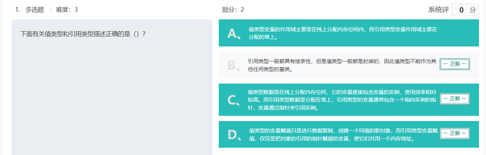

Ext3日志文件系统特点？

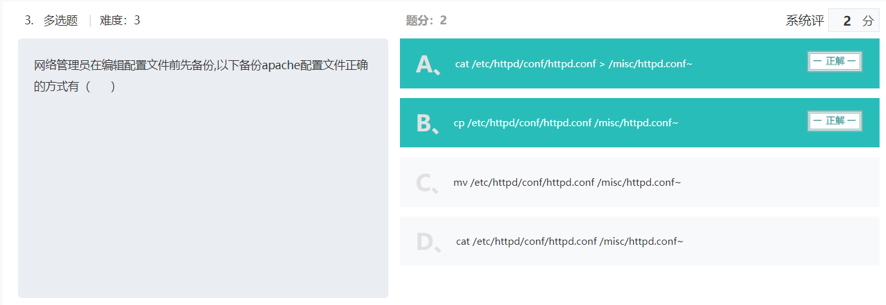

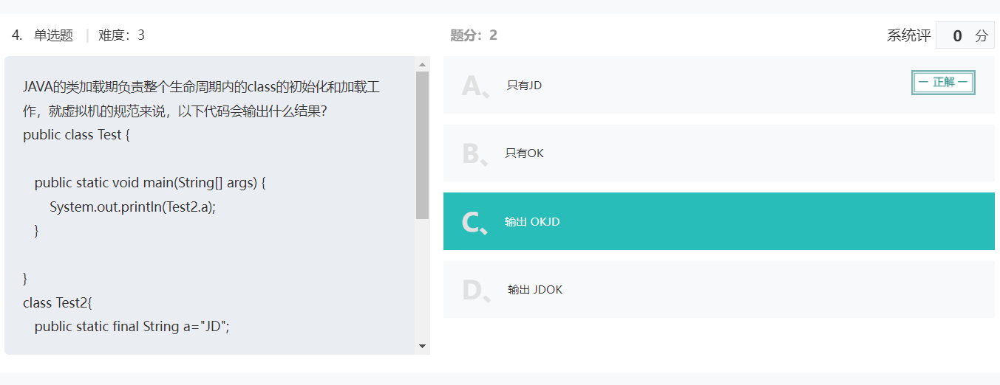

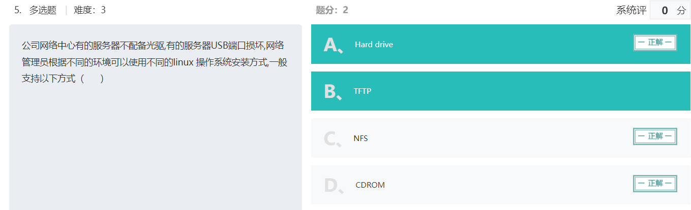


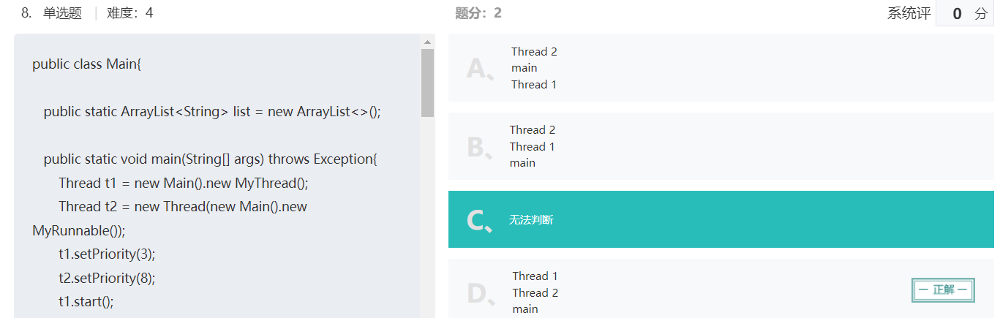

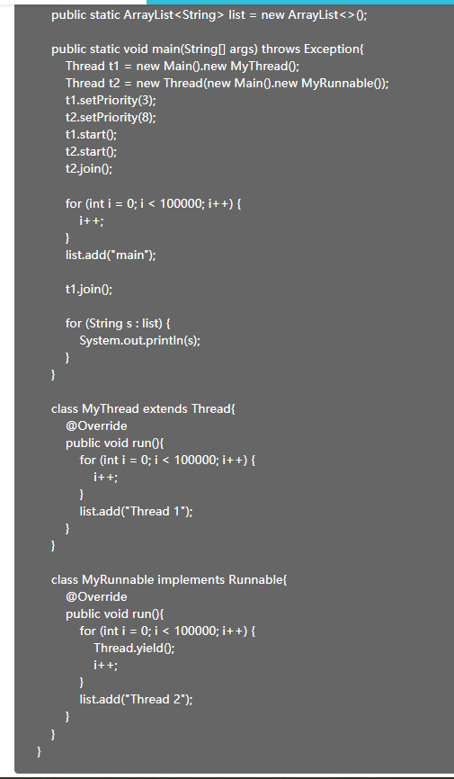

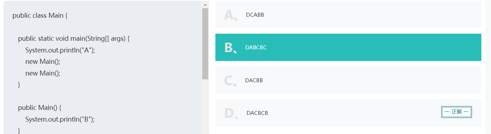

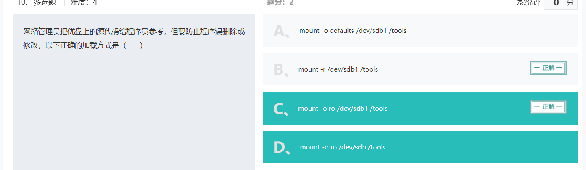

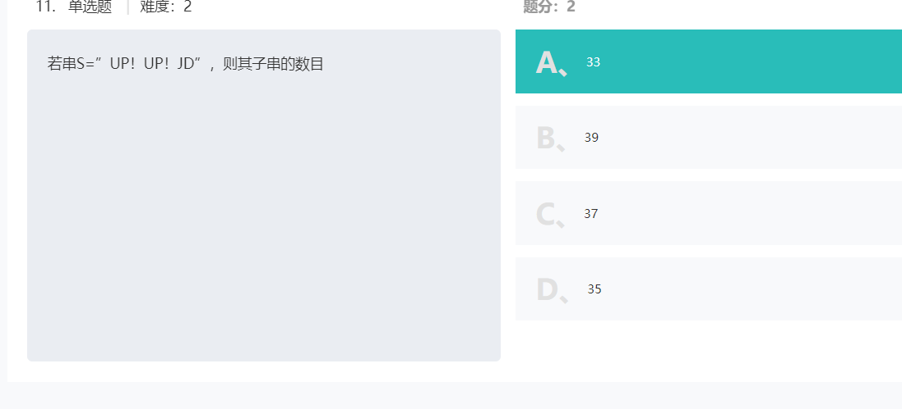

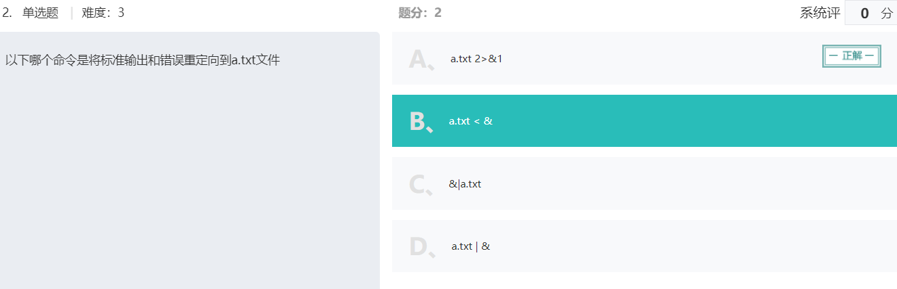

[delete和truncate的区别 - 韦邦杠 - 博客园 (cnblogs.com)](https://www.cnblogs.com/weibanggang/p/9590080.html)

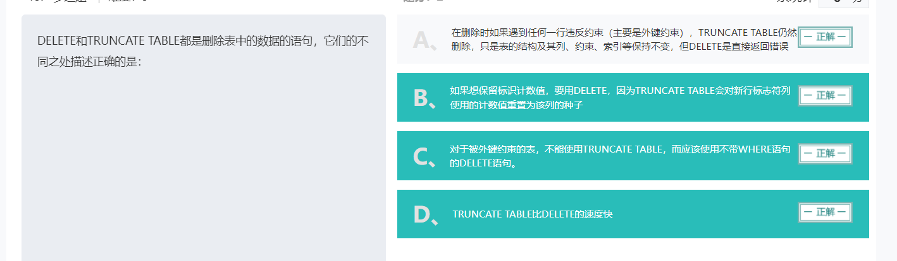

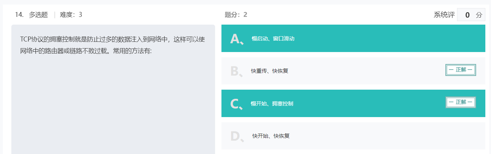

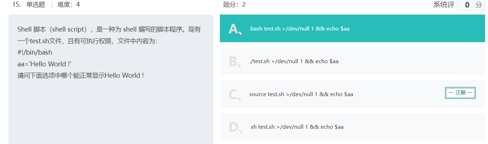

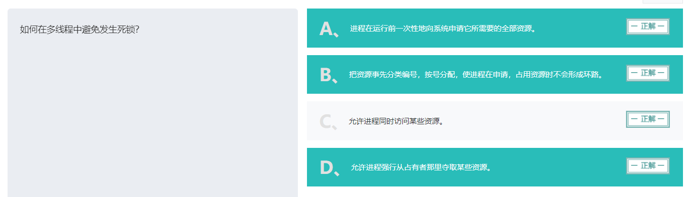

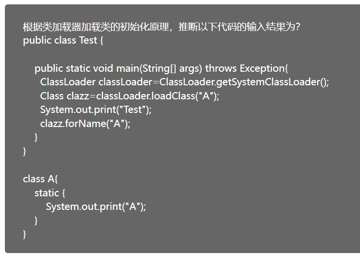

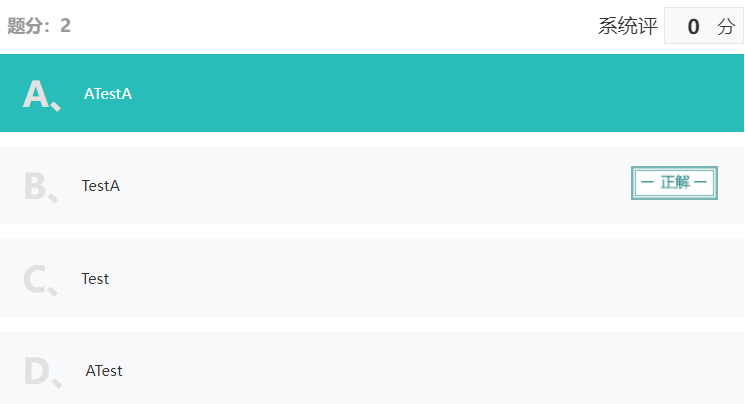

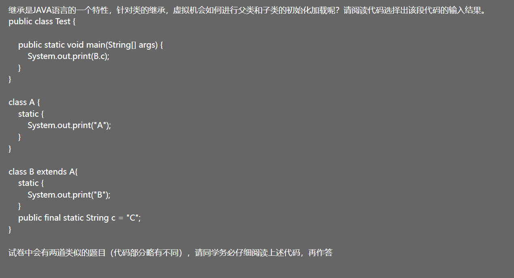

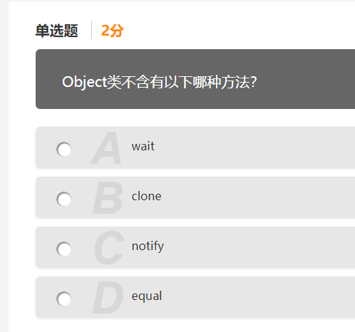

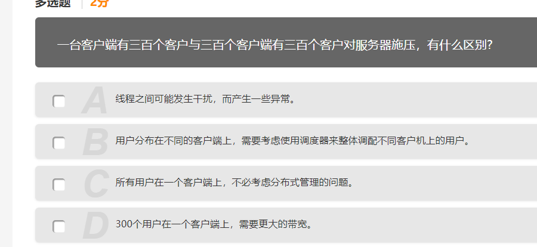

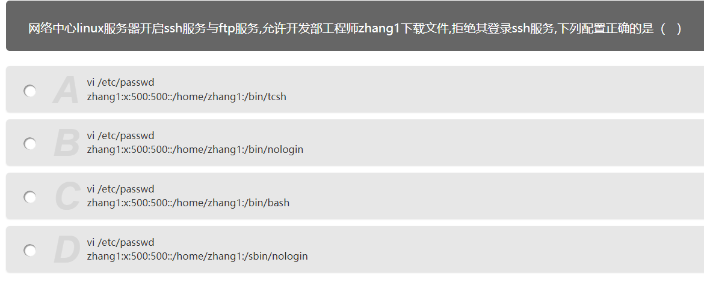

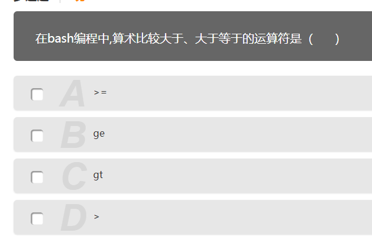

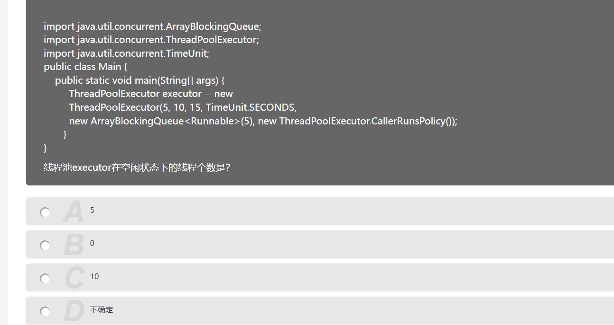

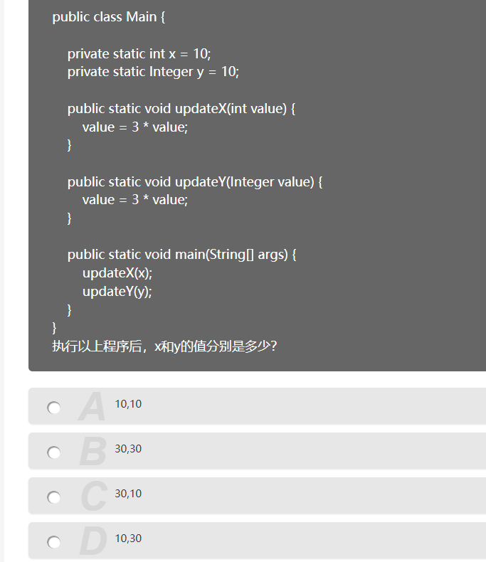

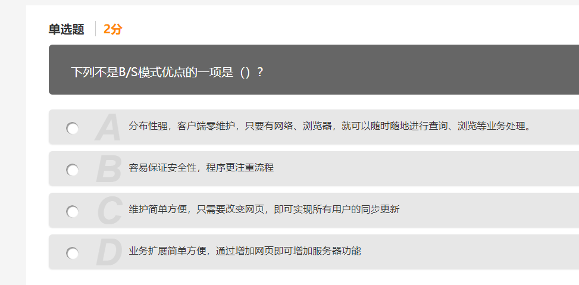

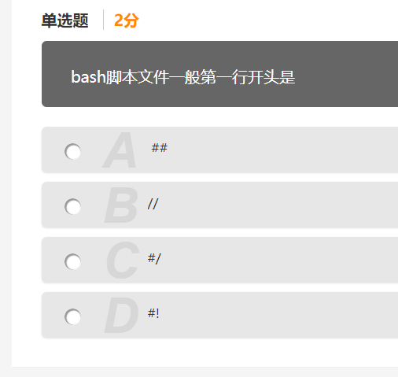

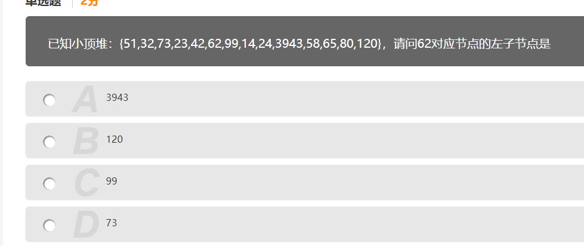

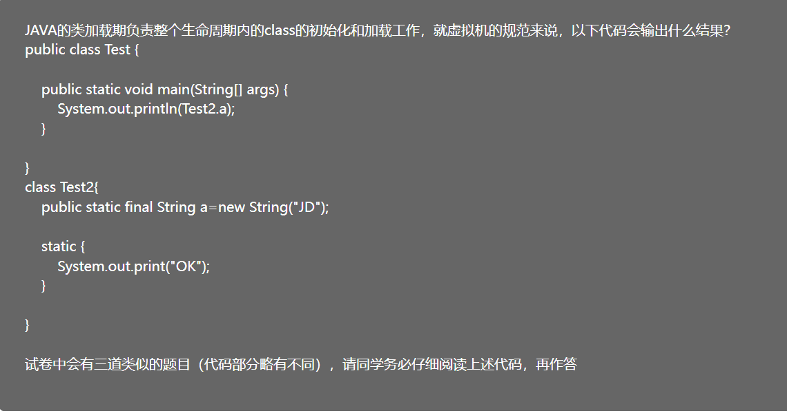

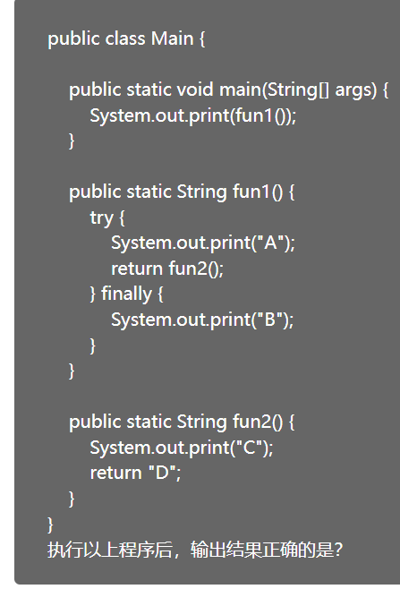


