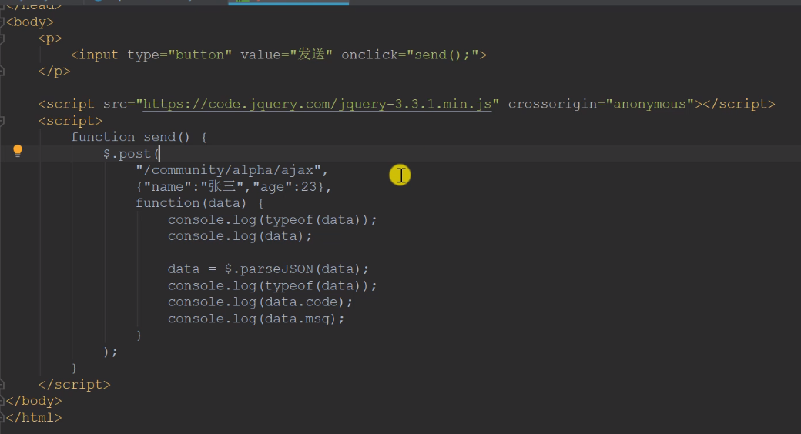
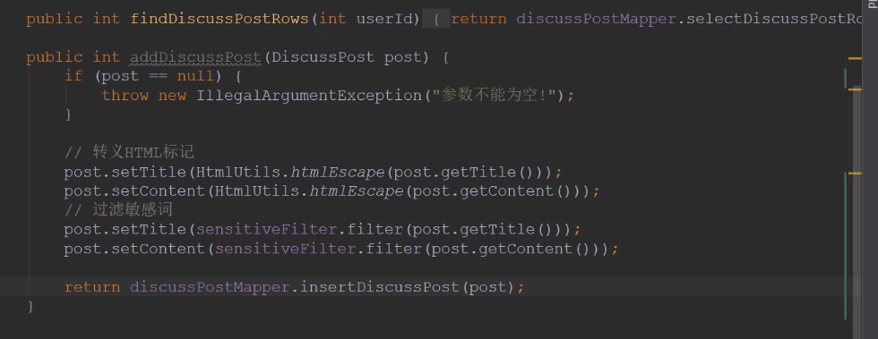
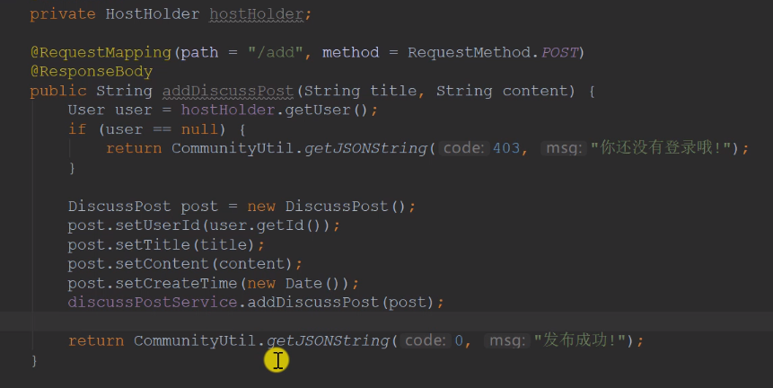
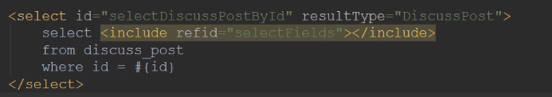
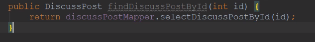

###  Spring

在测试类中测试IoC容器的存在

- 添加注解`@ContextConfiguration(classes = CommunityApplication.class)`
- 实现接口 `ApplicationContextAware`
- 重写方法`public void setApplicationContext(ApplicationContext applicationContext)`

```java
@SpringBootTest
@ContextConfiguration(classes = CommunityApplication.class)//在测试类中加上此注解就能将配置类（）引用在本类中
class CommunityApplicationTests implements ApplicationContextAware {

	private ApplicationContext applicationContext;
	@Override
	public void setApplicationContext(ApplicationContext applicationContext) throws BeansException {
		this.applicationContext = applicationContext;
	}
	@Test
	public void testApplicationContext(){
		System.out.println(applicationContext);
        //org.springframework.web.context.support.GenericWebApplicationContext@598bd2ba, started on Thu Jun 02 19:55:32 CST 2022
		//证明容器是存在的
	}
}
```

`@Primary`  注解在bean上表示优先被Ioc实例化
`@PostConstruct` 注解在方法上，表示在构造器运行之后执行
`@PreDestory` 注解在方法上，表示在销毁方法前执行

**想实例化一个第三方jar包的bean**：自己写个配置类，通过bean注解实现

`@SpringbootApplication` 一般用于**程序入口**的配置类
`@Configuration` 表示为**一般**配置类

```java
@Configuration
public class AlphaConfig {
    @Bean
    public SimpleDateFormat simpleDateFormat(){
        return new SimpleDateFormat("yyyy-MM-dd HH:mm:ss");
    }
}
```

```java
@Test
	public void testBeanConfiguration(){
		SimpleDateFormat simpleDateFormat = applicationContext.getBean(SimpleDateFormat.class);
		System.out.println(simpleDateFormat.format(new Date()));
        //2022-06-02 20:13:55
	}
```


### MVC

##### 传递参数方式

第一种:

```java
@RequestMapping(path = "/student",method = RequestMethod.GET)
@ResponseBody
public String getStudent(@RequestParam(name="current",required=false,defalutValue="1") int current,
                        @RequestParam(name="limit",required=false,defalutValue="10") int limit){}
```

RestFul

```java
@RequestMapping(path = "/student/{id}",method = RequestMethod.GET)
@ResponseBody
public String getStudent(@PathVariable("id") int id){
        System.out.println(id);
        return "a student";
    }
```

### 邮件功能

1. 在sina开启授权码状态，和POP3,SMTP服务

2. 新建工具类MailClient

   ```java
   /*	1.将其添加到springIoC管理
   *	2.定义一个Logger，用于记录错误信息
   *	3.将配置文件中的username注入，这是（代表了网站）发送方
   *	4.定义sendMail方法，需要 发邮件的标题 ，内容 ，我的邮箱 ，他人的邮箱 四个参数
   		需要spring中的MimeMessageHelper 帮助构建邮件
   */
   @Component
   public class MailClient {
       private static final Logger logger = LoggerFactory.getLogger(MailClient.class);
   
       @Autowired
       private JavaMailSender mailSender;
       //需要发邮件的标题，内容，我的邮箱，他人的邮箱
       //将username注入，因为服务器发邮件都是用直接的账号（配置中的sina）
       @Value("${spring.mail.username}")
       private String from;
   
       //封装公有方法
       public void sendMail(String to, String subject, String content) {
           try {
               MimeMessage message = mailSender.createMimeMessage();
               MimeMessageHelper helper = new MimeMessageHelper(message);
               helper.setFrom(from);
               helper.setTo(to);
               helper.setSubject(subject);
               helper.setText(content, true);
               mailSender.send(helper.getMimeMessage());
           } catch (MessagingException e) {
               logger.error("发送邮件失败" + e.getMessage());
           }
       }
   }
   ```

   测试：

```java
@Autowired
private MailClient mailClient;//注入工具类

@Test
public void testMail(){
    mailClient.sendMail("574524709@qq.com","test","test mail");
}
```

需要发html形式邮箱：采用thymeleaf构建模板：

```html
<!DOCTYPE html>
<html lang="en" xmlns:th="http://www.thymeleaf.org">
<head>
    <meta charset="UTF-8">
    <title>邮件示例</title>
</head>
<body>
    <p>欢迎您，<span style="color: darkorchid;" th:text="${username}"></span>!</p>
</body>
</html>
```

测试：

```java
@Autowired
private TemplateEngine templateEngine;//springboot中已管理了模板引擎，只需注入
@Test
    public void testHtmlMail(){
        Context context = new Context();//注意是thymeleaf的类
        context.setVariable("username","sunday");//这是其中的一个变量
        String content = templateEngine.process("/mail/demo", context);//把模板地址，数据传入如
        System.out.println(content);
        mailClient.sendMail("574524709@qq.com","HTML",content);
}
```

### 6.5

启动出现问题

```
java.sql.SQLNonTransientConnectionException: Public Key Retrieval is not allowed
```

在配置中数据库连接后加上

```
allowPublicKeyRetrieval=true
```

在首页点击（首页），（注册）都无页面

```html
<!--注意thymeleaf的这个写法是错的-->
<a class="nav-link" th:href="@{site/index.html}">首页</a>
<!--采用这样-->
<a class="nav-link" th:href="@{index}">首页</a>
```

### Cookie

```java
 //Cookie示例
    @RequestMapping(path = "/cookie/set",method = RequestMethod.GET)
    @ResponseBody
    public String setCookie(HttpServletResponse response){
        Cookie cookie = new Cookie("code1", CommunityUtil.generateUUID());
        //设置范围，有些路径下有效的
        cookie.setPath("/community/alpha");
        //生存时间（默认是关闭浏览器失效）
        cookie.setMaxAge(600);//秒
        //发送
        response.addCookie(cookie);
        return "set cookie";
    }

    @RequestMapping(path = "/cookie/get",method = RequestMethod.GET)
    @ResponseBody
    public String getCookie(@CookieValue("code1") String code1){//原本在request中取得，但可以用注解取得并赋给值
        System.out.println();
        return "get cookie";
    }
```

### session

优点：存在服务器更安全

缺点：服务器压力

```java
 //Session是javaSE的规范，不是http的
    @RequestMapping(path = "/session/set",method = RequestMethod.GET)
    @ResponseBody
    public String setSession(HttpSession session){//与cookie不同，springMVC会自动创建Session,只需要声明，就能注入进来
        session.setAttribute("id",1);
        session.setAttribute("name","test");
        return "session test";
    }

    @RequestMapping(path = "/session/get",method = RequestMethod.GET)
    @ResponseBody
    public String getSession(HttpSession session){
        System.out.println(session.getAttribute("id"));
        System.out.println(session.getAttribute("name"));
        return "get session test";
    }
```

<font color=red>分布式部署</font>：nginx实现负载均衡

- 粘性session：同一ip的请求均分配到指定一台服务器上
- 同步session：服务器将session同步给所有服务器
- 共享session：有一台单独的服务器用于处理session，其他服务器与该服务器
- 主流：不使用session，而是用cookie，部分不适合存cookie的存数据库里，数据库集群备份
- 更好的做法：不存在关系型数据库（硬盘）中，而是NOSQL中

### 生成验证码

Kaptcha：

- 导入jar包
- 编写kaptcha配置类
- 生成随机字符，图片

### 登入和退出

登录请求：

- 点击上方的“登入”，能跳到登入页面
- 点击“立即登入”，返回结果（登入凭证，cookie）发给客户端

退出请求:

- 将登入凭证修改为失效状态
- 跳转至首页

数据库中的表 login_ticket：

| id   | user_id | ticket               | status        | expired  |
| ---- | ------- | -------------------- | ------------- | -------- |
|      |         | 随机字符串，唯一标识 | 0-有效 1-无效 | 过期时间 |

1、创建实体类，封装数据

```java
//dao

/**
 * 在本类中，学习使用注解实现sql，不是xml
 *
 */
@Mapper
public interface LoginTicketMapper {

    //登入成功后要插入凭证//需要声明主键自动生成，@Options，且需要将生成的值注入给对象，keyProperty = "id"
    @Insert({
            "insert into login_ticket (user_id,ticket,status,expired) ",//加个空格断开
            "values(#{userId},#{ticket},#{status},#{expired})"
    })
    @Options(useGeneratedKeys = true,keyProperty = "id")
    int insertLoginTicket(LoginTicket loginTicket);

    //查询方法：围绕ticket
    @Select({
            "select id,user_id,ticket,status,expired ",
            "from login_ticket where ticket=#{ticket}"
    })
    LoginTicket selectByTicket(String ticket);

    //修改凭证状态：不删除
    @Update({
            "update login_ticket set status=#{status} where ticket=#{ticket}"
    })
    int updateStatus(String ticket,int status);
    //学习：假如需要动态sql时
    /*@Update({
            "<script>",
            "update login_ticket set status=#{status} where ticket=#{ticket} ",
            "<if test=\"ticket!=null\">",
            "and 1 =1",
            "</if>",
            "</script>"
    })*/
}
```

```java
//UserService


//实现登入功能：成功、失败（多种情况）
    public Map<String ,Object> login(String username,String password,int expiredSeconds){
        Map<String ,Object> map = new HashMap<>();
        //空值判断
        if(StringUtils.isBlank(username)){
            map.put("usernameMsg","账号不能为空！");
            return map;
        }
        if(StringUtils.isBlank(password)){
            map.put("passwordMsg","密码不能为空！");
            return map;
        }
        //验证合法性
        User user = userMapper.selectByName(username);
        if(user==null){
            map.put("usernameMsg","账号不存在！");
            return map;
        }
        //没激活的账号不能登入
        if(user.getStatus()==0){
            map.put("usernameMsg","账号未激活！");
            return map;
        }
        //密码
        password = CommunityUtil.md5(password+ user.getSalt());
        if(user.getPassword().equals(password)){
            map.put("passwordMsg","密码不正确！");
            return map;
        }
        //登入成功，生成登入凭证
        LoginTicket loginTicket = new LoginTicket();
        loginTicket.setUserId(user.getId());
        loginTicket.setTicket(CommunityUtil.generateUUID());
        loginTicket.setStatus(0);//有效状态
        loginTicket.setExpired(new Date(System.currentTimeMillis()+expiredSeconds*1000));
        loginTicketMapper.insertLoginTicket(loginTicket);
        //这个LoginTicket表就相当与session了，下次用户请求带上ticket，服务器查询状态和时间看是否有效
        map.put("ticket",loginTicket.getTicket());
        return map;
    }
```

```java
//LoginController

@RequestMapping(path = "/login",method = RequestMethod.POST)
    public String login(String username,String password ,String code,boolean rememberme,//这个rememberme是勾选记住我
                        Model model,HttpSession session,HttpServletResponse response){//model用于范围响应数据；getKaptcha存的验证码需要session获取；登入成功了，需要将ticket发给客户端用cookie保存
        String kaptcha = (String) session.getAttribute("kaptcha");
        if(StringUtils.isBlank(kaptcha)||StringUtils.isBlank(code)||!kaptcha.equalsIgnoreCase(code)){
            model.addAttribute("codeMsg","验证码不正确");
            return "/site/login";
        }
        //检查账号密码
        //如果勾选了“记住我”，则存的时间长一点
        //这里再次在CommunityConstant类添加常量
        int expiredSecond = rememberme?REMEMBER_EXPIRED_SECONDS:DEFAULT_EXPIRED_SECONDS;
        Map<String, Object> map = userService.login(username, password, expiredSecond);
        //如果map总包含ticket，就是成功了
        if(map.containsKey("ticket")){
            Cookie cookie = new Cookie("ticket",map.get("ticket").toString());
            cookie.setPath(contextPath);//表示整个项目下cookie都是有效的:注入properties中的值
            cookie.setMaxAge(expiredSecond);
            response.addCookie(cookie);//将cookie发给用户
            return "redirect:/index";
        }else {
            model.addAttribute("usernameMsg",map.get("usernameMsg"));
            model.addAttribute("passwordMsg",map.get("passwordMsg"));
            return "/site/login";
        }
    }
```

### 显示登入信息

根据登入与否，调整头部信息，由于在整个网站都有：设定拦截器

1、定义拦截器

```java
@Controller
public class AlphaInterceptor implements HandlerInterceptor {
    private static final Logger logger = LoggerFactory.getLogger(AlphaInterceptor.class);

    @Override
    public boolean preHandle(HttpServletRequest request, HttpServletResponse response, Object handler) throws Exception {
        logger.debug("preHandle调用了:"+handler.toString());
        return true;
    }

    //在Controller之后运行，模板引擎之前执行
    @Override
    public void postHandle(HttpServletRequest request, HttpServletResponse response, Object handler, ModelAndView modelAndView) throws Exception {
        logger.debug("postHandle调用了:"+handler.toString());
    }

    //在模板引擎TemplateEngine之后执行
    @Override
    public void afterCompletion(HttpServletRequest request, HttpServletResponse response, Object handler, Exception ex) throws Exception {
        logger.debug("afterCompletion调用了:"+handler.toString());
    }
    //写完之后在config建立配置类
}
```

2、配置拦截器，指定、排除路径

```java
@Configuration
public class WebMvcConfig implements WebMvcConfigurer {


    @Autowired
    private AlphaInterceptor alphaInterceptor;

    @Override
    public void addInterceptors(InterceptorRegistry registry) {
        registry.addInterceptor(alphaInterceptor).
                excludePathPatterns("/**/*.css","/**/*.js","/**/*.png","/**/*.jpg","/**/*.jpeg")  //不拦截静态资源
                .addPathPatterns("/register","/login"); //明确要拦截的路径：注册和登入
    }
}
```

拦截器在本节的实现：

-  在请求开始时查询登入用户
- 在本次请求中持有的用户数据
- 在模板视图上显示用户数据
- 在结束请求时清理用户数据

### 账号设置

上传头像和修改密码

上传文件：

- 请求：post
- 表单：enctype="multipart/form-data"
- SpringMVC ：通过MultipartFile处理上传文件

步骤：

1. 访问页面
2. 上传头像
3. 获取头像：在其他页面都要获取

## 6.14

### 注册功能

1.Controller层

```java
//LoginController
@RequestMapping(path = "/register",method = RequestMethod.GET)
    public String getRegisterPage(){
        return "/site/register";
    }
```

2.修改register页面

3.引入CommonsLang包，用于常用字符串检测

4.写工具类（生成随机字符串，加密等），由于不需要交给容器托管，因此写成静态方法

```java
//使用 自带的UUID包生成随机字符串
public static String generateUUID(){
        return UUID.randomUUID().toString().replaceAll("-","");//不想要有横线
    }
//加密密码:使用Spring 自带的工具类 DigestUtils.md5DigestAsHex()
public static String md5(String key){
        if(StringUtils.isBlank(key)){//先简单判断下不为空，采用了commons lang包
            return null;
        }else {
            return DigestUtils.md5DigestAsHex(key.getBytes(StandardCharsets.UTF_8));//这是spring自带的加密方法
        }
    }
```

5.开发注册业务

```java
//UserService
//注入邮件客户端，模板引擎
//注入项目名，项目路径
	@Autowired
    private MailClient mailClient;
    @Autowired
    private TemplateEngine templateEngine;
    //注册时发送激活码需要带上域名和项目名，因此从properties中注入
    @Value("${community.path.domain}")
    private String domain;
    @Value("${server.servlet.context-path}")
    private String contextPath;
    @Autowired
    private LoginTicketMapper loginTicketMapper;
```

6.开发业务

> - 返回结果：错误信息（注册成功、账号已存在等）---> Map
>
>   1. 空值判断：账号，密码，邮箱
>
>   2. 验证：（账号已存在、邮箱已存在）——> userMapper.selectByName
>
>   3. 注册用户：把用户插入库中
>
>      1. user.setSalt
>
>      2. user.setPassword() 将salt+原密码并加密覆盖原密码
>
>      3. user.setType/setStatus/setActivationCode/setHeader
>
>      4. 随机头像设置
>
>         ```java
>         user.setHeaderUrl(String.format("http:\\image.nowcoder.com/head/%dt.png",new Random().nextInt(1000)));
>         ```
>
>      5. 给用户发激活邮件
>
>
> ```java
> Context context = new Context();//Thymeleaf自带对象：模板生成html格式邮件
> context.setVariable("email",user.getEmail()); 
> //动态拼接用户能点的路径（每个用户的激活页面是不同的） :101 是用户id，code是激活码
> //http://localhost:8080/community/activation/101/code
> String url = domain+contextPath+"/activation/"+user.getId()+"/"+user.getActivationCode();
> context.setVariable("url",url);
> //生成模板引擎
> String content = templateEngine.process("/mail/activation",context);
> mailClient.sendMail(user.getEmail(), "账号激活",content);
> ```
>
> 

```java
//userService
    public Map<String,Object> register(User user){
        Map<String ,Object> map = new HashMap<>();
        //先对空值做判断
        if(user==null){
            throw new IllegalArgumentException("参数不为空");
        }
        if(StringUtils.isBlank(user.getUserName())){
            map.put("usernameMsg","账号不能为空!");
            return map;
        }
        if(StringUtils.isBlank(user.getPassword())){
            map.put("passwordMsg","密码不能为空!");
            return map;
        }
        if(StringUtils.isBlank(user.getEmail())){
            map.put("emailMsg","邮箱不能为空!");
            return map;
        }
        //账号是否存在
        User u = userMapper.selectByName(user.getUserName());
        if(u!=null){
            map.put("usernameMsg","账号已存在!");
            return map;
        }
        //邮箱验证
        u = userMapper.selectByEmail(user.getEmail());
        if(u!=null){
            map.put("emailMsg","该邮箱已被注册!");
            return map;
        }
        //可以注册了
        user.setSalt(CommunityUtil.generateUUID().substring(0,5));
        user.setPassword(CommunityUtil.md5(user.getPassword()+user.getSalt()));
        user.setType(0);//普通用户
        user.setStatus(0);//未激活
        user.setActivationCode(CommunityUtil.generateUUID());//生成一个激活码
        //为用户设置随机头像，牛客网的头像库有0-1000 号头像
        user.setHeaderUrl(String.format("http://images.nowcoder.com/head/%dt.png",new Random().nextInt(1000)));
        user.setCreateTime(new Date());
        userMapper.insertUser(user);
        //给用户发邮件，用于激活 模板 activation.html
        Context context = new Context();
        context.setVariable("email",user.getEmail());
        //动态拼接用户能点的路径（每个用户的激活页面是不同的） :101 是用户id，code是激活码
        //http://localhost:8080/community/activation/101/code
        String url = domain+contextPath+"/activation/"+user.getId()+"/"+user.getActivationCode();
        context.setVariable("url",url);
        //生成模板引擎
        String content = templateEngine.process("/mail/activation",context);
        mailClient.sendMail(user.getEmail(), "账号激活",content);
        return map;
    }
```

7.控制器

> 1. 将userService注入
>
> 2. 定义方法处理用户的注册请求：register页面  post
>
>    ```java
>    @RequestMapping(path = "/register",method = RequestMethod.POST)
>        public String register(Model model, User user)
>    ```
>
>    
>
>    ```java
>    		Map<String,Object> map = userService.register(user);
>            if(map==null||map.isEmpty()){
>                model.addAttribute("msg","注册成功，我们已向你的邮箱发送了激活邮件，请尽快激活！");
>                model.addAttribute("target","/index");
>                return "/site/operate-result";//跳转到跳转页面
>            }else{//携带信息，重新回到注册页面，把service层的三个信息都发回，如果是空的就不显示
>                model.addAttribute("usernameMsg",map.get("usernameMag"));
>                model.addAttribute("passwordMsg",map.get("passwordMag"));
>                model.addAttribute("emailMsg",map.get("emailMag"));
>                model.addAttribute("user",user);//测试
>                return "/site/register";
>    ```

8.激活账号

> 在service层添加业务
>
> ```java
> 	public int activation(int userId,String code){//传入用户id，和激活码code，查询激活码
>         User user = userMapper.selectById(userId);
>         if(user.getStatus()==1){//已经激活了
>             return ACTIVATION_REPEAT;
>         }else if(user.getActivationCode().equals(code)){
>             userMapper.updateStatus(userId,1);//修改激活状态
>             return ACTIVATION_SUCCESS;
>         }else {
>             return ACTIVATION_FAILURE;
>         }
>     }
> ```
>
> Controller
>
> ```java
> @RequestMapping(path = "/activation/{userId}/{code}",method = RequestMethod.GET)
>     public String activation(Model model, @PathVariable("userId") int userId,@PathVariable("code") String code){
>         int result = userService.activation(userId,code);
>         if(result==ACTIVATION_SUCCESS){
>             model.addAttribute("msg","激活成功！");
>             model.addAttribute("target","/login");
>         }else if(result==ACTIVATION_REPEAT){
>             model.addAttribute("msg","该账号已经激活过！");
>             model.addAttribute("target","/index");
>         }else{
>             model.addAttribute("msg","激活失败！");
>             model.addAttribute("target","/index");
>         }
>         return "/site/operate-result";
>     }
> ```
>
> 

## 8.14

### 账号设置（上传文件）

请求:必须是POST请求，
表单: enctype= "multipart/form-data
Spring MVC:通过MultipartFile处理.上传文件

## 8.15

### 检查登入状态

如果有人知道一些路径，就可以在没登入时进入某些页面，应该配置拦截器阻止非法访问。

```
●使用拦截器
-在方法前标注自定义注解
拦截所有请求，只处理带有该注解的方法
●自定义注解
常用的元注解:
@Target、@Retention、@Document、 @Inherited
如何读取注解:
Method . getDeclaredAnnotations ()
Method . getAnnotation (Class<T> annotationClass)
```

1.先定义注解

```java
@Target(ElementType.METHOD)
@Retention(RetentionPoliy.RUNTIME)
public @interface LOginRequired{
    //不用写东西，只是标记的作用
}
```

2.在需要的方法前加上该注解

3.定义拦截器

```java
@Autowired
public HostHolder hostHolder;//尝试获取当前的用户来判断登入

@Component
public Class LoginRequiredIntercepter implements HandlerInceptor{
    @override
    public boolean prehander(HttpServletRequest request,HttpServlet response, Object handler) throws Exception{
        //参数的 Object handler是拦截的目标，目标是方法才能执行
        if(handler instanceof HandlerMethod){
            HandlerMethod handlerMethod = (HandlerMethod) handler;
            //通过它的方法来直接获取拦截到的方法
            sMethod method = handlerMethod.getMethod();
            //有了方法对象，尝试从方法对象中获取注解
            LoginRequired loginRequired = method.getAnnotation(LoginRequired.class);
            if(loginRequired != null && hostHolder.getUser()== null){//且获取不到登入用户
                response.sendRedirect(request.getContextPath()+"/login");
                return false;
            }
        }
    }
  
}
```

4.将拦截器注入WebMvcConfig

```java
//1.先注入
@Autowired
private LoginRequiredInterceptor loginRequiredInterceptor;
//2.然后在addInterceptor加入
registry.addInterceptor().excludePathPatterns()
```

# 9

项目目录

### 3.1 过滤敏感词🔰

​	前缀树，建树，初始化postConstruct，字符匹配

### 3.6 发布帖子

异步处理AJAX（采用JSON）


Service层--发布帖子+敏感词过滤



Controller层



### 3.11 帖子详情

传入帖子id



service层



### 3.13 事务管理

### 3.20 显示评论

### 3.22 添加评论

### 3.24私信列表

### 3.31 统一处理异常

### 3.33 统一记录日志

### 4.1 redis

### 4.7 springboot 整合redis

### 4.10 点赞

### 4.13 我受到的赞

### 4.16 关注、取消关注

### 4.19 关注列表、粉丝列表

### 4.23 优化登入模块

### 5.1阻塞队列

### 5.5 kafka

### 5.9 springboot 整合kafka

### 5.11 发送系统通知

### 5.13 显示系统通知

### 6.1 ElasticSearch

### 6.4 spring boot整合ElasticSearch

### 6.6 开发失去搜索功能

### 7.1 SpringSecurity

### 7.3 权限控制

