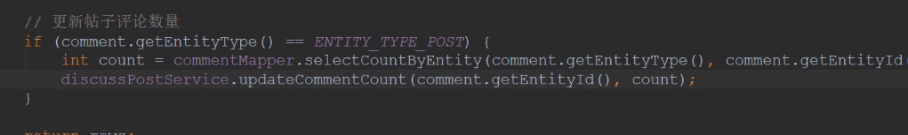
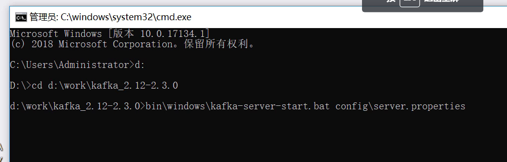
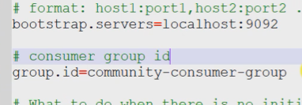

###  Spring

在测试类中测试IoC容器的存在

- 添加注解`@ContextConfiguration(classes = CommunityApplication.class)`
- 实现接口 `ApplicationContextAware`
- 重写方法`public void setApplicationContext(ApplicationContext applicationContext)`

```java
@SpringBootTest
@ContextConfiguration(classes = CommunityApplication.class)//在测试类中加上此注解就能将配置类（）引用在本类中
class CommunityApplicationTests implements ApplicationContextAware {

	private ApplicationContext applicationContext;
	@Override
	public void setApplicationContext(ApplicationContext applicationContext) throws BeansException {
		this.applicationContext = applicationContext;
	}
	@Test
	public void testApplicationContext(){
		System.out.println(applicationContext);
        //org.springframework.web.context.support.GenericWebApplicationContext@598bd2ba, started on Thu Jun 02 19:55:32 CST 2022
		//证明容器是存在的
	}
}
```

`@Primary`  注解在bean上表示优先被Ioc实例化
`@PostConstruct` 注解在方法上，表示在构造器运行之后执行
`@PreDestory` 注解在方法上，表示在销毁方法前执行

**想实例化一个第三方jar包的bean**：自己写个配置类，通过bean注解实现

`@SpringbootApplication` 一般用于**程序入口**的配置类
`@Configuration` 表示为**一般**配置类

```java
@Configuration
public class AlphaConfig {
    @Bean
    public SimpleDateFormat simpleDateFormat(){
        return new SimpleDateFormat("yyyy-MM-dd HH:mm:ss");
    }
}
```

```java
@Test
	public void testBeanConfiguration(){
		SimpleDateFormat simpleDateFormat = applicationContext.getBean(SimpleDateFormat.class);
		System.out.println(simpleDateFormat.format(new Date()));
        //2022-06-02 20:13:55
	}
```


### MVC

##### 传递参数方式

第一种:

```java
@RequestMapping(path = "/student",method = RequestMethod.GET)
@ResponseBody
public String getStudent(@RequestParam(name="current",required=false,defalutValue="1") int current,
                        @RequestParam(name="limit",required=false,defalutValue="10") int limit){}
```

RestFul

```java
@RequestMapping(path = "/student/{id}",method = RequestMethod.GET)
@ResponseBody
public String getStudent(@PathVariable("id") int id){
        System.out.println(id);
        return "a student";
    }
```

### 邮件功能

1. 在sina开启授权码状态，和POP3,SMTP服务

2. 新建工具类MailClient

   ```java
   /*	1.将其添加到springIoC管理
   *	2.定义一个Logger，用于记录错误信息
   *	3.将配置文件中的username注入，这是（代表了网站）发送方
   *	4.定义sendMail方法，需要 发邮件的标题 ，内容 ，我的邮箱 ，他人的邮箱 四个参数
   		需要spring中的MimeMessageHelper 帮助构建邮件
   */
   @Component
   public class MailClient {
       private static final Logger logger = LoggerFactory.getLogger(MailClient.class);
   
       @Autowired
       private JavaMailSender mailSender;
       //需要发邮件的标题，内容，我的邮箱，他人的邮箱
       //将username注入，因为服务器发邮件都是用直接的账号（配置中的sina）
       @Value("${spring.mail.username}")
       private String from;
   
       //封装公有方法
       public void sendMail(String to, String subject, String content) {
           try {
               MimeMessage message = mailSender.createMimeMessage();
               MimeMessageHelper helper = new MimeMessageHelper(message);
               helper.setFrom(from);
               helper.setTo(to);
               helper.setSubject(subject);
               helper.setText(content, true);
               mailSender.send(helper.getMimeMessage());
           } catch (MessagingException e) {
               logger.error("发送邮件失败" + e.getMessage());
           }
       }
   }
   ```

   测试：

```java
@Autowired
private MailClient mailClient;//注入工具类

@Test
public void testMail(){
    mailClient.sendMail("574524709@qq.com","test","test mail");
}
```

需要发html形式邮箱：采用thymeleaf构建模板：

```html
<!DOCTYPE html>
<html lang="en" xmlns:th="http://www.thymeleaf.org">
<head>
    <meta charset="UTF-8">
    <title>邮件示例</title>
</head>
<body>
    <p>欢迎您，<span style="color: darkorchid;" th:text="${username}"></span>!</p>
</body>
</html>
```

测试：

```java
@Autowired
private TemplateEngine templateEngine;//springboot中已管理了模板引擎，只需注入
@Test
    public void testHtmlMail(){
        Context context = new Context();//注意是thymeleaf的类
        context.setVariable("username","sunday");//这是其中的一个变量
        String content = templateEngine.process("/mail/demo", context);//把模板地址，数据传入如
        System.out.println(content);
        mailClient.sendMail("574524709@qq.com","HTML",content);
}
```

### 6.5

启动出现问题

```
java.sql.SQLNonTransientConnectionException: Public Key Retrieval is not allowed
```

在配置中数据库连接后加上

```
allowPublicKeyRetrieval=true
```

在首页点击（首页），（注册）都无页面

```html
<!--注意thymeleaf的这个写法是错的-->
<a class="nav-link" th:href="@{site/index.html}">首页</a>
<!--采用这样-->
<a class="nav-link" th:href="@{index}">首页</a>
```

### Cookie

```java
 //Cookie示例
    @RequestMapping(path = "/cookie/set",method = RequestMethod.GET)
    @ResponseBody
    public String setCookie(HttpServletResponse response){
        Cookie cookie = new Cookie("code1", CommunityUtil.generateUUID());
        //设置范围，有些路径下有效的
        cookie.setPath("/community/alpha");
        //生存时间（默认是关闭浏览器失效）
        cookie.setMaxAge(600);//秒
        //发送
        response.addCookie(cookie);
        return "set cookie";
    }

    @RequestMapping(path = "/cookie/get",method = RequestMethod.GET)
    @ResponseBody
    public String getCookie(@CookieValue("code1") String code1){//原本在request中取得，但可以用注解取得并赋给值
        System.out.println();
        return "get cookie";
    }
```

### session

优点：存在服务器更安全

缺点：服务器压力

```java
 //Session是javaSE的规范，不是http的
    @RequestMapping(path = "/session/set",method = RequestMethod.GET)
    @ResponseBody
    public String setSession(HttpSession session){//与cookie不同，springMVC会自动创建Session,只需要声明，就能注入进来
        session.setAttribute("id",1);
        session.setAttribute("name","test");
        return "session test";
    }

    @RequestMapping(path = "/session/get",method = RequestMethod.GET)
    @ResponseBody
    public String getSession(HttpSession session){
        System.out.println(session.getAttribute("id"));
        System.out.println(session.getAttribute("name"));
        return "get session test";
    }
```

<font color=red>分布式部署</font>：nginx实现负载均衡

- 粘性session：同一ip的请求均分配到指定一台服务器上
- 同步session：服务器将session同步给所有服务器
- 共享session：有一台单独的服务器用于处理session，其他服务器与该服务器
- 主流：不使用session，而是用cookie，部分不适合存cookie的存数据库里，数据库集群备份
- 更好的做法：不存在关系型数据库（硬盘）中，而是NOSQL中

### 生成验证码

Kaptcha：

- 导入jar包
- 编写kaptcha配置类
- 生成随机字符，图片

### 登入和退出

登录请求：

- 点击上方的“登入”，能跳到登入页面
- 点击“立即登入”，返回结果（登入凭证，cookie）发给客户端

退出请求:

- 将登入凭证修改为失效状态
- 跳转至首页

数据库中的表 login_ticket：

| id   | user_id | ticket               | status        | expired  |
| ---- | ------- | -------------------- | ------------- | -------- |
|      |         | 随机字符串，唯一标识 | 0-有效 1-无效 | 过期时间 |

1、创建实体类，封装数据

```java
//dao

/**
 * 在本类中，学习使用注解实现sql，不是xml
 *
 */
@Mapper
public interface LoginTicketMapper {

    //登入成功后要插入凭证//需要声明主键自动生成，@Options，且需要将生成的值注入给对象，keyProperty = "id"
    @Insert({
            "insert into login_ticket (user_id,ticket,status,expired) ",//加个空格断开
            "values(#{userId},#{ticket},#{status},#{expired})"
    })
    @Options(useGeneratedKeys = true,keyProperty = "id")
    int insertLoginTicket(LoginTicket loginTicket);

    //查询方法：围绕ticket
    @Select({
            "select id,user_id,ticket,status,expired ",
            "from login_ticket where ticket=#{ticket}"
    })
    LoginTicket selectByTicket(String ticket);

    //修改凭证状态：不删除
    @Update({
            "update login_ticket set status=#{status} where ticket=#{ticket}"
    })
    int updateStatus(String ticket,int status);
    //学习：假如需要动态sql时
    /*@Update({
            "<script>",
            "update login_ticket set status=#{status} where ticket=#{ticket} ",
            "<if test=\"ticket!=null\">",
            "and 1 =1",
            "</if>",
            "</script>"
    })*/
}
```

```java
//UserService


//实现登入功能：成功、失败（多种情况）
    public Map<String ,Object> login(String username,String password,int expiredSeconds){
        Map<String ,Object> map = new HashMap<>();
        //空值判断
        if(StringUtils.isBlank(username)){
            map.put("usernameMsg","账号不能为空！");
            return map;
        }
        if(StringUtils.isBlank(password)){
            map.put("passwordMsg","密码不能为空！");
            return map;
        }
        //验证合法性
        User user = userMapper.selectByName(username);
        if(user==null){
            map.put("usernameMsg","账号不存在！");
            return map;
        }
        //没激活的账号不能登入
        if(user.getStatus()==0){
            map.put("usernameMsg","账号未激活！");
            return map;
        }
        //密码
        password = CommunityUtil.md5(password+ user.getSalt());
        if(user.getPassword().equals(password)){
            map.put("passwordMsg","密码不正确！");
            return map;
        }
        //登入成功，生成登入凭证
        LoginTicket loginTicket = new LoginTicket();
        loginTicket.setUserId(user.getId());
        loginTicket.setTicket(CommunityUtil.generateUUID());
        loginTicket.setStatus(0);//有效状态
        loginTicket.setExpired(new Date(System.currentTimeMillis()+expiredSeconds*1000));
        loginTicketMapper.insertLoginTicket(loginTicket);
        //这个LoginTicket表就相当与session了，下次用户请求带上ticket，服务器查询状态和时间看是否有效
        map.put("ticket",loginTicket.getTicket());
        return map;
    }
```

```java
//LoginController

@RequestMapping(path = "/login",method = RequestMethod.POST)
    public String login(String username,String password ,String code,boolean rememberme,//这个rememberme是勾选记住我
                        Model model,HttpSession session,HttpServletResponse response){//model用于范围响应数据；getKaptcha存的验证码需要session获取；登入成功了，需要将ticket发给客户端用cookie保存
        String kaptcha = (String) session.getAttribute("kaptcha");
        if(StringUtils.isBlank(kaptcha)||StringUtils.isBlank(code)||!kaptcha.equalsIgnoreCase(code)){
            model.addAttribute("codeMsg","验证码不正确");
            return "/site/login";
        }
        //检查账号密码
        //如果勾选了“记住我”，则存的时间长一点
        //这里再次在CommunityConstant类添加常量
        int expiredSecond = rememberme?REMEMBER_EXPIRED_SECONDS:DEFAULT_EXPIRED_SECONDS;
        Map<String, Object> map = userService.login(username, password, expiredSecond);
        //如果map总包含ticket，就是成功了
        if(map.containsKey("ticket")){
            Cookie cookie = new Cookie("ticket",map.get("ticket").toString());
            cookie.setPath(contextPath);//表示整个项目下cookie都是有效的:注入properties中的值
            cookie.setMaxAge(expiredSecond);
            response.addCookie(cookie);//将cookie发给用户
            return "redirect:/index";
        }else {
            model.addAttribute("usernameMsg",map.get("usernameMsg"));
            model.addAttribute("passwordMsg",map.get("passwordMsg"));
            return "/site/login";
        }
    }
```

### 显示登入信息

根据登入与否，调整头部信息，由于在整个网站都有：设定拦截器

1、定义拦截器

```java
@Controller
public class AlphaInterceptor implements HandlerInterceptor {
    private static final Logger logger = LoggerFactory.getLogger(AlphaInterceptor.class);

    @Override
    public boolean preHandle(HttpServletRequest request, HttpServletResponse response, Object handler) throws Exception {
        logger.debug("preHandle调用了:"+handler.toString());
        return true;
    }

    //在Controller之后运行，模板引擎之前执行
    @Override
    public void postHandle(HttpServletRequest request, HttpServletResponse response, Object handler, ModelAndView modelAndView) throws Exception {
        logger.debug("postHandle调用了:"+handler.toString());
    }

    //在模板引擎TemplateEngine之后执行
    @Override
    public void afterCompletion(HttpServletRequest request, HttpServletResponse response, Object handler, Exception ex) throws Exception {
        logger.debug("afterCompletion调用了:"+handler.toString());
    }
    //写完之后在config建立配置类
}
```

2、配置拦截器，指定、排除路径

```java
@Configuration
public class WebMvcConfig implements WebMvcConfigurer {


    @Autowired
    private AlphaInterceptor alphaInterceptor;

    @Override
    public void addInterceptors(InterceptorRegistry registry) {
        registry.addInterceptor(alphaInterceptor).
                excludePathPatterns("/**/*.css","/**/*.js","/**/*.png","/**/*.jpg","/**/*.jpeg")  //不拦截静态资源
                .addPathPatterns("/register","/login"); //明确要拦截的路径：注册和登入
    }
}
```

拦截器在本节的实现：

-  在请求开始时查询登入用户
- 在本次请求中持有的用户数据
- 在模板视图上显示用户数据
- 在结束请求时清理用户数据

### 账号设置

上传头像和修改密码

上传文件：

- 请求：post
- 表单：enctype="multipart/form-data"
- SpringMVC ：通过MultipartFile处理上传文件

步骤：

1. 访问页面
2. 上传头像
3. 获取头像：在其他页面都要获取

## 6.14

### 注册功能

1.Controller层

```java
//LoginController
@RequestMapping(path = "/register",method = RequestMethod.GET)
    public String getRegisterPage(){
        return "/site/register";
    }
```

2.修改register页面

3.引入CommonsLang包，用于常用字符串检测

4.写工具类（生成随机字符串，加密等），由于不需要交给容器托管，因此写成静态方法

```java
//使用 自带的UUID包生成随机字符串
public static String generateUUID(){
        return UUID.randomUUID().toString().replaceAll("-","");//不想要有横线
    }
//加密密码:使用Spring 自带的工具类 DigestUtils.md5DigestAsHex()
public static String md5(String key){
        if(StringUtils.isBlank(key)){//先简单判断下不为空，采用了commons lang包
            return null;
        }else {
            return DigestUtils.md5DigestAsHex(key.getBytes(StandardCharsets.UTF_8));//这是spring自带的加密方法
        }
    }
```

5.开发注册业务

```java
//UserService
//注入邮件客户端，模板引擎
//注入项目名，项目路径
	@Autowired
    private MailClient mailClient;
    @Autowired
    private TemplateEngine templateEngine;
    //注册时发送激活码需要带上域名和项目名，因此从properties中注入
    @Value("${community.path.domain}")
    private String domain;
    @Value("${server.servlet.context-path}")
    private String contextPath;
    @Autowired
    private LoginTicketMapper loginTicketMapper;
```

6.开发业务

> - 返回结果：错误信息（注册成功、账号已存在等）---> Map
>
>   1. 空值判断：账号，密码，邮箱
>
>   2. 验证：（账号已存在、邮箱已存在）——> userMapper.selectByName
>
>   3. 注册用户：把用户插入库中
>
>      1. user.setSalt
>
>      2. user.setPassword() 将salt+原密码并加密覆盖原密码
>
>      3. user.setType/setStatus/setActivationCode/setHeader
>
>      4. 随机头像设置
>
>         ```java
>         user.setHeaderUrl(String.format("http:\\image.nowcoder.com/head/%dt.png",new Random().nextInt(1000)));
>         ```
>
>      5. 给用户发激活邮件
>
>
> ```java
> Context context = new Context();//Thymeleaf自带对象：模板生成html格式邮件
> context.setVariable("email",user.getEmail()); 
> //动态拼接用户能点的路径（每个用户的激活页面是不同的） :101 是用户id，code是激活码
> //http://localhost:8080/community/activation/101/code
> String url = domain+contextPath+"/activation/"+user.getId()+"/"+user.getActivationCode();
> context.setVariable("url",url);
> //生成模板引擎
> String content = templateEngine.process("/mail/activation",context);
> mailClient.sendMail(user.getEmail(), "账号激活",content);
> ```
>
> 

```java
//userService
    public Map<String,Object> register(User user){
        Map<String ,Object> map = new HashMap<>();
        //先对空值做判断
        if(user==null){
            throw new IllegalArgumentException("参数不为空");
        }
        if(StringUtils.isBlank(user.getUserName())){
            map.put("usernameMsg","账号不能为空!");
            return map;
        }
        if(StringUtils.isBlank(user.getPassword())){
            map.put("passwordMsg","密码不能为空!");
            return map;
        }
        if(StringUtils.isBlank(user.getEmail())){
            map.put("emailMsg","邮箱不能为空!");
            return map;
        }
        //账号是否存在
        User u = userMapper.selectByName(user.getUserName());
        if(u!=null){
            map.put("usernameMsg","账号已存在!");
            return map;
        }
        //邮箱验证
        u = userMapper.selectByEmail(user.getEmail());
        if(u!=null){
            map.put("emailMsg","该邮箱已被注册!");
            return map;
        }
        //可以注册了
        user.setSalt(CommunityUtil.generateUUID().substring(0,5));
        user.setPassword(CommunityUtil.md5(user.getPassword()+user.getSalt()));
        user.setType(0);//普通用户
        user.setStatus(0);//未激活
        user.setActivationCode(CommunityUtil.generateUUID());//生成一个激活码
        //为用户设置随机头像，牛客网的头像库有0-1000 号头像
        user.setHeaderUrl(String.format("http://images.nowcoder.com/head/%dt.png",new Random().nextInt(1000)));
        user.setCreateTime(new Date());
        userMapper.insertUser(user);
        //给用户发邮件，用于激活 模板 activation.html
        Context context = new Context();
        context.setVariable("email",user.getEmail());
        //动态拼接用户能点的路径（每个用户的激活页面是不同的） :101 是用户id，code是激活码
        //http://localhost:8080/community/activation/101/code
        String url = domain+contextPath+"/activation/"+user.getId()+"/"+user.getActivationCode();
        context.setVariable("url",url);
        //生成模板引擎
        String content = templateEngine.process("/mail/activation",context);
        mailClient.sendMail(user.getEmail(), "账号激活",content);
        return map;
    }
```

7.控制器

> 1. 将userService注入
>
> 2. 定义方法处理用户的注册请求：register页面  post
>
>    ```java
>    @RequestMapping(path = "/register",method = RequestMethod.POST)
>        public String register(Model model, User user)
>    ```
>
>    
>
>    ```java
>    		Map<String,Object> map = userService.register(user);
>            if(map==null||map.isEmpty()){
>                model.addAttribute("msg","注册成功，我们已向你的邮箱发送了激活邮件，请尽快激活！");
>                model.addAttribute("target","/index");
>                return "/site/operate-result";//跳转到跳转页面
>            }else{//携带信息，重新回到注册页面，把service层的三个信息都发回，如果是空的就不显示
>                model.addAttribute("usernameMsg",map.get("usernameMag"));
>                model.addAttribute("passwordMsg",map.get("passwordMag"));
>                model.addAttribute("emailMsg",map.get("emailMag"));
>                model.addAttribute("user",user);//测试
>                return "/site/register";
>    ```

8.激活账号

> 在service层添加业务
>
> ```java
> 	public int activation(int userId,String code){//传入用户id，和激活码code，查询激活码
>         User user = userMapper.selectById(userId);
>         if(user.getStatus()==1){//已经激活了
>             return ACTIVATION_REPEAT;
>         }else if(user.getActivationCode().equals(code)){
>             userMapper.updateStatus(userId,1);//修改激活状态
>             return ACTIVATION_SUCCESS;
>         }else {
>             return ACTIVATION_FAILURE;
>         }
>     }
> ```
>
> Controller
>
> ```java
> @RequestMapping(path = "/activation/{userId}/{code}",method = RequestMethod.GET)
>     public String activation(Model model, @PathVariable("userId") int userId,@PathVariable("code") String code){
>         int result = userService.activation(userId,code);
>         if(result==ACTIVATION_SUCCESS){
>             model.addAttribute("msg","激活成功！");
>             model.addAttribute("target","/login");
>         }else if(result==ACTIVATION_REPEAT){
>             model.addAttribute("msg","该账号已经激活过！");
>             model.addAttribute("target","/index");
>         }else{
>             model.addAttribute("msg","激活失败！");
>             model.addAttribute("target","/index");
>         }
>         return "/site/operate-result";
>     }
> ```
>
> 

## 8.14

### 账号设置（上传文件）

请求:必须是POST请求，
表单: enctype= "multipart/form-data
Spring MVC:通过MultipartFile处理.上传文件

## 8.15

### 检查登入状态

如果有人知道一些路径，就可以在没登入时进入某些页面，应该配置拦截器阻止非法访问。

```
●使用拦截器
-在方法前标注自定义注解
拦截所有请求，只处理带有该注解的方法
●自定义注解
常用的元注解:
@Target、@Retention、@Document、 @Inherited
如何读取注解:
Method . getDeclaredAnnotations ()
Method . getAnnotation (Class<T> annotationClass)
```

1.先定义注解

```java
@Target(ElementType.METHOD)
@Retention(RetentionPoliy.RUNTIME)
public @interface LOginRequired{
    //不用写东西，只是标记的作用
}
```

2.在需要的方法前加上该注解

3.定义拦截器

```java
@Autowired
public HostHolder hostHolder;//尝试获取当前的用户来判断登入

@Component
public Class LoginRequiredIntercepter implements HandlerInceptor{
    @override
    public boolean prehander(HttpServletRequest request,HttpServlet response, Object handler) throws Exception{
        //参数的 Object handler是拦截的目标，目标是方法才能执行
        if(handler instanceof HandlerMethod){
            HandlerMethod handlerMethod = (HandlerMethod) handler;
            //通过它的方法来直接获取拦截到的方法
            sMethod method = handlerMethod.getMethod();
            //有了方法对象，尝试从方法对象中获取注解
            LoginRequired loginRequired = method.getAnnotation(LoginRequired.class);
            if(loginRequired != null && hostHolder.getUser()== null){//且获取不到登入用户
                response.sendRedirect(request.getContextPath()+"/login");
                return false;
            }
        }
    }
  
}
```

4.将拦截器注入WebMvcConfig

```java
//1.先注入
@Autowired
private LoginRequiredInterceptor loginRequiredInterceptor;
//2.然后在addInterceptor加入
registry.addInterceptor().excludePathPatterns()
```

# 9

项目目录

### 3.1 过滤敏感词🔰

​	前缀树，建树，初始化postConstruct，字符匹配

### 3.6 发布帖子🔰

异步处理AJAX（采用JSON）


Service层--发布帖子+敏感词过滤


Controller层


### 3.11 帖子详情🔰

传入帖子id


service层


Controller层：使用到Rustful风格，需要将discussPostId传入，使用 `@PathVariable`
		过程：调用业务层，将帖子信息查询，将得到结果给Model ，通过`addAttribute` 
					需要将查到的userId转化为用户信息，调用UserService来获取
					（以后开发）帖子的回复


### 3.13 事务管理🔰


声明式事务管理：

需要加上注解表示是事务


还有一个参数是事务传播机制：表示调用了另一个事务


我们新建一个测试类：（前面先加上注解）


编程式事务：


### 3.20 显示评论🔰


1.首先定义实体entity，与数据库中属性对应


2.数据访问层：


3.Mapper


4.新增业务组件


查询帖子的业务在帖子详情Discusspost业务上

### 3.22 添加评论🔰

在业务层：添加评论，再更新评论数量，是两个DML操作，需要使用到**事务管理**


mapper：


由于新增了评论，则需要再DiscussPost业务中新增 “更新评论数量”，使得查看帖子就能查看评论


在业务层添加：


本小节重点：增加评论，在service层新增
由于这其中包含两个DML，因此采用事务管理


只需要增加注解：


增加评论需要处理*html标签过滤*和*敏感词过滤*：




Controller：


### 3.24私信列表

### 3.27 发送私信

### 3.31 统一处理异常🔰

由spring 提供的注解：


将错误页面添加到template目录下：由springBoot统一处理


为了完善异常处理和通知：完成以下配置

在Controller新建包advice，新建类 ExceptionAdvice，使用注解 `@ControllerAdvice`，这样组件会扫描所有的bean，因此限定其扫描带有Conrtroller注解的bean


方法：

```java
@ControllerAdvice(annotation = Controller.class)
public class ExceptionAdvice{
   //先将日志组件注入
    private static final Logger logger = LoggerFactory.getLogget(EcxeptionAdvice.class);
    //处理异常的方法需要这个注解
    //方法必须是 public void 的，参数是Exception，和req，resp
  	public void handler(Exception e,HttpServletRequest request,HttpServletResponse response)
    throws IOException{
        //将异常计入日志
        logger.error("服务器发生异常:"+e.getMessage());
        //我们想更详细的异常信息：栈信息：遍历栈
        //栈中元素是 StackTraceElement
        for(StackTraceElement elemnt :e.getStackTrace()){
            logger.error(element.tostring());
        }
        //由于这里是重定向 500这个页面，只适用于同步的请求
        //如果是异步请求，需要返回json/XML
        //通过request来判断
       String xRequestedWith =  request.getHeader("x-requested-with");
        if("XMLHttpRequest"==xRequestedWith){//发现是异步请求
            response.setContentType("application/plain;charset=utf-8");
            PrintWriter writer = response.getWriter();//这里需要抛出异常
            writer.write(CommunityUtil.getJSONString(1,"服务器异常"));
        }else{//是普通请求的话，就重定向
            response.sendRedirect(request.getContextPath()+"/error");
        }
    }
}
//使用该方法的好处是，不需要在任何Controller上改动就能统一处理问题
```


### 3.33 统一记录日志🔰

采用AOP


```java
@Component
@Aspect
public class ServiceLogAspect{
    private static final Logger logger = LoggerFactory.getLogger(ServiceLogAspect);
    //首先申明切点
    //加上 PointCut注解
    @PointCut("execution(* com.nowcoder.community.service.*.*(..))")
    public void pointCut(){
    }
    
    //使用前置通知
    @Before("pointCut()")
    public void before(){
        //格式 用户[ip] 在 XXX时间访问了 XXX方法
        //这里需要获取用户地址，但不要在这声明Request对象，而使用工具类RequestContextHolder
        ServletReqeustAttributes attributes = (ServletRequestAttributes) RequestContextHolder.getRequestAttributes();
        HttpServletRequest request = attributes.getRequest();
        String ip = request.getRemoteHost();
        String now = new SimpleDateFormat("yyyy-MM-dd HH:mm:ss").format(new Date());
        //最后访问某个类的方法，需要连接点jointPoint
        String target = jointPoint.getSignature().getDeclaringTypeName()+"."+jointPoint.getSignature().getName();
        logger.info(String.format("用户[%s]，在[%s]访问了[%s].",ip,now,target));
    }
    
}
```


### 4.1 redis🔰


快照形式：RDB：整体存入硬盘中

日志形式：AOF：将日志记入硬盘中，实时性好，但维护耗时

在github下载windows的redis，安装后自动运行，其默认端口号为：6379.将其配置在系统变量


```shell
redis-cli #启动客户端
#系统默认16个库，采用0-15命名
>>select 1	#切换到库1
OK
>>flushdb  #刷新内容
#String 类型
>>set test:count 1
OK
>>get test:count
"1"
>>incr test:count #变量自增
(integer) 2
>>decr test:count
(integer) 1
```

```shell
# Hash 类型数据,值也是键值对  hset KEY FIELD VALUE
>>hset test id 1
(integer) 1
>>hset test username zhangshan
"zhanshan"
>>hget test id
"1"
```

```shell
# List 列表:支持左、右插入   左、右取值
>>lpush test 101 102 103  #相当于将101，102，103左插入列表，此时为[103, 102, 101]
(integer) 3
>>llen test
3
>>lindex test 0
103
>>lrange test 0 2 #表示范围从0到2
1) "103"
2) "102"
3) "101"
>>rpop test  #从右侧弹出
"101"
```

```shell
#Set 集合
>>sadd test aaa bbb ccc ddd eee
(integer) 5
>>sard test # 统计多少元素
(integer) 5
>>spop test #随机弹出一个元素
"ccc"
>>smembers test # 集合剩余元素
1) "aaa"
2) "bbb"
3) "ddd"
4) "eee"
```

```shell
#socket set有序集合 :给定分数，按分数排序
>>zadd test 10 aaa 20 bbb 30 ccc 40 ddd 50 eee
(integer) 5
>>zcard test # 统计多少元素
(integer) 5
>>zscore test ccc #查询某个值的分数
"30"
>>zrank test ccc # 返回某个值的排名
(integer) 2
>>zrange test 0 2
"aaa"
"bbb"
"ccc"
```

```shell
#全局命令
 >>keys * #查询库中有多少
 >>keys t* #以 t 开头的有多少个
 >>type test # 查询是什么数据类型的
 >>exists test #查询是否存在
 >> del
 >>expire test 60 #设置该keys的过期时间为60s，用于验证码

```


### 4.7 springboot 整合redis🔰


Springboot将Redis的键值对的键由String转成Object，但我们常用还是String，因此要重新配置

首先在application.properties配置

```shell
spring.redis.database=11 #随便选一个库就行
spring.redis.host=localhost
spring.redis.port=6379
```

编写配置类：

```java
@Configuration
public class RedisConfig{
    @Bean
    public RedisTemplate<String,Object> redisTemplate(RedisConnectionFactory factory){
        //要能访问数据库，需要创建连接：注入工厂(在形参中注入)
        //在方法中实例化Bean
        RedisTemplate<String,Object> template = new RedisTemplate<>();
        template.setConnectionFactory(factory);
        //主要配的是序列化的方式（将java数据存入redis）
        //1.设置key的序列化方式
        template.setKeySerializer(RedisSerializer.string());
        //2.设置value的序列化方式
        template.setValueSerializer(RedisSerilalizer.json());
        //特殊：设置hash的key的序列化方式
        template.setHashKeySerializer(RedisSerializer.string());
        //特殊：设置hash的value序列化方式
        template.setHashValueSerialize(RedisSerializer.json());
        //使设置的配置生效
        template.afterPropertiesSet();
        return template;
    }
}
```

```java
//测试
@Autowired
private RedisTemplate redisTemplate;
@Test
public void testStrings(){
    String redisKey = "test:count";
    redisTemplate.opsForValue().set(redisKey,1);
    sout(redisTemplate.opsForValue().get(redisKey));
    sout(redisTemplate.opsForValue().increment(redisKey));
}
```

测试Hash同理


测试列表


测试集合


对Keys的测试


编程式事务


由`multi()` 开启事务，由`exec()`提交事务，在事务之间的操作保存在队列里并不会执行，因此查询语句不会显示查到结果

### 4.10 点赞🔰

由于redis操作简单，因此不开发mapper，而直接开发service层，面向**key** 实现

```java
//先写个工具类
public class RedisKeyUtil{
    private static final String SPLIT = ":";//存下分隔符
    //我们将帖子和帖子的评论称为实体
    private static final String PREFIX_ENTITY_LIKE = "like:entity";
    
    //返回某个实体的赞，拼成以下形式：//将点过赞的用户id存入集合中
    // like:eneity:{entityType}:{entityId} -> set(userId)
    public static String getEntityLikeKey(int entityType,int entityId){
        return PREFIX_ENTITY_LIKE + SPLIT + entityType + SPLIT + entityId;
    }
}
```

```java
// LikeService
@Service
public class LikeService{
    @Autowired
    private RedisTemplate redisTemplate;
    
    //点赞
    public void like(int userId,int entityType,int entityId){
        //存入Redis的key统一命名
        String entityLikeKey = RedisKeyType.getEntityLikeKey(entityType,entityId);
        //检查是否存在（点过赞再次点击就是取消）
        boolean isMember = redisTemplate.opsForSet().idMemeber(entityLikeKey,userId);
        if(isMember){
            redisTemplate.opsForSet().remove(entityLikeKey,useId);
        }else{//否则就添加数据
            redisTemplate.opsForSet().add(entityLikeKey,useId);
        }
    }
    
    //查询实体的点赞数量
    public long findEntityLikeCount(int entityType,int entityId){
        String entityLikeKey = RedisKeyType.getEntityLikeKey(entityType,entityId);
        return redisTemplate.opsForSet().size(entityLikeKey);
    }
    //查询某人对某实体的点赞状态，返回整数（以后业务扩展出点踩）
    public int findEntityLikeStatus(int userId,int entityType,int entityId){
        String entityLikeKey = RedisKeyType.getEntityLikeKey(entityType,entityId);
        return redisTemplate.opsForSet().isMember(entityLikeKey,userId)?1:0;
    }
}
```

```java
//表现层：点赞是异步请求，即使刷新
@Controller
public class LikeController{
    @Autowired
    private LikeService likeService;
    @Autowired
    private HostHolder hostHolder;
    
    @Requestmapping(path = "/like",method =RequestMethod.POST)
    @ResponseBody//异步请求
    public String liek(int eneityType,int entityId){
        User user = hostHolder.getUser();
        //以后会使用Spring Security对拦截器重构
        //点赞实现
        likeService.like(user.getId(),entityType,entityId);
        //数量
        long likeCount = likeService.findEntityLikeCount(entityType,entityId);
        //状态	
        int likeStatus = likeService.findEntityLikeStatus(user.getID(),entityType,entityId);
        //用map 封装
        Map<String,Object> map = new HashMap<>();
        map.put("likeCount",likeCount);
        map.put("likeStatus",likeStatus);
        //最终返回json格式数据
        return CommunityUtil.getJsonString(0,null,map);//这是之前封装的工具
    }
}
```

修改模板

找到点赞的位置，修改href为空，新增 `onclick`标签，里面调用js函数`like(this,1,${post,id})`
this 是从本页面三种类型的赞找到，1是表示帖子的entityType


返回状态：赞是数量


写个js文件


btn是当前按钮，获取按钮下的标签b，和i，修改其值

运行后可以使用，但是初始显示的赞数量不对


### 4.13 我受到的赞

### 4.16 关注、取消关注

### 4.19 关注列表、粉丝列表

### 4.23 优化登入模块


### 5.1阻塞队列🔰


### 5.5 kafka🔰


高吞吐量，消息持久化：对硬盘的顺序读取效率是高于内存的随机读取的。
高可靠性：是分布式的
Broker：kafka集群上每一个**服务器**称为Broker
Zookeeper：用于管理集群
Topic：用于点对多生产消费方式，消费者发布后的， 用于存放消息的位置
Partition：对topic位置的分区
offset：消息在分区内存放的索引
Replica：副本，主副本和从副本（只做备份不做响应），主副本挂掉，会从众多从副本重新选

下载kafka，做初始配置。（.sh 是linux命令，.bat 是Windows命令）默认端口是9092

1.配置zookeeper，将原本liunx地址改成windows下地址

、


2.配置server.propertise：
默认日志地址改为windows

启动测试：需要先启动zookeeper，并指定配置文件


再打开另一个命令行，启动kafka



执行以下：

`--create` 创建主题
`--bootstrap--server` 在哪个主题上
`--replication-factor 1`  创建 1 个副本
`--partitions 1`   一个分区
`--topic`  主题名字

查询以下有没有创建成功：

接下来发送消息，以生产者身份调用


`--broker-list` 选择服务器（现在只有一个）   `--topic test` 选择主题。完成后下行出现三角


发送了消息，现在是阻塞状态，然后我们再打开一个cmd启用消费者


然后在生产者输入，消费者会自动出现（有点像聊天）


### 5.9 springboot 整合kafka🔰

spring中整合的主要依赖`kafkaTemplate`（用的时候直接注入）


1.mvn引入kafka

2.配置properties

先打开kafak文件的consumer.properties




写测试

```java
public class KafkaTests{
    @Autowired
    private KafkaProducer kafkaProducer;
    @Test
    public void testKafka(){
        kafkaProducer.sendMessage("test","你好");
        kafkaProducer.sendMessage("test","在吗");
        //等待一下让消费者输出
        try{
            Thread.sleep(10000);
        }catch(Exception e){
            e.printStackTrace();
        }
    }
}

//在这里写生产者和消费者
@Component
class KafkaProducer{
    @Autowired
    private KafkaTemplate kafkaTemplate;
    public void sendMessage(String topic,String content){//参数是主题和内容
        kafkaTemplate.send(topic,content);
    }
}

@Component
class KafkaConsumer{
    //不需要kafkaTemplate，因为是被动的接受参数
    @KafkaListener(topics={"test"})//spring自动监听这些主题，阻塞监听，然后交给方法
	public void handleMessage(ConsumerRecord record){
        sout(record);
    }
    
}
```

关键点：**生产者是主动调用的，而消费者被动的**


### 5.11 发送系统通知🔰


以事件作为驱动，定义事件class

```java
public class Event{
    private String topic;
    private int userId;
    private int entityType;
    private int entityId;
    private int entityUserId;
    private Map<String,Object> data = new HashMap<>();//存其他还不知道的东西
    //对应getter，setter
    //修改setter方法，返回值Event，可以每次增加一个属性，返回再次增加
    //修改setData方法，使之不要直接传map，
    public Event setData(String key,Object value){
        this.data.put(key,value);
        return this;
    }
}
```

接着开发事件的生产者和消费者：

新建一个包Event

```java
//生产者需要调用kafkaTemplate
public class EventProducer{
    @Autowired
    private KafkaTemplate kafkaTemplate;
    //处理事件
    //
    public void fireEvent(Event event){
        //将事件发布到指定的主题
        //内容为json格式
        kafkaTemplate.send(event.getTopic(),JSONObject.toJSONString(event));
    }
}
```

```java
public class EventConsumer{
    private static final Logger logger = LoggerFactory.getLogger(EventConsumer.class);
    //处理事件是为了给message表插入数据
    @Autowired
    private MessageService messageService;
    //可以一个方法消费一个主题，一个方法消费多个主题
    @KafkaListener(topics={/*写在接口的常量*/TOPIC_COMMENT,TOPIC_LIKE,TOPIC_FOLLOW})
    public void handlerCommentMessage(ConsumerRecord record){
        if(record==null||record.value()==null){
            logger.error("消息内容为空");return ;
        }
        //将JSON格式字符串恢复成对象
        Event event= JSONObject.parseObject(record.value().toString(),Event.class);
        if(event==null){
            logger.error("消息格式错误");return;
        }
        Message message = new Message();
        message.setFromId(1);//或者存入接口常量
        message.setToID(event.getEntityUserId());
        message.setConversationId(event.getTopic());
        message.setCreateTime(new Date());
        
        //我们需要在通知中拼出语句，谁 干了什么，然后链接到指定位置
        Map<String,Object> content = new HashMap<>();
        content.put("userId",event.getUserID());//获取哪个用户干了什么
        content.put("entityType",event.getEntityEype());
        content.put("entityId",event.getEntityId());
        
        if(!event.getData().isEmpty()){
            for(Map.Entry<String,Object> entry:event.getData().entrySet()){
                content.put(entry.getKey(),entry.getValue());
            }
        }
        
        message.setContent(JSONObject.toJSONSTRING(content));
        messageService.add(message);
        //方法是消费三个主题的数据，消费的逻辑是发送一条消息，消息构造一样
    }
}
```


```java
//CommentController 添加
//注入事件
@Autowired
private EventProducer eventProducer;//在LikeController和FollowController也要加上
//在addComment函数中添加代码
{
    //在commentService.addComment(comment); 之后操作
    //触发评论事件
    //1.构造事件对象，将内容包含进来
    Event event = new Event().setTopic(1/*引用常量*/).setUserId(hostHolder.getUser().getId())
        .setEntityType(comment.getEntityType())
        .setEntityId(comment.getEntityId())
        .setData("PostId",disscussPostId);//用于链接时 需要帖子ID，这里存进map
    //区分帖子还是评论来获得对应UserId
    if(commetn.getEntityType()==?){
        DiscussPost target = discussPostService.findDiscussPostById(comment.getEntityId());
        event.setEntityUserId(target.getUserId());
    }else{
        //..
    }
    //之后我们再调用Producer处理事件
    eventProducer.fireEvent(event);//新线程执行，不会影响后续业务
}


```


### 5.13 显示系统通知

将上一节存入数据库的通知显示在页面上


dao层

```java
//MessageMapper添加：
//查询某个主题下最新通知     查询某个主题下通知数量	未读的通知数量
Message selectLatestNotice(int userId,String topic);
int selectNoticeCount(int userId,String topic);
int selectNoticeUnreadCount(int userId,String topic);

```

mapper

```xml
<!--Message-mapper-->
<select id="selectLatestNotice" resultType="Message">
	select <include refid="selectFields"></include>
    from message
    where id in(
    	select max(id) from message
    	where status!=2 and from_id=1' and to_id =#{userId} and conversation_id =#{topic}
    ) 
</select>


<select id="selectNoticeCount" resultType="int">
	select count(id)
    from message
    where status!=2
    and from_id =1
    and to_id = #{userId}
    and conversation_id = #{topic}
</select>

<select id="selectNoticeUnreadCount" resultType="int">
	select count(id)
    from message
    where status=0<!--表示未读-->
    and from_id =1
    and to_id = #{userId}
    <if test="topic!=null">
    	and conversation_id=#{topic}
    </if>
</select>
```

service

```java
//MessageService
```


### 6.1 ElasticSearch

### 6.4 spring boot整合ElasticSearch

### 6.6 开发社区搜索功能

### 7.1 SpringSecurity

### 7.3 权限控制

