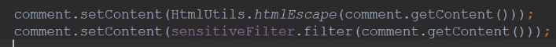
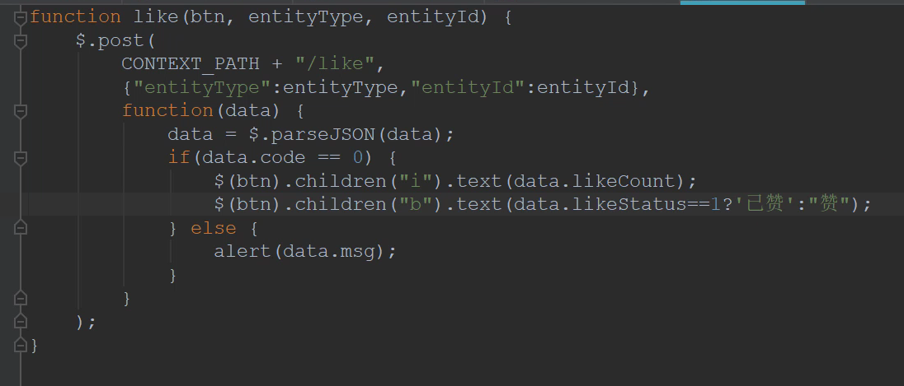
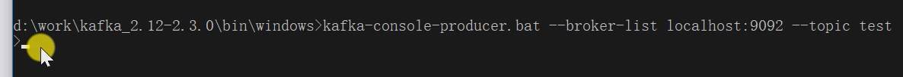
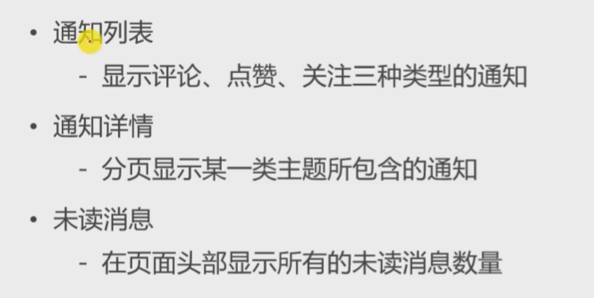
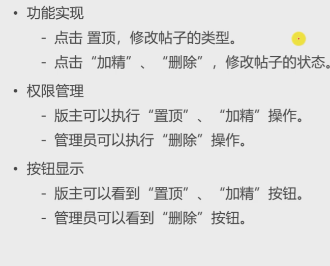

###  Spring

在测试类中测试IoC容器的存在

- 添加注解`@ContextConfiguration(classes = CommunityApplication.class)`
- 实现接口 `ApplicationContextAware`
- 重写方法`public void setApplicationContext(ApplicationContext applicationContext)`

```java
@SpringBootTest
@ContextConfiguration(classes = CommunityApplication.class)//在测试类中加上此注解就能将配置类（）引用在本类中
class CommunityApplicationTests implements ApplicationContextAware {

	private ApplicationContext applicationContext;
	@Override
	public void setApplicationContext(ApplicationContext applicationContext) throws BeansException {
		this.applicationContext = applicationContext;
	}
	@Test
	public void testApplicationContext(){
		System.out.println(applicationContext);
        //org.springframework.web.context.support.GenericWebApplicationContext@598bd2ba, started on Thu Jun 02 19:55:32 CST 2022
		//证明容器是存在的
	}
}
```

`@Primary`  注解在bean上表示优先被Ioc实例化
`@PostConstruct` 注解在方法上，表示在构造器运行之后执行
`@PreDestory` 注解在方法上，表示在销毁方法前执行

**想实例化一个第三方jar包的bean**：自己写个配置类，通过bean注解实现

`@SpringbootApplication` 一般用于**程序入口**的配置类
`@Configuration` 表示为**一般**配置类

```java
@Configuration
public class AlphaConfig {
    @Bean
    public SimpleDateFormat simpleDateFormat(){
        return new SimpleDateFormat("yyyy-MM-dd HH:mm:ss");
    }
}
```

```java
@Test
	public void testBeanConfiguration(){
		SimpleDateFormat simpleDateFormat = applicationContext.getBean(SimpleDateFormat.class);
		System.out.println(simpleDateFormat.format(new Date()));
        //2022-06-02 20:13:55
	}
```


### MVC

##### 传递参数方式

第一种:

```java
@RequestMapping(path = "/student",method = RequestMethod.GET)
@ResponseBody
public String getStudent(@RequestParam(name="current",required=false,defalutValue="1") int current,
                        @RequestParam(name="limit",required=false,defalutValue="10") int limit){}
```

RestFul

```java
@RequestMapping(path = "/student/{id}",method = RequestMethod.GET)
@ResponseBody
public String getStudent(@PathVariable("id") int id){
        System.out.println(id);
        return "a student";
    }
```

### 邮件功能

1. 在sina开启授权码状态，和POP3,SMTP服务

2. 新建工具类MailClient

   ```java
   /*	1.将其添加到springIoC管理
   *	2.定义一个Logger，用于记录错误信息
   *	3.将配置文件中的username注入，这是（代表了网站）发送方
   *	4.定义sendMail方法，需要 发邮件的标题 ，内容 ，我的邮箱 ，他人的邮箱 四个参数
   		需要spring中的MimeMessageHelper 帮助构建邮件
   */
   @Component
   public class MailClient {
       private static final Logger logger = LoggerFactory.getLogger(MailClient.class);
   
       @Autowired
       private JavaMailSender mailSender;
       //需要发邮件的标题，内容，我的邮箱，他人的邮箱
       //将username注入，因为服务器发邮件都是用直接的账号（配置中的sina）
       @Value("${spring.mail.username}")
       private String from;
   
       //封装公有方法
       public void sendMail(String to, String subject, String content) {
           try {
               MimeMessage message = mailSender.createMimeMessage();
               MimeMessageHelper helper = new MimeMessageHelper(message);
               helper.setFrom(from);
               helper.setTo(to);
               helper.setSubject(subject);
               helper.setText(content, true);
               mailSender.send(helper.getMimeMessage());
           } catch (MessagingException e) {
               logger.error("发送邮件失败" + e.getMessage());
           }
       }
   }
   ```

   测试：

```java
@Autowired
private MailClient mailClient;//注入工具类

@Test
public void testMail(){
    mailClient.sendMail("574524709@qq.com","test","test mail");
}
```

需要发html形式邮箱：采用thymeleaf构建模板：

```html
<!DOCTYPE html>
<html lang="en" xmlns:th="http://www.thymeleaf.org">
<head>
    <meta charset="UTF-8">
    <title>邮件示例</title>
</head>
<body>
    <p>欢迎您，<span style="color: darkorchid;" th:text="${username}"></span>!</p>
</body>
</html>
```

测试：

```java
@Autowired
private TemplateEngine templateEngine;//springboot中已管理了模板引擎，只需注入
@Test
    public void testHtmlMail(){
        Context context = new Context();//注意是thymeleaf的类
        context.setVariable("username","sunday");//这是其中的一个变量
        String content = templateEngine.process("/mail/demo", context);//把模板地址，数据传入如
        System.out.println(content);
        mailClient.sendMail("574524709@qq.com","HTML",content);
}
```

### 6.5

启动出现问题

```
java.sql.SQLNonTransientConnectionException: Public Key Retrieval is not allowed
```

在配置中数据库连接后加上

```
allowPublicKeyRetrieval=true
```

在首页点击（首页），（注册）都无页面

```html
<!--注意thymeleaf的这个写法是错的-->
<a class="nav-link" th:href="@{site/index.html}">首页</a>
<!--采用这样-->
<a class="nav-link" th:href="@{index}">首页</a>
```

### Cookie

```java
 //Cookie示例
    @RequestMapping(path = "/cookie/set",method = RequestMethod.GET)
    @ResponseBody
    public String setCookie(HttpServletResponse response){
        Cookie cookie = new Cookie("code1", CommunityUtil.generateUUID());
        //设置范围，有些路径下有效的
        cookie.setPath("/community/alpha");
        //生存时间（默认是关闭浏览器失效）
        cookie.setMaxAge(600);//秒
        //发送
        response.addCookie(cookie);
        return "set cookie";
    }

    @RequestMapping(path = "/cookie/get",method = RequestMethod.GET)
    @ResponseBody
    public String getCookie(@CookieValue("code1") String code1){//原本在request中取得，但可以用注解取得并赋给值
        System.out.println();
        return "get cookie";
    }
```

### session

优点：存在服务器更安全

缺点：服务器压力

```java
 //Session是javaSE的规范，不是http的
    @RequestMapping(path = "/session/set",method = RequestMethod.GET)
    @ResponseBody
    public String setSession(HttpSession session){//与cookie不同，springMVC会自动创建Session,只需要声明，就能注入进来
        session.setAttribute("id",1);
        session.setAttribute("name","test");
        return "session test";
    }

    @RequestMapping(path = "/session/get",method = RequestMethod.GET)
    @ResponseBody
    public String getSession(HttpSession session){
        System.out.println(session.getAttribute("id"));
        System.out.println(session.getAttribute("name"));
        return "get session test";
    }
```

<font color=red>分布式部署</font>：nginx实现负载均衡

- 粘性session：同一ip的请求均分配到指定一台服务器上
- 同步session：服务器将session同步给所有服务器
- 共享session：有一台单独的服务器用于处理session，其他服务器与该服务器
- 主流：不使用session，而是用cookie，部分不适合存cookie的存数据库里，数据库集群备份
- 更好的做法：不存在关系型数据库（硬盘）中，而是NOSQL中

### 生成验证码

Kaptcha：

- 导入jar包
- 编写kaptcha配置类
- 生成随机字符，图片

### 登入和退出

登录请求：

- 点击上方的“登入”，能跳到登入页面
- 点击“立即登入”，返回结果（登入凭证，cookie）发给客户端

退出请求:

- 将登入凭证修改为失效状态
- 跳转至首页

数据库中的表 login_ticket：

| id   | user_id | ticket               | status        | expired  |
| ---- | ------- | -------------------- | ------------- | -------- |
|      |         | 随机字符串，唯一标识 | 0-有效 1-无效 | 过期时间 |

1、创建实体类，封装数据

```java
//dao

/**
 * 在本类中，学习使用注解实现sql，不是xml
 *
 */
@Mapper
public interface LoginTicketMapper {

    //登入成功后要插入凭证//需要声明主键自动生成，@Options，且需要将生成的值注入给对象，keyProperty = "id"
    @Insert({
            "insert into login_ticket (user_id,ticket,status,expired) ",//加个空格断开
            "values(#{userId},#{ticket},#{status},#{expired})"
    })
    @Options(useGeneratedKeys = true,keyProperty = "id")
    int insertLoginTicket(LoginTicket loginTicket);

    //查询方法：围绕ticket
    @Select({
            "select id,user_id,ticket,status,expired ",
            "from login_ticket where ticket=#{ticket}"
    })
    LoginTicket selectByTicket(String ticket);

    //修改凭证状态：不删除
    @Update({
            "update login_ticket set status=#{status} where ticket=#{ticket}"
    })
    int updateStatus(String ticket,int status);
    //学习：假如需要动态sql时
    /*@Update({
            "<script>",
            "update login_ticket set status=#{status} where ticket=#{ticket} ",
            "<if test=\"ticket!=null\">",
            "and 1 =1",
            "</if>",
            "</script>"
    })*/
}
```

```java
//UserService


//实现登入功能：成功、失败（多种情况）
    public Map<String ,Object> login(String username,String password,int expiredSeconds){
        Map<String ,Object> map = new HashMap<>();
        //空值判断
        if(StringUtils.isBlank(username)){
            map.put("usernameMsg","账号不能为空！");
            return map;
        }
        if(StringUtils.isBlank(password)){
            map.put("passwordMsg","密码不能为空！");
            return map;
        }
        //验证合法性
        User user = userMapper.selectByName(username);
        if(user==null){
            map.put("usernameMsg","账号不存在！");
            return map;
        }
        //没激活的账号不能登入
        if(user.getStatus()==0){
            map.put("usernameMsg","账号未激活！");
            return map;
        }
        //密码
        password = CommunityUtil.md5(password+ user.getSalt());
        if(user.getPassword().equals(password)){
            map.put("passwordMsg","密码不正确！");
            return map;
        }
        //登入成功，生成登入凭证
        LoginTicket loginTicket = new LoginTicket();
        loginTicket.setUserId(user.getId());
        loginTicket.setTicket(CommunityUtil.generateUUID());
        loginTicket.setStatus(0);//有效状态
        loginTicket.setExpired(new Date(System.currentTimeMillis()+expiredSeconds*1000));
        loginTicketMapper.insertLoginTicket(loginTicket);
        //这个LoginTicket表就相当与session了，下次用户请求带上ticket，服务器查询状态和时间看是否有效
        map.put("ticket",loginTicket.getTicket());
        return map;
    }
```

```java
//LoginController

@RequestMapping(path = "/login",method = RequestMethod.POST)
    public String login(String username,String password ,String code,boolean rememberme,//这个rememberme是勾选记住我
                        Model model,HttpSession session,HttpServletResponse response){//model用于范围响应数据；getKaptcha存的验证码需要session获取；登入成功了，需要将ticket发给客户端用cookie保存
        String kaptcha = (String) session.getAttribute("kaptcha");
        if(StringUtils.isBlank(kaptcha)||StringUtils.isBlank(code)||!kaptcha.equalsIgnoreCase(code)){
            model.addAttribute("codeMsg","验证码不正确");
            return "/site/login";
        }
        //检查账号密码
        //如果勾选了“记住我”，则存的时间长一点
        //这里再次在CommunityConstant类添加常量
        int expiredSecond = rememberme?REMEMBER_EXPIRED_SECONDS:DEFAULT_EXPIRED_SECONDS;
        Map<String, Object> map = userService.login(username, password, expiredSecond);
        //如果map总包含ticket，就是成功了
        if(map.containsKey("ticket")){
            Cookie cookie = new Cookie("ticket",map.get("ticket").toString());
            cookie.setPath(contextPath);//表示整个项目下cookie都是有效的:注入properties中的值
            cookie.setMaxAge(expiredSecond);
            response.addCookie(cookie);//将cookie发给用户
            return "redirect:/index";
        }else {
            model.addAttribute("usernameMsg",map.get("usernameMsg"));
            model.addAttribute("passwordMsg",map.get("passwordMsg"));
            return "/site/login";
        }
    }
```

### 显示登入信息

根据登入与否，调整头部信息，由于在整个网站都有：设定拦截器

1、定义拦截器

```java
@Controller
public class AlphaInterceptor implements HandlerInterceptor {
    private static final Logger logger = LoggerFactory.getLogger(AlphaInterceptor.class);

    @Override
    public boolean preHandle(HttpServletRequest request, HttpServletResponse response, Object handler) throws Exception {
        logger.debug("preHandle调用了:"+handler.toString());
        return true;
    }

    //在Controller之后运行，模板引擎之前执行
    @Override
    public void postHandle(HttpServletRequest request, HttpServletResponse response, Object handler, ModelAndView modelAndView) throws Exception {
        logger.debug("postHandle调用了:"+handler.toString());
    }

    //在模板引擎TemplateEngine之后执行
    @Override
    public void afterCompletion(HttpServletRequest request, HttpServletResponse response, Object handler, Exception ex) throws Exception {
        logger.debug("afterCompletion调用了:"+handler.toString());
    }
    //写完之后在config建立配置类
}
```

2、配置拦截器，指定、排除路径

```java
@Configuration
public class WebMvcConfig implements WebMvcConfigurer {


    @Autowired
    private AlphaInterceptor alphaInterceptor;

    @Override
    public void addInterceptors(InterceptorRegistry registry) {
        registry.addInterceptor(alphaInterceptor).
                excludePathPatterns("/**/*.css","/**/*.js","/**/*.png","/**/*.jpg","/**/*.jpeg")  //不拦截静态资源
                .addPathPatterns("/register","/login"); //明确要拦截的路径：注册和登入
    }
}
```

拦截器在本节的实现：

-  在请求开始时查询登入用户
- 在本次请求中持有的用户数据
- 在模板视图上显示用户数据
- 在结束请求时清理用户数据

### 账号设置

上传头像和修改密码

上传文件：

- 请求：post
- 表单：enctype="multipart/form-data"
- SpringMVC ：通过MultipartFile处理上传文件

步骤：

1. 访问页面
2. 上传头像
3. 获取头像：在其他页面都要获取

## 6.14

### 注册功能

1.Controller层

```java
//LoginController
@RequestMapping(path = "/register",method = RequestMethod.GET)
    public String getRegisterPage(){
        return "/site/register";
    }
```

2.修改register页面

3.引入CommonsLang包，用于常用字符串检测

4.写工具类（生成随机字符串，加密等），由于不需要交给容器托管，因此写成静态方法

```java
//使用 自带的UUID包生成随机字符串
public static String generateUUID(){
        return UUID.randomUUID().toString().replaceAll("-","");//不想要有横线
    }
//加密密码:使用Spring 自带的工具类 DigestUtils.md5DigestAsHex()
public static String md5(String key){
        if(StringUtils.isBlank(key)){//先简单判断下不为空，采用了commons lang包
            return null;
        }else {
            return DigestUtils.md5DigestAsHex(key.getBytes(StandardCharsets.UTF_8));//这是spring自带的加密方法
        }
    }
```

5.开发注册业务

```java
//UserService
//注入邮件客户端，模板引擎
//注入项目名，项目路径
	@Autowired
    private MailClient mailClient;
    @Autowired
    private TemplateEngine templateEngine;
    //注册时发送激活码需要带上域名和项目名，因此从properties中注入
    @Value("${community.path.domain}")
    private String domain;
    @Value("${server.servlet.context-path}")
    private String contextPath;
    @Autowired
    private LoginTicketMapper loginTicketMapper;
```

6.开发业务

> - 返回结果：错误信息（注册成功、账号已存在等）---> Map
>
>   1. 空值判断：账号，密码，邮箱
>
>   2. 验证：（账号已存在、邮箱已存在）——> userMapper.selectByName
>
>   3. 注册用户：把用户插入库中
>
>      1. user.setSalt
>
>      2. user.setPassword() 将salt+原密码并加密覆盖原密码
>
>      3. user.setType/setStatus/setActivationCode/setHeader
>
>      4. 随机头像设置
>
>         ```java
>         user.setHeaderUrl(String.format("http:\\image.nowcoder.com/head/%dt.png",new Random().nextInt(1000)));
>         ```
>
>      5. 给用户发激活邮件
>
>
> ```java
> Context context = new Context();//Thymeleaf自带对象：模板生成html格式邮件
> context.setVariable("email",user.getEmail()); 
> //动态拼接用户能点的路径（每个用户的激活页面是不同的） :101 是用户id，code是激活码
> //http://localhost:8080/community/activation/101/code
> String url = domain+contextPath+"/activation/"+user.getId()+"/"+user.getActivationCode();
> context.setVariable("url",url);
> //生成模板引擎
> String content = templateEngine.process("/mail/activation",context);
> mailClient.sendMail(user.getEmail(), "账号激活",content);
> ```
>
> 

```java
//userService
    public Map<String,Object> register(User user){
        Map<String ,Object> map = new HashMap<>();
        //先对空值做判断
        if(user==null){
            throw new IllegalArgumentException("参数不为空");
        }
        if(StringUtils.isBlank(user.getUserName())){
            map.put("usernameMsg","账号不能为空!");
            return map;
        }
        if(StringUtils.isBlank(user.getPassword())){
            map.put("passwordMsg","密码不能为空!");
            return map;
        }
        if(StringUtils.isBlank(user.getEmail())){
            map.put("emailMsg","邮箱不能为空!");
            return map;
        }
        //账号是否存在
        User u = userMapper.selectByName(user.getUserName());
        if(u!=null){
            map.put("usernameMsg","账号已存在!");
            return map;
        }
        //邮箱验证
        u = userMapper.selectByEmail(user.getEmail());
        if(u!=null){
            map.put("emailMsg","该邮箱已被注册!");
            return map;
        }
        //可以注册了
        user.setSalt(CommunityUtil.generateUUID().substring(0,5));
        user.setPassword(CommunityUtil.md5(user.getPassword()+user.getSalt()));
        user.setType(0);//普通用户
        user.setStatus(0);//未激活
        user.setActivationCode(CommunityUtil.generateUUID());//生成一个激活码
        //为用户设置随机头像，牛客网的头像库有0-1000 号头像
        user.setHeaderUrl(String.format("http://images.nowcoder.com/head/%dt.png",new Random().nextInt(1000)));
        user.setCreateTime(new Date());
        userMapper.insertUser(user);
        //给用户发邮件，用于激活 模板 activation.html
        Context context = new Context();
        context.setVariable("email",user.getEmail());
        //动态拼接用户能点的路径（每个用户的激活页面是不同的） :101 是用户id，code是激活码
        //http://localhost:8080/community/activation/101/code
        String url = domain+contextPath+"/activation/"+user.getId()+"/"+user.getActivationCode();
        context.setVariable("url",url);
        //生成模板引擎
        String content = templateEngine.process("/mail/activation",context);
        mailClient.sendMail(user.getEmail(), "账号激活",content);
        return map;
    }
```

7.控制器

> 1. 将userService注入
>
> 2. 定义方法处理用户的注册请求：register页面  post
>
>    ```java
>    @RequestMapping(path = "/register",method = RequestMethod.POST)
>        public String register(Model model, User user)
>    ```
>
>    
>
>    ```java
>    		Map<String,Object> map = userService.register(user);
>            if(map==null||map.isEmpty()){
>                model.addAttribute("msg","注册成功，我们已向你的邮箱发送了激活邮件，请尽快激活！");
>                model.addAttribute("target","/index");
>                return "/site/operate-result";//跳转到跳转页面
>            }else{//携带信息，重新回到注册页面，把service层的三个信息都发回，如果是空的就不显示
>                model.addAttribute("usernameMsg",map.get("usernameMag"));
>                model.addAttribute("passwordMsg",map.get("passwordMag"));
>                model.addAttribute("emailMsg",map.get("emailMag"));
>                model.addAttribute("user",user);//测试
>                return "/site/register";
>    ```

8.激活账号

> 在service层添加业务
>
> ```java
> 	public int activation(int userId,String code){//传入用户id，和激活码code，查询激活码
>         User user = userMapper.selectById(userId);
>         if(user.getStatus()==1){//已经激活了
>             return ACTIVATION_REPEAT;
>         }else if(user.getActivationCode().equals(code)){
>             userMapper.updateStatus(userId,1);//修改激活状态
>             return ACTIVATION_SUCCESS;
>         }else {
>             return ACTIVATION_FAILURE;
>         }
>     }
> ```
>
> Controller
>
> ```java
> @RequestMapping(path = "/activation/{userId}/{code}",method = RequestMethod.GET)
>     public String activation(Model model, @PathVariable("userId") int userId,@PathVariable("code") String code){
>         int result = userService.activation(userId,code);
>         if(result==ACTIVATION_SUCCESS){
>             model.addAttribute("msg","激活成功！");
>             model.addAttribute("target","/login");
>         }else if(result==ACTIVATION_REPEAT){
>             model.addAttribute("msg","该账号已经激活过！");
>             model.addAttribute("target","/index");
>         }else{
>             model.addAttribute("msg","激活失败！");
>             model.addAttribute("target","/index");
>         }
>         return "/site/operate-result";
>     }
> ```
>
> 

## 8.14

### 账号设置（上传文件）

请求:必须是POST请求，
表单: enctype= "multipart/form-data
Spring MVC:通过MultipartFile处理.上传文件

## 8.15

### 检查登入状态

如果有人知道一些路径，就可以在没登入时进入某些页面，应该配置拦截器阻止非法访问。

```
●使用拦截器
-在方法前标注自定义注解
拦截所有请求，只处理带有该注解的方法
●自定义注解
常用的元注解:
@Target、@Retention、@Document、 @Inherited
如何读取注解:
Method . getDeclaredAnnotations ()
Method . getAnnotation (Class<T> annotationClass)
```

1.先定义注解

```java
@Target(ElementType.METHOD)
@Retention(RetentionPoliy.RUNTIME)
public @interface LOginRequired{
    //不用写东西，只是标记的作用
}
```

2.在需要的方法前加上该注解

3.定义拦截器

```java
@Autowired
public HostHolder hostHolder;//尝试获取当前的用户来判断登入

@Component
public Class LoginRequiredIntercepter implements HandlerInceptor{
    @override
    public boolean prehander(HttpServletRequest request,HttpServlet response, Object handler) throws Exception{
        //参数的 Object handler是拦截的目标，目标是方法才能执行
        if(handler instanceof HandlerMethod){
            HandlerMethod handlerMethod = (HandlerMethod) handler;
            //通过它的方法来直接获取拦截到的方法
            sMethod method = handlerMethod.getMethod();
            //有了方法对象，尝试从方法对象中获取注解
            LoginRequired loginRequired = method.getAnnotation(LoginRequired.class);
            if(loginRequired != null && hostHolder.getUser()== null){//且获取不到登入用户
                response.sendRedirect(request.getContextPath()+"/login");
                return false;
            }
        }
    }
  
}
```

4.将拦截器注入WebMvcConfig

```java
//1.先注入
@Autowired
private LoginRequiredInterceptor loginRequiredInterceptor;
//2.然后在addInterceptor加入
registry.addInterceptor().excludePathPatterns()
```

# 9

### 3.1 过滤敏感词🔰🈵

​	前缀树，建树，初始化postConstruct，字符匹配


1.在resource 下创建文件，写入敏感词

2.在util包下创建  sensitiveFilter

```java
//@component
class sensitiveFilter{
    private class TrieNode{
        //结束标识
       private boolean isEnd = false;
        //子结点
        private Map<Character,TrieNode> subNodes = new HashMap<>();
        
        //getter setter方法
        //...
      
        //添加子节点 
        public void addSubNode(Character c,TrieNode node){
            subNodes.put(c,node);
        }
        public TrieNode getSubNode(Character c){
            return subNodes.get(c);
        }
    }
    
    //本类的其余内容
    //Logger.........
    //敏感词所替换的常量 ***
    //根节点:只要首次访问时就有就行了
    public TrieNode rootNode = new TrieNode();
    
    //初始化方法
    @PostConstruct
    public void init(){
        //try的括号里执行下两步
        //想获取数，把txt文件的读取出来，我们获取类加载器，从类路径下加载资源（idea中项目的target包下的classes包）
        InputStream is = this.getClass().getClassLoader().getResourceAsStream("sensitive-words.txt");//注意加上try-catch-finaly
        //转化成缓冲流效率高 
        BufferedReader reader = new BufferedReader(new InputStreamReader(is));
        //try的内部
        String keyword;
        while((keyword=reader.readLine())!=null){
            //添加到前缀树中
            this.addKeyword(keyword);
        }
    }
    
    //addKeyword(String word) 方法
   private void addKeyword(String keyword){
       TrieNode tempNode = rootNode;
       for(int i = 0;i<keyword.length();i++){
           char c = keyword.charAt(i);
         TrieNode subNode = tempNode.getSubNode(c);//有的话就获取，没有的话就新建
           if(subNode==null){
               //初始化子节点
               subNode = new TrieNode();
               tempNode.addSubNode(c,subNode);
           }
           //指向子节点，进入下一层循环
           tempNode = subNode;
           //最后一个字符
           if(i==keyword.length()-1){
               tempNode.setKeyWordEnd(true);
           }
       }
   } 
    
    //检索的方法 ，返回一个已经替换过的字符串
    public String filter(String text){
        if(StringUtils.isBlank(text)){return null};
        //根据图解，需要三个指针
      	TrieNode tempNode = rootNode;
        int begin = 0;
        int position = 0;
        //存结果
        StringBuilder sb = new StringBuilder();
        while(position<text.length()){
            char c= text.charAt(position);
            //跳过符号逻辑：比如   ♥杀♥人♥   :封装个方法
            if(isSymbol(c)){
                //如果当前指针指向根节点，直接输出
                if(tempNode==rootNode){
                    sb.append(c);
                    begin++;
                }
                //无论符号在开头或者中间，position都向下走一步
                position++;
                contiune;
            }
            //检查下个节点
            tempNode = tempNode.getSubNode(c);
            if(tempNode==null){
                //以begin开头的字符串不是敏感词，则将begin这个字符记录
                sb.append(text.charAt(begin));
                //进入下一位置
                position = ++begin;
                //重新指向根节点
                tempNode = rootNode;
            }else if(tempNode.isKeywordEnd){
                //发现了敏感字，以begin开头，position结尾
                sb.append(REPLACEMENT);
                begin = ++position;
                tempNode = rootNode;
            }else {
                position++;
            }
        }
        //补充，循环结束了，但是最后begin到posotion的字符还没记录进去
        sb.append(text.substring(being));
    }
    
    //判断是否为符号
    private boolean isSymbol(Character c){
        //c<0x2E80||c>0X9FFF 是东亚文字范围
        return !CharUtils.isAsciiAlphanumer(c)&&(c<0x2E80||c>0X9FFF);
    }
    
}
```

#### 文字回答

通过前缀树来实现，用双指针指向输入的字符串，一个一个字遍历，当检查到有敏感词时就替换，利用工具类来跳过特殊符号

### 3.6 发布帖子🔰

示例：Jquery发送ajax请求:

异步处理AJAX（采用JSON）


Service层--发布帖子+敏感词过滤


Controller层


### 3.11 帖子详情🔰

传入帖子id


service层


Controller层：使用到Rustful风格，需要将discussPostId传入，使用 `@PathVariable`
		过程：调用业务层，将帖子信息查询，将得到结果给Model ，通过`addAttribute` 
					需要将查到的userId转化为用户信息，调用UserService来获取
					（以后开发）帖子的回复


### 3.13 事务管理🔰

第一类丢失更新：

> 某一个事务的回滚，导致另一个已提交的数据丢失了。
>
> 

第二类丢失更新：

> 某一个事务提交，导致另一个已更新的数据丢失了。
>
> 


不可重复读：同一事务，两次读取的数据不一致
幻读：同一事务内，同一个表两次查询的行数不一致


声明式事务管理：

需要加上注解表示是事务


还有一个参数是事务传播机制：表示调用了另一个事务


我们新建一个测试类：（前面先加上注解）


编程式事务：


### 3.20 显示评论🔰


1.首先定义实体entity，与数据库中属性对应


2.数据访问层：


3.Mapper


4.新增业务组件


查询帖子的业务在帖子详情Discusspost业务上

### 3.22 添加评论🔰

在业务层：添加评论，再更新评论数量，是两个DML操作，需要使用到**事务管理**


mapper：


由于新增了评论，则需要再DiscussPost业务中新增 “更新评论数量”，使得查看帖子就能查看评论


在业务层添加：


本小节重点：增加评论，在service层新增
由于这其中包含两个DML，因此采用事务管理


只需要增加注解：


增加评论需要处理*html标签过滤*和*敏感词过滤*：




Controller：


### 3.24私信列表

### 3.27 发送私信

### 3.31 统一处理异常🔰🔰

由spring 提供的注解：


将错误页面添加到template目录下：由springBoot统一处理


为了完善异常处理和通知：完成以下配置

在Controller新建包advice，新建类 ExceptionAdvice，使用注解 `@ControllerAdvice`，这样组件会扫描所有的bean，因此限定其扫描带有Controller注解的bean


方法：

```java
@ControllerAdvice(annotation = Controller.class)
public class ExceptionAdvice{
   //先将日志组件注入
    private static final Logger logger = LoggerFactory.getLogget(EcxeptionAdvice.class);
    //处理异常的方法需要这个注解
    //方法必须是 public void 的，参数是Exception，和req，resp
    @ExceptionHandler(annotation = Controller.class)
  	public void handler(Exception e,HttpServletRequest request,HttpServletResponse response) throws IOException{
        //将异常计入日志
        logger.error("服务器发生异常:"+e.getMessage());
        //我们想更详细的异常信息：栈信息：遍历栈
        //栈中元素是 StackTraceElement
        for(StackTraceElement elemnt :e.getStackTrace()){
            logger.error(element.tostring());
        }
        //由于这里是重定向 500这个页面，只适用于同步的请求
        //如果是异步请求，需要返回json/XML
        //通过request来判断
       String xRequestedWith =  request.getHeader("x-requested-with");
        if("XMLHttpRequest"==xRequestedWith){//发现是异步请求
            response.setContentType("application/plain;charset=utf-8");
            PrintWriter writer = response.getWriter();//这里需要抛出异常
            writer.write(CommunityUtil.getJSONString(1,"服务器异常"));
        }else{//是普通请求的话，就重定向
            response.sendRedirect(request.getContextPath()+"/error");
        }
    }
}
//使用该方法的好处是，不需要在任何Controller上改动就能统一处理问题
```

#### 文字回答

<font color ='litered'>采用ControllerAdvice注解，创建一个异常处理类，参数里只要筛选Controller层的类，然后实现方法handler，采用ExceptionHandler注解，方法参数传递异常e，response和request，具体处理流程：使用日志组件写入日志，打印栈，重定向`response.sendRedirect`到500页面.</font>


### 3.33 统一记录日志🔰🔰

传统方法：将记录日志的组件封装到方法里，然后在需要的地方调用

但这个是系统需求，在业务方法里面耦合的话很不好，将来要改动的话很难。

采用AOP


```java
@Component
@Aspect
public class ServiceLogAspect{
    private static final Logger logger = LoggerFactory.getLogger(ServiceLogAspect);
    //首先申明切点
    //加上 PointCut注解，声明织入的位置
    @PointCut("execution(* com.nowcoder.community.service.*.*(..))")
    public void pointCut(){
    }
    
    //使用前置通知
    @Before("pointCut()")
    public void before(JointPoint jointPoint){
        //格式 用户[ip] 在 XXX时间访问了 XXX方法
        //这里需要获取用户地址，但不要在这声明Request对象，而使用工具类RequestContextHolder
        ServletReqeustAttributes attributes = (ServletRequestAttributes) RequestContextHolder.getRequestAttributes();
        HttpServletRequest request = attributes.getRequest();
        String ip = request.getRemoteHost();
        String now = new SimpleDateFormat("yyyy-MM-dd HH:mm:ss").format(new Date());
        //最后访问某个类的方法，需要连接点参数jointPoint
        String target = jointPoint.getSignature().getDeclaringTypeName()+"."+jointPoint.getSignature().getName();
        logger.info(String.format("用户[%s]，在[%s]访问了[%s].",ip,now,target));
    }
    
}
```


### 4.1 redis🔰


快照形式：RDB：整体存入硬盘中

日志形式：AOF：将日志记入硬盘中，实时性好，但维护耗时

在github下载windows的redis，安装后自动运行，其默认端口号为：6379.将其配置在系统变量


```shell
redis-cli #启动客户端
#系统默认16个库，采用0-15命名
>>select 1	#切换到库1
OK
>>flushdb  #刷新内容
#String 类型
>>set test:count 1
OK
>>get test:count
"1"
>>incr test:count #变量自增
(integer) 2
>>decr test:count
(integer) 1
```

```shell
# Hash 类型数据,值也是键值对  hset KEY FIELD VALUE
>>hset test id 1
(integer) 1
>>hset test username zhangshan
"zhanshan"
>>hget test id
"1"
```

```shell
# List 列表:支持左、右插入   左、右取值
>>lpush test 101 102 103  #相当于将101，102，103左插入列表，此时为[103, 102, 101]
(integer) 3
>>llen test
3
>>lindex test 0
103
>>lrange test 0 2 #表示范围从0到2
1) "103"
2) "102"
3) "101"
>>rpop test  #从右侧弹出
"101"
```

```shell
#Set 集合
>>sadd test aaa bbb ccc ddd eee
(integer) 5
>>sard test # 统计多少元素
(integer) 5
>>spop test #随机弹出一个元素
"ccc"
>>smembers test # 集合剩余元素
1) "aaa"
2) "bbb"
3) "ddd"
4) "eee"
```

```shell
#socket set有序集合 :给定分数，按分数排序
>>zadd test 10 aaa 20 bbb 30 ccc 40 ddd 50 eee
(integer) 5
>>zcard test # 统计多少元素
(integer) 5
>>zscore test ccc #查询某个值的分数
"30"
>>zrank test ccc # 返回某个值的排名
(integer) 2
>>zrange test 0 2
"aaa"
"bbb"
"ccc"
```

```shell
#全局命令
 >>keys * #查询库中有多少
 >>keys t* #以 t 开头的有多少个
 >>type test # 查询是什么数据类型的
 >>exists test #查询是否存在
 >> del
 >>expire test 60 #设置该keys的过期时间为60s，用于验证码

```


### 4.7 springboot 整合redis🔰


Springboot将Redis的键值对的键由String转成Object，但我们常用还是String，因此要重新配置

首先在application.properties配置

```shell
spring.redis.database=11 #随便选一个库就行
spring.redis.host=localhost
spring.redis.port=6379
```

编写配置类：

```java
@Configuration
public class RedisConfig{
    @Bean
    public RedisTemplate<String,Object> redisTemplate(RedisConnectionFactory factory){
        //要能访问数据库，需要创建连接：注入工厂(在形参中注入)
        //在方法中实例化Bean
        RedisTemplate<String,Object> template = new RedisTemplate<>();
        template.setConnectionFactory(factory);
        //主要配的是序列化的方式（将java数据存入redis）
        //1.设置key的序列化方式
        template.setKeySerializer(RedisSerializer.string());
        //2.设置value的序列化方式
        template.setValueSerializer(RedisSerilalizer.json());
        //特殊：设置hash的key的序列化方式
        template.setHashKeySerializer(RedisSerializer.string());
        //特殊：设置hash的value序列化方式
        template.setHashValueSerialize(RedisSerializer.json());
        //使设置的配置生效
        template.afterPropertiesSet();
        return template;
    }
}
```

```java
//测试
@Autowired
private RedisTemplate redisTemplate;
@Test
public void testStrings(){
    String redisKey = "test:count";
    redisTemplate.opsForValue().set(redisKey,1);
    sout(redisTemplate.opsForValue().get(redisKey));
    sout(redisTemplate.opsForValue().increment(redisKey));
}
```

测试Hash同理


测试列表


测试集合


对Keys的测试


编程式事务


由`multi()` 开启事务，由`exec()`提交事务，在事务之间的操作保存在队列里并不会执行，因此查询语句不会显示查到结果

### 4.10 点赞🔰

由于redis操作简单，因此不开发mapper，而直接开发service层，面向**key** 实现

```java
//先写个工具类
public class RedisKeyUtil{
    private static final String SPLIT = ":";//存下分隔符
    //我们将帖子和帖子的评论称为实体
    private static final String PREFIX_ENTITY_LIKE = "like:entity";
    
    //返回某个实体的赞，拼成以下形式：//将点过赞的用户id存入集合中
    // like:eneity:{entityType}:{entityId} -> set(userId)
    public static String getEntityLikeKey(int entityType,int entityId){
        return PREFIX_ENTITY_LIKE + SPLIT + entityType + SPLIT + entityId;
    }
}
```

```java
// LikeService
@Service
public class LikeService{
    @Autowired
    private RedisTemplate redisTemplate;
    
    //点赞
    public void like(int userId,int entityType,int entityId){
        //存入Redis的key统一命名
        String entityLikeKey = RedisKeyType.getEntityLikeKey(entityType,entityId);
        //检查是否存在（点过赞再次点击就是取消）
        boolean isMember = redisTemplate.opsForSet().idMemeber(entityLikeKey,userId);
        if(isMember){
            redisTemplate.opsForSet().remove(entityLikeKey,useId);
        }else{//否则就添加数据
            redisTemplate.opsForSet().add(entityLikeKey,useId);
        }
    }
    
    //查询实体的点赞数量
    public long findEntityLikeCount(int entityType,int entityId){
        String entityLikeKey = RedisKeyType.getEntityLikeKey(entityType,entityId);
        return redisTemplate.opsForSet().size(entityLikeKey);
    }
    //查询某人对某实体的点赞状态，返回整数（以后业务扩展出点踩）
    public int findEntityLikeStatus(int userId,int entityType,int entityId){
        String entityLikeKey = RedisKeyType.getEntityLikeKey(entityType,entityId);
        return redisTemplate.opsForSet().isMember(entityLikeKey,userId)?1:0;
    }
}
```

```java
//表现层：点赞是异步请求，即时刷新
@Controller
public class LikeController{
    @Autowired
    private LikeService likeService;
    @Autowired
    private HostHolder hostHolder;
    
    @Requestmapping(path = "/like",method =RequestMethod.POST)
    @ResponseBody//异步请求
    public String liek(int eneityType,int entityId){
        User user = hostHolder.getUser();
        //以后会使用Spring Security对拦截器重构
        //点赞实现
        likeService.like(user.getId(),entityType,entityId);
        //数量
        long likeCount = likeService.findEntityLikeCount(entityType,entityId);
        //状态	
        int likeStatus = likeService.findEntityLikeStatus(user.getID(),entityType,entityId);
        //用map 封装
        Map<String,Object> map = new HashMap<>();
        map.put("likeCount",likeCount);
        map.put("likeStatus",likeStatus);
        //最终返回json格式数据
        return CommunityUtil.getJsonString(0,null,map);//这是之前封装的工具
    }
}
```

修改模板

找到点赞的位置，修改href为空，新增 `onclick`标签，里面调用js函数`like(this,1,${post,id})`
this 是从本页面三种类型的赞找到，1是表示帖子的entityType


返回状态：赞是数量


写个js文件



btn是当前按钮，获取按钮下的标签b，和i，修改其值

运行后可以使用，但是初始显示的赞数量不对


### 4.13 我受到的赞

### 4.16 关注、取消关注

### 4.19 关注列表、粉丝列表

### 4.23 优化登入模块


### 5.1阻塞队列🔰


### 5.5 kafka🔰


高吞吐量，消息持久化：对硬盘的顺序读取效率是高于内存的随机读取的。
高可靠性：是分布式的
Broker：kafka集群上每一个**服务器**称为Broker
Zookeeper：用于管理集群
Topic：用于点对多生产消费方式，消费者发布后的， 用于存放消息的位置
Partition：对topic位置的分区
offset：消息在分区内存放的索引
Replica：副本，主副本和从副本（只做备份不做响应），主副本挂掉，会从众多从副本重新选

下载kafka，做初始配置。（.sh 是linux命令，.bat 是Windows命令）默认端口是9092

1.配置zookeeper，将原本liunx地址改成windows下地址

、


2.配置server.propertise：
默认日志地址改为windows

启动测试：需要先启动zookeeper，并指定配置文件


再打开另一个命令行，启动kafka


执行以下：

`--create` 创建主题
`--bootstrap--server` 在哪个主题上
`--replication-factor 1`  创建 1 个副本
`--partitions 1`   一个分区
`--topic`  主题名字

查询以下有没有创建成功：

接下来发送消息，以生产者身份调用



`--broker-list` 选择服务器（现在只有一个）   `--topic test` 选择主题。完成后下行出现三角


发送了消息，现在是阻塞状态，然后我们再打开一个cmd启用消费者


然后在生产者输入，消费者会自动出现（有点像聊天）


### 5.9 springboot 整合kafka🔰

spring中整合的主要依赖`kafkaTemplate`（用的时候直接注入）


1.mvn引入kafka

2.配置properties

先打开kafak文件的consumer.properties


写测试

```java
public class KafkaTests{
    @Autowired
    private KafkaProducer kafkaProducer;
    @Test
    public void testKafka(){
        kafkaProducer.sendMessage("test","你好");
        kafkaProducer.sendMessage("test","在吗");
        //等待一下让消费者输出
        try{
            Thread.sleep(10000);
        }catch(Exception e){
            e.printStackTrace();
        }
    }
}

//在这里写生产者和消费者
@Component
class KafkaProducer{
    @Autowired
    private KafkaTemplate kafkaTemplate;
    public void sendMessage(String topic,String content){//参数是主题和内容
        kafkaTemplate.send(topic,content);
    }
}

@Component
class KafkaConsumer{
    //不需要kafkaTemplate，因为是被动的接受参数
    @KafkaListener(topics={"test"})//spring自动监听这些主题，阻塞监听，然后交给方法
	public void handleMessage(ConsumerRecord record){
        sout(record);
    }
    
}
```

关键点：**生产者是主动调用的，而消费者被动的**


### 5.11 发送系统通知🔰


以事件作为驱动，定义事件class

```java
public class Event{
    private String topic;
    private int userId;
    private int entityType;
    private int entityId;
    private int entityUserId;
    private Map<String,Object> data = new HashMap<>();//存其他还不知道的东西
    //对应getter，setter
    //修改setter方法，返回值Event，可以每次增加一个属性，返回再次增加
    //修改setData方法，使之不要直接传map，
    public Event setData(String key,Object value){
        this.data.put(key,value);
        return this;
    }
}
```

接着开发事件的生产者和消费者：

新建一个包Event

```java
//生产者需要调用kafkaTemplate
public class EventProducer{
    @Autowired
    private KafkaTemplate kafkaTemplate;
    //处理事件
    //
    public void fireEvent(Event event){
        //将事件发布到指定的主题
        //内容为json格式
        kafkaTemplate.send(event.getTopic(),JSONObject.toJSONString(event));
    }
}
```

```java
public class EventConsumer{
    private static final Logger logger = LoggerFactory.getLogger(EventConsumer.class);
    //处理事件是为了给message表插入数据
    @Autowired
    private MessageService messageService;
    //可以一个方法消费一个主题，一个方法消费多个主题
    @KafkaListener(topics={/*写在接口的常量*/TOPIC_COMMENT,TOPIC_LIKE,TOPIC_FOLLOW})
    public void handlerCommentMessage(ConsumerRecord record){
        if(record==null||record.value()==null){
            logger.error("消息内容为空");return ;
        }
        //将JSON格式字符串恢复成对象
        Event event= JSONObject.parseObject(record.value().toString(),Event.class);
        if(event==null){
            logger.error("消息格式错误");return;
        }
        Message message = new Message();
        message.setFromId(1);//或者存入接口常量
        message.setToID(event.getEntityUserId());
        message.setConversationId(event.getTopic());
        message.setCreateTime(new Date());
        
        //我们需要在通知中拼出语句，谁 干了什么，然后链接到指定位置
        Map<String,Object> content = new HashMap<>();
        content.put("userId",event.getUserID());//获取哪个用户干了什么
        content.put("entityType",event.getEntityEype());
        content.put("entityId",event.getEntityId());
        
        if(!event.getData().isEmpty()){
            for(Map.Entry<String,Object> entry:event.getData().entrySet()){
                content.put(entry.getKey(),entry.getValue());
            }
        }
        
        message.setContent(JSONObject.toJSONSTRING(content));
        messageService.add(message);
        //方法是消费三个主题的数据，消费的逻辑是发送一条消息，消息构造一样
    }
}
```


```java
//CommentController 添加
//注入事件
@Autowired
private EventProducer eventProducer;//在LikeController和FollowController也要加上
//在addComment函数中添加代码
{
    //在commentService.addComment(comment); 之后操作
    //触发评论事件
    //1.构造事件对象，将内容包含进来
    Event event = new Event().setTopic(1/*引用常量*/).setUserId(hostHolder.getUser().getId())
        .setEntityType(comment.getEntityType())
        .setEntityId(comment.getEntityId())
        .setData("PostId",disscussPostId);//用于链接时 需要帖子ID，这里存进map
    //区分帖子还是评论来获得对应UserId
    if(commetn.getEntityType()==?){
        DiscussPost target = discussPostService.findDiscussPostById(comment.getEntityId());
        event.setEntityUserId(target.getUserId());
    }else{
        //..
    }
    //之后我们再调用Producer处理事件
    eventProducer.fireEvent(event);//新线程执行，不会影响后续业务
}


```


### 5.13 显示系统通知

将上一节存入数据库的通知显示在页面上



dao层

```java
//MessageMapper添加：
//查询某个主题下最新通知     查询某个主题下通知数量	未读的通知数量
Message selectLatestNotice(int userId,String topic);
int selectNoticeCount(int userId,String topic);
int selectNoticeUnreadCount(int userId,String topic);

```

mapper

```xml
<!--Message-mapper-->
<select id="selectLatestNotice" resultType="Message">
	select <include refid="selectFields"></include>
    from message
    where id in(
    	select max(id) from message
    	where status!=2 and from_id=1' and to_id =#{userId} and conversation_id =#{topic}
    ) 
</select>


<select id="selectNoticeCount" resultType="int">
	select count(id)
    from message
    where status!=2
    and from_id =1
    and to_id = #{userId}
    and conversation_id = #{topic}
</select>

<select id="selectNoticeUnreadCount" resultType="int">
	select count(id)
    from message
    where status=0<!--表示未读-->
    and from_id =1
    and to_id = #{userId}
    <if test="topic!=null">
    	and conversation_id=#{topic}
    </if>
</select>
```

service

```java
//MessageService
```


### 6.1 ElasticSearch🔰

学习笔记：[(13条消息) Elasticsearch学习笔记_巨輪的博客-CSDN博客_elasticsearch学习笔记](https://blog.csdn.net/u011863024/article/details/115721328)


Restful：每个URI代表一个资源；客户端通过四个http动词，客户端不能操作资源而是提交请求；客户端和服务器交互通过表现层。

> ES中的**索引**与数据库的**database**对应()（6.0后 索引对应table）
>
> ES中的**类型**与数据库的 **table**对应（逐渐废弃）
>
> **文档**：一条**数据**，一行，文档数据结构一般为json，json的一个属性为**字段**

> **集群**的每一个服务器称为**节点**
>
> **分片**：对索引的进一步划分（并发地存）
>
> **副本**：对分片的备份


下载修改配置 elasticsearch.yml

```yaml
cluster.name: nowcoder   #集群名字
path.data: d:/work/data/elasticsearch-6.4.3/data #数据目录 
path.log: d:/work/data/elasticsearch-6.4.3/logs #日志
```

然后配置环境变量

然后安装<u>中文分词插件</u>：在github上搜索  `elasticsearch ik`
必须解压到 `work/elasticsearch-6.4.3/plugins/ik` 目录下

如何启动：`bin /elasticsearch.bat`
提示绑定了<font color='litblue'>9200</font>端口，表示成功

打开命令行访问：

```
curl -X GET "localhost:9200/-cat/health?v"    #查看集群健康状况  v表示显示标题
```


查看集群有什么节点

```
curl -X GET "localhost:9200/-cat/nodes?v"
```


查看当前服务器有多少个索引？（ES6.0以上索引就是一个表）

```
curl -X GET "localhost:9200/-cat/indices?v"
```

没有数据，及没有索引

如何建立索引？返回json格式

```
curl -X PUT "localhost:9200/test"  #使用put
```


然后再次查询有多少索引


索引的健康状况为yellow，然后删除索引：


采用postman来操作：添加一条字段（test索引下，id 为 1）


结果：

再查询这条数据：


在表中查询，使用search，（不加其他参数则都会命中）


查询content


会对关键字提供分词

如果要复合查询：（在put请求中使用row格式body，采用json格式）


关键字：query:“互联网”
在哪些字段：fields：标题和内容都查询

### 6.4 spring boot整合ElasticSearch🔰


ElasticsearchTemplate是类，ElasticsearchRepository是接口

ES的端口有9200（基于Http），9300（基于TCP）

ES的底层基于netty，而redis底层也基于netty，会出现冲突，
在nettyRuntime类中有个setAvailableProcessors 方法，redis调用了则当ES 的Netty4Utils也调用就会出错，需要设置参数

```properties
spring.data.elasticsearch.cluster-name=nowcoder#安装时在配置文件修改的
spring.data.elasticsearch.cluster-nodes=127.0.0.1:9300
```

接下来解决一个冲突

```java
//在CommunityApplication中，添加一个@PostContrust 修饰的方法
@PostConstruct
public void init(){
    //解决netty启动冲突问题
    System.setProperty("es.set.netty.runtime.available.processors","false");
}
//下面是main方法
```

我们需要通过注解来修改之前的实体类

```java
//通过注解让ES与实体类属性映射
@Document(indexName="discusspost",type="_doc",shards=6,replicas=3)//创建几个分片和副本
public class DiscussPost{
    @ID
    private int id;
    
    @Field(type=FieldType.Integer)//其他属性
    private int userId;
    
    //两个分词器，第一个是存储，第二个是搜索，存储时采用尽可能多的分词
    @Field(type=FieldType.Text,analyzer="ik_max_word",searchAnalyzer = "ik_smart")//文本类型，存储时解析器和搜索时解析器
    private String title;//搜索的关键字段
    
    //....其余类似
    
}
```

在service包下创建elasticsearch包，创建名为 `DiscussPostRepository`接口，加上@Repository

```java
@Repository
//接口需要继承ElasticsearchRepository，并指定泛型存的实体类和主键
public interface DiscussPostRepository extends ElasticsearchRepository<DiscussPost,Integer>{
    
}
```

```java
//测试
//由于是需要从mysql中取出，转存到es中
{	
    @Autowired
    public DiscussPostMapper = discussMapper;
    
    @Autowired
    private DiscussPostReposiory = discussPostReposiory;
    
    @Autowired
    private ElasticsearchTemplate elasticsearchTemplate;//有时候Reposiory接口处理不了的需要使用Template子类来解决
	
    //向ES服务处插入数据
    @Test
    public void testInsert(){
        discussRepository.save(discussMapper.selectDiscussPostById(241));
    }
    
    //查询
    @Test
    public void testSearchByRepository(){
        SearchQuery searchQuery = new NativeSearchQueryBuilder().withQuery(QueryBuilders.multiMatchQuery("互联网寒冬","title","content"))
            .withSort(SortBuilders.fieldSort("type").order(SortOrder.DESC))
            .withSort(SortBuilders.fieldSort("score").order(SortOrder.DESC))
             .withSort(SortBuilders.fieldSort("creatTime").order(SortOrder.DESC))
            .withPageable(PageRequest.of(0,10))
            .withHighlightFields(
        		new HighlightBuilder.Fields("title").preTags("<em>").postTags("</em>"),
            	new HighlightBuilder.Fields("content").preTags("<em>").postTags("</em>"),
        ).build();
        
        //通过Page对象对查询结果封装
        Page<DiscussPost> page = discussRepository.search(searchQuery);
        sout(page.getTotalElements());
        sout(page.getTotalPages());
        sout(page.getNumber());
        //由于Repository接口底层实现，并没有将高亮结果整合，下面使用Template查询
        
    }
    
    @Test
    public void testSearchByTempalte(){
        //一样的SearchQuery
        SearchQuery searchQuery = new NativeSearchQueryBuilder().withQuery(QueryBuilders.multiMatchQuery("互联网寒冬","title","content"))
            .withSort(SortBuilders.fieldSort("type").order(SortOrder.DESC))
            .withSort(SortBuilders.fieldSort("score").order(SortOrder.DESC))
             .withSort(SortBuilders.fieldSort("creatTime").order(SortOrder.DESC))
            .withPageable(PageRequest.of(0,10))
            .withHighlightFields(
        		new HighlightBuilder.Fields("title").preTags("<em>").postTags("</em>"),
            	new HighlightBuilder.Fields("content").preTags("<em>").postTags("</em>"),
        ).build();
        
        Page<DiscussPost> page = elasticTemplate.queryForPage(searchQuery,DiscussPost.class,new SearchResultMapper(){
            @Override
            public <T> AggregatedPage<T> mapResults(SearchResponse searchResponse,Class<T> aClass,Pageable pageable){
                //先通过response取到这次搜索得到的数据
                SearchHits hits = response.getHits();
                if(hits.getTotalHits()<=0) return null;
                //最终需要将数据封装到集合里返回
                List<DiscussPost> list = new ArrayList<>();
                for(SearchHit hit:hits){
                    DiscussPost post = new DiscussPost();
                    //由于是Json格式的，需要toString
                    String id = hit.getSourceAsMap().get("id").toString();
                    post.setId(Integer.valueOf(id));
                    String userId = hit.getSourceAsMap().get("userId").toString();
                    post.setUserId(Integer.valueOf(userId));
			//由于有可能匹配的字段只在title或content中，所以先将原始title，content写入防止空
                    //原始title，非高亮显示的
                    String title = hit.getSourceAsMap().get("title").toString();
                    post.setTitle(title);
                    String content = hit.getSourceAsMap().get("content").toString();
                    post.setContent(content);
                    String status = hit.getSourceAsMap().get("status").toString();
                    post.setStatus(Integer.valueOf(status));
                    String createTime = hit.getSourceAsMap().get("userId").toString();
                    post.setCreateTime(new Date(Long.valueOf(createTime)));//ES在存日期时转成long
                    String commentCount = hit.getSourceAsMap().get("commentCount").toString();
                    post.setCommentCount(Integer.valueOf(commentCount));
                    //获取高亮内容
                    HeightlightField titleField = hit.getHighlightFields().get("title");
                    if(titleField!=null){
                        //getFregments 返回的是数组，因为一段内容中可能出现多次匹配串
                        post.setTitle(titleField.getFragments()[0].toString();
                    }
                    HeightlightField contentField = hit.getHighlightFields().get("content");
                    if(contentField!=null){
                        //getFregments 返回的是数组，因为一段内容中可能出现多次匹配串
                        post.setContent(contentField.getFragments()[0].toString();
                    }
                    list.add(post);
                    //返回类型是 AggregatedPage<T> 接口，需要构造一个实现类
                }
                                        //需要参数：具体查看底层实现
                return new AggregatedPageImpl<>(list,pageable,hits.getTtotalHits(),response.getAggregations(),
                                               response.getScrollId(),hits.getMaxScore());
            }
        });
        //相同代码
        Page<DiscussPost> page = discussRepository.search(searchQuery);
        sout(page.getTotalElements());
        sout(page.getTotalPages());
        sout(page.getNumber());
    }
}


```


### 6.6 开发社区搜索功能🔰

功能：

- 搜索服务
    	将帖子保存到ES服务器
    	从ES服务器删除帖子
    	从ES服务器搜索帖子
- 发布事件
     发布帖子时，将帖子**异步**提交到ES服务器
    增加评论时，将帖子**异步**提交到ES服务器
    在消费组件增加方法，消费帖子发布事件
- 显示结果
    在控制器处理搜索请求，在HTML上显示结果

先解决问题：在discussPost.xml中的sql语句：

```xml
<insert id = "insertDiscussPost" parameterType="DiscussPost"><!--这里没有声明主键是什么-->
	<!--mybaits不会把生成的组件存到实体类中-->
</insert>
<!--因此添加：-->
<insert id = "insertDiscussPost" parameterType="DiscussPost" keyProperty="id">
```

处理业务层：新建elsasticSearchService

```java
@Service
public class ElasticSearchService{
    @Autowired
    private DiscussPostRepository discussRepository;
     @Autowired
    private ElasticsearchTemplate elasticTempate;//想要高亮显示就需要
    
    //方法：向ES服务器提交新产生的帖子
    public void saveDiscussPost(DiscussPost post){
        discussRepository.save(post);
    }
    //删除
    public void deleteDiscussPost(int id){
        discussRepository.deleteById(id);
    }
    //搜索:返回spring提供的page类型
    //参数：keyword 关键字， current当前页  limit每页多少数据
    public Page<DiscussPost> searchDiscussPost(String keyWord,int current,int limit){
        //拷贝测试类中方法,修改
        SearchQuery searchQuery = new NativeSearchQueryBuilder().withQuery(QueryBuilders.multiMatchQuery(keyword,"title","content"))
            .withSort(SortBuilders.fieldSort("type").order(SortOrder.DESC))
            .withSort(SortBuilders.fieldSort("score").order(SortOrder.DESC))
             .withSort(SortBuilders.fieldSort("creatTime").order(SortOrder.DESC))
            .withPageable(PageRequest.of(current,limit))
            .withHighlightFields(
        		new HighlightBuilder.Fields("title").preTags("<em>").postTags("</em>"),
            	new HighlightBuilder.Fields("content").preTags("<em>").postTags("</em>"),
        ).build();
        
        return elasticTemplate.queryForPage(searchQuery,DiscussPost.class,new SearchResultMapper(){
            @Override
            public <T> AggregatedPage<T> mapResults(SearchResponse searchResponse,Class<T> aClass,Pageable pageable){
                //先通过response取到这次搜索得到的数据
                SearchHits hits = response.getHits();
                if(hits.getTotalHits()<=0) return null;
                //最终需要将数据封装到集合里返回
                List<DiscussPost> list = new ArrayList<>();
                for(SearchHit hit:hits){
                    DiscussPost post = new DiscussPost();
                    //由于是Json格式的，需要toString
                    String id = hit.getSourceAsMap().get("id").toString();
                    post.setId(Integer.valueOf(id));
                    String userId = hit.getSourceAsMap().get("userId").toString();
                    post.setUserId(Integer.valueOf(userId));
			//由于有可能匹配的字段只在title或content中，所以先将原始title，content写入防止空
                    //原始title，非高亮显示的
                    String title = hit.getSourceAsMap().get("title").toString();
                    post.setTitle(title);
                    String content = hit.getSourceAsMap().get("content").toString();
                    post.setContent(content);
                    String status = hit.getSourceAsMap().get("status").toString();
                    post.setStatus(Integer.valueOf(status));
                    String createTime = hit.getSourceAsMap().get("userId").toString();
                    post.setCreateTime(new Date(Long.valueOf(createTime)));//ES在存日期时转成long
                    String commentCount = hit.getSourceAsMap().get("commentCount").toString();
                    post.setCommentCount(Integer.valueOf(commentCount));
                    //获取高亮内容
                    HeightlightField titleField = hit.getHighlightFields().get("title");
                    if(titleField!=null){
                        //getFregments 返回的是数组，因为一段内容中可能出现多次匹配串
                        post.setTitle(titleField.getFragments()[0].toString();
                    }
                    HeightlightField contentField = hit.getHighlightFields().get("content");
                    if(contentField!=null){
                        //getFregments 返回的是数组，因为一段内容中可能出现多次匹配串
                        post.setContent(contentField.getFragments()[0].toString();
                    }
                    list.add(post);
                    //返回类型是 AggregatedPage<T> 接口，需要构造一个实现类
                }
                                        //需要参数：具体查看底层实现
                return new AggregatedPageImpl<>(list,pageable,hits.getTtotalHits(),response.getAggregations(),
                                               response.getScrollId(),hits.getMaxScore());
            }
        });
    }
    
}
```

#### 发布事件

表现层：采用事件【异步】方式来同步数据

**发布帖子**：找到DiscussPostController

```java
//发布帖子已有的方法
public String addDiscussPost(String title,String content){
    User user = hostHolder.getUser();
    if(User==null){
        return CommunityUtil.geetJSONString(403,"你还没有登入哦！");
    }
    DiscussPost post = new DiscussPost();
    post.setUserId(user.getId());
    post.setTitle(title);
    post.setContent(content);
    post.setCreateTime(new Date());
    discussPostService.addDiscussPost(post);
    //新增位置：触发发帖事件
    Event event = new Event().setTopic("publish").setUserId(user.getId()).setEntityType(POST/*常量里设置*/)
        .setEntityId(post.getId());
    //在前面注入 EventProducer eventProducer
    eventProducer.fireEvent(event);
    
    return CommunityUtil.getJSONStrign(0,"发布成功！");
}
```

**发布评论**：CommentController

```java
//加到方法里，评论和帖子处理不同
```

#### 消费事件

EventConsumer

```java
//新增主题和方法

//消费发帖事件
@KafkaListener(topics={TOPIC_PUBLISH})//常量接口里的"publish"
public void handlePublishMessage(ConsumerRecord record){
    if(record==null || record.value()==null){
        logger.error("消息队列为空！");return ;
    }
    Event event = JSONObject.parseObject(record.value().toString(), Event.class);
    if(event==null){
        logger.error("消息格式错误");return ;
    }
    //从事件消息里得到帖子id，查到帖子，存到ES服务器中
    //注入DiscussPostService, ElasticsearchService
    DiscussPost post = discussPostService.findDiscussPostById(event.getEntityId());
    elasticsearchService.saveDiscussPsot(post); 
}
```

#### 展现

新增searchController类

```java
//注入 ElasticsearchService , UserService, LikeService
//方法参数： 关键字，分页，视图模型
//由于采用GET方法，传入关键字就没有请求体来传，采用url传入
// /search?keyword=xxx
@RequestMapping(path="\search", method = GET)
public String search(String keyword, Page page, Model model){
    //搜索帖子,传入的page从1开始，而方法从0开始
    //由于搜索对象和自定义的Page类冲突了，所以带上全类名
    org.springframework.data.domain.Page<DiscussPost> searchResult = 
        elasticsearchService.searchDiscussPost(keyword, page.getCurrent()-1, page.getLimit());
    //聚合数据：还包含用户信息
    List<Map<String,Object>> discussPosts = new ArrayList<>();
    if(searchResult !=null){
        for(DiscussPost post : searchResult){
            Map<String,Object> map = new HashMap<>();
            map.put("post",post);
            map.put("user",userService.findUserById(post.getUserId()));
            map.put("likeCount",LikeService.findEntityLikeCount(ENTITY_TYPE_POST,post.getId()));
            discussPost.add(map);
        }
    }
    model.addAttribute("discussPost",discussPost);
    model.addAttribute("keyword",keyword);
    //分页信息
    page.setPath("/search?keyword="+keyword);
    //多少数据，便于计算总页数
    page.setRow(searchResult==null?0:(int)searchResult.getTotalElements());
    return "/site/search";
}
```

HTML

在index.html的header，所有页面的都复用


由于是个input文本框，其内容需要提交到后台，添加 name 属性  `name="keyword"`

我们在搜索后跳转到页面，该页面的搜索框得保持<u>原输入关键字</u>  `th:value="${keyword}"`


处理 search.html


### 7.1 SpringSecurity🧇


 


Filter和DispatcherServlet都是符合JavaEE规范的。Filter并不在MVC中

在maven中引入spring security后，将自动接管系统，并生成初始登入账号和密码

> 账号：user
>
> 密码：//在控制台中生成

进一步处理：用户管理：

对User实体类实现接口 <font color="yellow">UserDetails</font>，重写以下方法


获取到user对象后：调用以下方法获取其认证，可以得知是管理员还是普通用户


**Service层**：UserService 新实现接口：<font color="yellow">UserDetailsService</font>

重写方法：根据用户名查用户


接着实现security对系统的掌控：基于Filter，不需要改写大量的类，而新增securoty配置类

```java
//Config 包下
@Configuration
public class SecurityConfig extends WebSecurityConfigurerAdapter{
    @Autowired
    private UserService userService;
    //重写三个方法 :Configure
    @Override
    public void configure(WebSecurity web) throws Exception{
        web.ignoring().antMatchers("/resources/**");//忽略静态资源的访问
    }
    /*
    	一些组件：
    	AuthenticationManager:认证核心接口
    	AuthenticationManagerBuilder: 构建AuthenticationManager的工具类
    	ProviderManager:  AuthenticationManager接口的默认实现类
		AuthenticationProvider:  ProviderManager持有一组AuthenticationProvider，每个AuthenticationProvider负责一种认证
			这样ProviderManager就能兼容多种认证，账号密码，微信等等。。
			委托模式
    */
    @Override
    public void configure(AuthenticationManagerBuilder auth) throws Exception{
        //认证+授权处理
       // auth.userDetailsService(userService).passwordEncoder(new pbkd2PasswirdEncoder("123456"));  //加密工具和salt
        //上方法和之前的不匹配，因为每个用户都可能是不一样的salt
        //自定义认证规则
        //..截图
    }
    
    // Authentication: 用于封装认证信息的接口，不同实现类代表不同认证方式
}
```


### 7.3 权限控制🧇


### 7.5 置顶加精删除




 


### 7.8Redis高级数据类型


### 7.10 网站数据统计


### 7.13 任务执行和调度


### 7.16 热帖排行


### 7.19 生成长图


### 7.23 将文件上传至云服务器


### 7.27 优化网站性能


### 8.1 单元测试🔰


独立性：多个测试的方法不依赖，能随时执行。因此有了以下步骤：

1. 初始化数据：为本次测试单独的数据，最终清除数据，因此该测试方法是独立的，不依赖于其他方法的数据
2. SpringBoot为了避免写重复的代码，保证初始化的数据可重复使用；按步骤进行

```java
@BeforeClass：在此类初始化之前执行的方法
    @AfterClass：在类销毁后执行
    @Before：在调用任何测试方法之气，该方法执行一次
    @After：
```

```java
@SpringBootTest
@ContextConfiguration(classes = CommunityApplication.class)
public class SpringBootTests {
    //验证测试类的相关注解 @BeforeClass
     //由于是在类初始化之前执行的，因此是静态方法
    @BeforeClass
    public static void beforeClass(){
        System.out.println("beforeClass");
    }

    @AfterClass
    public static void afterClass(){
        System.out.println("afterClass");
    }

    @Before
    public void before(){
        System.out.println("before");
    }

    @After
    public void after(){
        System.out.println("after");
    }

    @Test
    public void test1(){
        System.out.println("test1");
    }
}

```

```
beforeClass
before
test1
after
afterClass

Process finished with exit code 0

```

这样在before中定义数据（注入mapper插入数据）

然后在这个测试类中写多个test方法，统一运行该类，成功就标绿。如何验证成功？采用断言

```java
Assert.assertNotNull(post);
Assert.assertEquals(data.getTitle(),post.getTitle());//判断两数据是否相等
```


### 8.2 项目监控


### 8.3 项目部署


正向代理：代理浏览器   反向代理：代理服务器

putty：用于访问服务器


### 8.4 项目总结


# 10☣ 


### 1.2 搭建开发环境🔰

springboot ：起步依赖，端点控制，

### 1.3 spring🔰

本实验用到 **spring AMQP** 作消息队列

当声明了两个Bean且都是同一父类的子类时，这时getBean获取父类实现类就会报错`applicationContext.getBean(father.class)`：
在优先选择的Bean上加上注解  `@Primary`

但是如果偏要获取之前的Bean，我们在注解`@Repository` 上加括号写上名字 `@Repository("son2")`
然后通过名字获取`applicationContext.getBean("son2",father.class)`

Spring容器还能管理bean的初始化和销毁

`@PostConstruct` 表示在初始化之后运行方法

`@PreDestroy` 在销毁后自动运行方法

如果不希望Bean是单例的，加上注解 `@Scope("prototype")` ，每次访问bean都会返回一个新的

### 1.14 springMVC

### 1.30 开发社区首页🔰

将每一个功能作为一次请求：

请求流程：Controller-> Service-> Dao->DB

社区首页：查询帖子列表

首先开发DAO，先把实体类做好

```java
//DisscussPost
private int id;
    private int userId;
    private String title;
    private String content;
    private int type;
    private int status;
    private Date createTime;
    private int commentCount;
    private double score;//生成gettersetter
```

```java
//DiscussPostMapper
public interface DiscussPostMapper {

    /**
     *
     * @param userId    在首页查询不需要id，而以后的个人主页查询需要id，因此开发成动态sql
     * @param offset    起始行行号
     * @param limit     每页最多显示的数据条数
     * @return
     */
    List<DiscussPost> selectDiscussPosts(int userId,int offset, int limit);

    int selectDiscussPostRows(@Param("userId") int userId);//如果需要动态拼条件，且方法有且只有一个条件，则这个参数前必须起别名

}
```

```xml
    <sql id="selectFields">
        id,user_id,title,content,`type`,status,create_time,comment_count,score
    </sql>

    <!--List<DiscussPost> selectDiscussPosts(int userId,int offset, int limit);-->
    <select id="selectDiscussPosts" resultType="DiscussPost">
        select <include refid="selectFields"></include>
        from discuss_post
        where status !=2 <!--2 表示拉黑的-->
        <if test="userId!=0">
            and user_id = #{userId}
        </if>
        order by type desc, create_time desc
        limit #{offset},#{limit}
    </select>

    <!--int selectDiscussPostRows(@Param("userId") int userId);-->
    <select id="selectDiscussPostRows" resultType="int">
        select count(id)
        from discuss_post
        where status !=2
        <if test="userId!=0">
            and user_id = #{userId}
        </if>
    </select>
```

写完后测试一下

```java
	@Autowired
    private DiscussPostMapper discussPostMapper;
    @Test
    public void testSelectPosts(){
        List<DiscussPost> list  = discussPostMapper.selectDiscussPosts(149,0,10);
        for(DiscussPost post: list){
            System.out.println(post);
        }

        int rows = discussPostMapper.selectDiscussPostRows(149);
        System.out.println(rows);
    }
```

service

```java
 @Autowired
    private DiscussPostMapper discussPostMapper;

    public List<DiscussPost> findDiscussPosts(int userId, int offset, int limit){
        return discussPostMapper.selectDiscussPosts(userId,offset,limit);
    }

    public int findDiscussPostRows(int userId){
        return discussPostMapper.selectDiscussPostRows(userId);
    }
//我们查询到的DiscussPost结果的userI是外键，在页面上需要显示用户名称
//方法一： 同时做关联查询，查询username
//方法二： 针对每一个DiscussPost单独查user，然后组合在一起---当使用Redis更方便
```

新建UserService

```java
 public User findUserById(int id){
        return userMapper.selectById(id);
    }
```

视图层：访问首页

```java
@ReqeustMapping(path="/index",method = GET)
public String getIndexPage(Model model){
	//我们要获取前十条帖子
   List<DiscussPost> list = disscussPostService.finfDiscussPost(0,0,10);
    //我们还要查到userId，因此将两个数据组装在map中
    List<Map<String,Object>> disscussPost = new ArrayList<>();
    if(list!=null){
       	for(DiscussPost post:list){
            Map<String,Object> map = new HashMap<>();
            map.put("post",post);
            //然后根据User的方法查询用户
            User user = userService.findUserById(post.getUserId());
            map.put("user",user);
            discussPost.add(map);
        }
    }
    //之后将这个List加进Model中
    model.addAttribute("discussPosts",discussPosts);
    return "/index"
}
```

然后修改index.html

```html
<!-- 帖子列表 -->
				<ul class="list-unstyled">
					<li class="media pb-3 pt-3 mb-3 border-bottom" th:each="map:${discussPosts}">
						<a href="site/profile.html">
							
						</a>
						<div class="media-body">
							<h6 class="mt-0 mb-3">
								<a href="#" th:utext="${map.post.title}">备战春招，面试刷题跟他复习，一个月全搞定！</a>
								<span class="badge badge-secondary bg-primary" th:if="${map.post.type==1}">置顶</span>
								<span class="badge badge-secondary bg-danger" th:if="${map.post.status==1}">精华</span>
							</h6>
							<div class="text-muted font-size-12">
								<u class="mr-3" th:utext="${map.user.userName}">寒江雪</u> 发布于 <b th:text="${#dates.format(map.post.createTime,'yyyy-MM-dd HH:mm:ss')}">2019-04-15 15:32:18</b>
								<ul class="d-inline float-right">
									<li class="d-inline ml-2">赞 11</li>
									<li class="d-inline ml-2">|</li>
									<li class="d-inline ml-2">回帖 7</li>
								</ul>
							</div>
						</div>						
					</li>
				</ul>
```

```
这里的 ${map.user.headerUrl} 会标红（但可运行）
其实是调用  map.get("User").getHeaderUrl()
```

添加page实体，要修改部分gettersetter，作有效判断，并添加方法计算页面总数，起始编号和尾端编号

```java
public class Page {
    private int current = 1;//当前页码
    private int limit =10;//显示上限
    private int rows;//数据总数（用于计算总页数）
    private String path;//查询路径
    //获取当前页的起始行
    public int getOffset(){
        return (current-1)*limit;
    }
    //获取总的叶数
    public int getTotal(){
        if(rows%limit==0){
           return rows/limit;
        }else{
            return rows/limit+1;
        }
    }
    //从哪开始，从哪结束
    public int getFrom(){
        int from = current-2;
        return Math.max(from, 1);
    }
    public int getTo(){
        int to = current+2;
        int total = getTotal();
        return Math.min(to, total);
    }
    public int getCurrent() {
        return current;
    }
    public void setCurrent(int current) {
        if(current>=1){
            this.current = current;
        }
    }
    public int getLimit() {
        return limit;
    }
    public void setLimit(int limit) {
        if(limit>=1&&limit<=100){
            this.limit = limit;
        }

    }
    public int getRows() {
        return rows;
    }
    public void setRows(int rows) {
        if(rows>=0){
            this.rows = rows;
        }
    }
    public String getPath() {
        return path;
    }
    public void setPath(String path) {
        this.path = path;
    }
}
```

这样，要修改Controller，将Page传入

```java
@RequestMapping(path="/index",method = RequestMethod.GET)
    public String getIndexPage(Model model, Page page){
        //方法调用前，springMVC会自动实例化model和page，且将page注入给model
        page.setRows(discussPostService.findDiscussPostRows(0));
        page.setPath("/index");

        List<DiscussPost> list = discussPostService.findDiscussPosts(0, page.getOffset(), page.getLimit());
        //由于查到的用户id，不是用户名，这里我们把集合遍历，针对每一个DiscussPost，根据userId查询user，将结果组合起来
        List<Map<String,Object>> discussPosts = new ArrayList<>();
        if(list!=null){
            for(DiscussPost post:list){
                Map<String,Object> map = new HashMap<>();
                map.put("post",post);
                User user = userService.findUserById(post.getUserId());
                map.put("user",user);
                discussPosts.add(map);
            }
        }
        model.addAttribute("discussPosts",discussPosts);
        model.addAttribute("page",page);//其实可以不用加
        return "/index";
    }
```

修改index.html的分页部分

```html
<!-- 分页 -->
				<nav class="mt-5" th:if="${page.rows>0}">
					<ul class="pagination justify-content-center">
						<li class="page-item">
							<a class="page-link" th:href="@{${page.path}(current=1)}">首页</a></li>
						<li th:class="|page-item ${page.current==1?'disabled':''}|">
							<a class="page-link" th:href="@{${page.path}(current=${page.current-1})}">上一页</a>
						</li>
						<li th:class="|page-item ${i==page.current?'active':''}|" th:each="i:${#numbers.sequence(page.from,page.to)}">
							<a class="page-link" th:href="${i}" th:text="${i}">1</a>
						</li>
						<li th:class="|page-item ${page.current==page.total?'disabled':''}|">
							<a class="page-link" th:href="@{${page.path}(current=${page.current+1})}">下一页</a>
						</li>
						<li class="page-item">
							<a class="page-link" th:href="@{${page.path}(current=${page.total})}">末页</a>
						</li>
					</ul>
				</nav>
```

### 1.38  项目调试技巧🔰

**响应状态码的含义**

> 200 OK
>
> 201 Created   请求成功，并因此创建了一个新的资源
>
> 202 Accepted 请求已收到，但还未响应
>
> 302 Found  请求的资源现在从不同的URI响应，这是临时的 
>
> 400 Bad Request 语义有误，无法被服务器理解
>
> 403 Forbidden
>
> 404 Not Found 资源在服务器上未发现
>
> 500 Internal Server Error 服务器遇到了不知如何处理

**设置日志**

默认日志工具  ： logback

接口：Logger

方法：

```java
//不同级别：
trace();
debug();
info();
warn();
error();
```

创建日志测试类：

```java
//测试类的注解
@RunWith(SpringRunner.class)
@SpringBootTest
@ContextConfiguration
public class LoggerTests {
    //注意是 slf4j 包下的
    private static final Logger logger = LoggerFactory.getLogger(LoggerTests.class);
     @Test
    public void testLogger(){
        System.out.println(logger.getName());
        logger.debug("debug-log");
        logger.info("info-log");
        logger.warn("warn-log");
        logger.error("error-log");
    }
}

```

在配置中：

```properties
# logger
#logging.level.com.nowcoder.community=debug
#logging.file=d:/work/data/nowcoder/community.log
```

但是修改配置也不方便，可以在resources下添加logback-spring.xml ，会自动启用该配置


### 1.47 版本控制🔰

```properties
#账号配置
git config --list
git config --global user.name "myName"
git config --user..email "xxxxx"
#本地仓库
git init
git status -s
git add *
git commit -m '....'
#生成密钥
ssh-keygen -t rsa -C "邮箱"

#推送已有项目
git remote add origin
git push -u origin master
#克隆已有项目
git clone https://git.xxxxxxxxxxxxxxxxxx.git
```


### 2.1发送邮件🔰

pom中添加 spring-boot-starter-mail 依赖

邮箱参数配置

```properties
#MailProperties
spring.mail.host=smtp.sina.com
spring.mail.port=465
spring.mail.username=zhujinliang89@sina.com
spring.mail.password=6656762999867642
spring.mail.protocol=smtps
spring.mail.properties.mail.smtp.ssl.enable=true
```

邮箱工具类

```java
@Component
public class MailClient {
    private static final Logger logger = LoggerFactory.getLogger(MailClient.class);

    @Autowired
    private JavaMailSender mailSender;
    
    @Value("${spring.mail.username}")
    private String from;//服务器作为发送方是固定的

    //收件人 + 主题 + 内容
    public void sendMail(String to, String subject, String content) {
        try {
            MimeMessage message = mailSender.createMimeMessage();
            MimeMessageHelper helper = new MimeMessageHelper(message);
            helper.setFrom(from);
            helper.setTo(to);
            helper.setSubject(subject);
            helper.setText(content, true);
            mailSender.send(helper.getMimeMessage());
        } catch (MessagingException e) {
            logger.error("发送邮件失败" + e.getMessage());
        }
    }
}
```

html邮件模板

```html
<!DOCTYPE html>
<html lang="en" xmlns:th="http://www.thymeleaf.org">
<head>
    <meta charset="UTF-8">
    <title>邮件示例</title>
</head>
<body>
    <p>欢迎您，<span style="color: darkorchid;" th:text="${username}"></span>!</p>
</body>
</html>
```

在测试类中

```java
 @Autowired
    private MailClient mailClient;	//自己写的bean
    @Autowired
    private TemplateEngine templateEngine;//springboot中已管理了模板引擎，只需注入

    @Test
    public void testMail(){
        mailClient.sendMail("574524709@qq.com","test","test mail");
    }

    @Test
    public void testHtmlMail(){
        Context context = new Context();//注意是thymeleaf包下的
        context.setVariable("username","sunday");//待会传递给模板
        String content = templateEngine.process("/mail/demo", context);//把模板地址，数据
        System.out.println(content);
        mailClient.sendMail("574524709@qq.com",  "HTML",content);
    }
```


### 2.7 开发注册功能🔰

根据请求功能拆解

> 点击注册：打开注册页面
>
> 注册：提交表单数据、服务端作验证、服务端发送邮箱
>
> 激活：点击邮件的链接，访问服务端的链接

登入模块新建Controller：

```java
//新方法：获取注册页面--> 返回模板路径
@RequestMapping(path = "/register",method = RequestMethod.GET)
    public String getRegisterPage(){
        return "/site/register";
    }
```

提交注册数据：

先导一个工具包 Comments Lang 用于处理字符串

给项目写个域名`community.path.domain=http://localhost:8080`

新建工具类 CommunityUtil

```java
public class CommunityUtil {
    //生成激活码，提供字符串
    public static String generateUUID(){
        return UUID.randomUUID().toString().replaceAll("-","");//不想要有横线
    }
    //MD5加密(只能加密，不能解密)
    public static String md5(String key){
        if(StringUtils.isBlank(key)){//先简单判断下不为空，采用了commons lang包
            return null;
        }else {
            return DigestUtils.md5DigestAsHex(key.getBytes(StandardCharsets.UTF_8));//这是spring自带的加密方法
        }
    }
}
```

UserService

```java
//注入	
@Autowired
    private UserMapper userMapper;
    @Autowired
    private MailClient mailClient;
    @Autowired
    private TemplateEngine templateEngine;
    //注册时发送激活码需要带上域名和项目名，因此从properties中注入
    @Value("${community.path.domain}")
    private String domain;
    @Value("${server.servlet.context-path}")
    private String contextPath;
    @Autowired
    private LoginTicketMapper loginTicketMapper;
```

```java
//注册业务的方法：
//传入 User(来自Controller由前端封装的)
//返回 Map  :用于返回信息，账号不为空，密码不为空等
/**
业务逻辑：
1.参数判断（空值）
2.账号是否已存在（userMapper.selectByName()获取user）
3.邮箱是否已注册(userMapper.selectByEmail()获取user)
4.注册用户，先要对密码加密
	user.setSalt();随机生成salt
	user.setPassword(原密码+salt然后MD5加密)
	生成随机头像，user.setHeaderUrl(String.format("http://images.nowcoder.com/head/%dt.png",new Random().nextInt(1000)));
	记录创建事件user.setCreateTime(new Date());
5.发送激活邮件
 //给用户发邮件，用于激活 模板 activation.html*/

//通过配置使得mybatis对insert自动生成id并回填
mybatis.configuration.useGeneratedKeys=true
   ///////////////////////////////////////////
        Context context = new Context();
        context.setVariable("email",user.getEmail());
        //动态拼接用户能点的路径（每个用户的激活页面是不同的） :101 是用户id，code是激活码
        //http://localhost:8080/community/activation/101/code
        String url = domain+contextPath+"/activation/"+user.getId()+"/"+user.getActivationCode();
        context.setVariable("url",url);
        //生成模板引擎
        String content = templateEngine.process("/mail/activation",context);
        mailClient.sendMail(user.getEmail(), "账号激活",content);


```

Controller

工作：采用User对象接受	前端传入的表单数据

调用service方法 获取map

根据返回的map作判断，，然后将消息封装给model返回模板

修改html

```html
<!--修改表单 提交方法post，action路径-->
<form class="mt-5" method="post" th:action="@{/register}"></form>
<!--注意添加name属性，要和实体类属性一样-->
	 <input type="text" th:class="|form-control ${usernameMsg!=null?'is-invalid':''}|" th:value="${user!=null?user.userName:''}"
								   id="username" name="username" placeholder="请输入您的账号!" required>
```

邮箱激活

```java
//路径就是发给邮箱的链接
@RequestMapping(path = "/activation/{userId}/{code}",method = RequestMethod.GET)
//设计常量接口，激活成功，重复激活，激活失败
//激活方法：返回成功或失败
//参数：userId和code
//逻辑：查询用户，获取激活码，验证正确
User user = userMapper.selectById();
//通过user.getStatus()获取状态
```


### 2.11 会话管理🔰

http性质：无状态的

```java
//测试：	
@RequestMapping(path = "/cookie/set",method = RequestMethod.GET)
    @ResponseBody
    public String setCookie(HttpServletResponse httpServletResponse){
        //需要用到response对象，在方法参数传入
        Cookie cookie = new Cookie("code","123");//每个cookie只能有一对字符串
        //需要指定路径
        cookie.setPath("/community");
        //浏览器得到cookie默认存内存中，所以关闭浏览器cookie会消失，需要设置生效时间
        cookie.setMaxAge(60*10*60);//秒
        httpServletResponse.addCookie(cookie);
        return "set cookie";
```

```java
//测试返回：
//如果要获取全部cookie，可以传入request对象，但是获得cookie数组，需要遍历获得，因此可使用注解获取指定cookie
//@CookieValue("")
@RequestMapping(path = "/cookie/get",method = RequestMethod.GET)
    @ResponseBody
    public String getCookie(@CookieValue("code") String code){
        //就可以获取code 使用
        return "get cookie";
    }
```

**Sesscion**：MVC自动创建，只要注入就行

```java
@RequestMapping(path = "/session/get",method = RequestMethod.GET)
@ResponseBody
public String setSession(HttpSession httpSession){
    httpSession.setAttribute("id",1);
    return "set session";
}
```

<font color=red>分布式部署</font>：nginx实现负载均衡

- 粘性session：同一ip的请求均分配到指定一台服务器上
-  同步session：服务器将session同步给所有服务器
- 共享session：有一台单独的服务器用于处理session，其他服务器与该服务器
- 主流：不使用session，而是用cookie，部分不适合存cookie的存数据库里，数据库集群备份
- 更好的做法：不存在关系型数据库（硬盘）中，而是NOSQL中


### 2.17生成验证码🔰

```java
@RequestMapping(value = "/kaptcha",method = RequestMethod.GET)
    public void getKaptcha(HttpServletResponse response, HttpSession session){//由于传入的是图片因此返回值为void；验证码不能存在浏览器端，且需要跨请求，因此使用session
        //先在上面把bean注入
        String text = kaptchaProducer.createText();//根据配置会得到四位的字符串
        BufferedImage image = kaptchaProducer.createImage(text);
        //将验证码存入session
        session.setAttribute("kaptcha",text);
        //将图片输出给浏览器,注意使用response
        response.setContentType("image/png");
        try {
            ServletOutputStream os = response.getOutputStream();//字节流
            ImageIO.write(image,"png",os);
        } catch (IOException e) {
            //这里就不要捕获异常了，
            logger.error("响应验证码失败",e.getMessage());
        }//不需要关闭os，spring会统一处理
    }
```

模板修改：点击<u>刷新验证码</u>来刷新，而不是整个页面刷新，需要js实现

```html
<div class="col-sm-4">
	<!--这个id 是用于js-->
	<a href="javascript:refresh_kaptcha();" class="font-size-12 align-bottom">刷新验证码</a>
</div>
```

```html
<script><!--基于jquery的-->
	function refresh_kaptcha(){
		var path = CONTEXT_PATH +"/kaptcha?p="+Math.random();//CONTEXT_PATH是我们写在js/global.js的全局变量，便于以后改动
		//这里加上参数p=Math.random()是为了欺骗浏览器，不要让它觉得每次访问一样的路径而采用缓存
		$("#kaptcha").attr("src",path);//将上文中id=kaptcha 的src属性改成path
    }
</script>
```


### 2.23 登入、退出功能🔰

如何检查登入退出状态；数据库表LoginTicket，存userId,status,Expired，核心是ticket

1.创建实体类

2。Dao层：

```java
//登入：在表中插入数据
//查询：根据ticket
//退出：修改状态status
```

```java
//@Insert({"","",""})//里面的多个字符串自动合成一条sql
 //登入成功后要插入凭证//需要声明主键自动生成，@Options，且需要将生成的值注入给对象，keyProperty = "id"
    @Insert({
            "insert into login_ticket (user_id,ticket,status,expired) ",//加个空格断开
            "values(#{userId},#{ticket},#{status},#{expired})"
    })
    @Options(useGeneratedKeys = true,keyProperty = "id")
    int insertLoginTicket(LoginTicket loginTicket);

    //查询方法：围绕ticket
    @Select({
            "select id,user_id,ticket,status,expired ",
            "from login_ticket where ticket=#{ticket}"
    })
    LoginTicket selectByTicket(String ticket);

    //修改凭证状态：不删除
    @Update({
            "update login_ticket set status=#{status} where ticket=#{ticket}"
    })
    int updateStatus(String ticket,int status);
    //学习：假如需要动态sql时
    /*@Update({
            "<script>",
            "update login_ticket set status=#{status} where ticket=#{ticket} ",
            "<if test=\"ticket!=null\">",           //这里的双引号用于转义
            "and 1 =1",
            "</if>",
            "</script>"
    })*/
```

实现登入功能，在UserService

```java
//参数：来自Controller传递的username,password,以及expiredSecond
//返回map，封装消息
1.验证字段不为空;
2.数据库查询（账号不存在，账号未激活，）;
3.获取salt，然后将明文密码加密，验证密码;
4.登入成功，生成登入凭证loginTicket，凭证需要发给客户端，类似于session
```

表现层，在LoginController

```
同样是login方法，但是参数不同，get获取页面，post为登入
方法参数：账号，密码，验证码，记住我，model，session，response
		(session存之前的验证码字符串，response用于获取cookie)
返回：String
```

```java
//取出验证码
String kaptcha = (String)session.getAttribute("kaptcha");
if(StringUtils.isBlank(kaptcha)||StringUtils.isBlank(code)||!kaptcha.equalsIgnoreCase(code)){
            model.addAttribute("codeMsg","验证码不正确");
            return "/site/login";
        }
//检查账号密码 ，由service处理
        //如果勾选了“记住我”，则存的时间长一点
        //这里再次在CommunityConstant类添加常量
        int expiredSecond = rememberme?REMEMBER_EXPIRED_SECONDS:DEFAULT_EXPIRED_SECONDS;
        Map<String, Object> map = userService.login(username, password, expiredSecond);
        //如果map总包含ticket，就是成功了
        if(map.containsKey("ticket")){
            Cookie cookie = new Cookie("ticket",map.get("ticket").toString());
            cookie.setPath(contextPath);//表示整个项目下cookie都是有效的:注入properties中的值
            cookie.setMaxAge(expiredSecond);
            response.addCookie(cookie);//将cookie发给用户
            return "redirect:/index";
        }else {
            model.addAttribute("usernameMsg",map.get("usernameMsg"));
            model.addAttribute("passwordMsg",map.get("passwordMsg"));
            return "/site/login";
        }
```

如果是实体对象，MVC会将此装进model中，而一般变量（本方法用的String）则不会在model中，但是在request 对象中

这里的 `${param.password}` 相当于 `request.get(password)`;

```html
<div class="col-sm-10">
	<input type="password" th:class="|form-control ${passwordMsg!=null?'is-valid':''}|" name="password" th:value="${param.password}"
						id="password" placeholder="请输入您的密码!" required>
		<div class="invalid-feedback" th:text="${passwordMsg}">
						密码长度不能小于8位!
		</div>							
</div>
```

退出：把凭证改为失效状态，返回首页

```java
//userService
    public void logout(String ticket){
        loginTicketMapper.updateStatus(ticket,1);
    }
```

```java
//LoginController
@RequestMapping(path = "logout",method = RequestMethod.GET)
    public String logout(@CookieValue("ticket") String ticket){
        userService.logout(ticket);
        return "redirect:/login";//默认get请求
    }
```


### 2.27 显示登入信息

拦截器：

### 2.33 账号设置

### 2.41 检查登入状态


# 写个数据库项目

[一起写个数据库 —— 0. 项目结构和一些不得不说的话 - 菜狗の日常 (ziyang.moe)](https://ziyang.moe/article/mydb0.html)
