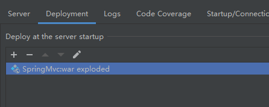

# Spring

#### Bean对象实例化模拟

定义Bean属性对象

思路：

1. 定义Bean工厂接口，提供获取bean方法
2. 定义Bean工厂接口实现类，计息 

###### 1.定义Bean属性对象

用来接受配置文件中Bean标签的id和class属性值

```java
package com.xxxx.spring;

/**
 * 用来存放配置文件中id和class
 */
public class MyBean {
    private String id;
    private String clazz;

    public MyBean() {
    }

    public MyBean(String id, String clazz) {
        this.id = id;
        this.clazz = clazz;
    }

    public String getId() {
        return id;
    }

    public void setId(String id) {
        this.id = id;
    }

    public String getClazz() {
        return clazz;
    }

    public void setClazz(String clazz) {
        this.clazz = clazz;
    }
}

```

###### 2.引入dom4j依赖和xPath(jaxen)

```xml
<!-- https://mvnrepository.com/artifact/org.dom4j/dom4j -->
    <dependency>
      <groupId>org.dom4j</groupId>
      <artifactId>dom4j</artifactId>
      <version>2.1.3</version>
    </dependency>
    <!-- https://mvnrepository.com/artifact/jaxen/jaxen -->
    <dependency>
      <groupId>jaxen</groupId>
      <artifactId>jaxen</artifactId>
      <version>1.1.6</version>
    </dependency>
```

###### 3.自定义配置文件

```xml
<?xml version="1.0" encoding="UTF-8"?>
<beans>
    <!--设置javaBean对应的bean标签-->
    <bean id="UserDao" class="com.xxxx.dao.UserDao"></bean>
    <bean id="userService" class="com.xxxx.service.UserService"></bean>
</beans>
```

###### 4.定义Bean工厂

```java
package com.xxxx.spring;
/**
 * 工厂的目的是提供规范
 * Bean工厂接口：
 *          通过id属性值获取变量
 */
public interface MyFactory {
    public Object getBean(String id);
}

```

###### 5.定义Bean接口实现类

```java
package com.xxxx.spring;

import org.dom4j.*;
import org.dom4j.io.SAXReader;
import java.net.URL;
import java.util.ArrayList;
import java.util.HashMap;
import java.util.List;
import java.util.Map;

/**   这是MyFactory工厂的具体实现类
 * 模拟spring实现：
 *      1、通过带参构造器获得对应的配置文件
 *      2、通过dom4j解析配置文件 ，得到list集合（存放bean标签的id和class属性）
 *      3、通过反射得到对应的实例化对象，存放在map对象中（通过遍历list集合，获取对应的class属性） class.forName(class).newInstance();
 *      4、通过id获取指定的实例化对象
 */
public class MyClassPathApplicationContext implements MyFactory{

    private List<MyBean> beanList;//存放从配置文件中获得到的bean标签的消息（myBean代表的就是每一个bean标签）
    private Map<String,Object> beanMap = new HashMap<>();

    public MyClassPathApplicationContext(String fileName) {
        /*通过dom4j解析配置文件 ，得到list集合（存放bean标签的id和class属性）*/
        this.parseXml(fileName);
        /*通过反射得到对应的实例化对象*/
        this.instanceBean();
    }


    /**
     * 通过dom4j解析配置文件 ，得到list集合（存放bean标签的id和class属性）
     *      1、获取解析器
     *      2、获取配置文件的url
     *      3、解析配置文件xml
     *      4、通过Xpath语法解析，获取beans标签下所有的bean标签
     *      5、通过指定的语法解析文档对象，返回元素集合
     *      6、判断元素集合是否为空
     *          不为空：遍历集合
     *      7、获取bean标签元素的属性，id和class
     *      8、获取MyBean对象，再将id和class属性值设置到对象中，再将对象设置为MyBean的集合中
     * @param fileName
     */
    private void parseXml(String fileName) {
        //获取解析器
        SAXReader saxReader = new SAXReader();
        //获取配置文件和url
        URL url = this.getClass().getClassLoader().getResource(fileName);
        //学习Xpath语法
        try {
            Document document = saxReader.read(url);
            XPath xPath = document.createXPath("beans/bean");
            //通过指定的语法解析文档对象，返回元素集合
            List<Node> elementList = xPath.selectNodes(document);
            //判断元素集合是否为空
            if(elementList!=null && elementList.size()>0){
                //实例化beanList
                beanList = new ArrayList<>();
                for(Node e : elementList){
                    String id = e.valueOf("id");
                    String clazz = e.valueOf("class");
                    MyBean myBean = new MyBean(id,clazz);
                    beanList.add(myBean);
                }
            }

        } catch (DocumentException e) {
            e.printStackTrace();
        }
    }

    /**
     * 通过反射得到对应的实例化对象，放置在map对象
     *  1.判断对象集合是否为空，如果不为空，则遍历集合，获取对象的id和class属性
     *  2.通过类的全路径名，反射得到实例化对象 Class.forName(class).newInstance();
     *  3.将bean对象放入map对象中
     */
    private void instanceBean() {
        if(beanList!=null&& beanList.size()>0){
            for(MyBean bean : beanList){
                String id = bean.getId();
                String clazz = bean.getClazz();
                try {
                    Object object = Class.forName(clazz).newInstance();
                    beanMap.put(id,object);
                } catch (Exception e) {
                    e.printStackTrace();
                }

            }
        }
    }

    @Override
    public Object getBean(String id) {
        return beanMap.get(id);
    }
}
```

### Spring核心技术

使用的到技术：

1. 工厂设计模式（简单工厂  工厂方法  抽象工厂）
2. XML解析（dom4j）
3. 反射技术（实例化对象   反射获取方法，获取属性，构造器）
4. 策略模式（加载资源）
5. 单例模式（IoC实例化对象）

# SpringMVC

### 创建Maven Web项目

Spring框架是sun公司对servlet的封装

核心：DispatcherServlet

### 配置SpringMvc核心控制器

在web.xml写配置文件

```xml
<web-app>
  <display-name>Archetype Created Web Application</display-name>
  <!--核心控制器，本质是servlet-->
  <servlet>
    <servlet-name></servlet-name>
    <servlet-class></servlet-class>
  </servlet>
  
  <servlet-mapping>
    <servlet-name></servlet-name>
    <url-pattern></url-pattern>
  </servlet-mapping>
</web-app>
```

然后创建包，创建DispatcherServlet（完全按照SprinngMVC），其是Servlet，因此继承HttpServlet，并重写doget，dopost方法

```java
/**
 * 核心控制器
 */
public class DispatcherServlet extends HttpServlet {

    @Override
    protected void doPost(HttpServletRequest req, HttpServletResponse resp) throws ServletException, IOException {
        this.doPost(req, resp);
    }

    @Override
    protected void doGet(HttpServletRequest req, HttpServletResponse resp) throws ServletException, IOException {
        this.doGet(req, resp);
    }
}

```

完成配置文件

```xml
<web-app>
  <display-name>Archetype Created Web Application</display-name>
  <!--核心控制器，本质是servlet-->
  <servlet>
    <servlet-name>DispatherServler</servlet-name>
    <servlet-class>com.springmvc.servlet.DispatcherServlet</servlet-class>
    <!--SpringMVC 配置文件（一般方在resource下）-->
    <init-param>
      <param-name>contextConfigLocation</param-name><!--官方的名字-->
      <param-value>classpath:springmvc.xml</param-value><!--resource下创建该文件-->
    </init-param>
    <load-on-startup>1</load-on-startup><!--Web服务器一旦启动，Servlet就会实例化创建对象和初始化-->
  </servlet>
  
  <servlet-mapping>
    <servlet-name>DispatherServler</servlet-name>
    <url-pattern>/</url-pattern><!--写一个 / 表示所有请求都会被此拦截-->
  </servlet-mapping>
</web-app>
```

我们导入project lombok依赖，注意在setting上添加插件

### 创建业务逻辑层和控制器

```java
public interface UserService {
    List<User> findUser(String name);
}

```

```java
//我们不实现数据库，这里简单模拟一下
public class UserServiceImpl implements UserService {
    @Override
    public List<User> findUser(String name) {
        //模拟一下数据
        List<User> users = new ArrayList<>();
        users.add(new User(1,"老王","admin"));
        users.add(new User(2,"小王","1234"));
        return users;
    }
}
```

```java
@Data//Lombok的注解
@AllArgsConstructor
@NoArgsConstructor
public class User {
    private Integer id;
    private String name;
    private String pass;
}
```

```java
public class UserController {
    //注入servcie层对象
    //这里没有Autowired注解了，需要自己实现
    UserService userService;

    public String findUsers(HttpServletRequest request, HttpServletResponse response,String name){
        response.setContentType("/text/html;charset=utf-8");//为了防止乱码
        try {
            List<User> users = userService.findUser(name);
            PrintWriter out = response.getWriter();
            out.print("<h1>SpringMvc控制器："+name);
        } catch (IOException e) {
            e.printStackTrace();
        } finally {
        }
        return "";
    }
}
```

### 自定义注解

需要自己实现注解`@Service` , `@Controller` , `@Autowired` ,`@RequestMapping`, `@RequestParam`

```java
@Target(ElementType.TYPE)//表示作用在类上
@Retention(RetentionPolicy.RUNTIME)//作用范围
@Documented
public @interface Service {
    String value() default "";//后续可以给Service加上name属性
}
```

```java
@Target(ElementType.TYPE)
@Retention(RetentionPolicy.RUNTIME)
@Documented
public @interface Controller {
    String value() default "";
}
```

```java
@Target(ElementType.FIELD)
@Retention(RetentionPolicy.RUNTIME)
@Documented
public @interface Autowired {
    String value() default "";
}
```

```java
@Target(ElementType.PARAMETER)
@Retention(RetentionPolicy.RUNTIME)
@Documented
public @interface RequestParam {
    String value() default "";
}
```

光使用注解只是一个标签，后续需要反射实现

### 创建Spring容器

需要让框架在运行的时候读取配置文件，contextConfigLocation，读取到 springmvc.xml

在DispatherServlet创建init方法

```java
private WebApplicationContext webApplicationContext;

    @Override
    public void init() throws ServletException {
        //servlet初始化的时候，读取初始化参数
        String contextConfigLocation  = this.getServletConfig().getInitParameter("contextConfigLocation");//这是servlet的方法
        //创建Spring容器,取名 webApplicationContext
        webApplicationContext = new WebApplicationContext(contextConfigLocation);//通过构造方法传递
        //定义方法初始化容器
		//......下一步
    }
```

### Dom4J解析配置文件


```java
//解析器
public class XmlPaser {
    public static String getBasePackage(String xml){
        try {
            //我们想获得<component-scan base-package="com.bruce.servlet,com.bruce.controller"></component-scan>
            SAXReader saxReader =  new SAXReader();
            InputStream inputStream =  XmlPaser.class.getClassLoader().getResourceAsStream(xml);
            Document document = saxReader.read(inputStream);//read方法需要抛出异常
            //获取根节点
            Element rootElement = document.getRootElement();
            Element componentScan = rootElement.element("component-scan");
            //取出属性
            Attribute attribute = componentScan.attribute("base-package");
            String basePackage = attribute.getText();
            return basePackage;

        } catch (DocumentException e) {
            e.printStackTrace();
        } finally {
        }
		return "";
    }
}
```

### 扫描SpringMvc中的类

webApplicationContext容器：

```java
public class WebApplicationContext {
    //classpath:spring.xml
    String contextConfigLocation;
    List<String> classNameList = new ArrayList<>();

    public WebApplicationContext(String contextConfigLocation) {
        this.contextConfigLocation = contextConfigLocation;
    }
    //定义refresh方法初始化容器
    public void refresh(){
        //1.解析spring.xml 配置文件
        String basePackage = XmlPaser.getBasePackage(contextConfigLocation.split(":")[1]);
        String[] basePackages = basePackage.split(",");
        if(basePackages.length>0){
            for(String pack :basePackages){
                //这里拿到了两个路径,然后我们执行扫描
                executeScanPackage(pack);//我们得找到包下对应的类
            }
            System.out.println("扫描之后的"+classNameList);
        }
    }
    //扫描包
    public void executeScanPackage(String pack){
        // 将 com.bruce.service 转为 /com/bruce/service
        URL url = this.getClass().getClassLoader().getResource("/" + pack.replaceAll("\\.", "/"));
        String path = url.getFile();
        File dir = new File(path);//得到的是文件夹 /com/bruce/service
        for(File f:dir.listFiles()){
            if(f.isDirectory()){//表示当前是文件夹
                //则递归调用，比如 com.bruce.service.impl 则加一个点，加上impl继续查询
                executeScanPackage(pack+"."+f.getName());
            }else{
                //文件目录下的文件  com.bruce.service.impl.userService(不需要.class后缀)
                String className = pack+"."+f.getName().replaceAll(".class","");
                //我们找打className后之后得实例化他们，所以先存起来
                classNameList.add(className);//相当于作了扫描，得到了类的全路径名称，之后用于反射
            }
        }
    }

}
```

配置tomcat测试



### 实例化容器中的对象

我们创建一个自定义异常

```java
/**
 * 自定义异常，需要继承Exception或者RuntimeException
 */
public class ContextException extends RuntimeException {
    public ContextException(String message) {
        super(message);
    }

    public ContextException(Throwable cause) {
        super(cause);
    }


    @Override
    public String getMessage() {
        return super.getMessage();
    }
}
```

```java
//refresh的下一步
/**
     * 实例化bean对象
     */
    public void executeInstance(){
        if(classNameList.size()==0){
            //没有需要扫描的类，我们创建异常类来抛出异常
            throw new ContextException("没有要实例化的class");
        }
        try {
            for(String className:classNameList){
                Class<?> clazz = Class.forName(className);
                if(clazz.isAnnotationPresent(Controller.class)){//该方法是判断该类是否有注解
                    //首字母转小写 UserController -> userController
                    String beanName = clazz.getSimpleName().substring(0, 1).toLowerCase() + clazz.getSimpleName().substring(1);
                    //放入Map中
                    iocMap.put(beanName,clazz.newInstance());
                }else if(clazz.isAnnotationPresent(Service.class)){
                    //如果是业务层的，先将注解取出，我们想获得注解的value值
                    Service serviceAnnotation = clazz.getAnnotation(Service.class);
                    String beanName = serviceAnnotation.value();
                    //有的时候没有定义名字，就以接口的名字作为bean的名字
                    if("".equals(beanName)){
                        Class<?>[] interfaces = clazz.getInterfaces();
                        for(Class<?> c1 :interfaces){
                            String beanName1 = c1.getSimpleName().substring(0, 1).toLowerCase() + c1.getSimpleName().substring(1);
                            iocMap.put(beanName1,clazz.newInstance());
                        }
                    }else{
                        iocMap.put(beanName,clazz.newInstance());
                    }
                }
            }
        } catch (Exception e) {
            e.printStackTrace();
        } finally {
        }
    }
```

### 将容器中的对象自动装配

```java
public void executeAutowired(){
        //判断容器是否为空，抛出异常
        try {
            if(iocMap.isEmpty()){
                throw new ContextException("没有找到初始化的bean对象");
            }
            //迭代
            for(Map.Entry<String, Object> entry: iocMap.entrySet()){
                String key = entry.getKey();
                Object bean = entry.getValue();
                //取出属性
                Field[] declaredFields = bean.getClass().getDeclaredFields();
                for(Field declaredField:declaredFields){
                    if(declaredField.isAnnotationPresent(Autowired.class)){
                        Autowired autowiredAnnotation = declaredField.getAnnotation(Autowired.class);
                        String beanName = autowiredAnnotation.value();//极有可能是空的，取决与有没有命名
                        if("".equals(beanName)){
                            Class<?> type = declaredField.getType();
                            beanName = type.getSimpleName().substring(0,1).toLowerCase()+type.getSimpleName().substring(1);
                        }
                        declaredField.setAccessible(true);//如果属性是私有的，也暴力注入
                        declaredField.set(bean,iocMap.get(beanName));//执行完后就完成注入了

                    }
                }
            }
        } catch (ContextException e) {
            e.printStackTrace();
        } catch (IllegalAccessException e) {
            e.printStackTrace();
        } finally {
        }
    }
```

### 初始化请求映射

我们创建handler包，自定义MyHandler注解

```java
@Data
@AllArgsConstructor
@NoArgsConstructor
public class MyHandler {
    private String url;
    private Object controller;
    private Method method;
}
```

```java
/**
 * 初始化请求映射
 * 1、先判断map是否有bean对象
 * 2、迭代map，entry
 *      取出value，在检查其上面是否有Controller注解
 *          取出所有方法，迭代，检查是否有RequestMapping注解
 *          取出值url，如 ／user/query
 */
public void initHandlerMapping(){
    if(webApplicationContext.iocMap.isEmpty()){
        throw new ContextException("Spring容器为空");
    }
    for(Map.Entry<String,Object> entry:webApplicationContext.iocMap.entrySet()){
        Class<?> clazz = entry.getValue().getClass();
        if(clazz.isAnnotationPresent(Controller.class)){
            Method[] declaredMethods = clazz.getDeclaredMethods();
            for(Method declaredMethod:declaredMethods){
                if(declaredMethod.isAnnotationPresent(RequestMapping.class)){
                    RequestMapping requestMappingAnnotation = declaredMethod.getAnnotation(RequestMapping.class);
                    // /user/query
                    String url = requestMappingAnnotation.value();
                    MyHandler handler= new MyHandler(url,entry.getValue(),declaredMethod);
                    handlerList.add(handler);
                }
            }
        }
    }                                                                                                                                                                                                                                                                         
}
```

### 分发用户请求

```java
public void executeDispatch(HttpServletRequest req, HttpServletResponse resp){
        MyHandler handler = getHandler(req);
        try {
            if(handler==null){
                resp.getWriter().println("<h1>404 NOT FOUND</h1> ");
            }else{
                Class<?>[] parameterTypes = handler.getMethod().getParameterTypes();
                //定义一个参数的数组集合
                Object[] params = new Object[parameterTypes.length];
                //取下用户请求的参数
                Map<String,String[]> parameterMap = req.getParameterMap();
                for(Map.Entry<String,String[]> entry:parameterMap.entrySet()){
                    String value = entry.getValue()[0];
                    params[2] = value;//这里知道findUser第三个参数是name ， 后期有待优化
                }
                params[0] = req;
                params[1] = resp;

                handler.getMethod().invoke(handler.getController(),params);//就可以调用控制器的方法了
            }

        } catch (Exception e) {
            e.printStackTrace();
        } finally {
        }
    }

    //根据Request请求去匹配handler
    public MyHandler getHandler(HttpServletRequest req){
        String requestURI = req.getRequestURI();// 得到 /user/query
        for(MyHandler myHandler:handlerList){
            if(myHandler.getUrl().equals(requestURI)){
                return myHandler;
            }
        }
        return null;
    }

/*
invoke 方法
method对象.invoke(类，参数列表 )
*/
```

### 控制器方法接收参数思路

上一节有问题：方法参数固定

```java
 params[0] = req;
 params[1] = resp;
```

### 反射RequestParam注解

优化：

```java
param[2] = value;
```

```java
for(Map.Entry<String,String[]> entry:parameterMap.entrySet()){
                    String value = entry.getValue()[0];
                    String name = entry.getKey();
                    int index = hasRequestParam(handler.getMethod(), name);
                    if(index!=-1){
                        params[index] = value;
                    }
                }
```

```java
/**
     * 判断控制器方法的参数，是否有RequestParam注解，且知道对应value值，返回参数位置
     * @param method
     * @param name
     * @return
     */
    public int hasRequestParam(Method method,String name){
        Parameter[] parameters = method.getParameters();
        for(int i = 0;i<parameters.length;i++){
            Parameter p = parameters[i];
            boolean b = p.isAnnotationPresent(RequestParam.class);
            if(b){
                RequestParam requestParam = p.getAnnotation(RequestParam.class);
                String requestParamValue = requestParam.value();
                if(name.equals(requestParamValue)){
                    return i;
                }
            }

        }
        return -1;
    }
```

### 反射控制器方法名

```java
for(Map.Entry<String,String[]> entry:parameterMap.entrySet()){
                    String value = entry.getValue()[0];
                    String name = entry.getKey();
                    int index = hasRequestParam(handler.getMethod(), name);
                    if(index!=-1){
                        params[index] = value;
                    }else{
                        List<String> names = getParameterNames(handler.getMethod());
                        //这里names获取的默认是arg0,arg1,arg2，而使用jdk
                        for(int i = 0;i<names.size();i++){
                            if(name.equals(names.get(i))){
                                params[i] = value;
                                break;
                            }
                        }
                    }

                }
                /*params[0] = req;
                params[1] = resp;*/
```

```java
public List<String> getParameterNames(Method method){
    List<String> list = new ArrayList<>();
    Parameter[] parameters = method.getParameters();
    for(Parameter parameter:parameters){
        list.add(parameter.getName());
    }
    return list;
}
```

控制器方法返回值为string的情况

```java
//当控制器方法返回String时，返回一个视图，需要配置视图解析器
```

```
Object result = handler.getMethod().invoke(handler.getController(), params);//方法返回值
if(result instanceof String){
    //跳转jsp
    String viewName = (String) result;
    if(viewName.contains(":")){//则说明是 forward://redirect//之类的格式
        String viewType = viewName.split(":")[0];
        String viewPage = viewName.split(":")[0];
        if(viewType.equals("forward")){
            req.getRequestDispatcher(viewPage).forward(req,resp);//转发到指定视图上
        }else{
            resp.sendRedirect(viewPage);
        }
    }else{
        req.getRequestDispatcher(viewName).forward(req,resp);
    }
```

### 反射ResponseBody注解

